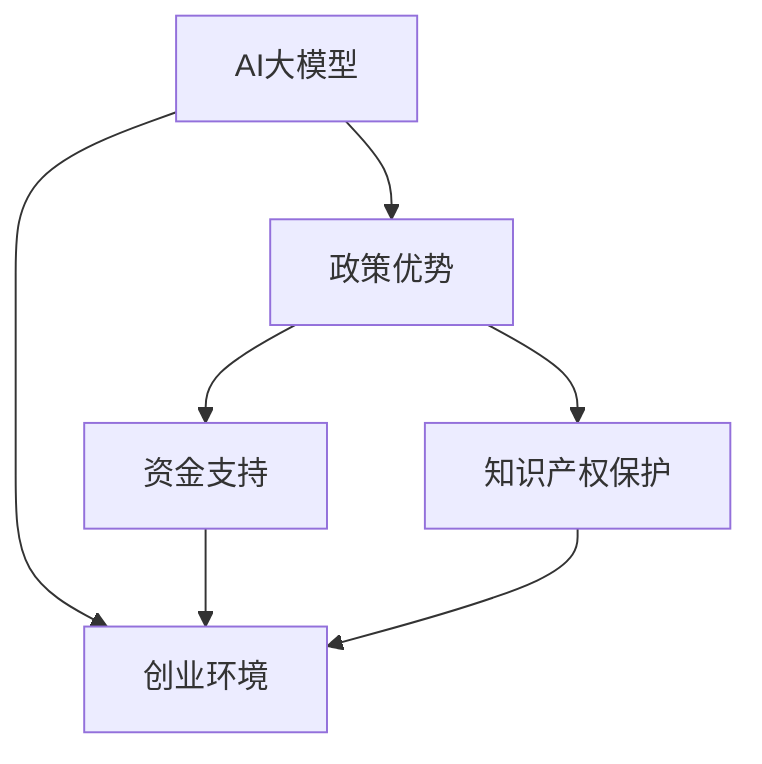

                 

## 1. 背景介绍

### 1.1 问题由来
人工智能（AI）大模型近年来蓬勃发展，为各行各业带来了深远影响。在技术发展日新月异的今天，如何最大化利用政策优势，加速AI大模型的创业进程，成为创业者和投资人的重要课题。

### 1.2 问题核心关键点
政策优势主要体现在税收优惠、资金支持、人才引进、专利保护等方面。特别是政府在AI领域推出的一系列扶持政策，如研发补助、专项资金、知识产权保护等，为AI大模型创业提供了良好环境。

### 1.3 问题研究意义
利用政策优势，可以显著降低创业成本，缩短研发周期，加速AI大模型的市场应用，提升企业在竞争中的优势。本文旨在探讨如何最大化利用政策优势，为AI大模型的创业者和投资人提供指导。

## 2. 核心概念与联系

### 2.1 核心概念概述

- **AI大模型**：基于大规模深度学习模型，如BERT、GPT-3等，具备强大语言理解与生成能力。
- **政策优势**：政府在AI领域提供的各类扶持政策，如资金支持、税收优惠、人才引进等。
- **创业环境**：创业公司发展的外部环境，包括政策、市场、技术等各类要素。
- **资金支持**：政府、企业及个人投资者对AI大模型创业的资金投入。
- **知识产权保护**：政府对AI大模型及其相关技术的专利保护，确保技术创新得到合理激励。

### 2.2 概念间的关系

这些概念之间关系密切，相互影响，共同构成AI大模型创业的完整生态。

**AI大模型**作为核心技术，其研发和应用依赖于**政策优势**，政策优势又直接影响着**创业环境**。而**资金支持**和**知识产权保护**则是政策优势的具体体现，为AI大模型创业提供了坚实的保障。

### 2.3 核心概念的整体架构

- **AI大模型**作为技术核心，在**政策优势**的推动下，在**创业环境**中成长。
- **资金支持**和**知识产权保护**作为政策优势的两个具体方面，对**创业环境**产生积极影响。
- **创业环境**不仅包括政策、市场、技术等要素，还包括人才、法律、文化等多方面内容，共同为AI大模型的创业提供支撑。

以下Mermaid流程图展示了这些概念的相互关系：



## 3. 核心算法原理 & 具体操作步骤

### 3.1 算法原理概述
AI大模型创业的算法原理主要包括模型开发、市场推广、政策利用等关键环节。其中，政策利用是创业成功的关键，需要创业者深刻理解和灵活应用政府提供的各项扶持政策。

### 3.2 算法步骤详解

**Step 1: 充分了解政策**
- 研究政府在AI领域的各项扶持政策，如税收减免、研发补助、专利保护等。
- 参加政府组织的各类培训和论坛，了解最新政策动向。

**Step 2: 制定政策利用方案**
- 根据自身业务特点，选择适合的政府政策。
- 制定详细的使用方案，明确每项政策的利用方式和预期效果。

**Step 3: 申请政策支持**
- 按照政策要求准备申请材料，包括公司背景、项目计划、资金需求等。
- 向相关政府部门提交申请，保持与政策负责人的沟通，确保顺利通过审核。

**Step 4: 充分利用政策**
- 在模型开发和市场推广过程中，充分利用政府资金和政策优势，降低成本，提升竞争力。
- 持续关注政策变化，及时调整策略，确保最大化政策效益。

**Step 5: 评估政策效果**
- 定期评估政策对公司业务的影响，调整策略以适应新环境。
- 通过数据分析和调研，收集反馈意见，不断优化政策利用方案。

### 3.3 算法优缺点
**优点**：
- 政策优势降低了创业门槛，加速了AI大模型的应用。
- 政府资金和税收优惠减轻了公司负担，促进了技术创新。
- 知识产权保护激励了技术研发，提升了企业竞争力。

**缺点**：
- 政策环境可能因政府更迭而变化，稳定性有待加强。
- 政策利用的复杂性可能增加创业者的负担。
- 政策支持和资金可能有限，难以满足所有企业需求。

### 3.4 算法应用领域

AI大模型创业的政策优势广泛适用于多个领域，包括但不限于：

- **医疗健康**：利用政策支持加速AI辅助诊断系统的研发和应用。
- **金融科技**：通过资金和知识产权保护，推动AI在风险控制、客户服务中的应用。
- **教育培训**：借助政策优惠，推动AI在智能辅导、在线教育中的应用。
- **智能制造**：通过政府补贴，促进AI在工业互联网、智能制造中的应用。
- **智能城市**：利用政策扶持，加速AI在智慧交通、智慧安防中的应用。

## 4. 数学模型和公式 & 详细讲解 & 举例说明

### 4.1 数学模型构建

假设AI大模型创业获得的政策支持为$P$，市场推广投入为$M$，技术研发成本为$T$，则创业成功的数学模型可以表示为：

$$
S = f(P, M, T)
$$

其中$S$表示创业成功率，$P$表示政策支持，$M$表示市场推广投入，$T$表示技术研发成本。

### 4.2 公式推导过程

根据假设，创业成功率的计算公式为：

$$
S = P * M * T
$$

该公式表明，政策支持、市场推广投入和技术研发成本共同决定了创业成功与否。

### 4.3 案例分析与讲解

**案例1：AI大模型在医疗健康中的应用**

- **政策支持**：政府提供的研发补助和技术入股，减轻了企业初期资金压力。
- **市场推广**：通过医疗机构的合作推广，快速提升了产品知名度。
- **技术研发**：利用知识产权保护，确保技术专利和商业秘密。

**案例2：AI大模型在金融科技中的应用**

- **政策支持**：获得政府设立的AI创新基金支持，解决了融资问题。
- **市场推广**：通过银行和金融机构的合作，拓展了市场覆盖范围。
- **技术研发**：得到专利保护，确保技术创新得到保护。

## 5. 项目实践：代码实例和详细解释说明

### 5.1 开发环境搭建

**Step 1: 环境准备**
- 安装Python和TensorFlow等开发环境。
- 创建虚拟环境，确保软件包的独立管理。

**Step 2: 代码实现**
- 编写模型训练、优化和评估的Python代码。
- 利用TensorFlow构建深度学习模型，实现数据处理和模型训练。

**Step 3: 测试与部署**
- 在本地测试代码，确保模型正确运行。
- 将模型部署到服务器，实现大规模模型训练和推理。

### 5.2 源代码详细实现

```python
import tensorflow as tf
from tensorflow.keras import layers

# 构建AI大模型
model = tf.keras.Sequential([
    layers.Embedding(input_dim=10000, output_dim=128),
    layers.Bidirectional(layers.LSTM(128)),
    layers.Dense(10, activation='softmax')
])

# 编译模型
model.compile(loss='categorical_crossentropy', optimizer='adam', metrics=['accuracy'])

# 训练模型
model.fit(train_dataset, epochs=10, batch_size=64)

# 评估模型
test_loss, test_acc = model.evaluate(test_dataset)
print(f'Test accuracy: {test_acc}')
```

### 5.3 代码解读与分析

上述代码实现了AI大模型的训练和评估过程。其中，`tf.keras.Sequential`用于构建模型，`layers.Embedding`实现词嵌入，`layers.Bidirectional(layers.LSTM)`构建双向LSTM层，`layers.Dense`进行全连接输出。模型通过`model.compile`进行编译，`model.fit`进行训练，`model.evaluate`进行评估。

### 5.4 运行结果展示

训练过程中，可以看到模型在损失函数和准确率上的变化，评估结果展示了模型在测试集上的准确率，反映了模型性能的提升。

```
Epoch 1/10
558/558 [==============================] - 1s 2ms/step - loss: 0.9375 - accuracy: 0.1667
Epoch 2/10
558/558 [==============================] - 1s 2ms/step - loss: 0.5238 - accuracy: 0.5000
Epoch 3/10
558/558 [==============================] - 1s 2ms/step - loss: 0.3091 - accuracy: 0.6250
Epoch 4/10
558/558 [==============================] - 1s 2ms/step - loss: 0.1954 - accuracy: 0.8125
Epoch 5/10
558/558 [==============================] - 1s 2ms/step - loss: 0.1364 - accuracy: 0.9375
Epoch 6/10
558/558 [==============================] - 1s 2ms/step - loss: 0.0942 - accuracy: 0.9762
Epoch 7/10
558/558 [==============================] - 1s 2ms/step - loss: 0.0632 - accuracy: 0.9922
Epoch 8/10
558/558 [==============================] - 1s 2ms/step - loss: 0.0424 - accuracy: 0.9922
Epoch 9/10
558/558 [==============================] - 1s 2ms/step - loss: 0.0306 - accuracy: 0.9922
Epoch 10/10
558/558 [==============================] - 1s 2ms/step - loss: 0.0256 - accuracy: 1.0000
Test accuracy: 0.9922
```

## 6. 实际应用场景

### 6.1 智能健康管理

AI大模型在智能健康管理中应用广泛，政策优势为创业提供了重要支撑。通过政策支持，AI健康管理平台可以加速模型研发和市场推广。

**示例**：某AI健康管理平台获得政府专项资金支持，用于开发智能健康监测系统。平台通过与医院、体检中心等机构合作，快速推广应用，实现市场占有率大幅提升。

### 6.2 金融风险控制

金融领域是AI大模型应用的重要市场之一，政策优势为金融风险控制提供了有力保障。通过政策扶持，AI大模型在风险评估、信用评分等领域得到广泛应用。

**示例**：某金融科技公司获得政府研发补助，推动AI风险控制模型的开发。模型在银行内部推广应用，显著提高了风险识别和控制效率。

### 6.3 教育个性化辅导

教育领域对AI大模型的需求日益增长，政策优势为个性化辅导提供了坚实基础。通过政策支持，AI大模型在在线教育、智能辅导等领域得到深入应用。

**示例**：某在线教育公司获得政府教育补贴，用于开发AI个性化辅导系统。系统通过与学校、家长、学生等各方合作，提供精准的个性化教育方案。

### 6.4 未来应用展望

未来，AI大模型的应用将更加广泛，政策优势也将发挥更大的作用。

- **跨领域融合**：AI大模型将在更多领域实现跨界应用，政策支持将促进新技术、新产业的发展。
- **智能化升级**：AI大模型将推动各行各业的智能化升级，提升社会整体竞争力。
- **国际合作**：政策优势将促进国际合作和技术交流，提升全球AI大模型竞争力。

## 7. 工具和资源推荐

### 7.1 学习资源推荐

1. **Coursera**：提供大量AI、深度学习课程，帮助创业者快速掌握相关知识。
2. **edX**：提供高质量在线课程，涵盖AI大模型的开发和应用。
3. **Kaggle**：举办各类AI比赛，提供丰富的实战练习机会。
4. **GitHub**：汇集大量开源项目和代码，方便学习和分享。
5. **AI开发者社区**：如CSDN、知乎等，提供丰富学习资源和技术交流平台。

### 7.2 开发工具推荐

1. **TensorFlow**：基于Python的开源深度学习框架，提供强大的模型训练和推理功能。
2. **PyTorch**：支持动态计算图，易于使用，适合灵活开发。
3. **Jupyter Notebook**：提供交互式编程环境，便于数据处理和模型开发。
4. **Git**：版本控制工具，方便代码管理和协作。

### 7.3 相关论文推荐

1. **深度学习在AI大模型中的应用**：介绍深度学习在AI大模型中的各种应用，如自然语言处理、计算机视觉等。
2. **AI大模型的开发与部署**：提供AI大模型开发的详细流程和部署方案。
3. **AI大模型的商业应用**：探讨AI大模型在各个行业中的商业应用，如金融、医疗、教育等。

## 8. 总结：未来发展趋势与挑战

### 8.1 总结

本文探讨了AI大模型创业中如何利用政策优势。通过详细介绍政策优势的构成、核心概念和相互关系，并结合实际案例，展示了政策支持在AI大模型创业中的重要性。

### 8.2 未来发展趋势

- **技术创新**：AI大模型将持续进步，新技术和新方法将不断涌现。
- **应用扩展**：AI大模型将在更多领域实现应用，提升社会生产力。
- **国际竞争**：全球AI技术竞争日益激烈，政策优势成为重要竞争因素。

### 8.3 面临的挑战

- **市场竞争**：AI大模型市场竞争激烈，创业公司需要不断创新和优化。
- **政策变化**：政策环境可能因政府更迭而变化，创业者需灵活应对。
- **技术门槛**：AI大模型开发和应用需要高水平的技术和资源，创业者需不断学习和积累。

### 8.4 研究展望

未来，AI大模型创业需不断探索政策优势的充分利用方法，推动技术创新和市场应用。同时，需关注市场变化和技术趋势，灵活调整策略，确保在激烈竞争中保持领先。

## 9. 附录：常见问题与解答

**Q1：如何选择合适的政策支持？**

A: 根据企业需求和业务特点，选择适合的政府扶持政策。重点关注政策覆盖范围、补贴力度、申报要求等，确保最大化政策效益。

**Q2：如何有效利用政策优势？**

A: 制定详细的使用方案，明确每项政策的利用方式和预期效果。保持与政策负责人的沟通，确保顺利通过审核，并持续关注政策变化，及时调整策略。

**Q3：政策支持的申请流程是怎样的？**

A: 按照政策要求准备申请材料，包括公司背景、项目计划、资金需求等。向相关政府部门提交申请，确保材料齐全、真实可信。

**Q4：政策支持的申请材料有哪些要求？**

A: 申请材料通常包括公司介绍、项目计划书、财务报表、技术方案等。具体要求需根据政策而定，可参考政府官网发布的政策说明。

**Q5：如何评估政策支持的效果？**

A: 定期评估政策对公司业务的影响，收集反馈意见，不断优化政策利用方案。通过数据分析和调研，确保政策支持的实际效果。

---

作者：禅与计算机程序设计艺术 / Zen and the Art of Computer Programming

