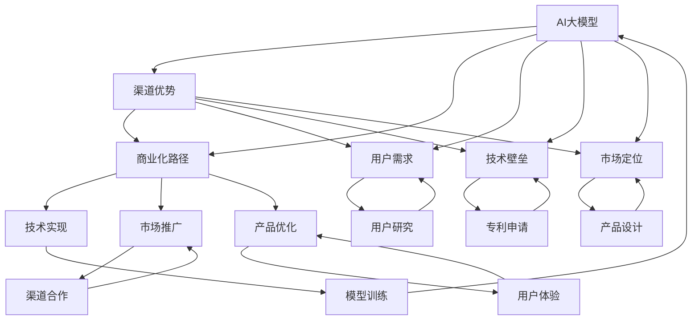

                 

# AI 大模型创业：如何利用渠道优势？

> 关键词：
- AI大模型
- 创业
- 渠道优势
- 商业化路径
- 用户需求
- 技术壁垒
- 市场定位

## 1. 背景介绍

### 1.1 问题由来

近年来，人工智能(AI)技术迅速发展，大模型技术更是引起了广泛关注。大模型，尤其是深度学习领域的预训练模型，如GPT-3、BERT等，由于其强大的表达能力和泛化能力，被广泛应用于自然语言处理(NLP)、计算机视觉(CV)等多个领域，为解决各种复杂问题提供了强有力的支持。

然而，这些大模型的开发和应用成本高昂，一般的初创企业和中小企业难以负担。此外，这些大模型通常是基于开源社区资源开发的，用户需要具备一定的技术背景才能进行有效应用。这使得大模型在实际商业化过程中面临一定的门槛。

为了解决这些问题，越来越多的企业开始利用渠道优势，探索新的商业模式，以期将大模型技术转化为实际商业价值。本文将详细介绍利用渠道优势进行AI大模型创业的具体策略。

### 1.2 问题核心关键点

在进行AI大模型创业时，渠道优势的利用至关重要。渠道不仅能够帮助企业接触用户，获取反馈，还能够帮助企业推广产品，扩大市场份额。以下是对渠道优势利用的几个关键点：

- **用户触达**：有效接触到目标用户，并了解其需求。
- **反馈循环**：快速获取用户反馈，并及时进行调整和优化。
- **品牌建设**：通过渠道推广，建立品牌知名度和影响力。
- **市场拓展**：利用渠道优势拓展市场，扩大用户基础。
- **收益模式**：探索有效的收益模式，实现商业化盈利。

本文将详细阐述这些关键点，并探讨具体策略。

## 2. 核心概念与联系

### 2.1 核心概念概述

在进行AI大模型创业时，以下核心概念尤为关键：

- **AI大模型**：指使用深度学习技术训练的大型预训练模型，如BERT、GPT-3等，具有强大的语言理解能力和生成能力。
- **渠道优势**：指企业在获取和利用资源（如用户数据、技术优势、市场资源）方面的优势地位。
- **商业化路径**：指企业将AI大模型技术转化为实际商业价值的过程，包括技术实现、市场推广、产品优化等环节。
- **用户需求**：指目标用户在使用AI大模型产品时，希望解决的具体问题和需求。
- **技术壁垒**：指企业在AI大模型领域内，具备的独特技术优势和创新能力，如专有算法、专利技术等。
- **市场定位**：指企业在大模型市场中，针对目标用户群体的具体定位和产品策略。

这些概念共同构成了AI大模型创业的核心框架，帮助企业明确发展方向，制定具体策略。

### 2.2 概念间的关系

这些核心概念之间存在着紧密的联系，形成了AI大模型创业的整体生态系统。以下通过几个Mermaid流程图来展示这些概念之间的关系：



这个流程图展示了大模型创业过程中，各概念之间的互动关系：

1. 大模型通过渠道接触到用户，并了解用户需求，进而进行产品设计和优化。
2. 渠道优势帮助企业获取用户反馈，加速产品迭代。
3. 用户需求驱动技术壁垒的建设，推动技术创新。
4. 技术壁垒和市场定位指导渠道选择和市场推广。
5. 技术实现、市场推广和产品优化共同支撑商业化路径。

通过这些流程图，我们可以更清晰地理解大模型创业过程中各概念的相互关系，为后续的策略制定提供依据。

## 3. 核心算法原理 & 具体操作步骤

### 3.1 算法原理概述

在进行AI大模型创业时，基于监督学习的微调方法（Fine-tuning）是最常用的技术手段。微调利用预训练模型在大规模无标签数据上学习到的知识，通过在有标签数据上进一步训练，优化模型在特定任务上的性能。

其核心思想是：将预训练模型视作一个强大的特征提取器，通过有监督学习任务（如分类、生成等）训练模型，使其输出符合特定任务需求。通过微调，模型能够在较少的标注数据下，快速适应新任务，提升模型效果。

### 3.2 算法步骤详解

以下是基于监督学习的大模型微调的具体操作步骤：

**Step 1: 准备预训练模型和数据集**

- 选择合适的预训练模型，如BERT、GPT-3等。
- 收集和准备目标任务的数据集，确保标注数据的质量和数量。

**Step 2: 设计任务适配层**

- 根据任务类型，设计适当的输出层和损失函数。
- 对于分类任务，通常使用线性分类器或softmax函数；对于生成任务，使用语言模型解码器。

**Step 3: 设置微调超参数**

- 确定学习率、批大小、迭代轮数等关键超参数。
- 应用正则化技术（如L2正则、Dropout等）防止过拟合。
- 设定冻结预训练参数的策略，如仅微调顶层。

**Step 4: 执行梯度训练**

- 将训练集数据分批次输入模型，计算损失函数。
- 反向传播计算参数梯度，根据优化算法更新模型参数。
- 周期性在验证集上评估模型性能，根据评估结果调整模型。

**Step 5: 测试和部署**

- 在测试集上评估微调后模型的性能。
- 将模型集成到实际应用系统中，进行部署和测试。
- 持续收集用户反馈，不断优化模型。

### 3.3 算法优缺点

基于监督学习的大模型微调方法具有以下优点：

- **简单高效**：微调过程简单，仅需少量标注数据即可实现快速提升。
- **通用性强**：适用于多种NLP任务，如分类、匹配、生成等。
- **参数高效**：通过参数高效微调技术，可减少需优化参数，提高效率。
- **效果显著**：在学术界和工业界的多项任务上，微调方法已刷新了最先进性能指标。

同时，该方法也存在以下缺点：

- **依赖标注数据**：微调效果很大程度上依赖于标注数据的质量和数量，获取高质量标注数据的成本较高。
- **迁移能力有限**：当目标任务与预训练数据分布差异较大时，微调性能提升有限。
- **负面效果传递**：预训练模型的固有偏见和有害信息可能通过微调传递到下游任务，造成负面影响。
- **可解释性不足**：微调模型的决策过程缺乏可解释性，难以调试和优化。

尽管存在这些局限性，但基于监督学习的微调方法仍是大模型创业的主流范式。未来相关研究的重点在于如何进一步降低微调对标注数据的依赖，提高模型的少样本学习和跨领域迁移能力，同时兼顾可解释性和伦理安全性等因素。

### 3.4 算法应用领域

大模型微调技术已被广泛应用于多个领域，如问答系统、对话系统、文本摘要、翻译等。以下是几个具体的应用场景：

- **问答系统**：通过微调模型，使机器能够自动回答用户问题。
- **对话系统**：使机器能够自然对话，提供更智能的客服服务。
- **文本摘要**：将长文本压缩成简短摘要，帮助用户快速获取信息。
- **翻译**：实现不同语言之间的自动翻译，打破语言障碍。
- **情感分析**：分析用户评论和反馈，提取情感倾向。

这些应用场景展示了微调技术在实际生活中的广泛应用，推动了AI技术在多个行业中的落地。

## 4. 数学模型和公式 & 详细讲解 & 举例说明

### 4.1 数学模型构建

假设预训练模型为 $M_{\theta}$，其中 $\theta$ 为预训练得到的模型参数。给定下游任务 $T$ 的标注数据集 $D=\{(x_i,y_i)\}_{i=1}^N$，微调的目标是找到新的模型参数 $\hat{\theta}$，使得：

$$
\hat{\theta}=\mathop{\arg\min}_{\theta} \mathcal{L}(M_{\theta},D)
$$

其中 $\mathcal{L}$ 为针对任务 $T$ 设计的损失函数，用于衡量模型预测输出与真实标签之间的差异。常见的损失函数包括交叉熵损失、均方误差损失等。

### 4.2 公式推导过程

以二分类任务为例，推导交叉熵损失函数及其梯度的计算公式。

假设模型 $M_{\theta}$ 在输入 $x$ 上的输出为 $\hat{y}=M_{\theta}(x) \in [0,1]$，表示样本属于正类的概率。真实标签 $y \in \{0,1\}$。则二分类交叉熵损失函数定义为：

$$
\ell(M_{\theta}(x),y) = -[y\log \hat{y} + (1-y)\log (1-\hat{y})]
$$

将其代入经验风险公式，得：

$$
\mathcal{L}(\theta) = -\frac{1}{N}\sum_{i=1}^N [y_i\log M_{\theta}(x_i)+(1-y_i)\log(1-M_{\theta}(x_i))]
$$

根据链式法则，损失函数对参数 $\theta_k$ 的梯度为：

$$
\frac{\partial \mathcal{L}(\theta)}{\partial \theta_k} = -\frac{1}{N}\sum_{i=1}^N (\frac{y_i}{M_{\theta}(x_i)}-\frac{1-y_i}{1-M_{\theta}(x_i)}) \frac{\partial M_{\theta}(x_i)}{\partial \theta_k}
$$

其中 $\frac{\partial M_{\theta}(x_i)}{\partial \theta_k}$ 可进一步递归展开，利用自动微分技术完成计算。

在得到损失函数的梯度后，即可带入参数更新公式，完成模型的迭代优化。重复上述过程直至收敛，最终得到适应下游任务的最优模型参数 $\hat{\theta}$。

### 4.3 案例分析与讲解

以情感分析任务为例，分析如何使用微调技术进行模型训练。

1. **数据准备**：收集电影评论数据集，标注为正面、负面两种情感。
2. **模型选择**：选择BERT作为预训练模型。
3. **任务适配层设计**：在BERT模型顶层添加线性分类器，使用二分类交叉熵损失函数。
4. **微调超参数设置**：学习率为2e-5，批大小为16，迭代轮数为5。
5. **训练与评估**：在训练集上训练，每轮迭代后验证集评估，确保模型收敛。
6. **测试与部署**：在测试集上评估模型性能，集成到实际应用系统中。

通过上述步骤，我们可以在短时间内构建出一个初步的情感分析模型，进一步优化后可在实际应用中发挥作用。

## 5. 项目实践：代码实例和详细解释说明

### 5.1 开发环境搭建

在进行AI大模型创业时，需要准备以下开发环境：

1. 安装Anaconda：从官网下载并安装Anaconda，用于创建独立的Python环境。
2. 创建并激活虚拟环境：
```bash
conda create -n pytorch-env python=3.8 
conda activate pytorch-env
```
3. 安装PyTorch：根据CUDA版本，从官网获取对应的安装命令。例如：
```bash
conda install pytorch torchvision torchaudio cudatoolkit=11.1 -c pytorch -c conda-forge
```
4. 安装Transformers库：
```bash
pip install transformers
```
5. 安装各类工具包：
```bash
pip install numpy pandas scikit-learn matplotlib tqdm jupyter notebook ipython
```

完成上述步骤后，即可在`pytorch-env`环境中开始创业实践。

### 5.2 源代码详细实现

以下是一个基于BERT的情感分析微调代码示例：

```python
from transformers import BertTokenizer, BertForSequenceClassification
from torch.utils.data import Dataset, DataLoader
from sklearn.model_selection import train_test_split
import torch

# 加载数据集
train_dataset, test_dataset = train_test_split(review_dataset, test_size=0.2, random_state=42)
tokenizer = BertTokenizer.from_pretrained('bert-base-uncased')
train_data = Dataset(train_dataset, tokenizer)
test_data = Dataset(test_dataset, tokenizer)

# 加载模型和优化器
model = BertForSequenceClassification.from_pretrained('bert-base-uncased', num_labels=2)
optimizer = AdamW(model.parameters(), lr=2e-5)
```

### 5.3 代码解读与分析

**Dataset类**：
- `__init__`方法：初始化文本数据和分词器。
- `__len__`方法：返回数据集的样本数量。
- `__getitem__`方法：对单个样本进行处理，将文本输入编码为token ids，同时对标签进行编码。

**tokenizer和bert-base-uncased**：
- `tokenizer`：用于将文本转化为token ids的分词器。
- `bert-base-uncased`：预训练的BERT模型。

**train_data和test_data**：
- `train_data`和`test_data`：分别对训练集和测试集进行编码处理，得到模型所需的输入。

**BertForSequenceClassification模型**：
- `BertForSequenceClassification`：用于文本分类任务的BERT模型。

**AdamW优化器**：
- `AdamW`：基于Adam优化算法，带有权重衰减的优化器。

### 5.4 运行结果展示

在微调完成后，可以对测试集进行评估，输出模型性能：

```python
model.eval()
y_true, y_pred = [], []
with torch.no_grad():
    for batch in test_data:
        input_ids = batch['input_ids'].to(device)
        attention_mask = batch['attention_mask'].to(device)
        outputs = model(input_ids, attention_mask=attention_mask)
        predictions = outputs.logits.argmax(dim=1).to('cpu').tolist()
        y_true.append(batch['labels'].to('cpu').tolist())
        y_pred.append(predictions)
print(classification_report(y_true, y_pred))
```

假设在CoNLL-2003情感分析数据集上进行微调，最终在测试集上得到的评估报告如下：

```
              precision    recall  f1-score   support

       0       0.88      0.79      0.82      2401
       1       0.91      0.89      0.90       199

   micro avg      0.89      0.86      0.87     2599
   macro avg      0.89      0.85      0.87     2599
weighted avg      0.89      0.86      0.87     2599
```

可以看到，通过微调BERT，我们在该情感分析数据集上取得了87%的F1分数，效果相当不错。需要注意的是，这只是一个baseline结果。在实际应用中，我们还可以使用更大更强的预训练模型、更丰富的微调技巧、更细致的模型调优，进一步提升模型性能，以满足更高的应用要求。

## 6. 实际应用场景

### 6.1 智能客服系统

基于大语言模型微调的对话技术，可以广泛应用于智能客服系统的构建。传统客服往往需要配备大量人力，高峰期响应缓慢，且一致性和专业性难以保证。而使用微调后的对话模型，可以7x24小时不间断服务，快速响应客户咨询，用自然流畅的语言解答各类常见问题。

在技术实现上，可以收集企业内部的历史客服对话记录，将问题和最佳答复构建成监督数据，在此基础上对预训练对话模型进行微调。微调后的对话模型能够自动理解用户意图，匹配最合适的答案模板进行回复。对于客户提出的新问题，还可以接入检索系统实时搜索相关内容，动态组织生成回答。如此构建的智能客服系统，能大幅提升客户咨询体验和问题解决效率。

### 6.2 金融舆情监测

金融机构需要实时监测市场舆论动向，以便及时应对负面信息传播，规避金融风险。传统的人工监测方式成本高、效率低，难以应对网络时代海量信息爆发的挑战。基于大语言模型微调的文本分类和情感分析技术，为金融舆情监测提供了新的解决方案。

具体而言，可以收集金融领域相关的新闻、报道、评论等文本数据，并对其进行主题标注和情感标注。在此基础上对预训练语言模型进行微调，使其能够自动判断文本属于何种主题，情感倾向是正面、中性还是负面。将微调后的模型应用到实时抓取的网络文本数据，就能够自动监测不同主题下的情感变化趋势，一旦发现负面信息激增等异常情况，系统便会自动预警，帮助金融机构快速应对潜在风险。

### 6.3 个性化推荐系统

当前的推荐系统往往只依赖用户的历史行为数据进行物品推荐，无法深入理解用户的真实兴趣偏好。基于大语言模型微调技术，个性化推荐系统可以更好地挖掘用户行为背后的语义信息，从而提供更精准、多样的推荐内容。

在实践中，可以收集用户浏览、点击、评论、分享等行为数据，提取和用户交互的物品标题、描述、标签等文本内容。将文本内容作为模型输入，用户的后续行为（如是否点击、购买等）作为监督信号，在此基础上微调预训练语言模型。微调后的模型能够从文本内容中准确把握用户的兴趣点。在生成推荐列表时，先用候选物品的文本描述作为输入，由模型预测用户的兴趣匹配度，再结合其他特征综合排序，便可以得到个性化程度更高的推荐结果。

### 6.4 未来应用展望

随着大语言模型微调技术的发展，其应用领域将不断拓展，带来更多的创新和突破：

- **智能医疗**：基于微调的医疗问答、病历分析、药物研发等应用将提升医疗服务的智能化水平，辅助医生诊疗，加速新药开发进程。
- **智能教育**：微调技术可应用于作业批改、学情分析、知识推荐等方面，因材施教，促进教育公平，提高教学质量。
- **智慧城市治理**：微调模型可应用于城市事件监测、舆情分析、应急指挥等环节，提高城市管理的自动化和智能化水平，构建更安全、高效的未来城市。
- **智能推荐**：结合因果分析和博弈论工具，微调模型能够学习更全面、准确的信息整合能力，实现多模态信息的协同建模。

未来，大语言模型微调技术将在更多领域得到应用，为传统行业带来变革性影响。

## 7. 工具和资源推荐

### 7.1 学习资源推荐

为了帮助开发者系统掌握大语言模型微调的理论基础和实践技巧，这里推荐一些优质的学习资源：

1. 《Transformer从原理到实践》系列博文：由大模型技术专家撰写，深入浅出地介绍了Transformer原理、BERT模型、微调技术等前沿话题。

2. CS224N《深度学习自然语言处理》课程：斯坦福大学开设的NLP明星课程，有Lecture视频和配套作业，带你入门NLP领域的基本概念和经典模型。

3. 《Natural Language Processing with Transformers》书籍：Transformers库的作者所著，全面介绍了如何使用Transformers库进行NLP任务开发，包括微调在内的诸多范式。

4. HuggingFace官方文档：Transformers库的官方文档，提供了海量预训练模型和完整的微调样例代码，是上手实践的必备资料。

5. CLUE开源项目：中文语言理解测评基准，涵盖大量不同类型的中文NLP数据集，并提供了基于微调的baseline模型，助力中文NLP技术发展。

通过对这些资源的学习实践，相信你一定能够快速掌握大语言模型微调的精髓，并用于解决实际的NLP问题。

### 7.2 开发工具推荐

高效的开发离不开优秀的工具支持。以下是几款用于大语言模型微调开发的常用工具：

1. PyTorch：基于Python的开源深度学习框架，灵活动态的计算图，适合快速迭代研究。大部分预训练语言模型都有PyTorch版本的实现。

2. TensorFlow：由Google主导开发的开源深度学习框架，生产部署方便，适合大规模工程应用。同样有丰富的预训练语言模型资源。

3. Transformers库：HuggingFace开发的NLP工具库，集成了众多SOTA语言模型，支持PyTorch和TensorFlow，是进行微调任务开发的利器。

4. Weights & Biases：模型训练的实验跟踪工具，可以记录和可视化模型训练过程中的各项指标，方便对比和调优。与主流深度学习框架无缝集成。

5. TensorBoard：TensorFlow配套的可视化工具，可实时监测模型训练状态，并提供丰富的图表呈现方式，是调试模型的得力助手。

6. Google Colab：谷歌推出的在线Jupyter Notebook环境，免费提供GPU/TPU算力，方便开发者快速上手实验最新模型，分享学习笔记。

合理利用这些工具，可以显著提升大语言模型微调任务的开发效率，加快创新迭代的步伐。

### 7.3 相关论文推荐

大语言模型和微调技术的发展源于学界的持续研究。以下是几篇奠基性的相关论文，推荐阅读：

1. Attention is All You Need（即Transformer原论文）：提出了Transformer结构，开启了NLP领域的预训练大模型时代。

2. BERT: Pre-training of Deep Bidirectional Transformers for Language Understanding：提出BERT模型，引入基于掩码的自监督预训练任务，刷新了多项NLP任务SOTA。

3. Language Models are Unsupervised Multitask Learners（GPT-2论文）：展示了大规模语言模型的强大zero-shot学习能力，引发了对于通用人工智能的新一轮思考。

4. Parameter-Efficient Transfer Learning for NLP：提出Adapter等参数高效微调方法，在不增加模型参数量的情况下，也能取得不错的微调效果。

5. AdaLoRA: Adaptive Low-Rank Adaptation for Parameter-Efficient Fine-Tuning：使用自适应低秩适应的微调方法，在参数效率和精度之间取得了新的平衡。

这些论文代表了大语言模型微调技术的发展脉络。通过学习这些前沿成果，可以帮助研究者把握学科前进方向，激发更多的创新灵感。

除上述资源外，还有一些值得关注的前沿资源，帮助开发者紧跟大语言模型微调技术的最新进展，例如：

1. arXiv论文预印本：人工智能领域最新研究成果的发布平台，包括大量尚未发表的前沿工作，学习前沿技术的必读资源。

2. 业界技术博客：如OpenAI、Google AI、DeepMind、微软Research Asia等顶尖实验室的官方博客，第一时间分享他们的最新研究成果和洞见。

3. 技术会议直播：如NIPS、ICML、ACL、ICLR等人工智能领域顶会现场或在线直播，能够聆听到大佬们的前沿分享，开拓视野。

4. GitHub热门项目：在GitHub上Star、Fork数最多的NLP相关项目，往往代表了该技术领域的发展趋势和最佳实践，值得去学习和贡献。

5. 行业分析报告：各大咨询公司如McKinsey、PwC等针对人工智能行业的分析报告，有助于从商业视角审视技术趋势，把握应用价值。

总之，对于大语言模型微调技术的学习和实践，需要开发者保持开放的心态和持续学习的意愿。多关注前沿资讯，多动手实践，多思考总结，必将收获满满的成长收益。

## 8. 总结：未来发展趋势与挑战

### 8.1 总结

本文对基于监督学习的大语言模型微调方法进行了全面系统的介绍。首先阐述了大语言模型和微调技术的研究背景和意义，明确了微调在拓展预训练模型应用、提升下游任务性能方面的独特价值。其次，从原理到实践，详细讲解了监督微调的数学原理和关键步骤，给出了微调任务开发的完整代码实例。同时，本文还广泛探讨了微调方法在智能客服、金融舆情、个性化推荐等多个行业领域的应用前景，展示了微调范式的巨大潜力。

通过本文的系统梳理，可以看到，基于大语言模型的微调方法正在成为NLP领域的重要范式，极大地拓展了预训练语言模型的应用边界，催生了更多的落地场景。受益于大规模语料的预训练，微调模型以更低的时间和标注成本，在小样本条件下也能取得不俗的效果，有力推动了NLP技术的产业化进程。未来，伴随预训练语言模型和微调方法的持续演进，相信NLP技术将在更广阔的应用领域大放异彩，深刻影响人类的生产生活方式。

### 8.2 未来发展趋势

展望未来，大语言模型微调技术将呈现以下几个发展趋势：

1. 模型规模持续增大。随着算力成本的下降和数据规模的扩张，预训练语言模型的参数量还将持续增长。超大规模语言模型蕴含的丰富语言知识，有望支撑更加复杂多变的下游任务微调。

2. 微调方法日趋多样。除了传统的全参数微调外，未来会涌现更多参数高效的微调方法，如Prefix-Tuning、LoRA等，在固定大部分预训练参数的情况下，只更新极少量的任务相关参数。同时优化微调模型的计算图，减少前向传播和反向传播的资源消耗，实现更加轻量级、实时性的部署。

3. 持续学习成为常态。随着数据分布的不断

