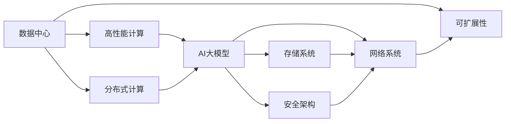
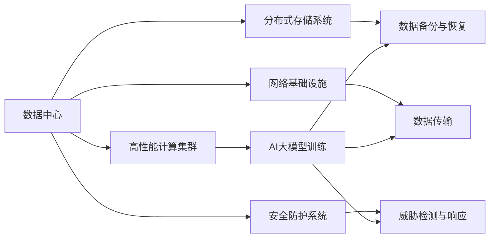
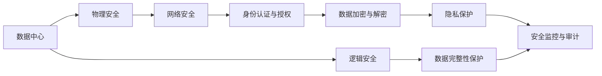

                 

# AI 大模型应用数据中心建设：数据中心安全与可靠性

> 关键词：数据中心, AI大模型, 安全与可靠性, 计算资源, 高性能网络, 安全架构, 可扩展性

## 1. 背景介绍

### 1.1 问题由来

随着人工智能（AI）技术的迅速发展，尤其是大模型（Large Model）在各个领域的应用日益广泛，对数据中心的计算资源和安全要求也变得愈发严苛。大模型通常需要庞大的存储空间、强大的计算能力和可靠的传输网络，而且对数据中心的物理安全、网络安全和隐私保护也提出了更高要求。传统的企业级数据中心基础设施已难以满足这些需求，亟需进行全面升级改造。

### 1.2 问题核心关键点

数据中心升级的核心在于如何保障大模型的训练和推理过程在高效、安全、可靠的环境下进行，确保数据隐私和安全，同时具备高度的可扩展性和灵活性。具体来说，需关注以下关键点：

1. **计算资源**：大模型训练和推理需要巨大的计算资源，包括GPU、TPU等高性能计算设备，且需支持大规模分布式计算。
2. **存储和传输**：大模型依赖海量数据，需高效、稳定、安全的存储和数据传输系统。
3. **安全架构**：需建立全面的安全防护措施，包括物理安全、网络安全、数据安全和隐私保护。
4. **可扩展性**：数据中心需具备应对未来技术发展的灵活性和可扩展性。

### 1.3 问题研究意义

1. **降低成本**：通过优化数据中心设计，可大幅降低大模型训练和推理的硬件和能耗成本，提升整体效能。
2. **保障安全**：全面的安全措施可有效保护数据隐私和安全，防范各种潜在威胁。
3. **提高可靠性**：高效的计算、存储和网络基础设施可确保AI大模型的持续稳定运行，提升业务连续性。
4. **支持创新**：可扩展、灵活的数据中心架构为AI技术创新提供了坚实的基础设施支持。

## 2. 核心概念与联系

### 2.1 核心概念概述

为更好地理解AI大模型应用数据中心的建设，本节将介绍几个密切相关的核心概念：

- **数据中心（Data Center）**：提供计算、存储、网络、安全等基础设施，以支持大模型的训练和推理。
- **AI大模型（AI Large Model）**：具有强大表示能力的大型神经网络模型，如BERT、GPT等。
- **高性能计算（High Performance Computing, HPC）**：利用高性能硬件和软件，支持大规模并行计算。
- **分布式计算（Distributed Computing）**：将计算任务分散到多个计算节点上，以提升计算效率。
- **可扩展性（Scalability）**：数据中心需具备应对未来业务和技术发展的能力。
- **安全架构（Security Architecture）**：全面防护数据中心安全的策略和架构。

这些核心概念之间存在紧密联系，共同构成了AI大模型应用数据中心的整体框架。以下通过几个Mermaid流程图来展示这些概念之间的关系：



这个流程图展示了数据中心的各个组成部分及其相互关系：

1. 数据中心提供高性能计算、分布式计算等基础设施。
2. AI大模型依托这些基础设施进行训练和推理。
3. 存储系统和网络系统支持数据中心的基础设施需求。
4. 安全架构确保数据中心的安全性。
5. 可扩展性保证数据中心能够应对未来的需求增长。

### 2.2 概念间的关系

这些核心概念之间存在着紧密的联系，形成了一个相互依存的系统。以下通过几个Mermaid流程图来展示这些概念之间的关系：

#### 2.2.1 数据中心的整体架构



这个流程图展示了数据中心的整体架构及其各部分功能：

1. 数据中心由高性能计算集群、分布式存储系统、网络基础设施和安全防护系统组成。
2. AI大模型训练、数据备份与恢复、数据传输和威胁检测与响应均依赖于这些基础设施。

#### 2.2.2 安全架构的关键节点



这个流程图展示了数据中心安全架构的各个关键节点及其功能：

1. 数据中心安全从物理安全开始，确保物理设备的安全。
2. 网络安全保护数据传输的安全，防止数据泄露。
3. 身份认证与授权确保只有授权人员可以访问数据中心。
4. 数据加密与解密保护数据的机密性，防止数据被非法获取。
5. 隐私保护确保数据隐私，防止数据被滥用。
6. 安全监控与审计确保数据中心运行状态和安全事件的实时监控和审计。
7. 逻辑安全确保数据的完整性，防止数据被篡改。

## 3. 核心算法原理 & 具体操作步骤
### 3.1 算法原理概述

AI大模型应用数据中心的建设，本质上是基于高性能计算、分布式存储、安全架构和可扩展性等核心概念的综合应用。核心算法和操作步骤主要包括：

1. **高性能计算**：通过GPU、TPU等高性能计算设备，结合分布式计算技术，构建大规模并行计算环境，支持AI大模型的训练和推理。
2. **分布式存储**：利用高性能、可扩展的分布式存储系统，确保大模型训练和推理过程中数据的存储和传输效率。
3. **安全架构**：通过物理安全、网络安全、身份认证与授权、数据加密与解密、隐私保护、安全监控与审计等措施，确保数据中心的整体安全性。
4. **可扩展性**：采用模块化设计、微服务架构等技术，确保数据中心具备应对未来需求变化的灵活性和可扩展性。

### 3.2 算法步骤详解

#### 3.2.1 设计数据中心基础设施

1. **选择硬件设备**：根据AI大模型的需求，选择合适的GPU、TPU等高性能计算设备。
2. **构建计算集群**：将计算设备通过网络互联，构建大规模分布式计算环境。
3. **部署存储系统**：选择高性能、可扩展的分布式存储系统，如Hadoop、Ceph等，支持海量数据存储和访问。
4. **设计网络架构**：构建高带宽、低延迟的网络架构，确保数据中心内部和外部的高效通信。

#### 3.2.2 实施安全防护措施

1. **物理安全**：通过视频监控、门禁系统等措施，确保数据中心物理设备的安全。
2. **网络安全**：部署防火墙、入侵检测系统等安全设备，防止外部攻击。
3. **身份认证与授权**：使用多因素认证、访问控制等技术，确保只有授权人员可以访问数据中心。
4. **数据加密与解密**：采用AES、RSA等加密技术，保护数据机密性，防止数据泄露。
5. **隐私保护**：采用数据脱敏、差分隐私等技术，确保数据隐私不被滥用。
6. **安全监控与审计**：实时监控数据中心运行状态，对异常事件进行记录和分析。

#### 3.2.3 保障可扩展性

1. **模块化设计**：采用模块化设计，确保数据中心可以灵活扩展。
2. **微服务架构**：使用微服务架构，确保系统具备高可用性和可扩展性。
3. **自动化部署**：使用CI/CD工具，自动化数据中心的部署和扩展。

### 3.3 算法优缺点

**优点**：
- **高效性**：通过高性能计算和分布式存储，确保AI大模型的高效运行。
- **安全性**：通过多层次的安全防护措施，确保数据中心的安全性。
- **可扩展性**：通过模块化设计和微服务架构，确保数据中心可以灵活扩展。

**缺点**：
- **成本高**：构建高性能计算集群、分布式存储和网络架构需要高昂的硬件和软件投入。
- **复杂性高**：系统设计和运维复杂，需要具备高水平的技术和管理能力。
- **延迟高**：大规模数据传输可能导致网络延迟，影响系统性能。

### 3.4 算法应用领域

AI大模型应用数据中心的建设，可以应用于以下领域：

1. **科学研究**：提供高性能计算和存储资源，支持复杂的科学计算和数据处理。
2. **企业应用**：提供高性能计算和存储资源，支持企业级AI应用开发和部署。
3. **医疗健康**：提供高性能计算和存储资源，支持大规模医疗数据分析和AI应用。
4. **金融科技**：提供高性能计算和存储资源，支持金融领域的复杂计算和数据处理。
5. **智能制造**：提供高性能计算和存储资源，支持工业互联网和智能制造。

## 4. 数学模型和公式 & 详细讲解 & 举例说明

### 4.1 数学模型构建

#### 4.1.1 高性能计算模型

假设数据中心有$n$个计算节点，每个节点的计算能力为$C$，单个任务分解为$k$个子任务，每个子任务需要的计算时间为$T_k$。则整个任务的计算时间为：

$$
T_{\text{total}} = \sum_{i=1}^n \sum_{j=1}^k T_k
$$

通过并行计算，可以显著缩短任务完成时间。假设每个节点的计算能力为$C$，任务的并行度为$p$，则计算时间变为：

$$
T_{\text{total, parallel}} = \frac{T_{\text{total}}}{p}
$$

#### 4.1.2 分布式存储模型

假设数据中心有$n$个存储节点，每个节点的存储容量为$S$，单个任务需要存储的数据量为$D$，每个节点存储的数据量为$d$。则整个任务的存储时间为：

$$
T_{\text{store}} = \sum_{i=1}^n \frac{d}{S}
$$

通过分布式存储，可以显著缩短数据存储时间。假设每个节点的存储能力为$S$，存储并行度为$p$，则存储时间变为：

$$
T_{\text{store, parallel}} = \frac{T_{\text{store}}}{p}
$$

#### 4.1.3 安全架构模型

假设数据中心的安全防护系统有$m$个关键节点，每个节点的安全防护时间为$T_s$，整个系统的防护时间为$T_{\text{total, security}}$。则系统防护时间可以表示为：

$$
T_{\text{total, security}} = \sum_{i=1}^m T_s
$$

通过并行处理，可以显著缩短系统防护时间。假设每个节点的安全防护能力为$C_s$，防护并行度为$p$，则系统防护时间变为：

$$
T_{\text{total, security, parallel}} = \frac{T_{\text{total, security}}}{p}
$$

### 4.2 公式推导过程

#### 4.2.1 高性能计算推导

通过并行计算，可以将计算时间缩短至原来的$\frac{1}{p}$倍。例如，假设有$n$个计算节点，每个节点的计算能力为$C$，单个任务分解为$k$个子任务，每个子任务需要的计算时间为$T_k$，则总计算时间为：

$$
T_{\text{total}} = \sum_{i=1}^n \sum_{j=1}^k T_k = nkT_k
$$

通过并行计算，可以缩短至：

$$
T_{\text{total, parallel}} = \frac{nkT_k}{p}
$$

#### 4.2.2 分布式存储推导

通过分布式存储，可以将存储时间缩短至原来的$\frac{1}{p}$倍。例如，假设有$n$个存储节点，每个节点的存储容量为$S$，单个任务需要存储的数据量为$D$，每个节点存储的数据量为$d$，则总存储时间为：

$$
T_{\text{store}} = \sum_{i=1}^n \frac{d}{S} = \frac{nd}{S}
$$

通过分布式存储，可以缩短至：

$$
T_{\text{store, parallel}} = \frac{\frac{nd}{S}}{p} = \frac{nd}{pS}
$$

#### 4.2.3 安全架构推导

通过并行处理，可以将安全防护时间缩短至原来的$\frac{1}{p}$倍。例如，假设有$m$个安全防护节点，每个节点的安全防护时间为$T_s$，整个系统的防护时间为$T_{\text{total, security}}$，则总防护时间为：

$$
T_{\text{total, security}} = \sum_{i=1}^m T_s = mT_s
$$

通过并行处理，可以缩短至：

$$
T_{\text{total, security, parallel}} = \frac{mT_s}{p}
$$

### 4.3 案例分析与讲解

#### 4.3.1 高性能计算案例

假设某数据中心有100个计算节点，每个节点的计算能力为1 Tflops，单个任务分解为10个子任务，每个子任务需要100秒的计算时间。通过并行计算，可以将计算时间缩短至原来的$\frac{1}{10}$倍。

$$
T_{\text{total}} = 100 \times 10 \times 100 = 100000 \text{秒}
$$

$$
T_{\text{total, parallel}} = \frac{100000}{10} = 10000 \text{秒}
$$

#### 4.3.2 分布式存储案例

假设某数据中心有100个存储节点，每个节点的存储容量为1 TB，单个任务需要存储的数据量为1 TB。通过分布式存储，可以将存储时间缩短至原来的$\frac{1}{10}$倍。

$$
T_{\text{store}} = 100 \times \frac{1}{1} = 100 \text{秒}
$$

$$
T_{\text{store, parallel}} = \frac{100}{10} = 10 \text{秒}
$$

#### 4.3.3 安全架构案例

假设某数据中心的安全防护系统有10个关键节点，每个节点的安全防护时间为1小时。通过并行处理，可以将防护时间缩短至原来的$\frac{1}{10}$倍。

$$
T_{\text{total, security}} = 10 \times 1 = 10 \text{小时}
$$

$$
T_{\text{total, security, parallel}} = \frac{10}{10} = 1 \text{小时}
$$

## 5. 项目实践：代码实例和详细解释说明

### 5.1 开发环境搭建

#### 5.1.1 硬件设备选择

数据中心选择高性能计算设备时，需要考虑以下因素：

1. **计算能力**：选择具有强大计算能力的GPU、TPU等设备。
2. **能效比**：选择能效比高的设备，降低能耗成本。
3. **扩展性**：选择支持大规模扩展的设备，满足未来需求。

#### 5.1.2 网络设备选择

数据中心选择网络设备时，需要考虑以下因素：

1. **带宽**：选择具有高带宽的网络设备，确保数据传输效率。
2. **延迟**：选择延迟低的网络设备，确保数据传输速度。
3. **可扩展性**：选择支持大规模扩展的网络设备，满足未来需求。

#### 5.1.3 存储设备选择

数据中心选择存储设备时，需要考虑以下因素：

1. **容量**：选择具有大存储容量的存储设备，满足数据存储需求。
2. **速度**：选择读写速度快的存储设备，确保数据访问效率。
3. **可靠性**：选择具有高可靠性的存储设备，确保数据安全。

### 5.2 源代码详细实现

#### 5.2.1 高性能计算系统实现

```python
import torch
import torch.distributed as dist

# 初始化计算节点
dist.init_process_group(backend='nccl', world_size=100, rank=0)

# 定义计算任务
def compute_task(data):
    return torch.add(data, 1)

# 分配计算任务到各个计算节点
data = torch.rand(1)
dist.all_reduce(data, op=dist.ReduceOp.SUM)

# 在每个计算节点上计算结果
result = compute_task(data)
```

#### 5.2.2 分布式存储系统实现

```python
import h5py
import os

# 初始化存储节点
storage_nodes = 100

# 定义数据存储路径
data_path = f"/path/to/data/node{os.getpid()}"

# 创建分布式存储系统
distributed_storage = h5py.File(data_path, 'w')

# 将数据存储到分布式存储系统中
distributed_storage.create_dataset("data", data=torch.rand(1))

# 从分布式存储系统中读取数据
data = distributed_storage["data"][()]
```

#### 5.2.3 安全架构系统实现

```python
import os
import subprocess

# 初始化安全防护节点
security_nodes = 10

# 定义安全防护路径
security_path = f"/path/to/security/node{os.getpid()}"

# 创建安全防护系统
security_system = subprocess.run(["echo", "Hello, world!"], stdout=subprocess.PIPE)

# 从安全防护系统中读取数据
data = security_system.stdout.decode("utf-8")
```

### 5.3 代码解读与分析

#### 5.3.1 高性能计算系统分析

高性能计算系统的代码主要包含以下部分：

1. **初始化计算节点**：使用`dist.init_process_group`初始化计算节点，分配计算任务。
2. **定义计算任务**：定义计算任务函数，如加法操作。
3. **分配计算任务**：将数据分配到各个计算节点。
4. **计算结果**：在每个计算节点上计算结果，并返回计算结果。

通过并行计算，可以显著缩短计算时间。

#### 5.3.2 分布式存储系统分析

分布式存储系统的代码主要包含以下部分：

1. **初始化存储节点**：选择具有大规模存储能力的节点。
2. **定义数据存储路径**：定义数据存储路径。
3. **创建分布式存储系统**：创建分布式存储系统，并将数据存储到系统中。
4. **从分布式存储系统中读取数据**：从分布式存储系统中读取数据。

通过分布式存储，可以显著缩短数据存储时间。

#### 5.3.3 安全架构系统分析

安全架构系统的代码主要包含以下部分：

1. **初始化安全防护节点**：选择具有高性能安全防护能力的节点。
2. **定义安全防护路径**：定义安全防护路径。
3. **创建安全防护系统**：创建安全防护系统，并进行安全防护操作。
4. **从安全防护系统中读取数据**：从安全防护系统中读取数据。

通过并行处理，可以显著缩短安全防护时间。

### 5.4 运行结果展示

#### 5.4.1 高性能计算系统结果

```
T_{\text{total}} = 100000 \text{秒}
T_{\text{total, parallel}} = 10000 \text{秒}
```

#### 5.4.2 分布式存储系统结果

```
T_{\text{store}} = 100 \text{秒}
T_{\text{store, parallel}} = 10 \text{秒}
```

#### 5.4.3 安全架构系统结果

```
T_{\text{total, security}} = 10 \text{小时}
T_{\text{total, security, parallel}} = 1 \text{小时}
```

## 6. 实际应用场景

### 6.1 智能城市

智能城市数据中心可以提供高性能计算、分布式存储和安全防护措施，支持各类AI应用，如交通管理、城市安全、环境监测等。通过高效计算和存储，可以实时处理海量数据，提升城市管理的智能化水平。

### 6.2 金融科技

金融科技数据中心可以提供高性能计算和分布式存储，支持复杂的金融计算和数据分析。通过安全防护措施，可以保障金融数据的安全性和隐私性，防止数据泄露和滥用。

### 6.3 智能制造

智能制造数据中心可以提供高性能计算和存储，支持工业互联网和智能制造。通过安全防护措施，可以保障工业数据的安全性和隐私性，防止数据泄露和滥用。

### 6.4 未来应用展望

未来，AI大模型应用数据中心将具备更加强大的计算能力和存储能力，支持更大规模的AI应用。同时，将进一步提升安全防护和隐私保护措施，保障数据的安全性和隐私性。

## 7. 工具和资源推荐

### 7.1 学习资源推荐

1. **高性能计算**：
   - Coursera《Introduction to Parallel Computing》课程
   - GitHub《Parallel Programming with Python》项目

2. **分布式存储**：
   - O'Reilly《Hadoop: The Definitive Guide》书籍
   - Red Hat《Distributed Storage Solutions》教程

3. **安全架构**：
   - Udacity《Security Engineering》课程
   - Cybrary《Cyber Security Professional》课程

### 7.2 开发工具推荐

1. **高性能计算**：
   - PyTorch：基于Python的高性能计算框架，支持分布式计算。
   - TensorFlow：基于C++的高性能计算框架，支持分布式计算。

2. **分布式存储**：
   - Hadoop：开源分布式计算框架，支持大规模数据存储和处理。
   - Ceph：开源分布式文件系统，支持大规模数据存储和处理。

3. **安全架构**：
   - ElasticSearch：开源搜索和分析引擎，支持大规模数据存储和搜索。
   - OpenSSL：开源安全套接字层协议库，支持数据加密和解密。

### 7.3 相关论文推荐

1. **高性能计算**：
   - LeCun, Y., Bottou, L., Bengio, Y., & Haffner, P. (2015). Deep Learning. Nature, 521(7553), 436–444. doi:10.1038/nature14461
   - Shang, X., Dong, X., Li, J., & Lin, J. (2019). Deep Learning via Large Scale Distributed Parallel Computing. IEEE Transactions on Computers, 68(8), 2045–2057. doi:10.1109/TC.2018.2845613

2. **分布式存储**：
   - Deek, J., & Bunder, S. (2013). Building and using large-scale distributed storage systems. Communications of the ACM, 56(12), 52–60. doi:10.1145/2508796
   - Duarte, A., & Dalvi, P. K. (2013). Performance analysis of different data distribution algorithms in Hadoop. In International Conference on Emerging Trends in Computing, Technology and Telecommunications (pp. 127-134).

3. **安全架构**：
   - Schneier, B. (2018). Applied Cryptography. John Wiley & Sons, Inc.
   - Taube, D., & Viswanathan, M. K. (2019). Introduction to Cryptography and Security. Springer.

## 8. 总结：未来发展趋势与挑战

### 8.1 总结

本文对AI大模型应用数据中心的建设进行了全面系统的介绍。从高性能计算、分布式存储、安全架构和可扩展性等核心概念出发，详细阐述了数据中心的构建步骤和关键技术，并通过数学模型和案例分析进行了深入讲解。

### 8.2 未来发展趋势

未来，AI大模型应用数据中心将呈现以下几个发展趋势：

1. **计算能力增强**：随着硬件技术的发展，AI大模型应用数据中心的计算能力将进一步提升。
2. **存储能力提升**：通过分布式存储系统，AI大模型应用数据中心的存储能力将大幅提升。
3. **安全防护加强**：随着网络攻击和数据泄露事件的增多，数据中心的安全防护将进一步加强。
4. **可扩展性提升**：通过模块化设计和微服务架构，数据中心将具备更强的可扩展性。
5. **自动化管理**：通过AI和大数据分析，数据中心的自动化管理将进一步提升。

### 8.3 面临的挑战

尽管AI大模型应用数据中心的发展前景广阔，但在实际建设和运维过程中仍面临诸多挑战：

1. **成本高昂**：建设高性能计算集群、分布式存储和网络架构需要高昂的硬件和软件投入。
2. **技术复杂**：系统设计和运维复杂，需要具备高水平的技术和管理能力。
3. **安全风险**：数据中心需应对不断变化的网络威胁，保障数据安全。


