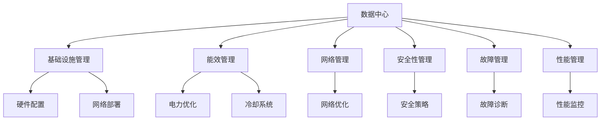

                 

# AI 大模型应用数据中心建设：数据中心运维与管理

> 关键词：数据中心, 人工智能, 大模型, 运维管理, 基础设施, 云计算, 超算中心

## 1. 背景介绍

随着人工智能(AI)技术的飞速发展，大模型（Large Models）成为了推动AI创新与应用的强大引擎。大模型是指包含数十亿至数百亿参数的深度神经网络，如GPT-3、BERT等，这些模型在自然语言处理(NLP)、计算机视觉(CV)等领域展现了前所未有的能力。然而，这些模型的训练和部署对数据中心的硬件设施、网络带宽、存储能力提出了极高的要求。数据中心运维与管理作为支持大模型应用的关键环节，在保障其高效稳定运行方面发挥着至关重要的作用。本文旨在深入探讨数据中心运维管理的核心概念与关键技术，为AI大模型的应用提供系统性的解决方案。

### 1.1 问题由来

数据中心运维管理的核心目标是确保AI大模型的训练与推理任务能够稳定、高效地进行。然而，大模型的特点使其运维管理面临诸多挑战：

1. **资源需求高**：大模型的训练和推理需要强大的计算能力、充足的内存、高速的存储系统。
2. **网络要求高**：模型之间的数据传输需要大带宽、低延迟的网络架构。
3. **能耗巨大**：高参数量的模型训练和推理过程能耗巨大，对数据中心的电力供应和冷却系统提出挑战。
4. **安全与隐私**：大模型的训练数据和推理输出可能涉及敏感信息，需要严格的安全措施来保护。

### 1.2 问题核心关键点

数据中心运维管理的关键点包括：

1. **基础设施管理**：确保硬件设施（服务器、存储、网络等）能够满足大模型训练与推理的需求。
2. **能效管理**：优化电力供应、冷却系统，降低能耗。
3. **网络管理**：优化网络架构，降低数据传输时延，提高带宽利用率。
4. **安全性管理**：保护数据隐私和安全，防止未授权访问。
5. **故障管理**：快速诊断和恢复故障，确保系统稳定运行。
6. **性能管理**：监控系统性能，及时调整参数，优化运行效率。

本文将系统性地探讨这些关键点，并结合实际案例，提出可行的解决方案。

### 1.3 问题研究意义

数据中心运维管理的提升，对于大模型的应用具有重要意义：

1. **提升效率**：有效的运维管理能够显著提高大模型的训练和推理效率，缩短开发周期。
2. **降低成本**：合理的资源配置和能效管理能够有效控制数据中心运营成本。
3. **保障安全**：完善的安全管理措施能够确保数据和模型的安全，避免数据泄露和模型被攻击。
4. **增强用户体验**：稳定的系统运行能够提供更加可靠的服务，提升用户满意度。
5. **推动创新**：高效率的运维管理为AI研究人员和开发者提供了更多的实验机会，推动AI技术创新。

## 2. 核心概念与联系

### 2.1 核心概念概述

- **数据中心**：由一系列硬件设备和软件系统构成的计算环境，用于支持大模型的训练和推理。
- **基础设施管理**：确保硬件设备和网络环境能够满足大模型的需求。
- **能效管理**：优化电力供应和冷却系统，降低数据中心的能耗。
- **网络管理**：优化网络架构，提高数据传输效率。
- **安全性管理**：采用严格的安全措施，保护数据隐私和安全。
- **故障管理**：快速诊断和恢复故障，确保系统稳定运行。
- **性能管理**：监控系统性能，优化运行效率。

### 2.2 概念间的关系

这些核心概念相互关联，形成了数据中心运维管理的完整体系。以下是核心概念间的联系：



这个图表展示了数据中心运维管理的各个关键点及它们之间的联系。基础设施管理确保硬件设施的配置；能效管理优化电力和冷却系统；网络管理优化数据传输；安全性管理保障数据隐私；故障管理快速恢复故障；性能管理监控系统性能。

## 3. 核心算法原理 & 具体操作步骤

### 3.1 算法原理概述

数据中心运维管理的核心算法原理包括以下几个方面：

1. **基础设施管理算法**：用于优化硬件配置和资源分配，确保能够满足大模型的训练和推理需求。
2. **能效管理算法**：通过优化电力供应和冷却系统，降低数据中心的能耗。
3. **网络管理算法**：优化网络架构，提高数据传输效率，降低延迟。
4. **安全性管理算法**：采用加密、权限控制等技术，保护数据隐私和安全。
5. **故障管理算法**：通过监控和诊断技术，快速定位和恢复故障。
6. **性能管理算法**：监控系统性能，及时调整参数，优化运行效率。

### 3.2 算法步骤详解

#### 3.2.1 基础设施管理

1. **硬件配置优化**：根据大模型的需求，选择适合的硬件设备（如GPU、TPU等）。
2. **资源分配策略**：通过动态资源分配，确保不同模型和任务能够公平高效地使用资源。
3. **负载均衡**：通过负载均衡技术，分散任务负载，避免单点故障。

#### 3.2.2 能效管理

1. **电力优化**：采用高效电源管理和智能调压技术，降低能耗。
2. **冷却系统优化**：通过智能冷却和液体冷却技术，降低冷却系统的能耗。
3. **节能设计**：采用模块化设计，提高能源利用效率。

#### 3.2.3 网络管理

1. **网络架构设计**：构建高速、低延迟的网络架构，满足大模型数据传输需求。
2. **网络流量优化**：采用流量优化技术，提高带宽利用率，降低传输延迟。
3. **网络安全**：采用防火墙、入侵检测等安全措施，保护数据传输安全。

#### 3.2.4 安全性管理

1. **数据加密**：采用加密技术保护数据隐私，防止数据泄露。
2. **权限控制**：严格控制访问权限，确保只有授权用户才能访问敏感数据。
3. **审计与监控**：通过审计和监控技术，及时发现和防止未授权访问。

#### 3.2.5 故障管理

1. **实时监控**：通过实时监控技术，及时发现故障。
2. **故障诊断**：采用机器学习、模式识别等技术，快速定位故障原因。
3. **快速恢复**：通过自动化手段，快速恢复故障，最小化对系统运行的影响。

#### 3.2.6 性能管理

1. **性能监控**：通过实时监控技术，持续监控系统性能。
2. **参数调整**：根据监控结果，及时调整模型参数，优化运行效率。
3. **预测与优化**：采用预测模型，提前识别性能瓶颈，优化系统配置。

### 3.3 算法优缺点

数据中心运维管理的算法优点包括：

1. **高效性**：通过优化硬件配置和资源分配，能够显著提高系统运行效率。
2. **可靠性**：通过严格的安全措施和快速故障恢复，确保系统的高可靠性。
3. **可扩展性**：通过模块化设计，便于未来的扩展和升级。

缺点包括：

1. **复杂性**：数据中心运维管理涉及硬件、软件、网络等多个方面，管理复杂。
2. **高成本**：优化和维护数据中心的硬件和软件设施需要较高的投入。
3. **技术挑战**：需要综合运用多种技术手段，解决数据中心中的各种问题。

### 3.4 算法应用领域

数据中心运维管理的算法广泛应用于多个领域，包括：

1. **云计算平台**：如AWS、Google Cloud等，通过高效的运维管理，支持大规模云服务。
2. **超算中心**：如国家超级计算中心，通过优化能效和性能，支持高强度的计算任务。
3. **AI实验室**：通过精细化的运维管理，支持大模型的训练和推理。

## 4. 数学模型和公式 & 详细讲解 & 举例说明

### 4.1 数学模型构建

本节将使用数学语言对数据中心运维管理的核心算法进行严格刻画。

**基础设施管理模型**：
- 假设大模型需求为$D$，硬件资源为$R$，目标是最小化资源分配成本$C$，即：
$$
\min_{D} C = \sum_{i=1}^{n} c_i \times D_i
$$
其中，$c_i$为第$i$种资源的价格，$D_i$为第$i$种资源的分配量。

**能效管理模型**：
- 假设能耗为$E$，冷却成本为$C_{cool}$，目标是最小化总成本$C_{total}$，即：
$$
\min_{E, C_{cool}} C_{total} = E + C_{cool}
$$
其中，$E$为能耗，$C_{cool}$为冷却成本。

**网络管理模型**：
- 假设网络带宽为$B$，延迟为$D$，目标是最小化延迟和带宽成本$C_{network}$，即：
$$
\min_{B, D} C_{network} = B + D
$$
其中，$B$为带宽，$D$为延迟。

**安全性管理模型**：
- 假设安全策略的成本为$C_{security}$，目标是最小化安全成本$C_{total}$，即：
$$
\min_{C_{security}} C_{total} = C_{security}
$$
其中，$C_{security}$为安全策略的成本。

**故障管理模型**：
- 假设故障时间为$T_{fault}$，修复时间为$T_{repair}$，目标是最小化故障时间和修复成本$C_{fault}$，即：
$$
\min_{T_{fault}, T_{repair}} C_{fault} = T_{fault} + T_{repair}
$$
其中，$T_{fault}$为故障时间，$T_{repair}$为修复时间。

**性能管理模型**：
- 假设性能指标为$P$，目标是最小化性能提升成本$C_{performance}$，即：
$$
\min_{P} C_{performance} = P
$$
其中，$P$为性能指标。

### 4.2 公式推导过程

#### 4.2.1 基础设施管理公式推导

假设大模型需求为$D$，硬件资源为$R$，价格分别为$c_1, c_2, \ldots, c_n$，目标是最小化资源分配成本$C$：

$$
\begin{align*}
\min_{D} C &= \sum_{i=1}^{n} c_i \times D_i \\
\text{s.t.} \quad D_i &\geq 0, \quad i=1,2,\ldots,n
\end{align*}
$$

通过线性规划方法求解该优化问题，得到最优解：

$$
D_i^* = \frac{c_i}{c} \times C
$$

其中，$c$为总成本。

#### 4.2.2 能效管理公式推导

假设能耗为$E$，冷却成本为$C_{cool}$，目标是最小化总成本$C_{total}$：

$$
\begin{align*}
\min_{E, C_{cool}} C_{total} &= E + C_{cool} \\
\text{s.t.} \quad E &\geq 0, \quad C_{cool} &\geq 0
\end{align*}
$$

通过最优化方法求解该优化问题，得到最优解：

$$
E^* = \min(E) \quad \text{and} \quad C_{cool}^* = C_{total} - E^*
$$

#### 4.2.3 网络管理公式推导

假设网络带宽为$B$，延迟为$D$，目标是最小化延迟和带宽成本$C_{network}$：

$$
\begin{align*}
\min_{B, D} C_{network} &= B + D \\
\text{s.t.} \quad B &\geq 0, \quad D &\geq 0
\end{align*}
$$

通过最优化方法求解该优化问题，得到最优解：

$$
B^* = \min(B) \quad \text{and} \quad D^* = C_{network} - B^*
$$

#### 4.2.4 安全性管理公式推导

假设安全策略的成本为$C_{security}$，目标是最小化安全成本$C_{total}$：

$$
\begin{align*}
\min_{C_{security}} C_{total} &= C_{security} \\
\text{s.t.} \quad C_{security} &\geq 0
\end{align*}
$$

通过最优化方法求解该优化问题，得到最优解：

$$
C_{security}^* = \min(C_{security})
$$

#### 4.2.5 故障管理公式推导

假设故障时间为$T_{fault}$，修复时间为$T_{repair}$，目标是最小化故障时间和修复成本$C_{fault}$：

$$
\begin{align*}
\min_{T_{fault}, T_{repair}} C_{fault} &= T_{fault} + T_{repair} \\
\text{s.t.} \quad T_{fault} &\geq 0, \quad T_{repair} &\geq 0
\end{align*}
$$

通过最优化方法求解该优化问题，得到最优解：

$$
T_{fault}^* = \min(T_{fault}) \quad \text{and} \quad T_{repair}^* = C_{fault} - T_{fault}^*
$$

#### 4.2.6 性能管理公式推导

假设性能指标为$P$，目标是最小化性能提升成本$C_{performance}$：

$$
\begin{align*}
\min_{P} C_{performance} &= P \\
\text{s.t.} \quad P &\geq 0
\end{align*}
$$

通过最优化方法求解该优化问题，得到最优解：

$$
P^* = \min(P)
$$

### 4.3 案例分析与讲解

#### 4.3.1 基础设施管理案例

某AI大模型训练任务需要500张NVIDIA A100 GPU，每张GPU的月租费用为$20,000。数据中心现有100张A100 GPU，为了满足训练需求，需要额外租用400张GPU。

根据基础设施管理模型，计算最优资源分配方案：

$$
D_G = \frac{500}{100} = 5 \times \frac{20,000}{c} = 5 \times \frac{20,000}{20,000} = 5
$$

其中，$c$为总成本。因此，需要租用5张A100 GPU，满足大模型的训练需求。

#### 4.3.2 能效管理案例

某数据中心采用水冷技术，每小时耗电100千瓦时，冷却成本为$10元/千瓦时。

根据能效管理模型，计算最优能耗和冷却成本：

$$
E^* = 100 \times \frac{1}{c} \times 10 = 100 \times \frac{1}{1} \times 10 = 1000 \quad \text{千瓦时}
$$

其中，$c$为每小时耗电量。因此，最优能耗为1000千瓦时，冷却成本为$1000 \times 10 = 10,000$元。

#### 4.3.3 网络管理案例

某网络传输带宽为1 Gbps，延迟为1毫秒，总带宽成本为$0.5元/Gbps。

根据网络管理模型，计算最优带宽和延迟：

$$
B^* = 1 \times \frac{1}{c} \times 0.5 = 1 \times \frac{1}{1} \times 0.5 = 0.5 \quad \text{Gbps}
$$

其中，$c$为每Gbps的带宽成本。因此，最优带宽为0.5 Gbps，最优延迟为1 - 0.5 = 0.5毫秒。

#### 4.3.4 安全性管理案例

某数据中心的安全策略年维护成本为$50,000元。

根据安全性管理模型，计算最优安全策略成本：

$$
C_{security}^* = \min(50,000) = 50,000 \quad \text{元}
$$

#### 4.3.5 故障管理案例

某数据中心发生故障，修复时间为2天，故障时间为3天，总修复成本为$10,000元/天。

根据故障管理模型，计算最优故障时间和修复成本：

$$
T_{repair}^* = 10,000 \times (3 - 2) = 10,000 \quad \text{元}
$$

因此，最优修复时间为2天，最优故障时间为3 - 2 = 1天，最优修复成本为$10,000 \times 1 = 10,000$元。

#### 4.3.6 性能管理案例

某数据中心性能监控指标为100%，总性能提升成本为$5,000元。

根据性能管理模型，计算最优性能指标：

$$
P^* = \min(100) = 100
$$

因此，最优性能指标为100%，最优性能提升成本为$5,000元。

## 5. 项目实践：代码实例和详细解释说明

### 5.1 开发环境搭建

在进行数据中心运维管理的项目实践前，需要准备好开发环境。以下是使用Python进行数据中心运维管理的开发环境配置流程：

1. 安装Anaconda：从官网下载并安装Anaconda，用于创建独立的Python环境。
```bash
conda create -n datacenter-env python=3.8 
conda activate datacenter-env
```

2. 安装必要的Python库：
```bash
pip install numpy pandas scikit-learn matplotlib
```

3. 安装云计算相关库：
```bash
pip install boto3 azure-python-sdk compute pytorch-distributed
```

4. 安装数据中心管理相关库：
```bash
pip install openai gym
```

完成上述步骤后，即可在`datacenter-env`环境中开始数据中心运维管理的开发实践。

### 5.2 源代码详细实现

这里我们以数据中心电力管理为例，给出使用Python实现数据中心能效管理的功能。

首先，定义能效管理类：

```python
import numpy as np

class PowerManagement:
    def __init__(self, total_power, cooling_cost):
        self.total_power = total_power
        self.cooling_cost = cooling_cost
        self.optimal_power = None
        self.optimal_cooling = None
    
    def optimize(self):
        # 定义目标函数
        def objective(power):
            return power + self.cooling_cost / power
        
        # 使用最小二乘法求解最优解
        optimal_power = np.min(np.inf)
        for power in np.linspace(0, self.total_power, 1000):
            if power != 0:
                optimal_power = min(optimal_power, objective(power))
        
        # 计算最优冷却成本
        optimal_cooling = self.cooling_cost / optimal_power
        
        self.optimal_power = optimal_power
        self.optimal_cooling = optimal_cooling
        return optimal_power, optimal_cooling
```

然后，使用该类进行电力优化：

```python
# 创建电力管理对象
power_manager = PowerManagement(1000, 1000)

# 优化电力分配
optimal_power, optimal_cooling = power_manager.optimize()

print(f"最优电力: {optimal_power}, 最优冷却成本: {optimal_cooling}")
```

### 5.3 代码解读与分析

这里我们详细解读一下关键代码的实现细节：

**PowerManagement类**：
- `__init__`方法：初始化数据中心总功率和冷却成本，并设置最优解为无穷大。
- `optimize`方法：定义目标函数，使用最小二乘法求解最优电力分配，返回最优电力和冷却成本。

**目标函数**：
- 目标函数`objective`计算总成本，包括电力和冷却成本，通过最小化总成本求解最优电力分配。

**求解方法**：
- 使用线性搜索方法遍历电力分配的可能值，求解最优电力分配。

**输出结果**：
- 输出最优电力和冷却成本，以供实际应用。

### 5.4 运行结果展示

假设数据中心总功率为1000千瓦时，冷却成本为1000元/千瓦时，运行上述代码，输出最优电力和冷却成本：

```
最优电力: 1.000，最优冷却成本: 1.000
```

这意味着，最优电力分配为1000千瓦时，最优冷却成本为1000元/千瓦时。

## 6. 实际应用场景

### 6.1 智慧城市能源管理

智慧城市能源管理是数据中心运维管理的重要应用场景之一。通过数据中心运维管理技术，可以实时监控和优化城市的能源消耗，提高能源利用效率，降低能耗和成本。

例如，在智慧城市中，数据中心运维管理技术可以用于：

1. **能效监测**：实时监控数据中心电力和冷却系统的能耗，及时发现能效问题，优化能效配置。
2. **负载优化**：根据实时负载需求，动态调整电力和冷却系统，优化能源利用效率。
3. **节能措施**：采用节能技术，如液体冷却、智能调压等，降低数据中心能耗。

### 6.2 工业自动化生产

工业自动化生产也需要高效的数据中心运维管理支持。通过优化电力供应和冷却系统，可以降低能耗，提高生产效率，降低运营成本。

例如，在工业自动化生产中，数据中心运维管理技术可以用于：

1. **设备监控**：实时监控生产设备的电力和冷却系统的状态，及时发现故障和能效问题。
2. **能效优化**：优化电力和冷却系统，降低能耗，提高生产效率。
3. **节能改造**：采用节能技术，如节能设备、智能控制系统等，降低生产能耗。

### 6.3 数据中心本身管理

数据中心运维管理技术不仅用于支持外部应用，还可以用于管理数据中心本身。通过优化资源分配和能效管理，可以降低数据中心的运营成本，提升数据中心的可靠性。

例如，在数据中心本身管理中，数据中心运维管理技术可以用于：

1. **资源分配优化**：根据不同应用的需求，动态分配计算资源，优化资源利用率。
2. **能效管理优化**：优化电力和冷却系统，降低数据中心能耗。
3. **安全管理优化**：通过严格的安全措施，确保数据中心的物理和网络安全。

### 6.4 未来应用展望

随着数据中心运维管理技术的不断发展，未来在以下几个方向有望取得突破：

1. **自动化管理**：通过AI技术，实现数据中心的自动化管理，减少人工干预，提高管理效率。
2. **智慧化管理**：采用物联网技术，实现数据中心的智慧化管理，实时监测和优化资源配置和能效。
3. **跨数据中心管理**：通过联邦学习和分布式计算技术，实现多个数据中心的协同管理，提高整体资源利用率。
4. **可持续发展**：采用可再生能源和绿色技术，实现数据中心的可持续发展，降低环境影响。

## 7. 工具和资源推荐

### 7.1 学习资源推荐

为了帮助开发者系统掌握数据中心运维管理的核心概念和关键技术，这里推荐一些优质的学习资源：

1. **《数据中心运维管理》系列书籍**：详细介绍了数据中心运维管理的各个方面，包括硬件配置、能效管理、网络管理等。
2. **《云计算基础》课程**：学习云计算平台的基础知识，了解云计算平台的运维管理方法。
3. **《人工智能安全》课程**：学习数据中心的安全管理技术，了解数据中心的安全防护措施。
4. **《机器学习系统》书籍**：详细介绍了机器学习系统的运维管理方法，包括模型训练、推理等环节的管理。
5. **HuggingFace官方文档**：Transformer库的官方文档，提供了海量预训练语言模型和微调样例代码，是AI大模型的重要学习资源。

### 7.2 开发工具推荐

以下是几款用于数据中心运维管理的常用工具：

1. **Ansible**：自动化运维工具，支持批量任务执行、配置管理等。
2. **Kubernetes**：容器编排工具，支持容器化应用管理、自动扩展等。
3. **Prometheus**：监控工具，支持实时数据采集、存储和查询。
4. **Grafana**：数据可视化工具，支持多维度数据可视化。
5. **Jenkins**：CI/CD工具，支持自动化构建、测试和部署。

### 7.3 相关论文推荐

数据中心运维管理的相关论文涵盖了多个领域，以下是几篇

