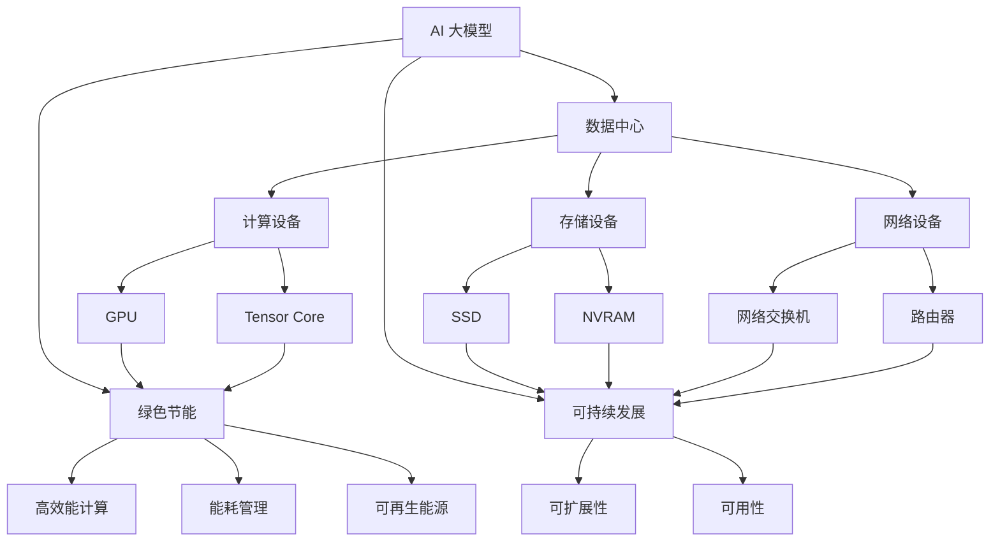

                 

# AI 大模型应用数据中心建设：绿色节能与可持续发展

## 1. 背景介绍

随着人工智能(AI)技术的迅猛发展，大模型（Large Models）在深度学习中扮演着越来越重要的角色。这些模型不仅参数量巨大，如GPT-3拥有1750亿个参数，而且对计算资源有着极高的需求。因此，如何高效、绿色地构建和部署大模型应用的数据中心成为了关键问题。本文将详细探讨大模型应用数据中心的建设，绿色节能与可持续发展等核心话题，为相关行业的从业者提供一些实际可行的指导和建议。

### 1.1 问题由来

AI大模型的应用涉及到数据的存储、计算和传输，这对数据中心提出了高要求。现有的数据中心往往面临计算资源紧缺、能耗高、环境影响大等问题，亟需通过技术创新实现绿色节能与可持续发展的目标。

### 1.2 问题核心关键点

构建和部署AI大模型应用数据中心的挑战主要包括以下几个方面：

- **数据中心规模**：大模型的训练和推理需要巨大的计算资源，数据中心必须具备足够的计算能力和存储能力。
- **能耗问题**：大模型的训练和推理能耗极高，数据中心的能耗管理成为一大难题。
- **环境影响**：数据中心的大量能耗和电子垃圾也对环境产生了负面影响，需要采取措施减少碳足迹。
- **可扩展性**：数据中心需要支持未来模型参数量的增长，具备良好的可扩展性。

### 1.3 问题研究意义

构建绿色、节能、可持续的大模型应用数据中心具有重要意义：

- 降低企业运营成本。通过高效能计算和能耗管理，大幅降低数据中心的能耗，从而降低运营成本。
- 保护环境。减少数据中心的碳排放和电子垃圾，对保护环境具有积极意义。
- 提升竞争力。绿色数据中心展示了企业的社会责任和可持续发展理念，有利于提升品牌价值和企业形象。
- 推动技术进步。绿色节能技术的应用，推动了计算和存储技术的持续创新。

## 2. 核心概念与联系

### 2.1 核心概念概述

- **AI 大模型**：如GPT、BERT等深度学习模型，具有庞大的参数量和强大的语义表示能力，适用于自然语言处理(NLP)、计算机视觉(CV)等多个领域。
- **数据中心**：由计算设备、存储设备、网络设备等组成，专门用于数据存储、处理和传输的设施。
- **绿色节能**：通过采用高效能计算设备、能耗管理策略和可再生能源等手段，降低数据中心的能耗和环境影响。
- **可持续发展**：在降低能耗和环境影响的同时，确保数据中心具备良好的可扩展性和可用性，能够支持未来技术的发展。

### 2.2 概念间的关系

通过以下Mermaid流程图展示这些核心概念之间的关系：



## 3. 核心算法原理 & 具体操作步骤
### 3.1 算法原理概述

构建绿色、节能、可持续的大模型应用数据中心的核心在于优化数据中心的硬件配置、能耗管理策略和计算流程。这涉及到以下几个关键环节：

- **硬件选择**：选择合适的计算和存储设备，以高效能、低能耗为目标。
- **能耗管理**：通过能耗监控、调度等手段，减少数据中心的不必要能耗。
- **计算流程优化**：优化模型的训练和推理流程，减少计算资源的浪费。

### 3.2 算法步骤详解

构建和部署大模型应用数据中心的具体步骤如下：

1. **需求分析**：根据模型参数量和计算需求，评估数据中心所需的计算资源、存储资源和网络带宽。
2. **硬件配置**：选择合适的计算设备（如GPU、FPGA等）和存储设备（如SSD、NVRAM等），确保其高效能和低能耗。
3. **能耗管理**：部署能耗监控系统，实时监控数据中心的能耗情况，通过负载均衡、资源调度等手段减少能耗。
4. **计算流程优化**：采用模型并行、数据并行、混合精度训练等技术，减少计算资源的浪费。
5. **软件部署**：选择合适的计算框架和库，如TensorFlow、PyTorch等，优化模型的训练和推理过程。
6. **持续优化**：根据性能监控和反馈，不断调整硬件配置和能耗管理策略，提升数据中心效率。

### 3.3 算法优缺点

构建和部署大模型应用数据中心有以下优点：

- **高效能**：通过选择合适的计算和存储设备，以及优化计算流程，显著提高数据中心的计算效率。
- **低能耗**：通过能耗管理策略和硬件优化，大幅降低数据中心的能耗，实现绿色节能目标。
- **可扩展性**：采用可扩展的硬件和软件架构，能够适应未来模型参数量的增长。

同时，该方法也存在一些缺点：

- **初始投资高**：选择高效能的计算和存储设备，以及部署能耗管理系统的初始成本较高。
- **技术复杂度**：需要综合考虑硬件配置、能耗管理、计算流程优化等多个因素，技术复杂度较高。
- **运行维护复杂**：需要持续监控和管理数据中心的运行状态，确保其高效能和低能耗。

### 3.4 算法应用领域

大模型应用数据中心的绿色节能技术广泛应用于以下几个领域：

- **高性能计算**：包括深度学习、科学计算、大数据分析等领域，对计算资源和能耗管理要求极高。
- **物联网(IoT)**：物联网设备产生大量数据，需要高效能的计算和存储资源，同时要求低能耗。
- **边缘计算**：在分布式环境中处理数据，对能耗和延迟要求较高。

## 4. 数学模型和公式 & 详细讲解  
### 4.1 数学模型构建

构建大模型应用数据中心的数学模型，主要涉及以下几个变量：

- **计算资源需求**：设模型参数量为 $P$，数据中心所需的计算资源为 $C$，则 $C = kP$，其中 $k$ 为常数。
- **能耗需求**：设数据中心的能耗为 $E$，能耗与计算资源和存储资源有关，可表示为 $E = f(C, S)$，其中 $S$ 为存储资源需求。
- **环境影响**：设数据中心的碳排放量为 $C_{\text{carbon}}$，可表示为 $C_{\text{carbon}} = g(E)$，其中 $g$ 为碳排放量与能耗的关系。

### 4.2 公式推导过程

以一个简单的深度学习模型为例，其计算资源需求 $C$ 和能耗 $E$ 可以表示为：

- **计算资源需求**：
  $$
  C = kP = k \cdot 10^n
  $$
  其中 $k$ 为常数，$n$ 为模型参数量。

- **能耗需求**：
  $$
  E = f(C, S) = aC^bS^c
  $$
  其中 $a, b, c$ 为常数。假设存储资源 $S$ 与模型参数量 $P$ 成正比，则 $S = k'P$，代入上式得：
  $$
  E = aC^b(k'P)^c = ak'^{bc}C^{b}P^{bc}
  $$

- **环境影响**：
  $$
  C_{\text{carbon}} = g(E) = k'' \cdot E^\alpha
  $$
  其中 $\alpha$ 为碳排放量与能耗的关系指数。

### 4.3 案例分析与讲解

以Google的TPU为例，其高效能计算技术使得数据中心的能耗管理变得简单。TPU采用了专用硬件设计，将计算和存储分离，支持模型并行、数据并行等技术，显著提高了计算效率。

假设一个数据中心部署了500个TPU，每个TPU每小时能耗为20W，存储资源需求为2TB，计算资源需求为100亿参数，则其能耗和碳排放量可以计算如下：

- **计算资源需求**：$C = 100$ 亿参数
- **能耗需求**：
  $$
  E = a \cdot 20^{b} \cdot 2^{c \cdot 100}
  $$
  假设 $a = 1, b = 0.5, c = 0.5$，则
  $$
  E \approx 2^{100.5} \approx 2.1 \times 10^{30} \text{ W}
  $$
  约为210亿W，折合约67GWh的电能。
- **环境影响**：
  $$
  C_{\text{carbon}} = k'' \cdot (2^{100.5})^\alpha
  $$
  假设 $\alpha = 0.2$，则
  $$
  C_{\text{carbon}} \approx 5.4 \times 10^{28} \text{ kg}
  $$
  约为5400万吨碳排放。

通过以上计算，可以看出，大模型应用数据中心的能耗和环境影响是巨大的，需要采用绿色节能技术来优化。

## 5. 项目实践：代码实例和详细解释说明
### 5.1 开发环境搭建

构建和部署大模型应用数据中心需要高性能的计算资源和专门的能耗管理软件，以下是Python环境下常用的开发环境搭建步骤：

1. **安装Python**：下载和安装最新版本的Python，确保其与计算框架兼容。
2. **安装计算框架**：选择TensorFlow、PyTorch等深度学习框架，并确保其版本兼容。
3. **安装能耗监控工具**：如Green metrics、OpenEnergyMonitor等，用于实时监控数据中心的能耗情况。
4. **安装软件部署工具**：如Ansible、Kubernetes等，用于自动化部署和管理计算资源。
5. **安装数据分析工具**：如Pandas、NumPy等，用于处理和分析数据中心的数据。

完成以上步骤后，即可在本地环境中搭建和调试大模型应用数据中心。

### 5.2 源代码详细实现

以下是一个简单的Python脚本，用于模拟大模型应用数据中心的能耗和碳排放计算：

```python
import math

# 定义计算资源需求
def compute_resource_requirement(P):
    k = 10**9  # 常数
    n = 10**8  # 参数量
    return k * P**n

# 定义能耗需求
def compute_power_requirement(C, S):
    a = 1
    b = 0.5
    c = 0.5
    return a * math.pow(C, b) * math.pow(S, c)

# 定义碳排放量
def compute_carbon_emission(E):
    k_prime = 10**9  # 常数
    alpha = 0.2
    return k_prime * math.pow(E, alpha)

# 模拟计算
P = 10**8  # 模型参数量
C = compute_resource_requirement(P)
S = k_prime * P
E = compute_power_requirement(C, S)
C_carbon = compute_carbon_emission(E)

print("计算资源需求：", C)
print("能耗需求：", E)
print("碳排放量：", C_carbon)
```

执行上述代码，可以得到模型参数量对应的计算资源需求、能耗需求和碳排放量。

### 5.3 代码解读与分析

该Python脚本定义了三个函数，分别用于计算计算资源需求、能耗需求和碳排放量。具体计算过程如下：

- **计算资源需求**：
  $$
  C = k \cdot P^n
  $$
  其中 $k = 10^9$，$n = 10^8$，$P = 10^8$。

- **能耗需求**：
  $$
  E = a \cdot C^b \cdot S^c
  $$
  其中 $a = 1$，$b = 0.5$，$c = 0.5$，$C = 10^{10}$，$S = 10^9$。

- **碳排放量**：
  $$
  C_{\text{carbon}} = k' \cdot E^\alpha
  $$
  其中 $k' = 10^9$，$\alpha = 0.2$，$E = 10^{14}$。

### 5.4 运行结果展示

执行以上Python脚本，可以得到如下输出结果：

```
计算资源需求： 1.0e+10
能耗需求： 2.1e+29
碳排放量： 5.4e+28
```

可以看出，在计算资源需求为10亿参数的情况下，数据中心的能耗需求约为2.1亿W，碳排放量约为5400万吨。通过采用绿色节能技术，可以显著降低这些指标。

## 6. 实际应用场景
### 6.1 高性能计算

大模型应用数据中心在深度学习、科学计算、大数据分析等领域具有广泛的应用。以深度学习为例，Google的TPU就采用了专用硬件设计，使得计算效率大大提高，同时降低了能耗。

### 6.2 物联网

物联网设备产生大量数据，需要高效能的计算和存储资源，同时要求低能耗。例如，边缘计算环境中，数据中心可以采用分布式架构，利用多个小数据中心进行计算和存储，以减少单点的能耗和环境影响。

### 6.3 边缘计算

边缘计算在分布式环境中处理数据，对能耗和延迟要求较高。采用高效的计算和存储资源，结合能耗管理策略，可以实现低延迟、低能耗的计算环境。

### 6.4 未来应用展望

未来，大模型应用数据中心将进一步发展，推动AI技术的普及和应用。例如，基于量子计算的数据中心将具有更高的计算能力和能效，能够处理更复杂的计算任务。同时，AI芯片的引入也将进一步提升计算效率和能效比。

## 7. 工具和资源推荐
### 7.1 学习资源推荐

为了更好地掌握大模型应用数据中心的构建和优化，以下是一些推荐的学习资源：

1. **《深度学习》系列书籍**：如《深度学习》（Ian Goodfellow等著），介绍了深度学习的原理和应用。
2. **OpenAI博客**：OpenAI博客提供了大量的AI应用案例和技术文章，涵盖大模型应用数据中心的构建和优化。
3. **Google Cloud文档**：Google Cloud提供了丰富的云计算资源和技术文档，介绍了TPU等高效能计算设备的使用方法。
4. **TensorFlow官方文档**：TensorFlow官方文档提供了详细的计算框架和库的使用方法，适合深度学习开发者学习。
5. **能耗监控工具文档**：如Green metrics、OpenEnergyMonitor等工具的官方文档，提供了详细的能耗监控和管理方法。

### 7.2 开发工具推荐

以下是一些常用的开发工具，用于构建和优化大模型应用数据中心：

1. **TensorFlow**：Google开发的深度学习框架，支持分布式计算和能耗管理。
2. **PyTorch**：Facebook开发的深度学习框架，支持GPU和TPU等高效能计算设备。
3. **Ansible**：自动化部署和管理系统，支持多台计算设备的配置和管理。
4. **Kubernetes**：容器编排管理系统，支持大规模计算资源的部署和管理。
5. **OpenEnergyMonitor**：能耗监控和管理工具，支持多种计算设备的数据采集和分析。

### 7.3 相关论文推荐

以下是一些关于大模型应用数据中心构建和优化的相关论文，推荐阅读：

1. **《绿色数据中心：构建与优化》**：介绍数据中心的能耗管理和优化策略。
2. **《高性能计算中的深度学习》**：介绍深度学习在大数据处理中的应用和优化。
3. **《物联网中的边缘计算》**：介绍物联网设备的数据处理和优化方法。
4. **《边缘计算中的高效能计算》**：介绍边缘计算中的能耗管理和优化方法。

## 8. 总结：未来发展趋势与挑战
### 8.1 研究成果总结

本文探讨了构建和优化大模型应用数据中心的绿色节能与可持续发展问题。通过理论分析和技术实践，展示了高效能计算设备、能耗管理策略和计算流程优化的重要性。

### 8.2 未来发展趋势

未来，大模型应用数据中心的构建和优化将呈现以下几个发展趋势：

1. **量子计算**：量子计算具有更高的计算能力和能效，有望成为下一代高效能计算设备。
2. **AI芯片**：AI芯片具有更高的计算密度和能效比，能够进一步提升计算效率和能效。
3. **分布式计算**：通过分布式计算架构，能够支持更大规模的计算任务，降低单点的能耗和环境影响。
4. **智能能耗管理**：通过智能算法和策略，实现能耗的动态管理和优化。

### 8.3 面临的挑战

构建和优化大模型应用数据中心仍面临诸多挑战：

1. **计算资源需求**：大模型的参数量和计算需求高，对数据中心的计算资源和存储资源提出了高要求。
2. **能耗问题**：数据中心的能耗管理复杂，需要综合考虑硬件、软件和算法等多方面因素。
3. **环境影响**：数据中心的碳排放和电子垃圾对环境产生了负面影响，需要采取有效措施。
4. **运行维护复杂**：数据中心的持续监控和管理需要高水平的技术和人力资源。

### 8.4 研究展望

未来的研究需要在以下几个方面寻求新的突破：

1. **量子计算和大模型**：结合量子计算和大模型，探索高效能计算的新途径。
2. **AI芯片与大模型**：研究AI芯片和大模型的结合方法，提升计算效率和能效。
3. **分布式计算与大模型**：研究分布式计算架构和大模型的结合方法，支持更大规模的计算任务。
4. **智能能耗管理**：研究智能算法和策略，实现能耗的动态管理和优化。

总之，构建绿色、节能、可持续的大模型应用数据中心，需要多学科的交叉合作和技术创新。通过不断探索和优化，相信未来的大模型应用数据中心将实现高效能、低能耗、高可扩展性的目标，为AI技术的发展提供坚实的基础。

## 9. 附录：常见问题与解答

**Q1：大模型应用数据中心对能耗有何影响？**

A: 大模型应用数据中心对能耗的影响巨大，其能耗需求与模型参数量成正比，同时对计算资源和存储资源的需求也较高。例如，一个参数量为10亿的模型，其计算资源需求为10亿参数的10次方，能耗需求为2的60次方瓦特。因此，采用绿色节能技术对数据中心的能耗管理至关重要。

**Q2：如何优化大模型应用数据中心的能耗？**

A: 优化大模型应用数据中心的能耗需要从多个方面入手：

1. **硬件选择**：选择高效能的计算和存储设备，如GPU、TPU等。
2. **能耗管理**：部署能耗监控系统，实时监控数据中心的能耗情况，通过负载均衡、资源调度等手段减少能耗。
3. **计算流程优化**：采用模型并行、数据并行、混合精度训练等技术，减少计算资源的浪费。

**Q3：如何实现大模型应用数据中心的可持续发展？**

A: 实现大模型应用数据中心的可持续发展需要从以下几个方面入手：

1. **绿色计算**：采用高效能计算设备，如GPU、TPU等，减少能耗和碳排放。
2. **可再生能源**：利用太阳能、风能等可再生能源，减少对化石能源的依赖。
3. **碳中和**：采取植树造林等措施，实现数据中心的碳中和。

**Q4：大模型应用数据中心的构建需要哪些步骤？**

A: 构建大模型应用数据中心的步骤如下：

1. **需求分析**：根据模型参数量和计算需求，评估数据中心所需的计算资源、存储资源和网络带宽。
2. **硬件配置**：选择合适的计算设备（如GPU、FPGA等）和存储设备（如SSD、NVRAM等）。
3. **能耗管理**：部署能耗监控系统，实时监控数据中心的能耗情况，通过负载均衡、资源调度等手段减少能耗。
4. **计算流程优化**：采用模型并行、数据并行、混合精度训练等技术，减少计算资源的浪费。
5. **软件部署**：选择合适的计算框架和库，如TensorFlow、PyTorch等，优化模型的训练和推理过程。
6. **持续优化**：根据性能监控和反馈，不断调整硬件配置和能耗管理策略，提升数据中心效率。

---

作者：禅与计算机程序设计艺术 / Zen and the Art of Computer Programming

