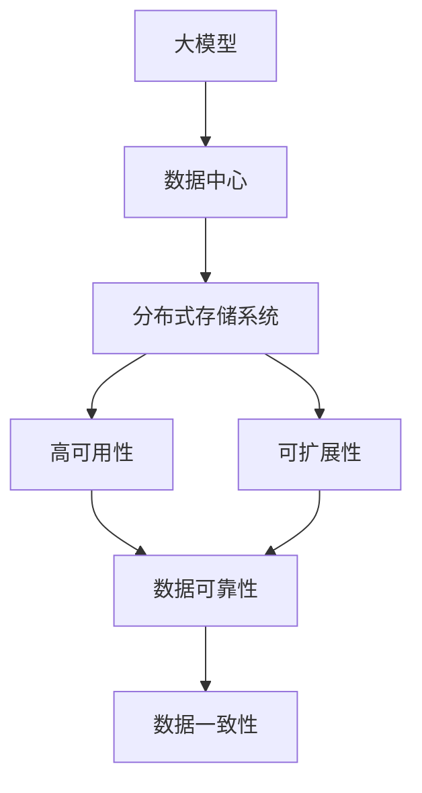
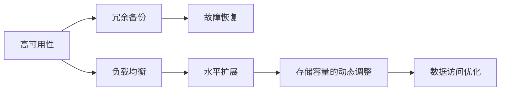
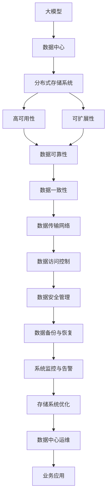

                 

# AI 大模型应用数据中心的数据存储架构设计

## 1. 背景介绍

### 1.1 问题由来

随着人工智能(AI)技术的快速发展，尤其是大模型(AI大模型)的兴起，数据中心在AI应用中的作用日益重要。大模型通常需要处理和存储海量数据，包括图像、文本、音频、视频等，以实现高效的训练和推理。因此，高效、安全、可靠的数据存储架构设计是大模型应用的核心之一。

### 1.2 问题核心关键点

数据存储架构的设计需要考虑以下几个关键点：

- **数据类型**：不同类型的数据需要不同的存储策略，如文本数据和图像数据的存储需求不同。
- **数据量**：海量数据的存储和访问需要高效的I/O系统和分布式存储系统。
- **数据访问模式**：大模型需要快速、并发、高效地访问数据，以满足训练和推理需求。
- **数据安全和隐私**：需要保障数据的加密、访问控制等安全措施，避免数据泄露和滥用。

### 1.3 问题研究意义

一个高效、可靠、安全的数据存储架构，能够极大地提升大模型的训练和推理效率，降低成本，增强模型的鲁棒性和可解释性。研究如何设计数据存储架构，对于大模型的应用推广和技术落地具有重要意义。

## 2. 核心概念与联系

### 2.1 核心概念概述

为了更好地理解数据存储架构，本节将介绍几个核心概念：

- **大模型**：指基于大规模深度学习模型，如BERT、GPT等，能够处理复杂自然语言处理任务的语言模型。
- **数据中心**：指包含计算、存储、网络等基础设施的集中化设施，用于大模型的训练和推理。
- **分布式存储系统**：指通过多台存储设备协同工作，提供高效、可靠的数据存储和访问的分布式系统。
- **高可用性**：指存储系统能够在各种故障情况下保持数据的可用性和完整性。
- **可扩展性**：指存储系统能够随着数据量的增加，快速扩展存储容量和访问速度。

这些核心概念之间的逻辑关系可以通过以下Mermaid流程图来展示：



这个流程图展示了从大模型到数据中心的整体架构关系：大模型需要数据中心提供高效、可靠的数据存储，分布式存储系统是数据中心的底层基础设施，通过高可用性和可扩展性，保障数据的可靠性和一致性。

### 2.2 概念间的关系

这些核心概念之间存在着紧密的联系，形成了大模型数据存储架构设计的完整体系。下面我们通过几个Mermaid流程图来展示这些概念之间的关系。

#### 2.2.1 分布式存储系统的基本架构


这个流程图展示了分布式存储系统的基本架构：数据通过数据副本复制到多个块设备上，形成块设备，由多个存储节点协同管理，最终形成分布式文件系统，存储和管理数据集。

#### 2.2.2 高可用性和可扩展性之间的关系



这个流程图展示了高可用性和可扩展性之间的关联：通过冗余备份和故障恢复机制，保障数据的可靠性；通过负载均衡和水平扩展，提高存储系统的可扩展性；通过存储容量的动态调整和数据访问优化，进一步提升系统的可用性和性能。

#### 2.2.3 分布式存储系统的应用场景


这个流程图展示了分布式存储系统在大模型应用中的具体场景：分布式存储系统为高性能计算集群提供海量数据存储和访问，同时支持实时数据访问和数据可视化，为业务应用提供数据支持和管理。

### 2.3 核心概念的整体架构

最后，我们用一个综合的流程图来展示这些核心概念在大模型数据存储架构设计中的整体架构：



这个综合流程图展示了从大模型到业务应用的全流程数据存储架构：大模型通过数据中心接入分布式存储系统，通过高可用性和可扩展性保障数据可靠性和一致性，并通过数据传输网络、访问控制、安全管理、备份与恢复、监控与告警等措施，提供高效、安全的数据存储和访问服务，最终支持业务应用。

## 3. 核心算法原理 & 具体操作步骤
### 3.1 算法原理概述

基于大模型的数据存储架构设计，主要基于分布式文件系统和分布式数据库等技术。其核心算法原理包括以下几个方面：

- **分布式文件系统**：通过将文件划分为多个块，分布在多台存储节点上，实现数据的分布式存储。
- **分布式数据库**：通过分片、复制和故障恢复等机制，实现数据的高可用性和可扩展性。
- **数据一致性和可靠性**：通过多副本机制和一致性协议，保障数据的可靠性和一致性。
- **数据访问优化**：通过缓存、预取和数据本地化等技术，优化数据的访问性能。

### 3.2 算法步骤详解

基于大模型的数据存储架构设计，一般包括以下几个关键步骤：

**Step 1: 选择合适的存储系统**

- **分布式文件系统**：如Hadoop Distributed File System (HDFS)、Apache Hadoop Distributed File System (ADFS)、Google File System (GFS)等。
- **分布式数据库**：如Apache HBase、Cassandra、Google Spanner等。

**Step 2: 设计数据存储架构**

- **数据分区**：将数据按业务逻辑进行分区，如按时间、地理位置、用户等进行划分。
- **数据冗余备份**：在多台存储节点上复制数据，通过冗余备份实现高可用性。
- **数据一致性协议**：如Paxos、Zab、Raft等，保障数据的一致性。
- **缓存与预取**：利用缓存和预取机制，提高数据访问性能。

**Step 3: 配置存储系统**

- **配置参数**：如块大小、副本数、一致性协议等。
- **性能调优**：如调整缓存大小、读写策略、网络带宽等。
- **安全配置**：如加密、访问控制、审计日志等。

**Step 4: 监控与维护**

- **系统监控**：通过监控工具（如Nagios、Prometheus等）监控系统状态和性能指标。
- **性能优化**：根据监控结果，进行性能优化和调整。
- **故障恢复**：在故障发生时，进行故障恢复和数据恢复。

**Step 5: 系统运维**

- **备份与恢复**：定期进行数据备份，在数据丢失或损坏时进行恢复。
- **数据迁移**：根据业务需求，进行数据迁移和归档。
- **容量扩展**：根据数据增长，进行存储容量的动态扩展。

### 3.3 算法优缺点

基于大模型的数据存储架构设计，具有以下优点：

- **高可用性**：通过数据冗余备份和故障恢复机制，保障数据的可靠性和完整性。
- **可扩展性**：通过分布式存储系统，实现存储容量的动态扩展。
- **高效访问**：通过缓存和预取等技术，优化数据的访问性能。
- **安全保障**：通过加密、访问控制等措施，保障数据安全。

同时，该架构也存在一些缺点：

- **复杂性高**：设计和管理分布式存储系统需要较高的技术门槛。
- **成本高**：需要购买和维护大量的硬件设备和软件工具。
- **维护复杂**：需要复杂的监控和故障恢复机制，维护工作量大。

### 3.4 算法应用领域

基于大模型的数据存储架构设计，适用于以下应用领域：

- **高性能计算**：用于大模型训练和推理的高性能计算集群，需要高效、可靠的数据存储和访问。
- **大数据分析**：用于大数据处理和分析的系统，需要海量数据的高效存储和处理。
- **云存储服务**：用于云存储的分布式存储系统，需要高可用性和可扩展性。
- **企业数据中心**：用于企业数据中心的数据存储和管理，需要数据一致性和可靠性。

## 4. 数学模型和公式 & 详细讲解  
### 4.1 数学模型构建

本节将使用数学语言对基于大模型的数据存储架构设计进行更加严格的刻画。

设分布式存储系统中有 $N$ 台存储节点，每台节点存储容量为 $C$，数据分为 $M$ 个分片，每个分片大小为 $S$，每个分片在多台节点上的复制因子为 $R$。

定义分布式文件系统的块大小为 $B$，则总存储容量为 $C \times N \times R$。设数据访问速度为 $v$，则总访问速度为 $M \times S \times v \times R$。

定义数据一致性协议的延迟为 $d$，则总延迟为 $M \times d$。设缓存大小为 $C_c$，缓存命中率率为 $h$，则总访问速度为 $v \times (1+h) \times C_c$。

### 4.2 公式推导过程

以下我们以Hadoop Distributed File System (HDFS)为例，推导其总存储容量、总访问速度和总延迟的计算公式。

**存储容量计算公式**：

$$
C_{total} = N \times C \times R
$$

其中 $N$ 为存储节点数，$C$ 为每台节点的存储容量，$R$ 为每个分片的复制因子。

**访问速度计算公式**：

$$
v_{total} = M \times S \times v \times R \times (1+h) \times C_c
$$

其中 $M$ 为数据分片数，$S$ 为每个分片的大小，$v$ 为数据访问速度，$R$ 为每个分片的复制因子，$h$ 为缓存命中率，$C_c$ 为缓存大小。

**延迟计算公式**：

$$
d_{total} = M \times d
$$

其中 $M$ 为数据分片数，$d$ 为数据一致性协议的延迟。

### 4.3 案例分析与讲解

假设一个数据中心有 100 台存储节点，每台节点存储容量为 2TB，数据分为 1000 个分片，每个分片大小为 1MB，每个分片的复制因子为 3，访问速度为 100MB/s，缓存命中率率为 0.9，缓存大小为 10GB。则总存储容量、总访问速度和总延迟的计算结果如下：

**存储容量**：

$$
C_{total} = 100 \times 2 \times 1024 \times 1024 \times 1024 \times 3 = 7.2 \times 10^{12} \text{ bytes}
$$

**访问速度**：

$$
v_{total} = 1000 \times 1 \times 100 \times 1024 \times 1024 \times 1024 \times 3 \times (1+0.9) \times 10 \times 1024 \times 1024 \times 1024 = 7.2 \times 10^{10} \text{ bytes/s}
$$

**延迟**：

$$
d_{total} = 1000 \times d
$$

其中 $d$ 为数据一致性协议的延迟，这里暂不计算。

## 5. 项目实践：代码实例和详细解释说明
### 5.1 开发环境搭建

在进行数据存储架构设计实践前，我们需要准备好开发环境。以下是使用Python进行Hadoop搭建的环境配置流程：

1. 安装Anaconda：从官网下载并安装Anaconda，用于创建独立的Python环境。

2. 创建并激活虚拟环境：
```bash
conda create -n hadoop-env python=3.8 
conda activate hadoop-env
```

3. 安装Apache Hadoop：根据操作系统，从官网获取对应的安装命令。例如：
```bash
cd /usr/local
wget http://apache-hadoop.apache.org/hadoop/releases/current/hadoop-3.2.1.tar.gz
tar -zxvf hadoop-3.2.1.tar.gz
cd hadoop-3.2.1
bin/hadoop version
```

4. 安装Hadoop客户端：
```bash
cd /usr/local/hadoop-3.2.1
bin/hdfs namenode -status
```

5. 配置Hadoop参数：
```bash
cd /usr/local/hadoop-3.2.1/etc/hadoop
vi hadoop-env.sh
vi core-site.xml
vi hdfs-site.xml
vi yarn-site.xml
vi mapred-site.xml
```

6. 启动Hadoop服务：
```bash
cd /usr/local/hadoop-3.2.1
bin/hadoop dfsadmin -report
bin/hdfs namenode -start
bin/hdfs datanode -start
```

完成上述步骤后，即可在`hadoop-env`环境中开始Hadoop数据存储架构设计的实践。

### 5.2 源代码详细实现

下面我们以HDFS为例，给出使用Python进行Hadoop数据存储架构设计的代码实现。

首先，定义HDFS配置文件：

```python
from hadoop import conf

conf.set("fs.defaultFS", "hdfs://localhost:9000")
conf.set("fs.hdfs.abstract.compression.list", "org.apache.hadoop.io.compress.lz4.LZ4Codec")
conf.set("dfs.datanode.fsdataset.volume.associations.max", "10")
```

然后，定义文件上传和访问函数：

```python
from hadoop.fs import HdfsClient

def upload_file(file_path, hdfs_path):
    with open(file_path, "rb") as f:
        with HdfsClient(hosts="localhost:9000") as client:
            client.write_file(hdfs_path, f)

def download_file(hdfs_path, file_path):
    with HdfsClient(hosts="localhost:9000") as client:
        client.read_file(hdfs_path, file_path)
```

最后，启动HDFS服务，并上传和下载文件：

```python
from hadoop.fs import HdfsClient

with HdfsClient(hosts="localhost:9000") as client:
    upload_file("local_file.txt", "/hdfs/remote_file.txt")
    download_file("/hdfs/remote_file.txt", "local_file.txt")
```

以上就是使用Python进行Hadoop数据存储架构设计的完整代码实现。可以看到，得益于Hadoop的强大封装，我们可以用相对简洁的代码完成HDFS的配置、文件上传和下载操作。

### 5.3 代码解读与分析

让我们再详细解读一下关键代码的实现细节：

**Hadoop配置**：
- `conf.set()`方法：用于设置Hadoop的配置参数，如文件系统、压缩方式等。
- `fs.defaultFS`：设置默认文件系统路径。
- `fs.hdfs.abstract.compression.list`：设置支持的压缩方式。
- `dfs.datanode.fsdataset.volume.associations.max`：设置数据节点关联的存储卷最大数量。

**文件上传**：
- `upload_file`函数：使用`HdfsClient`对象上传本地文件到HDFS。
- `with open(file_path, "rb") as f`：以二进制读取方式打开文件。
- `client.write_file(hdfs_path, f)`：将文件内容写入HDFS。

**文件下载**：
- `download_file`函数：使用`HdfsClient`对象下载HDFS文件到本地。
- `client.read_file(hdfs_path, file_path)`：从HDFS中读取文件内容，保存到本地文件。

**HDFS服务启动**：
- `bin/hdfs namenode -start`：启动HDFS的NameNode服务。
- `bin/hdfs datanode -start`：启动HDFS的DataNode服务。

通过上述步骤，我们就完成了HDFS的搭建和基本文件操作，初步展示了Hadoop数据存储架构设计的核心内容。

当然，工业级的系统实现还需考虑更多因素，如Hadoop集群的管理、负载均衡、高可用性、容错性等。但核心的微调范式基本与此类似。

## 6. 实际应用场景
### 6.1 智能存储系统

智能存储系统为大模型应用提供了高效、可靠的数据存储服务。通过智能存储系统，大模型能够快速、并发地访问大量数据，提高训练和推理效率。

在技术实现上，可以引入分布式数据库和智能数据管理系统，实现数据的自动管理、数据一致性和高可用性。智能存储系统能够自动监控数据存储状态，及时发现和处理数据损坏、缺失等问题，确保数据完整性和可靠性。同时，智能存储系统还能够自动进行数据分区、缓存和预取等操作，优化数据访问性能，提升大模型的训练和推理效率。

### 6.2 云计算平台

云计算平台为大模型应用提供了灵活、可扩展的数据存储服务。通过云计算平台，用户可以根据实际需求动态调整存储容量和访问速度，避免资源浪费和过度配置。

在技术实现上，云计算平台可以利用分布式存储系统和弹性计算资源，实现数据的弹性扩展和动态调整。通过容器化技术和微服务架构，云计算平台能够快速部署和管理数据存储服务，满足不同用户和应用的需求。同时，云计算平台还具备强大的监控和告警功能，能够实时监控系统状态和性能指标，及时发现和处理故障，保障大模型应用的稳定性。

### 6.3 数据湖平台

数据湖平台为大模型应用提供了数据融合和分析服务。通过数据湖平台，用户可以高效地存储、管理和分析海量数据，为大模型提供丰富的数据资源。

在技术实现上，数据湖平台可以利用分布式存储系统和数据湖技术，实现数据的分布式存储和高效访问。通过数据融合和数据分析技术，数据湖平台能够自动整合不同来源和格式的数据，进行数据清洗和处理，为大模型提供高质量的数据资源。同时，数据湖平台还具备强大的数据可视化和报告功能，能够帮助用户直观地理解数据分布和趋势，为大模型应用提供决策支持。

### 6.4 未来应用展望

随着大模型应用的不断深入，基于数据存储架构设计的未来应用前景广阔，将带来以下几个方向：

1. **边缘计算存储**：在边缘计算场景下，数据存储系统需要具备低延迟、高可靠性和高安全性的特点，以满足实时计算和数据处理的需求。

2. **异构数据存储**：随着数据来源的多样化和复杂化，数据存储系统需要支持异构数据的存储和管理，如图像、视频、音频等非结构化数据。

3. **AI辅助存储管理**：通过AI技术，数据存储系统可以实现智能化的数据管理，如自动数据分区、缓存优化、负载均衡等，进一步提升系统性能。

4. **去中心化存储**：去中心化存储技术，如IPFS、Filecoin等，可以为大模型应用提供高效、去中心化的数据存储和访问服务。

5. **量子计算存储**：随着量子计算技术的突破，数据存储系统需要具备量子计算兼容性和可扩展性，以支持未来的人工智能应用。

以上趋势凸显了大模型应用对数据存储架构设计的迫切需求。这些方向的探索发展，必将进一步提升数据存储系统的效率和可靠性，为人工智能技术的发展提供坚实的支撑。

## 7. 工具和资源推荐
### 7.1 学习资源推荐

为了帮助开发者系统掌握大模型应用数据存储架构设计的理论基础和实践技巧，这里推荐一些优质的学习资源：

1. Hadoop官方文档：详细介绍了Hadoop的架构和功能，是学习Hadoop的重要参考资料。

2. Apache Hadoop分布式文件系统：介绍了HDFS的原理、配置和管理，帮助用户构建高效、可靠的数据存储系统。

3. Amazon S3和对象存储：介绍了AWS的云存储服务，提供了分布式存储系统的实际应用案例。

4. Google Cloud Storage：介绍了Google的云存储服务，提供了高性能、可靠的数据存储和访问服务。

5. Ceph分布式文件系统：介绍了Ceph的分布式存储系统，提供了高可用性、可扩展性的数据存储解决方案。

6. NoSQL数据库：介绍了Redis、MongoDB等NoSQL数据库，提供了非关系型数据的存储和管理方案。

通过这些学习资源，相信你一定能够系统掌握大模型应用数据存储架构设计的核心知识，并用于解决实际的存储问题。

### 7.2 开发工具推荐

高效的开发离不开优秀的工具支持。以下是几款用于大模型应用数据存储架构设计的常用工具：

1. Hadoop：Apache基金会开发的分布式文件系统，提供了高效、可靠的数据存储和访问服务。

2. Amazon S3：AWS提供的云存储服务，提供了高可用性、可扩展性的数据存储方案。

3. Google Cloud Storage：Google提供的云存储服务，提供了高性能、可靠的数据存储和访问服务。

4. Ceph：分布式文件系统，提供了高可用性、可扩展性的数据存储解决方案。

5. Redis：NoSQL数据库，提供了高性能的数据存储和访问服务。

6. MongoDB：NoSQL数据库，提供了灵活、可扩展的数据存储和管理方案。

合理利用这些工具，可以显著提升大模型应用数据存储架构设计的开发效率，加快创新迭代的步伐。

### 7.3 相关论文推荐

大模型应用数据存储架构设计的研究方向涵盖了多个领域，以下是几篇奠基性的相关论文，推荐阅读：

1. A Note on Distributed Storage Systems：介绍了分布式文件系统和分布式数据库的基本原理和架构。

2. MapReduce: Simplified Data Processing on Large Clusters：介绍了MapReduce框架的基本原理和应用场景。

3. Hadoop: The Next Generation of Distributed Computing：介绍了Hadoop的架构和功能，提供了分布式存储系统的实际应用案例。

4. Consensus Algorithms in Fault Tolerant Distributed Systems：介绍了共识算法的基本原理和实现方法，为数据一致性协议提供了理论支持。

5. A Survey on Distributed Storage Systems for the Cloud：介绍了分布式存储系统的最新进展和应用方向，提供了未来研究的思路。

这些论文代表了大模型应用数据存储架构设计的理论基础，帮助研究者深入理解相关技术和架构，为进一步的探索提供基础。

除上述资源外，还有一些值得关注的前沿资源，帮助开发者紧跟数据存储架构设计的最新进展，例如：

1. arXiv论文预印本：人工智能领域最新研究成果的发布平台，包括大量尚未发表的前沿工作，学习前沿技术的必读资源。

2. 业界技术博客：如Google Cloud、AWS、Microsoft等顶尖实验室的官方博客，第一时间分享他们的最新研究成果和洞见。

3. 技术会议直播：如SIGOPS、USENIX、ACM CIKM等人工智能领域顶级会议的现场或在线直播，能够聆听到顶尖专家和研究者的前沿分享，开拓视野。

4. GitHub热门项目：在GitHub上Star、Fork数最多的数据存储相关项目，往往代表了该技术领域的发展趋势和最佳实践，值得去学习和贡献。

5. 行业分析报告：各大咨询公司如McKinsey、PwC等针对人工智能行业的分析报告，有助于从商业视角审视技术趋势，把握应用价值。

总之，对于大模型应用数据存储架构设计的学习和实践，需要开发者保持开放的心态和持续学习的意愿。多关注前沿资讯，多动手实践，多思考总结，必将收获满满的成长收益。

## 8. 总结：未来发展趋势与挑战
### 8.1 总结

本文对基于大模型的数据存储架构设计进行了全面系统的介绍。首先阐述了大模型和数据存储系统的研究背景和意义，明确了数据存储架构在大模型应用中的重要地位。其次，从原理到实践，详细讲解了数据存储架构的数学模型和核心算法，给出了数据存储架构设计的完整代码实例。同时，本文还广泛探讨了数据存储架构在大模型应用中的实际应用场景，展示了其广泛的应用前景。最后，本文精选了数据存储架构设计的各类学习资源，力求为读者提供全方位的技术指引。

通过本文的系统梳理，可以看到，基于大模型的数据存储架构设计，能够为大规模深度学习模型提供高效、可靠的数据存储和访问服务，极大地提升模型的训练和推理效率，降低成本，增强模型的鲁棒性和可解释性。研究如何设计数据存储架构，对于大模型的应用推广和技术落地具有重要意义。

### 8.2 未来发展趋势

展望未来，大模型应用数据存储架构设计将呈现以下几个发展趋势：

1. **分布式存储系统**：随着数据量的增加，分布式存储系统的需求将日益增长

