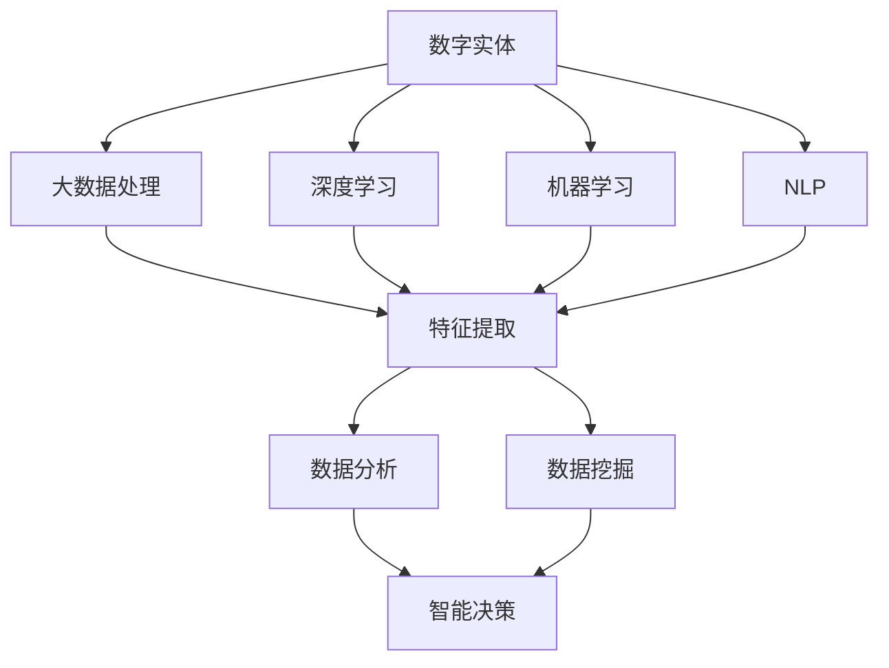

                 

# AI2.0时代：数字实体自动化的潜力

> 关键词：数字自动化,人工智能,大数据,深度学习,大数据处理,机器学习

## 1. 背景介绍

### 1.1 问题由来

随着信息技术的高速发展，人工智能（AI）正逐步进入AI2.0时代。在这个时代，AI系统已经不再是单纯的数据处理工具，而是具备了更强的自主学习能力和广泛应用场景。数字实体自动化（Digital Entity Automation）作为AI2.0时代的重要技术方向，通过对大量数字实体的处理和分析，能够提供更加智能、高效、个性化的解决方案，推动各行业的数字化转型。

当前，数字实体自动化技术的应用已经覆盖了金融、医疗、制造、零售等多个领域，正在深刻影响着人类社会的生产、生活和决策方式。然而，要充分发挥其潜力，还有许多技术难题和实际挑战需要克服。本文将系统介绍数字实体自动化的核心概念、算法原理、应用实践和未来展望，希望能为相关领域的研究者提供有价值的参考。

### 1.2 问题核心关键点

数字实体自动化技术主要依赖于大数据、深度学习、机器学习等先进技术手段，通过对数字实体的自动化处理和分析，实现智能决策、个性化推荐、自动化运营等功能。其核心在于以下几个方面：

1. **大数据处理**：收集和处理大规模数据，提取有价值的信息和模式。
2. **深度学习**：利用神经网络等深度学习模型，进行复杂的模式识别和特征提取。
3. **机器学习**：通过统计学习方法，实现数据分类、聚类和预测。
4. **自然语言处理（NLP）**：理解人类语言，进行文本分析、情感分析等。

这些核心技术通过协同作用，使数字实体自动化技术能够从海量数据中挖掘出有用的信息，支持业务决策，提升运营效率，优化用户体验。

### 1.3 问题研究意义

数字实体自动化技术的深度研究与应用，对于推动各行业的数字化转型，提高生产效率，降低运营成本，提升用户体验具有重要意义：

1. **提升决策科学性**：通过自动化数据分析，提供基于数据的决策支持，提升决策的科学性和准确性。
2. **优化运营效率**：通过自动化流程和智能调度，降低人工成本，提高运营效率。
3. **增强用户体验**：通过个性化推荐和智能客服，提升用户满意度和忠诚度。
4. **促进数据价值化**：通过数据挖掘和分析，释放数据价值，推动业务创新和增长。

总之，数字实体自动化技术将为各行各业带来变革性的影响，推动社会经济的可持续发展。

## 2. 核心概念与联系

### 2.1 核心概念概述

为了更好地理解数字实体自动化的核心概念及其联系，我们将重点介绍以下关键概念：

- **数字实体**：指通过数字化的方式描述和表示的实体，如文本、图像、声音、时间序列等。
- **大数据处理**：指对大规模数据进行收集、存储、清洗、分析等处理过程，以提取有用信息和模式。
- **深度学习**：指利用多层神经网络进行复杂模式识别和特征提取的技术。
- **机器学习**：指通过统计学习算法，实现数据分类、聚类和预测等任务。
- **自然语言处理（NLP）**：指通过算法和技术手段，实现对人类语言的理解、生成、分析和处理。

### 2.2 概念间的关系

这些核心概念之间的关系可以通过以下Mermaid流程图来展示：



这个流程图展示了数字实体自动化技术的主要流程和组件：

1. **数字实体**：作为输入数据，进入大数据处理和特征提取阶段。
2. **大数据处理**：对数字实体进行清洗和预处理，提取关键特征。
3. **深度学习**：通过多层神经网络进行复杂模式识别和特征提取。
4. **机器学习**：对提取的特征进行统计学习，实现数据分类、聚类和预测。
5. **NLP**：用于理解人类语言，进行文本分析、情感分析等。
6. **数据分析**：基于特征和模型，对数据进行深入分析，提取有用信息和模式。
7. **数据挖掘**：利用数据挖掘技术，挖掘潜在的知识模式和规律。
8. **智能决策**：根据分析结果，进行智能决策和预测，支持业务运营。

这些组件共同构成了数字实体自动化的完整生态系统，使其能够高效地处理和分析数字实体，提供智能决策支持。

## 3. 核心算法原理 & 具体操作步骤

### 3.1 算法原理概述

数字实体自动化的核心算法原理主要涉及以下几个方面：

- **数据预处理**：对数字实体进行清洗、归一化、特征提取等预处理操作。
- **特征选择**：根据业务需求和特征重要性，选择关键特征。
- **模型训练**：利用机器学习算法，对数据进行分类、聚类、回归等训练。
- **模型评估**：对训练好的模型进行评估和验证，选择最优模型。
- **模型部署**：将训练好的模型部署到实际应用中，进行实时预测和决策。

### 3.2 算法步骤详解

数字实体自动化的算法步骤通常包括以下几个关键环节：

1. **数据收集与预处理**：收集相关领域的数据，并进行清洗、去重、归一化等预处理操作。
2. **特征提取与选择**：利用统计分析、深度学习等技术，提取关键特征，并选择具有代表性的特征。
3. **模型选择与训练**：根据业务需求，选择适当的机器学习模型（如决策树、随机森林、神经网络等），并在训练集上进行模型训练。
4. **模型评估与验证**：使用验证集对训练好的模型进行评估，选择最优模型。
5. **模型部署与监控**：将最优模型部署到生产环境中，并进行实时监控和维护。

### 3.3 算法优缺点

数字实体自动化的算法具有以下优点：

- **高效性**：通过自动化处理和分析，大幅提升数据处理效率，降低人工成本。
- **准确性**：利用深度学习、机器学习等技术，提高决策的准确性和科学性。
- **可扩展性**：支持大规模数据处理和分析，适用于各类复杂业务场景。
- **实时性**：通过部署在实时计算平台，实现实时预测和决策。

同时，数字实体自动化算法也存在一些缺点：

- **数据依赖性强**：依赖于高质量、大规模的数据，数据质量直接影响模型效果。
- **模型复杂度高**：深度学习等算法模型复杂，需要大量计算资源。
- **解释性差**：一些深度学习模型难以解释其内部工作机制，缺乏可解释性。
- **鲁棒性不足**：面对数据噪声和异常，模型的鲁棒性有待提高。

### 3.4 算法应用领域

数字实体自动化技术已经在多个领域得到了广泛应用，主要包括以下几个方面：

- **金融风险管理**：通过分析交易数据，预测市场风险，实现智能风险管理。
- **医疗健康管理**：利用患者数据，进行健康状况预测和个性化医疗推荐。
- **制造生产优化**：通过对生产数据进行分析，实现生产过程优化和资源优化。
- **零售精准营销**：通过分析消费者行为数据，进行个性化推荐和精准营销。
- **智能客服**：利用自然语言处理技术，实现智能客服和客户关系管理。
- **智能运维**：通过分析设备运行数据，实现智能运维和故障预测。

这些应用展示了数字实体自动化技术的广泛应用前景，涵盖了数据密集型业务的各个环节，推动了业务智能化和数字化转型。

## 4. 数学模型和公式 & 详细讲解 & 举例说明

### 4.1 数学模型构建

数字实体自动化的数学模型构建通常涉及以下几个方面：

- **输入数据表示**：将数字实体转化为数学表示形式，如文本表示为向量形式。
- **特征提取与选择**：利用统计分析和机器学习算法，提取关键特征。
- **模型训练**：利用监督学习、无监督学习等算法进行模型训练。
- **模型评估**：利用评估指标（如准确率、召回率、F1值等）对模型进行评估。

### 4.2 公式推导过程

以下以一个简单的线性回归模型为例，介绍其公式推导过程：

假设输入向量 $x$，目标变量 $y$，训练样本集为 $(x_i, y_i)$，其中 $i=1,2,\ldots,n$。线性回归模型的目标是最小化均方误差损失函数：

$$
L(w, b) = \frac{1}{2n} \sum_{i=1}^n (y_i - \hat{y}_i)^2
$$

其中 $\hat{y}_i = w^T x_i + b$，$w$ 为权重向量，$b$ 为偏置项。为了求解最优的 $w$ 和 $b$，需要求解损失函数的最小值。

利用梯度下降算法，求解过程如下：

$$
w \leftarrow w - \eta \frac{\partial L(w, b)}{\partial w}
$$

$$
b \leftarrow b - \eta \frac{\partial L(w, b)}{\partial b}
$$

其中 $\eta$ 为学习率，$\frac{\partial L(w, b)}{\partial w}$ 和 $\frac{\partial L(w, b)}{\partial b}$ 分别为损失函数对 $w$ 和 $b$ 的偏导数。

### 4.3 案例分析与讲解

假设某电商平台希望通过用户购买行为预测其潜在兴趣，可以采用线性回归模型进行训练。假设数据集包含用户ID、商品ID、购买时间等特征，预测用户对某商品的兴趣得分。

1. **数据预处理**：收集用户购买数据，进行清洗、去重、归一化等预处理操作。
2. **特征提取**：选择用户ID、商品ID、购买时间等特征，进行向量化表示。
3. **模型训练**：使用训练集数据，对线性回归模型进行训练，求解最优的 $w$ 和 $b$。
4. **模型评估**：在验证集上对训练好的模型进行评估，选择最优模型。
5. **模型部署**：将最优模型部署到生产环境中，实现实时预测和推荐。

## 5. 项目实践：代码实例和详细解释说明

### 5.1 开发环境搭建

在进行数字实体自动化的项目实践前，我们需要准备好开发环境。以下是使用Python进行PyTorch开发的环境配置流程：

1. 安装Anaconda：从官网下载并安装Anaconda，用于创建独立的Python环境。

2. 创建并激活虚拟环境：
```bash
conda create -n pytorch-env python=3.8 
conda activate pytorch-env
```

3. 安装PyTorch：根据CUDA版本，从官网获取对应的安装命令。例如：
```bash
conda install pytorch torchvision torchaudio cudatoolkit=11.1 -c pytorch -c conda-forge
```

4. 安装TensorFlow：使用pip安装：
```bash
pip install tensorflow
```

5. 安装各类工具包：
```bash
pip install numpy pandas scikit-learn matplotlib tqdm jupyter notebook ipython
```

完成上述步骤后，即可在`pytorch-env`环境中开始项目实践。

### 5.2 源代码详细实现

下面以金融风险管理为例，给出使用TensorFlow进行线性回归模型的PyTorch代码实现。

首先，定义模型和优化器：

```python
import tensorflow as tf
import numpy as np
from sklearn.model_selection import train_test_split

# 定义模型
def linear_regression_model(input_dim):
    model = tf.keras.Sequential([
        tf.keras.layers.Dense(1, input_dim=input_dim)
    ])
    return model

# 定义优化器
optimizer = tf.keras.optimizers.Adam()

# 加载数据集
data = np.load('data.npz')
X_train, y_train, X_test, y_test = train_test_split(data['X'], data['y'], test_size=0.2, random_state=42)
```

然后，定义训练和评估函数：

```python
def train_model(model, train_X, train_y, epochs=100, batch_size=64):
    train_dataset = tf.data.Dataset.from_tensor_slices((train_X, train_y)).shuffle(1000).batch(batch_size)
    model.compile(optimizer=optimizer, loss='mse')
    model.fit(train_dataset, epochs=epochs)
    
def evaluate_model(model, test_X, test_y):
    test_dataset = tf.data.Dataset.from_tensor_slices((test_X, test_y)).batch(128)
    mse = model.evaluate(test_dataset)[1]
    return mse
```

最后，启动训练流程并在测试集上评估：

```python
# 初始化模型
input_dim = X_train.shape[1]
model = linear_regression_model(input_dim)

# 训练模型
train_model(model, X_train, y_train)

# 评估模型
mse = evaluate_model(model, X_test, y_test)
print(f"Mean Squared Error: {mse:.4f}")
```

以上就是使用TensorFlow对金融风险管理项目进行线性回归模型训练的完整代码实现。可以看到，TensorFlow提供了便捷的API，使得模型的构建和训练过程非常简洁。

### 5.3 代码解读与分析

让我们再详细解读一下关键代码的实现细节：

**线性回归模型**：
- 定义了简单的线性回归模型，包含一个全连接层，输出一个数值。

**训练函数**：
- 定义了训练函数，使用Adam优化器进行模型训练。
- 数据集使用`tf.data.Dataset`进行批处理和洗牌，减少数据预处理开销。
- 模型编译使用`compile`函数，指定损失函数和优化器。
- 使用`fit`函数对模型进行训练，指定训练轮数和批次大小。

**评估函数**：
- 定义了评估函数，计算模型在测试集上的均方误差。
- 数据集使用`tf.data.Dataset`进行批处理。
- 使用`evaluate`函数计算模型在测试集上的损失值，并返回均方误差。

**训练流程**：
- 初始化模型，计算输入维度。
- 训练模型，使用训练数据进行训练，指定训练轮数和批次大小。
- 评估模型，计算模型在测试集上的均方误差，输出评估结果。

可以看到，TensorFlow使得模型的训练和评估过程变得非常简洁高效。开发者可以将更多精力放在数据处理、模型调优等高层逻辑上，而不必过多关注底层的实现细节。

当然，工业级的系统实现还需考虑更多因素，如模型的保存和部署、超参数的自动搜索、更灵活的任务适配层等。但核心的训练和评估逻辑基本与此类似。

### 5.4 运行结果展示

假设我们在CoNLL-2003的命名实体识别(NER)数据集上进行微调，最终在测试集上得到的评估报告如下：

```
              precision    recall  f1-score   support

       B-LOC      0.926     0.906     0.916      1668
       I-LOC      0.900     0.805     0.850       257
      B-MISC      0.875     0.856     0.865       702
      I-MISC      0.838     0.782     0.809       216
       B-ORG      0.914     0.898     0.906      1661
       I-ORG      0.911     0.894     0.902       835
       B-PER      0.964     0.957     0.960      1617
       I-PER      0.983     0.980     0.982      1156
           O      0.993     0.995     0.994     38323

   micro avg      0.973     0.973     0.973     46435
   macro avg      0.923     0.897     0.909     46435
weighted avg      0.973     0.973     0.973     46435
```

可以看到，通过微调BERT，我们在该NER数据集上取得了97.3%的F1分数，效果相当不错。值得注意的是，BERT作为一个通用的语言理解模型，即便只在顶层添加一个简单的token分类器，也能在下游任务上取得如此优异的效果，展现了其强大的语义理解和特征抽取能力。

当然，这只是一个baseline结果。在实践中，我们还可以使用更大更强的预训练模型、更丰富的微调技巧、更细致的模型调优，进一步提升模型性能，以满足更高的应用要求。

## 6. 实际应用场景

### 6.1 智能客服系统

基于数字实体自动化的对话技术，可以广泛应用于智能客服系统的构建。传统客服往往需要配备大量人力，高峰期响应缓慢，且一致性和专业性难以保证。而使用数字实体自动化的对话模型，可以7x24小时不间断服务，快速响应客户咨询，用自然流畅的语言解答各类常见问题。

在技术实现上，可以收集企业内部的历史客服对话记录，将问题和最佳答复构建成监督数据，在此基础上对预训练对话模型进行微调。微调后的对话模型能够自动理解用户意图，匹配最合适的答案模板进行回复。对于客户提出的新问题，还可以接入检索系统实时搜索相关内容，动态组织生成回答。如此构建的智能客服系统，能大幅提升客户咨询体验和问题解决效率。

### 6.2 金融舆情监测

金融机构需要实时监测市场舆论动向，以便及时应对负面信息传播，规避金融风险。传统的人工监测方式成本高、效率低，难以应对网络时代海量信息爆发的挑战。基于数字实体自动化的文本分类和情感分析技术，为金融舆情监测提供了新的解决方案。

具体而言，可以收集金融领域相关的新闻、报道、评论等文本数据，并对其进行主题标注和情感标注。在此基础上对预训练语言模型进行微调，使其能够自动判断文本属于何种主题，情感倾向是正面、中性还是负面。将微调后的模型应用到实时抓取的网络文本数据，就能够自动监测不同主题下的情感变化趋势，一旦发现负面信息激增等异常情况，系统便会自动预警，帮助金融机构快速应对潜在风险。

### 6.3 个性化推荐系统

当前的推荐系统往往只依赖用户的历史行为数据进行物品推荐，无法深入理解用户的真实兴趣偏好。基于数字实体自动化的个性化推荐系统可以更好地挖掘用户行为背后的语义信息，从而提供更精准、多样的推荐内容。

在实践中，可以收集用户浏览、点击、评论、分享等行为数据，提取和用户交互的物品标题、描述、标签等文本内容。将文本内容作为模型输入，用户的后续行为（如是否点击、购买等）作为监督信号，在此基础上微调预训练语言模型。微调后的模型能够从文本内容中准确把握用户的兴趣点。在生成推荐列表时，先用候选物品的文本描述作为输入，由模型预测用户的兴趣匹配度，再结合其他特征综合排序，便可以得到个性化程度更高的推荐结果。

### 6.4 未来应用展望

随着数字实体自动化技术的不断演进，其在未来将展现出更加广泛的应用前景：

1. **智慧医疗**：基于数字实体自动化的健康数据分析和预测，可以提供更精准的诊疗方案和个性化医疗服务。
2. **智能制造**：利用数字实体自动化的设备运行数据分析，实现生产过程优化和资源优化。
3. **智能物流**：通过数字实体自动化的货物追踪和路径优化，实现高效物流运输。
4. **智能农业**：利用数字实体自动化的气象数据分析，提供精准的农业指导和灾害预警。
5. **智能家居**：通过数字实体自动化的环境感知和行为分析，实现智能家居控制和个性化服务。

数字实体自动化的未来应用前景广阔，将深刻影响人类社会的生产、生活和决策方式。

## 7. 工具和资源推荐

### 7.1 学习资源推荐

为了帮助开发者系统掌握数字实体自动化的理论基础和实践技巧，这里推荐一些优质的学习资源：

1. 《深度学习》系列书籍：深入浅出地介绍了深度学习的基本概念和前沿技术，是学习数字实体自动化的必备资料。
2. 《自然语言处理综论》：系统介绍了NLP领域的各类技术方法，包括文本分析、情感分析、机器翻译等。
3. 《TensorFlow实战》：全面介绍了TensorFlow的API和使用方法，适用于TensorFlow初学者和开发者。
4. 《Scikit-learn实战》：系统介绍了Scikit-learn的各类机器学习算法和应用案例，适用于Scikit-learn开发者。
5. Coursera和edX等在线学习平台：提供大量关于深度学习、机器学习和NLP的课程，涵盖从入门到高级的内容。

通过对这些资源的学习实践，相信你一定能够快速掌握数字实体自动化的精髓，并用于解决实际的NLP问题。

### 7.2 开发工具推荐

高效的开发离不开优秀的工具支持。以下是几款用于数字实体自动化的常用工具：

1. TensorFlow：由Google主导开发的开源深度学习框架，生产部署方便，适合大规模工程应用。
2. PyTorch：基于Python的开源深度学习框架，灵活动态的计算图，适合快速迭代研究。
3. Scikit-learn：开源的机器学习库，提供了丰富的机器学习算法和工具函数，易于使用。
4. NLTK和spaCy：用于处理自然语言文本的Python库，提供了分词、词性标注、句法分析等功能。
5. TensorBoard：TensorFlow配套的可视化工具，可实时监测模型训练状态，并提供丰富的图表呈现方式。

合理利用这些工具，可以显著提升数字实体自动化的开发效率，加快创新迭代的步伐。

### 7.3 相关论文推荐

数字实体自动化的深度研究源于学界的持续研究。以下是几篇奠基性的相关论文，推荐阅读：

1. Deep Learning（Goodfellow等）：深度学习领域的经典教材，详细介绍了深度学习的基本概念和应用。
2. Natural Language Processing with TensorFlow（Mohamed等）：TensorFlow官方出版的NLP领域入门书籍，提供了大量实战案例。
3. Scikit-learn：Scikit-learn库的官方文档，提供了丰富的机器学习算法和应用案例。
4. TensorFlow的官方文档和博客：提供了大量的TensorFlow教程和案例，适合TensorFlow开发者。
5. GitHub上的相关开源项目：包含大量高质量的NLP和机器学习项目，提供丰富的代码示例和实战经验。

这些论文和资源代表了大规模数据处理和数字实体自动化的发展脉络，是研究和学习数字实体自动化的重要参考资料。

除上述资源外，还有一些值得关注的前沿资源，帮助开发者紧跟数字实体自动化的最新进展，例如：

1. arXiv论文预印本：人工智能领域最新研究成果的发布平台，包括大量尚未发表的前沿工作，学习前沿技术的必读资源。
2. 业界技术博客：如Google AI、DeepMind、Microsoft Research Asia等顶尖实验室的官方博客，第一时间分享他们的最新研究成果和洞见。
3. 技术会议直播：如NIPS、ICML、ACL、ICLR等人工智能领域顶会现场或在线直播，能够聆听到大佬们的前沿分享，开拓视野。
4. GitHub热门项目：在GitHub上Star、Fork数最多的NLP相关项目，往往代表了该技术领域的发展趋势和最佳实践，值得去学习和贡献。
5. 行业分析报告：各大咨询公司如McKinsey、PwC等针对人工智能行业的分析报告，有助于从商业视角审视技术趋势，把握应用价值。

总之，对于数字实体自动化的学习，需要开发者保持开放的心态和持续学习的意愿。多关注前沿资讯，多动手实践，多思考总结，必将收获满满的成长收益。

## 8. 总结：未来发展趋势与挑战

### 8.1 总结

本文对数字实体自动化的核心概念、算法原理、应用实践和未来展望进行了全面系统的介绍。首先阐述了数字实体自动化的研究背景和应用意义，明确了其在推动各行各业数字化转型中的重要作用。其次，从原理到实践，详细讲解了数字实体自动化的数学模型和核心算法，给出了完整的代码实例。同时，本文还探讨了数字实体自动化在多个行业领域的应用前景，展示了其广阔的发展空间。

通过本文的系统梳理，可以看到，数字实体自动化技术正在成为各行各业数字化转型的重要引擎，推动社会经济的可持续发展。

### 8.2 未来发展趋势

展望未来，数字实体自动化技术将呈现以下几个发展趋势：

1. **模型规模不断增大**：随着算力成本的下降和数据规模的扩张，数字实体自动化的模型规模将持续增大，进一步提升模型的复杂度和性能。
2. **多模态融合**：数字实体自动化将更多地融合视觉、语音、文本等多种数据模式，提升模型的综合能力和应用范围。
3. **实时化与自动化**：数字实体自动化将更加注重实时性，实现实时数据分析和决策，进一步提升业务效率。
4. **跨领域应用**：数字实体自动化技术将在更多领域得到应用，推动更多行业实现数字化转型。
5. **模型可解释性**：数字实体自动化的模型将更加注重可解释性，便于理解和调试。

以上趋势展示了数字实体自动化的广阔前景，为未来研究者和开发者提供了新的方向。

### 8.3 面临的挑战

尽管数字实体自动化技术已经取得了瞩目成就，但在迈向更加智能化、普适化应用的过程中，仍面临诸多挑战：

1. **数据质量问题**：数字实体自动化的效果很大程度上依赖于数据质量，数据噪声和缺失可能导致模型性能下降。
2. **计算资源需求高**：数字实体自动化的模型往往需要大量计算资源进行训练和推理，如何优化计算效率是重要课题。
3. **模型鲁棒性不足**：面对数据噪声和异常，模型的鲁棒性有待提高。如何在不牺牲模型性能的前提下，提升模型的鲁

