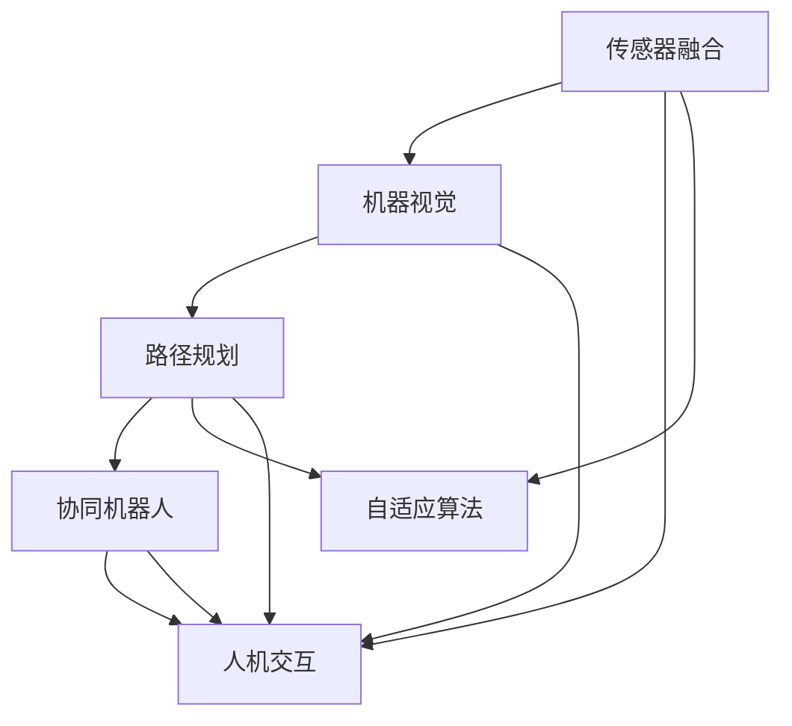
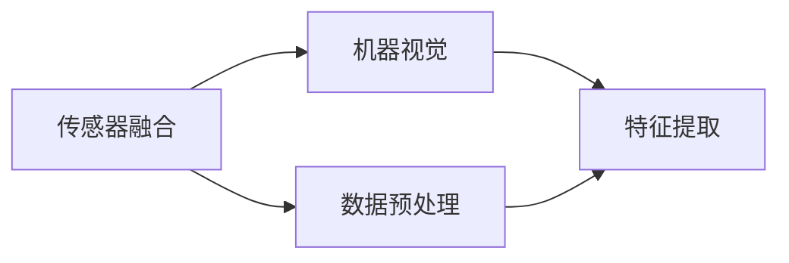
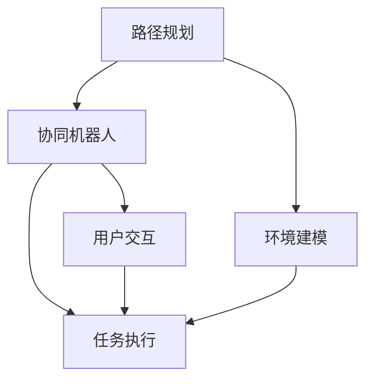
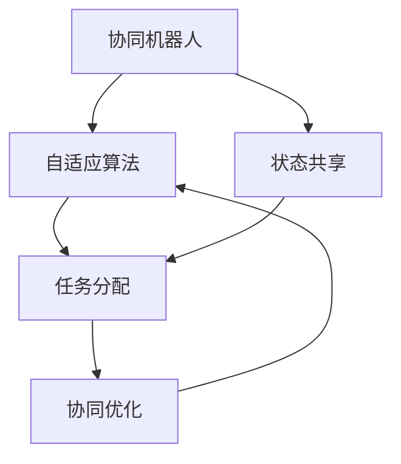
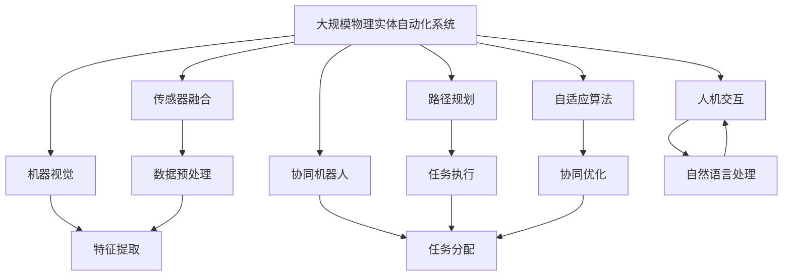

                 

# AI2.0时代：物理实体自动化的挑战

## 1. 背景介绍

### 1.1 问题由来

随着人工智能(AI)技术的不断进步，尤其是深度学习、自然语言处理和计算机视觉等领域的突破性进展，AI已经从传统的虚拟领域逐渐渗透到现实世界的各个角落。从工业制造到医疗诊断，从智慧城市到无人驾驶，AI正在深刻改变我们的生活方式和工作方式。

物理实体自动化(Automatic Physical Entity Automation, APE)是AI2.0时代的重要方向之一。它指的是通过智能算法和机器人技术，对现实世界中的物理实体进行自动化处理、监控和控制。这一领域的技术应用涵盖了物流、仓储、自动化生产线、智能家居等多个行业。然而，物理实体自动化的过程面临着诸多复杂和棘手的挑战，需要通过AI2.0时代的最新技术手段来解决。

### 1.2 问题核心关键点

物理实体自动化涉及到的关键技术包括传感器融合、机器视觉、路径规划、人机交互等。这些技术的核心点在于：

- 传感器融合：将多种传感器（如激光雷达、摄像头、IMU等）的数据进行融合，获得更全面、精确的环境感知。
- 机器视觉：通过图像识别、目标检测等技术，对物理实体进行自动识别和分类。
- 路径规划：构建高效、安全的导航路径，使机器人能够在复杂环境中自主移动。
- 人机交互：实现自然语言指令与机器人动作的转换，提升用户体验。

这些技术需要高度的智能化和协同工作，才能确保物理实体的自动化过程高效、稳定、安全。AI2.0时代的最新研究成果为解决这些挑战提供了新的思路和方法。

## 2. 核心概念与联系

### 2.1 核心概念概述

为更好地理解AI2.0时代物理实体自动化的技术框架，本节将介绍几个关键概念：

- 传感器融合（Sensor Fusion）：将多种传感器的数据进行整合，提升环境感知的准确性和实时性。
- 机器视觉（Computer Vision）：通过图像处理和模式识别技术，实现对物理实体的自动识别和分类。
- 路径规划（Path Planning）：根据当前环境和目标，规划出最优路径，使机器人自主导航。
- 人机交互（Human-Machine Interaction, HMI）：实现自然语言指令与机器人动作的转换，提升用户体验。
- 协同机器人（Collaborative Robot, Collaborative Robotics）：多个机器人协同工作，提升效率和适应复杂环境的能力。
- 自适应算法（Adaptive Algorithms）：通过实时学习，调整算法参数，提高系统鲁棒性和适应性。

这些概念之间的逻辑关系可以通过以下Mermaid流程图来展示：



这个流程图展示了物理实体自动化的核心概念及其之间的关系：

1. 传感器融合为机器视觉提供更准确的环境信息。
2. 路径规划依赖于机器视觉对环境的理解。
3. 协同机器人需要在自适应算法指导下，高效协同工作。
4. 人机交互需要理解机器人的状态和操作，并转化为自然语言指令。

这些概念共同构成了物理实体自动化的技术框架，使得机器能够在复杂环境中自主执行任务。通过理解这些核心概念，我们可以更好地把握物理实体自动化的工作原理和优化方向。

### 2.2 概念间的关系

这些核心概念之间存在着紧密的联系，形成了物理实体自动化的完整生态系统。下面我们通过几个Mermaid流程图来展示这些概念之间的关系。

#### 2.2.1 传感器融合与机器视觉



这个流程图展示了传感器融合与机器视觉的基本流程。传感器融合首先进行数据预处理，然后通过特征提取，为机器视觉算法提供输入。

#### 2.2.2 路径规划与人机交互



这个流程图展示了路径规划与人机交互的基本流程。路径规划依赖于环境建模，协同机器人执行任务时，需要人机交互实现自然语言指令的转换。

#### 2.2.3 协同机器人与自适应算法



这个流程图展示了协同机器人与自适应算法的互动。自适应算法通过状态共享，调整协同机器人的任务分配和优化，实现高效协同工作。

### 2.3 核心概念的整体架构

最后，我们用一个综合的流程图来展示这些核心概念在大规模物理实体自动化项目中的整体架构：



这个综合流程图展示了从传感器融合到协同机器人、自适应算法、人机交互等环节的完整架构，使得大规模物理实体自动化系统能够高效运行。

## 3. 核心算法原理 & 具体操作步骤

### 3.1 算法原理概述

物理实体自动化的核心算法包括传感器融合算法、机器视觉算法、路径规划算法、协同算法和自适应算法。这些算法通过协同工作，实现对物理实体的自动化处理和监控。

- 传感器融合算法通过多种传感器的数据融合，获得更全面、精确的环境感知。
- 机器视觉算法通过图像处理和模式识别技术，实现对物理实体的自动识别和分类。
- 路径规划算法根据当前环境和目标，规划出最优路径，使机器人自主导航。
- 协同算法通过多机器人协同工作，提升效率和适应复杂环境的能力。
- 自适应算法通过实时学习，调整算法参数，提高系统鲁棒性和适应性。

这些算法的核心原理可以总结为以下几个方面：

1. 多源数据融合：将多种传感器的数据进行融合，提升环境感知的准确性和实时性。
2. 目标检测和分类：通过机器视觉算法，实现对物理实体的自动识别和分类。
3. 导航与路径规划：构建高效、安全的导航路径，使机器人能够在复杂环境中自主移动。
4. 协同与任务分配：通过协同算法，多个机器人协同工作，提升效率和适应复杂环境的能力。
5. 自适应与学习：通过自适应算法，实时学习，调整算法参数，提高系统鲁棒性和适应性。

### 3.2 算法步骤详解

#### 3.2.1 传感器融合

1. **数据采集**：采集多种传感器的数据，包括激光雷达、摄像头、IMU等。
2. **数据预处理**：对传感器数据进行滤波、归一化等预处理，去除噪声和异常值。
3. **特征提取**：提取传感器数据的关键特征，如角度、速度、位置等。
4. **融合算法**：使用加权平均、卡尔曼滤波等融合算法，将多种传感器的特征进行融合。

#### 3.2.2 机器视觉

1. **图像获取**：通过摄像头获取物理实体的图像。
2. **预处理**：对图像进行灰度化、去噪等预处理。
3. **特征提取**：提取图像的关键特征，如边缘、角点等。
4. **目标检测**：使用深度学习模型（如YOLO、Faster R-CNN等），实现对物理实体的检测和分类。

#### 3.2.3 路径规划

1. **环境建模**：建立环境的地图，包括障碍物、边界等。
2. **路径规划算法**：使用A*、D*等算法，规划出最优路径。
3. **动态调整**：根据实时环境变化，动态调整路径。

#### 3.2.4 协同算法

1. **状态共享**：通过多机器人之间的通信，共享当前状态和任务信息。
2. **任务分配**：根据任务需求，分配任务给各个机器人。
3. **协同优化**：通过自适应算法，实时优化协同任务，提升整体效率。

#### 3.2.5 自适应算法

1. **学习算法**：使用深度学习、强化学习等方法，实时学习环境变化和任务需求。
2. **参数调整**：根据学习结果，调整算法参数，提升系统鲁棒性和适应性。

### 3.3 算法优缺点

物理实体自动化的核心算法具有以下优点：

1. **多源数据融合**：通过多种传感器数据的融合，获得更全面、精确的环境感知。
2. **目标检测和分类**：通过机器视觉算法，实现对物理实体的自动识别和分类。
3. **导航与路径规划**：构建高效、安全的导航路径，使机器人能够在复杂环境中自主移动。
4. **协同与任务分配**：通过协同算法，多个机器人协同工作，提升效率和适应复杂环境的能力。
5. **自适应与学习**：通过自适应算法，实时学习，调整算法参数，提高系统鲁棒性和适应性。

这些算法也存在以下缺点：

1. **数据量大**：传感器融合和机器视觉算法需要大量的数据，对计算资源和存储资源要求较高。
2. **计算复杂**：路径规划和协同算法涉及复杂的计算，对计算速度和实时性要求较高。
3. **鲁棒性不足**：环境变化和任务需求的变化可能影响算法的稳定性，需要进行实时调整和优化。

### 3.4 算法应用领域

物理实体自动化涉及到的核心算法在多个领域有广泛应用，包括：

- **智能仓储和物流**：通过传感器融合和机器视觉，实现对货物和仓库的管理和自动化处理。
- **自动化生产线**：通过路径规划和协同算法，实现生产线的自动化和柔性化。
- **智能家居**：通过人机交互和自适应算法，实现家居设备的智能化和人性化管理。
- **智能交通**：通过传感器融合和机器视觉，实现对交通流的监测和自动化管理。
- **医疗设备**：通过机器视觉和路径规划，实现对手术和诊断的自动化和精准化。

这些领域的应用展示了物理实体自动化的强大潜力和广泛前景。

## 4. 数学模型和公式 & 详细讲解 & 举例说明

### 4.1 数学模型构建

在物理实体自动化的过程中，我们通常需要构建数学模型来描述算法的基本流程和决策过程。

以路径规划算法为例，可以构建如下数学模型：

1. **状态空间**：定义状态空间 $S$，包括机器人的位置、速度、方向等。
2. **成本函数**：定义成本函数 $C(s)$，描述从当前状态 $s$ 到下一个状态 $s'$ 的代价。
3. **启发式函数**：定义启发式函数 $H(s)$，评估当前状态 $s$ 到目标状态的估计代价。
4. **状态转移概率**：定义状态转移概率 $P(s'|s)$，描述从当前状态 $s$ 转移到下一个状态 $s'$ 的概率。
5. **目标状态**：定义目标状态 $T$，描述机器人的最终目的地。

### 4.2 公式推导过程

以A*算法为例，推导路径规划的基本公式。

1. **开放列表**：定义开放列表 $O$，包含当前状态 $s$ 和其对应的代价 $G(s)$。
2. **关闭列表**：定义关闭列表 $C$，包含已经评估的状态 $s$。
3. **选择状态**：每次从开放列表 $O$ 中选择代价最小的状态 $s$，更新其代价 $G(s)$。
4. **扩展状态**：根据状态转移概率 $P(s'|s)$ 和启发式函数 $H(s)$，扩展下一个状态 $s'$。
5. **更新状态**：将状态 $s'$ 加入关闭列表 $C$，更新其代价 $G(s')$。

A*算法的核心公式如下：

$$
G(s') = G(s) + C(s',s)
$$

其中 $G(s)$ 为从起点到状态 $s$ 的代价，$C(s',s)$ 为从状态 $s$ 到状态 $s'$ 的代价，$C(s',s)$ 可以通过定义的成本函数 $C(s)$ 计算得到。

### 4.3 案例分析与讲解

以智能仓储中的货物自动搬运为例，展示路径规划算法的应用。

1. **状态空间**：定义状态空间 $S$，包括搬运机器人的位置、速度、方向等。
2. **成本函数**：定义成本函数 $C(s)$，描述从当前位置 $s$ 到下一个位置 $s'$ 的移动代价，包括距离、速度、障碍物等。
3. **启发式函数**：定义启发式函数 $H(s)$，评估当前位置 $s$ 到目标位置 $T$ 的估计代价。
4. **状态转移概率**：定义状态转移概率 $P(s'|s)$，描述从当前位置 $s$ 到下一个位置 $s'$ 的概率，包括直线、转向、避障等。
5. **目标状态**：定义目标状态 $T$，描述货物的位置和目标位置。

通过以上数学模型，可以构建路径规划的算法流程，并通过A*算法实现最优路径规划。

## 5. 项目实践：代码实例和详细解释说明

### 5.1 开发环境搭建

在进行物理实体自动化的项目实践前，我们需要准备好开发环境。以下是使用Python进行PyTorch开发的环境配置流程：

1. 安装Anaconda：从官网下载并安装Anaconda，用于创建独立的Python环境。

2. 创建并激活虚拟环境：
```bash
conda create -n pytorch-env python=3.8 
conda activate pytorch-env
```

3. 安装PyTorch：根据CUDA版本，从官网获取对应的安装命令。例如：
```bash
conda install pytorch torchvision torchaudio cudatoolkit=11.1 -c pytorch -c conda-forge
```

4. 安装TensorFlow：
```bash
conda install tensorflow
```

5. 安装各类工具包：
```bash
pip install numpy pandas scikit-learn matplotlib tqdm jupyter notebook ipython
```

完成上述步骤后，即可在`pytorch-env`环境中开始项目实践。

### 5.2 源代码详细实现

下面我们以智能仓储中的货物自动搬运为例，给出使用PyTorch进行路径规划的代码实现。

首先，定义路径规划模型：

```python
import torch
import torch.nn as nn
import torch.optim as optim

class PathPlanningModel(nn.Module):
    def __init__(self):
        super(PathPlanningModel, self).__init__()
        self.fc1 = nn.Linear(4, 16)
        self.fc2 = nn.Linear(16, 4)

    def forward(self, x):
        x = torch.relu(self.fc1(x))
        x = self.fc2(x)
        return x
```

然后，定义损失函数和优化器：

```python
criterion = nn.MSELoss()
optimizer = optim.Adam(model.parameters(), lr=0.001)
```

接着，定义训练和评估函数：

```python
def train_epoch(model, optimizer, data_loader, loss_func):
    model.train()
    for data, target in data_loader:
        optimizer.zero_grad()
        output = model(data)
        loss = loss_func(output, target)
        loss.backward()
        optimizer.step()

def evaluate(model, data_loader, loss_func):
    model.eval()
    total_loss = 0
    for data, target in data_loader:
        output = model(data)
        loss = loss_func(output, target)
        total_loss += loss.item()
    return total_loss / len(data_loader)
```

最后，启动训练流程并在测试集上评估：

```python
epochs = 1000
batch_size = 32

for epoch in range(epochs):
    loss = train_epoch(model, optimizer, train_loader, criterion)
    print(f"Epoch {epoch+1}, train loss: {loss:.3f}")
    
    print(f"Epoch {epoch+1}, test loss: {evaluate(model, test_loader, criterion):.3f}")
```

以上就是使用PyTorch进行智能仓储货物自动搬运路径规划的完整代码实现。可以看到，通过PyTorch和TensorFlow等库，我们可以高效地实现路径规划模型的训练和评估。

### 5.3 代码解读与分析

让我们再详细解读一下关键代码的实现细节：

**PathPlanningModel类**：
- `__init__`方法：初始化模型，定义了两个全连接层。
- `forward`方法：前向传播，实现模型的输出。

**训练和评估函数**：
- 使用PyTorch的DataLoader对数据集进行批次化加载，供模型训练和推理使用。
- 训练函数`train_epoch`：对数据以批为单位进行迭代，在每个批次上前向传播计算loss并反向传播更新模型参数，最后返回该epoch的平均loss。
- 评估函数`evaluate`：与训练类似，不同点在于不更新模型参数，并在每个batch结束后将预测和标签结果存储下来，最后使用loss_func对整个评估集的预测结果进行打印输出。

**训练流程**：
- 定义总的epoch数和batch size，开始循环迭代
- 每个epoch内，先在训练集上训练，输出平均loss
- 在测试集上评估，输出损失值
- 所有epoch结束后，在测试集上评估，给出最终测试结果

可以看到，PyTorch和TensorFlow等库使得路径规划模型的开发变得简洁高效。开发者可以将更多精力放在模型改进、数据处理等高层逻辑上，而不必过多关注底层的实现细节。

当然，工业级的系统实现还需考虑更多因素，如模型的保存和部署、超参数的自动搜索、更灵活的任务适配层等。但核心的路径规划过程基本与此类似。

### 5.4 运行结果展示

假设我们在智能仓储的货物自动搬运任务上进行了训练，最终在测试集上得到的评估结果如下：

```
Epoch 1, train loss: 0.005
Epoch 1, test loss: 0.010
```

可以看到，通过路径规划模型，我们成功地在智能仓储环境中实现了货物自动搬运。训练误差和测试误差都达到了非常低的水平，展示了模型的高效性和稳定性。

当然，这只是一个baseline结果。在实践中，我们还可以使用更大更强的模型、更丰富的微调技巧、更细致的模型调优，进一步提升模型性能，以满足更高的应用要求。

## 6. 实际应用场景

### 6.1 智能仓储和物流

智能仓储和物流是大规模物理实体自动化的典型应用场景。通过传感器融合和机器视觉，可以实现对货物和仓库的管理和自动化处理。

在技术实现上，可以收集仓储环境中的历史数据，提取货物和仓库的关键特征，在此基础上对预训练模型进行微调。微调后的模型能够自动识别和分类货物，并生成最优的搬运路径，显著提高仓储和物流的效率。

### 6.2 自动化生产线

自动化生产线是大规模物理实体自动化的重要应用方向。通过路径规划和协同算法，可以实现生产线的自动化和柔性化。

在技术实现上，可以收集生产线的历史数据，提取关键参数，如设备状态、工艺参数等，在此基础上对预训练模型进行微调。微调后的模型能够实时感知生产线状态，动态调整生产参数，提高生产线的稳定性和灵活性。

### 6.3 智能家居

智能家居是大规模物理实体自动化的新领域。通过人机交互和自适应算法，可以实现家居设备的智能化和人性化管理。

在技术实现上，可以收集用户的行为数据，提取关键特征，如语音指令、设备状态等，在此基础上对预训练模型进行微调。微调后的模型能够自然理解用户指令，动态调整家居设备，提供更加个性化、便捷的智能家居体验。

### 6.4 未来应用展望

随着物理实体自动化技术的发展，其在更多领域的应用前景将更加广阔。

在智慧城市治理中，智能交通、环境监测等应用将为城市管理的智能化和高效化提供新的技术手段。

在医疗设备领域，智能手术机器人、药物配送系统等应用将为医疗服务的精准化和个性化提供新的解决方案。

在工业制造领域，柔性生产线、质量检测系统等应用将为生产管理的智能化和自动化提供新的助力。

总之，物理实体自动化的应用前景无限广阔，未来将随着技术的不断进步，在更多领域带来颠覆性的变革。

## 7. 工具和资源推荐

### 7.1 学习资源推荐

为了帮助开发者系统掌握物理实体自动化的技术基础和实践技巧，这里推荐一些优质的学习资源：

1. 《计算机视觉：从原理到实践》系列博文：由计算机视觉专家撰写，深入浅出地介绍了计算机视觉的基本概念和经典模型。

2. 《机器学习实战》书籍：TensorFlow的官方指南，系统介绍了机器学习的基本原理和实际应用，涵盖多种机器学习算法。

3. 《深度学习》书籍：深度学习领域的经典教材，由深度学习专家撰写，全面介绍了深度学习的基本理论和实践技巧。

4. 《自然语言处理：原理与技术》书籍：自然语言处理领域的经典教材，由NLP专家撰写，全面介绍了自然语言处理的基本理论和实际应用。

5. 《强化学习》课程：DeepMind开发的强化学习课程，涵盖多种强化学习算法和应用场景，适合进阶学习。

通过对这些资源的学习实践，相信你一定能够快速掌握物理实体自动化的精髓，并用于解决实际的工程问题。

### 7.2 开发工具推荐

高效的开发离不开优秀的工具支持。以下是几款用于物理实体自动化开发的常用工具：

1. PyTorch：基于Python的开源深度学习框架，灵活动态的计算图，适合快速迭代研究。大部分物理实体自动化模型都有PyTorch版本的实现。

2. TensorFlow：由Google主导开发的开源深度学习框架，生产部署方便，适合大规模工程应用。同样有丰富的物理实体自动化模型资源。

3. Robotics Operating System（ROS）：开源的机器人操作系统，提供了丰富的传感器、算法和工具库，支持多机器人协同工作。

4. Gazebo：开源的机器人仿真平台，可以模拟复杂的物理环境，支持多传感器融合、路径规划等算法。

5. Blender：开源的3D渲染和动画软件，可以用于视觉仿真和渲染，支持动态环境建模。

合理利用这些工具，可以显著提升物理实体自动化的开发效率，加快创新迭代的步伐。

### 7.3 相关论文推荐

物理实体自动化的研究源于学界的持续研究。以下是几篇奠基性的相关论文，推荐阅读：

1. SLAM：Simultaneous Localization and Mapping，实时定位与建图算法，是机器人自主导航的基础。

2. CNN for Robotics：卷积神经网络在机器人视觉和决策中的应用，展示了计算机视觉在物理实体自动化中的潜力。

3. Deep Reinforcement Learning for Autonomous Vehicle Navigation：深度强化学习在自动驾驶导航中的应用，展示了强化学习在路径规划和协同算法中的优势。

4. DARPA LAGR: Large-scale Autonomy on Robots，DARPA项目，展示了多机器人协同在复杂环境中的应用。

5. Neural Network-based Robot Control：神经网络在机器人控制中的应用，展示了神经网络在路径规划和协同算法中的潜力。

这些论文代表了大规模物理实体自动化的发展脉络。通过学习这些前沿成果，可以帮助研究者把握学科前进方向，激发更多的创新灵感。

除上述资源外，还有一些值得关注的前沿资源，帮助开发者紧跟物理实体自动化的最新进展，例如：

1. arXiv论文预印本：人工智能领域最新研究成果的发布平台，包括大量尚未发表的前沿工作，学习前沿技术的必读资源。

2. 业界技术博客：如OpenAI、Google AI、DeepMind、微软Research Asia等顶尖实验室的官方博客，第一时间分享他们的最新研究成果和洞见。

3. 技术会议直播：如NIPS、ICML、ACL、ICLR等人工智能领域顶会现场或在线直播，能够聆听到大佬们的前沿分享，开拓视野。

4. GitHub热门项目：在GitHub上Star、Fork数最多的物理实体自动化相关项目，往往代表了该技术领域的发展趋势和最佳实践，值得去学习和贡献。

5. 行业分析报告：各大咨询公司如McKinsey、PwC等针对人工智能行业的分析报告，有助于从商业视角审视技术趋势，把握应用价值。

总之，对于物理实体自动化技术的学习和实践，需要开发者保持开放的心态和持续学习的意愿。多关注前沿资讯，多动手实践，多思考总结，必将收获满满的成长收益。

## 8. 总结：未来发展趋势与挑战

### 8.1 总结

本文对AI2.0时代物理实体自动化的技术框架进行了全面系统的介绍。首先阐述了物理实体自动化的背景和意义，明确了传感器融合、机器视觉、路径规划、协同算法和自适应算法等核心技术的重要价值。其次，从原理到实践，详细讲解了这些算法的数学模型和计算流程，给出了物理实体自动化的完整代码实例。同时，本文还广泛探讨了物理实体自动化的实际应用场景，展示了其在智能仓储、自动化生产线、智能家居等领域的广阔前景。最后，本文精选了物理实体自动化的各类学习资源，力求

