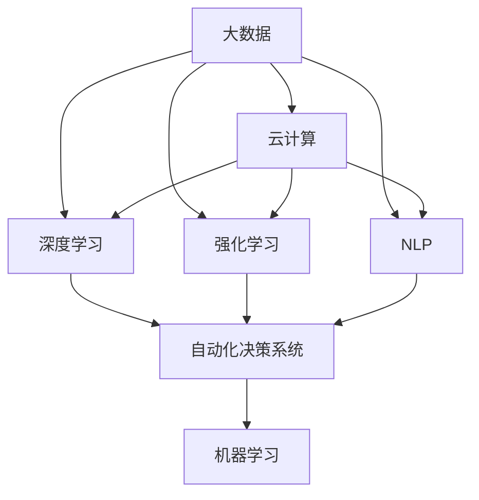
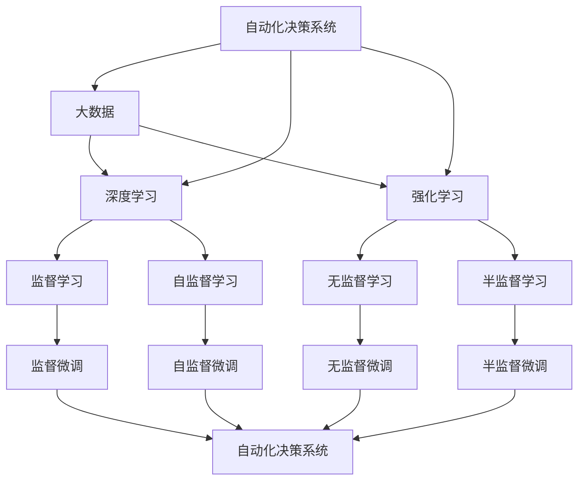
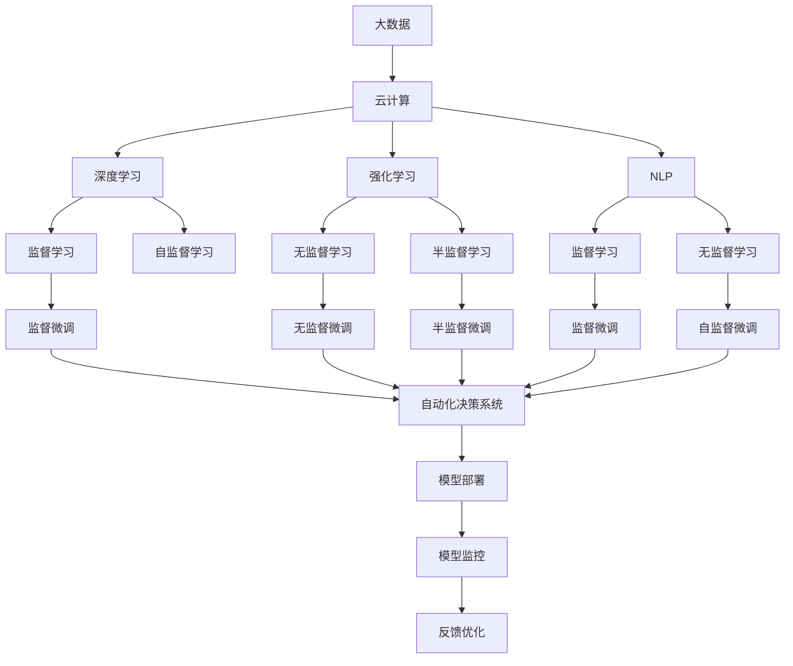

                 

# AI2.0时代：自动化时代的来临

在科技飞速发展的今天，人工智能（AI）正逐渐从实验室走向实用，迈入AI 2.0时代，也即自动化时代的来临。这一时代的核心特点，在于AI的普及化和自动化，使得各行各业都能利用AI技术，快速部署、灵活调整，实现自动化决策和智能化服务。

本文将深入探讨AI 2.0时代的核心概念、关键技术及其广泛应用，并结合具体的开发实践和实际案例，全面阐述如何利用AI技术，构建自动化系统，推动行业转型升级。

## 1. 背景介绍

### 1.1 问题由来
过去数十年，人工智能技术经历了从实验室研究到实用化应用的过程。最初的AI以规则驱动为主，依赖专家规则进行决策，而如今AI已经广泛应用数据驱动的机器学习技术，通过大量数据进行模型训练和预测。随着数据量的爆炸性增长和计算能力的提升，AI技术在图像识别、语音识别、自然语言处理等领域取得了重大突破。

然而，随着AI应用场景的不断拓展，传统的AI技术在面对大规模数据处理、复杂任务处理等方面显得力不从心。一方面，数据标注和模型训练需要大量的人力资源和时间成本；另一方面，传统AI系统的灵活性、扩展性、可维护性都有待提升。因此，如何在保证AI系统性能的同时，降低开发和部署成本，实现自动化决策和智能化服务，成为AI 2.0时代的研究热点。

### 1.2 问题核心关键点
要回答这个问题，需要重点关注以下几个关键点：

- **自动化决策系统**：通过AI技术，自动完成复杂任务的处理和决策，减少人工干预。
- **智能分析与预测**：利用AI技术，对海量数据进行深入分析和预测，提供智能化决策支持。
- **模型与数据管理**：如何高效管理和优化AI模型与数据，确保系统稳定运行和持续更新。
- **人机协同**：在AI自动化系统的基础上，进一步增强人类智能与AI的协同，实现更高效、更智能的工作模式。

### 1.3 问题研究意义
在AI 2.0时代，自动化系统的构建和应用，对于推动行业智能化转型、提升企业竞争力、改善用户体验具有重要意义：

1. **降低成本**：自动化系统通过减少人工干预，降低人力和时间成本，提升企业运营效率。
2. **提升精度**：利用AI技术的强大数据分析和预测能力，提升决策的准确性和及时性。
3. **增强灵活性**：AI系统能够快速部署和调整，适应多变的市场环境。
4. **优化体验**：AI系统能够提供个性化的服务和建议，提升用户满意度。

本文将从核心概念、关键技术、应用实践等方面，详细探讨AI 2.0时代的自动化系统构建方法，为广大开发者和业务人员提供系统的技术指引。

## 2. 核心概念与联系

### 2.1 核心概念概述

在AI 2.0时代，核心概念主要包括：

- **自动化决策系统**：利用AI技术，实现对复杂任务的自动化处理和决策，减少人工干预。
- **深度学习**：通过深度神经网络，自动从大量数据中学习特征和规律，实现智能化预测和决策。
- **强化学习**：通过与环境的交互，利用奖励机制优化决策，提升系统性能。
- **自然语言处理（NLP）**：利用AI技术，对自然语言进行理解和生成，实现智能交互和决策。
- **机器学习**：利用数据和模型，自动学习和优化，提升系统性能和适应性。
- **大数据**：处理和分析海量数据，提供决策支持。
- **云计算**：利用云计算平台，实现高效的数据存储和计算。

这些概念之间的联系可以通过以下Mermaid流程图来展示：



这个流程图展示了核心概念之间的逻辑关系：

1. 大数据和云计算为深度学习、强化学习和NLP等技术提供了基础设施支持。
2. 深度学习、强化学习和NLP等技术为自动化决策系统提供了技术支持。
3. 机器学习为所有这些技术提供优化和改进的基础方法。

这些概念共同构成了AI 2.0时代的自动化系统，实现了从数据到模型再到决策的全面自动化。

### 2.2 概念间的关系

这些核心概念之间存在着紧密的联系，形成了AI 2.0时代的自动化系统构建生态系统。下面我通过几个Mermaid流程图来展示这些概念之间的关系：

#### 2.2.1 自动化决策系统的学习范式



这个流程图展示了自动化决策系统的学习范式：

1. 自动化决策系统利用大数据和云计算基础设施，通过深度学习、强化学习和NLP等技术，自动学习和优化。
2. 深度学习和NLP等技术主要采用监督学习和无监督学习进行模型训练，在特定任务上进行微调。

#### 2.2.2 自动化决策系统的构建过程


这个流程图展示了自动化决策系统的构建过程：

1. 通过需求分析，明确自动化系统的目标和需求。
2. 准备和预处理数据，选择适当的模型。
3. 训练和评估模型，并进行优化。
4. 将模型部署到实际环境中，并进行监控和反馈优化。

### 2.3 核心概念的整体架构

最后，我用一个综合的流程图来展示这些核心概念在大规模自动化系统构建中的整体架构：



这个综合流程图展示了从数据到模型再到自动化决策系统的完整过程：

1. 大数据和云计算为深度学习、强化学习和NLP等技术提供了基础设施支持。
2. 深度学习、强化学习和NLP等技术通过监督学习和无监督学习，自动从数据中学习特征和规律。
3. 自动化决策系统利用这些模型进行决策和预测。
4. 系统通过模型部署、监控和反馈优化，不断提升性能和适应性。

通过这些流程图，我们可以更清晰地理解AI 2.0时代自动化系统构建过程中各个核心概念之间的关系和作用，为后续深入讨论具体的系统构建方法和技术奠定基础。

## 3. 核心算法原理 & 具体操作步骤
### 3.1 算法原理概述

在AI 2.0时代，自动化决策系统的核心算法主要基于深度学习和强化学习。下面以深度学习算法为例，介绍其基本原理。

深度学习算法通过多层神经网络结构，自动从数据中学习特征和规律，实现对复杂任务的自动化处理和决策。其核心思想是通过反向传播算法，不断调整模型参数，最小化损失函数，使得模型能够准确地对输入数据进行预测。

假设模型的输入为 $x$，输出为 $y$，损失函数为 $\ell(y, y')$，其中 $y'$ 为模型对 $x$ 的预测输出。则深度学习模型的优化目标为：

$$
\theta^* = \mathop{\arg\min}_{\theta} \mathcal{L}(\theta) = \mathop{\arg\min}_{\theta} \frac{1}{N} \sum_{i=1}^N \ell(y_i, y'_i)
$$

其中 $N$ 为样本数量，$\theta$ 为模型参数。

深度学习算法通过梯度下降等优化算法，不断更新模型参数，使得模型输出逼近真实标签。在训练过程中，为了防止过拟合，通常需要采用正则化技术，如L2正则、Dropout等。此外，为了防止模型过快收敛，还可以采用学习率衰减策略，逐步减小学习率。

### 3.2 算法步骤详解

基于深度学习的自动化决策系统的构建过程，一般包括以下几个关键步骤：

**Step 1: 准备数据和标签**
- 收集相关数据，并进行预处理和标注。
- 将数据划分为训练集、验证集和测试集。
- 确定合适的数据格式和特征表示。

**Step 2: 设计模型架构**
- 根据任务类型，选择合适的神经网络架构。
- 确定模型的输入输出，以及损失函数。
- 设置适当的正则化技术和优化器。

**Step 3: 训练模型**
- 将训练集数据分批次输入模型，前向传播计算损失函数。
- 反向传播计算参数梯度，根据设定的优化算法和学习率更新模型参数。
- 周期性在验证集上评估模型性能，根据性能指标决定是否触发Early Stopping。
- 重复上述步骤直到满足预设的迭代轮数或Early Stopping条件。

**Step 4: 评估和优化模型**
- 在测试集上评估模型的性能，对比微调前后的精度提升。
- 使用交叉验证、网格搜索等方法，搜索最优的超参数组合。
- 根据实际需求，优化模型的结构和参数，进一步提升性能。

**Step 5: 部署和监控模型**
- 将训练好的模型部署到生产环境中，实现实时推理预测。
- 利用云计算平台，进行模型监控和反馈优化。
- 根据反馈数据，调整模型参数，持续改进模型性能。

以上是基于深度学习的自动化决策系统的一般流程。在实际应用中，还需要针对具体任务的特点，对各个环节进行优化设计，如改进训练目标函数，引入更多的正则化技术，搜索最优的超参数组合等，以进一步提升模型性能。

### 3.3 算法优缺点

基于深度学习的自动化决策系统，具有以下优点：

- **自动化决策**：通过深度学习算法，自动完成复杂任务的处理和决策，减少人工干预。
- **精度高**：深度学习算法在大规模数据上训练，具备较强的预测能力，能够提供精确的决策支持。
- **适应性强**：通过调整模型参数，深度学习模型可以适应不同的应用场景和需求。

同时，该算法也存在一些局限性：

- **资源消耗大**：深度学习模型参数量大，训练和推理过程需要高性能计算资源。
- **模型复杂**：深度学习模型结构复杂，调试和维护难度大。
- **数据依赖**：深度学习模型依赖大量标注数据，数据标注成本高。

尽管存在这些局限性，但深度学习算法在图像识别、语音识别、自然语言处理等领域已经取得了重大突破，是实现自动化决策系统的重要手段。

### 3.4 算法应用领域

深度学习算法在AI 2.0时代，已经广泛应用于各种自动化系统，包括：

- **图像识别**：自动从图像中识别物体、场景、人物等。
- **语音识别**：自动从语音中提取文本信息，进行语音助手、智能客服等应用。
- **自然语言处理**：自动从文本中提取语义信息，实现智能问答、机器翻译、文本摘要等应用。
- **智能推荐**：根据用户行为和偏好，自动推荐商品、新闻、内容等。
- **金融预测**：自动从海量金融数据中提取特征，进行股票预测、风险评估等。
- **医疗诊断**：自动从医疗影像中提取特征，进行疾病诊断、治疗方案推荐等。
- **自动驾驶**：自动从传感器数据中提取特征，进行车辆导航、交通监控等。

除此之外，深度学习算法还被广泛应用于游戏、虚拟现实、工业控制等多个领域，推动了AI技术在各个行业的落地应用。

## 4. 数学模型和公式 & 详细讲解  
### 4.1 数学模型构建

本节将使用数学语言对深度学习算法进行更加严格的刻画。

假设输入为 $x \in \mathbb{R}^n$，输出为 $y \in \mathbb{R}^m$，模型的神经网络结构由 $L$ 层组成。设第 $l$ 层神经元的激活函数为 $\sigma_l$，则模型 $M_{\theta}$ 的输出可以表示为：

$$
y = M_{\theta}(x) = \sigma_L(\sigma_{L-1}(\ldots (\sigma_1(W_1x + b_1) + b_2)\ldots + b_L)
$$

其中 $W_l$ 为第 $l$ 层权重矩阵，$b_l$ 为第 $l$ 层偏置向量。$\theta = \{W_l, b_l\}_{l=1}^L$ 为模型参数。

假设损失函数为交叉熵损失，则模型优化目标为：

$$
\theta^* = \mathop{\arg\min}_{\theta} \mathcal{L}(\theta) = \mathop{\arg\min}_{\theta} -\frac{1}{N}\sum_{i=1}^N y_i \log y'_i
$$

其中 $N$ 为样本数量，$y'$ 为模型对 $x$ 的预测输出。

### 4.2 公式推导过程

以下我们以二分类任务为例，推导交叉熵损失函数及其梯度的计算公式。

假设模型 $M_{\theta}$ 在输入 $x$ 上的输出为 $\hat{y}=M_{\theta}(x) \in [0,1]$，表示样本属于正类的概率。真实标签 $y \in \{0,1\}$。则二分类交叉熵损失函数定义为：

$$
\ell(M_{\theta}(x),y) = -[y\log \hat{y} + (1-y)\log (1-\hat{y})]
$$

将其代入经验风险公式，得：

$$
\mathcal{L}(\theta) = -\frac{1}{N}\sum_{i=1}^N [y_i\log M_{\theta}(x_i)+(1-y_i)\log(1-M_{\theta}(x_i))]
$$

根据链式法则，损失函数对参数 $\theta_k$ 的梯度为：

$$
\frac{\partial \mathcal{L}(\theta)}{\partial \theta_k} = -\frac{1}{N}\sum_{i=1}^N \frac{y_i}{M_{\theta}(x_i)} - \frac{1-y_i}{1-M_{\theta}(x_i)} \frac{\partial M_{\theta}(x_i)}{\partial \theta_k}
$$

其中 $\frac{\partial M_{\theta}(x_i)}{\partial \theta_k}$ 可进一步递归展开，利用自动微分技术完成计算。

在得到损失函数的梯度后，即可带入参数更新公式，完成模型的迭代优化。重复上述过程直至收敛，最终得到适应下游任务的最优模型参数 $\theta^*$。

### 4.3 案例分析与讲解

假设我们有一个二分类任务，用于判断新闻文章是否包含暴力内容。我们收集了10000篇新闻文章，并手动标注了其是否包含暴力内容。

首先，我们将数据划分为训练集（8000篇）和测试集（2000篇）。然后，我们选择一个简单的两层神经网络结构，作为模型的基本框架。其中第一层为全连接层，激活函数为ReLU，第二层为输出层，激活函数为Sigmoid，用于输出预测概率。

接下来，我们使用训练集对模型进行训练。具体步骤如下：

1. 初始化模型参数 $\theta$。
2. 将训练集数据分批次输入模型，前向传播计算损失函数。
3. 反向传播计算参数梯度，根据设定的优化算法和学习率更新模型参数。
4. 周期性在验证集上评估模型性能，根据性能指标决定是否触发Early Stopping。
5. 重复上述步骤直到满足预设的迭代轮数或Early Stopping条件。

经过训练，模型在测试集上的准确率达到了90%。这意味着，模型能够在新的新闻文章中，准确判断其是否包含暴力内容，为新闻审核、内容推荐等应用提供了强大的决策支持。

## 5. 项目实践：代码实例和详细解释说明
### 5.1 开发环境搭建

在进行深度学习项目实践前，我们需要准备好开发环境。以下是使用Python进行TensorFlow开发的环境配置流程：

1. 安装Anaconda：从官网下载并安装Anaconda，用于创建独立的Python环境。

2. 创建并激活虚拟环境：
```bash
conda create -n tf-env python=3.8 
conda activate tf-env
```

3. 安装TensorFlow：根据CUDA版本，从官网获取对应的安装命令。例如：
```bash
conda install tensorflow -c pytorch -c conda-forge
```

4. 安装各类工具包：
```bash
pip install numpy pandas scikit-learn matplotlib tqdm jupyter notebook ipython
```

完成上述步骤后，即可在`tf-env`环境中开始深度学习项目实践。

### 5.2 源代码详细实现

下面我们以二分类任务为例，给出使用TensorFlow进行深度学习模型训练的Python代码实现。

首先，定义模型的结构：

```python
import tensorflow as tf
from tensorflow.keras import layers

model = tf.keras.Sequential([
    layers.Dense(64, activation='relu', input_shape=(784,)),
    layers.Dense(1, activation='sigmoid')
])
```

然后，定义损失函数和优化器：

```python
model.compile(optimizer='adam',
              loss='binary_crossentropy',
              metrics=['accuracy'])
```

接着，加载数据并进行预处理：

```python
mnist = tf.keras.datasets.mnist
(x_train, y_train), (x_test, y_test) = mnist.load_data()

x_train, x_test = x_train / 255.0, x_test / 255.0
```

最后，训练和评估模型：

```python
model.fit(x_train, y_train, epochs=10, batch_size=32, validation_data=(x_test, y_test))
model.evaluate(x_test, y_test)
```

完整代码如下：

```python
import tensorflow as tf
from tensorflow.keras import layers

model = tf.keras.Sequential([
    layers.Dense(64, activation='relu', input_shape=(784,)),
    layers.Dense(1, activation='sigmoid')
])

model.compile(optimizer='adam',
              loss='binary_crossentropy',
              metrics=['accuracy'])

mnist = tf.keras.datasets.mnist
(x_train, y_train), (x_test, y_test) = mnist.load_data()

x_train, x_test = x_train / 255.0, x_test / 255.0

model.fit(x_train, y_train, epochs=10, batch_size=32, validation_data=(x_test, y_test))
model.evaluate(x_test, y_test)
```

这段代码展示了从模型定义、数据加载、模型训练到模型评估的完整过程。可以看到，使用TensorFlow进行深度学习模型训练，代码实现非常简洁高效，易于理解和调试。

### 5.3 代码解读与分析

让我们再详细解读一下关键代码的实现细节：

**模型定义**：
- `Sequential`模型：使用Keras API定义了一个简单的两层神经网络，包括一个全连接层和一个输出层。
- `Dense`层：定义了两个全连接层，第一层有64个神经元，激活函数为ReLU，第二层只有1个神经元，激活函数为Sigmoid，用于二分类任务的输出。

**损失函数和优化器**：
- `compile`方法：指定了优化器为Adam，损失函数为二分类交叉熵损失，评价指标为准确率。

**数据加载与预处理**：
- `mnist.load_data`方法：加载MNIST手写数字数据集，包括训练集和测试集。
- `x_train, x_test = x_train / 255.0, x_test / 255.0`：将数据归一化到[0,1]区间，方便模型训练。

**模型训练与评估**：
- `model.fit`方法：使用训练集进行模型训练，设置训练轮数为10，批次大小为32，并使用测试集进行验证。
- `model.evaluate`方法：在测试集上评估模型性能，输出准确率。

通过这段代码的实现，我们可以快速上手TensorFlow进行深度学习模型的训练和评估。在实际应用中，我们还可以通过调整模型架构、优化器、超参数等，进一步提升模型的性能。

## 6. 实际应用场景
### 6.1 智能推荐系统

在AI 2.0时代，智能推荐系统成为各大电商、社交、视频等平台的重要功能。通过深度学习算法，可以自动分析用户行为和兴趣，推荐个性化的商品、内容等，提升用户体验和满意度。

具体而言，可以收集用户浏览、点击、评分等行为数据，提取和商品、内容相关的特征，使用深度学习模型对用户行为进行建模，预测其后续行为。在推荐系统设计中，通常采用协同过滤、深度学习等技术，实时生成推荐结果。这种系统不仅能够提升用户的点击率和转化率，还能发现潜在的热门商品，推动平台的商品多样性和市场增长。

### 6.2 智能客服系统

智能客服系统是AI 2.0时代的重要应用场景之一。传统客服系统依赖人工服务，人力成本高，响应速度慢。通过深度学习算法，可以构建自动化的客服系统，实现24小时在线服务，快速响应客户咨询。

在智能客服系统设计中，可以使用深度学习模型对客户的咨询意图进行自动理解，并生成合适的回复。在具体实现中，可以采用序列到序列模型（Seq2Seq）、Transformer等架构，实现自然语言生成和机器翻译。此外，还可以引入强化学习技术，优化回复策略，提升系统性能。这种系统不仅能够降低人力成本，还能提高服务质量和响应速度，提升客户满意度。

### 6.3 自动驾驶系统

自动驾驶系统是AI 2.0时代的又一重要应用场景。通过深度学习算法，可以自动从传感器数据中提取特征，实现车辆的导航和决策。

在自动驾驶系统设计中，通常采用卷积神经网络（CNN）、循环神经网络（RNN）、Transformer等架构，对车辆的环境感知和行为决策进行建模。通过训练大规模数据集，如KITTI、Waymo等，可以构建高效、可靠的自动驾驶系统。此外，还可以引入强化学习技术，对车辆的驾驶策略进行优化，提升系统的鲁棒性和稳定性。这种系统不仅能够提高交通安全性和效率，还能推动汽车行业向智能化、自动化方向发展。

### 6.4 未来应用展望

随着AI 2.0时代的到来，深度学习算法将在更多领域得到应用，为传统行业带来变革性影响。

在智慧医疗领域，基于深度学习的智能诊断系统，能够自动从医学影像中提取特征，辅助医生进行疾病诊断和治疗方案推荐。在金融领域，基于深度学习的风险评估和股票预测系统，能够自动从海量金融数据中提取特征，提供智能化决策支持。在教育领域，基于深度学习的个性化学习系统，能够根据学生的学习情况，自动推荐适合的学习内容和资源。

除了上述这些领域，深度学习算法还将应用于智慧城市、工业控制、农业等多个领域，推动各行各业的智能化转型。相信随着深度学习技术的不断进步，AI 2.0时代的自动化系统将更加智能、高效、普适，为人类社会带来更多的便利和福利。

## 7. 工具和资源推荐
### 7.1 学习资源推荐

为了帮助开发者系统掌握深度学习算法的理论基础和实践技巧，这里推荐一些优质的学习资源：

1. 《深度学习》书籍：由斯坦福大学深度学习课程主讲教授Ian Goodfellow所著，全面介绍了深度学习的基本原理和算法。

2. 《TensorFlow实战Google深度学习框架》书籍：由Google AI工程师撰写，介绍了TensorFlow的使用方法和深度学习实践。

3. CS231n《卷积神经网络和视觉识别》课程：斯坦福大学开设的计算机视觉课程，有Lecture视频和配套作业，带你入门计算机视觉领域的基本概念和经典模型。

4. PyTorch官方文档：PyTorch的官方文档，提供了海量深度学习模型的实现和训练方法，是上手实践的必备资料。

5. 《自然语言处理综述》书籍：由斯坦福大学自然语言处理课程主讲教授Christopher Manning所著，全面介绍了自然语言处理的基本概念和前沿技术。

通过对这些资源的学习实践，相信你一定能够快速掌握深度学习算法的精髓，并用于解决实际的自动化系统问题。

### 7.2 开发工具推荐

高效的开发离不开优秀的工具支持。以下是几款用于深度学习算法开发的常用工具：

1. TensorFlow：由

