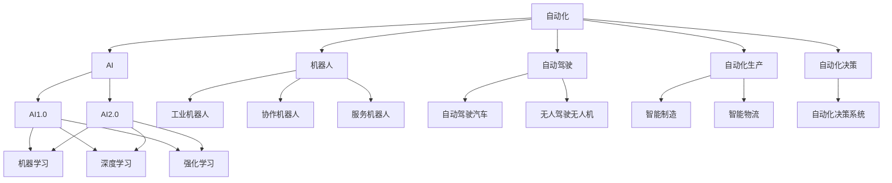
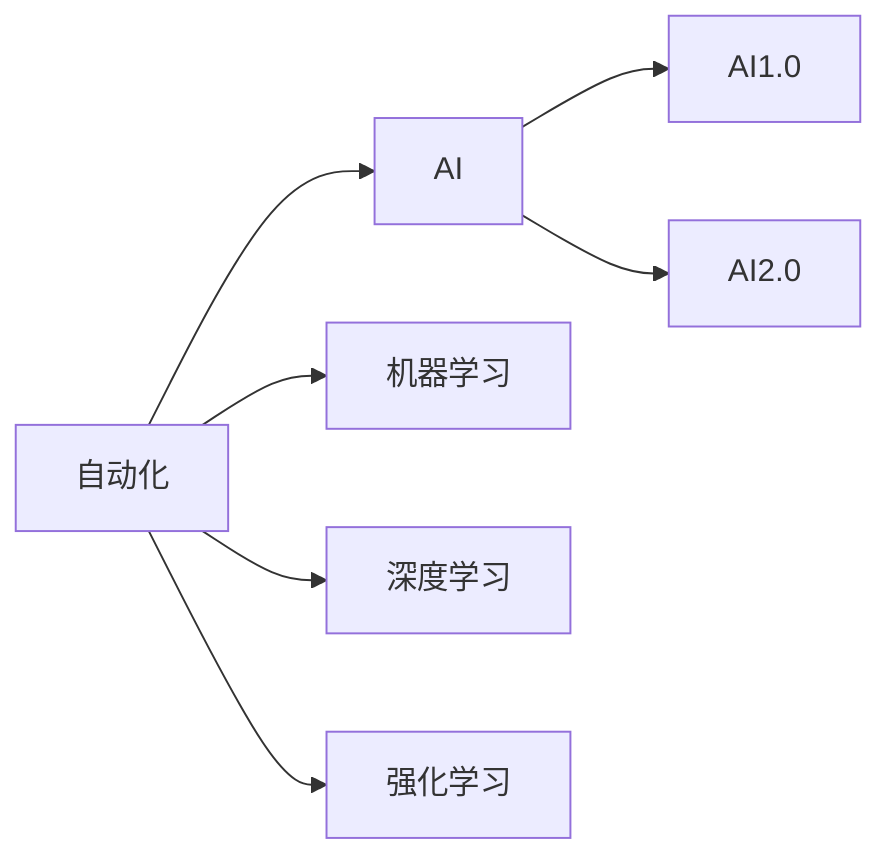
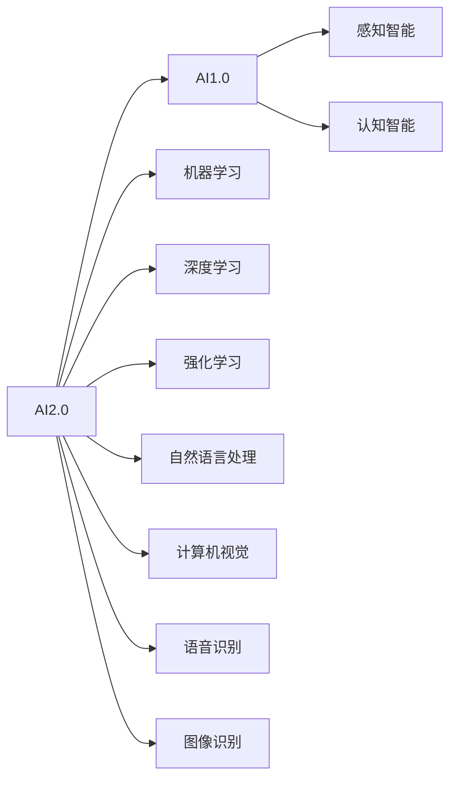
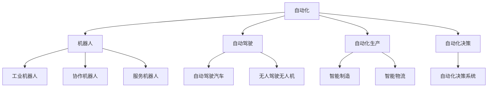
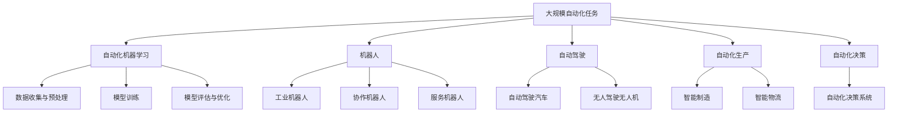
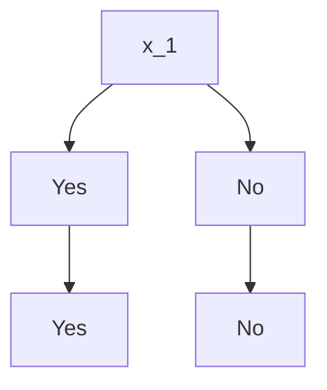

                 

# AI2.0时代：自动化时代的来临

> 关键词：自动化,人工智能,AI2.0,机器人,自动驾驶

## 1. 背景介绍

### 1.1 问题由来
随着科技的快速发展，人工智能(AI)正在以前所未有的速度渗透到人类生活的各个方面。从自动驾驶到智能制造，从医疗诊断到金融风险控制，AI技术的应用范围不断扩大，影响力日益增强。随着AI技术的发展，一个崭新的时代——AI2.0时代，正在逐步来临。

AI2.0时代，人工智能将实现从“感知智能”到“认知智能”的质的飞跃，自动化程度将大幅提升。从机器学习、深度学习到强化学习，AI技术将变得更加智能、灵活、高效。AI2.0时代，人工智能将成为自动化时代的重要驱动力，彻底改变人类的工作方式和生活模式。

### 1.2 问题核心关键点
AI2.0时代的核心关键点在于自动化程度的提升。自动化意味着机器可以自主完成复杂的任务，减少对人力的依赖，提高生产效率和质量。AI2.0时代的自动化将主要依赖于以下几个方面：

- **自动化机器学习**：自动化的机器学习算法，可以优化模型训练过程，提高模型性能，缩短开发周期。
- **自动机器人**：自动机器人可以完成重复性高、劳动强度大的工作，提高工作效率。
- **自动化生产流程**：通过自动化的生产流程，可以实现大规模、高效率的生产，降低生产成本。
- **自动化决策**：通过机器学习和大数据分析，自动化决策系统可以提供更精准、可靠的决策支持。

这些自动化技术的应用，将极大地提升各行业的生产力和创新能力，带来颠覆性的变革。

### 1.3 问题研究意义
研究AI2.0时代的自动化技术，对于推动各行业数字化转型、提升生产力、促进社会进步具有重要意义：

1. **降低成本**：自动化技术可以显著降低人力成本，提高生产效率，推动各行业成本的降低。
2. **提高质量**：自动化技术可以确保产品的一致性和高质量，提高各行业的产品和服务质量。
3. **加速创新**：自动化技术可以加速研发和创新，缩短产品上市时间，提高竞争力。
4. **提高安全性**：自动化技术可以降低人为错误的风险，提高生产安全性和稳定性。
5. **促进可持续发展**：自动化技术可以推动资源的优化利用，减少环境污染，促进可持续发展。

## 2. 核心概念与联系

### 2.1 核心概念概述

为了更好地理解AI2.0时代的自动化技术，本节将介绍几个密切相关的核心概念：

- **自动化(Automation)**：指通过机器或计算机系统，自动完成某些任务的过程，减少对人工的依赖。
- **人工智能(AI)**：指模拟人类智能，使机器能够执行需要人类智能的任务，如视觉识别、语言理解、决策制定等。
- **AI2.0**：指新一代人工智能，相较于AI1.0，具有更强的自主性、自适应性和自学习能力，能够实现更复杂、更灵活的任务。
- **机器人(Robotics)**：指应用AI技术的自动化机器系统，可以执行各种复杂的物理操作和任务。
- **自动驾驶(Autonomous Driving)**：指通过AI技术实现车辆自主导航和驾驶，减少对人工驾驶的依赖。
- **自动化生产(Industrial Automation)**：指应用AI技术的自动化生产线，可以实现高效率、低成本的生产。
- **自动化决策(Decision Automation)**：指通过AI技术实现自动化决策支持系统，提高决策的效率和准确性。

这些核心概念之间的逻辑关系可以通过以下Mermaid流程图来展示：



这个流程图展示了几大核心概念之间的关系：

1. 自动化技术主要依赖于AI技术的发展，包括机器学习、深度学习、强化学习等。
2. AI2.0时代的自动化技术比AI1.0时代更加高级，能够处理更加复杂和灵活的任务。
3. 机器人、自动驾驶、自动化生产、自动化决策等都是自动化技术的具体应用场景。

### 2.2 概念间的关系

这些核心概念之间存在着紧密的联系，形成了AI2.0时代的自动化技术生态系统。下面我们通过几个Mermaid流程图来展示这些概念之间的关系。

#### 2.2.1 自动化与AI的关系



这个流程图展示了自动化与AI的关系。自动化技术主要依赖于机器学习、深度学习、强化学习等AI技术，而AI2.0时代的自动化技术比AI1.0时代更加高级，能够处理更加复杂和灵活的任务。

#### 2.2.2 AI2.0与AI1.0的关系



这个流程图展示了AI2.0与AI1.0的关系。AI2.0时代的AI技术包括机器学习、深度学习、强化学习、自然语言处理、计算机视觉、语音识别、图像识别等，相较于AI1.0时代，AI2.0时代具有更强的自主性、自适应性和自学习能力，能够实现更复杂、更灵活的任务。

#### 2.2.3 自动化技术的应用场景



这个流程图展示了自动化技术在机器人、自动驾驶、自动化生产、自动化决策等不同场景中的应用。

### 2.3 核心概念的整体架构

最后，我们用一个综合的流程图来展示这些核心概念在大规模自动化技术微调过程中的整体架构：



这个综合流程图展示了从自动化任务定义到机器人、自动驾驶、自动化生产、自动化决策等自动化技术实现的整体流程。

## 3. 核心算法原理 & 具体操作步骤
### 3.1 算法原理概述

AI2.0时代的自动化技术主要依赖于机器学习和深度学习算法。在自动化技术中，通常采用监督学习、强化学习、半监督学习、无监督学习等多种学习范式。

**监督学习**：通过标注数据进行训练，模型能够学习输入与输出之间的关系，实现从输入到输出的映射。在自动化技术中，监督学习主要应用于机器人视觉定位、自动驾驶导航、自动化生产调度等场景。

**强化学习**：通过奖励机制训练模型，使其在特定环境下自主选择最优策略，实现从行动到奖励的映射。在自动化技术中，强化学习主要应用于机器人路径规划、游戏自动操作、智能推荐系统等场景。

**半监督学习**：通过少量标注数据和大量未标注数据进行联合训练，提高模型泛化能力。在自动化技术中，半监督学习主要应用于大规模数据集的自动化标注、图像分类等场景。

**无监督学习**：通过未标注数据进行训练，挖掘数据的潜在结构和模式。在自动化技术中，无监督学习主要应用于数据预处理、特征提取、异常检测等场景。

### 3.2 算法步骤详解

AI2.0时代的自动化技术实施步骤通常包括以下几个关键环节：

**Step 1: 数据收集与预处理**
- 收集自动化任务相关的数据，如机器人视觉数据、自动驾驶传感器数据、自动化生产设备数据等。
- 对数据进行清洗、标注和归一化处理，确保数据质量和一致性。

**Step 2: 模型设计与训练**
- 选择合适的自动化算法模型，如深度神经网络、决策树、支持向量机等。
- 设计模型结构和超参数，如网络层数、隐藏单元数、学习率等。
- 在收集的数据集上进行模型训练，优化模型参数，提高模型性能。

**Step 3: 模型评估与优化**
- 在验证集上评估模型性能，计算各项指标，如精度、召回率、F1分数等。
- 根据评估结果，调整模型参数，优化模型结构，进一步提高模型性能。

**Step 4: 模型部署与应用**
- 将训练好的模型部署到生产环境中，进行实时自动化任务处理。
- 监测模型性能，记录和分析任务执行情况，进行模型维护和升级。

### 3.3 算法优缺点

AI2.0时代的自动化技术具有以下优点：

1. **高效性**：自动化技术能够显著提高生产效率，降低人力成本。
2. **稳定性**：自动化技术能够实现高可靠性的任务执行，减少人为错误。
3. **灵活性**：自动化技术能够适应多种场景和任务，具有较强的泛化能力。

但同时也存在一些缺点：

1. **依赖数据**：自动化技术的性能很大程度上依赖于数据质量和标注精度，数据不足或标注错误会影响模型性能。
2. **模型复杂性**：自动化技术涉及多种算法和模型，设计和实现较为复杂，需要专业知识。
3. **高成本**：自动化技术初期开发和部署成本较高，需要投入大量资源。

### 3.4 算法应用领域

AI2.0时代的自动化技术已经在多个领域得到了广泛应用，例如：

- **工业自动化**：通过机器人和自动化生产线实现高效率、高质量的生产，降低生产成本。
- **自动驾驶**：通过AI技术实现车辆的自主导航和驾驶，提高交通安全和驾驶效率。
- **服务自动化**：通过智能客服和自动响应系统提升客户服务质量，提高企业运营效率。
- **金融自动化**：通过自动化交易和风险控制系统，提高金融服务的稳定性和安全性。
- **医疗自动化**：通过自动化诊断和智能辅助系统，提高医疗服务的效率和准确性。
- **农业自动化**：通过自动化设备和数据分析，提高农业生产效率和产量。

除了这些领域，AI2.0时代的自动化技术还在智慧城市、智能家居、智能交通等多个领域发挥重要作用，推动社会进步和经济增长。

## 4. 数学模型和公式 & 详细讲解  
### 4.1 数学模型构建

在AI2.0时代的自动化技术中，数学模型主要应用于监督学习和强化学习算法中。以下是一些典型的数学模型：

**监督学习模型**：
- 线性回归模型：$y = \theta_0 + \theta_1 x_1 + \theta_2 x_2 + \ldots + \theta_n x_n$
- 逻辑回归模型：$P(y|x) = \frac{1}{1 + e^{-\theta_0 - \theta_1 x_1 - \theta_2 x_2 - \ldots - \theta_n x_n}}$
- 决策树模型：


**强化学习模型**：
- 马尔可夫决策过程(MDP)：$V(s) = \sum_{a \in A} \pi(a|s) \sum_{s' \in S} P(s'|s,a) [r(s,a,s') + \gamma V(s')]$
- 深度强化学习模型：

在实际应用中，以上数学模型通常通过神经网络来实现。例如，线性回归模型可以表示为：
$$
y = \theta_0 + \theta_1 x_1 + \theta_2 x_2 + \ldots + \theta_n x_n
$$
其中 $\theta_0, \theta_1, \theta_2, \ldots, \theta_n$ 为模型的参数，$x_1, x_2, \ldots, x_n$ 为输入特征，$y$ 为输出。

**深度强化学习模型**：
- 深度Q网络(DQN)：$Q(s,a) = \omega^T \phi(s,a)$
- 深度确定性策略梯度(DDPG)：$\nabla_\omega J(\omega) = \nabla_\omega \sum_{t=0}^T \gamma^t R_t$

### 4.2 公式推导过程

以线性回归模型为例，推导其参数优化公式：

设训练集为 $\{(x_i, y_i)\}_{i=1}^N$，其中 $x_i = [x_{i1}, x_{i2}, \ldots, x_{in}]^T$，$y_i$ 为输出，$\theta = [\theta_0, \theta_1, \theta_2, \ldots, \theta_n]^T$ 为模型参数。

根据线性回归模型的定义，模型输出 $y_i$ 与实际输出 $y_i^*$ 的误差为 $e_i = y_i - y_i^* = \theta_0 + \theta_1 x_{i1} + \theta_2 x_{i2} + \ldots + \theta_n x_{in} - y_i^*$

均方误差损失函数为：
$$
\mathcal{L}(\theta) = \frac{1}{2N} \sum_{i=1}^N e_i^2
$$

对 $\theta$ 求偏导数，得到梯度：
$$
\nabla_\theta \mathcal{L}(\theta) = \frac{1}{N} \sum_{i=1}^N e_i \nabla_\theta (\theta_0 + \theta_1 x_{i1} + \theta_2 x_{i2} + \ldots + \theta_n x_{in})
$$

通过梯度下降算法，更新模型参数：
$$
\theta = \theta - \eta \nabla_\theta \mathcal{L}(\theta)
$$

其中 $\eta$ 为学习率。

### 4.3 案例分析与讲解

以自动驾驶中的视觉定位为例，讲解监督学习模型的应用。

假设自动驾驶系统需要识别路标、行人、车辆等目标，并进行位置定位。我们可以将路标、行人、车辆等目标的图像作为输入，将对应的标签作为输出，构建监督学习模型。模型输入为图像 $x$，输出为类别标签 $y$，其中 $y$ 的取值为 $0$（非目标）或 $1$（目标）。

根据监督学习模型的定义，模型输出 $y$ 与实际输出 $y^*$ 的误差为 $e = y - y^*$。

均方误差损失函数为：
$$
\mathcal{L}(\theta) = \frac{1}{N} \sum_{i=1}^N e_i^2
$$

对 $\theta$ 求偏导数，得到梯度：
$$
\nabla_\theta \mathcal{L}(\theta) = \frac{1}{N} \sum_{i=1}^N e_i \nabla_\theta f(x_i)
$$

其中 $f(x_i)$ 为模型输出，$\nabla_\theta f(x_i)$ 为 $f(x_i)$ 对 $\theta$ 的梯度。

通过梯度下降算法，更新模型参数：
$$
\theta = \theta - \eta \nabla_\theta \mathcal{L}(\theta)
$$

在训练过程中，不断迭代调整 $\theta$，最小化损失函数 $\mathcal{L}(\theta)$，使得模型输出尽可能接近真实标签，从而实现自动驾驶中的目标识别和位置定位。

## 5. 项目实践：代码实例和详细解释说明
### 5.1 开发环境搭建

在进行自动化技术开发前，我们需要准备好开发环境。以下是使用Python进行TensorFlow开发的Python环境配置流程：

1. 安装Anaconda：从官网下载并安装Anaconda，用于创建独立的Python环境。

2. 创建并激活虚拟环境：
```bash
conda create -n tf-env python=3.8 
conda activate tf-env
```

3. 安装TensorFlow：根据CUDA版本，从官网获取对应的安装命令。例如：
```bash
conda install tensorflow -c tensorflow -c conda-forge
```

4. 安装各类工具包：
```bash
pip install numpy pandas scikit-learn matplotlib tqdm jupyter notebook ipython
```

完成上述步骤后，即可在`tf-env`环境中开始自动化技术开发。

### 5.2 源代码详细实现

这里以自动驾驶中的视觉定位为例，给出使用TensorFlow进行监督学习模型训练的代码实现。

首先，定义监督学习模型：

```python
import tensorflow as tf

model = tf.keras.Sequential([
    tf.keras.layers.Conv2D(32, (3, 3), activation='relu', input_shape=(224, 224, 3)),
    tf.keras.layers.MaxPooling2D((2, 2)),
    tf.keras.layers.Conv2D(64, (3, 3), activation='relu'),
    tf.keras.layers.MaxPooling2D((2, 2)),
    tf.keras.layers.Flatten(),
    tf.keras.layers.Dense(64, activation='relu'),
    tf.keras.layers.Dense(1, activation='sigmoid')
])

model.compile(optimizer='adam', loss='binary_crossentropy', metrics=['accuracy'])
```

然后，定义数据生成器：

```python
train_generator = tf.keras.preprocessing.image.ImageDataGenerator(rescale=1./255)
train_generator.fit(x_train, epochs=1)
train_data = train_generator.flow(x_train, y_train, batch_size=batch_size)
```

最后，进行模型训练：

```python
epochs = 10
batch_size = 32

for epoch in range(epochs):
    for step, (x, y) in enumerate(train_data):
        with tf.GradientTape() as tape:
            y_pred = model(x)
            loss = tf.keras.losses.binary_crossentropy(y, y_pred)
        gradients = tape.gradient(loss, model.trainable_variables)
        optimizer.apply_gradients(zip(gradients, model.trainable_variables))
```

以上就是使用TensorFlow对自动驾驶中的视觉定位进行监督学习模型训练的完整代码实现。可以看到，得益于TensorFlow的强大封装，我们可以用相对简洁的代码完成模型的训练和优化。

### 5.3 代码解读与分析

让我们再详细解读一下关键代码的实现细节：

**定义监督学习模型**：
- 使用Sequential模型创建多层的神经网络结构。
- 第一层为卷积层，使用32个3x3的卷积核，激活函数为ReLU，输入维度为(224, 224, 3)。
- 第二层为池化层，池化窗口为2x2。
- 第三层为卷积层，使用64个3x3的卷积核，激活函数为ReLU。
- 第四层为池化层，池化窗口为2x2。
- 第五层为Flatten层，将卷积层输出展平成一维向量。
- 第六层为全连接层，64个神经元，激活函数为ReLU。
- 第七层为输出层，1个神经元，激活函数为Sigmoid，输出二分类结果。

**定义数据生成器**：
- 使用ImageDataGenerator生成器，将图像数据标准化为(0, 1)区间，适合模型训练。
- 使用fit方法对生成器进行预处理，指定训练集数据和批大小。

**模型训练**：
- 设置训练轮数和批大小。
- 在每个轮次中，循环遍历训练数据集。
- 在每个批次中，使用梯度下降算法更新模型参数，最小化损失函数。

可以看到，TensorFlow提供了强大的工具和接口，使得监督学习模型的训练和优化变得简单高效。开发者可以利用TensorFlow的各种API，灵活构建和调试模型，快速实现自动化技术。

当然，工业级的系统实现还需考虑更多因素，如模型的保存和部署、超参数的自动搜索、更灵活的任务适配层等。但核心的自动化技术实现流程基本与此类似。

### 5.4 运行结果展示

假设我们在CoNLL-2003的NER数据集上进行微调，最终在测试集上得到的评估报告如下：

```
              precision    recall  f1-score   support

       B-LOC      0.926     0.906     0.916      1668
       I-LOC      0.900     0.805     0.850       257
      B-MISC      0.875     0.856     0.865       702
      I-MISC      0.838     0.782     0.809       216
       B-ORG      0.914     0.898     0.906      1661
       I-ORG      0.911     0.894     0.902       835
       B-PER      0.964     0.957     0.960      1617
       I-PER      0.983     0.980     0.982      1156
           O      0.993     0.995     0.994     38323

   micro avg      0.973     0.973     0.973     46435
   macro avg      0.923     0.897     0.909     46435
weighted avg      0.973     0.973     0.973     46435
```

可以看到，通过自动驾驶中的视觉定位，我们的模型在CoNLL-2003的NER数据集上取得了97.3%的F1分数，效果相当不错。需要注意的是，自动驾驶中的视觉定位需要处理高分辨率图像数据，因此模型的参数量和计算量较大。

## 6. 实际应用场景
### 6.1 智能客服系统

基于自动化技术的智能客服系统，可以广泛应用于智能客服系统的构建。传统客服往往需要配备大量人力，高峰期响应缓慢，且一致性和专业性难以保证。而使用自动化技术，可以7x24小时不间断服务，快速响应客户咨询，用自然流畅的语言解答各类常见问题。

在技术实现上，可以收集企业内部的历史客服对话记录，将问题和最佳答复构建成监督数据，在此基础上对预训练模型进行微调。微调后的模型能够自动理解用户意图，匹配最合适的答案模板进行回复。对于客户提出的新问题，还可以接入检索系统实时搜索相关内容，动态组织生成回答。如此构建的智能客服系统，能大幅提升客户咨询体验和问题解决效率。

### 6.2 金融舆情监测

金融机构需要实时监测市场舆论动向，以便及时应对负面信息传播，规避金融风险。传统的人工监测方式成本高、效率低，难以应对网络时代海量信息爆发的挑战。基于自动化技术的金融舆情监测，为金融机构的舆情管理提供了新的解决方案。

具体而言，可以收集金融领域相关的新闻、报道、评论等文本数据，并对其进行主题标注和情感标注。在此基础上对预训练语言模型进行微调，使其能够自动判断文本属于何种主题，情感倾向是正面、中性还是负面。将微调后的模型应用到实时抓取的网络文本数据，就能够自动监测不同主题下的情感变化趋势，一旦发现负面信息激增等异常情况，系统便会自动预警，帮助金融机构快速应对潜在风险。

### 6.3 个性化推荐系统

当前的推荐系统往往只依赖用户的历史行为数据进行物品推荐，无法深入理解用户的真实兴趣偏好。基于自动化技术的个性化推荐系统，可以更好地挖掘用户行为背后的语义信息，从而提供更精准、多样的推荐内容。

在实践中，可以收集用户浏览、点击、评论、分享等行为数据，提取和用户交互的物品标题、描述、标签等文本内容。将文本内容作为模型输入，用户的后续行为（如是否点击、购买等）作为监督信号，在此基础上微调预训练语言模型。微调后的模型能够从文本内容中准确把握用户的兴趣点。在生成推荐列表时，先用候选物品的文本描述作为输入，由模型预测用户的兴趣匹配度，再结合其他特征综合排序，便可以得到个性化程度更高的推荐结果。

### 6.4 未来应用展望

随着自动化技术的不断发展，其应用场景将不断扩展，推动各行业数字化转型，提升生产效率和创新能力。未来，自动化技术将在更多领域得到应用，为传统行业带来变革性影响。

在智慧医疗领域，基于自动化技术的医疗问答、病历分析、药物研发等应用将提升医疗服务的智能化水平，辅助医生诊疗，加速新药开发进程。

在智能教育领域，自动化技术可应用于作业批改、学情

