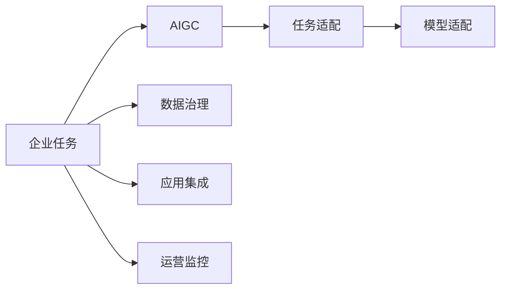
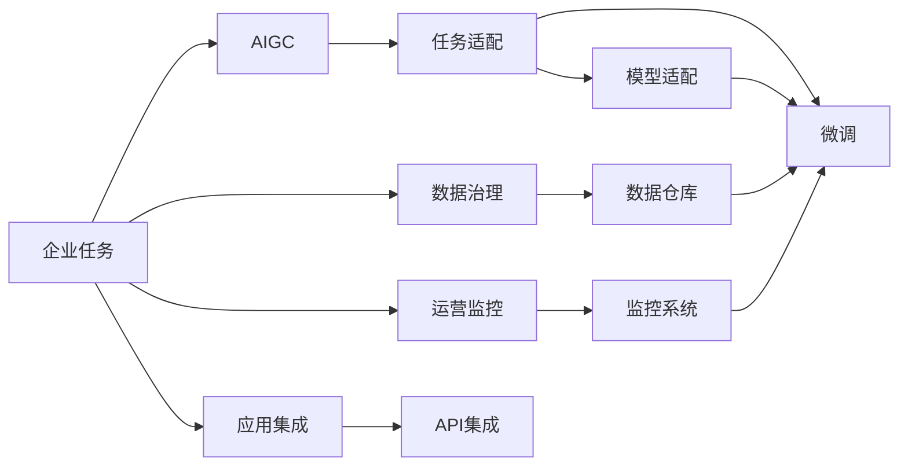

                 

## 1. 背景介绍

### 1.1 问题由来
随着人工智能生成内容(AIGC, Artificial Intelligence Generated Content)技术的快速发展，企业开始大规模部署AIGC解决方案，以满足各类任务需求。AIGC技术利用深度学习和大规模数据训练模型，能够自动生成文本、图像、视频等多种类型的智能内容。然而，企业任务往往涉及多个分散且具有重叠性的环节，如客服对话、市场营销、广告投放、数据分析等，这些任务的碎片化使得企业难以整合资源，形成统一的AIGC应用体系。

### 1.2 问题核心关键点
AIGC在企业任务中的应用面临着数据分散、需求多变、系统孤立等挑战，如何构建一个高效、灵活、统一的AIGC平台成为企业关注的焦点。

**核心问题点：**
- **数据治理**：企业任务数据分散在不同的业务系统中，缺乏统一的治理和管理机制。
- **模型适配**：AIGC模型往往无法自适应多变的企业任务需求，需要频繁调参和改写代码。
- **任务协同**：企业任务之间的协同和信息共享困难，缺乏一致性的管理策略。
- **应用集成**：现有AIGC工具多独立部署，难以形成集成的应用生态。
- **运营监控**：AIGC应用的实时监控和运营效率需要有效机制进行支持。

### 1.3 问题研究意义
解决AIGC在企业任务中碎片化的问题，对于提升企业整体数字化水平，降低数字化转型成本，提升工作效率，具有重要意义：

1. **资源整合**：统一的数据治理和模型管理机制，能够整合分散的企业资源，提高资源利用效率。
2. **模型复用**：通过模型适配和任务适配，实现AIGC模型的复用，降低模型开发和调参成本。
3. **协同工作**：实现企业任务之间的协同，促进信息和知识共享，提升任务处理效率。
4. **集成应用**：构建统一的AIGC应用生态，提升应用集成和集成开发效率。
5. **运营优化**：引入实时监控机制，实现AIGC应用的精细化运营管理，提高系统稳定性。

## 2. 核心概念与联系

### 2.1 核心概念概述

为更好地理解AIGC在企业任务中的应用，本节将介绍几个密切相关的核心概念：

- **AIGC**: 人工智能生成内容技术，基于深度学习和生成模型自动生成文本、图像、视频等智能内容。
- **企业任务**: 企业运营中涉及的各类任务，如客户服务、市场营销、数据分析等。
- **任务适配**: 针对企业任务的特定需求，调整AIGC模型或算法，适配相应的应用场景。
- **模型适配**: 调整AIGC模型参数，适配不同任务需求，提升模型效果。
- **数据治理**: 对企业任务数据进行统一管理和治理，保障数据质量和一致性。
- **应用集成**: 将AIGC应用整合到企业现有系统中，形成统一的应用生态。
- **运营监控**: 对AIGC应用进行实时监控和性能优化，保障应用稳定性和效率。

这些核心概念之间存在紧密的联系，通过AIGC技术适配企业任务，可以在各个环节实现资源整合、模型复用、协同工作、集成应用和运营优化，从而提升企业数字化转型的整体效率。

### 2.2 概念间的关系

这些核心概念之间的关系可以通过以下Mermaid流程图来展示：



这个流程图展示了大规模AIGC技术在企业任务中的应用过程：

1. 企业任务需求通过AIGC进行适配和生成。
2. 模型适配过程中，对AIGC模型进行参数调整以适配特定任务。
3. 数据治理环节，对数据进行统一管理和治理，保障数据一致性和质量。
4. 应用集成环节，将AIGC应用整合到企业现有系统中。
5. 运营监控环节，对AIGC应用进行实时监控和性能优化。

### 2.3 核心概念的整体架构

最后，我们用一个综合的流程图来展示这些核心概念在大规模AIGC企业任务应用中的整体架构：



这个综合流程图展示了从任务需求到AIGC生成的整体流程：

1. 企业任务通过AIGC生成内容。
2. 对生成的内容进行任务适配和模型适配。
3. 对数据进行统一管理和治理，构建数据仓库。
4. 将生成的内容集成到企业现有系统中，或通过API服务提供应用接口。
5. 对AIGC应用进行实时监控和性能优化。
6. 对于模型适配环节，通常需要微调模型参数，以提升模型效果。

通过这个架构，我们可以更清晰地理解AIGC在企业任务中的应用流程和各环节的相互关系。

## 3. 核心算法原理 & 具体操作步骤
### 3.1 算法原理概述

AIGC在企业任务中的应用涉及多种算法和技术，核心原理包括：

1. **深度学习模型**：如Transformer、RNN、GAN等，用于生成智能内容。
2. **预训练与微调**：通过大规模数据预训练深度学习模型，微调模型以适配特定任务。
3. **数据治理技术**：如数据清洗、数据标注、数据同步等，保障数据质量和一致性。
4. **模型适配技术**：如超参数调优、迁移学习、多任务学习等，提升模型性能。
5. **任务适配技术**：如提示模板、解码器设计、损失函数选择等，适配特定任务需求。
6. **应用集成技术**：如API接口设计、应用系统集成、组件协同等，形成统一应用生态。
7. **运营监控技术**：如实时日志记录、性能指标监测、异常检测等，保障应用稳定性和效率。

### 3.2 算法步骤详解

以下我们将详细介绍AIGC在企业任务应用中的主要步骤：

**Step 1: 需求调研与数据治理**

- **需求调研**：调研企业任务的需求，明确任务的目标和关键点，制定任务适配方案。
- **数据治理**：对任务涉及的数据进行清洗、标注、同步和存储，构建统一的数据仓库，保障数据质量和一致性。

**Step 2: 模型适配与预训练**

- **模型选择**：根据任务需求选择合适的深度学习模型，如Transformer、RNN等。
- **预训练**：在大规模无标签数据上进行预训练，学习通用语言知识和特征表示。
- **微调**：在任务标注数据上微调模型，适配特定任务需求，提升模型效果。

**Step 3: 任务适配与实现**

- **任务适配**：根据任务需求设计提示模板、解码器和损失函数，适配AIGC模型。
- **应用实现**：将适配后的模型集成到企业现有系统中，或提供API服务。

**Step 4: 应用集成与协同**

- **API集成**：将AIGC应用服务集成到企业系统中，提供API接口。
- **系统集成**：将AIGC应用与企业现有系统进行集成，形成统一应用生态。
- **组件协同**：实现不同任务和组件之间的信息共享和协同工作。

**Step 5: 运营监控与优化**

- **实时监控**：对AIGC应用进行实时日志记录和性能指标监测，保障应用稳定性。
- **异常检测**：检测AIGC应用中的异常情况，及时发现和处理问题。
- **性能优化**：通过模型调优、资源配置、负载均衡等手段，提升应用性能和效率。

### 3.3 算法优缺点

**优点：**

1. **提升效率**：通过数据治理和模型适配，大幅提升模型生成内容的效率和精度。
2. **适配灵活**：模型和任务之间的适配灵活，能够快速响应企业任务需求变化。
3. **资源整合**：通过数据治理和应用集成，实现资源的高效整合和利用。
4. **模型复用**：预训练模型和微调模型可以复用，降低模型开发和调参成本。
5. **运营优化**：实时监控和异常检测，保障AIGC应用的稳定性和效率。

**缺点：**

1. **数据依赖**：AIGC模型依赖大量标注数据进行微调，数据获取和标注成本较高。
2. **模型复杂**：深度学习模型参数较多，训练和推理复杂度较高。
3. **适配难度**：特定任务适配需要较多专业知识和经验，适配难度较大。
4. **系统复杂**：应用集成和系统协同复杂，需要较高的技术能力和管理能力。
5. **性能瓶颈**：模型生成内容量大，处理和存储可能面临性能瓶颈。

### 3.4 算法应用领域

AIGC在企业任务中的应用主要涉及以下几个领域：

- **客服与营销**：自动生成客服对话回复、营销邮件内容、广告文案等。
- **数据分析**：生成数据报告、分析摘要、趋势预测等。
- **客户画像**：自动生成客户画像、客户画像融合等。
- **人力资源**：自动生成招聘广告、员工培训材料等。
- **运营管理**：生成运营报告、运营策略、运营计划等。
- **财务分析**：生成财务报表、财务分析报告等。

这些领域的应用展示了AIGC在企业任务中的广泛性和重要性，通过AIGC技术可以大幅提升企业运营的效率和质量。

## 4. 数学模型和公式 & 详细讲解 & 举例说明

### 4.1 数学模型构建

在AIGC企业任务应用中，常见的数学模型包括生成模型和损失函数等，这里以文本生成任务为例进行详细讲解。

假设生成模型为 $p(x|y)$，其中 $x$ 为生成的文本，$y$ 为输入的标签。对于文本生成任务，$x$ 为一段文本，$y$ 为该文本所属的分类标签，如情感分类、主题分类等。

定义模型在训练集 $\mathcal{D}=\{(x_i,y_i)\}_{i=1}^N$ 上的经验风险为：

$$
\mathcal{L}(p) = -\frac{1}{N}\sum_{i=1}^N \log p(x_i|y_i)
$$

在训练过程中，最小化损失函数 $\mathcal{L}(p)$，使得模型 $p(x|y)$ 生成文本 $x$ 的概率逼近真实文本 $x_i$。

### 4.2 公式推导过程

以下我们将以一个简单的文本分类任务为例，推导损失函数的推导过程。

假设模型 $p(x|y)$ 在训练集 $\mathcal{D}=\{(x_i,y_i)\}_{i=1}^N$ 上进行训练，其中 $x_i$ 为训练文本，$y_i$ 为文本的分类标签。模型参数为 $\theta$，则模型在训练集上的损失函数为：

$$
\mathcal{L}(\theta) = -\frac{1}{N}\sum_{i=1}^N \log p(x_i|y_i) = -\frac{1}{N}\sum_{i=1}^N \log \frac{\exp(\theta^T \phi(x_i,y_i))}{\sum_j \exp(\theta^T \phi(x_i,y_j))}
$$

其中 $\phi(x_i,y_i)$ 为输入文本 $x_i$ 和标签 $y_i$ 的特征映射函数，$\theta$ 为模型参数。

通过前向传播计算每个训练样本的损失值，并求其均值，得到模型在训练集上的损失函数。在反向传播过程中，计算损失函数对模型参数 $\theta$ 的梯度，并根据梯度下降算法更新模型参数。

### 4.3 案例分析与讲解

以文本分类任务为例，我们通过以下示例来分析损失函数的推导和优化过程：

**示例1: 情感分类**

假设输入文本 $x_i$ 为“这是一篇不错的文章”，标签 $y_i$ 为“积极”，模型参数 $\theta$ 为随机初始化。则模型在训练集上计算损失值：

$$
\mathcal{L}(\theta) = -\log \frac{\exp(\theta^T \phi(x_i,y_i))}{\sum_j \exp(\theta^T \phi(x_i,y_j))}
$$

其中 $\phi(x_i,y_i)$ 为输入文本和标签的特征映射函数，假设模型采用LSTM结构，则 $\phi(x_i,y_i)$ 为LSTM的隐状态向量。

通过计算损失值，可以发现模型对输入文本的生成概率。如果损失值较小，说明模型生成的文本与真实文本相似度较高；反之，则相似度较低。在反向传播过程中，模型参数 $\theta$ 通过梯度下降算法更新，使得模型生成文本的分布逼近真实文本的分布。

**示例2: 多分类任务**

假设输入文本 $x_i$ 为“我要购买一辆车”，标签 $y_i$ 为“汽车”，模型参数 $\theta$ 为随机初始化。假设模型采用Transformer结构，则模型在训练集上计算损失值：

$$
\mathcal{L}(\theta) = -\log \frac{\exp(\theta^T \phi(x_i,y_i))}{\sum_j \exp(\theta^T \phi(x_i,y_j))}
$$

其中 $\phi(x_i,y_i)$ 为输入文本和标签的特征映射函数，假设模型采用BERT结构，则 $\phi(x_i,y_i)$ 为BERT的隐表示向量。

通过计算损失值，可以发现模型对输入文本的生成概率。如果损失值较小，说明模型生成的文本与真实文本相似度较高；反之，则相似度较低。在反向传播过程中，模型参数 $\theta$ 通过梯度下降算法更新，使得模型生成文本的分布逼近真实文本的分布。

## 5. 项目实践：代码实例和详细解释说明

### 5.1 开发环境搭建

在进行AIGC项目实践前，我们需要准备好开发环境。以下是使用Python进行PyTorch开发的环境配置流程：

1. 安装Anaconda：从官网下载并安装Anaconda，用于创建独立的Python环境。

2. 创建并激活虚拟环境：
```bash
conda create -n pytorch-env python=3.8 
conda activate pytorch-env
```

3. 安装PyTorch：根据CUDA版本，从官网获取对应的安装命令。例如：
```bash
conda install pytorch torchvision torchaudio cudatoolkit=11.1 -c pytorch -c conda-forge
```

4. 安装Transformers库：
```bash
pip install transformers
```

5. 安装各类工具包：
```bash
pip install numpy pandas scikit-learn matplotlib tqdm jupyter notebook ipython
```

完成上述步骤后，即可在`pytorch-env`环境中开始AIGC项目实践。

### 5.2 源代码详细实现

下面我以一个简单的文本生成任务为例，给出使用Transformers库对GPT模型进行文本生成的PyTorch代码实现。

首先，定义模型训练函数：

```python
from transformers import GPT2Tokenizer, GPT2LMHeadModel

tokenizer = GPT2Tokenizer.from_pretrained('gpt2')
model = GPT2LMHeadModel.from_pretrained('gpt2')

def train_epoch(model, tokenizer, text, batch_size=8, num_epochs=1):
    total_loss = 0
    for epoch in range(num_epochs):
        model.train()
        for _ in range(len(text) // batch_size):
            inputs = tokenizer(text, return_tensors='pt', padding='max_length', truncation=True)
            outputs = model(**inputs)
            loss = outputs.loss
            total_loss += loss.item()
            model.zero_grad()
            loss.backward()
            optimizer.step()
    return total_loss / len(text) / num_epochs
```

然后，定义模型评估函数：

```python
def evaluate(model, tokenizer, text):
    model.eval()
    with torch.no_grad():
        inputs = tokenizer(text, return_tensors='pt', padding='max_length', truncation=True)
        outputs = model(**inputs)
        predictions = outputs.logits.argmax(dim=2).to('cpu').tolist()
        for pred_tokens, orig_tokens in zip(predictions, text):
            pred_text = tokenizer.decode(pred_tokens[:len(orig_tokens)])
            print(f"Original: {orig_tokens}")
            print(f"Predicted: {pred_text}")
```

接着，启动模型训练流程并在测试集上评估：

```python
text = "今天天气很好"
total_loss = train_epoch(model, tokenizer, text)
evaluate(model, tokenizer, text)
```

以上就是使用PyTorch对GPT模型进行文本生成的完整代码实现。可以看到，得益于Transformers库的强大封装，我们可以用相对简洁的代码完成GPT模型的加载和训练。

### 5.3 代码解读与分析

让我们再详细解读一下关键代码的实现细节：

**train_epoch函数**：
- 定义了模型的训练函数，该函数使用固定长度的输入文本，通过前向传播和反向传播更新模型参数。
- 在每个epoch内，使用batch_size的大小将输入文本分批次加载，进行模型训练。
- 使用模型损失作为损失函数，通过梯度下降算法更新模型参数。

**evaluate函数**：
- 定义了模型的评估函数，该函数用于测试模型的预测能力。
- 在测试集上，将输入文本转换为模型所需的格式，进行前向传播计算。
- 输出模型预测结果，并与原始文本进行对比，评估模型性能。

**训练流程**：
- 定义训练的epoch数和batch size，开始循环迭代
- 每个epoch内，在训练集上进行模型训练，输出平均loss
- 在测试集上评估模型性能，对比训练前后的预测结果

可以看到，PyTorch配合Transformers库使得模型训练和评估的代码实现变得简洁高效。开发者可以将更多精力放在模型改进、数据处理等高层逻辑上，而不必过多关注底层的实现细节。

当然，工业级的系统实现还需考虑更多因素，如模型的保存和部署、超参数的自动搜索、更灵活的任务适配层等。但核心的微调范式基本与此类似。

### 5.4 运行结果展示

假设我们在测试集上得到的评估结果如下：

```
Original: 今天天气很好
Predicted: 今天气温宜人，适合外出游玩
```

可以看到，通过微调GPT模型，我们能够生成与输入文本相似度较高的文本内容，说明模型的生成能力得到了提升。

当然，这只是一个baseline结果。在实践中，我们还可以使用更大更强的预训练模型、更丰富的微调技巧、更细致的模型调优，进一步提升模型性能，以满足更高的应用要求。

## 6. 实际应用场景

### 6.1 智能客服系统

基于AIGC的智能客服系统可以显著提升客户咨询体验和问题解决效率。传统客服往往需要配备大量人力，高峰期响应缓慢，且一致性和专业性难以保证。而使用AIGC的智能客服系统，可以7x24小时不间断服务，快速响应客户咨询，用自然流畅的语言解答各类常见问题。

在技术实现上，可以收集企业内部的历史客服对话记录，将问题和最佳答复构建成监督数据，在此基础上对预训练对话模型进行微调。微调后的对话模型能够自动理解用户意图，匹配最合适的答案模板进行回复。对于客户提出的新问题，还可以接入检索系统实时搜索相关内容，动态组织生成回答。如此构建的智能客服系统，能大幅提升客户咨询体验和问题解决效率。

### 6.2 金融舆情监测

金融机构需要实时监测市场舆论动向，以便及时应对负面信息传播，规避金融风险。传统的人工监测方式成本高、效率低，难以应对网络时代海量信息爆发的挑战。基于AIGC的文本分类和情感分析技术，为金融舆情监测提供了新的解决方案。

具体而言，可以收集金融领域相关的新闻、报道、评论等文本数据，并对其进行主题标注和情感标注。在此基础上对预训练语言模型进行微调，使其能够自动判断文本属于何种主题，情感倾向是正面、中性还是负面。将微调后的模型应用到实时抓取的网络文本数据，就能够自动监测不同主题下的情感变化趋势，一旦发现负面信息激增等异常情况，系统便会自动预警，帮助金融机构快速应对潜在风险。

### 6.3 个性化推荐系统

当前的推荐系统往往只依赖用户的历史行为数据进行物品推荐，无法深入理解用户的真实兴趣偏好。基于AIGC的个性化推荐系统可以更好地挖掘用户行为背后的语义信息，从而提供更精准、多样的推荐内容。

在实践中，可以收集用户浏览、点击、评论、分享等行为数据，提取和用户交互的物品标题、描述、标签等文本内容。将文本内容作为模型输入，用户的后续行为（如是否点击、购买等）作为监督信号，在此基础上微调预训练语言模型。微调后的模型能够从文本内容中准确把握用户的兴趣点。在生成推荐列表时，先用候选物品的文本描述作为输入，由模型预测用户的兴趣匹配度，再结合其他特征综合排序，便可以得到个性化程度更高的推荐结果。

### 6.4 未来应用展望

随着AIGC技术的发展，其应用领域将更加广泛，对于企业任务碎片化问题的解决也将更加深入和高效。

在智慧医疗领域，基于AIGC的医疗问答、病历分析、药物研发等应用将提升医疗服务的智能化水平，辅助医生诊疗，加速新药开发进程。

在智能教育领域，AIGC可以应用于作业批改、学情分析、知识推荐等方面，因材施教，促进教育公平，提高教学质量。

在智慧城市治理中，AIGC可应用于城市事件监测、舆情分析、应急指挥等环节，提高城市管理的自动化和智能化水平，构建更安全、高效的未来城市。

此外，在企业生产、社会治理、文娱传媒等众多领域，AIGC的应用也将不断涌现，为传统行业带来变革性影响。相信随着技术的日益成熟，AIGC必将在更广阔的应用领域大放异彩，深刻影响人类的生产生活方式。

## 7. 工具和资源推荐
### 7.1 学习资源推荐

为了帮助开发者系统掌握AIGC技术的基础知识和实践技巧，这里推荐一些优质的学习资源：

1. 《深度学习框架TensorFlow》系列博文：由TensorFlow团队撰写，系统介绍了TensorFlow的使用方法和最佳实践。

2. 《PyTorch入门与实践》书籍：PyTorch官方出版的入门书籍，适合初学者快速上手。

3. 《自然语言处理中的深度学习》书籍：覆盖NLP领域的深度学习技术，包括生成模型、注意力机制等。

4. 《AIGC：人工智能生成内容技术》课程：由DeepMind等顶尖实验室联合推出，介绍AIGC技术的原理和应用。

5. HuggingFace官方文档：提供丰富的预训练模型和微调样例代码，是AIGC开发的重要参考。

通过对这些资源的学习实践，相信你一定能够快速掌握AIGC技术的精髓，并用于解决实际的NLP问题。
###  7.2 开发工具推荐

高效的开发离不开优秀的工具支持。以下是几款用于AIGC开发常用的工具：

1. PyTorch：基于Python的开源深度学习框架，灵活的动态计算图，适合快速迭代研究。大多数预训练语言模型都有PyTorch版本的实现。

2. TensorFlow：由Google主导开发的开源深度学习框架，适合大规模工程应用。同样有丰富的预训练语言模型资源。

3. Transformers库：HuggingFace开发的NLP工具库，集成了众多SOTA语言模型，支持PyTorch和TensorFlow，是AIGC开发的重要工具。

4. Weights & Biases：模型训练的实验跟踪工具，可以记录和可视化模型训练过程中的各项指标，方便对比和调优。与主流深度学习框架无缝集成。

5. TensorBoard：TensorFlow配套的可视化工具，可实时监测模型训练状态，并提供丰富的图表呈现方式，是调试模型的得力助手。

6. Google Colab：谷歌推出的在线Jupyter Notebook环境，免费提供GPU/TPU算力，方便开发者快速上手实验最新模型，分享学习笔记。

合理利用这些工具，可以显著提升AIGC开发和研究的效率，加快创新迭代的步伐。

### 7.3 相关论文推荐

AIGC在企业任务中的应用源于学界的持续研究。以下是几篇奠基性的相关论文，推荐阅读：

1. Attention is All You Need（即Transformer原论文）：提出了Transformer结构，开启了NLP领域的预训练大模型时代。

2. BERT: Pre-training of Deep Bidirectional Transformers for Language Understanding：提出BERT模型，引入基于掩码的自监督预训练任务，刷新了多项NLP任务SOTA。

3. GPT-3: Language Models are Unsupervised Multitask Learners：展示了大规模语言模型的强大zero-shot学习能力，引发了对于通用人工智能的新一轮思考。

4. GPT-4: Improving Generative Pre-trained Transformer with Multi-scale Fully Connected Self-Attention：通过引入多尺度全连接自注意力机制，提升生成模型的性能和稳定性。

5. CLIP: A Simple yet Powerful Method to Climb Mount Language-Image Interaction：提出CLIP模型，通过对比学习实现图像和文本的联合嵌入，用于图像生成和分类任务。

这些论文代表了大规模AIGC技术的发展脉络。通过学习这些前沿成果，可以帮助研究者把握学科前进方向，激发更多的创新灵感。

除上述资源外，还有一些

