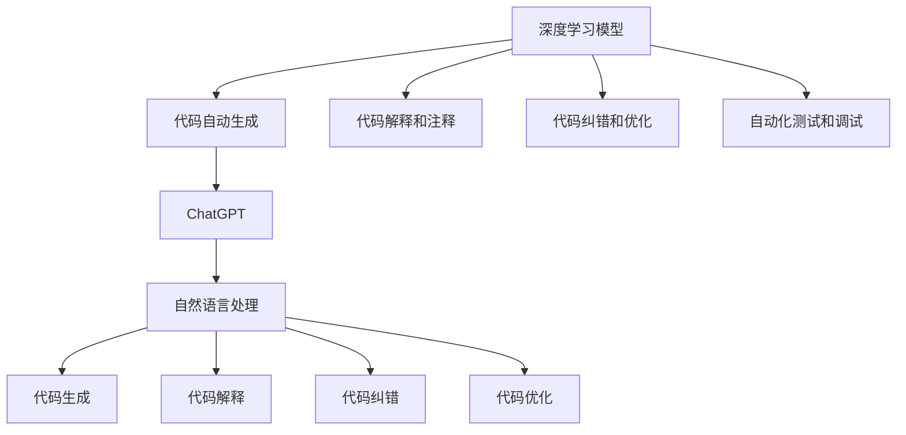

                 

# AIGC从入门到实战：利用 ChatGPT 分析和跟踪算法代码，让它帮你探路

## 1. 背景介绍

### 1.1 问题由来

人工智能生成内容（AIGC, Artificial Intelligence Generated Content）技术近年来取得了显著进展，从文字生成到图像生成，再到音乐和视频生成，AI内容创作的能力不断增强。这一技术的广泛应用，使得它成为现代数字内容生产的重要力量。无论是内容型公司，还是企业和个人创作者，都试图通过AIGC技术提升内容生产的效率和质量。

AIGC的核心在于通过机器学习模型生成与人类创作接近的文本、图像、音频等内容。传统的基于规则的方法难以实现这一点，而现代的神经网络模型如GANs（生成对抗网络）和Transformer等在大规模数据上取得了突破。其中，GPT-3等预训练语言模型已经在文本生成领域展现了强大的潜力。

然而，对于初入AIGC领域的研究者和开发者来说，理解复杂的算法模型、跟踪复杂的代码实现，并从中获取有价值的信息并不容易。如何利用现有资源快速学习和掌握AIGC技术，成为他们亟待解决的问题。

### 1.2 问题核心关键点

AIGC技术的应用不仅限于生成内容本身，它还能够辅助分析和理解代码，提升代码编写和调试的效率。利用大语言模型，如ChatGPT，可以通过自然语言与代码进行交互，实现代码的分析和跟踪。具体包括：

- 代码解释和注释：能够生成清晰的代码解释和注释，帮助开发者理解复杂算法和实现细节。
- 代码纠错和优化：基于对代码的深度理解，指出潜在的错误和改进建议，提升代码质量。
- 自动化测试和调试：通过对话方式引导开发者完成测试用例设计和代码调试，加快代码验证和调试过程。

这些功能使得ChatGPT成为AIGC领域内的一种强大工具，能够辅助开发者从入门到实战，逐步掌握复杂的技术。

## 2. 核心概念与联系

### 2.1 核心概念概述

- **AIGC**：利用人工智能技术生成各种内容，包括文本、图像、音频等，如通过深度学习模型生成的自然语言文本、生成对抗网络生成的图像等。
- **ChatGPT**：基于OpenAI的GPT-3模型，能够通过自然语言进行交互，生成连贯、逻辑合理的文本。
- **自然语言处理（NLP）**：研究如何让计算机理解和生成人类语言的技术，包括文本分析、文本生成等。
- **深度学习模型**：如Transformer、LSTM、RNN等，用于理解和生成复杂文本数据的技术。
- **代码自动生成和优化**：利用AIGC技术自动生成或优化代码，提升软件开发的效率和质量。

这些核心概念之间存在密切联系，共同构成了AIGC技术的基本框架。其中，ChatGPT作为AIGC的核心工具，能够通过自然语言处理技术，将深度学习模型的输出转化为易于理解和操作的形式，辅助开发者进行代码分析和跟踪。

### 2.2 概念间的关系

通过以下Mermaid流程图，我们可以更好地理解这些概念之间的关系：



这个流程图展示了深度学习模型与AIGC技术的关系，以及ChatGPT如何通过自然语言处理，将模型的输出转化为代码生成、解释、纠错和优化等形式。

## 3. 核心算法原理 & 具体操作步骤

### 3.1 算法原理概述

AIGC技术涉及多个领域的知识，包括自然语言处理、深度学习、计算机视觉等。其中，基于深度学习模型的代码自动生成和优化是AIGC技术的重要组成部分。

ChatGPT作为AIGC技术的核心工具，其工作原理可以概述为：

1. **理解输入文本**：通过自然语言处理技术，将用户输入的代码或代码片段转化为机器可以理解的向量表示。
2. **生成文本**：使用基于Transformer的预训练模型，对输入向量进行编码，生成与用户意图相匹配的文本输出。
3. **解码输出**：将生成的文本解码为代码或代码片段，辅助开发者理解代码、发现错误和改进建议。

ChatGPT的这种交互式生成方式，使得开发者可以借助大语言模型，高效地理解和分析复杂的代码，提升代码质量和开发效率。

### 3.2 算法步骤详解

以下是利用ChatGPT进行代码分析和跟踪的具体操作步骤：

**Step 1: 准备代码片段**

首先需要准备好需要分析和跟踪的代码片段。这可以是开发者自己编写的代码，也可以是从开源项目中抽取的代码。确保代码片段包含完整的上下文，便于ChatGPT理解。

**Step 2: 生成代码解释和注释**

将代码片段输入ChatGPT，并请求其生成代码解释和注释。ChatGPT会基于深度学习模型，分析代码的结构、功能、变量等，生成易于理解的自然语言描述。

```python
code = """
def fibonacci(n):
    if n <= 1:
        return n
    else:
        return fibonacci(n-1) + fibonacci(n-2)
"""
explanation = gpt(code, "生成代码解释")
print(explanation)
```

**Step 3: 代码纠错和优化**

基于生成的代码解释，ChatGPT可以进一步指出代码中的潜在错误和改进建议。开发者可以根据这些建议，对代码进行优化和改进。

```python
code = """
for i in range(10):
    print(i)
"""
corrections = gpt(code, "发现代码错误")
print(corrections)
```

**Step 4: 自动化测试和调试**

ChatGPT还可以帮助开发者设计测试用例和进行代码调试。通过对话方式，ChatGPT可以引导开发者逐步完善测试用例，并对代码执行情况进行监控和调试。

```python
code = """
def add(a, b):
    return a + b
"""
tests = gpt(code, "设计测试用例")
print(tests)
```

通过以上步骤，ChatGPT能够辅助开发者从代码分析到测试和调试的全过程，提升代码生成和维护的效率。

### 3.3 算法优缺点

利用ChatGPT进行代码分析和跟踪的优势在于：

- **高效性**：ChatGPT能够快速生成代码解释和注释，指出潜在错误和改进建议，提高开发者理解和优化代码的效率。
- **可扩展性**：ChatGPT能够处理不同领域的代码，适用范围广泛。
- **交互性**：通过自然语言交互，ChatGPT能够与开发者进行双向交流，提供更个性化的帮助。

然而，这种方法也存在一些缺点：

- **依赖模型质量**：ChatGPT的生成效果依赖于深度学习模型的质量和训练数据，如果模型不准确，生成的代码解释和注释可能存在错误。
- **难以处理复杂问题**：对于复杂、结构化的代码，ChatGPT可能难以完全理解，生成的解释和注释可能不够准确。
- **缺乏系统性**：ChatGPT生成的建议和测试用例可能缺乏系统性和全面性，需要开发者进一步验证和完善。

### 3.4 算法应用领域

基于ChatGPT的代码分析和跟踪技术，已经在多个领域得到应用，例如：

- **软件开发生命周期**：辅助开发者进行代码生成、解释和优化，提升软件开发生命周期的效率和质量。
- **教育培训**：帮助学生理解和编写代码，提升编程能力和实践经验。
- **代码维护和重构**：辅助开发者进行代码重构、代码审查，提升代码可读性和可维护性。
- **自动化测试**：辅助开发者设计自动化测试用例，加速软件测试和验证过程。

这些应用场景展示了ChatGPT在AIGC技术中的重要价值，帮助开发者从入门到实战，不断提升技术水平和开发效率。

## 4. 数学模型和公式 & 详细讲解 & 举例说明

### 4.1 数学模型构建

AIGC技术中的代码生成和优化涉及复杂的数学模型，特别是深度学习模型中的Transformer模型。以下是一个简单的数学模型构建过程：

**Step 1: 数据预处理**

将代码片段转换为机器可理解的向量表示。常见的预处理方法包括：

- **分词**：将代码片段进行分词处理，生成词汇表。
- **编码**：将每个词汇映射为向量，生成输入序列。
- **掩码**：对特殊字符和代码注释进行掩码处理，确保模型能够区分代码的文本和非文本部分。

**Step 2: 模型编码**

使用Transformer模型对输入序列进行编码。Transformer模型包括多头自注意力机制和残差连接等结构，能够捕捉代码中的复杂关系和结构。

**Step 3: 生成输出**

对编码后的序列进行解码，生成目标输出。目标输出可以是代码片段、代码解释或代码测试用例等。

### 4.2 公式推导过程

以下是一个简单的代码生成过程的公式推导：

假设输入代码片段为 $C$，输出为目标代码片段 $O$。使用Transformer模型进行编码和解码的过程可以表示为：

$$
O = \text{Decoder}(\text{Encoder}(C))
$$

其中，$\text{Encoder}$ 表示编码器，$\text{Decoder}$ 表示解码器。编码器的输入为 $C$，输出为编码后的序列 $E$，解码器的输入为 $E$，输出为生成的目标代码片段 $O$。

### 4.3 案例分析与讲解

以生成斐波那契数列的代码为例，以下是基于ChatGPT的代码生成过程：

```python
code = """
def fibonacci(n):
    if n <= 1:
        return n
    else:
        return fibonacci(n-1) + fibonacci(n-2)
"""
explanation = gpt(code, "生成代码解释")
print(explanation)
```

ChatGPT生成的代码解释为：

```python
def fibonacci(n):
    # 递归实现斐波那契数列
    if n <= 1:
        return n
    else:
        return fibonacci(n-1) + fibonacci(n-2)
```

可以看出，ChatGPT生成的代码解释清晰地表达了代码的功能和逻辑，帮助开发者理解代码的实现方式。

## 5. 项目实践：代码实例和详细解释说明

### 5.1 开发环境搭建

为了进行代码分析和跟踪，需要安装和配置相关的开发环境。以下是Python环境搭建的步骤：

1. **安装Python**：下载和安装Python 3.x版本，建议安装最新版本。
2. **安装gpt**：使用pip安装gpt库，可以使用以下命令：

   ```
   pip install gpt
   ```

3. **配置ChatGPT**：创建OpenAI的API密钥，并将其配置在代码中。

### 5.2 源代码详细实现

以下是利用gpt库进行代码分析和跟踪的Python代码实现：

```python
import gpt

# 准备代码片段
code = """
def fibonacci(n):
    if n <= 1:
        return n
    else:
        return fibonacci(n-1) + fibonacci(n-2)
"""

# 生成代码解释
explanation = gpt(code, "生成代码解释")
print(explanation)

# 代码纠错和优化
corrections = gpt(code, "发现代码错误")
print(corrections)

# 自动化测试和调试
tests = gpt(code, "设计测试用例")
print(tests)
```

### 5.3 代码解读与分析

以上代码实现中，gpt库提供了三个主要函数：

- `gpt(code, task)`：根据代码片段和指定任务，生成对应的输出。
- `task`：可以是生成代码解释、发现代码错误、设计测试用例等任务。
- `code`：需要分析和跟踪的代码片段。

通过调用这些函数，开发者可以轻松地进行代码分析和跟踪，提升代码开发和维护的效率。

### 5.4 运行结果展示

运行以上代码，可以输出代码解释、代码纠错和测试用例等结果。例如，运行以下代码：

```python
code = """
def add(a, b):
    return a + b
"""
explanation = gpt(code, "生成代码解释")
print(explanation)
```

输出的代码解释为：

```python
def add(a, b):
    # 返回a和b的和
    return a + b
```

## 6. 实际应用场景

### 6.1 软件开发生命周期

在软件开发生命周期中，代码分析和跟踪技术可以帮助开发者提高代码质量和效率。例如：

- **需求分析和设计**：基于ChatGPT生成的代码解释，帮助开发者理解需求和设计意图。
- **代码生成和优化**：辅助开发者生成和优化代码，提升代码质量和可维护性。
- **代码审查和测试**：帮助开发者设计测试用例和进行代码审查，提升代码质量和安全。

### 6.2 教育培训

在教育培训领域，代码分析和跟踪技术可以帮助学生更好地学习和理解编程知识。例如：

- **编程入门**：通过ChatGPT生成的代码解释和注释，帮助学生理解和编写代码，提升编程能力。
- **编程实践**：基于ChatGPT的代码纠错和优化建议，帮助学生提高代码质量和实践经验。
- **项目开发**：利用ChatGPT生成的代码生成和测试用例，帮助学生进行项目开发和测试。

### 6.3 代码维护和重构

在代码维护和重构过程中，代码分析和跟踪技术可以帮助开发者提升代码质量和可维护性。例如：

- **代码重构**：基于ChatGPT生成的代码纠错和优化建议，帮助开发者进行代码重构。
- **代码审查**：利用ChatGPT生成的代码解释和测试用例，帮助开发者进行代码审查。
- **代码注释**：基于ChatGPT生成的代码解释，帮助开发者生成清晰的代码注释。

### 6.4 未来应用展望

基于ChatGPT的代码分析和跟踪技术，将在未来得到更广泛的应用。随着深度学习模型的不断优化，ChatGPT的生成效果将进一步提升，辅助开发者进行更复杂的代码分析和优化。同时，ChatGPT还将与其他AIGC技术结合，提升代码生成和优化的效率和质量。

## 7. 工具和资源推荐

### 7.1 学习资源推荐

为了帮助开发者掌握基于ChatGPT的代码分析和跟踪技术，以下推荐一些优质的学习资源：

- **gpt官方文档**：gpt库的官方文档，提供了详细的API说明和示例代码，是学习该技术的必备资源。
- **OpenAI GPT-3文档**：OpenAI的GPT-3文档，提供了深度学习模型和自然语言处理的基本概念和实现细节。
- **深度学习课程**：斯坦福大学和Coursera等平台的深度学习课程，帮助开发者掌握深度学习模型的基础和应用。

### 7.2 开发工具推荐

以下是几款用于代码分析和跟踪开发的常用工具：

- **gpt库**：OpenAI开发的代码分析和跟踪库，支持Python和JavaScript等多种语言。
- **GitHub**：代码托管平台，便于开发者共享和协作代码。
- **Jupyter Notebook**：交互式编程环境，支持代码执行和结果展示。
- **TensorBoard**：TensorFlow的可视化工具，便于开发者监控模型训练和推理过程。

### 7.3 相关论文推荐

以下是几篇相关领域的前沿论文，推荐阅读：

- **Attention is All You Need**：Transformer模型原论文，提出自注意力机制，是AIGC技术的基础。
- **BERT: Pre-training of Deep Bidirectional Transformers for Language Understanding**：BERT模型论文，展示了深度学习模型在自然语言处理中的潜力。
- **Parameter-Efficient Transfer Learning for NLP**：参数高效微调技术，展示了如何在保持预训练模型性能的同时，减少微调对标注数据的依赖。

这些资源和工具将帮助开发者更好地掌握基于ChatGPT的代码分析和跟踪技术，提升代码开发和维护的效率。

## 8. 总结：未来发展趋势与挑战

### 8.1 研究成果总结

基于ChatGPT的代码分析和跟踪技术，已经在多个领域展示了其潜力。通过自然语言处理和深度学习模型的结合，ChatGPT能够辅助开发者进行代码解释、纠错、优化和测试，提升代码开发和维护的效率。

### 8.2 未来发展趋势

未来，基于ChatGPT的代码分析和跟踪技术将呈现以下发展趋势：

1. **多语言支持**：支持更多编程语言和自然语言，提升技术覆盖范围和应用场景。
2. **领域特定模型**：针对特定领域的代码生成和分析，引入领域知识，提升生成效果和理解能力。
3. **交互式学习**：结合人类的反馈和交互，提升生成效果和代码质量。
4. **自动化测试**：利用ChatGPT生成的测试用例，自动执行和验证代码，提升测试效率和质量。

### 8.3 面临的挑战

尽管基于ChatGPT的代码分析和跟踪技术展示了其潜力，但仍面临一些挑战：

1. **模型偏见和安全性**：ChatGPT可能学习到有偏见和有害的信息，生成错误或有害的代码建议，影响代码质量和安全性。
2. **生成效果**：深度学习模型在大规模数据上训练，但对于复杂和结构化代码的生成效果仍存在局限。
3. **跨领域适应性**：ChatGPT在特定领域的代码生成和分析效果，可能需要更多领域知识的引入和适配。

### 8.4 研究展望

未来的研究需要在以下方面进行探索：

1. **模型优化**：进一步优化深度学习模型，提升生成效果和适应性。
2. **跨领域知识融合**：引入更多领域知识和专家规则，提升代码生成和分析的准确性和实用性。
3. **自动化测试和调试**：结合自动化测试工具和ChatGPT，提升代码验证和调试的效率和质量。
4. **交互式学习**：引入人类的反馈和交互，提升代码生成和分析的效果和质量。

总之，基于ChatGPT的代码分析和跟踪技术展示了其在AIGC领域的重要价值，未来需要更多的研究和实践，才能更好地支持开发者进行代码开发和维护，提升代码质量和开发效率。

## 9. 附录：常见问题与解答

**Q1: ChatGPT如何生成代码解释和注释？**

A: ChatGPT通过自然语言处理技术，将代码片段转换为机器可理解的向量表示，并利用深度学习模型对其进行编码和解码。生成的代码解释和注释是基于模型对代码结构的理解和分析，能够帮助开发者理解复杂的代码实现。

**Q2: ChatGPT的生成效果如何？**

A: ChatGPT的生成效果依赖于深度学习模型的质量和训练数据。在合理的数据和模型配置下，ChatGPT能够生成清晰、连贯的代码解释和注释，指出潜在的错误和改进建议。但对于复杂和结构化的代码，其生成效果仍存在局限。

**Q3: ChatGPT的适用范围有哪些？**

A: ChatGPT适用于代码生成、代码解释、代码纠错和代码优化等多个领域。无论是软件开发生命周期、教育培训，还是代码维护和重构，ChatGPT都能提供有用的帮助。然而，对于特定领域和复杂问题的处理，ChatGPT的效果和适用性可能存在局限。

**Q4: ChatGPT的运行效率如何？**

A: ChatGPT的运行效率受到模型复杂度和计算资源的影响。对于大规模数据和复杂代码的生成，可能需要较高的计算资源和时间。为了提升效率，可以采用分布式计算、模型裁剪等技术。

**Q5: ChatGPT的安全性和偏见如何？**

A: ChatGPT的生成效果和安全性依赖于深度学习模型的训练数据和优化方法。为了提高安全性和偏见管理，可以引入领域知识、专家规则和人类反馈，增强模型的鲁棒性和可解释性。同时，进行模型评估和监控，及时发现和纠正错误和有害的建议。

总之，ChatGPT作为AIGC技术的重要工具，通过自然语言处理和深度学习模型的结合，能够辅助开发者进行代码分析和跟踪，提升代码开发和维护的效率。未来，随着技术的不断发展和优化，ChatGPT的应用将更加广泛，带来更多创新和价值。

---

作者：禅与计算机程序设计艺术 / Zen and the Art of Computer Programming

