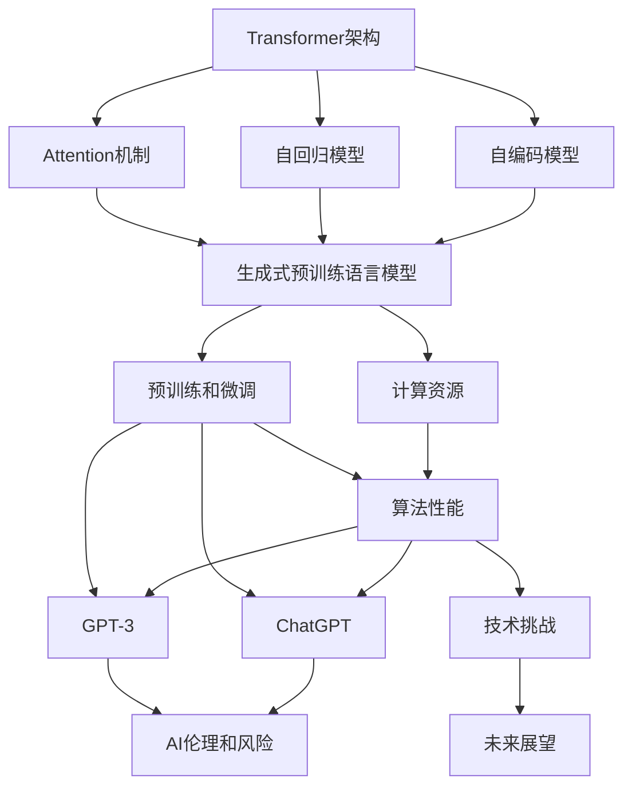
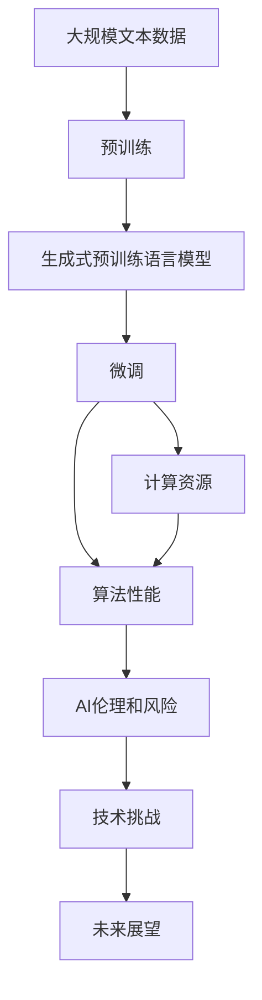
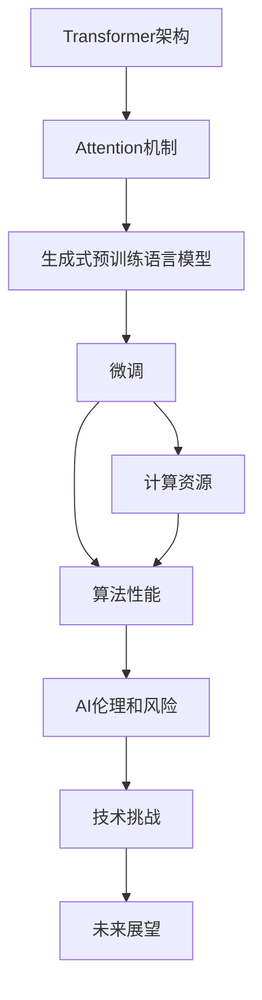

                 

# AIGC从入门到实战：只缘身在此山中：GPT 模型靠什么取胜和“出圈”？

> 关键词：大语言模型(GPT)、Transformer架构、自回归模型、自编码模型、Attention机制、预训练和微调、语言模型、自然语言处理(NLP)、计算资源、算法性能、GPT-3、ChatGPT、AI伦理和风险、技术挑战、未来展望

## 1. 背景介绍

### 1.1 问题由来

近年来，人工智能(AI)和生成式AI(Generative AI, GAI)技术迅猛发展，尤其是在自然语言处理(Natural Language Processing, NLP)领域，生成式预训练语言模型(Generative Pre-trained Transformer, GPT)系列模型取得了举世瞩目的成就。GPT模型通过在大规模无标签文本数据上自监督学习，掌握了丰富的语言知识和模式，具备强大的文本生成能力。

GPT模型的突破性在于其Transformer架构和Attention机制的应用，能够处理长序列文本，并生成连贯且高质量的自然语言。这种能力在众多NLP任务中表现出色，包括文本生成、问答、机器翻译、摘要生成、对话系统等，广泛应用于内容创作、智能客服、教育培训、娱乐传媒等各行业，引领了AI技术的“出圈”潮流。

### 1.2 问题核心关键点

GPT模型的成功不仅在于其强大的生成能力，还在于其能够在海量数据上通过自监督学习，预训练出高质量的表示，并在特定任务上进行微调，以达到卓越的性能。这种预训练-微调范式不仅降低了模型的标注成本，提升了模型在小样本数据上的泛化能力，还推动了AI技术的广泛应用。

GPT模型的核心优势在于：
1. **Transformer架构**：引入自注意力机制，能够并行计算，提高模型训练和推理效率。
2. **Attention机制**：通过注意力权重，动态调整输入序列的影响力，增强模型对关键信息的捕捉能力。
3. **自回归生成**：通过前文信息预测下一个词汇，保证生成的连贯性和一致性。
4. **大规模预训练**：利用海量无标签数据进行自监督学习，学习到丰富的语言模式和知识。
5. **微调机制**：通过有监督学习对特定任务进行微调，提升模型在任务上的性能。

GPT模型的这些特性使其成为当前NLP领域的主流模型，广泛应用于各种智能应用场景。

### 1.3 问题研究意义

深入理解GPT模型的工作原理和优势，对于掌握GAI技术的应用和优化，提升AI系统的性能和可解释性，具有重要意义。

1. **推动技术发展**：GPT模型的成功为NLP领域的未来研究提供了重要方向和思路。
2. **降低应用门槛**：GPT模型为开发者提供了高效、灵活的AI应用工具，降低了AI技术应用的门槛。
3. **加速产业化**：通过预训练和微调机制，GPT模型能够适应多样化的应用场景，加速AI技术的产业化进程。
4. **提升用户体验**：GPT模型的生成式能力，使其能够生成高质量的文本内容，提升用户体验。
5. **拓展应用领域**：GPT模型的广泛应用，使得AI技术渗透到各行各业，带来新的商业机会。

## 2. 核心概念与联系

### 2.1 核心概念概述

为了更好地理解GPT模型的核心特性和应用原理，本节将介绍几个密切相关的核心概念：

- **生成式预训练语言模型(GPT)**：通过在大规模无标签文本数据上自监督学习，掌握丰富的语言知识和模式，具备强大的文本生成能力。
- **Transformer架构**：一种基于自注意力机制的神经网络架构，能够高效处理长序列数据，并并行计算。
- **Attention机制**：通过动态调整输入序列的影响力，增强模型对关键信息的捕捉能力。
- **自回归模型**：通过前文信息预测下一个词汇，保证生成的连贯性和一致性。
- **自编码模型**：通过重构输入序列来学习和编码语言模式，提升模型的表示能力。
- **预训练和微调**：通过在大规模无标签数据上进行预训练，然后在特定任务上进行微调，以提升模型性能。
- **计算资源**：包括CPU、GPU、TPU等硬件资源，是模型训练和推理的基础。
- **算法性能**：包括模型的训练速度、推理速度、精度、鲁棒性等。
- **GPT-3**：最新的GPT模型版本，拥有更高的参数量、更大的数据集和更强的生成能力。
- **ChatGPT**：基于GPT模型的智能对话系统，广泛应用于智能客服、教育培训、娱乐传媒等领域。
- **AI伦理和风险**：涉及AI技术的应用边界、数据隐私、安全风险等。
- **技术挑战**：包括计算资源限制、算法性能优化、数据隐私保护等。
- **未来展望**：涉及GAI技术的未来发展趋势、应用前景等。

这些核心概念之间的逻辑关系可以通过以下Mermaid流程图来展示：



这个流程图展示了大语言模型的核心概念及其之间的关系：

1. **Transformer架构**：是GPT模型的基础，引入了自注意力机制。
2. **Attention机制**：通过动态调整输入序列的影响力，增强模型对关键信息的捕捉能力。
3. **自回归模型**：通过前文信息预测下一个词汇，保证生成的连贯性和一致性。
4. **自编码模型**：通过重构输入序列来学习和编码语言模式，提升模型的表示能力。
5. **生成式预训练语言模型**：在预训练阶段通过自监督任务学习丰富的语言知识，在微调阶段适应特定任务。
6. **计算资源**：包括CPU、GPU、TPU等硬件资源，是模型训练和推理的基础。
7. **算法性能**：包括模型的训练速度、推理速度、精度、鲁棒性等。
8. **GPT-3**：最新的GPT模型版本，拥有更高的参数量、更大的数据集和更强的生成能力。
9. **ChatGPT**：基于GPT模型的智能对话系统，广泛应用于智能客服、教育培训、娱乐传媒等领域。
10. **AI伦理和风险**：涉及AI技术的应用边界、数据隐私、安全风险等。
11. **技术挑战**：包括计算资源限制、算法性能优化、数据隐私保护等。
12. **未来展望**：涉及GAI技术的未来发展趋势、应用前景等。

### 2.2 概念间的关系

这些核心概念之间存在着紧密的联系，形成了GPT模型的完整生态系统。下面我们通过几个Mermaid流程图来展示这些概念之间的关系。

#### 2.2.1 GPT模型的学习范式



这个流程图展示了大语言模型的预训练-微调过程：

1. **预训练**：通过在大规模无标签数据上进行自监督学习，学习到丰富的语言知识和模式。
2. **微调**：通过有监督学习对特定任务进行微调，提升模型在任务上的性能。
3. **计算资源**：包括CPU、GPU、TPU等硬件资源，是模型训练和推理的基础。
4. **算法性能**：包括模型的训练速度、推理速度、精度、鲁棒性等。
5. **AI伦理和风险**：涉及AI技术的应用边界、数据隐私、安全风险等。
6. **技术挑战**：包括计算资源限制、算法性能优化、数据隐私保护等。
7. **未来展望**：涉及GAI技术的未来发展趋势、应用前景等。

#### 2.2.2 GPT模型与Transformer的关系



这个流程图展示了大语言模型的Transformer架构与生成式预训练语言模型的关系：

1. **Transformer架构**：是GPT模型的基础，引入了自注意力机制。
2. **Attention机制**：通过动态调整输入序列的影响力，增强模型对关键信息的捕捉能力。
3. **生成式预训练语言模型**：在预训练阶段通过自监督任务学习丰富的语言知识，在微调阶段适应特定任务。
4. **计算资源**：包括CPU、GPU、TPU等硬件资源，是模型训练和推理的基础。
5. **算法性能**：包括模型的训练速度、推理速度、精度、鲁棒性等。
6. **AI伦理和风险**：涉及AI技术的应用边界、数据隐私、安全风险等。
7. **技术挑战**：包括计算资源限制、算法性能优化、数据隐私保护等。
8. **未来展望**：涉及GAI技术的未来发展趋势、应用前景等。

### 2.3 核心概念的整体架构

最后，我们用一个综合的流程图来展示这些核心概念在大语言模型微调过程中的整体架构：


这个综合流程图展示了从预训练到微调，再到计算资源和算法性能优化，最后拓展到AI伦理和风险、技术挑战的未来展望，形成了一个完整的生态系统。通过这些流程图，我们可以更清晰地理解GPT模型的工作原理和优化方向。

## 3. 核心算法原理 & 具体操作步骤
### 3.1 算法原理概述

GPT模型的核心算法包括Transformer架构、Attention机制和自回归生成。这些算法共同构成了GPT模型的强大生成能力。

**Transformer架构**：通过并行计算，加速模型训练和推理过程。自注意力机制能够动态调整输入序列的影响力，增强模型对关键信息的捕捉能力。

**Attention机制**：通过动态调整输入序列的影响力，增强模型对关键信息的捕捉能力。每个位置上的注意力权重，表示该位置对当前位置的贡献程度，从而更好地捕捉语境信息。

**自回归生成**：通过前文信息预测下一个词汇，保证生成的连贯性和一致性。模型的目标是通过前文预测下一个词汇，从而生成连贯的文本序列。

### 3.2 算法步骤详解

GPT模型的微调过程主要包括以下几个关键步骤：

**Step 1: 准备预训练模型和数据集**
- 选择合适的预训练语言模型 $M_{\theta}$ 作为初始化参数，如 GPT-3。
- 准备下游任务 $T$ 的标注数据集 $D=\{(x_i, y_i)\}_{i=1}^N$，划分为训练集、验证集和测试集。一般要求标注数据与预训练数据的分布不要差异过大。

**Step 2: 添加任务适配层**
- 根据任务类型，在预训练模型顶层设计合适的输出层和损失函数。
- 对于分类任务，通常在顶层添加线性分类器和交叉熵损失函数。
- 对于生成任务，通常使用语言模型的解码器输出概率分布，并以负对数似然为损失函数。

**Step 3: 设置微调超参数**
- 选择合适的优化算法及其参数，如 AdamW、SGD 等，设置学习率、批大小、迭代轮数等。
- 设置正则化技术及强度，包括权重衰减、Dropout、Early Stopping等。
- 确定冻结预训练参数的策略，如仅微调顶层，或全部参数都参与微调。

**Step 4: 执行梯度训练**
- 将训练集数据分批次输入模型，前向传播计算损失函数。
- 反向传播计算参数梯度，根据设定的优化算法和学习率更新模型参数。
- 周期性在验证集上评估模型性能，根据性能指标决定是否触发 Early Stopping。
- 重复上述步骤直到满足预设的迭代轮数或 Early Stopping 条件。

**Step 5: 测试和部署**
- 在测试集上评估微调后模型 $M_{\hat{\theta}}$ 的性能，对比微调前后的精度提升。
- 使用微调后的模型对新样本进行推理预测，集成到实际的应用系统中。
- 持续收集新的数据，定期重新微调模型，以适应数据分布的变化。

以上是GPT模型微调的一般流程。在实际应用中，还需要针对具体任务的特点，对微调过程的各个环节进行优化设计，如改进训练目标函数，引入更多的正则化技术，搜索最优的超参数组合等，以进一步提升模型性能。

### 3.3 算法优缺点

GPT模型的微调方法具有以下优点：
1. **简单高效**：只需准备少量标注数据，即可对预训练模型进行快速适配，获得较大的性能提升。
2. **通用适用**：适用于各种NLP下游任务，包括分类、匹配、生成等，设计简单的任务适配层即可实现微调。
3. **参数高效**：利用参数高效微调技术，在固定大部分预训练参数的情况下，仍可取得不错的提升。
4. **效果显著**：在学术界和工业界的诸多任务上，基于微调的方法已经刷新了最先进的性能指标。

同时，该方法也存在一定的局限性：
1. **依赖标注数据**：微调的效果很大程度上取决于标注数据的质量和数量，获取高质量标注数据的成本较高。
2. **迁移能力有限**：当目标任务与预训练数据的分布差异较大时，微调的性能提升有限。
3. **负面效果传递**：预训练模型的固有偏见、有害信息等，可能通过微调传递到下游任务，造成负面影响。
4. **可解释性不足**：微调模型的决策过程通常缺乏可解释性，难以对其推理逻辑进行分析和调试。

尽管存在这些局限性，但就目前而言，基于监督学习的微调方法仍是大语言模型应用的主流范式。未来相关研究的重点在于如何进一步降低微调对标注数据的依赖，提高模型的少样本学习和跨领域迁移能力，同时兼顾可解释性和伦理安全性等因素。

### 3.4 算法应用领域

GPT模型的微调方法在NLP领域已经得到了广泛的应用，覆盖了几乎所有常见任务，例如：

- 文本分类：如情感分析、主题分类、意图识别等。通过微调使模型学习文本-标签映射。
- 命名实体识别：识别文本中的人名、地名、机构名等特定实体。通过微调使模型掌握实体边界和类型。
- 关系抽取：从文本中抽取实体之间的语义关系。通过微调使模型学习实体-关系三元组。
- 问答系统：对自然语言问题给出答案。将问题-答案对作为微调数据，训练模型学习匹配答案。
- 机器翻译：将源语言文本翻译成目标语言。通过微调使模型学习语言-语言映射。
- 文本摘要：将长文本压缩成简短摘要。将文章-摘要对作为微调数据，使模型学习抓取要点。
- 对话系统：使机器能够与人自然对话。将多轮对话历史作为上下文，微调模型进行回复生成。

除了上述这些经典任务外，GPT模型微调也被创新性地应用到更多场景中，如可控文本生成、常识推理、代码生成、数据增强等，为NLP技术带来了全新的突破。随着预训练模型和微调方法的不断进步，相信NLP技术将在更广阔的应用领域大放异彩。

## 4. 数学模型和公式 & 详细讲解  
### 4.1 数学模型构建

本节将使用数学语言对GPT模型的微调过程进行更加严格的刻画。

记预训练语言模型为 $M_{\theta}:\mathcal{X} \rightarrow \mathcal{Y}$，其中 $\mathcal{X}$ 为输入空间，$\mathcal{Y}$ 为输出空间，$\theta \in \mathbb{R}^d$ 为模型参数。假设微调任务的训练集为 $D=\{(x_i,y_i)\}_{i=1}^N, x_i \in \mathcal{X}, y_i \in \mathcal{Y}$。

定义模型 $M_{\theta}$ 在输入 $x$ 上的输出为 $\hat{y}=M_{\theta}(x) \in [0,1]$，表示样本属于正类的概率。真实标签 $y \in \{0,1\}$。则二分类交叉熵损失函数定义为：

$$
\ell(M_{\theta}(x),y) = -[y\log \hat{y} + (1-y)\log (1-\hat{y})]
$$

将其代入经验风险公式，得：

$$
\mathcal{L}(\theta) = -\frac{1}{N}\sum_{i=1}^N [y_i\log M_{\theta}(x_i)+(1-y_i)\log(1-M_{\theta}(x_i))]
$$

在实践中，我们通常使用基于梯度的优化算法（如SGD、Adam等）来近似求解上述最优化问题。设 $\eta$ 为学习率，$\lambda$ 为正则化系数，则参数的更新公式为：

$$
\theta \leftarrow \theta - \eta \nabla_{\theta}\mathcal{L}(\theta) - \eta\lambda\theta
$$

其中 $\nabla_{\theta}\mathcal{L}(\theta)$ 为损失函数对参数 $\theta$ 的梯度，可通过反向传播算法高效计算。

### 4.2 公式推导过程

以下我们以二分类任务为例，推导交叉熵损失函数及其梯度的计算公式。

假设模型 $M_{\theta}$ 在输入 $x$ 上的输出为 $\hat{y}=M_{\theta}(x) \in [0,1]$，表示样本属于正类的概率。真实标签 $y \in \{0,1\}$。则二分类交叉熵损失函数定义为：

$$
\ell(M_{\theta}(x),y) = -[y\log \hat{y} + (1-y)\log (1-\hat{y})]
$$

将其代入经验风险公式，得：

$$
\mathcal{L}(\theta) = -\frac{1}{N}\sum_{i=1}^N [y_i\log M_{\theta}(x_i)+(1-y_i)\log(1-M_{\theta}(x_i))]
$$

根据链式法则，损失函数对参数 $\theta_k$ 的梯度为：

$$
\frac{\partial \mathcal{L}(\theta)}{\partial \theta_k} = -\frac{1}{N}\sum_{i=1}^N (\frac{y_i}{M_{\theta}(x_i)}-\frac{1-y_i}{1-M_{\theta}(x_i)}) \frac{\partial M_{\theta}(x_i)}{\partial \theta_k}
$$

其中 $\frac{\partial M_{\theta}(x_i)}{\partial \theta_k}$ 可进一步递归展开，利用自动微分技术完成计算。

在得到损失函数的梯度后，即可带入参数更新公式，完成模型的迭代优化。重复上述过程直至收敛，最终得到适应下游任务的最优模型参数 $\theta^*$。

## 5. 项目实践：代码实例和详细解释说明
### 5.1 开发环境搭建

在进行微调实践前，我们需要准备好开发环境。以下是使用Python进行PyTorch开发的环境配置流程：

1. 安装Anaconda：从官网下载并安装Anaconda，用于创建独立的Python环境。

2. 创建并激活虚拟环境：
```bash
conda create -n pytorch-env python=3.8 
conda activate pytorch-env
```

3. 安装PyTorch：根据CUDA版本，从官网获取对应的安装命令。例如：
```bash
conda install pytorch torchvision torchaudio cudatoolkit=11.1 -c pytorch -c conda-forge
```

4. 安装Transformers库：
```bash
pip install transformers
```

5. 安装各类工具包：
```bash
pip install numpy pandas scikit-learn matplotlib tqdm jupyter notebook ipython
```

完成上述步骤后，即可在`pytorch-env`环境中开始微调实践。

### 5.2 源代码详细实现

这里我们以情感分析任务为例，给出使用Transformers库对GPT-3模型进行微调的PyTorch代码实现。

首先，定义情感分析任务的数据处理函数：

```python
from transformers import BertTokenizer
from torch.utils.data import Dataset
import torch

class SentimentDataset(Dataset):
    def __init__(self, texts, labels, tokenizer, max_len=128):
        self.texts = texts
        self.labels = labels
        self.tokenizer = tokenizer
        self.max_len = max_len
        
    def __len__(self):
        return len(self.texts)
    
    def __getitem__(self, item):
        text = self.texts[item]
        label = self.labels[item]
        
        encoding = self.tokenizer(text, return_tensors='pt', max_length=self.max_len, padding='max_length', truncation=True)
        input_ids = encoding['input_ids'][0]
        attention_mask = encoding['attention_mask'][0]
        
        # 对标签进行one-hot编码
        label = torch.tensor([label], dtype=torch.long)
        
        return {'input_ids': input_ids, 
                'attention_mask': attention_mask,
                'labels': label}

# 定义情感分析任务的标签和id的映射
label2id = {'positive': 1, 'negative': 0}
id2label = {v: k for k, v in label2id.items()}

# 创建dataset
tokenizer = BertTokenizer.from_pretrained('gpt3')
train_dataset = SentimentDataset(train_texts, train_labels, tokenizer)
dev_dataset = SentimentDataset(dev_texts, dev_labels, tokenizer)
test_dataset = SentimentDataset(test_texts, test_labels, tokenizer)
```

然后，定义模型和优化器：

```python
from transformers import GPT3LMHeadModel, AdamW

model = GPT3LMHeadModel.from_pretrained('gpt3', num_labels=len(label2id))

optimizer = AdamW(model.parameters(), lr=2e-5)
```

接着，定义训练和评估函数：

```python
from torch.utils.data import DataLoader
from tqdm import tqdm
from sklearn.metrics import accuracy_score

device = torch.device('cuda') if torch.cuda.is_available() else torch.device('cpu')
model.to(device)

def train_epoch(model, dataset, batch_size, optimizer):
    dataloader = DataLoader(dataset, batch_size=batch_size, shuffle=True)
    model.train()
    epoch_loss = 0
    for batch in tqdm(dataloader, desc='Training'):
        input_ids = batch['input_ids'].to(device)
        attention_mask = batch['attention_mask'].to(device)
        labels = batch['labels'].to(device)
        model.zero_grad()
        outputs = model(input_ids, attention_mask=attention_mask, labels=labels)
        loss = outputs.loss
        epoch_loss += loss.item()
        loss.backward()
        optimizer.step()
    return epoch_loss / len(dataloader)

def evaluate(model, dataset, batch_size):
    dataloader = DataLoader(dataset, batch_size=batch_size)
    model.eval()
    preds, labels = [], []
    with torch.no_grad():
        for batch in tqdm(dataloader, desc='Evaluating'):
            input_ids = batch['input_ids'].to(device)
            attention_mask = batch['attention_mask'].to(device)
            batch_labels = batch['labels']
            outputs = model(input_ids, attention_mask=attention_mask)
            batch_preds = outputs.logits.argmax(dim=2).to('cpu').tolist()
            batch_labels = batch_labels.to('cpu').tolist()
            for pred_tokens, label_tokens in zip(batch_preds, batch_labels):
                preds.append(pred_tokens[:len(label_tokens)])
                labels.append(label_tokens)
                
    print('Accuracy:', accuracy_score(labels, preds))
```

最后，启动训练流程并在测试集上评估：

```python
epochs = 5
batch_size = 16

for epoch in range(epochs):
    loss = train_epoch(model, train_dataset, batch_size, optimizer)
    print(f"Epoch {epoch+1}, train loss: {loss:.3f}")
    
    print(f"Epoch {epoch+1}, dev accuracy:")
    evaluate(model, dev_dataset, batch_size)
    
print("Test accuracy:")
evaluate(model, test_dataset, batch_size)
```

以上就是使用PyTorch对GPT-3进行情感分析任务微调的完整代码实现。可以看到，得益于Transformers库的强大封装，我们可以用相对简洁的代码完成GPT-3模型的加载和微调。

### 5.3

