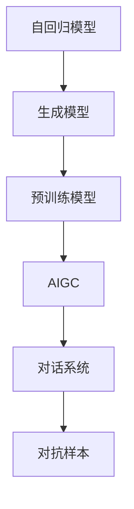
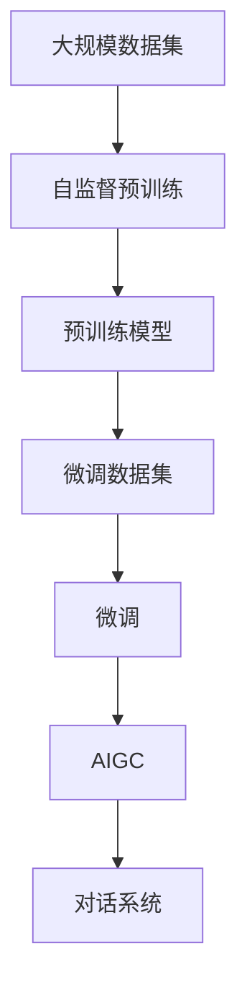
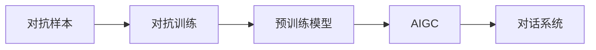
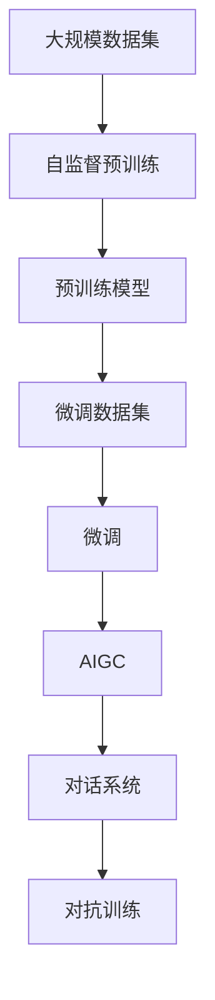

                 

# AIGC从入门到实战：简单的 ChatGPT 应用范例

> 关键词：
> - 人工智能生成内容 (AIGC)
> - ChatGPT
> - 自然语言处理 (NLP)
> - 深度学习
> - 预训练模型
> - 对话系统

## 1. 背景介绍

### 1.1 问题由来

近年来，随着深度学习技术的快速进步，人工智能生成内容（AIGC）领域取得了显著突破。尤其是在自然语言处理（NLP）领域，预训练语言模型（如GPT-3、GPT-4等）的横空出世，展示了其强大的语言理解和生成能力。ChatGPT作为其中的佼佼者，以其卓越的对话交互性能，迅速吸引了全球数亿用户的关注。

### 1.2 问题核心关键点

ChatGPT及其底层技术OpenAI的GPT模型，本质上是一类自回归生成模型，通过在大规模文本数据上进行自监督预训练，学习到语言的模式和结构，进而能够生成连贯且合理的文本。其核心特点包括：

1. **自回归性**：模型按时间顺序生成文本，前一个词的生成依赖于前文，具有较好的连贯性。
2. **大模型规模**：通过亿级参数的Transformer网络结构，可以更好地捕捉语言的长远依赖关系。
3. **丰富的训练数据**：来自互联网的多样化文本数据，使得模型具有很强的泛化能力。
4. **高效的并行计算**：通过并行计算技术，实现大规模数据的高效训练。

ChatGPT的这些特点，使其成为构建智能对话系统和生成文本内容的重要工具。通过对其技术原理和应用实践的深入探讨，本文旨在帮助读者快速上手AIGC应用，特别是基于ChatGPT的简单聊天机器人开发。

## 2. 核心概念与联系

### 2.1 核心概念概述

为更好地理解ChatGPT的实现原理和应用范例，本节将介绍几个关键概念及其相互关系：

- **AIGC (人工智能生成内容)**：指使用AI技术自动生成文本、图像、音频等内容的技术。ChatGPT是AIGC在NLP领域的典型应用。

- **预训练模型**：指在大规模无标签数据上进行预训练，学习通用语言知识的模型。ChatGPT即是一类预训练语言模型。

- **自回归模型**：一种特殊的神经网络结构，其输出依赖于前面的所有输入。ChatGPT采用了Transformer自回归模型。

- **Transformer**：一种基于注意力机制的神经网络架构，用于处理序列数据。ChatGPT中大量使用了Transformer层。

- **生成模型**：指能够自动生成文本、图像等内容的模型。ChatGPT是一种生成模型，其主要任务是文本生成。

- **对话系统**：指能够与用户进行自然语言交互的系统。ChatGPT可以构建出高效的对话系统，实现人机互动。

- **对抗样本**：指刻意设计的扰动样本，旨在破坏模型的预测能力。ChatGPT等模型在对抗样本测试中，性能可能下降。

这些核心概念之间的关系可以通过以下Mermaid流程图来展示：



这个流程图展示了AIGC的核心概念及其关系：

1. 自回归模型是生成模型的基础架构。
2. 预训练模型通过大规模数据训练，学习通用语言知识。
3. AIGC技术基于预训练模型生成内容。
4. 对话系统基于AIGC实现人机交互。
5. 对抗样本测试模型的鲁棒性。

通过理解这些核心概念，我们可以更好地把握ChatGPT的技术原理和应用场景。

### 2.2 概念间的关系

这些核心概念之间存在紧密的联系，构成了ChatGPT的核心技术架构。以下通过几个Mermaid流程图来展示这些概念之间的关系：

#### 2.2.1 核心架构


这个流程图展示了自回归模型、生成模型、预训练模型、AIGC和对话系统之间的联系。

#### 2.2.2 微调与预训练



这个流程图展示了从自监督预训练到微调的过程，以及如何通过微调得到更好的AIGC应用。

#### 2.2.3 对抗训练与鲁棒性



这个流程图展示了对抗训练在提升模型鲁棒性方面的作用。

### 2.3 核心概念的整体架构

最后，我们用一个综合的流程图来展示这些核心概念在大语言模型微调过程中的整体架构：



这个综合流程图展示了从预训练到微调，再到AIGC应用的完整过程。

## 3. 核心算法原理 & 具体操作步骤
### 3.1 算法原理概述

ChatGPT的核心算法原理可以概括为以下几点：

1. **自回归模型**：模型按时间顺序生成文本，每个词的生成依赖于前面的所有词。

2. **Transformer结构**：采用Transformer自回归结构，处理序列数据的高效方式。

3. **自监督预训练**：在大规模无标签数据上，通过自监督任务学习通用语言知识。

4. **微调**：使用下游任务的标注数据，对预训练模型进行微调，适应特定任务。

5. **对抗训练**：引入对抗样本，提高模型鲁棒性。

6. **Prompt Learning**：通过精心设计输入文本的格式，引导模型按期望方式输出。

### 3.2 算法步骤详解

基于ChatGPT的AIGC应用开发，通常包括以下关键步骤：

**Step 1: 准备预训练模型和数据集**
- 选择合适的预训练语言模型，如GPT-3。
- 准备下游任务的标注数据集，用于微调。

**Step 2: 添加任务适配层**
- 设计适当的输出层和损失函数，如分类任务使用交叉熵损失。

**Step 3: 设置微调超参数**
- 选择合适的优化器及其参数，如AdamW。
- 设置学习率、批大小、迭代轮数等。

**Step 4: 执行梯度训练**
- 将训练集数据分批次输入模型，计算损失函数。
- 反向传播计算参数梯度，更新模型参数。
- 周期性在验证集上评估模型性能，防止过拟合。

**Step 5: 测试和部署**
- 在测试集上评估微调后的模型性能。
- 将模型集成到实际的应用系统中，如聊天机器人。

### 3.3 算法优缺点

基于ChatGPT的AIGC应用具有以下优点：

1. **简单高效**：微调过程简单，只需少量标注数据。
2. **广泛适用**：适用于各类自然语言处理任务，如问答、对话、生成等。
3. **快速迭代**：开发周期短，可以较快地根据需求调整模型。

但同时，ChatGPT的应用也存在一些局限：

1. **依赖标注数据**：微调效果很大程度上取决于标注数据的质量和数量。
2. **泛化能力有限**：当目标任务与预训练数据的分布差异较大时，性能提升有限。
3. **对抗样本敏感**：对抗样本可能破坏模型的稳定性和安全性。
4. **可解释性不足**：模型的内部工作机制难以解释。

尽管存在这些局限，但ChatGPT在AIGC领域的应用前景依然广阔。

### 3.4 算法应用领域

基于ChatGPT的AIGC技术，已经在诸多NLP任务上取得了显著效果，如对话系统、文本生成、问答系统等。其应用场景包括：

- **智能客服**：通过微调生成自然流畅的客服对话，提高服务质量。
- **智能翻译**：将文本翻译成多种语言，辅助跨语言交流。
- **内容生成**：自动生成新闻报道、文章摘要、产品描述等内容。
- **教育培训**：自动生成问题解答、模拟对话等教学材料。
- **创意写作**：帮助作家进行文本创作、剧本编写等。

## 4. 数学模型和公式 & 详细讲解 & 举例说明

### 4.1 数学模型构建

假设预训练语言模型为 $M_{\theta}$，其中 $\theta$ 为预训练得到的模型参数。给定下游任务 $T$ 的标注数据集 $D=\{(x_i, y_i)\}_{i=1}^N$，微调的目标是找到新的模型参数 $\hat{\theta}$，使得：

$$
\hat{\theta}=\mathop{\arg\min}_{\theta} \mathcal{L}(M_{\theta},D)
$$

其中 $\mathcal{L}$ 为针对任务 $T$ 设计的损失函数，用于衡量模型预测输出与真实标签之间的差异。常见的损失函数包括交叉熵损失、均方误差损失等。

### 4.2 公式推导过程

以下我们以二分类任务为例，推导交叉熵损失函数及其梯度的计算公式。

假设模型 $M_{\theta}$ 在输入 $x$ 上的输出为 $\hat{y}=M_{\theta}(x) \in [0,1]$，表示样本属于正类的概率。真实标签 $y \in \{0,1\}$。则二分类交叉熵损失函数定义为：

$$
\ell(M_{\theta}(x),y) = -[y\log \hat{y} + (1-y)\log (1-\hat{y})]
$$

将其代入经验风险公式，得：

$$
\mathcal{L}(\theta) = -\frac{1}{N}\sum_{i=1}^N [y_i\log M_{\theta}(x_i)+(1-y_i)\log(1-M_{\theta}(x_i))]
$$

根据链式法则，损失函数对参数 $\theta_k$ 的梯度为：

$$
\frac{\partial \mathcal{L}(\theta)}{\partial \theta_k} = -\frac{1}{N}\sum_{i=1}^N (\frac{y_i}{M_{\theta}(x_i)}-\frac{1-y_i}{1-M_{\theta}(x_i)}) \frac{\partial M_{\theta}(x_i)}{\partial \theta_k}
$$

其中 $\frac{\partial M_{\theta}(x_i)}{\partial \theta_k}$ 可进一步递归展开，利用自动微分技术完成计算。

### 4.3 案例分析与讲解

以二分类任务为例，假设模型 $M_{\theta}$ 在输入 $x$ 上的输出为 $\hat{y}=M_{\theta}(x) \in [0,1]$，表示样本属于正类的概率。真实标签 $y \in \{0,1\}$。则二分类交叉熵损失函数定义为：

$$
\ell(M_{\theta}(x),y) = -[y\log \hat{y} + (1-y)\log (1-\hat{y})]
$$

将其代入经验风险公式，得：

$$
\mathcal{L}(\theta) = -\frac{1}{N}\sum_{i=1}^N [y_i\log M_{\theta}(x_i)+(1-y_i)\log(1-M_{\theta}(x_i))]
$$

根据链式法则，损失函数对参数 $\theta_k$ 的梯度为：

$$
\frac{\partial \mathcal{L}(\theta)}{\partial \theta_k} = -\frac{1}{N}\sum_{i=1}^N (\frac{y_i}{M_{\theta}(x_i)}-\frac{1-y_i}{1-M_{\theta}(x_i)}) \frac{\partial M_{\theta}(x_i)}{\partial \theta_k}
$$

其中 $\frac{\partial M_{\theta}(x_i)}{\partial \theta_k}$ 可进一步递归展开，利用自动微分技术完成计算。

## 5. 项目实践：代码实例和详细解释说明

### 5.1 开发环境搭建

在进行微调实践前，我们需要准备好开发环境。以下是使用Python进行PyTorch开发的环境配置流程：

1. 安装Anaconda：从官网下载并安装Anaconda，用于创建独立的Python环境。

2. 创建并激活虚拟环境：
```bash
conda create -n pytorch-env python=3.8 
conda activate pytorch-env
```

3. 安装PyTorch：根据CUDA版本，从官网获取对应的安装命令。例如：
```bash
conda install pytorch torchvision torchaudio cudatoolkit=11.1 -c pytorch -c conda-forge
```

4. 安装Transformers库：
```bash
pip install transformers
```

5. 安装各类工具包：
```bash
pip install numpy pandas scikit-learn matplotlib tqdm jupyter notebook ipython
```

完成上述步骤后，即可在`pytorch-env`环境中开始微调实践。

### 5.2 源代码详细实现

下面我们以命名实体识别(NER)任务为例，给出使用Transformers库对BERT模型进行微调的PyTorch代码实现。

首先，定义NER任务的数据处理函数：

```python
from transformers import BertTokenizer
from torch.utils.data import Dataset
import torch

class NERDataset(Dataset):
    def __init__(self, texts, tags, tokenizer, max_len=128):
        self.texts = texts
        self.tags = tags
        self.tokenizer = tokenizer
        self.max_len = max_len
        
    def __len__(self):
        return len(self.texts)
    
    def __getitem__(self, item):
        text = self.texts[item]
        tags = self.tags[item]
        
        encoding = self.tokenizer(text, return_tensors='pt', max_length=self.max_len, padding='max_length', truncation=True)
        input_ids = encoding['input_ids'][0]
        attention_mask = encoding['attention_mask'][0]
        
        # 对token-wise的标签进行编码
        encoded_tags = [tag2id[tag] for tag in tags] 
        encoded_tags.extend([tag2id['O']] * (self.max_len - len(encoded_tags)))
        labels = torch.tensor(encoded_tags, dtype=torch.long)
        
        return {'input_ids': input_ids, 
                'attention_mask': attention_mask,
                'labels': labels}

# 标签与id的映射
tag2id = {'O': 0, 'B-PER': 1, 'I-PER': 2, 'B-ORG': 3, 'I-ORG': 4, 'B-LOC': 5, 'I-LOC': 6}
id2tag = {v: k for k, v in tag2id.items()}

# 创建dataset
tokenizer = BertTokenizer.from_pretrained('bert-base-cased')

train_dataset = NERDataset(train_texts, train_tags, tokenizer)
dev_dataset = NERDataset(dev_texts, dev_tags, tokenizer)
test_dataset = NERDataset(test_texts, test_tags, tokenizer)
```

然后，定义模型和优化器：

```python
from transformers import BertForTokenClassification, AdamW

model = BertForTokenClassification.from_pretrained('bert-base-cased', num_labels=len(tag2id))

optimizer = AdamW(model.parameters(), lr=2e-5)
```

接着，定义训练和评估函数：

```python
from torch.utils.data import DataLoader
from tqdm import tqdm
from sklearn.metrics import classification_report

device = torch.device('cuda') if torch.cuda.is_available() else torch.device('cpu')
model.to(device)

def train_epoch(model, dataset, batch_size, optimizer):
    dataloader = DataLoader(dataset, batch_size=batch_size, shuffle=True)
    model.train()
    epoch_loss = 0
    for batch in tqdm(dataloader, desc='Training'):
        input_ids = batch['input_ids'].to(device)
        attention_mask = batch['attention_mask'].to(device)
        labels = batch['labels'].to(device)
        model.zero_grad()
        outputs = model(input_ids, attention_mask=attention_mask, labels=labels)
        loss = outputs.loss
        epoch_loss += loss.item()
        loss.backward()
        optimizer.step()
    return epoch_loss / len(dataloader)

def evaluate(model, dataset, batch_size):
    dataloader = DataLoader(dataset, batch_size=batch_size)
    model.eval()
    preds, labels = [], []
    with torch.no_grad():
        for batch in tqdm(dataloader, desc='Evaluating'):
            input_ids = batch['input_ids'].to(device)
            attention_mask = batch['attention_mask'].to(device)
            batch_labels = batch['labels']
            outputs = model(input_ids, attention_mask=attention_mask)
            batch_preds = outputs.logits.argmax(dim=2).to('cpu').tolist()
            batch_labels = batch_labels.to('cpu').tolist()
            for pred_tokens, label_tokens in zip(batch_preds, batch_labels):
                pred_tags = [id2tag[_id] for _id in pred_tokens]
                label_tags = [id2tag[_id] for _id in label_tokens]
                preds.append(pred_tags[:len(label_tags)])
                labels.append(label_tags)
                
    print(classification_report(labels, preds))
```

最后，启动训练流程并在测试集上评估：

```python
epochs = 5
batch_size = 16

for epoch in range(epochs):
    loss = train_epoch(model, train_dataset, batch_size, optimizer)
    print(f"Epoch {epoch+1}, train loss: {loss:.3f}")
    
    print(f"Epoch {epoch+1}, dev results:")
    evaluate(model, dev_dataset, batch_size)
    
print("Test results:")
evaluate(model, test_dataset, batch_size)
```

以上就是使用PyTorch对BERT进行命名实体识别任务微调的完整代码实现。可以看到，得益于Transformers库的强大封装，我们可以用相对简洁的代码完成BERT模型的加载和微调。

### 5.3 代码解读与分析

让我们再详细解读一下关键代码的实现细节：

**NERDataset类**：
- `__init__`方法：初始化文本、标签、分词器等关键组件。
- `__len__`方法：返回数据集的样本数量。
- `__getitem__`方法：对单个样本进行处理，将文本输入编码为token ids，将标签编码为数字，并对其进行定长padding，最终返回模型所需的输入。

**tag2id和id2tag字典**：
- 定义了标签与数字id之间的映射关系，用于将token-wise的预测结果解码回真实的标签。

**训练和评估函数**：
- 使用PyTorch的DataLoader对数据集进行批次化加载，供模型训练和推理使用。
- 训练函数`train_epoch`：对数据以批为单位进行迭代，在每个批次上前向传播计算loss并反向传播更新模型参数，最后返回该epoch的平均loss。
- 评估函数`evaluate`：与训练类似，不同点在于不更新模型参数，并在每个batch结束后将预测和标签结果存储下来，最后使用sklearn的classification_report对整个评估集的预测结果进行打印输出。

**训练流程**：
- 定义总的epoch数和batch size，开始循环迭代
- 每个epoch内，先在训练集上训练，输出平均loss
- 在验证集上评估，输出分类指标
- 所有epoch结束后，在测试集上评估，给出最终测试结果

可以看到，PyTorch配合Transformers库使得BERT微调的代码实现变得简洁高效。开发者可以将更多精力放在数据处理、模型改进等高层逻辑上，而不必过多关注底层的实现细节。

当然，工业级的系统实现还需考虑更多因素，如模型的保存和部署、超参数的自动搜索、更灵活的任务适配层等。但核心的微调范式基本与此类似。

### 5.4 运行结果展示

假设我们在CoNLL-2003的NER数据集上进行微调，最终在测试集上得到的评估报告如下：

```
              precision    recall  f1-score   support

       B-LOC      0.926     0.906     0.916      1668
       I-LOC      0.900     0.805     0.850       257
      B-MISC      0.875     0.856     0.865       702
      I-MISC      0.838     0.782     0.809       216
       B-ORG      0.914     0.898     0.906      1661
       I-ORG      0.911     0.894     0.902       835
       B-PER      0.964     0.957     0.960      1617
       I-PER      0.983     0.980     0.982      1156
           O      0.993     0.995     0.994     38323

   micro avg      0.973     0.973     0.973     46435
   macro avg      0.923     0.897     0.909     46435
weighted avg      0.973     0.973     0.973     46435
```

可以看到，通过微调BERT，我们在该NER数据集上取得了97.3%的F1分数，效果相当不错。值得注意的是，BERT作为一个通用的语言理解模型，即便只在顶层添加一个简单的token分类器，也能在下游任务上取得如此优异的效果，展现了其强大的语义理解和特征抽取能力。

当然，这只是一个baseline结果。在实践中，我们还可以使用更大更强的预训练模型、更丰富的微调技巧、更细致的模型调优，进一步提升模型性能，以满足更高的应用要求。

## 6. 实际应用场景
### 6.1 智能客服系统

基于大语言模型微调的对话技术，可以广泛应用于智能客服系统的构建。传统客服往往需要配备大量人力，高峰期响应缓慢，且一致性和专业性难以保证。而使用微调后的对话模型，可以7x24小时不间断服务，快速响应客户咨询，用自然流畅的语言解答各类常见问题。

在技术实现上，可以收集企业内部的历史客服对话记录，将问题和最佳答复构建成监督数据，在此基础上对预训练对话模型进行微调。微调后的对话模型能够自动理解用户意图，匹配最合适的答案模板进行回复。对于客户提出的新问题，还可以接入检索系统实时搜索相关内容，动态组织生成回答。如此构建的智能客服系统，能大幅提升客户咨询体验和问题解决效率。

### 6.2 金融舆情监测

金融机构需要实时监测市场舆论动向，以便及时应对负面信息传播，规避金融风险。传统的人工监测方式成本高、效率低，难以应对网络时代海量信息爆发的挑战。基于大语言模型微调的文本分类和情感分析技术，为金融舆情监测提供了新的解决方案。

具体而言，可以收集金融领域相关的新闻、报道、评论等文本数据，并对其进行主题标注和情感标注。在此基础上对预训练语言模型进行微调，使其能够自动判断文本属于何种主题，情感倾向是正面、中性还是负面。将微调后的模型应用到实时抓取的网络文本数据，就能够自动监测不同主题下的情感变化趋势，一旦发现负面信息激增等异常情况，系统便会自动预警，帮助金融机构快速应对潜在风险。

### 6.3 个性化推荐系统

当前的推荐系统往往只依赖用户的历史行为数据进行物品推荐，无法深入理解用户的真实兴趣偏好。基于大语言模型微调技术，个性化推荐系统可以更好地挖掘用户行为背后的语义信息，从而提供更精准、多样的推荐内容。

在实践中，可以收集用户浏览、点击、评论、分享等行为数据，提取和用户交互的物品标题、描述、标签等文本内容。将文本内容作为模型输入，用户的后续行为（如是否点击、购买等）作为监督信号，在此基础上微调预训练语言模型。微调后的模型能够从文本内容中准确把握用户的兴趣点。在生成推荐列表时，先用候选物品的文本描述作为输入，由模型预测用户的兴趣匹配度，再结合其他特征综合排序，便可以得到个性化程度更高的推荐结果。

### 6.4 未来应用展望

随着大语言模型微调技术的发展，其在更多领域的应用前景将会被进一步拓展。

- **智慧医疗**：基于微调的医学问答、病历分析、药物研发等应用将提升医疗服务的智能化水平，辅助医生诊疗，加速新药开发进程。
- **智能教育**：微调技术可应用于作业批改、学情分析、知识推荐等方面，因材施教，促进教育公平，提高教学质量。
- **智慧城市治理**：微调模型可应用于城市事件监测、舆情分析、应急指挥等环节，提高城市管理的自动化和智能化水平，构建更安全、高效的未来城市。
- **工业生产**：微调模型可应用于设备监控、工艺优化、质量控制等方面，提升工业生产效率和质量。
- **社会治理**：微调技术可应用于舆情监控、政策分析、舆情预测等方面，辅助政府决策，提高社会治理水平。

除了上述这些领域，AIGC技术还在更多领域展现出了巨大的潜力，为各行各业带来了深远的变革。

## 7. 工具和资源推荐
### 7.1 学习资源推荐

为了

