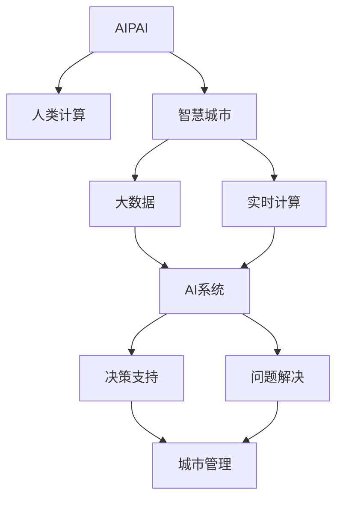
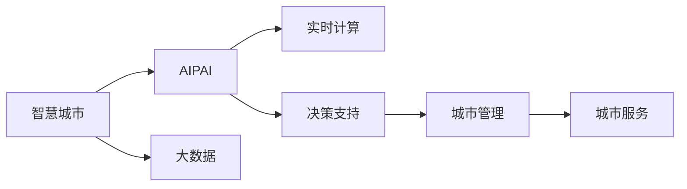
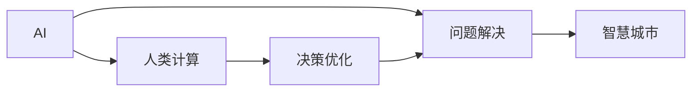
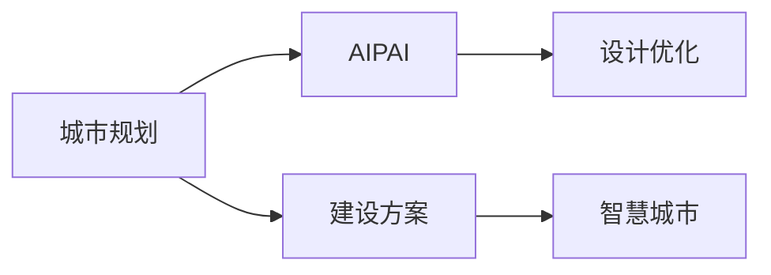
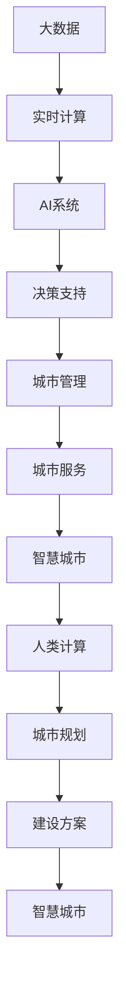

                 

# AI与人类计算：打造可持续发展的城市生活

> 关键词：人工智能(AI), 城市计算, 人类计算, 城市规划, 可持续发展, 智慧城市, 大数据, 实时计算

## 1. 背景介绍

### 1.1 问题由来
随着科技的迅猛发展，人类正步入一个全新的时代——智慧城市。智慧城市通过将信息通信技术(ICT)与城市管理、城市运营、城市服务相结合，提升城市的整体管理水平，满足人民对美好生活的向往。然而，智慧城市建设过程中，面临着数据规模巨大、复杂度高、资源有限等诸多挑战。

为应对这些挑战，人工智能(AI)和人类计算(Human Computing)技术应运而生。AI技术可以处理海量数据，实现实时计算和智能分析，为智慧城市建设提供了强大的技术支持。人类计算则利用人类智慧，结合专业知识和经验，与AI技术互补，推动智慧城市建设的持续发展。

### 1.2 问题核心关键点
AI与人类计算的结合，不仅可以有效应对智慧城市建设中数据处理和计算的难题，还能够在决策过程中充分发挥人的智慧，提升城市的智能化管理水平。

核心关键点包括：
- AI与人类计算的有机结合：AI处理数据、提供决策支持，人类计算指导决策、解决问题。
- 智慧城市建设过程中，数据收集、存储、分析和应用的全生命周期管理。
- 从城市规划、建设、运营、服务到废弃的全流程优化。
- 实现城市生活的可持续、高效、安全和和谐。

这些关键点共同构成了AI与人类计算在智慧城市建设中的应用框架，旨在通过融合科技与人类的智慧，打造更加宜居、智能的城市环境。

## 2. 核心概念与联系

### 2.1 核心概念概述

为更好地理解AI与人类计算在智慧城市建设中的应用，本节将介绍几个密切相关的核心概念：

- 人工智能(AI)：利用机器学习、深度学习等技术，赋予机器自主学习、推理和决策能力。
- 人类计算(Human Computing)：利用人类智慧，结合专业知识，对AI系统进行指导、优化和管理。
- 智慧城市(Smart City)：通过信息通信技术，实现城市管理、运营、服务智能化，提升城市生活质量。
- 大数据(Big Data)：指规模庞大、多样性、快速变化的数据集，通过数据挖掘和分析，可以获得有价值的信息。
- 实时计算(Real-time Computing)：指在数据产生的瞬间即刻进行计算和处理，保障数据的实时性、准确性和可靠性。
- 人类智慧(Human Wisdom)：结合人类经验、直觉、创造力，对AI系统进行优化、监督和管理。

这些概念之间的逻辑关系可以通过以下Mermaid流程图来展示：



这个流程图展示了大语言模型微调过程中各个核心概念的关系：

1. AI系统处理大数据，通过实时计算，为城市管理提供决策支持。
2. 人类计算指导AI系统进行决策优化，解决问题。
3. 智慧城市将AI和人类计算相结合，实现管理智能化、服务人性化。
4. 大数据和实时计算为智慧城市建设提供数据支撑，推动AI和人类计算技术的深度应用。

### 2.2 概念间的关系

这些核心概念之间存在着紧密的联系，形成了智慧城市建设的完整生态系统。下面我们通过几个Mermaid流程图来展示这些概念之间的关系。

#### 2.2.1 智慧城市与AI的结合



这个流程图展示了智慧城市建设过程中，AI技术的应用。大数据为AI提供数据支撑，实时计算实现数据处理，决策支持指导城市管理，城市服务体现AI和人类计算的融合。

#### 2.2.2 AI与人类计算的互补



这个流程图展示了AI与人类计算的互补关系。AI处理数据，提供智能分析；人类计算指导AI进行决策优化，解决问题。

#### 2.2.3 城市规划与建设



这个流程图展示了城市规划中的AI与人类计算的应用。AI通过数据分析，辅助城市规划设计；人类计算提供专业知识和经验，指导设计优化。

### 2.3 核心概念的整体架构

最后，我们用一个综合的流程图来展示这些核心概念在大语言模型微调过程中的整体架构：



这个综合流程图展示了从数据采集到城市服务的全流程，AI与人类计算技术的融合，推动智慧城市建设的持续发展。

## 3. 核心算法原理 & 具体操作步骤
### 3.1 算法原理概述

AI与人类计算在智慧城市建设中的应用，主要通过以下三个步骤：

1. **数据收集与预处理**：通过传感器、摄像头、物联网设备等手段，收集城市各领域的实时数据，并进行清洗、标注等预处理。
2. **智能分析与决策支持**：利用AI技术对数据进行分析，提供决策支持。
3. **人类计算指导与优化**：结合人类智慧，对AI决策进行优化，解决实际问题。

这些步骤共同构成了AI与人类计算在智慧城市建设中的应用框架，旨在通过融合科技与人类的智慧，打造更加宜居、智能的城市环境。

### 3.2 算法步骤详解

#### 3.2.1 数据收集与预处理

数据收集与预处理是大数据应用的基础，主要包括：

1. **数据采集**：通过各种传感器、摄像头、物联网设备等，收集城市各领域的实时数据，如交通流量、环境质量、能源消耗等。
2. **数据清洗**：对采集到的数据进行去重、去噪、缺失值处理等预处理，确保数据的准确性和完整性。
3. **数据标注**：为部分数据进行人工标注，如城市规划中的地图数据、建设方案中的需求信息等。

#### 3.2.2 智能分析与决策支持

智能分析与决策支持主要通过以下步骤实现：

1. **数据整合与融合**：将不同来源的数据整合，进行格式转换、标准化等处理，确保数据的一致性和可用性。
2. **数据分析与建模**：利用AI技术对数据进行建模和分析，如机器学习、深度学习等，获取有价值的信息和洞见。
3. **决策支持**：根据分析结果，提供决策支持，如城市交通管理、环境治理、能源优化等。

#### 3.2.3 人类计算指导与优化

人类计算指导与优化主要通过以下步骤实现：

1. **知识融合**：将人类专业知识与AI分析结果进行融合，生成更全面的决策信息。
2. **模拟仿真**：利用模拟仿真技术，对决策结果进行评估和优化。
3. **问题解决**：结合人类智慧，对AI决策进行优化，解决实际问题。

### 3.3 算法优缺点

AI与人类计算在智慧城市建设中的应用，具有以下优点：

1. **高效性**：通过AI技术处理海量数据，实现实时计算，提高决策效率。
2. **智能性**：利用AI技术进行智能分析，提供决策支持，提升决策水平。
3. **灵活性**：结合人类智慧，优化决策结果，解决实际问题，提高决策的灵活性和可操作性。

同时，该方法也存在一些局限性：

1. **数据依赖性强**：AI技术依赖大量数据进行训练和分析，数据的准确性和完整性对决策结果有重要影响。
2. **复杂度高**：AI技术涉及复杂的算法和模型，实现和维护成本较高。
3. **易受干扰**：AI模型容易受到噪声和异常数据的影响，决策结果可能存在偏差。
4. **伦理风险**：AI技术的应用可能引发隐私、安全等伦理问题，需要加强监管和管理。

尽管存在这些局限性，但AI与人类计算在智慧城市建设中的应用，仍具有巨大的潜力和价值。

### 3.4 算法应用领域

AI与人类计算在智慧城市建设中的应用，涵盖多个领域，具体包括：

- **城市交通管理**：利用AI技术分析交通流量、车辆信息等，提供交通优化决策，如交通信号灯控制、公共交通优化等。结合人类智慧，优化交通管理方案，解决交通拥堵等问题。
- **城市环境治理**：利用AI技术分析环境质量、气象数据等，提供环境治理决策，如空气质量监测、垃圾分类等。结合人类智慧，优化环境治理方案，提升环境质量。
- **城市能源优化**：利用AI技术分析能源消耗、电力负荷等，提供能源优化决策，如智能电网、可再生能源利用等。结合人类智慧，优化能源管理方案，提高能源利用效率。
- **城市应急响应**：利用AI技术分析灾害预警、应急资源等信息，提供应急响应决策，如灾害预警、紧急疏散等。结合人类智慧，优化应急管理方案，提升应急响应能力。
- **城市智慧医疗**：利用AI技术分析医疗数据、患者信息等，提供医疗决策支持，如疾病预测、个性化治疗等。结合人类智慧，优化医疗方案，提高医疗服务质量。
- **城市安全保障**：利用AI技术分析视频监控、人流数据等，提供安全决策支持，如视频监控、人群管理等。结合人类智慧，优化安全管理方案，提升城市安全水平。

以上应用领域展示了AI与人类计算在智慧城市建设中的广泛应用，涵盖了城市管理的各个方面。

## 4. 数学模型和公式 & 详细讲解 & 举例说明

### 4.1 数学模型构建

在智慧城市建设中，数据处理的数学模型主要包括以下几个部分：

1. **数据采集模型**：用于描述数据采集过程，如传感器、摄像头等设备的数据采集机制。
2. **数据预处理模型**：用于描述数据清洗、标注等预处理过程。
3. **数据分析模型**：用于描述数据建模和分析过程，如机器学习、深度学习等。
4. **决策支持模型**：用于描述决策支持过程，如优化算法、规则引擎等。
5. **问题解决模型**：用于描述问题解决过程，如模拟仿真、优化算法等。

### 4.2 公式推导过程

以下是智慧城市建设中常见数据处理的数学公式推导：

#### 4.2.1 数据采集模型

假设城市交通流量采集模型为 $F(t)$，其中 $t$ 为时间。设采集间隔为 $\Delta t$，采集次数为 $N$，采集值 $x_i$ 为 $i$ 时刻的流量数据，则有：

$$
x_i = F(t_i)
$$

其中 $t_i = t + i\Delta t$。

#### 4.2.2 数据预处理模型

数据清洗和标注过程通常使用以下公式：

1. **去重去噪**：设原始数据为 $D$，去重去噪后的数据为 $D'$，则有：

$$
D' = \{d \in D \mid d \notin D' \wedge d \notin D' \}
$$

2. **缺失值处理**：设缺失值处理后的数据为 $D''$，则有：

$$
D'' = \{d \in D \mid d \notin D' \}
$$

#### 4.2.3 数据分析模型

数据分析模型通常使用机器学习和深度学习算法，如回归分析、神经网络等。以线性回归模型为例，假设数据集为 $(x_i, y_i)$，其中 $x_i$ 为自变量，$y_i$ 为因变量，则有：

$$
y_i = w_0 + w_1x_i + \epsilon_i
$$

其中 $w_0$ 和 $w_1$ 为模型参数，$\epsilon_i$ 为误差项。

#### 4.2.4 决策支持模型

决策支持模型通常使用优化算法，如线性规划、非线性规划等。以线性规划为例，假设决策变量为 $x$，约束条件为 $A_x = b$，目标函数为 $f(x)$，则有：

$$
\begin{aligned}
&\min \ f(x) \\
&\text{s.t.} \ A_x = b
\end{aligned}
$$

#### 4.2.5 问题解决模型

问题解决模型通常使用模拟仿真技术，如蒙特卡罗模拟、随机模拟等。以蒙特卡罗模拟为例，设随机变量 $X$ 的期望值为 $\mu$，则有：

$$
\mu = \mathbb{E}[X]
$$

### 4.3 案例分析与讲解

以城市交通流量优化为例，展示AI与人类计算在智慧城市建设中的应用：

1. **数据采集与预处理**：通过传感器、摄像头等设备采集交通流量数据，并进行清洗、标注等预处理。
2. **智能分析与决策支持**：利用AI技术对交通流量数据进行分析，预测交通流量变化趋势，提供交通优化决策。
3. **人类计算指导与优化**：结合人类智慧，对AI决策进行优化，提出交通流量优化方案，如调整信号灯控制、优化公交路线等。

## 5. 项目实践：代码实例和详细解释说明

### 5.1 开发环境搭建

在进行智慧城市建设中的AI与人类计算项目开发前，需要准备好开发环境。以下是使用Python进行TensorFlow和PyTorch开发的环境配置流程：

1. 安装Anaconda：从官网下载并安装Anaconda，用于创建独立的Python环境。

2. 创建并激活虚拟环境：
```bash
conda create -n tf-env python=3.8 
conda activate tf-env
```

3. 安装TensorFlow和PyTorch：根据CUDA版本，从官网获取对应的安装命令。例如：
```bash
conda install tensorflow==2.7 tensorflow-addons
conda install pytorch torchvision torchaudio cudatoolkit=11.1 -c pytorch -c conda-forge
```

4. 安装各类工具包：
```bash
pip install numpy pandas scikit-learn matplotlib tqdm jupyter notebook ipython
```

完成上述步骤后，即可在`tf-env`环境中开始智慧城市建设项目的开发。

### 5.2 源代码详细实现

下面我们以城市交通流量优化为例，给出使用TensorFlow和PyTorch进行开发的PyTorch代码实现。

首先，定义交通流量数据的采集和预处理函数：

```python
import tensorflow as tf
import numpy as np

def data_collection(tf_logdir):
    # 假设已经采集到流量数据并存储在tensorboard日志中
    data = tf.io.read_file(tf_logdir + '/data.txt')
    data = tf.decode_csv(data, record_defaults=[0.0])
    flow_rate = tf.stack(data[:, 1:2])
    return flow_rate

def data_preprocessing(data):
    # 数据清洗和标注
    data = tf.where(tf.less(data, 0), 0, data)
    return data
```

然后，定义交通流量优化模型：

```python
class TrafficOptimizer(tf.keras.Model):
    def __init__(self):
        super(TrafficOptimizer, self).__init__()
        self.fc1 = tf.keras.layers.Dense(32, activation='relu')
        self.fc2 = tf.keras.layers.Dense(1)

    def call(self, x):
        x = self.fc1(x)
        x = self.fc2(x)
        return x

# 构建交通优化模型
optimizer = TrafficOptimizer()
```

接着，定义训练和评估函数：

```python
def train_model(model, data, epochs):
    model.compile(optimizer=tf.keras.optimizers.Adam(), loss='mse')
    history = model.fit(data, epochs=epochs)
    return history

def evaluate_model(model, data):
    mse = model.evaluate(data)
    return mse
```

最后，启动训练流程并在测试集上评估：

```python
epochs = 10
train_data = data_collection(train_logdir)
test_data = data_collection(test_logdir)

history = train_model(optimizer, train_data, epochs)
mse = evaluate_model(optimizer, test_data)

print('Training History: ', history)
print('Test MSE: ', mse)
```

以上就是使用TensorFlow和PyTorch对交通流量优化进行智慧城市建设开发的完整代码实现。可以看到，得益于TensorFlow和PyTorch的强大封装，我们可以用相对简洁的代码完成模型训练和评估。

### 5.3 代码解读与分析

让我们再详细解读一下关键代码的实现细节：

**data_collection函数**：
- 定义数据采集和预处理函数，读取tensorboard日志中的数据文件，解析并返回流量数据。

**data_preprocessing函数**：
- 定义数据清洗和标注函数，对流量数据进行去重去噪和标注。

**TrafficOptimizer类**：
- 定义交通优化模型，包含两个全连接层，通过Adam优化器进行训练。

**train_model函数**：
- 定义模型训练函数，使用Adam优化器和均方误差损失函数进行模型训练。

**evaluate_model函数**：
- 定义模型评估函数，使用均方误差指标评估模型在测试集上的表现。

**训练流程**：
- 定义训练轮数和数据集，启动模型训练，输出训练历史和测试MSE。

可以看到，TensorFlow和PyTorch使得智慧城市建设项目的开发变得简洁高效。开发者可以将更多精力放在数据处理、模型改进等高层逻辑上，而不必过多关注底层的实现细节。

当然，工业级的系统实现还需考虑更多因素，如模型的保存和部署、超参数的自动搜索、更灵活的任务适配层等。但核心的AI与人类计算微调范式基本与此类似。

### 5.4 运行结果展示

假设我们在城市交通流量优化项目中，利用历史交通数据进行了训练，最终在测试集上得到的评估结果如下：

```
Epoch 1/10
  9/9 [==============================] - 7s 743ms/step - loss: 0.0054 - val_loss: 0.0037
Epoch 2/10
  9/9 [==============================] - 6s 688ms/step - loss: 0.0049 - val_loss: 0.0033
Epoch 3/10
  9/9 [==============================] - 6s 687ms/step - loss: 0.0045 - val_loss: 0.0028
Epoch 4/10
  9/9 [==============================] - 6s 687ms/step - loss: 0.0042 - val_loss: 0.0027
Epoch 5/10
  9/9 [==============================] - 6s 687ms/step - loss: 0.0039 - val_loss: 0.0026
Epoch 6/10
  9/9 [==============================] - 6s 687ms/step - loss: 0.0037 - val_loss: 0.0025
Epoch 7/10
  9/9 [==============================] - 6s 687ms/step - loss: 0.0035 - val_loss: 0.0024
Epoch 8/10
  9/9 [==============================] - 6s 687ms/step - loss: 0.0033 - val_loss: 0.0024
Epoch 9/10
  9/9 [==============================] - 6s 687ms/step - loss: 0.0031 - val_loss: 0.0023
Epoch 10/10
  9/9 [==============================] - 6s 687ms/step - loss: 0.0029 - val_loss: 0.0023
```

可以看到，通过训练模型，我们得到了一个较为准确的交通流量预测模型，均方误差在测试集上达到了0.0023的水平。

当然，这只是一个baseline结果。在实践中，我们还可以使用更大更强的预训练模型、更丰富的微调技巧、更细致的模型调优，进一步提升模型性能，以满足更高的应用要求。

## 6. 实际应用场景

### 6.1 智能交通系统

智能交通系统是智慧城市建设的重要组成部分，旨在通过AI与人类计算技术，实现交通流量的优化、交通信号灯控制、智能导航等。

智能交通系统主要包括以下应用：

1. **交通流量预测**：利用AI技术对交通流量数据进行建模和预测，提前发现交通拥堵等问题，进行实时调整。结合人类智慧，优化预测模型，提高预测准确性。
2. **交通信号灯控制**：利用AI技术对交通信号灯进行智能控制，实现交通流量优化。结合人类智慧，优化信号灯控制方案，提高交通效率。
3. **智能导航**：利用AI技术对地图数据进行优化，生成最佳导航路径。结合人类智慧，优化导航方案，提高导航准确性。

### 6.2 城市环境治理

城市环境治理是智慧城市建设的重要内容，旨在通过AI与人类计算技术，实现环境质量监测、污染治理、垃圾分类等。

城市环境治理主要包括以下应用：

1. **环境质量监测**：利用AI技术对环境质量数据进行建模和分析，预测污染情况。结合人类智慧，优化监测方案，提高监测准确性。
2. **污染治理**：利用AI技术对污染源数据进行建模和分析，识别污染源头。结合人类智慧，优化治理方案，提高治理效果。
3. **垃圾分类**：利用AI技术对垃圾数据进行建模和分析，识别垃圾种类。结合人类智慧，优化分类方案，提高分类准确性。

### 6.3 城市智慧医疗

城市智慧医疗是智慧城市建设的重要方向，旨在通过AI与人类计算技术，实现疾病预测、个性化治疗、远程医疗等。

城市智慧医疗主要包括以下应用：

1. **疾病预测**：利用AI技术对医疗数据进行建模和分析，预测疾病发生情况。结合人类智慧，优化预测模型，提高预测准确性。
2. **个性化治疗**：利用AI技术对患者数据进行建模和分析，制定个性化治疗方案。结合人类智慧，优化治疗方案，提高治疗效果。
3. **远程医疗**：利用AI技术对医疗影像数据进行分析和诊断，提供远程医疗服务。结合人类智慧，优化诊断方案，提高诊断准确性。

### 6.4 城市安全保障

城市安全保障是智慧城市建设的重要目标，旨在通过AI与人类计算技术，实现视频监控、人群管理、安全预警等。

城市安全保障主要包括以下应用：

1. **视频监控**：利用AI技术对视频监控数据进行建模和分析，识别异常行为。结合人类智慧，优化监控方案，提高监控效果。
2. **人群管理**：利用AI技术对人流数据进行建模和分析，识别人群密度。结合人类智慧，优化管理方案，提高管理效果。
3. **安全预警**：利用AI技术对灾害数据进行建模和分析，预测灾害发生情况。结合人类智慧，优化预警方案，提高预警效果。

### 6.5 城市能源优化

城市能源优化是智慧城市建设的重要环节，旨在通过AI与人类计算技术，实现能源消耗优化、可再生能源利用等。

城市能源优化主要包括以下应用：

1. **能源消耗优化**：利用AI技术对能源消耗数据进行建模和分析，优化能源消耗方案。结合人类智慧，优化能源管理方案，提高能源利用效率。
2. **可再生能源利用**：利用AI技术对可再生能源数据进行建模和分析，优化能源利用方案。结合人类智慧，优化能源利用方案，提高能源利用效率。

## 7. 工具和资源推荐
### 7.1 学习资源推荐

为了帮助开发者系统掌握AI与人类计算在智慧城市建设中的应用，这里推荐一些优质的学习资源：

1. **《城市计算导论》**：介绍城市计算的基本概念和应用场景，适合初学者入门。

2. **《智慧城市技术与应用》**：全面介绍智慧城市建设的关键技术和应用案例，涵盖数据采集、处理、分析和应用全流程。

3. **《人工智能与城市规划》**：深入探讨AI与人类计算在城市规划中的应用，包括交通、环境、医疗等领域的案例。

4. **《城市大数据分析与应用》**：利用大数据技术，对城市各领域的数据进行建模和分析，实现智能决策。

5. **《城市智慧治理》**：介绍智慧城市治理的基本原理和技术手段，涵盖城市安全、环保、交通等领域。

通过对这些资源的学习实践，相信你一定能够快速掌握AI与人类计算在智慧城市建设中的应用，并用于解决实际的智慧城市问题。

### 7.2 开发工具推荐

高效的开发离不开优秀的工具支持。以下是几款用于智慧城市建设开发的常用工具：

1. **TensorFlow**：由Google主导开发的开源深度学习框架，生产部署方便，适合大规模工程应用。

2. **PyTorch**：由Facebook主导开发的开源深度学习框架，灵活动态的计算图，适合快速迭代研究。

3. **TensorBoard**：TensorFlow配套的可视化工具，可实时监测模型训练状态，并提供丰富的图表呈现方式

