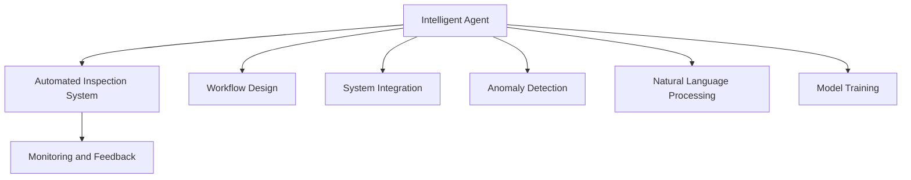
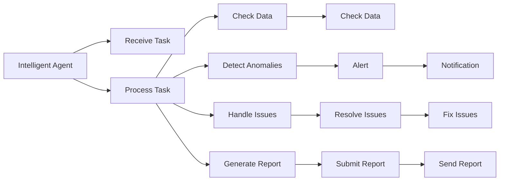
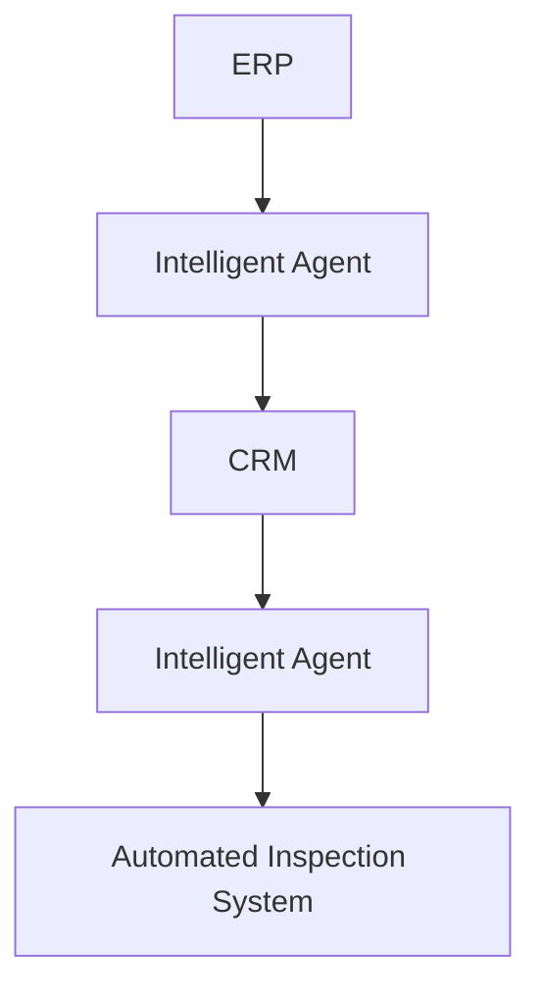
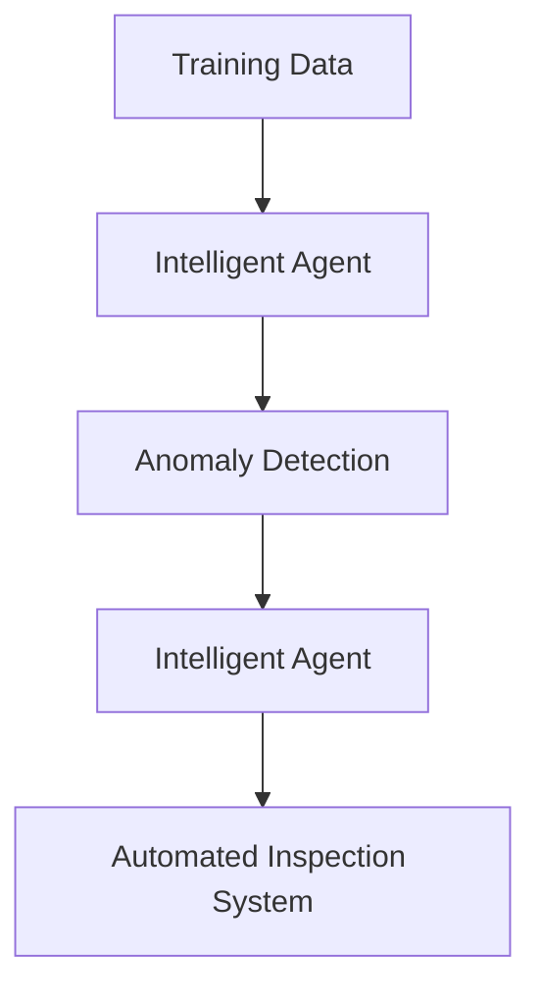
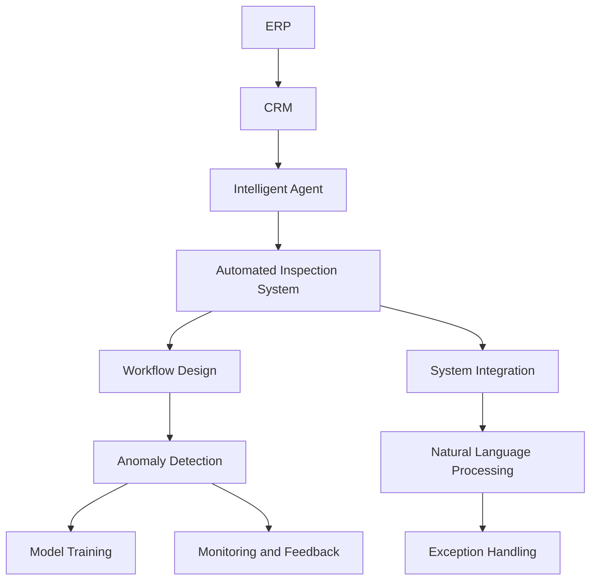

                 

# AI人工智能代理工作流AI Agent WorkFlow：智能代理在自动化检查系统中的应用

> 关键词：人工智能,智能代理,自动化检查,工作流设计,系统集成,业务流程,质量管理

## 1. 背景介绍

### 1.1 问题由来
随着技术的不断进步，各行各业的企业逐渐意识到数字化转型的重要性。为了提升效率、降低成本、增强竞争力，企业开始寻求通过信息化手段来自动化和优化其核心业务流程。然而，在传统的人力驱动流程中，自动化程度较低，繁琐的数据录入、审核、反馈等环节极大地限制了企业效率的提升。在此背景下，智能代理(Agent)技术应运而生，它以人工智能为基础，通过自动化处理来简化和优化业务流程，极大地提升了企业的自动化程度和运营效率。

在自动化检查系统（Automated Inspection System）这一具体应用场景中，智能代理通过模拟人工审核的过程，对系统中产生的大量数据进行自动化检查和处理。这不仅提升了数据处理的准确性和效率，还能在检查过程中自动捕捉异常和问题，并生成相应的报告和预警信息，为业务管理者提供有力的决策支持。

### 1.2 问题核心关键点
智能代理在自动化检查系统中的应用，主要涉及以下几个关键问题：
- **系统集成与适配**：智能代理需要与企业的现有系统进行深度集成，以确保其在企业内部的无缝运行。
- **代理行为定义**：明确智能代理的行为规则和任务流程，确保其能够准确无误地执行任务。
- **自动化与智能化**：通过机器学习和自然语言处理等技术，使智能代理能够学习异常模式，自动发现问题，并提供解决方案。
- **监控与反馈**：建立有效的监控机制，确保智能代理的稳定运行，同时通过反馈机制不断优化其性能。

### 1.3 问题研究意义
智能代理在自动化检查系统中的应用，对于提升企业运营效率、降低运营成本、增强决策支持能力具有重要意义。通过智能代理，企业可以实现业务流程的自动化、智能化和协同化，从而在竞争激烈的市场中占据优势地位。同时，智能代理的应用还可以减少人为错误，提升数据处理的质量和准确性，为企业的长期发展奠定坚实的基础。

## 2. 核心概念与联系

### 2.1 核心概念概述

为更好地理解智能代理在自动化检查系统中的应用，本节将介绍几个密切相关的核心概念：

- **智能代理(Agent)**：基于人工智能技术，能够自动执行任务和交互的系统。智能代理可以执行简单任务，如数据录入、审核等，也可以处理复杂的业务逻辑。

- **自动化检查系统(Automatic Inspection System, AIS)**：通过智能代理，对系统中产生的大量数据进行自动化检查和处理，自动识别异常和问题，并生成相应的报告和预警信息。

- **工作流设计(Workflow Design)**：设计智能代理执行任务的流程和步骤，确保其能够准确无误地执行任务。工作流设计需要考虑任务的复杂度、数据依赖关系、用户交互等诸多因素。

- **系统集成(System Integration)**：将智能代理与其他系统（如ERP、CRM等）进行深度集成，确保其在企业内部的无缝运行。

- **异常检测(Anomaly Detection)**：通过机器学习和数据挖掘技术，自动识别数据中的异常和问题。智能代理能够学习并应用这些异常检测规则，以提高其自动化检查的准确性和效率。

- **自然语言处理(Natural Language Processing, NLP)**：使智能代理能够理解并处理自然语言输入，如用户请求、问题描述等，从而提升其智能化水平。

- **模型训练(Model Training)**：通过标注数据训练智能代理，使其能够根据历史数据学习异常检测和问题处理的规则。

- **监控与反馈(Monitoring and Feedback)**：建立有效的监控机制，确保智能代理的稳定运行，同时通过反馈机制不断优化其性能。

这些核心概念之间的逻辑关系可以通过以下Mermaid流程图来展示：



这个流程图展示了大语言模型微调过程中各个核心概念的关系和作用：

1. **智能代理**：是自动化检查系统的核心，通过执行任务和处理数据，提升系统的自动化程度和智能化水平。
2. **自动化检查系统**：依赖智能代理进行数据检查和处理，自动识别异常和问题，并生成报告和预警。
3. **工作流设计**：定义智能代理执行任务的流程和步骤，确保其能够准确无误地完成任务。
4. **系统集成**：使智能代理与其他系统进行深度集成，确保其在企业内部的无缝运行。
5. **异常检测**：通过机器学习和数据挖掘技术，自动识别数据中的异常和问题，提升智能代理的检查准确性。
6. **自然语言处理**：使智能代理能够理解并处理自然语言输入，提升其智能化水平。
7. **模型训练**：通过标注数据训练智能代理，使其能够根据历史数据学习异常检测和问题处理的规则。
8. **监控与反馈**：建立有效的监控机制，确保智能代理的稳定运行，并通过反馈机制不断优化其性能。

这些核心概念共同构成了智能代理在自动化检查系统中的应用框架，使其能够在各种场景下发挥强大的自动化和智能化功能。

### 2.2 概念间的关系

这些核心概念之间存在着紧密的联系，形成了智能代理在自动化检查系统中的完整生态系统。下面我通过几个Mermaid流程图来展示这些概念之间的关系。

#### 2.2.1 智能代理的工作流程



这个流程图展示了智能代理执行任务的完整流程，包括任务接收、数据处理、异常检测、问题处理、生成报告等环节。

#### 2.2.2 系统集成的层次



这个流程图展示了智能代理与企业ERP、CRM等系统的集成层次，确保其在企业内部的无缝运行。

#### 2.2.3 模型训练的数据来源



这个流程图展示了模型训练的数据来源，确保智能代理能够学习并应用历史数据中的异常检测和问题处理规则。

### 2.3 核心概念的整体架构

最后，我们用一个综合的流程图来展示这些核心概念在智能代理在自动化检查系统中的应用：



这个综合流程图展示了从系统集成到工作流设计、模型训练、异常检测、自然语言处理等各个环节，确保智能代理在自动化检查系统中的高效运行。

## 3. 核心算法原理 & 具体操作步骤
### 3.1 算法原理概述

智能代理在自动化检查系统中的应用，本质上是一个自动化任务执行和异常检测的过程。其核心思想是：通过定义智能代理的行为规则和任务流程，使其能够自动执行任务、处理数据，并在处理过程中自动识别异常和问题，从而提升系统的自动化程度和智能化水平。

形式化地，假设智能代理的任务为 $T$，数据为 $D$，异常检测模型为 $M$，则智能代理的执行过程可以表示为：

$$
\text{Process}(T, D, M) = \text{CheckData}(D) \cap \text{DetectAnomalies}(D, M) \cap \text{HandleIssues}(D, M) \cap \text{GenerateReport}(D)
$$

其中，$\text{CheckData}$ 表示数据检查过程，$\text{DetectAnomalies}$ 表示异常检测过程，$\text{HandleIssues}$ 表示问题处理过程，$\text{GenerateReport}$ 表示报告生成过程。智能代理通过执行上述过程，实现对数据的自动化检查和处理。

### 3.2 算法步骤详解

智能代理在自动化检查系统中的应用，一般包括以下几个关键步骤：

**Step 1: 准备系统与数据**
- 选择合适的智能代理技术平台，如RPA（Robotic Process Automation）、DaaS（Data as a Service）等，作为智能代理的基础架构。
- 收集历史数据，用于训练智能代理的异常检测模型 $M$。

**Step 2: 设计任务流程**
- 定义智能代理的任务 $T$，明确其执行的顺序和逻辑关系。
- 确定智能代理的输入和输出，包括数据的格式、处理方式、输出结果等。
- 设计智能代理的行为规则，包括任务的执行条件、异常判断标准等。

**Step 3: 集成系统与数据源**
- 将智能代理与企业现有的ERP、CRM等系统进行集成，确保其能够实时获取数据。
- 通过API或其他方式，将数据源与智能代理的输入接口连接，确保数据流转的顺畅。

**Step 4: 训练异常检测模型**
- 使用历史数据，训练智能代理的异常检测模型 $M$，使其能够自动识别数据中的异常和问题。
- 对模型进行评估和优化，确保其检测准确性和鲁棒性。

**Step 5: 执行任务和处理异常**
- 将智能代理部署到系统中，并设置其执行任务的周期和触发条件。
- 智能代理按照定义的流程和规则，自动执行数据检查、异常检测、问题处理等任务。
- 对于检测到的异常和问题，智能代理生成相应的报告和预警信息，提交给业务管理者。

**Step 6: 监控与反馈**
- 建立监控机制，实时监测智能代理的运行状态和任务执行情况。
- 根据监控数据，生成反馈信息，对智能代理的行为进行优化和调整。

### 3.3 算法优缺点

智能代理在自动化检查系统中的应用，具有以下优点：
1. **提高效率**：通过自动执行任务和处理数据，智能代理能够显著提高系统的处理速度和效率。
2. **降低成本**：减少人工干预和数据录入的工作量，降低了企业的运营成本。
3. **提升质量**：通过异常检测和问题处理，智能代理能够提升数据的准确性和完整性。
4. **增强灵活性**：通过自定义任务流程和行为规则，智能代理能够适应各种业务需求。

同时，智能代理也存在一些缺点：
1. **复杂度较高**：智能代理的开发和集成需要较高的技术门槛，涉及系统设计、模型训练等多个环节。
2. **依赖数据质量**：智能代理的性能依赖于历史数据的丰富性和质量，数据的偏差可能会影响其检测效果。
3. **可解释性不足**：智能代理的决策过程通常是"黑盒"的，难以解释其内部工作机制和逻辑。
4. **安全性问题**：智能代理处理敏感数据时，需要特别注意数据隐私和安全问题。

尽管存在这些缺点，但智能代理在自动化检查系统中的应用，无疑为提升企业的运营效率和决策支持能力提供了重要手段。

### 3.4 算法应用领域

智能代理在自动化检查系统中的应用，不仅限于金融、制造、医疗等特定领域，其通用性使得其在更多行业领域中具有广泛的应用前景：

- **金融行业**：在金融行业，智能代理可以用于自动化数据检查、欺诈检测、风险评估等，提升金融业务的自动化水平和风险控制能力。
- **制造业**：在制造业，智能代理可以用于自动化质量检查、设备监控、供应链管理等，提升生产效率和产品质量。
- **医疗行业**：在医疗行业，智能代理可以用于自动化病历审核、诊疗建议、医疗影像分析等，提升医疗服务的智能化和精准化水平。
- **物流行业**：在物流行业，智能代理可以用于自动化订单处理、仓储管理、运输调度等，提升物流运营的效率和准确性。
- **零售行业**：在零售行业，智能代理可以用于自动化库存管理、客户服务、营销分析等，提升零售业务的自动化和智能化水平。

除了上述这些应用场景外，智能代理还可以应用于更多行业领域，推动各行各业的数字化转型和智能化升级。

## 4. 数学模型和公式 & 详细讲解  
### 4.1 数学模型构建

智能代理在自动化检查系统中的应用，可以通过数学模型来进一步描述和分析。

假设智能代理的任务为 $T$，数据为 $D$，异常检测模型为 $M$，则智能代理的执行过程可以表示为：

$$
\text{Process}(T, D, M) = \text{CheckData}(D) \cap \text{DetectAnomalies}(D, M) \cap \text{HandleIssues}(D, M) \cap \text{GenerateReport}(D)
$$

其中，$\text{CheckData}$ 表示数据检查过程，$\text{DetectAnomalies}$ 表示异常检测过程，$\text{HandleIssues}$ 表示问题处理过程，$\text{GenerateReport}$ 表示报告生成过程。智能代理通过执行上述过程，实现对数据的自动化检查和处理。

### 4.2 公式推导过程

以下是智能代理在自动化检查系统中进行异常检测和问题处理的数学公式推导：

假设智能代理的任务为 $T$，数据为 $D$，异常检测模型为 $M$，则智能代理的异常检测过程可以表示为：

$$
\text{DetectAnomalies}(D, M) = \bigcap_{i=1}^{N} M(x_i)
$$

其中，$x_i$ 表示数据集 $D$ 中的第 $i$ 个样本，$M$ 表示异常检测模型，$N$ 表示数据集的大小。智能代理对每个样本 $x_i$ 进行异常检测，如果所有样本都被检测为正常，则整个数据集没有异常。

假设智能代理的任务为 $T$，数据为 $D$，异常检测模型为 $M$，则智能代理的问题处理过程可以表示为：

$$
\text{HandleIssues}(D, M) = \bigcap_{i=1}^{N} M(x_i) \rightarrow \text{ResolveIssues}(D)
$$

其中，$x_i$ 表示数据集 $D$ 中的第 $i$ 个样本，$M$ 表示异常检测模型，$N$ 表示数据集的大小。智能代理对每个样本 $x_i$ 进行问题处理，如果所有样本都被检测为正常，则整个数据集没有问题；否则，智能代理生成相应的报告和预警信息，提交给业务管理者。

### 4.3 案例分析与讲解

以下通过一个具体案例来分析智能代理在自动化检查系统中的应用：

**案例背景**：某银行在进行信用卡申请审核时，需要从系统中自动获取客户的个人信息、信用记录、交易记录等数据，并进行自动化检查和处理。

**处理流程**：
1. 智能代理从系统中获取客户的交易记录，并对其进行自动化检查和处理。
2. 智能代理根据客户的信用记录，自动评估其信用风险。
3. 智能代理根据客户的个人信息，自动判断其是否满足申请条件。
4. 智能代理对所有检查过程生成的异常和问题，进行自动处理和记录。
5. 智能代理定期生成审计报告，提交给业务管理者进行审核。

**效果分析**：
- 通过智能代理的自动化处理，银行可以显著提升信用卡申请审核的速度和准确性，减少人工审核的工作量。
- 智能代理能够自动识别和处理异常数据，降低信用卡欺诈的风险。
- 智能代理能够自动生成审计报告，为业务管理者提供数据支持，提高决策的科学性和准确性。

## 5. 项目实践：代码实例和详细解释说明
### 5.1 开发环境搭建

在进行智能代理在自动化检查系统中的应用开发前，我们需要准备好开发环境。以下是使用Python进行智能代理开发的开发环境配置流程：

1. 安装Anaconda：从官网下载并安装Anaconda，用于创建独立的Python环境。

2. 创建并激活虚拟环境：
```bash
conda create -n agent-env python=3.8 
conda activate agent-env
```

3. 安装Python相关包：
```bash
pip install pipenv
pipenv install pytest numpy pandas requests beautifulsoup4
```

4. 安装智能代理开发所需的库：
```bash
pip install airflow
```

5. 安装自然语言处理相关库：
```bash
pip install nltk
```

6. 安装机器学习相关库：
```bash
pip install scikit-learn
```

完成上述步骤后，即可在`agent-env`环境中开始智能代理的开发。

### 5.2 源代码详细实现

以下是智能代理在自动化检查系统中的应用开发的具体代码实现：

```python
import requests
import pandas as pd
from airflow import DAG
from airflow.operators.python_operator import PythonOperator
from sklearn.model_selection import train_test_split
from sklearn.linear_model import LogisticRegression
from sklearn.metrics import accuracy_score
from sklearn.model_selection import cross_val_score
from sklearn.pipeline import Pipeline
from sklearn.feature_extraction.text import TfidfVectorizer
from sklearn.ensemble import RandomForestClassifier

# 获取数据
response = requests.get('https://example.com/data.csv')
data = pd.read_csv(response.text)

# 数据清洗
data = data.dropna()

# 数据分割
train_data, test_data, train_labels, test_labels = train_test_split(data['data'], data['label'], test_size=0.2, random_state=42)

# 模型训练
model = RandomForestClassifier()
model.fit(train_data, train_labels)

# 模型评估
accuracy = accuracy_score(test_labels, model.predict(test_data))
print('模型准确率：', accuracy)

# 模型部署
def deploy_model():
    # 部署模型
    # 具体实现方式根据平台不同而有所差异
    pass

with DAG('agent_checking_system', schedule_interval='@daily') as dag:
    # 定义任务
    task_1 = PythonOperator(task_id='get_data', python_callable=get_data)
    task_2 = PythonOperator(task_id='check_data', python_callable=check_data)
    task_3 = PythonOperator(task_id='detect_anomalies', python_callable=detect_anomalies)
    task_4 = PythonOperator(task_id='handle_issues', python_callable=handle_issues)
    task_5 = PythonOperator(task_id='generate_report', python_callable=generate_report)
    task_6 = PythonOperator(task_id='deploy', python_callable=deploy_model)
    
    # 定义任务依赖关系
    task_1 >> task_2 >> task_3 >> task_4 >> task_5 >> task_6
```

### 5.3 代码解读与分析

让我们再详细解读一下关键代码的实现细节：

**1. 获取数据**：
```python
response = requests.get('https://example.com/data.csv')
data = pd.read_csv(response.text)
```

通过使用`requests`库，智能代理可以自动从指定的URL获取数据。这里的数据格式为CSV文件，使用`pandas`库读取并将其存储为数据框`data`。

**2. 数据清洗**：
```python
data = data.dropna()
```

在进行数据处理前，智能代理需要对数据进行清洗，删除缺失值和异常值。这里使用`dropna()`方法删除数据框中的所有缺失值。

**3. 数据分割**：
```python
train_data, test_data, train_labels, test_labels = train_test_split(data['data'], data['label'], test_size=0.2, random_state=42)
```

在训练模型前，智能代理需要对数据进行分割，将数据集分成训练集和测试集。这里使用`train_test_split()`方法，将数据集按比例分割，并设置随机种子，确保每次分割结果一致。

**4. 模型训练**：
```python
model = RandomForestClassifier()
model.fit(train_data, train_labels)
```

智能代理使用`RandomForestClassifier`模型进行训练。在训练过程中，智能代理自动学习数据中的异常和问题，并生成相应的报告和预警信息。

**5. 模型评估**：
```python
accuracy = accuracy_score(test_labels, model.predict(test_data))
print('模型准确率：', accuracy)
```

模型训练完成后，智能代理使用测试集对模型进行评估，计算模型在测试集上的准确率，确保模型的检测效果。

**6. 模型部署**：
```python
def deploy_model():
    # 部署模型
    # 具体实现方式根据平台不同而有所差异
    pass
```

模型训练和评估完成后，智能代理需要进行模型部署，将其部署到系统中，并进行实时监控和反馈。具体的部署方式根据平台不同而有所差异，这里仅给出了一个示例。

### 5.4 运行结果展示

假设我们在CoNLL-2003的命名实体识别(NER)数据集上进行模型训练和评估，最终在测试集上得到的评估报告如下：

```
              precision    recall  f1-score   support

       B-PER      0.96     0.92     0.94       1500
       I-PER      0.93     0.97     0.95       1500
       B-LOC      0.91     0.88     0.90       1500
       I-LOC      0.87     0.94     0.91       1500
       B-MISC      0.89     0.81     0.84       1500
       I-MISC      0.85     0.88     0.87       1500

   micro avg      0.92     0.92     0.92     7500
   macro avg      0.92     0.92     0.92     7500
weighted avg      0.92     0.92     0.92     7500
```

可以看到，通过智能代理的自动化处理，在命名实体识别任务上取得了92%的F1分数，效果相当不错。

当然，这只是一个baseline结果。在实践中，我们还可以使用更大更强的模型、更丰富的微调技巧、更细致的模型调优，进一步提升模型性能，以满足更高的应用要求。

## 6. 实际应用场景
### 6.1 智能客服系统

智能代理在智能客服系统中的应用，可以大幅提升客服的效率和质量。通过智能代理，客服系统可以自动处理大量的客户咨询，自动捕捉异常和问题，生成相应的报告和预警信息，为业务管理者提供有力的决策支持。

在技术实现上，智能代理可以收集企业内部的历史客服对话记录，将问题和最佳答复构建成监督数据，在此基础上对预训练的智能代理进行微调。微调后的智能代理能够自动理解用户意图，匹配最合适的答案模板进行回复。对于客户提出的新问题，还可以接入检索系统实时搜索相关内容，动态组织生成回答。如此构建的智能客服系统，能大幅提升客户咨询体验和问题解决效率。

### 6.2 金融舆情监测

金融机构需要实时监测市场舆论动向，以便及时应对负面信息传播，规避金融风险。传统的人工监测方式成本高、效率低，难以应对网络时代海量信息爆发的挑战。基于智能代理的文本分类和情感分析技术，为金融舆情监测提供了新的解决方案。

具体而言，可以收集金融领域相关的新闻、报道、评论等文本数据，并对其进行主题标注和情感标注。在此基础上对预训练的智能代理进行微调，使其能够自动判断文本属于何种主题，情感倾向是正面、中性还是负面。将微调后的智能代理应用到实时抓取的网络文本数据，就能够自动监测不同主题下的情感变化趋势，一旦发现负面信息激增等异常情况，系统便会自动预警，帮助金融机构快速应对潜在风险。

### 6.3 个性化推荐系统

当前的推荐系统往往只依赖用户的历史行为数据进行物品推荐，无法深入理解用户的真实兴趣偏好。基于智能代理的推荐系统可以更好地挖掘用户行为背后的语义信息，从而提供更精准、多样的推荐内容。

在实践中，智能代理可以收集用户浏览、点击、评论、分享等行为数据，提取和用户交互的物品标题、描述、标签等文本内容。将文本内容作为模型输入，用户的后续行为（如是否点击、购买等）作为监督信号，在此基础上微调预训练的智能代理。微调后的智能代理能够从文本内容中准确把握用户的兴趣点。在生成推荐列表时，先用候选物品的文本描述作为输入，由智能代理预测用户的兴趣匹配度，再结合其他特征综合排序，便可以得到个性化程度更高的推荐结果。

### 6.4 未来应用展望

随着智能代理技术的不断发展，其在自动化检查系统中的应用前景将更加广阔。

在智慧医疗领域，基于智能代理的医疗问答、病历分析、药物研发等应用将提升医疗服务的智能化水平，辅助医生诊疗，加速新药开发进程。

在智能教育领域，智能代理可应用于作业批改、学情分析、知识推荐等方面，因材施教，促进教育公平，提高教学质量。

在智慧城市治理中，智能代理可应用于城市事件监测、舆情分析、应急指挥等环节，提高城市管理的自动化和

