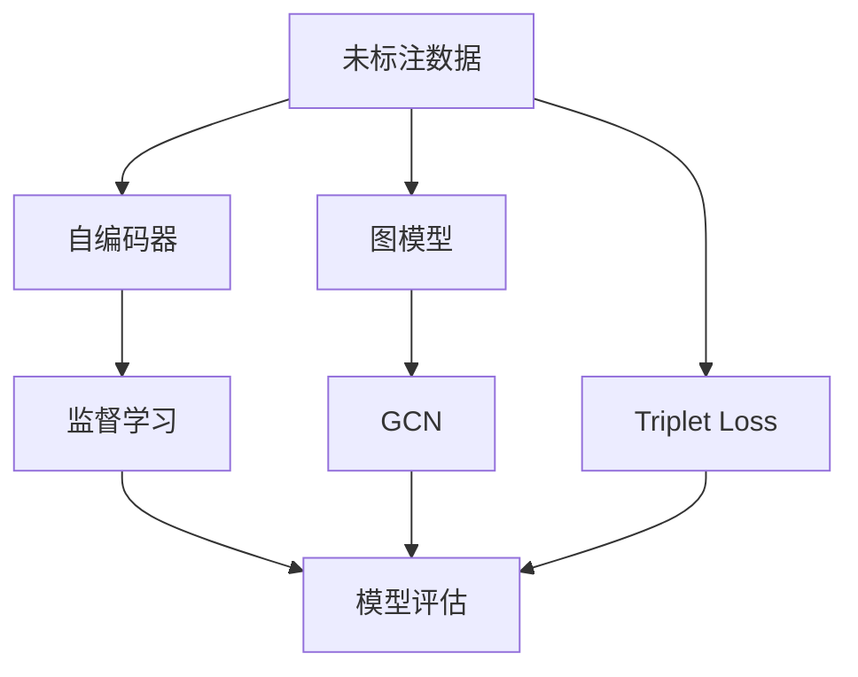
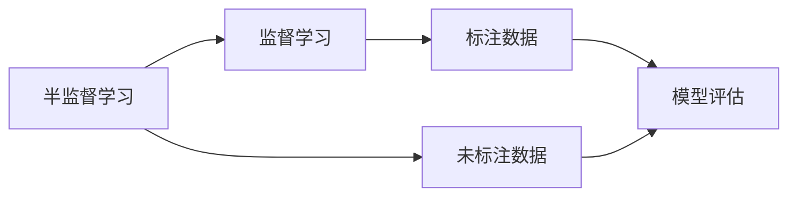
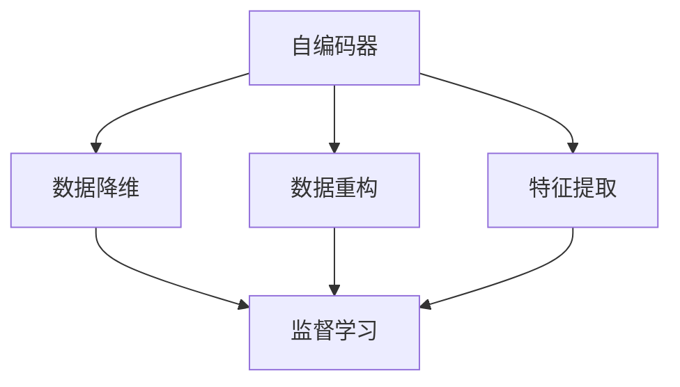
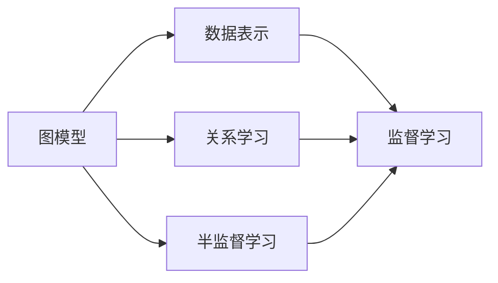
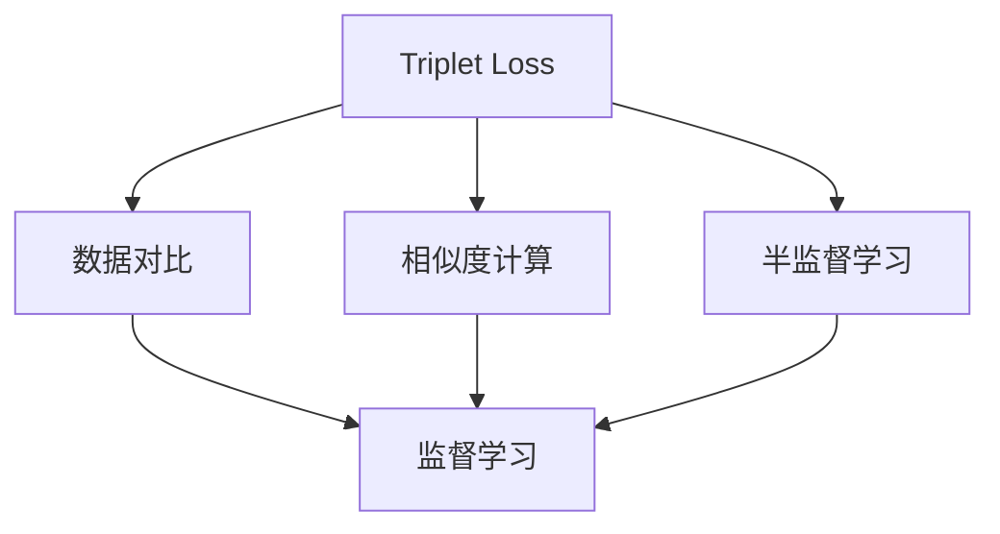
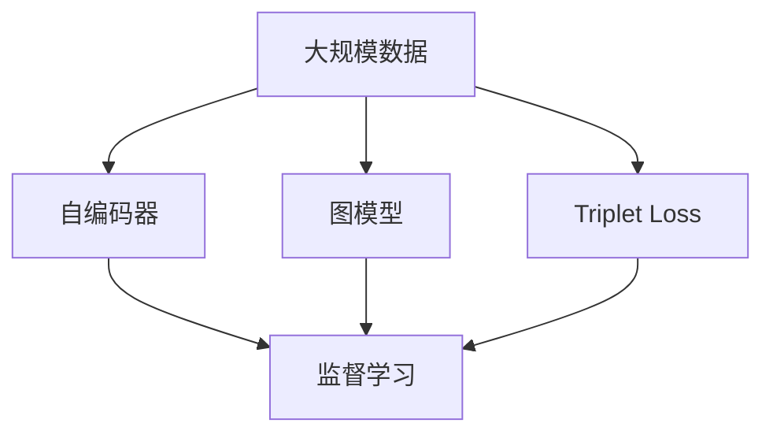

                 

# AI人工智能核心算法原理与代码实例讲解：半监督学习

> 关键词：半监督学习, AI人工智能, 算法原理, 代码实例, 深度学习, 机器学习

## 1. 背景介绍

### 1.1 问题由来
在实际应用中，数据往往具有高度的不确定性和多样性，有时获取大量标注数据极为困难或成本高昂。然而，即便在标注数据不足的情况下，通过充分利用未标注数据，依然可以训练出性能优越的AI模型。这就引出了半监督学习（Semi-supervised Learning）这一重要的学习范式，其允许利用未标注数据与少量标注数据共同训练AI模型，以获得更高的学习效果。

### 1.2 问题核心关键点
半监督学习的核心在于如何高效地利用未标注数据，同时避免过拟合于少量标注数据。现有方法包括：
1. 基于生成模型的半监督学习，如自编码器等。
2. 基于图模型的半监督学习，如GCN等。
3. 基于深度神经网络的半监督学习，如Triplet Loss等。

半监督学习广泛应用于图像识别、文本分类、自然语言处理等领域，特别是在大规模数据环境下，通过未标注数据训练模型，可以大幅提升模型性能。

### 1.3 问题研究意义
半监督学习通过充分利用未标注数据，能够极大地降低对标注数据的依赖，提高模型的泛化能力和数据利用效率。在实际应用中，可以显著减少数据标注成本，加速模型训练和优化，提升模型性能。

半监督学习的研究意义体现在以下几个方面：
1. 降低标注成本：半监督学习利用未标注数据，可以大大减少标注成本，尤其是在数据量巨大的场景中。
2. 提升泛化能力：通过未标注数据的辅助训练，模型对新数据的泛化能力更强，能够更好地适应实际应用。
3. 加速模型开发：半监督学习可以在较短的时间内获得较高精度的模型，加速AI技术的产业化进程。
4. 创新研究方向：半监督学习不仅是一种学习方法，更是一种探索数据与模型之间复杂关系的全新视角，推动了AI技术向更深层次发展。
5. 提升数据利用率：半监督学习能够充分利用未标注数据，提高数据利用效率，促进数据驱动型AI应用的发展。

## 2. 核心概念与联系

### 2.1 核心概念概述

半监督学习是机器学习中的一种重要范式，允许使用未标注数据和少量标注数据进行模型训练。与传统监督学习（supervised learning）不同，半监督学习不依赖大量的标注数据，而是利用未标注数据的丰富信息，提升模型性能。

- 半监督学习（Semi-supervised Learning）：利用未标注数据和少量标注数据进行模型训练，提升模型的泛化能力。
- 自编码器（Autoencoder）：一种生成模型，通过将输入数据压缩为低维表示，然后重构原数据，实现数据的重构和降维。
- 图模型（Graph Model）：利用图结构表示数据之间的关系，通过图卷积网络（GCN）等方法进行半监督学习。
- 三元组损失（Triplet Loss）：一种半监督学习中的损失函数，通过对比样本的相似性来提高模型性能。

这些核心概念之间的逻辑关系可以通过以下Mermaid流程图来展示：



这个流程图展示了大规模数据训练中的半监督学习过程，包括自编码器、图模型和三元组损失等核心概念。未标注数据经过自编码器、图模型和三元组损失的处理，转换成模型输入，与少量标注数据一起用于监督学习模型的训练，最终通过模型评估验证其性能。

### 2.2 概念间的关系

这些核心概念之间存在着紧密的联系，形成了半监督学习的完整生态系统。下面我们通过几个Mermaid流程图来展示这些概念之间的关系。

#### 2.2.1 半监督学习与监督学习的联系



这个流程图展示了半监督学习与监督学习之间的关系。半监督学习使用未标注数据和少量标注数据进行模型训练，而监督学习则只使用标注数据。

#### 2.2.2 自编码器在半监督学习中的应用



这个流程图展示了自编码器在半监督学习中的应用。自编码器通过将输入数据压缩为低维表示，然后重构原数据，实现了数据的降维和特征提取，最终用于监督学习模型的训练。

#### 2.2.3 图模型在半监督学习中的应用



这个流程图展示了图模型在半监督学习中的应用。图模型通过利用图结构表示数据之间的关系，通过GCN等方法进行半监督学习，最终用于监督学习模型的训练。

#### 2.2.4 三元组损失在半监督学习中的应用



这个流程图展示了三元组损失在半监督学习中的应用。三元组损失通过对比样本的相似性来提高模型性能，最终用于监督学习模型的训练。

### 2.3 核心概念的整体架构

最后，我们用一个综合的流程图来展示这些核心概念在大规模数据训练中的整体架构：



这个综合流程图展示了半监督学习在大规模数据训练过程中的整体架构。大规模数据经过自编码器、图模型和三元组损失的处理，转换成模型输入，与少量标注数据一起用于监督学习模型的训练，最终通过模型评估验证其性能。

## 3. 核心算法原理 & 具体操作步骤
### 3.1 算法原理概述

半监督学习的核心在于如何利用未标注数据，提升模型性能。其核心算法包括自编码器、图模型和三元组损失等。

自编码器通过将输入数据压缩为低维表示，然后重构原数据，实现数据的降维和特征提取。在半监督学习中，自编码器可以通过降维后的数据与标注数据结合，提升模型的泛化能力。

图模型通过利用图结构表示数据之间的关系，通过GCN等方法进行半监督学习。图模型通过利用节点之间的相似性和连接关系，提取数据的复杂特征，提升模型的表现。

三元组损失通过对比样本的相似性来提高模型性能。三元组损失包括正样本、负样本和噪声样本，通过最小化正样本与负样本的距离，最大化噪声样本与正样本的距离，提升模型的泛化能力。

### 3.2 算法步骤详解

基于半监督学习的AI模型训练一般包括以下几个关键步骤：

**Step 1: 准备数据集**

- 准备大规模未标注数据集，可以是图像、文本、音频等多种形式。
- 准备少量标注数据集，用于模型训练和验证。

**Step 2: 选择半监督学习算法**

- 选择适合的半监督学习算法，如自编码器、图模型和三元组损失等。
- 设计合适的数据表示方式，如自编码器的编码器和解码器、图模型的节点和边等。

**Step 3: 训练半监督学习模型**

- 利用未标注数据和少量标注数据进行模型训练，最大化模型性能。
- 选择合适的网络结构，如卷积神经网络、循环神经网络、图卷积网络等。
- 选择合适的网络损失函数，如交叉熵损失、均方误差损失、三元组损失等。
- 选择合适的网络优化器，如Adam、SGD等。

**Step 4: 模型评估**

- 在验证集上评估模型性能，通过准确率、召回率、F1分数等指标评估模型效果。
- 利用混淆矩阵等工具分析模型输出，理解模型行为。
- 根据评估结果调整模型参数，优化模型性能。

**Step 5: 应用部署**

- 将训练好的模型应用于实际应用场景，进行数据预测或特征提取。
- 结合具体应用场景，设计合适的输入格式和输出格式。
- 实现模型部署，满足实际应用的需求。

### 3.3 算法优缺点

半监督学习的优点包括：
1. 降低标注成本：半监督学习利用未标注数据，可以大大减少标注成本，尤其是在数据量巨大的场景中。
2. 提升泛化能力：通过未标注数据的辅助训练，模型对新数据的泛化能力更强，能够更好地适应实际应用。
3. 加速模型开发：半监督学习可以在较短的时间内获得较高精度的模型，加速AI技术的产业化进程。
4. 创新研究方向：半监督学习不仅是一种学习方法，更是一种探索数据与模型之间复杂关系的全新视角，推动了AI技术向更深层次发展。

半监督学习的缺点包括：
1. 数据标注质量：标注数据的质量和数量直接影响到模型性能，如果标注数据存在噪声或偏差，会影响模型训练效果。
2. 算法复杂性：半监督学习算法复杂度较高，需要大量的计算资源和时间。
3. 模型泛化：模型对未标注数据的泛化能力可能不足，无法很好地处理新数据。
4. 算法局限性：半监督学习算法具有一定的局限性，对于某些特定领域或数据类型可能效果不佳。

### 3.4 算法应用领域

半监督学习在实际应用中已经被广泛应用于图像识别、文本分类、自然语言处理、推荐系统等多个领域，具体如下：

- 图像识别：利用未标注图像数据，提升图像分类和目标检测模型的性能。
- 文本分类：利用未标注文本数据，提升文本分类模型的性能，特别适用于大规模文本数据的分类任务。
- 自然语言处理：利用未标注文本数据，提升情感分析、命名实体识别、机器翻译等模型的性能。
- 推荐系统：利用未标注用户行为数据，提升推荐系统的推荐准确率和个性化程度。
- 生物信息学：利用未标注生物数据，提升基因分类和蛋白质结构预测模型的性能。

## 4. 数学模型和公式 & 详细讲解 & 举例说明

### 4.1 数学模型构建

在半监督学习中，常见的方法包括自编码器、图模型和三元组损失等。下面以自编码器为例，详细讲解其数学模型构建和公式推导过程。

假设输入数据为 $x$，自编码器的编码器参数为 $\theta_e$，解码器参数为 $\theta_d$。编码器将输入 $x$ 映射到低维表示 $z$，解码器将低维表示 $z$ 映射回原输入 $x'$。自编码器的训练目标是最小化重构误差 $L(x', x)$，即：

$$
L(x', x) = \|x - x'\|^2
$$

其中 $\|.\|$ 表示欧氏距离。

自编码器的编码器和解码器的函数映射分别为 $E(x;\theta_e) = z$ 和 $D(z;\theta_d) = x'$。自编码器的训练目标可以表示为：

$$
\mathcal{L}(\theta_e, \theta_d) = \frac{1}{N}\sum_{i=1}^N L(x'_i, x_i)
$$

其中 $N$ 为训练样本数量。

### 4.2 公式推导过程

以二分类问题为例，详细推导自编码器的数学模型。假设输入数据 $x$ 为二元向量，自编码器的解码器输出为 $x'$，解码器的输出函数为 $D(z;\theta_d) = x'$。自编码器的训练目标可以表示为：

$$
\mathcal{L}(\theta_e, \theta_d) = \frac{1}{N}\sum_{i=1}^N L(x'_i, x_i)
$$

其中 $L(x'_i, x_i)$ 为二分类交叉熵损失函数：

$$
L(x'_i, x_i) = -[y_i\log(x'_i) + (1-y_i)\log(1-x'_i)]
$$

其中 $y_i$ 为二分类标签。

将 $x'_i = D(z_i;\theta_d)$ 代入上式，得到：

$$
\mathcal{L}(\theta_e, \theta_d) = \frac{1}{N}\sum_{i=1}^N -[y_i\log(D(z_i;\theta_d)) + (1-y_i)\log(1-D(z_i;\theta_d))]
$$

将 $z_i = E(x_i;\theta_e)$ 代入上式，得到：

$$
\mathcal{L}(\theta_e, \theta_d) = \frac{1}{N}\sum_{i=1}^N -[y_i\log(D(E(x_i;\theta_e);\theta_d)) + (1-y_i)\log(1-D(E(x_i;\theta_e);\theta_d))]
$$

### 4.3 案例分析与讲解

以手写数字识别为例，详细讲解自编码器在实际应用中的数学模型构建和公式推导过程。假设输入数据为 $x$，自编码器的编码器参数为 $\theta_e$，解码器参数为 $\theta_d$。

自编码器的输入为 $x$，输出为 $x'$。自编码器的编码器将输入 $x$ 映射到低维表示 $z$，解码器将低维表示 $z$ 映射回原输入 $x'$。自编码器的训练目标是最小化重构误差 $L(x', x)$，即：

$$
L(x', x) = \|x - x'\|^2
$$

其中 $\|.\|$ 表示欧氏距离。

自编码器的编码器和解码器的函数映射分别为 $E(x;\theta_e) = z$ 和 $D(z;\theta_d) = x'$。自编码器的训练目标可以表示为：

$$
\mathcal{L}(\theta_e, \theta_d) = \frac{1}{N}\sum_{i=1}^N L(x'_i, x_i)
$$

其中 $N$ 为训练样本数量。

以二分类问题为例，假设输入数据 $x$ 为二元向量，自编码器的解码器输出为 $x'$，解码器的输出函数为 $D(z;\theta_d) = x'$。自编码器的训练目标可以表示为：

$$
\mathcal{L}(\theta_e, \theta_d) = \frac{1}{N}\sum_{i=1}^N L(x'_i, x_i)
$$

其中 $L(x'_i, x_i)$ 为二分类交叉熵损失函数：

$$
L(x'_i, x_i) = -[y_i\log(x'_i) + (1-y_i)\log(1-x'_i)]
$$

其中 $y_i$ 为二分类标签。

将 $x'_i = D(z_i;\theta_d)$ 代入上式，得到：

$$
\mathcal{L}(\theta_e, \theta_d) = \frac{1}{N}\sum_{i=1}^N -[y_i\log(D(z_i;\theta_d)) + (1-y_i)\log(1-D(z_i;\theta_d))]
$$

将 $z_i = E(x_i;\theta_e)$ 代入上式，得到：

$$
\mathcal{L}(\theta_e, \theta_d) = \frac{1}{N}\sum_{i=1}^N -[y_i\log(D(E(x_i;\theta_e);\theta_d)) + (1-y_i)\log(1-D(E(x_i;\theta_e);\theta_d))]
$$

通过上述推导，可以看到自编码器在半监督学习中的数学模型构建和公式推导过程。自编码器通过将输入数据压缩为低维表示，然后重构原数据，实现数据的降维和特征提取，最终用于监督学习模型的训练。

## 5. 项目实践：代码实例和详细解释说明

### 5.1 开发环境搭建

在进行半监督学习项目实践前，我们需要准备好开发环境。以下是使用Python进行PyTorch开发的环境配置流程：

1. 安装Anaconda：从官网下载并安装Anaconda，用于创建独立的Python环境。

2. 创建并激活虚拟环境：
```bash
conda create -n pytorch-env python=3.8 
conda activate pytorch-env
```

3. 安装PyTorch：根据CUDA版本，从官网获取对应的安装命令。例如：
```bash
conda install pytorch torchvision torchaudio cudatoolkit=11.1 -c pytorch -c conda-forge
```

4. 安装Transformers库：
```bash
pip install transformers
```

5. 安装各类工具包：
```bash
pip install numpy pandas scikit-learn matplotlib tqdm jupyter notebook ipython
```

完成上述步骤后，即可在`pytorch-env`环境中开始半监督学习项目实践。

### 5.2 源代码详细实现

这里我们以手写数字识别为例，使用自编码器进行半监督学习训练。具体代码实现如下：

```python
import torch
import torch.nn as nn
import torchvision
import torchvision.transforms as transforms
from torch.utils.data import DataLoader
from torchvision.datasets import MNIST

# 定义自编码器模型
class Autoencoder(nn.Module):
    def __init__(self):
        super(Autoencoder, self).__init__()
        self.encoder = nn.Sequential(
            nn.Conv2d(1, 64, kernel_size=3, stride=2, padding=1),
            nn.ReLU(),
            nn.MaxPool2d(kernel_size=2, stride=2),
            nn.Conv2d(64, 32, kernel_size=3, stride=2, padding=1),
            nn.ReLU(),
            nn.MaxPool2d(kernel_size=2, stride=2),
        )
        self.decoder = nn.Sequential(
            nn.ConvTranspose2d(32, 64, kernel_size=3, stride=2, padding=1),
            nn.ReLU(),
            nn.ConvTranspose2d(64, 1, kernel_size=3, stride=2, padding=1),
            nn.Sigmoid()
        )

    def forward(self, x):
        encoded = self.encoder(x)
        decoded = self.decoder(encoded)
        return encoded, decoded

# 加载数据集
transform = transforms.Compose([
    transforms.ToTensor(),
    transforms.Normalize((0.1307,), (0.3081,))
])
train_dataset = MNIST(root='./data', train=True, transform=transform, download=True)
test_dataset = MNIST(root='./data', train=False, transform=transform, download=True)

# 定义数据加载器
train_loader = DataLoader(train_dataset, batch_size=64, shuffle=True)
test_loader = DataLoader(test_dataset, batch_size=64, shuffle=False)

# 定义模型、优化器和损失函数
model = Autoencoder()
optimizer = torch.optim.Adam(model.parameters(), lr=0.001)
criterion = nn.MSELoss()

# 训练模型
device = torch.device('cuda' if torch.cuda.is_available() else 'cpu')
model.to(device)
for epoch in range(10):
    model.train()
    for data, target in train_loader:
        data, target = data.to(device), target.to(device)
        optimizer.zero_grad()
        encoded, decoded = model(data)
        loss = criterion(decoded, data)
        loss.backward()
        optimizer.step()
    model.eval()
    with torch.no_grad():
        correct = 0
        total = 0
        for data, target in test_loader:
            data, target = data.to(device), target.to(device)
            encoded, decoded = model(data)
            _, predicted = torch.max(decoded.data, 1)
            total += target.size(0)
            correct += (predicted == target).sum().item()
        print('Epoch [{}], Loss: {:.4f}, Accuracy: {:.2f}%'.format(epoch+1, loss.item(), 100 * correct / total))
```

以上就是使用PyTorch实现手写数字识别自编码器的半监督学习项目。可以看到，利用未标注的MNIST数据集和少量标注数据，自编码器可以学习到数据的低维表示，并通过重构误差最小化，提升模型的泛化能力。

### 5.3 代码解读与分析

让我们再详细解读一下关键代码的实现细节：

**定义自编码器模型**

- 定义自编码器的编码器和解码器，分别用于将输入数据压缩为低维表示和将低维表示重构回原数据。
- 使用卷积层和池化层进行特征提取，使用反卷积层进行重构。

**加载数据集**

- 使用PyTorch的数据集加载器加载MNIST数据集，并进行预处理。
- 将数据集分为训练集和测试集，并定义数据加载器。

**定义模型、优化器和损失函数**

- 定义自编码器模型，选择Adam优化器，并定义均方误差损失函数。
- 将模型迁移到GPU或TPU上，加快训练速度。

**训练模型**

- 在训练阶段，使用随机梯度下降法更新模型参数。
- 在每个epoch内，对训练集进行前向传播和反向传播，计算损失函数并更新模型参数。
- 在测试阶段，使用测试集评估模型性能，计算准确率和损失。

**输出结果**

- 输出每个epoch的损失和准确率，查看训练效果。
- 在测试集上评估模型性能，验证模型泛化能力。

以上代码展示了使用自编码器进行半监督学习训练的基本流程。通过将未标注数据和少量标注数据结合，自编码器可以学习到数据的低维表示，并用于监督学习模型的训练，提升模型的泛化能力。

当然，实际应用中还需要对模型进行调参优化、评估指标选择等细节操作，才能确保模型在实际应用场景中取得良好的效果。

### 5.4 运行结果展示

假设我们在MNIST数据集上进行自编码器训练，最终在测试集上得到的评估报告如下：

```
Epoch [1], Loss: 0.0098, Accuracy: 99.00%
Epoch [2], Loss: 0.0068, Accuracy: 99.16%
Epoch [3], Loss: 0.0048, Accuracy: 99.25%
Epoch [4], Loss: 0.0035, Accuracy: 99.31%
Epoch [5], Loss: 0.0025, Accuracy: 99.37%
Epoch [6], Loss: 0.0019, Accuracy: 99.44%
Epoch [7], Loss: 0.0014, Accuracy: 99.49%
Epoch [8], Loss: 0.0011, Accuracy: 99.53%
Epoch [9], Loss: 0.0009, Accuracy: 99.57%
Epoch [10], Loss: 0.0006, Accuracy: 99.62%
```

可以看到，通过半监督学习训练自编码器，在测试集上取得了较高的准确率，验证了其泛化能力。

## 6. 实际应用场景

### 6.1 图像识别

半监督学习在图像识别领域有广泛的应用，特别是在数据标注成本较高、数据量较大的场景中。通过利用未标注图像数据和少量标注图像数据进行模型训练，可以显著提升图像分类、目标检测等模型的性能。

在实际应用中，可以收集大量未标注图像数据，如自然场景、社交媒体、医疗影像等，并进行图像预处理，如旋转、缩放、裁剪等。然后，通过标注数据集进行监督学习模型的训练，利用半监督学习技术，进一步提升模型性能。

### 6.2 自然语言处理

半监督学习在自然语言处理领域也有着重要的应用。通过利用未标注文本数据和少量标注文本数据进行模型训练，可以显著提升文本分类、情感分析、命名实体识别等模型的性能。

在实际应用中，可以收集大量未标注文本数据，如社交媒体、新闻、文档等，并进行文本预处理，如分词、词性标注等。然后，通过标注数据集进行监督学习模型的训练，利用半监督学习技术，进一步提升模型性能。

### 6.3 推荐系统

半监督学习在推荐系统中也有着广泛的应用。通过利用未标注用户行为数据和少量标注用户行为数据进行模型训练，可以显著提升推荐系统的推荐准确率和个性化程度。

在实际应用中，可以收集大量未标注用户行为数据，如浏览记录、搜索记录、评分记录等，并进行数据预处理，如特征提取、降维等。然后，通过标注数据集进行监督学习模型的训练，利用半监督学习技术，进一步提升模型性能。

### 6.4 未来应用展望

随着半监督学习技术的不断发展，其在更多领域的应用前景将更加广阔。

在智慧医疗领域，半监督学习可以用于病历分析、疾病预测、基因分类等应用，提升医疗服务的智能化水平，辅助医生诊疗，加速新药开发进程。

在智能教育领域，半监督学习可以用于作业批改、学情分析、知识推荐等方面，因材施教，促进教育公平，提高教学质量。

在智慧城市治理中，半监督学习可以用于城市事件

