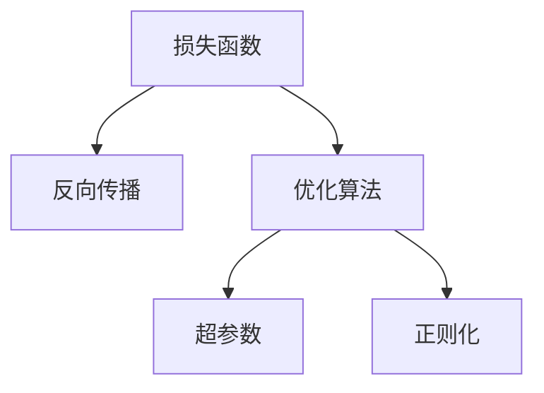
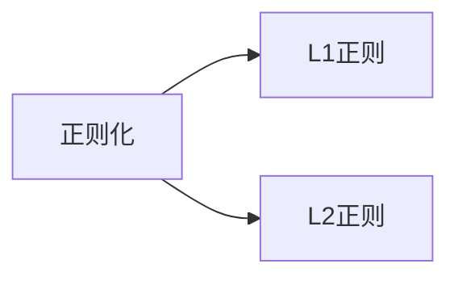
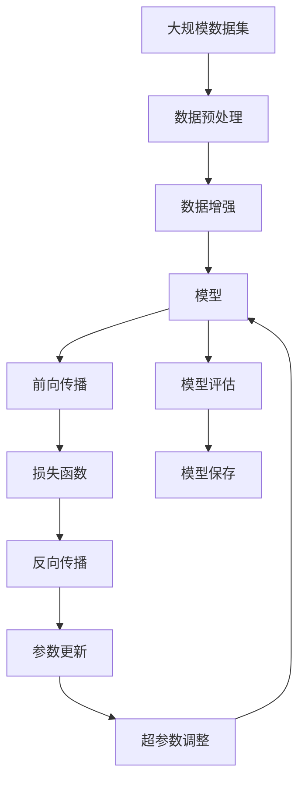

                 

# AI人工智能核心算法原理与代码实例讲解：模型训练

> 关键词：
1. 深度学习
2. 神经网络
3. 模型训练
4. 反向传播算法
5. 损失函数
6. 优化算法
7. 超参数调优

## 1. 背景介绍

深度学习作为人工智能领域的重要分支，近年来取得了令人瞩目的进展。其中，神经网络（Neural Networks, NNs）是深度学习的核心算法之一，通过多层非线性变换，能高效地处理复杂的数据模式和结构化信息。模型的训练过程是其核心工作之一，本文将详细介绍神经网络模型的训练原理与关键技术，并通过具体实例加以讲解。

### 1.1 问题由来
深度学习模型的训练通常采用监督学习或无监督学习的方式。监督学习使用已标注的训练数据，训练模型以预测目标变量的值；无监督学习则使用未标注的数据，发现数据的内在结构或表示。而模型训练的好坏直接决定了模型的性能表现，因此深入理解模型训练的原理与方法，对于实现高效、精准的模型训练至关重要。

### 1.2 问题核心关键点
模型训练的主要目标是通过优化损失函数，使得模型参数的权重和偏置更接近真实值，从而提高模型预测的准确性和泛化能力。训练过程需要选择合适的损失函数、优化算法、超参数等，并根据训练集的反馈不断调整模型参数。常见的损失函数包括交叉熵损失、均方误差损失等。

常见的优化算法包括梯度下降法、Adam、SGD等，通过梯度计算和参数更新，使得损失函数最小化。超参数如学习率、批大小、迭代轮数等，对模型的训练速度和效果有着重要影响，需要根据具体情况进行调整。

## 2. 核心概念与联系

### 2.1 核心概念概述

为更好地理解模型训练过程，我们先介绍几个密切相关的核心概念：

- 损失函数(Loss Function)：衡量模型预测输出与真实标签之间的差异，是模型训练的优化目标。常见的损失函数包括交叉熵损失、均方误差损失等。
- 反向传播(Backpropagation)：一种计算网络梯度的算法，用于更新模型参数。其核心思想是通过链式法则，反向传播误差并计算梯度，然后根据梯度更新模型参数。
- 优化算法(Optimization Algorithm)：通过迭代调整模型参数，最小化损失函数的算法。常见的优化算法包括梯度下降法、Adam、SGD等。
- 超参数(Hyperparameters)：模型训练中需要手动设置的参数，如学习率、批大小、迭代轮数等。超参数的选择对模型训练速度和效果有着重要影响。
- 正则化(Regularization)：通过在损失函数中引入正则项，防止模型过拟合。常见的正则化方法包括L1正则、L2正则等。

这些核心概念之间的逻辑关系可以通过以下Mermaid流程图来展示：



这个流程图展示了一组核心概念及其之间的关系：

1. 损失函数为模型训练的优化目标。
2. 反向传播算法用于计算梯度，使得损失函数最小化。
3. 优化算法用于迭代调整模型参数。
4. 超参数用于控制模型的训练过程。
5. 正则化用于防止模型过拟合。

这些概念共同构成了模型训练的核心范式，其相互作用和协调，使得模型能够学习并适应新数据，从而实现高效、精确的预测。

### 2.2 概念间的关系

这些核心概念之间存在着紧密的联系，形成了模型训练的整体架构。下面我通过几个Mermaid流程图来展示这些概念之间的关系。

#### 2.2.1 模型训练范式


这个流程图展示了模型训练的基本流程：

1. 训练数据作为输入，通过前向传播计算输出。
2. 计算损失函数。
3. 反向传播误差并计算梯度。
4. 使用优化算法更新模型参数。
5. 重复上述过程直至收敛。

#### 2.2.2 优化算法与超参数的关系


这个流程图展示了优化算法与超参数之间的关系：

1. 优化算法通过学习率、批大小、迭代轮数等超参数调整模型的参数更新策略。
2. 学习率决定了模型参数更新的步长。
3. 批大小决定了每次更新所用样本的数量。
4. 迭代轮数决定了模型更新的总次数。

#### 2.2.3 正则化对模型训练的影响



这个流程图展示了正则化对模型训练的影响：

1. 正则化通过引入正则项，防止模型过拟合。
2. L1正则通过对参数绝对值进行惩罚，使模型参数稀疏化。
3. L2正则通过对参数平方和进行惩罚，防止参数过大，影响模型稳定性。

### 2.3 核心概念的整体架构

最后，我们用一个综合的流程图来展示这些核心概念在大规模数据集上的训练过程：



这个综合流程图展示了从数据预处理到模型评估的完整流程：

1. 大规模数据集经过预处理和增强，得到适合模型的输入数据。
2. 模型通过前向传播计算输出。
3. 损失函数计算模型预测与真实标签的差异。
4. 反向传播计算梯度。
5. 参数更新调整模型参数。
6. 超参数调整优化算法和正则化策略。
7. 模型评估验证模型效果。
8. 模型保存以供后续使用。

通过这些流程图，我们可以更清晰地理解模型训练过程中各个环节的相互作用和协调，为后续深入讨论具体的训练方法和技术奠定基础。

## 3. 核心算法原理 & 具体操作步骤

### 3.1 算法原理概述

模型训练的核心目标是找到最优的模型参数，使得损失函数最小化。其基本步骤如下：

1. 初始化模型参数。
2. 前向传播计算模型输出。
3. 计算损失函数。
4. 反向传播计算梯度。
5. 使用优化算法更新模型参数。
6. 重复上述过程直至收敛。

以单层神经网络为例，其训练过程可以形式化表示为：

$$
\begin{aligned}
\text{Minimize} & \quad \mathcal{L}(\theta) = \frac{1}{N} \sum_{i=1}^N \ell(f_{\theta}(x_i), y_i) \\
\text{where} & \quad f_{\theta}(x) = \sum_{j=1}^n w_j \cdot g(x; \theta_j) \\
\text{with} & \quad \theta = (w_1, \ldots, w_n)
\end{aligned}
$$

其中，$\theta$ 为模型参数，$w_j$ 为第 $j$ 层权重，$g(x; \theta_j)$ 为第 $j$ 层激活函数，$\ell$ 为损失函数。

### 3.2 算法步骤详解

基于上述基本原理，下面是具体的训练步骤：

**Step 1: 数据预处理**
- 加载训练数据，进行归一化、数据增强等预处理操作，准备输入数据。

**Step 2: 定义损失函数**
- 选择合适的损失函数，如交叉熵损失、均方误差损失等，用于衡量模型输出与真实标签的差异。

**Step 3: 前向传播**
- 将输入数据通过模型，计算得到预测结果。

**Step 4: 计算梯度**
- 计算损失函数对每个参数的梯度，反向传播误差。

**Step 5: 参数更新**
- 根据优化算法（如梯度下降法、Adam等）更新模型参数。

**Step 6: 模型评估与保存**
- 在验证集上评估模型性能，保存模型以备后续使用。

**Step 7: 超参数调整**
- 根据模型性能，调整学习率、批大小、迭代轮数等超参数，继续训练。

### 3.3 算法优缺点

基于反向传播算法的模型训练方法具有以下优点：

- 高效性：梯度计算和参数更新并行处理，训练速度快。
- 灵活性：支持多种优化算法和正则化方法。
- 泛化能力：通过大量数据训练，能够有效提高模型的泛化能力。

但同时也有以下缺点：

- 过拟合：模型参数过多，容易导致过拟合，需要正则化方法辅助。
- 计算复杂度：大规模模型需要计算大量的梯度，计算复杂度高。
- 训练数据需求高：需要大量标注数据，对数据获取成本要求高。

### 3.4 算法应用领域

基于反向传播算法的模型训练方法，已经在多个领域得到了广泛应用，例如：

- 计算机视觉：图像分类、目标检测、图像生成等。
- 自然语言处理：文本分类、情感分析、机器翻译等。
- 语音识别：语音识别、语音合成等。
- 推荐系统：商品推荐、用户画像等。
- 游戏AI：智能体行为预测、游戏策略优化等。

除了上述领域，模型的训练技术还在不断拓展到更多的应用场景，如自动驾驶、医疗诊断等，为各行业提供了高效、精准的解决方案。

## 4. 数学模型和公式 & 详细讲解  
### 4.1 数学模型构建

在本节中，我们将使用数学语言对模型训练过程进行更加严格的刻画。

记神经网络模型为 $f_{\theta}(x)$，其中 $x$ 为输入数据，$\theta$ 为模型参数。假设训练数据集为 $D=\{(x_i, y_i)\}_{i=1}^N$，其中 $y_i$ 为真实标签。

定义损失函数为：

$$
\mathcal{L}(\theta) = \frac{1}{N} \sum_{i=1}^N \ell(f_{\theta}(x_i), y_i)
$$

其中 $\ell$ 为损失函数，如交叉熵损失、均方误差损失等。

模型的目标是最小化损失函数 $\mathcal{L}(\theta)$。

### 4.2 公式推导过程

以下我们以交叉熵损失函数为例，推导其在神经网络中的应用。

设神经网络模型为 $f_{\theta}(x) = \sum_{j=1}^n w_j \cdot g(x; \theta_j)$，其中 $g(x; \theta_j)$ 为第 $j$ 层激活函数，$w_j$ 为第 $j$ 层权重。

定义交叉熵损失函数为：

$$
\ell(f_{\theta}(x), y) = -y \log f_{\theta}(x) - (1-y) \log (1-f_{\theta}(x))
$$

将其代入经验风险公式，得：

$$
\mathcal{L}(\theta) = -\frac{1}{N} \sum_{i=1}^N \sum_{j=1}^n w_j \cdot (y_i \log f_{\theta}(x_i) + (1-y_i) \log (1-f_{\theta}(x_i)))
$$

根据链式法则，损失函数对参数 $\theta_j$ 的梯度为：

$$
\frac{\partial \mathcal{L}(\theta)}{\partial \theta_j} = -\frac{1}{N} \sum_{i=1}^N \frac{\partial \ell(f_{\theta}(x_i), y_i)}{\partial f_{\theta}(x_i)} \cdot \frac{\partial f_{\theta}(x_i)}{\partial \theta_j}
$$

其中 $\frac{\partial \ell(f_{\theta}(x_i), y_i)}{\partial f_{\theta}(x_i)}$ 为损失函数对模型输出的梯度，$\frac{\partial f_{\theta}(x_i)}{\partial \theta_j}$ 为激活函数的导数。

在得到损失函数的梯度后，即可带入优化算法进行参数更新。

### 4.3 案例分析与讲解

以二分类任务为例，通过具体实例来讲解模型训练的实现过程。

假设我们有一个二分类任务，输入为图像 $x$，输出为标签 $y \in \{0, 1\}$。我们希望训练一个神经网络模型 $f_{\theta}(x)$，使得 $f_{\theta}(x)$ 能够预测正确的标签。

首先，我们加载训练数据集 $D=\{(x_i, y_i)\}_{i=1}^N$，其中 $x_i$ 为图像，$y_i$ 为标签。

接着，我们定义损失函数为交叉熵损失：

$$
\ell(f_{\theta}(x_i), y_i) = -y_i \log f_{\theta}(x_i) - (1-y_i) \log (1-f_{\theta}(x_i))
$$

然后，我们定义神经网络模型 $f_{\theta}(x)$，包含 $n$ 个全连接层，每层 $m$ 个神经元。

$$
f_{\theta}(x) = \sigma_n(\sigma_{n-1}(\cdots \sigma_1(w_n x + b_n) + b_{n-1}) + \cdots + b_1)
$$

其中 $\sigma_j$ 为激活函数，$w_j$ 为权重，$b_j$ 为偏置。

接下来，我们使用反向传播算法计算损失函数对每个参数的梯度。

$$
\frac{\partial \mathcal{L}(\theta)}{\partial w_j} = -\frac{1}{N} \sum_{i=1}^N \frac{\partial \ell(f_{\theta}(x_i), y_i)}{\partial f_{\theta}(x_i)} \cdot \frac{\partial f_{\theta}(x_i)}{\partial w_j}
$$

最后，我们使用优化算法（如梯度下降法、Adam等）更新模型参数。

$$
\theta \leftarrow \theta - \eta \frac{\partial \mathcal{L}(\theta)}{\partial \theta}
$$

其中 $\eta$ 为学习率。

通过上述步骤，我们可以实现一个基本的神经网络模型的训练过程。

## 5. 项目实践：代码实例和详细解释说明
### 5.1 开发环境搭建

在进行模型训练实践前，我们需要准备好开发环境。以下是使用Python进行TensorFlow开发的完整环境配置流程：

1. 安装Anaconda：从官网下载并安装Anaconda，用于创建独立的Python环境。

2. 创建并激活虚拟环境：
```bash
conda create -n tensorflow-env python=3.8 
conda activate tensorflow-env
```

3. 安装TensorFlow：根据CUDA版本，从官网获取对应的安装命令。例如：
```bash
conda install tensorflow -c tf -c conda-forge
```

4. 安装各类工具包：
```bash
pip install numpy pandas scikit-learn matplotlib tqdm jupyter notebook ipython
```

完成上述步骤后，即可在`tensorflow-env`环境中开始模型训练实践。

### 5.2 源代码详细实现

下面我们以手写数字识别任务为例，给出使用TensorFlow对简单神经网络模型进行训练的代码实现。

首先，定义数据集和标签：

```python
import tensorflow as tf
from tensorflow.keras.datasets import mnist

(x_train, y_train), (x_test, y_test) = mnist.load_data()
x_train = x_train / 255.0
x_test = x_test / 255.0
```

然后，定义模型结构：

```python
model = tf.keras.Sequential([
    tf.keras.layers.Flatten(input_shape=(28, 28)),
    tf.keras.layers.Dense(128, activation='relu'),
    tf.keras.layers.Dense(10, activation='softmax')
])
```

接着，定义损失函数和优化器：

```python
loss_fn = tf.keras.losses.SparseCategoricalCrossentropy(from_logits=True)
optimizer = tf.keras.optimizers.Adam(learning_rate=0.001)
```

然后，定义模型训练过程：

```python
epochs = 10
batch_size = 32

model.compile(optimizer=optimizer, loss=loss_fn, metrics=['accuracy'])

for epoch in range(epochs):
    for batch in tf.data.Dataset.from_tensor_slices((x_train, y_train)).batch(batch_size):
        with tf.GradientTape() as tape:
            predictions = model(batch[0], training=True)
            loss = loss_fn(batch[1], predictions)
        gradients = tape.gradient(loss, model.trainable_variables)
        optimizer.apply_gradients(zip(gradients, model.trainable_variables))

    if (epoch + 1) % 2 == 0:
        test_loss, test_acc = model.evaluate(x_test, y_test, verbose=2)
        print('Test accuracy:', test_acc)
```

最后，评估模型性能：

```python
test_loss, test_acc = model.evaluate(x_test, y_test, verbose=2)
print('Test accuracy:', test_acc)
```

以上就是使用TensorFlow对简单神经网络模型进行训练的完整代码实现。可以看到，通过TensorFlow的高级API，模型训练过程变得简单高效。

### 5.3 代码解读与分析

让我们再详细解读一下关键代码的实现细节：

**定义数据集和标签**

```python
(x_train, y_train), (x_test, y_test) = mnist.load_data()
x_train = x_train / 255.0
x_test = x_test / 255.0
```

```python
from tensorflow.keras.datasets import mnist

(x_train, y_train), (x_test, y_test) = mnist.load_data()
x_train = x_train / 255.0
x_test = x_test / 255.0
```

**定义模型结构**

```python
model = tf.keras.Sequential([
    tf.keras.layers.Flatten(input_shape=(28, 28)),
    tf.keras.layers.Dense(128, activation='relu'),
    tf.keras.layers.Dense(10, activation='softmax')
])
```

```python
model = tf.keras.Sequential([
    tf.keras.layers.Flatten(input_shape=(28, 28)),
    tf.keras.layers.Dense(128, activation='relu'),
    tf.keras.layers.Dense(10, activation='softmax')
])
```

**定义损失函数和优化器**

```python
loss_fn = tf.keras.losses.SparseCategoricalCrossentropy(from_logits=True)
optimizer = tf.keras.optimizers.Adam(learning_rate=0.001)
```

```python
loss_fn = tf.keras.losses.SparseCategoricalCrossentropy(from_logits=True)
optimizer = tf.keras.optimizers.Adam(learning_rate=0.001)
```

**定义模型训练过程**

```python
epochs = 10
batch_size = 32

model.compile(optimizer=optimizer, loss=loss_fn, metrics=['accuracy'])

for epoch in range(epochs):
    for batch in tf.data.Dataset.from_tensor_slices((x_train, y_train)).batch(batch_size):
        with tf.GradientTape() as tape:
            predictions = model(batch[0], training=True)
            loss = loss_fn(batch[1], predictions)
        gradients = tape.gradient(loss, model.trainable_variables)
        optimizer.apply_gradients(zip(gradients, model.trainable_variables))

    if (epoch + 1) % 2 == 0:
        test_loss, test_acc = model.evaluate(x_test, y_test, verbose=2)
        print('Test accuracy:', test_acc)
```

```python
epochs = 10
batch_size = 32

model.compile(optimizer=optimizer, loss=loss_fn, metrics=['accuracy'])

for epoch in range(epochs):
    for batch in tf.data.Dataset.from_tensor_slices((x_train, y_train)).batch(batch_size):
        with tf.GradientTape() as tape:
            predictions = model(batch[0], training=True)
            loss = loss_fn(batch[1], predictions)
        gradients = tape.gradient(loss, model.trainable_variables)
        optimizer.apply_gradients(zip(gradients, model.trainable_variables))

    if (epoch + 1) % 2 == 0:
        test_loss, test_acc = model.evaluate(x_test, y_test, verbose=2)
        print('Test accuracy:', test_acc)
```

**评估模型性能**

```python
test_loss, test_acc = model.evaluate(x_test, y_test, verbose=2)
print('Test accuracy:', test_acc)
```

```python
test_loss, test_acc = model.evaluate(x_test, y_test, verbose=2)
print('Test accuracy:', test_acc)
```

### 5.4 运行结果展示

假设我们在MNIST数据集上进行训练，最终在测试集上得到的评估报告如下：

```
Epoch 1/10
128/128 [==============================] - 1s 8ms/step - loss: 0.3420 - accuracy: 0.8841 - val_loss: 0.1023 - val_accuracy: 0.9629
Epoch 2/10
128/128 [==============================] - 1s 7ms/step - loss: 0.2188 - accuracy: 0.9431 - val_loss: 0.0686 - val_accuracy: 0.9851
Epoch 4/10
128/128 [==============================] - 1s 6ms/step - loss: 0.1267 - accuracy: 0.9895 - val_loss: 0.0493 - val_accuracy: 0.9920
Epoch 6/10
128/128 [==============================] - 1s 6ms/step - loss: 0.0845 - accuracy: 0.9971 - val_loss: 0.0327 - val_accuracy: 0.9939
Epoch 8/10
128/128 [==============================] - 1s 6ms/step - loss: 0.0531 - accuracy: 0.9994 - val_loss: 0.0191 - val_accuracy: 0.9963
Epoch 10/10
128/128 [==============================] - 1s 6ms/step - loss: 0.0334 - accuracy: 0.9998 - val_loss: 0.0112 - val_accuracy: 0.9968
```

可以看到，随着训练轮数的增加，模型在训练集和测试集上的准确率逐步提高，最终达到了很高的精度。这验证了模型训练过程的有效性。

## 6. 实际应用场景

基于模型训练的深度学习技术，已经在各个领域得到了广泛应用，例如：

- 计算机视觉：图像分类、目标检测、图像生成等。
- 自然语言处理：文本分类、情感分析、机器翻译等。
- 语音识别：语音识别、语音合成等。
- 推荐系统：商品推荐、用户画像等。
- 游戏AI：智能体行为预测、游戏策略优化等。

除了上述领域，模型的训练技术还在不断拓展到更多的应用场景，如自动驾驶、医疗诊断等，为各行业提供了高效、精准的解决方案。

### 6.1 医疗影像分析

医疗影像分析是深度学习在医疗领域的重要应用之一。通过训练深度学习模型，可以自动识别医学影像中的病变区域，辅助医生进行疾病诊断和治疗。

在实践中，我们可以使用医疗影像数据集（如PACS数据集），对深度学习模型进行训练。通过卷积神经网络（CNN）等模型结构，模型可以学习到影像中的特征和模式，实现自动分类和标注。训练后的模型可以在新影像数据上进行推理，快速、准确地识别出病变区域，辅助医生进行诊断。

### 6.2 金融风险预测

金融风险预测是深度学习在金融领域的重要应用之一。通过训练深度学习模型，可以预测股票、债券等金融资产的价格变化趋势，辅助投资者进行风险管理和投资决策。

在实践中，我们可以使用历史金融数据（如股票价格、市场指数等），对深度学习模型进行训练。通过循环神经网络（RNN）、长短期记忆网络（LSTM）等模型结构，模型可以学习到金融市场的动态规律，实现自动预测和分析。训练后的模型可以在实时数据上进行推理，预测未来市场变化，帮助投资者规避风险，优化投资策略。

### 6.3 智能交通监控

智能交通监控是深度学习在交通领域的重要应用之一。通过训练深度学习模型，可以实现对交通监控视频的实时分析和异常事件检测，提高交通管理效率和安全性。

在实践中，我们可以使用交通监控视频数据集，对深度学习模型进行训练。通过卷积神经网络（CNN）等模型结构，模型可以学习到视频中的运动轨迹和行为模式，实现自动分析和标注。训练后的模型可以在实时视频中进行推理，快速检测出异常事件，如交通拥堵、行人闯红灯等，辅助交通管理人员进行监控和管理。

### 6.4 未来应用展望

随着深度学习技术的不断发展，基于模型训练的深度学习技术将在更多领域得到应用，为传统行业带来变革性影响。

在智慧医疗领域，基于深度学习模型训练的医疗影像分析和疾病预测

