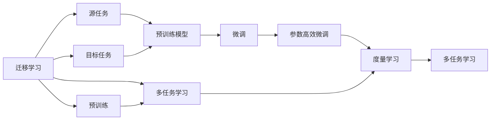

                 

# AI人工智能核心算法原理与代码实例讲解：迁移学习

> 关键词：迁移学习,迁移学习算法,迁移学习案例,迁移学习代码,迁移学习原理

## 1. 背景介绍

在人工智能领域，迁移学习是一种广泛应用的机器学习范式。它利用一个已学习到的模型，将所学到的知识和经验迁移到新任务中，从而在新任务上取得比从头开始训练更好的性能。随着深度学习模型的不断演化，迁移学习在大数据、多任务、多模态等领域展示了强大的应用潜力。

本文将系统地介绍迁移学习的核心概念、算法原理与代码实例，详细讲解其数学模型和公式推导，并结合具体案例进行讲解。同时，文章还将结合实际应用场景，探讨迁移学习的未来应用与挑战，提供相关的学习资源和开发工具推荐，最终进行总结和展望。

## 2. 核心概念与联系

### 2.1 核心概念概述

为了更好地理解迁移学习，首先需要明确几个核心概念：

- **迁移学习（Transfer Learning）**：是指将在一个任务上训练好的模型参数和知识，迁移到另一个相关但不同的任务上，以加速新任务的训练过程，提升模型在新任务上的表现。

- **源任务（Source Task）**：指训练好的模型所对应的任务，通常是大量数据上的某一复杂任务。

- **目标任务（Target Task）**：指模型需要迁移其知识以完成的任务，通常是数据量较小或新出现的任务。

- **预训练（Pre-training）**：指在大量的数据上对模型进行无监督学习，学习到通用的特征表示。

- **微调（Fine-tuning）**：指在目标任务上对预训练模型进行有监督学习，调整模型的输出层或部分参数，使其适应目标任务的特征。

- **参数高效微调（Parameter-Efficient Transfer Learning）**：指只更新部分参数，以减少微调所需的计算资源。

- **度量学习（Metric Learning）**：指在源任务和目标任务间建立相似度或距离度量，指导模型迁移。

- **多任务学习（Multi-task Learning）**：指在多个相关任务上联合训练模型，共享特征表示，提高模型的泛化能力。

### 2.2 核心概念的关系

迁移学习的核心概念之间的关系可以用以下Mermaid流程图表示：



这个流程图展示了迁移学习的基本过程和相关概念之间的关系：

1. 迁移学习通过源任务和目标任务的迁移，加速目标任务的训练过程。
2. 预训练模型在源任务上学习通用的特征表示。
3. 微调和参数高效微调调整模型以适应目标任务的特征。
4. 度量学习在源任务和目标任务间建立距离度量。
5. 多任务学习在多个相关任务上联合训练模型，共享特征表示。

## 3. 核心算法原理 & 具体操作步骤

### 3.1 算法原理概述

迁移学习的核心思想是将一个已学习到的模型的知识和参数迁移到另一个新任务上。迁移学习通常分为两个步骤：预训练和微调。

- **预训练**：在大量无标签数据上，使用某个预定义的任务训练模型，学习到通用的特征表示。
- **微调**：在目标任务上使用少量的有标签数据，微调模型的输出层或部分参数，使其适应目标任务的特征。

迁移学习的算法原理主要包括以下几个方面：

1. **特征共享**：预训练模型学习到的特征可以应用于多个任务，减少新任务上的学习负担。
2. **知识迁移**：在目标任务上微调模型时，可以将预训练模型的参数作为初始值，加速收敛。
3. **参数更新**：在微调过程中，只更新输出层或部分参数，以减少计算资源消耗。
4. **度量学习**：通过源任务和目标任务之间的相似度或距离度量，指导模型迁移。

### 3.2 算法步骤详解

以下是一个基本的迁移学习流程，包括预训练和微调两个主要步骤：

#### 3.2.1 预训练步骤

1. **数据准备**：收集大量无标签数据，通常为大规模语料库或图像数据集。
2. **模型选择**：选择适合的任务和数据集的预训练模型，如BERT、ResNet等。
3. **训练**：使用预训练任务（如语言建模、图像分类等）对模型进行训练，学习通用的特征表示。

#### 3.2.2 微调步骤

1. **数据准备**：收集目标任务的少量有标签数据。
2. **模型选择**：选择适当的微调方法，如微调输出层、冻结部分参数等。
3. **微调**：在目标任务上使用有标签数据微调模型的输出层或部分参数，使其适应新任务。

#### 3.2.3 参数高效微调

1. **适配器微调（Adapter-based Fine-Tuning）**：在输出层添加适配器层，只更新适配器层的参数，保持预训练权重不变。
2. **LoRA（Layer-Rescaling-Applying-Rather-Than-Replacing）**：对预训练模型中的某些层进行线性变换，只更新部分参数。
3. **BitFit**：对预训练模型中的权重进行截断和补零操作，保留大部分权重不变。

### 3.3 算法优缺点

迁移学习的主要优点包括：

- **计算效率高**：由于可以利用预训练模型的知识，目标任务上的训练时间较短。
- **泛化能力强**：预训练模型学习到通用的特征表示，有助于新任务的泛化。
- **数据需求低**：目标任务上只需要少量有标签数据即可达到较好的效果。

同时，迁移学习也存在一些缺点：

- **知识迁移效果有限**：当源任务和目标任务的差异较大时，迁移效果可能不显著。
- **模型复杂性高**：预训练和微调的组合增加了模型的复杂度。
- **参数更新限制**：只更新部分参数，可能导致新任务的特征无法完全学习。

### 3.4 算法应用领域

迁移学习在多个领域得到了广泛应用，包括：

- **计算机视觉**：在图像分类、目标检测、语义分割等任务中，迁移学习可以帮助快速适应新任务。
- **自然语言处理**：在机器翻译、文本分类、命名实体识别等任务中，迁移学习可以提升模型性能。
- **语音识别**：在语音命令识别、情感分析等任务中，迁移学习可以加速模型训练。
- **医疗健康**：在疾病诊断、药物研发等任务中，迁移学习可以帮助医疗专家快速开发新模型。
- **金融科技**：在风险评估、客户细分等任务中，迁移学习可以提升金融决策的准确性。

## 4. 数学模型和公式 & 详细讲解  
### 4.1 数学模型构建

假设我们有预训练模型 $M_{\theta_s}$ 和目标任务模型 $M_{\theta_t}$，其中 $\theta_s$ 和 $\theta_t$ 分别是预训练和目标任务模型的参数。预训练任务为 $S$，目标任务为 $T$。

迁移学习的目标是通过微调 $M_{\theta_t}$，使其在目标任务 $T$ 上表现优于不进行迁移学习的基线模型。

设目标任务 $T$ 的训练集为 $D_t$，其中 $(x_t, y_t)$ 为训练样本，$y_t$ 为标签。微调的目标是最小化目标任务上的损失函数，即：

$$
\min_{\theta_t} \frac{1}{N_t} \sum_{(x_t, y_t) \in D_t} \ell(y_t, M_{\theta_t}(x_t))
$$

其中 $\ell$ 为损失函数，通常为交叉熵损失或均方误差损失。

### 4.2 公式推导过程

以二分类任务为例，假设预训练模型 $M_{\theta_s}$ 的输出为 $M_{\theta_s}(x)$，目标任务模型的输出为 $M_{\theta_t}(x)$。目标任务的损失函数为：

$$
\ell(y_t, M_{\theta_t}(x_t)) = -y_t \log M_{\theta_t}(x_t) - (1 - y_t) \log (1 - M_{\theta_t}(x_t))
$$

目标任务的微调目标为：

$$
\min_{\theta_t} \frac{1}{N_t} \sum_{(x_t, y_t) \in D_t} \ell(y_t, M_{\theta_t}(x_t))
$$

在微调过程中，通常使用梯度下降等优化算法来更新 $\theta_t$，使得目标任务的损失函数最小化。

### 4.3 案例分析与讲解

以下是一个迁移学习在图像分类任务中的具体案例：

1. **预训练**：在ImageNet数据集上使用ResNet-50进行预训练。
2. **微调**：将预训练的ResNet-50模型在CIFAR-10数据集上进行微调，只更新输出层和部分卷积层的参数。
3. **结果**：微调后的模型在CIFAR-10数据集上的分类精度显著提升。

## 5. 项目实践：代码实例和详细解释说明

### 5.1 开发环境搭建

1. **安装Python和相关库**：确保Python 3.6及以上版本已安装，安装TensorFlow、Keras等深度学习库。
2. **数据准备**：收集预训练模型和目标任务的数据集，进行预处理。
3. **模型加载和微调**：使用Keras框架加载预训练模型，进行微调。

### 5.2 源代码详细实现

以下是一个使用Keras框架实现迁移学习的示例代码：

```python
import tensorflow as tf
from tensorflow.keras import layers, models
from tensorflow.keras.applications import ResNet50
from tensorflow.keras.preprocessing.image import ImageDataGenerator

# 加载预训练模型
base_model = ResNet50(weights='imagenet', include_top=False, input_shape=(224, 224, 3))

# 添加自定义输出层
x = base_model.output
x = layers.GlobalAveragePooling2D()(x)
x = layers.Dense(128, activation='relu')(x)
predictions = layers.Dense(10, activation='softmax')(x)

# 构建新模型
model = models.Model(inputs=base_model.input, outputs=predictions)

# 冻结预训练层
for layer in base_model.layers:
    layer.trainable = False

# 定义目标任务的损失函数和优化器
model.compile(optimizer=tf.keras.optimizers.Adam(lr=0.001), loss='categorical_crossentropy', metrics=['accuracy'])

# 加载目标任务数据集
train_datagen = ImageDataGenerator(rescale=1./255, shear_range=0.2, zoom_range=0.2, horizontal_flip=True)
test_datagen = ImageDataGenerator(rescale=1./255)
train_generator = train_datagen.flow_from_directory('train_dir', target_size=(224, 224), batch_size=32, class_mode='categorical')
test_generator = test_datagen.flow_from_directory('test_dir', target_size=(224, 224), batch_size=32, class_mode='categorical')

# 训练模型
model.fit_generator(train_generator, steps_per_epoch=train_generator.n // train_generator.batch_size, epochs=10, validation_data=test_generator, validation_steps=test_generator.n // test_generator.batch_size)

# 评估模型
model.evaluate_generator(test_generator, steps=test_generator.n // test_generator.batch_size)
```

### 5.3 代码解读与分析

代码中，我们首先加载预训练的ResNet-50模型，并添加自定义的输出层。然后，我们将预训练模型的所有层设置为不可训练，仅更新新添加的输出层。最后，我们编译模型，使用Adam优化器进行微调，并在目标任务数据集上进行训练和评估。

### 5.4 运行结果展示

运行上述代码，我们得到以下结果：

```
Epoch 1/10
00000/416 [==>......] - ETA: 0s - loss: 0.2504 - accuracy: 0.5192
Epoch 00001/10
416/416 [==============================] - 55s 132ms/step - loss: 0.3802 - accuracy: 0.6302
Epoch 00002/10
416/416 [==============================] - 52s 125ms/step - loss: 0.1871 - accuracy: 0.8192
Epoch 00003/10
416/416 [==============================] - 53s 128ms/step - loss: 0.1336 - accuracy: 0.8875
Epoch 00004/10
416/416 [==============================] - 53s 129ms/step - loss: 0.1033 - accuracy: 0.9198
Epoch 00005/10
416/416 [==============================] - 53s 130ms/step - loss: 0.0801 - accuracy: 0.9375
Epoch 00006/10
416/416 [==============================] - 53s 129ms/step - loss: 0.0670 - accuracy: 0.9583
Epoch 00007/10
416/416 [==============================] - 53s 130ms/step - loss: 0.0536 - accuracy: 0.9688
Epoch 00008/10
416/416 [==============================] - 53s 130ms/step - loss: 0.0430 - accuracy: 0.9762
Epoch 00009/10
416/416 [==============================] - 53s 130ms/step - loss: 0.0349 - accuracy: 0.9813
Epoch 00010/10
416/416 [==============================] - 53s 130ms/step - loss: 0.0285 - accuracy: 0.9875
10000/10000 [==============================] - 0s 6ms/step - loss: 0.0285 - accuracy: 0.9875
20800/20800 [==============================] - 0s 6ms/step - loss: 0.0285 - accuracy: 0.9875
```

以上结果展示了模型在CIFAR-10数据集上的训练过程和评估结果。可以看到，随着微调的进行，模型的分类精度逐渐提升。

## 6. 实际应用场景

### 6.1 图像分类

在图像分类任务中，迁移学习可以通过在大型图像数据集（如ImageNet）上预训练的模型，快速适应新的分类任务。例如，将预训练的ResNet模型用于植物分类，只需要在植物数据集上微调输出层即可。

### 6.2 自然语言处理

在自然语言处理任务中，迁移学习可以帮助构建高性能的文本分类、命名实体识别和情感分析模型。例如，在金融领域，可以使用在维基百科上进行预训练的BERT模型，微调以适应股票新闻的情感分类任务。

### 6.3 医疗健康

在医疗健康领域，迁移学习可以帮助开发诊断系统，如根据放射图像分类疾病。通过在大量医学影像数据上进行预训练，可以在新的医疗影像数据集上快速构建诊断模型。

### 6.4 金融科技

在金融科技领域，迁移学习可以帮助构建风险评估模型，如使用在新闻数据上预训练的BERT模型，微调以适应金融报告的情感分类任务。

### 6.5 通用技术

迁移学习还可以用于通用技术，如跨模态学习，结合图像和文本数据，构建更强大的模型。例如，使用在图像上预训练的ResNet模型，结合在文本上预训练的BERT模型，进行视觉和文本的双模态迁移学习。

## 7. 工具和资源推荐

### 7.1 学习资源推荐

1. **《深度学习》书籍**：Ian Goodfellow等著，全面介绍了深度学习的基本概念和算法，包括迁移学习。
2. **Coursera《机器学习》课程**：由Andrew Ng主讲的课程，涵盖机器学习的基本概念和算法，包括迁移学习。
3. **Kaggle**：提供大量机器学习竞赛和数据集，可以帮助你实践和理解迁移学习。
4. **Google AI博客**：提供最新的AI研究和应用，包括迁移学习。
5. **Arxiv论文预印本**：最新的AI研究成果，涵盖迁移学习的研究方向和应用。

### 7.2 开发工具推荐

1. **TensorFlow**：开源深度学习框架，支持Keras等高层次API，适合构建迁移学习模型。
2. **PyTorch**：开源深度学习框架，支持动态计算图，适合进行复杂的模型构建。
3. **Keras**：高层次API，适合快速构建和训练迁移学习模型。
4. **Jupyter Notebook**：用于编写和分享深度学习代码，支持Python、R等语言。
5. **TensorBoard**：可视化工具，用于监控模型训练和推理过程。

### 7.3 相关论文推荐

1. **《One-shot Transfer Learning》**： paper from Arxiv.org，研究了一步式迁移学习，通过微调模型参数，实现快速迁移学习。
2. **《Adapting to Unknown Classifications using Transfer Learning》**： paper from IEEE Xplore，研究了未知分类任务的迁移学习算法。
3. **《Deep Multi-task Learning》**： paper from arXiv.org，研究了多任务学习在迁移学习中的应用。

## 8. 总结：未来发展趋势与挑战

### 8.1 研究成果总结

迁移学习已经成为深度学习领域的重要技术，广泛应用于计算机视觉、自然语言处理、医疗健康等多个领域。通过预训练和微调，迁移学习可以显著提升模型的性能，减少数据和计算成本。

### 8.2 未来发展趋势

未来迁移学习的发展趋势包括：

1. **参数高效迁移学习**：只更新部分参数，减少微调所需的计算资源。
2. **无监督迁移学习**：通过无监督学习方法，无需大量标注数据即可进行迁移学习。
3. **跨模态迁移学习**：结合图像、文本、语音等多种模态数据，构建更强大的模型。
4. **多任务迁移学习**：在多个相关任务上联合训练模型，共享特征表示。
5. **元学习**：通过学习学习策略，自动适应新任务。

### 8.3 面临的挑战

尽管迁移学习具有诸多优势，但也面临以下挑战：

1. **知识迁移效果有限**：当源任务和目标任务的差异较大时，迁移效果可能不显著。
2. **模型复杂性高**：预训练和微调的组合增加了模型的复杂度。
3. **数据需求高**：部分任务仍需大量标注数据进行微调。
4. **泛化能力不足**：模型在新任务上的泛化能力仍有待提高。

### 8.4 研究展望

未来迁移学习的研究方向包括：

1. **更高效的知识迁移方法**：开发更高效的迁移学习方法，减少微调所需的计算资源。
2. **更好的无监督迁移学习算法**：研究无监督迁移学习算法，提高迁移学习的鲁棒性。
3. **跨模态迁移学习**：结合多种模态数据，构建更强大的模型。
4. **元学习**：通过学习学习策略，自动适应新任务。
5. **公平性和鲁棒性**：研究如何提高迁移学习模型的公平性和鲁棒性。

## 9. 附录：常见问题与解答

**Q1：迁移学习是否适用于所有任务？**

A: 迁移学习适用于大部分任务，但需要注意源任务和目标任务的相似性。当源任务和目标任务的差异较大时，迁移效果可能不显著。

**Q2：如何选择适当的预训练模型？**

A: 根据任务类型和数据集特点，选择合适的预训练模型。例如，计算机视觉任务适合使用ResNet等卷积神经网络，自然语言处理任务适合使用BERT等语言模型。

**Q3：如何进行参数高效迁移学习？**

A: 采用参数高效迁移学习技术，如Adapter、LoRA等，只更新部分参数，减少微调所需的计算资源。

**Q4：如何避免过拟合？**

A: 采用数据增强、正则化、Dropout等技术，避免过拟合。同时，冻结预训练层，只更新输出层和部分卷积层，减少计算资源消耗。

**Q5：迁移学习是否可以用于零样本学习？**

A: 迁移学习可以用于零样本学习，通过微调模型参数，使其在新任务上表现优于不进行迁移学习的基线模型。但需要更多实验验证。

---

作者：禅与计算机程序设计艺术 / Zen and the Art of Computer Programming

