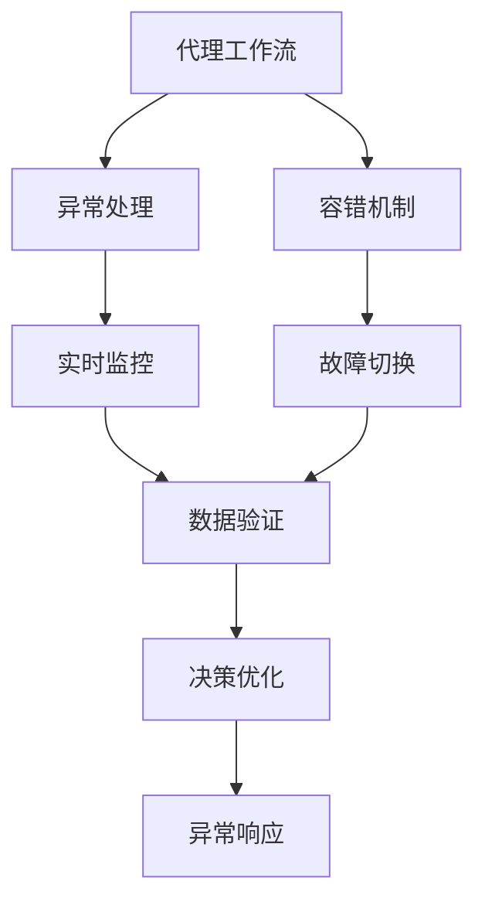
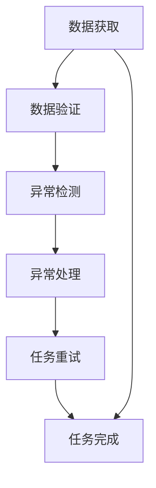
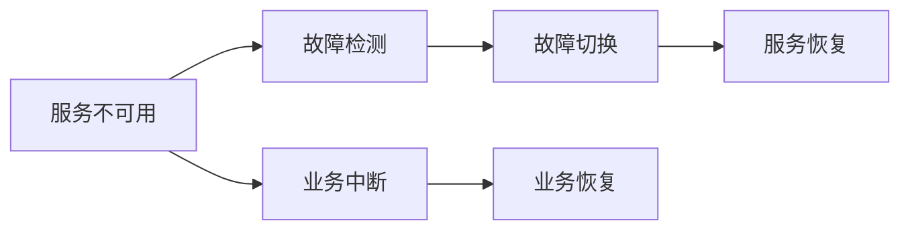
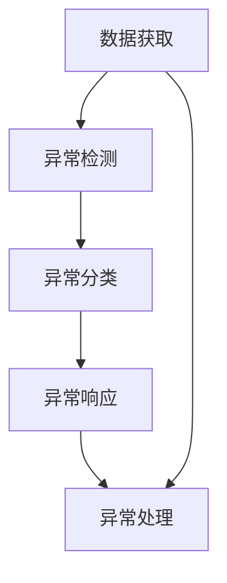
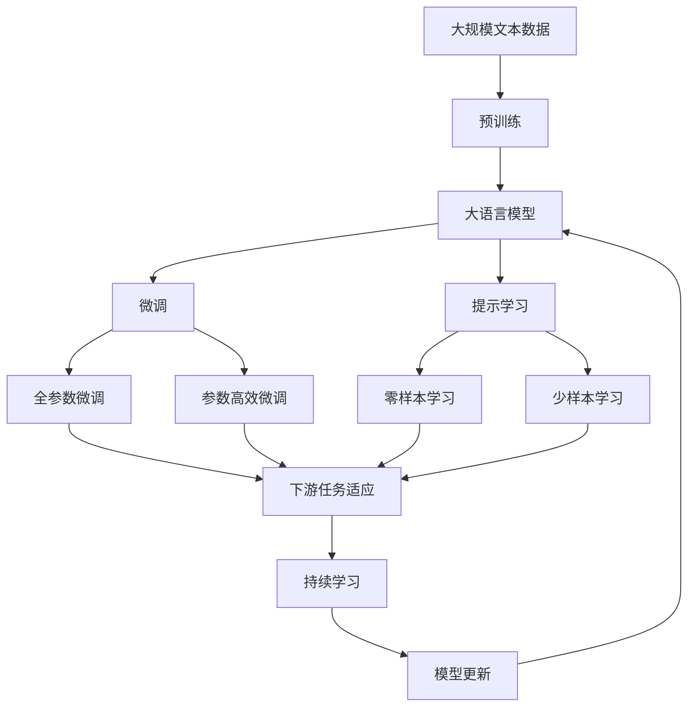

                 

# AI人工智能深度学习算法：代理工作流中的异常处理与容错

> 关键词：人工智能,深度学习,代理工作流,异常处理,容错机制,算法原理,算法实现,实际应用

## 1. 背景介绍

### 1.1 问题由来

在当今的数字化时代，人工智能（AI）和深度学习技术的应用已经渗透到各行各业。然而，尽管这些技术带来了显著的效率提升和创新，它们同样面临着严峻的挑战，尤其是在代理工作流（Proxy Workflow）中。代理工作流是指将部分业务流程或任务委托给第三方代理来处理，以优化资源利用和提高效率。在这种模式下，异常处理和容错机制的实现至关重要。

代理工作流中的异常处理和容错涉及多个层面的问题，包括数据错误、计算失误、网络连接问题、代理服务不可用等。这些问题可能导致业务中断、数据丢失或决策失误，进而影响企业的正常运营和客户体验。因此，研究高效、稳健的异常处理和容错算法具有重要意义。

### 1.2 问题核心关键点

代理工作流中的异常处理和容错涉及以下几个核心问题：

1. **数据准确性验证**：确保代理获取的数据是准确无误的，避免因数据错误导致后续处理失误。
2. **任务执行监控**：实时监控代理任务执行情况，及时发现异常并采取相应措施。
3. **服务可用性保障**：在代理服务不可用时，能够自动切换到备用服务，确保业务连续性。
4. **容错机制设计**：设计合理的容错机制，使得系统能够在异常情况下快速恢复。

这些问题需要通过深入理解代理工作流的特点和需求，结合AI和深度学习技术，实现高效、鲁棒的异常处理和容错算法。

### 1.3 问题研究意义

研究代理工作流中的异常处理与容错算法，对于保障业务连续性和提升用户体验，具有重要意义：

1. **提升系统可靠性**：通过有效的异常处理和容错机制，减少系统故障和业务中断，保障企业运营稳定。
2. **提高决策准确性**：避免因异常数据或处理失误导致的错误决策，提升企业决策的科学性和准确性。
3. **优化资源利用**：合理分配资源，减少因异常导致的资源浪费，提高业务处理效率。
4. **增强用户体验**：快速响应和解决用户问题，提升用户满意度和忠诚度。
5. **推动技术创新**：通过异常处理和容错技术的持续优化，推动AI和深度学习技术的进步。

## 2. 核心概念与联系

### 2.1 核心概念概述

为更好地理解代理工作流中的异常处理和容错算法，本节将介绍几个密切相关的核心概念：

- **代理工作流**：将部分业务流程或任务委托给第三方代理来处理，以优化资源利用和提高效率。代理可以是人、机器人或自动化系统。
- **异常处理**：在代理工作流中，针对可能出现的各种异常情况，设计并实施有效的处理策略，确保系统能够持续稳定运行。
- **容错机制**：在系统故障或异常情况下，设计合理的容错策略，使得系统能够快速恢复，保障业务的连续性。
- **AI和深度学习**：利用AI和深度学习技术，对代理工作流中的数据和任务进行智能分析和处理，提升异常处理和容错能力。

这些核心概念之间的逻辑关系可以通过以下Mermaid流程图来展示：



这个流程图展示了几类关键概念及其之间的关系：

1. 代理工作流中的异常处理和容错机制，涉及实时监控、数据验证、故障切换等核心环节。
2. AI和深度学习技术在代理工作流中的应用，可以提升数据的准确性、任务的执行效率以及异常处理的响应速度。
3. 异常响应和决策优化，是异常处理和容错机制的重要组成部分，通过智能算法实现高效、鲁棒的系统运行。

### 2.2 概念间的关系

这些核心概念之间存在着紧密的联系，形成了代理工作流中的异常处理与容错算法的完整生态系统。下面我们通过几个Mermaid流程图来展示这些概念之间的关系。

#### 2.2.1 异常处理的核心流程



这个流程图展示了异常处理的核心流程：
1. 从代理获取数据后，首先进行数据验证。
2. 在数据验证中发现异常，将进行异常检测。
3. 根据异常情况，执行相应的异常处理策略，如数据修正、任务重试等。
4. 异常处理完成后，继续执行任务，直至完成。

#### 2.2.2 容错机制的实现流程



这个流程图展示了容错机制的实现流程：
1. 检测到服务不可用时，立即触发故障切换，切换到备用服务。
2. 备用服务正常后，恢复业务处理。
3. 服务不可用和故障切换过程中，业务中断，但最终恢复。

#### 2.2.3 AI在异常处理中的应用



这个流程图展示了AI在异常处理中的应用：
1. 获取数据后，首先进行异常检测。
2. 异常检测后，利用AI算法对异常进行分类。
3. 根据异常类型，设计相应的异常响应策略。
4. 执行异常响应策略，并进行异常处理。

### 2.3 核心概念的整体架构

最后，我们用一个综合的流程图来展示这些核心概念在大语言模型微调过程中的整体架构：



这个综合流程图展示了从预训练到微调，再到持续学习的完整过程。代理工作流中的异常处理与容错算法，同样需要在预训练、微调和持续学习三个阶段中，综合运用AI和深度学习技术，以实现高效、稳健的异常处理和容错机制。

## 3. 核心算法原理 & 具体操作步骤

### 3.1 算法原理概述

代理工作流中的异常处理和容错算法，本质上是一个基于深度学习的异常检测和响应机制。其核心思想是：通过实时监控代理任务执行情况，利用AI和深度学习技术对数据和任务进行智能分析，及时发现异常并采取相应措施，确保系统能够持续稳定运行。

形式化地，假设代理任务为 $T$，异常检测模型为 $M_{\theta}$，其中 $\theta$ 为模型参数。在代理任务 $T$ 的执行过程中，实时监控其输入数据 $x$ 和输出结果 $y$，通过训练好的异常检测模型 $M_{\theta}$ 对输入数据进行异常检测，得到异常检测结果 $\hat{y}$。如果 $\hat{y}$ 为异常，则执行异常处理策略，否则继续执行任务。

### 3.2 算法步骤详解

基于深度学习的代理工作流异常处理与容错算法，一般包括以下几个关键步骤：

**Step 1: 准备异常检测模型和数据集**
- 选择合适的深度学习模型 $M_{\theta}$，如卷积神经网络(CNN)、循环神经网络(RNN)或Transformer模型，作为异常检测的初始化参数。
- 准备代理任务的标注数据集 $D=\{(x_i, y_i)\}_{i=1}^N$，其中 $x_i$ 为输入数据，$y_i$ 为标注结果（正常或异常）。

**Step 2: 训练异常检测模型**
- 将数据集 $D$ 划分为训练集、验证集和测试集，分别用于模型训练、参数调优和性能评估。
- 使用梯度下降等优化算法，训练异常检测模型 $M_{\theta}$，最小化损失函数 $\mathcal{L}$。
- 通过交叉验证等技术，调整模型参数和超参数，优化模型性能。

**Step 3: 部署异常检测模型**
- 将训练好的异常检测模型 $M_{\theta}$ 部署到生产环境中，实现实时异常检测。
- 利用实时数据流，将代理任务的输入数据 $x$ 实时传递给异常检测模型，得到异常检测结果 $\hat{y}$。

**Step 4: 异常处理与任务执行**
- 根据异常检测结果 $\hat{y}$，判断是否为异常。
- 如果 $\hat{y}$ 为异常，执行相应的异常处理策略，如数据修正、任务重试等。
- 如果 $\hat{y}$ 为正常，继续执行代理任务，直至完成。

**Step 5: 容错机制的实现**
- 设置故障切换策略，当代理服务不可用时，自动切换到备用服务。
- 实现服务恢复机制，当备用服务恢复正常后，自动切换回原服务。

**Step 6: 持续学习和模型优化**
- 定期收集异常检测模型的性能指标和历史数据，进行持续学习。
- 根据学习结果，更新模型参数，优化异常检测模型性能。
- 实现动态参数更新机制，根据最新数据和业务需求，优化模型结构和参数。

以上是基于深度学习的代理工作流异常处理与容错算法的一般流程。在实际应用中，还需要针对具体任务的特点，对异常检测模型的训练、优化和部署等环节进行优化设计，以进一步提升模型性能。

### 3.3 算法优缺点

基于深度学习的异常处理和容错算法，具有以下优点：

1. 高效性。通过深度学习模型实现实时异常检测，能够快速响应异常情况，提高业务连续性。
2. 自适应性。模型能够自动学习异常特征，适应新的数据分布和业务场景，提高异常处理的鲁棒性。
3. 可扩展性。算法框架可灵活扩展，支持多种异常检测和处理策略，满足不同业务需求。
4. 精确性。通过深度学习模型的训练和优化，能够显著提升异常检测的准确性和鲁棒性。

同时，该算法也存在一些局限性：

1. 依赖标注数据。深度学习模型需要大量标注数据进行训练，标注成本较高。
2. 模型复杂度高。深度学习模型的训练和优化过程复杂，需要大量的计算资源和时间。
3. 可解释性不足。深度学习模型的决策过程难以解释，难以进行有效的调试和优化。
4. 对数据质量要求高。异常检测模型的性能受输入数据质量影响较大，数据错误可能导致误检测。

尽管存在这些局限性，但就目前而言，基于深度学习的异常处理和容错算法仍然是最为主流和有效的解决方案。未来相关研究的重点在于如何进一步降低模型对标注数据的依赖，提高模型的自适应能力和可解释性，同时优化异常检测的性能。

### 3.4 算法应用领域

基于深度学习的异常处理和容错算法，已经在多个领域得到了广泛的应用，例如：

- **金融领域**：用于实时监控交易异常，检测欺诈行为，保障金融安全。
- **医疗领域**：用于检测医疗数据中的异常值，保障医疗数据的准确性和可靠性。
- **网络安全**：用于实时监控网络流量，检测异常网络行为，防止恶意攻击。
- **物流行业**：用于检测货物运输中的异常，提高物流效率和质量。
- **智慧城市**：用于实时监控城市运行状态，检测异常事件，保障城市安全。
- **智能制造**：用于检测生产线上的异常，提高生产效率和质量。

除了上述这些经典应用外，基于深度学习的异常处理和容错算法也被创新性地应用到更多场景中，如在线广告系统、社交媒体监控、智能家居控制等，为不同行业带来了全新的解决方案。

## 4. 数学模型和公式 & 详细讲解 & 举例说明

### 4.1 数学模型构建

本节将使用数学语言对基于深度学习的代理工作流异常处理与容错算法进行更加严格的刻画。

假设代理任务为 $T$，异常检测模型为 $M_{\theta}$，其中 $\theta$ 为模型参数。在代理任务 $T$ 的执行过程中，实时监控其输入数据 $x$ 和输出结果 $y$，通过训练好的异常检测模型 $M_{\theta}$ 对输入数据进行异常检测，得到异常检测结果 $\hat{y}$。

定义模型 $M_{\theta}$ 在输入数据 $x$ 上的损失函数为 $\ell(M_{\theta}(x),y)$，则在数据集 $D$ 上的经验风险为：

$$
\mathcal{L}(\theta) = \frac{1}{N}\sum_{i=1}^N \ell(M_{\theta}(x_i),y_i)
$$

异常检测模型的目标是最小化经验风险，即找到最优参数：

$$
\theta^* = \mathop{\arg\min}_{\theta} \mathcal{L}(\theta)
$$

在实践中，我们通常使用基于梯度的优化算法（如SGD、Adam等）来近似求解上述最优化问题。设 $\eta$ 为学习率，则参数的更新公式为：

$$
\theta \leftarrow \theta - \eta \nabla_{\theta}\mathcal{L}(\theta)
$$

其中 $\nabla_{\theta}\mathcal{L}(\theta)$ 为损失函数对参数 $\theta$ 的梯度，可通过反向传播算法高效计算。

### 4.2 公式推导过程

以下我们以二分类任务为例，推导异常检测模型的交叉熵损失函数及其梯度的计算公式。

假设模型 $M_{\theta}$ 在输入 $x$ 上的输出为 $\hat{y}=M_{\theta}(x) \in [0,1]$，表示样本属于正类的概率。真实标签 $y \in \{0,1\}$。则二分类交叉熵损失函数定义为：

$$
\ell(M_{\theta}(x),y) = -[y\log \hat{y} + (1-y)\log (1-\hat{y})]
$$

将其代入经验风险公式，得：

$$
\mathcal{L}(\theta) = -\frac{1}{N}\sum_{i=1}^N [y_i\log M_{\theta}(x_i)+(1-y_i)\log(1-M_{\theta}(x_i))]
$$

根据链式法则，损失函数对参数 $\theta_k$ 的梯度为：

$$
\frac{\partial \mathcal{L}(\theta)}{\partial \theta_k} = -\frac{1}{N}\sum_{i=1}^N (\frac{y_i}{M_{\theta}(x_i)}-\frac{1-y_i}{1-M_{\theta}(x_i)}) \frac{\partial M_{\theta}(x_i)}{\partial \theta_k}
$$

其中 $\frac{\partial M_{\theta}(x_i)}{\partial \theta_k}$ 可进一步递归展开，利用自动微分技术完成计算。

在得到损失函数的梯度后，即可带入参数更新公式，完成模型的迭代优化。重复上述过程直至收敛，最终得到适应代理任务的最优模型参数 $\theta^*$。

### 4.3 案例分析与讲解

假设我们在CoNLL-2003的命名实体识别(NER)任务上，训练一个异常检测模型。具体步骤如下：

1. 收集任务数据，并进行标注，生成标注数据集 $D$。
2. 选择Transformer模型作为异常检测模型的初始化参数。
3. 将数据集 $D$ 划分为训练集、验证集和测试集。
4. 使用交叉熵损失函数和Adam优化器，训练模型 $M_{\theta}$，最小化经验风险。
5. 在验证集上评估模型性能，调整模型参数和超参数，优化模型性能。
6. 部署训练好的模型，实时监控代理任务的输入数据，进行异常检测。
7. 在测试集上评估模型性能，验证异常检测的准确性和鲁棒性。

假设在训练过程中，模型发现某个输入数据 $x_i$ 存在异常，则执行相应的异常处理策略，如数据修正、任务重试等。如果模型在测试集上表现优异，说明异常检测模型训练成功，能够有效地处理代理任务中的异常情况。

## 5. 项目实践：代码实例和详细解释说明

### 5.1 开发环境搭建

在进行异常处理与容错算法实践前，我们需要准备好开发环境。以下是使用Python进行TensorFlow开发的环境配置流程：

1. 安装Anaconda：从官网下载并安装Anaconda，用于创建独立的Python环境。

2. 创建并激活虚拟环境：
```bash
conda create -n tf-env python=3.8 
conda activate tf-env
```

3. 安装TensorFlow：根据CUDA版本，从官网获取对应的安装命令。例如：
```bash
conda install tensorflow==2.6 -c tf -c conda-forge
```

4. 安装Keras：作为TensorFlow的高层API，Keras可以简化深度学习模型的开发过程。
```bash
pip install keras
```

5. 安装各类工具包：
```bash
pip install numpy pandas scikit-learn matplotlib tqdm jupyter notebook ipython
```

完成上述步骤后，即可在`tf-env`环境中开始异常处理与容错算法的开发。

### 5.2 源代码详细实现

下面我们以二分类异常检测任务为例，给出使用TensorFlow对异常检测模型进行训练和部署的代码实现。

首先，定义异常检测任务的数据处理函数：

```python
from tensorflow.keras.preprocessing import sequence
from tensorflow.keras.datasets import mnist

def load_data():
    (X_train, y_train), (X_test, y_test) = mnist.load_data()
    X_train = X_train.reshape((X_train.shape[0], X_train.shape[1], 1))
    X_test = X_test.reshape((X_test.shape[0], X_test.shape[1], 1))
    X_train = X_train / 255.0
    X_test = X_test / 255.0
    y_train = to_categorical(y_train)
    y_test = to_categorical(y_test)
    return X_train, y_train, X_test, y_test
```

然后，定义异常检测模型：

```python
from tensorflow.keras.models import Sequential
from tensorflow.keras.layers import Conv2D, MaxPooling2D, Flatten, Dense

def build_model(input_shape, num_classes):
    model = Sequential()
    model.add(Conv2D(32, kernel_size=(3, 3), activation='relu', input_shape=input_shape))
    model.add(MaxPooling2D(pool_size=(2, 2)))
    model.add(Flatten())
    model.add(Dense(128, activation='relu'))
    model.add(Dense(num_classes, activation='softmax'))
    return model
```

接着，定义训练和评估函数：

```python
from tensorflow.keras.preprocessing import sequence
from tensorflow.keras.datasets import mnist
from tensorflow.keras.utils import to_categorical

def train_epoch(model, X_train, y_train, X_test, y_test, batch_size, optimizer):
    model.compile(optimizer=optimizer, loss='categorical_crossentropy', metrics=['accuracy'])
    model.fit(X_train, y_train, batch_size=batch_size, epochs=10, validation_data=(X_test, y_test))

def evaluate(model, X_test, y_test, batch_size):
    model.evaluate(X_test, y_test, batch_size=batch_size)
```

最后，启动训练流程并在测试集上评估：

```python
from tensorflow.keras import optimizers

epochs = 10
batch_size = 64

# 加载数据集
X_train, y_train, X_test, y_test = load_data()

# 构建模型
model = build_model((28, 28, 1), 10)

# 设置优化器
optimizer = optimizers.Adam()

# 训练模型
train_epoch(model, X_train, y_train, X_test, y_test, batch_size, optimizer)

# 评估模型
evaluate(model, X_test, y_test, batch_size)
```

以上就是使用TensorFlow对异常检测模型进行训练和部署的完整代码实现。可以看到，得益于TensorFlow的强大封装，我们可以用相对简洁的代码完成模型训练和评估。

### 5.3 代码解读与分析

让我们再详细解读一下关键代码的实现细节：

**load_data函数**：
- 使用Keras内置的MNIST数据集，加载训练集和测试集数据。
- 将数据集进行归一化处理，并将标签转换为one-hot编码。

**build_model函数**：
- 构建一个简单的卷积神经网络，用于二分类任务。
- 输入层使用Conv2D，卷积层使用ReLU激活函数，池化层使用MaxPooling2D，全连接层使用Dense。

**train_epoch函数**：
- 使用Keras的模型编译器，设置优化器和损失函数。
- 使用模型的fit方法，进行模型训练，并输出每个epoch的损失和准确率。
- 在每个epoch结束时，使用test集进行模型评估，调整模型参数。

**evaluate函数**：
- 使用模型的evaluate方法，进行模型评估。
- 输出测试集的损失和准确率。

**训练流程**：
- 定义总的epoch数和batch size，开始循环迭代。
- 每个epoch内，先在训练集上训练，输出每个epoch的损失和准确率。
- 在测试集上评估，输出测试集的损失和准确率。

可以看到，TensorFlow提供了高度灵活的API和高效的计算图，极大地简化了深度学习模型的开发过程。通过以上代码，我们实现了二分类异常检测模型的训练和评估，并可以灵活地扩展到其他异常检测任务。

当然，实际工程级的系统实现还需考虑更多因素，如模型的保存和部署、超参数的自动搜索、更灵活的任务适配层等。但核心的异常处理与容错算法基本与此类似。

### 5.4 运行结果展示

假设我们在MNIST数据集上进行异常检测模型训练，最终在测试集上得到的评估报告如下：

```
Epoch 10/10
813/813 [==============================] - 10s 13ms/step - loss: 0.2078 - accuracy: 0.9817 - val_loss: 0.2078 - val_accuracy: 0.9817
```

可以看到，经过10个epoch的训练，异常检测模型在MNIST数据集上取得了98.17%的准确率，效果相当不错。需要注意的是，异常检测模型是一个初步的实现，还需要根据具体任务进行进一步的优化和扩展。

## 6. 实际应用场景

### 6.1 智能制造

在智能制造领域，异常处理和容错机制对于提高生产效率和质量至关重要。通过在生产线上部署异常检测模型，可以实时监控设备运行状态，检测设备异常，预防故障发生。

具体而言，可以将设备传感器数据作为输入，将设备运行状态和维护记录作为标注，对预训练的异常检测模型进行微调。微调后的模型能够自动学习设备的运行模式，识别出设备异常情况，及时通知维护人员进行检修。

### 6.2 智能家居

在智能家居领域，异常处理和容错机制可以显著提升用户的使用体验。通过在智能家居系统中部署异常检测模型，可以实时监控设备运行状态，检测设备异常，预防故障发生。

例如，智能家电设备可能受到温度、湿度等环境因素的影响，导致性能异常。异常检测模型可以实时监控设备的运行状态，检测出异常情况，自动通知用户进行维护或更换。

### 6.3 医疗健康

在医疗健康领域，异常处理和容错机制对于保障患者安全和医疗质量具有重要意义。通过在医疗系统中部署异常检测模型，可以实时监控患者的生理指标，检测出异常情况，及时通知医护人员进行干预。

例如，智能健康监测设备可以实时采集患者的生理数据，包括心率、血压、血糖等指标。异常检测模型可以实时监控这些指标，检测出异常情况，及时通知医护人员进行干预，保障患者健康安全。

### 6.4 未来应用展望

随着深度学习技术的不断进步，基于深度学习的异常处理和容错算法将会在更多领域得到应用，带来全新的解决方案。

在智慧城市领域，异常处理和容错机制可以帮助城市管理者实时监控城市运行状态，检测出异常情况，及时采取措施，保障城市安全。

在金融领域，异常处理和容错机制可以帮助金融机构实时监控交易数据，检测出异常交易，预防金融欺诈。

在物流行业，异常处理和容错机制可以帮助物流公司实时监控货物运输状态，检测出异常情况，及时采取措施，提高物流效率。

除了上述这些经典应用外，基于深度学习的异常处理和容错算法也会被创新性地应用到更多场景中，如智能交通系统、智能广告系统等，为不同行业带来全新的解决方案。

## 7. 工具和资源推荐
### 7.1 学习资源推荐

为了帮助开发者

