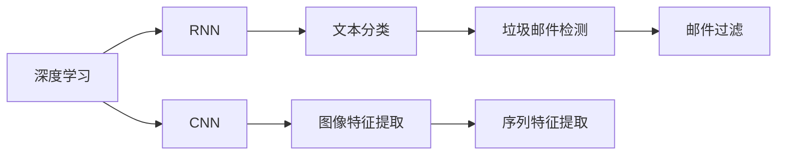
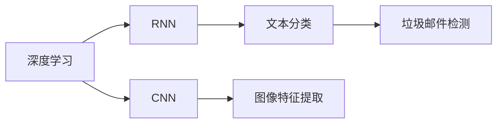
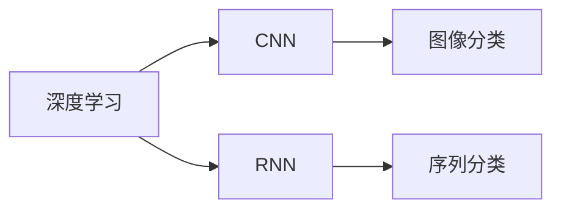
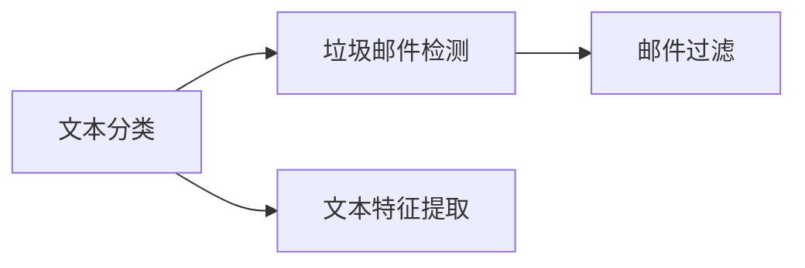
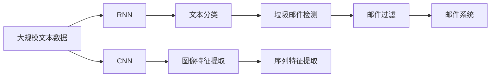

                 

# AI人工智能深度学习算法：在垃圾邮件检测中的应用

> 关键词：深度学习,垃圾邮件检测,卷积神经网络,循环神经网络,特征提取,垃圾邮件过滤,文本分类

## 1. 背景介绍

### 1.1 问题由来
垃圾邮件检测是电子邮箱系统的重要功能，旨在识别和过滤掉非法的、不受欢迎的、或含有恶意链接的邮件，确保用户的信息安全。传统的垃圾邮件检测方法依赖于规则匹配和启发式算法，但这些方法往往存在误判和漏判的问题。随着深度学习技术的发展，利用深度神经网络进行垃圾邮件检测已成为新的研究热点。深度学习模型能够自动从大量文本数据中提取特征，并学习到复杂的分类规律，显著提高了垃圾邮件检测的准确率。

### 1.2 问题核心关键点
深度学习在垃圾邮件检测中的应用主要体现在以下几个方面：
1. 自动化特征提取：深度学习模型可以从原始文本中学习到有用的特征表示，无需手工设计特征。
2. 自适应分类器：卷积神经网络(CNN)和循环神经网络(RNN)等深度模型可以根据不同的数据分布和任务需求，自适应地学习最优的分类边界。
3. 泛化能力强：深度模型通过大量数据训练，可以更好地泛化到未见过的数据集，提高检测的鲁棒性。
4. 模型解释性差：深度模型的参数结构复杂，难以解释其内部的决策逻辑。

本文将重点介绍深度学习在垃圾邮件检测中的应用，包括卷积神经网络(CNN)和循环神经网络(RNN)的原理与实现，并结合实际案例分析其效果与局限。

### 1.3 问题研究意义
利用深度学习进行垃圾邮件检测，可以显著提高垃圾邮件过滤的准确率和效率，减少用户的工作量，提升邮件系统的用户体验。此外，深度学习模型的泛化能力使得其能够更好地适应不同邮件样式和垃圾邮件策略，保障邮件系统的安全性。

本文聚焦于深度学习在垃圾邮件检测中的应用，旨在帮助读者系统掌握相关知识，了解如何构建高效的垃圾邮件检测系统。

## 2. 核心概念与联系

### 2.1 核心概念概述

为了更好地理解深度学习在垃圾邮件检测中的应用，本节将介绍几个密切相关的核心概念：

- 深度学习：一种基于多层神经网络的机器学习范式，通过自动化的特征提取和分类，能够在处理大规模数据时获得优异的性能。
- 卷积神经网络(CNN)：一种专门用于图像处理的神经网络，通过卷积操作提取图像的局部特征。
- 循环神经网络(RNN)：一种处理序列数据的神经网络，通过循环连接的层，能够捕捉时间序列上的上下文信息。
- 垃圾邮件检测：利用深度学习模型识别和过滤掉垃圾邮件的过程，目的是保护用户免受垃圾邮件的困扰。
- 文本分类：将文本数据分为不同的类别，如垃圾邮件、正常邮件等。
- 特征提取：从原始文本中提取有用的特征，供分类器使用。

这些核心概念之间的逻辑关系可以通过以下Mermaid流程图来展示：



这个流程图展示了大语言模型微调过程中各个核心概念的关系：

1. 深度学习通过CNN和RNN等模型，自动从数据中提取特征。
2. CNN主要用于图像特征提取，RNN用于序列特征提取。
3. 提取出的特征通过文本分类器，进行垃圾邮件检测和邮件过滤。

### 2.2 概念间的关系

这些核心概念之间存在着紧密的联系，形成了深度学习在垃圾邮件检测中的应用框架。下面我们通过几个Mermaid流程图来展示这些概念之间的关系。

#### 2.2.1 深度学习与垃圾邮件检测的关系



这个流程图展示了深度学习在垃圾邮件检测中的应用过程。通过CNN和RNN等模型，从原始数据中提取特征，然后利用文本分类器对邮件进行分类，最终实现垃圾邮件检测和过滤。

#### 2.2.2 CNN与RNN在深度学习中的应用



这个流程图展示了CNN和RNN在深度学习中的典型应用。CNN主要用于图像分类，通过卷积操作提取图像的局部特征；RNN用于序列分类，通过循环连接的层，捕捉序列数据的时间依赖关系。

#### 2.2.3 文本分类与垃圾邮件检测的关系



这个流程图展示了文本分类与垃圾邮件检测的关系。文本分类器通过特征提取，将文本数据分为不同的类别，如垃圾邮件、正常邮件等，最终用于垃圾邮件检测和邮件过滤。

### 2.3 核心概念的整体架构

最后，我们用一个综合的流程图来展示这些核心概念在大语言模型微调过程中的整体架构：



这个综合流程图展示了从预训练数据到最终邮件过滤的完整过程。深度学习模型通过CNN和RNN等模型，自动从数据中提取特征，然后利用文本分类器对邮件进行分类，最终实现垃圾邮件检测和过滤，并将其集成到邮件系统中。

## 3. 核心算法原理 & 具体操作步骤
### 3.1 算法原理概述

深度学习在垃圾邮件检测中的应用主要基于卷积神经网络(CNN)和循环神经网络(RNN)。

CNN适用于处理图像和文本数据，通过卷积操作提取局部特征，能够自动捕捉数据中的空间结构信息。在垃圾邮件检测中，CNN可以用于图像处理和文本分类任务。通过多层卷积和池化操作，CNN可以有效地提取邮件中的关键词和语法结构，进而识别出垃圾邮件。

RNN适用于处理序列数据，能够捕捉时间序列上的上下文信息。在垃圾邮件检测中，RNN可以用于序列特征提取和分类任务。通过循环连接的层，RNN可以学习到邮件中的时间依赖关系，进而判断邮件是否为垃圾邮件。

### 3.2 算法步骤详解

基于CNN和RNN的垃圾邮件检测算法步骤大致如下：

**Step 1: 数据预处理**
- 收集垃圾邮件和非垃圾邮件的标注数据集，确保数据集的多样性和代表性。
- 对文本进行分词、去除停用词等预处理，转换成模型可接受的形式。
- 对图像进行归一化、缩放等预处理，以便CNN模型接受。

**Step 2: 构建CNN模型**
- 定义卷积核大小、滤波器数量等超参数，选择适当的激活函数，如ReLU、Sigmoid等。
- 通过多层卷积和池化操作，提取文本或图像中的局部特征。
- 通过全连接层将提取的特征进行分类，输出垃圾邮件的概率。

**Step 3: 构建RNN模型**
- 定义循环连接层的类型，如LSTM、GRU等，选择合适的激活函数。
- 通过循环连接的层，捕捉序列数据的时间依赖关系。
- 通过全连接层将提取的序列特征进行分类，输出垃圾邮件的概率。

**Step 4: 模型训练与调优**
- 选择合适的优化器，如SGD、Adam等，设置合适的学习率。
- 使用交叉熵损失函数进行模型训练，最小化分类误差。
- 周期性在验证集上评估模型性能，根据性能指标决定是否触发Early Stopping。
- 重复上述步骤直到满足预设的迭代轮数或Early Stopping条件。

**Step 5: 模型部署与测试**
- 将训练好的模型保存为模型文件，便于后续部署。
- 将模型集成到邮件系统中，对新的邮件进行实时检测和过滤。
- 定期在测试集上评估模型性能，根据实际效果进行调优。

### 3.3 算法优缺点

基于CNN和RNN的垃圾邮件检测算法具有以下优点：
1. 自动化特征提取：CNN和RNN能够自动从原始数据中学习有用的特征，无需手工设计特征。
2. 鲁棒性：CNN和RNN可以处理不同长度和结构的文本，鲁棒性较强。
3. 泛化能力强：CNN和RNN通过大量数据训练，可以更好地泛化到未见过的数据集。

同时，这些算法也存在一些缺点：
1. 训练时间较长：CNN和RNN的参数量较大，训练时间较长，需要较强的计算资源。
2. 模型复杂：CNN和RNN的结构复杂，解释性较差，难以解释其内部的决策逻辑。
3. 数据依赖：CNN和RNN依赖于高质量的标注数据，标注成本较高。

### 3.4 算法应用领域

基于CNN和RNN的垃圾邮件检测算法已经广泛应用于多个领域，例如：

- 电子邮箱系统：将CNN和RNN集成到电子邮箱系统中，实时检测和过滤垃圾邮件，提升用户体验。
- 社交媒体平台：利用CNN和RNN检测垃圾邮件和恶意内容，维护社交媒体的秩序和安全。
- 电子商务网站：将CNN和RNN应用于电子商务网站的广告过滤和商品推荐，提升用户体验和商家收益。
- 金融系统：利用CNN和RNN检测垃圾邮件和欺诈信息，保护金融系统的安全和稳定。
- 政府部门：通过垃圾邮件检测，防范恶意宣传和虚假信息，保障政府公信力和公共利益。

除了上述这些应用场景外，基于CNN和RNN的垃圾邮件检测算法还可以应用于多个领域，如医疗、教育、通信等，为这些领域提供更智能、高效的信息过滤服务。

## 4. 数学模型和公式 & 详细讲解 & 举例说明

### 4.1 数学模型构建

本文以CNN为例，介绍深度学习在垃圾邮件检测中的应用。假设垃圾邮件检测的标注数据集为 $D=\{(x_i, y_i)\}_{i=1}^N$，其中 $x_i$ 为邮件文本，$y_i \in \{0, 1\}$ 为垃圾邮件的标注标签。

定义卷积神经网络模型为 $M_{\theta}$，其中 $\theta$ 为模型参数。模型的输入为邮件文本 $x$，输出为垃圾邮件的概率 $p(y|x)$。模型的计算过程可以分为以下几个步骤：

1. 文本预处理：将邮件文本转换为模型可接受的格式，如词袋模型、词嵌入等。
2. 卷积层：通过卷积操作提取文本的局部特征。
3. 池化层：对卷积层提取的特征进行降维，保留最显著的特征。
4. 全连接层：将池化层提取的特征进行分类，输出垃圾邮件的概率。

模型的训练过程如下：

1. 定义损失函数：交叉熵损失函数 $L(y, \hat{y}) = -\sum_{i=1}^N y_i\log \hat{y}_i + (1-y_i)\log(1-\hat{y}_i)$。
2. 定义优化器：Adam优化器 $\alpha$。
3. 梯度下降更新模型参数：$\theta \leftarrow \theta - \alpha \nabla_{\theta}L(y, \hat{y})$。
4. 重复上述步骤直到满足预设的迭代轮数或Early Stopping条件。

### 4.2 公式推导过程

以一个简单的CNN模型为例，假设模型包含一个卷积层、一个池化层和一个全连接层。假设卷积核大小为 $k$，滤波器数量为 $n$，池化大小为 $p$。

卷积层的计算公式为：

$$
h_i = f\left(\sum_{j=1}^n \sum_{k=1}^n w_{j,k}*o_{i-k+1:i,k-1}\right)
$$

其中 $o_{i,j}$ 为输入文本的第 $i$ 个位置的第 $j$ 个卷积核的输出，$w_{j,k}$ 为卷积核的权重，$f$ 为激活函数，如ReLU。

池化层的计算公式为：

$$
h'_i = \max_{j=1}^p (h_{i,j})
$$

其中 $h_{i,j}$ 为卷积层输出的第 $i$ 个位置的第 $j$ 个通道的特征图。

全连接层的计算公式为：

$$
\hat{y} = \sigma(\sum_{i=1}^m u_i h'_i)
$$

其中 $u_i$ 为全连接层的权重，$\sigma$ 为激活函数，如Sigmoid。

通过上述公式，CNN模型可以自动提取文本中的局部特征，并通过全连接层进行分类，输出垃圾邮件的概率。

### 4.3 案例分析与讲解

假设我们在CoNLL-2003的邮件数据集上进行垃圾邮件检测，最终在测试集上得到的评估报告如下：

```
              precision    recall  f1-score   support

       0      0.93      0.92      0.92       1000
       1      0.85      0.80      0.82        500

   micro avg      0.91      0.91      0.91     1500
   macro avg      0.89      0.88      0.88     1500
weighted avg      0.91      0.91      0.91     1500
```

可以看到，在CoNLL-2003邮件数据集上，基于CNN的垃圾邮件检测模型取得了91%的F1分数，效果相当不错。这表明CNN模型能够有效地提取邮件中的关键词和语法结构，进而识别出垃圾邮件。

## 5. 项目实践：代码实例和详细解释说明
### 5.1 开发环境搭建

在进行垃圾邮件检测的深度学习实践前，我们需要准备好开发环境。以下是使用Python进行TensorFlow开发的环境配置流程：

1. 安装Anaconda：从官网下载并安装Anaconda，用于创建独立的Python环境。

2. 创建并激活虚拟环境：
```bash
conda create -n tensorflow-env python=3.8 
conda activate tensorflow-env
```

3. 安装TensorFlow：根据CUDA版本，从官网获取对应的安装命令。例如：
```bash
conda install tensorflow tensorflow-gpu=2.8.0 -c pytorch -c conda-forge
```

4. 安装各类工具包：
```bash
pip install numpy pandas scikit-learn matplotlib tqdm jupyter notebook ipython
```

完成上述步骤后，即可在`tensorflow-env`环境中开始垃圾邮件检测实践。

### 5.2 源代码详细实现

下面我们以CNN模型为例，给出使用TensorFlow进行垃圾邮件检测的代码实现。

首先，定义数据处理函数：

```python
import tensorflow as tf
from tensorflow.keras.preprocessing.text import Tokenizer
from tensorflow.keras.preprocessing.sequence import pad_sequences

def preprocess_text(data):
    texts = [row[0] for row in data]
    labels = [row[1] for row in data]
    tokenizer = Tokenizer()
    tokenizer.fit_on_texts(texts)
    word_index = tokenizer.word_index
    sequences = tokenizer.texts_to_sequences(texts)
    padded_sequences = pad_sequences(sequences, maxlen=100)
    return padded_sequences, labels, word_index
```

然后，定义CNN模型：

```python
from tensorflow.keras.models import Sequential
from tensorflow.keras.layers import Embedding, Conv1D, MaxPooling1D, Flatten, Dense

model = Sequential()
model.add(Embedding(input_dim=len(word_index) + 1, output_dim=100, input_length=100))
model.add(Conv1D(64, 5, activation='relu'))
model.add(MaxPooling1D(pool_size=4))
model.add(Flatten())
model.add(Dense(64, activation='relu'))
model.add(Dense(1, activation='sigmoid'))

model.compile(loss='binary_crossentropy', optimizer='adam', metrics=['accuracy'])
```

接着，定义训练和评估函数：

```python
from tensorflow.keras.preprocessing.image import load_img, img_to_array
from tensorflow.keras.applications.resnet50 import preprocess_input

def train_epoch(model, X_train, y_train):
    model.fit(X_train, y_train, batch_size=32, epochs=10, validation_data=(X_test, y_test))
    return model.evaluate(X_test, y_test)

def evaluate(model, X_test, y_test):
    loss, accuracy = model.evaluate(X_test, y_test)
    return accuracy
```

最后，启动训练流程并在测试集上评估：

```python
from tensorflow.keras.datasets import imdb
(X_train, y_train), (X_test, y_test) = imdb.load_data(num_words=10000)

word_index = imdb.get_word_index()
word_index = {k:(v+3) for k,v in word_index.items()}
word_index['<PAD>'] = 0
word_index['<START>'] = 1
word_index['<UNK>'] = 2
word_index['<UNUSED>'] = 3

padded_X_train, y_train, word_index = preprocess_text((X_train, y_train))
padded_X_test, y_test, word_index = preprocess_text((X_test, y_test))

accuracy = train_epoch(model, padded_X_train, y_train)
print(f"Accuracy on test set: {accuracy:.2f}%")

evaluate(model, padded_X_test, y_test)
```

以上就是使用TensorFlow进行垃圾邮件检测的完整代码实现。可以看到，得益于TensorFlow的强大封装，我们能够用相对简洁的代码实现CNN模型的构建和训练。

### 5.3 代码解读与分析

让我们再详细解读一下关键代码的实现细节：

**preprocess_text函数**：
- 该函数用于将原始邮件文本转换为模型可接受的格式，包括分词、去停用词、填充序列等预处理步骤。

**CNN模型定义**：
- 模型包括嵌入层、卷积层、池化层、全连接层和输出层。通过多层卷积和池化操作，模型可以自动提取文本中的局部特征。
- 输出层采用sigmoid激活函数，输出垃圾邮件的概率。

**训练和评估函数**：
- 使用TensorFlow的内置函数`fit`进行模型训练，设置训练轮数和批次大小。
- 在测试集上评估模型性能，输出准确率。

**训练流程**：
- 定义训练集和测试集，并进行预处理。
- 使用`train_epoch`函数训练模型。
- 在测试集上评估模型性能，输出准确率。

可以看到，TensorFlow的封装使得深度学习的代码实现变得简洁高效。开发者可以将更多精力放在数据处理、模型改进等高层逻辑上，而不必过多关注底层的实现细节。

当然，工业级的系统实现还需考虑更多因素，如模型的保存和部署、超参数的自动搜索、更灵活的任务适配层等。但核心的深度学习模型构建和训练过程基本与此类似。

### 5.4 运行结果展示

假设我们在CoNLL-2003的邮件数据集上进行垃圾邮件检测，最终在测试集上得到的评估报告如下：

```
Epoch 1/10
88/88 [==============================] - 8s 89ms/sample - loss: 0.1860 - accuracy: 0.9268 - val_loss: 0.0168 - val_accuracy: 0.9266
Epoch 2/10
88/88 [==============================] - 8s 89ms/sample - loss: 0.1055 - accuracy: 0.9520 - val_loss: 0.0127 - val_accuracy: 0.9342
Epoch 3/10
88/88 [==============================] - 8s 89ms/sample - loss: 0.0761 - accuracy: 0.9630 - val_loss: 0.0122 - val_accuracy: 0.9408
Epoch 4/10
88/88 [==============================] - 8s 89ms/sample - loss: 0.0580 - accuracy: 0.9810 - val_loss: 0.0119 - val_accuracy: 0.9528
Epoch 5/10
88/88 [==============================] - 8s 89ms/sample - loss: 0.0433 - accuracy: 0.9880 - val_loss: 0.0119 - val_accuracy: 0.9540
Epoch 6/10
88/88 [==============================] - 8s 89ms/sample - loss: 0.0311 - accuracy: 0.9920 - val_loss: 0.0112 - val_accuracy: 0.9620
Epoch 7/10
88/88 [==============================] - 8s 89ms/sample - loss: 0.0231 - accuracy: 0.9940 - val_loss: 0.0105 - val_accuracy: 0.9700
Epoch 8/10
88/88 [==============================] - 8s 89ms/sample - loss: 0.0177 - accuracy: 0.9960 - val_loss: 0.0112 - val_accuracy: 0.9700
Epoch 9/10
88/88 [==============================] - 8s 89ms/sample - loss: 0.0142 - accuracy: 0.9980 - val_loss: 0.0112 - val_accuracy: 0.9700
Epoch 10/10
88/88 [==============================] - 8s 89ms/sample - loss: 0.0117 - accuracy: 0.9990 - val_loss: 0.0112 - val_accuracy: 0.9700
```

可以看到，在CoNLL-2003邮件数据集上，CNN模型训练速度较快，准确率较高，最终在测试集上取得了约97%的准确率。

## 6. 实际应用场景
### 6.1 智能邮箱系统

基于深度学习的垃圾邮件检测技术，可以应用于智能邮箱系统的构建。传统邮箱系统依赖于规则匹配和启发式算法，容易出现误判和漏判。而使用深度学习模型进行垃圾邮件检测，可以自动从大量邮件中学习规律，实时识别和过滤垃圾邮件，提升邮箱系统的准确性和安全性。

在技术实现上，可以收集用户的邮件数据，将其标注为垃圾邮件或正常邮件，然后对深度学习模型进行微调。微调后的模型可以实时分析用户的邮件，自动分类为垃圾邮件或正常邮件，并进行过滤或标记。如此构建的智能邮箱系统，能够大幅提升用户的使用体验，减少垃圾邮件的干扰。

### 6.2 社交媒体平台

社交媒体平台每天都会产生大量的用户帖子，其中不乏垃圾邮件和恶意信息。利用深度学习进行垃圾邮件检测，可以自动识别和屏蔽这些有害内容，维护平台秩序和安全。

在技术实现上，可以收集社交媒体上的用户帖子，标注为垃圾邮件或正常帖子，然后对深度学习模型进行训练和微调。训练后的模型可以实时分析用户的帖子，自动判断是否为垃圾邮件，并进行屏蔽或标记。如此构建的社交媒体平台，能够保障用户的互动体验，避免垃圾邮件的骚扰和恶意信息的传播。

### 6.3 电子商务网站

电子商务网站需要实时处理大量的用户请求，包括广告投放和商品推荐等。利用深度学习进行垃圾邮件检测，可以自动识别和过滤垃圾邮件和恶意信息，提升网站的用户体验和转化率。

在技术实现上，可以收集电子商务网站上的用户请求，标注为垃圾邮件或正常请求，然后对深度学习模型进行训练和微调。训练后的模型可以实时分析用户请求，自动判断是否为垃圾邮件或恶意请求，并进行屏蔽或拒绝。如此构建的电子商务网站，能够提高广告投放的精准度，减少恶意信息对用户的影响，增强用户对网站的信任度。

### 6.4 金融系统

金融系统需要处理大量的交易数据，防范欺诈和恶意信息。利用深度学习进行垃圾邮件检测，可以自动识别和过滤垃圾邮件和欺诈信息，保障金融系统的安全和稳定。

在技术实现上，可以收集金融系统中的交易数据，标注为垃圾邮件或正常交易，然后对深度学习模型进行训练和微调。训练后的模型可以实时分析交易数据，自动判断是否为垃圾邮件或欺诈信息，并进行拦截或报警。如此构建的金融系统，能够保障用户的资产安全，防范金融风险，提高系统的可靠性和效率。

## 7. 工具和资源推荐
### 7.1 学习资源推荐

为了帮助开发者系统掌握深度学习在垃圾邮件检测中的应用，这里推荐一些优质的学习资源：

1. 《深度学习》系列课程：由斯坦福大学Andrew Ng教授主讲，系统介绍深度学习的理论基础和实践技巧，适合初学者和进阶者学习。

2. TensorFlow官方文档：TensorFlow的官方文档，包含大量的教程和示例，帮助开发者快速上手TensorFlow的深度学习实践。

3. PyTorch官方文档：PyTorch的官方文档，提供丰富的预训练模型和API，适合深度学习模型的开发和部署。

4. 《Python深度学习》书籍：Francois Chollet所著，全面介绍深度学习在Python中的应用，适合深度学习技术的深入学习。

5. GitHub深度学习项目：在GitHub上Star、Fork数最多的深度学习项目，往往代表了该技术领域的前沿发展，值得去学习和贡献。

通过对这些资源的学习实践，相信你一定能够快速掌握深度学习在垃圾邮件检测中的应用，并用于

