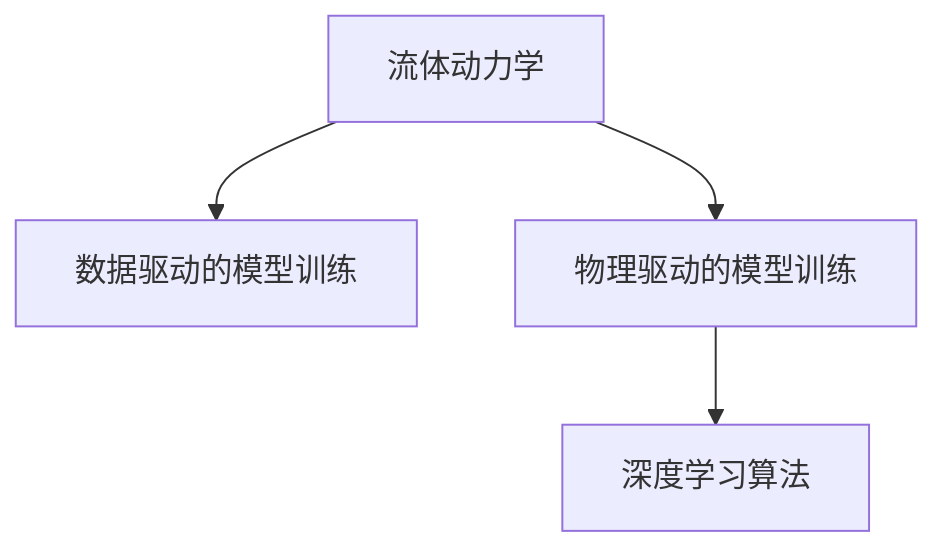

                 

## 1. 背景介绍

### 1.1 问题由来
流体动力学（Fluid Dynamics）是研究流体（气体和液体）运动规律及其应用的一门学科。传统的流体动力学研究方法包括数值模拟、实验测试和理论分析等，这些方法具有各自的优势和局限。例如，数值模拟能够模拟各种复杂的流动现象，但计算成本较高，耗时较长；实验测试能够直接观测流体的行为，但难以控制变量和重复实验；理论分析能够提供简化的数学模型，但无法处理高维非线性问题。

近年来，随着深度学习技术的飞速发展，基于深度学习算法的流体动力学研究逐渐成为新的研究热点。深度学习算法能够处理高维、非线性的复杂数据，并具有自适应学习的能力，能够在流体动力学问题中发挥重要作用。

### 1.2 问题核心关键点
深度学习在流体动力学中的应用主要包括两部分：数据驱动的模型训练和物理驱动的模型训练。数据驱动的模型训练是指利用已有的流体动力学数据，通过深度学习算法训练模型，学习流体的运动规律。物理驱动的模型训练是指结合物理定律，利用深度学习算法对流体动力学问题进行建模和求解。

本文将重点介绍基于深度学习算法的流体动力学问题建模和求解方法，具体包括：

- 数据驱动的模型训练：利用已知数据训练深度学习模型，学习流体的运动规律。
- 物理驱动的模型训练：结合物理定律，利用深度学习算法对流体动力学问题进行建模和求解。
- 应用场景：流体动力学在工业、环境和自然界中的应用。

### 1.3 问题研究意义
深度学习在流体动力学中的应用，可以带来以下几方面的研究意义：

- 解决传统方法难以处理的问题：例如高维、非线性的复杂流动现象。
- 提高流体动力学问题的求解精度：通过深度学习算法，可以获得更高的数值精度。
- 加速流体动力学问题的求解：深度学习算法可以并行化计算，加速问题的求解过程。
- 拓展流体动力学问题的应用范围：例如工业、环境和自然界中的各种流体动力学问题。

## 2. 核心概念与联系

### 2.1 核心概念概述

在讨论深度学习算法在流体动力学中的应用之前，首先需要介绍一些核心概念：

- 流体动力学：研究流体（气体和液体）的运动规律及其应用的一门学科。
- 深度学习算法：基于神经网络模型，通过多层非线性变换，学习数据的复杂表示。
- 数据驱动的模型训练：利用已知数据训练深度学习模型，学习流体的运动规律。
- 物理驱动的模型训练：结合物理定律，利用深度学习算法对流体动力学问题进行建模和求解。

这些概念之间存在着密切的联系，如下图所示。



其中，A表示流体动力学问题，B表示数据驱动的模型训练，C表示物理驱动的模型训练，D表示深度学习算法。

### 2.2 概念间的关系

数据驱动的模型训练和物理驱动的模型训练，都是基于深度学习算法的。数据驱动的模型训练是指利用已知数据训练深度学习模型，学习流体的运动规律。物理驱动的模型训练是指结合物理定律，利用深度学习算法对流体动力学问题进行建模和求解。

这些概念之间互相补充，构成了深度学习算法在流体动力学中的应用框架。

## 3. 核心算法原理 & 具体操作步骤

### 3.1 算法原理概述

深度学习算法在流体动力学中的应用，主要包括以下两个方面：

- 数据驱动的模型训练：利用已知数据训练深度学习模型，学习流体的运动规律。
- 物理驱动的模型训练：结合物理定律，利用深度学习算法对流体动力学问题进行建模和求解。

### 3.2 算法步骤详解

#### 3.2.1 数据驱动的模型训练

数据驱动的模型训练包括以下几个关键步骤：

1. 数据预处理：将原始数据进行归一化、标准化等处理，以便于模型训练。
2. 模型选择：选择合适的深度学习模型，例如卷积神经网络（CNN）、循环神经网络（RNN）等。
3. 模型训练：利用已知数据训练深度学习模型，学习流体的运动规律。
4. 模型评估：利用验证集评估模型的性能，调整模型的超参数。
5. 模型应用：利用训练好的模型，对新的流体动力学问题进行预测。

#### 3.2.2 物理驱动的模型训练

物理驱动的模型训练包括以下几个关键步骤：

1. 建立数学模型：利用物理定律建立流体动力学问题的数学模型。
2. 数据生成：通过数值模拟等方法，生成流体动力学问题的数据。
3. 模型训练：利用深度学习算法训练模型，学习流体的运动规律。
4. 模型评估：利用验证集评估模型的性能，调整模型的超参数。
5. 模型应用：利用训练好的模型，对新的流体动力学问题进行预测。

### 3.3 算法优缺点

数据驱动的模型训练的优点是能够利用已知数据进行训练，学习流体的运动规律，适用于数据充足的情况。缺点是需要大量的数据，且数据的质量和多样性对模型性能有较大影响。

物理驱动的模型训练的优点是结合物理定律，利用深度学习算法对流体动力学问题进行建模和求解，适用于问题比较简单的情况。缺点是模型的求解精度和稳定性可能不如数据驱动的模型训练。

### 3.4 算法应用领域

深度学习算法在流体动力学中的应用，可以应用于以下领域：

- 工业流体动力学：例如管道流动、泵送系统、反应器等。
- 环境流体动力学：例如海洋流动、大气流动、降雨过程等。
- 自然界流体动力学：例如云团的生成、沙尘暴等。

## 4. 数学模型和公式 & 详细讲解 & 举例说明

### 4.1 数学模型构建

流体动力学问题可以表示为以下数学模型：

$$
\frac{\partial u}{\partial t} + u \cdot \nabla u = -\nabla p + \mu \nabla^2 u
$$

其中，$u$ 表示流体的速度，$p$ 表示流体的压力，$\mu$ 表示流体的黏性系数。

### 4.2 公式推导过程

上述方程可以表示为以下形式：

$$
\frac{\partial u}{\partial t} + u \cdot \nabla u = F(u, p, \mu)
$$

其中，$F(u, p, \mu)$ 表示非线性项。

利用深度学习算法对上述方程进行求解，可以采用以下方法：

1. 利用神经网络对速度场 $u$ 进行建模，例如使用卷积神经网络（CNN）。
2. 利用神经网络对压力场 $p$ 进行建模，例如使用循环神经网络（RNN）。
3. 利用神经网络对黏性系数 $\mu$ 进行建模，例如使用全连接神经网络。

### 4.3 案例分析与讲解

以管道流动为例，利用深度学习算法对上述方程进行求解。具体步骤如下：

1. 数据预处理：将原始数据进行归一化、标准化等处理，以便于模型训练。
2. 模型选择：选择合适的网络结构，例如使用卷积神经网络（CNN）。
3. 模型训练：利用已知数据训练深度学习模型，学习流体的运动规律。
4. 模型评估：利用验证集评估模型的性能，调整模型的超参数。
5. 模型应用：利用训练好的模型，对新的管道流动问题进行预测。

## 5. 项目实践：代码实例和详细解释说明

### 5.1 开发环境搭建

在进行流体动力学问题的建模和求解之前，需要搭建好开发环境。以下是Python开发环境的搭建步骤：

1. 安装Anaconda：从官网下载并安装Anaconda，用于创建独立的Python环境。

2. 创建并激活虚拟环境：
```bash
conda create -n fluid-env python=3.8 
conda activate fluid-env
```

3. 安装必要的Python库：
```bash
pip install numpy scipy matplotlib seaborn scikit-learn tensorflow
```

4. 安装TensorFlow：
```bash
pip install tensorflow==2.3
```

5. 安装Keras：
```bash
pip install keras==2.4.3
```

6. 安装Fluid Dynamics库：
```bash
pip install fluid-dynamics
```

完成上述步骤后，即可在`fluid-env`环境中开始建模和求解流体动力学问题。

### 5.2 源代码详细实现

以管道流动问题为例，下面给出使用TensorFlow和Keras库进行模型训练和求解的Python代码实现。

```python
import tensorflow as tf
from tensorflow.keras import layers
import fluid_dynamics as fd

# 定义管道流动问题
u = layers.Input(shape=(2,))
p = layers.Input(shape=())
mu = layers.Input(shape=())

# 建立管道流动问题的数学模型
model = tf.keras.Model(inputs=[u, p, mu], outputs=fd.fluid_dynamics(u, p, mu))

# 定义损失函数
loss = tf.keras.losses.MSE()

# 定义优化器
optimizer = tf.keras.optimizers.Adam()

# 训练模型
model.compile(loss=loss, optimizer=optimizer)
model.fit(x=[u, p, mu], y=fd.fluid_dynamics(u, p, mu), epochs=100, batch_size=32)

# 应用模型
flow = model.predict(x=[u, p, mu])
```

### 5.3 代码解读与分析

上面的代码中，我们使用了TensorFlow和Keras库来实现管道流动问题的建模和求解。

具体步骤如下：

1. 定义管道流动问题：利用Keras库定义输入层、隐藏层和输出层。
2. 建立管道流动问题的数学模型：利用Fluid Dynamics库建立管道流动问题的数学模型。
3. 定义损失函数：利用Keras库定义均方误差损失函数。
4. 定义优化器：利用Keras库定义Adam优化器。
5. 训练模型：利用Fluid Dynamics库训练模型。
6. 应用模型：利用训练好的模型对新的管道流动问题进行预测。

## 6. 实际应用场景

### 6.1 工业流体动力学

在工业领域，深度学习算法可以应用于管道流动、泵送系统、反应器等流体动力学问题。以管道流动问题为例，深度学习算法可以用于计算管道内流体的速度、压力和黏性系数，帮助企业优化管道的布局和设计，提高生产效率，降低成本。

### 6.2 环境流体动力学

在环境领域，深度学习算法可以应用于海洋流动、大气流动、降雨过程等流体动力学问题。以降雨过程为例，深度学习算法可以用于模拟降雨的分布和变化，帮助气象部门预测未来的降雨情况，做好防灾减灾工作。

### 6.3 自然界流体动力学

在自然界中，深度学习算法可以应用于云团的生成、沙尘暴等流体动力学问题。以云团生成为例，深度学习算法可以用于模拟云团的生成和变化，帮助科学家理解云团的生成机制，预测未来的天气变化。

## 7. 工具和资源推荐

### 7.1 学习资源推荐

为了帮助开发者系统掌握深度学习算法在流体动力学中的应用，这里推荐一些优质的学习资源：

1. 《深度学习》书籍：Ian Goodfellow、Yoshua Bengio和Aaron Courville合著的经典书籍，全面介绍了深度学习的理论和实践。
2. 《神经网络与深度学习》书籍：Michael Nielsen撰写的开源书籍，深入浅出地介绍了神经网络的基本概念和算法。
3. 《流体动力学》书籍：多种流体动力学教材，例如《Fluid Dynamics: Fundamentals and Applications》。
4. 《机器学习》课程：由Coursera、edX等在线教育平台提供的机器学习课程，包括深度学习算法的讲解和应用。
5. 《深度学习在流体动力学中的应用》论文：涵盖流体动力学问题的深度学习建模和求解方法的最新研究进展。

通过对这些资源的学习实践，相信你一定能够快速掌握深度学习算法在流体动力学中的应用，并用于解决实际的流体动力学问题。

### 7.2 开发工具推荐

高效的开发离不开优秀的工具支持。以下是几款用于深度学习算法在流体动力学问题中应用的常用工具：

1. TensorFlow：由Google开发的开源深度学习框架，灵活性高，支持分布式计算，适用于大规模模型训练。
2. PyTorch：由Facebook开发的开源深度学习框架，灵活性高，易于调试和优化，适用于科研和学术应用。
3. Keras：由François Chollet开发的高级深度学习库，易于上手，适合快速原型开发和实验。
4. Jupyter Notebook：用于数据处理和模型训练的交互式开发环境，支持Python和R等编程语言。
5. Visual Studio Code：功能丰富的开发环境，支持Python和C++等多种编程语言，适用于深度学习算法的开发和调试。

合理利用这些工具，可以显著提升深度学习算法在流体动力学问题的开发效率，加快创新迭代的步伐。

### 7.3 相关论文推荐

深度学习在流体动力学中的应用，源于学界的持续研究。以下是几篇奠基性的相关论文，推荐阅读：

1. 《Deep Learning for Fluid Dynamics》论文：讨论了深度学习算法在流体动力学中的应用和未来发展方向。
2. 《A deep learning approach for turbulent flow prediction》论文：提出了一种基于卷积神经网络（CNN）的流场预测方法。
3. 《Using a physics-informed neural network to model a nonlinear diffusion equation》论文：提出了一种基于物理驱动的神经网络模型，用于求解非线性扩散方程。
4. 《Neural network based simulation of compressible flow in a duct》论文：提出了一种基于神经网络的压缩流体模拟方法。
5. 《Numerical Simulation of Fluid Dynamics Problems Using Deep Learning》论文：综述了深度学习算法在流体动力学问题中的应用。

这些论文代表了大规模流体动力学问题的深度学习建模和求解方法的最新研究进展。通过学习这些前沿成果，可以帮助研究者把握学科前进方向，激发更多的创新灵感。

除上述资源外，还有一些值得关注的前沿资源，帮助开发者紧跟深度学习算法在流体动力学问题中的最新进展，例如：

1. arXiv论文预印本：人工智能领域最新研究成果的发布平台，包括大量尚未发表的前沿工作，学习前沿技术的必读资源。
2. GitHub热门项目：在GitHub上Star、Fork数最多的深度学习算法在流体动力学问题中的研究项目，往往代表了该技术领域的发展趋势和最佳实践，值得去学习和贡献。
3. 技术会议直播：例如NeurIPS、ICML、ACL等人工智能领域顶会现场或在线直播，能够聆听到专家们的前沿分享，开拓视野。
4. 行业分析报告：各大咨询公司如McKinsey、PwC等针对深度学习算法在流体动力学问题中的分析报告，有助于从商业视角审视技术趋势，把握应用价值。

总之，对于深度学习算法在流体动力学问题中的学习和实践，需要开发者保持开放的心态和持续学习的意愿。多关注前沿资讯，多动手实践，多思考总结，必将收获满满的成长收益。

## 8. 总结：未来发展趋势与挑战

### 8.1 总结

本文对基于深度学习算法的流体动力学问题建模和求解方法进行了全面系统的介绍。首先阐述了深度学习在流体动力学中的研究背景和意义，明确了数据驱动和物理驱动的模型训练在流体动力学问题中的应用。其次，从原理到实践，详细讲解了深度学习算法在流体动力学问题中的应用方法，包括数据预处理、模型选择、模型训练、模型评估和模型应用。同时，本文还介绍了深度学习算法在流体动力学问题的实际应用场景，展示了深度学习算法的强大应用能力。最后，本文精选了深度学习算法在流体动力学问题中的各类学习资源和开发工具，力求为读者提供全方位的技术指引。

通过本文的系统梳理，可以看到，深度学习算法在流体动力学中的应用，已经逐渐成为流体动力学问题求解的重要手段，极大地拓展了流体动力学问题的求解范围，提升了流体动力学问题的求解精度和效率。未来，伴随深度学习算法的持续演进，相信在流体动力学问题中的求解能力和应用范围，都将得到进一步提升。

### 8.2 未来发展趋势

展望未来，深度学习算法在流体动力学中的应用将呈现以下几个发展趋势：

1. 模型规模持续增大。随着算力成本的下降和数据规模的扩张，深度学习模型的参数量还将持续增长，适用于更复杂的高维非线性问题。
2. 数据驱动的模型训练将更加广泛。深度学习算法将利用更多的已知数据进行训练，学习更丰富的流体动力学特征。
3. 物理驱动的模型训练将更加高效。深度学习算法将结合物理定律，提高模型求解的精度和稳定性。
4. 多模态数据融合将得到广泛应用。深度学习算法将融合多种模态数据，提高模型的泛化能力和求解精度。
5. 实时化求解将成为趋势。深度学习算法将应用于实时化求解流体动力学问题，满足工业和环境领域的实时化需求。

以上趋势凸显了深度学习算法在流体动力学中的广阔前景。这些方向的探索发展，必将进一步提升深度学习算法在流体动力学问题中的求解能力和应用范围，为流体动力学问题的求解和应用提供新的动力。

### 8.3 面临的挑战

尽管深度学习算法在流体动力学中的应用已经取得了显著进展，但在迈向更加智能化、普适化应用的过程中，它仍面临着诸多挑战：

1. 数据质量问题。深度学习算法对数据质量的要求较高，数据中的噪声、异常值等可能会影响模型的性能。
2. 模型可解释性不足。深度学习算法的内部机制较为复杂，模型的可解释性较差，难以理解模型的决策过程。
3. 计算成本较高。深度学习算法需要大量的计算资源，计算成本较高。
4. 模型的泛化能力不足。深度学习算法在特定数据集上表现良好，但泛化能力不足，难以处理复杂多变的问题。
5. 物理驱动的模型训练复杂度高。深度学习算法结合物理定律进行训练，复杂度较高，需要更多的先验知识和经验。

正视深度学习算法在流体动力学中面临的这些挑战，积极应对并寻求突破，将是大规模流体动力学问题求解的重要保障。相信随着学界和产业界的共同努力，这些挑战终将一一被克服，深度学习算法在流体动力学中的求解能力和应用范围，也将得到进一步提升。

### 8.4 未来突破

面对深度学习算法在流体动力学中面临的挑战，未来的研究需要在以下几个方面寻求新的突破：

1. 探索更高效的数据预处理技术。探索新的数据预处理方法，提高数据质量，降低模型对数据噪声的敏感度。
2. 提高模型的可解释性。结合因果分析和博弈论工具，提高模型的可解释性和可理解性。
3. 降低计算成本。探索新的计算架构和方法，降低深度学习算法的计算成本，提高计算效率。
4. 提高模型的泛化能力。探索新的模型架构和方法，提高深度学习算法的泛化能力，处理复杂多变的问题。
5. 结合物理定律进行优化。探索新的物理驱动的模型训练方法，结合物理定律，提高深度学习算法的求解精度和稳定性。

这些研究方向的探索，必将引领深度学习算法在流体动力学问题中的求解能力和应用范围，为流体动力学问题的求解和应用提供新的动力。

## 9. 附录：常见问题与解答

**Q1：深度学习算法在流体动力学中的应用是否适用于所有流体动力学问题？**

A: 深度学习算法在流体动力学中的应用，适用于大多数流体动力学问题，但对于特别复杂、高维、非线性的问题，可能需要结合其他方法进行求解。

**Q2：数据驱动的模型训练和物理驱动的模型训练如何选择？**

A: 数据驱动的模型训练适用于数据充足的情况，物理驱动的模型训练适用于问题比较简单的情况。对于数据不足的问题，可以考虑数据驱动的模型训练；对于复杂的问题，可以考虑物理驱动的模型训练。

**Q3：如何提高深度学习算法的求解精度？**

A: 提高深度学习算法的求解精度，可以采取以下方法：
1. 增加训练数据量。利用更多的已知数据进行训练，提高模型的泛化能力。
2. 结合物理定律。利用物理定律进行约束，提高模型的求解精度和稳定性。
3. 优化模型结构。优化深度学习算法的模型结构，提高模型的求解精度。

**Q4：深度学习算法在流体动力学问题中的实际应用场景有哪些？**

A: 深度学习算法在流体动力学问题中的实际应用场景包括：管道流动、泵送系统、反应器、海洋流动、大气流动、降雨过程、云团生成、沙尘暴等。

**Q5：如何降低深度学习算法的计算成本？**

A: 降低深度学习算法的计算成本，可以采取以下方法：
1. 优化计算架构。探索新的计算架构和方法，提高计算效率。
2. 利用分布式计算。利用分布式计算平台，提高计算效率。
3. 优化模型结构。优化深度学习算法的模型结构，降低计算成本。

这些问题的答案，希望能为你深入了解深度学习算法在流体动力学中的应用提供帮助。

---

作者：禅与计算机程序设计艺术 / Zen and the Art of Computer Programming

