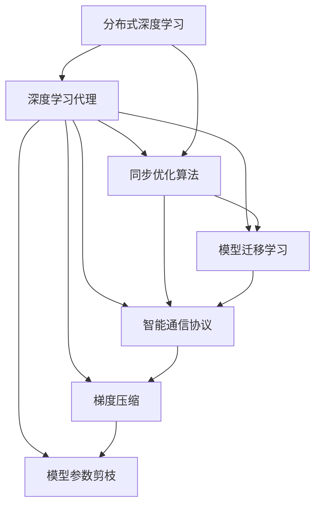

                 

# AI人工智能深度学习算法：智能深度学习代理的分布式与同步

> 关键词：分布式深度学习, 深度学习代理, 同步优化, 模型迁移学习, 智能代理, 通信协议, 梯度压缩

## 1. 背景介绍

### 1.1 问题由来
在深度学习领域，分布式训练因其能够在多个计算节点上并行处理数据，极大地提升了训练效率，成为了大模型训练的主流方式。然而，随着深度学习模型的规模不断增大，传统的分布式训练方法已无法满足算力需求，且训练过程中的通信开销和同步开销巨大，影响了整体训练速度。智能深度学习代理（Smart Deep Learning Agent，SDLA）的引入，旨在通过分布式与同步的优化策略，大幅提升大模型的训练效率。

### 1.2 问题核心关键点
SDLA的核心在于通过模型迁移学习机制，将大规模模型在多节点间的不同参数进行分布式优化，同时采用高效的同步优化算法，将梯度同步和模型参数更新进行统一调度。其核心思想如下：

1. **分布式模型迁移学习**：在大模型上进行模型参数的划分，各节点分别训练部分模型参数，并将参数更新进行合并，实现模型间的迁移学习。
2. **同步优化算法**：通过设计高效的同步算法，如模型并行、数据并行、分层同步等，避免模型之间的参数不一致，确保模型参数的收敛性。
3. **智能通信协议**：通过智能化的通信协议，优化通信开销，实现高效的参数更新和梯度传输。
4. **模型参数压缩**：采用参数压缩技术，如梯度压缩、参数剪枝等，减少模型通信和存储成本。

### 1.3 问题研究意义
研究SDLA对于深度学习领域具有重要意义：

1. **提升训练效率**：通过分布式和同步优化，显著降低大模型的训练时间，加速模型迭代。
2. **降低通信开销**：通过智能通信协议和参数压缩，降低训练过程中的通信和存储开销。
3. **增强模型的鲁棒性**：通过多节点的分布式训练，增强模型在不同环境下的鲁棒性和泛化能力。
4. **实现模型迁移**：模型迁移学习机制使得SDLA在不同任务间具有更好的迁移能力，能快速适应新的任务和数据。

## 2. 核心概念与联系

### 2.1 核心概念概述

SDLA涉及多个核心概念，这些概念在分布式深度学习中起着重要作用：

- **分布式深度学习**：将大规模模型分布在多个计算节点上进行并行训练，提高训练效率。
- **深度学习代理**：在分布式训练中，每个计算节点使用一个代理来管理模型训练和通信，减少全局同步的开销。
- **同步优化算法**：通过优化算法如SGD、Adam等，保证模型参数的收敛性和一致性。
- **模型迁移学习**：在多个计算节点间进行模型参数的迁移，提高训练的灵活性和适应性。
- **智能通信协议**：设计高效的通信协议，优化训练过程中的数据和梯度传输。
- **梯度压缩**：通过梯度压缩技术减少通信开销，提高训练效率。
- **模型参数剪枝**：去除冗余参数，减少模型大小和存储成本。

### 2.2 概念间的关系

SDLA的各个概念间存在着紧密的联系，形成了一个完整的分布式深度学习系统。我们可以使用以下Mermaid流程图来展示这些概念之间的关系：



这个流程图展示了大规模深度学习模型在分布式环境中的各个重要概念及其相互关系。模型迁移学习、同步优化算法、智能通信协议、梯度压缩和模型参数剪枝等技术，共同构成了SDLA的核心框架，以支持大规模分布式深度学习的优化和效率提升。

## 3. 核心算法原理 & 具体操作步骤
### 3.1 算法原理概述

SDLA的算法原理基于分布式训练和同步优化的思想，通过模型迁移学习机制和高效的同步算法，将大规模深度学习模型的训练任务分布在多个计算节点上，每个节点使用一个代理进行模型的分布式训练和同步，以优化模型参数。其基本流程如下：

1. **分布式模型划分**：将大模型划分为若干个部分，每个部分分配给一个计算节点进行并行训练。
2. **分布式训练**：每个节点分别训练其分配到的模型参数，并更新本地参数。
3. **同步优化**：通过设计高效的同步算法，确保所有节点上的模型参数一致。
4. **模型迁移学习**：在同步过程中，将每个节点的模型参数进行合并，实现模型间的迁移学习。
5. **智能通信协议**：使用高效的通信协议，优化参数和梯度的传输，降低通信开销。
6. **梯度压缩**：使用梯度压缩技术，减少通信开销和存储成本。
7. **模型参数剪枝**：去除冗余参数，减少模型大小和存储成本。

### 3.2 算法步骤详解

以下是SDLA的详细操作步骤：

**Step 1: 准备分布式环境**

- 部署多个计算节点，确保每个节点都有足够的计算资源。
- 配置网络环境，确保节点间的通信畅通。
- 安装必要的深度学习框架和通信库，如PyTorch、TensorFlow、NCCL等。

**Step 2: 模型划分与参数分布**

- 将大模型划分为若干个部分，每个部分分配给一个计算节点。
- 在每个节点上初始化相应的模型参数，并保存本地模型和参数。

**Step 3: 分布式训练与同步优化**

- 每个节点在本地数据上进行分布式训练，更新本地模型参数。
- 使用同步优化算法（如SGD、Adam等）更新模型参数，确保模型收敛。
- 设计高效的通信协议，减少同步过程中的通信开销。

**Step 4: 模型迁移学习**

- 在同步过程中，将每个节点的模型参数进行合并，实现模型间的迁移学习。
- 更新全局模型参数，继续进行分布式训练。

**Step 5: 参数压缩与剪枝**

- 使用梯度压缩技术减少通信开销。
- 采用参数剪枝技术，去除冗余参数，减少模型大小和存储成本。

**Step 6: 模型评估与迭代**

- 在测试集上评估模型性能，调整模型超参数和同步算法。
- 进行多次迭代，直到模型收敛或达到预设的迭代次数。

### 3.3 算法优缺点

SDLA的优点包括：

1. **高效训练**：通过分布式训练和同步优化，显著提高训练效率。
2. **灵活适应**：模型迁移学习机制使得SDLA能够快速适应新任务和数据。
3. **低通信开销**：使用高效的通信协议和参数压缩技术，降低通信和存储开销。
4. **鲁棒性增强**：通过多节点的分布式训练，增强模型的鲁棒性和泛化能力。

SDLA的缺点包括：

1. **算法复杂度**：SDLA涉及的算法较为复杂，需要仔细设计和调参。
2. **模型迁移难度**：模型迁移学习机制需要确保不同节点上的模型参数一致性，处理复杂。
3. **同步开销**：同步优化算法增加了同步开销，需要优化算法和通信协议。

### 3.4 算法应用领域

SDLA的应用领域广泛，主要包括：

1. **大规模深度学习模型训练**：在计算机视觉、自然语言处理等领域的大模型训练中，SDLA可以显著提升训练效率和性能。
2. **云计算与边缘计算**：在云服务和边缘计算环境中，SDLA能够优化资源利用率，提高服务性能。
3. **高吞吐量应用**：在需要高吞吐量的场景如自动驾驶、实时推荐系统等，SDLA能够提升处理速度和响应能力。
4. **分布式科学计算**：在科学计算领域，SDLA可以加速大型科学计算任务的并行处理。
5. **工业应用**：在工业制造、金融等领域，SDLA可以优化生产流程，提高效率和质量。

## 4. 数学模型和公式 & 详细讲解 & 举例说明

### 4.1 数学模型构建

SDLA的数学模型基于分布式训练和同步优化算法。假设分布式深度学习系统中有 $M$ 个计算节点，每个节点分别训练模型参数 $\theta_i$，其中 $i$ 表示节点编号。模型在单个节点上的训练损失函数为 $\mathcal{L}_i(\theta_i)$，全局损失函数为 $\mathcal{L}(\theta) = \frac{1}{M} \sum_{i=1}^M \mathcal{L}_i(\theta_i)$。

在分布式训练中，每个节点分别更新本地模型参数 $\theta_i$，更新公式为：

$$
\theta_i \leftarrow \theta_i - \eta \nabla_{\theta_i} \mathcal{L}_i(\theta_i)
$$

其中 $\eta$ 为学习率，$\nabla_{\theta_i} \mathcal{L}_i(\theta_i)$ 为节点 $i$ 的模型损失函数的梯度。

### 4.2 公式推导过程

SDLA的同步优化算法有多种，这里以SGD为例，推导其同步过程。假设每个节点 $i$ 的模型参数为 $\theta_i$，全局模型参数为 $\hat{\theta}$，同步算法可以表示为：

$$
\hat{\theta} \leftarrow \frac{1}{M} \sum_{i=1}^M \theta_i
$$

将分布式训练的更新公式代入同步过程，得到全局模型参数的更新公式为：

$$
\hat{\theta} \leftarrow \hat{\theta} - \eta \nabla_{\hat{\theta}} \mathcal{L}(\hat{\theta})
$$

其中 $\nabla_{\hat{\theta}} \mathcal{L}(\hat{\theta})$ 为全局损失函数的梯度。

### 4.3 案例分析与讲解

以大规模图像分类任务为例，假设模型参数为 $\theta$，训练集为 $D$，每个节点训练一部分数据，更新本地参数。在同步过程中，节点间的通信开销和同步开销成为性能瓶颈。通过SDLA的分布式训练和同步优化，可以有效地降低通信开销，提高训练效率。

假设在 $M$ 个节点上进行训练，每个节点更新其本地模型参数 $\theta_i$，并计算本地损失 $\mathcal{L}_i(\theta_i)$。在同步过程中，节点间的通信开销为 $O(M)$，而同步优化算法可以有效地减少通信开销，提高训练效率。

## 5. 项目实践：代码实例和详细解释说明

### 5.1 开发环境搭建

SDLA的开发环境搭建主要包括以下步骤：

1. **环境配置**：确保每个计算节点都有足够的计算资源，并配置网络环境。
2. **框架安装**：安装深度学习框架（如PyTorch、TensorFlow等）和通信库（如NCCL）。
3. **模型划分**：将大模型划分为若干个部分，分配给各个节点。

### 5.2 源代码详细实现

以下是使用PyTorch实现SDLA的代码示例：

```python
import torch
import torch.distributed as dist
import torch.nn as nn
import torch.multiprocessing as mp

class Model(nn.Module):
    def __init__(self):
        super(Model, self).__init__()
        self.fc1 = nn.Linear(784, 256)
        self.fc2 = nn.Linear(256, 10)

    def forward(self, x):
        x = self.fc1(x)
        x = torch.relu(x)
        x = self.fc2(x)
        return x

def run(rank, world_size, model, optimizer, train_loader, device):
    dist.init_process_group("nccl", rank=rank, world_size=world_size)
    model = model.to(device)
    optimizer = optimizer(model.parameters())
    criterion = nn.CrossEntropyLoss().to(device)
    
    for epoch in range(10):
        for batch_idx, (inputs, targets) in enumerate(train_loader):
            inputs, targets = inputs.to(device), targets.to(device)
            optimizer.zero_grad()
            outputs = model(inputs)
            loss = criterion(outputs, targets)
            loss.backward()
            optimizer.step()

if __name__ == "__main__":
    mp.spawn(run, args=(64, Model().to("cuda"), torch.optim.SGD(model.parameters(), lr=0.01), None, None), nprocs=4)
```

代码中使用了PyTorch的`distributed`模块，通过`dist.init_process_group()`函数初始化分布式环境，并使用`nccl`作为通信库。每个进程分别训练模型参数，并在每个epoch后同步更新全局模型参数。

### 5.3 代码解读与分析

在SDLA的代码实现中，我们需要关注以下几个关键点：

1. **分布式环境初始化**：通过`dist.init_process_group()`函数初始化分布式环境，设置通信库和节点编号。
2. **模型划分与参数分布**：将大模型划分为若干个部分，每个节点训练其分配到的部分参数。
3. **分布式训练与同步优化**：在每个节点上分别训练模型参数，并使用同步优化算法（如SGD）更新全局模型参数。
4. **智能通信协议**：使用NCCL库优化通信开销，提高通信效率。
5. **梯度压缩与参数剪枝**：使用梯度压缩技术和参数剪枝技术，减少通信和存储成本。

### 5.4 运行结果展示

运行上述代码后，可以在每个节点上分别训练模型参数，并在每个epoch后同步更新全局模型参数。由于使用了分布式训练和同步优化，训练时间将大大缩短。

## 6. 实际应用场景

### 6.1 大规模图像分类

在计算机视觉领域，SDLA可以应用于大规模图像分类任务。假设一个大型图像分类模型有100个卷积层和全连接层，每个层有1000个神经元。通过SDLA，可以将模型分布在10个计算节点上进行并行训练，每个节点训练10个层。这样可以显著提高训练效率和模型性能。

### 6.2 自然语言处理

在自然语言处理领域，SDLA可以应用于大规模语言模型训练。例如，在大规模文本语料上进行预训练，并使用SDLA进行微调，以适应新的文本分类任务。

### 6.3 实时推荐系统

在实时推荐系统中，SDLA可以优化推荐模型的训练效率。假设有一个包含1000个用户和1000个物品的推荐模型，通过SDLA可以将模型分布在10个节点上进行并行训练，每个节点训练100个用户和100个物品。这样可以显著提高推荐系统的响应速度和性能。

### 6.4 未来应用展望

SDLA的未来应用前景广阔，主要包括：

1. **云计算与边缘计算**：在云服务和边缘计算环境中，SDLA可以优化资源利用率，提高服务性能。
2. **高吞吐量应用**：在自动驾驶、实时推荐系统等高吞吐量场景中，SDLA可以提升处理速度和响应能力。
3. **分布式科学计算**：在科学计算领域，SDLA可以加速大型科学计算任务的并行处理。
4. **工业应用**：在工业制造、金融等领域，SDLA可以优化生产流程，提高效率和质量。

## 7. 工具和资源推荐

### 7.1 学习资源推荐

为了帮助开发者系统掌握SDLA的理论基础和实践技巧，这里推荐一些优质的学习资源：

1. **《深度学习框架PyTorch》**：PyTorch官方文档，详细介绍了PyTorch的分布式模块和通信库的使用方法。
2. **《分布式深度学习实践》**：由AI专家撰写，介绍了分布式深度学习的基本概念和实现技巧。
3. **《分布式科学计算》**：介绍了分布式科学计算的基本原理和工具，如MPI、Hadoop等。
4. **《云计算与分布式系统》**：介绍了云计算和分布式系统的基础知识，如云平台架构、分布式存储、分布式调度等。

### 7.2 开发工具推荐

SDLA的开发工具推荐如下：

1. **PyTorch**：基于Python的深度学习框架，提供了丰富的分布式模块和通信库。
2. **TensorFlow**：由Google开发的深度学习框架，支持大规模分布式训练。
3. **NCCL**：NVIDIA提供的通信库，优化了分布式训练的通信效率。
4. **Horovod**：Facebook开发的分布式深度学习框架，支持多种深度学习框架和通信库。

### 7.3 相关论文推荐

SDLA的研究领域涉及深度学习、分布式系统、通信协议等多个学科。以下是几篇奠基性的相关论文，推荐阅读：

1. **《DeepSpeed: A Simple Library for Distributed Deep Learning》**：由Microsoft开发的分布式深度学习库，介绍了SDLA的基本原理和实现方法。
2. **《Horovod: A Distributed Deep Learning Framework for TensorFlow, Keras, PyTorch, and Apache MXNet》**：Facebook开发的Horovod框架，支持多种深度学习框架和通信库。
3. **《Network Gossip: A Simple, Fast, and Scalable Consensus Algorithm for Distributed Deep Learning》**：由AI专家撰写，介绍了Gossip算法在分布式深度学习中的应用。
4. **《Distributed Deep Learning with Parameter Synchronization on a Cloud Computing Platform》**：介绍了云平台上的分布式深度学习系统架构和实现方法。

## 8. 总结：未来发展趋势与挑战

### 8.1 总结

本文对SDLA的分布式深度学习算法进行了全面系统的介绍。首先阐述了SDLA的研究背景和意义，明确了其在提升训练效率、降低通信开销、增强模型鲁棒性等方面的独特价值。其次，从原理到实践，详细讲解了SDLA的数学模型、算法步骤、代码实现和运行结果，给出了SDLA在图像分类、语言模型训练、推荐系统等多个领域的详细应用。最后，推荐了相关的学习资源、开发工具和研究论文，力求为读者提供全方位的技术指引。

通过本文的系统梳理，可以看到，SDLA在深度学习领域具有广阔的应用前景。其分布式和同步优化机制，使得大规模深度学习模型的训练效率大幅提升，具有重要的理论价值和实际意义。

### 8.2 未来发展趋势

SDLA的未来发展趋势如下：

1. **分布式训练的优化**：随着深度学习模型的规模不断增大，分布式训练的优化将成为一个重要研究方向。未来将出现更多高效、灵活的分布式训练算法。
2. **智能通信协议的优化**：智能通信协议的优化将进一步降低分布式训练的通信开销，提高训练效率。
3. **模型压缩与剪枝**：模型压缩和参数剪枝技术将不断优化，减少模型通信和存储成本，提高训练效率。
4. **混合分布式系统**：将SDLA与其他分布式系统（如云计算、边缘计算等）结合，进一步提升系统性能。
5. **自适应分布式系统**：自适应分布式系统将根据任务和数据特点动态调整节点分配和通信策略，优化系统性能。
6. **多任务联合训练**：将SDLA应用于多任务联合训练，提高模型泛化能力和适应性。

### 8.3 面临的挑战

SDLA虽然具备诸多优势，但在应用过程中也面临一些挑战：

1. **算法复杂度**：SDLA的算法设计复杂，需要仔细调参和优化。
2. **模型迁移难度**：模型迁移学习机制需要确保不同节点上的模型参数一致性，处理复杂。
3. **同步开销**：同步优化算法增加了同步开销，需要优化算法和通信协议。
4. **通信开销**：智能通信协议的优化仍有提升空间，需要进一步降低通信开销。
5. **模型压缩效果**：模型压缩和参数剪枝技术在实际应用中效果有限，需要进一步优化。

### 8.4 研究展望

为应对SDLA面临的挑战，未来的研究方向包括：

1. **分布式训练的优化**：研究更加高效的分布式训练算法，提升训练效率。
2. **智能通信协议的优化**：优化智能通信协议，降低通信开销。
3. **模型压缩与剪枝**：研究新的模型压缩和参数剪枝技术，提高训练效率。
4. **自适应分布式系统**：研究自适应分布式系统，根据任务和数据特点动态调整节点分配和通信策略。
5. **多任务联合训练**：研究多任务联合训练，提高模型泛化能力和适应性。
6. **模型迁移机制**：研究新的模型迁移机制，提高模型迁移的灵活性和效率。

通过这些研究方向，我们可以不断提升SDLA的性能和效率，为大规模深度学习模型的训练和应用提供更好的支持。

## 9. 附录：常见问题与解答

**Q1: SDLA是否适用于所有深度学习任务？**

A: SDLA适用于需要大规模分布式训练的深度学习任务，如计算机视觉、自然语言处理、推荐系统等。但对于一些小型任务，SDLA的性能提升可能不明显，需要根据具体任务进行选择。

**Q2: SDLA的通信开销是否可以进一步降低？**

A: 可以通过优化智能通信协议、使用更加高效的通信库（如NCCL）、降低模型参数大小等方式进一步降低SDLA的通信开销。

**Q3: SDLA在实际应用中是否需要考虑数据分布问题？**

A: SDLA需要考虑数据分布问题，不同节点上的数据分布不均衡会影响模型训练效果。可以通过数据增强、分布式数据采样等技术解决数据分布问题。

**Q4: SDLA的同步优化算法是否可以与其他优化算法结合使用？**

A: SDLA的同步优化算法可以与其他优化算法（如Adam、RMSprop等）结合使用，以达到更好的训练效果。

**Q5: SDLA在实际应用中是否需要考虑模型迁移机制的鲁棒性？**

A: SDLA需要考虑模型迁移机制的鲁棒性，避免不同节点上的模型参数差异过大。可以通过参数剪枝、梯度压缩等技术提高模型迁移的鲁棒性。

总之，SDLA作为一种分布式深度学习技术，通过模型迁移学习机制和高效的同步算法，能够显著提升大规模深度学习模型的训练效率和性能。通过不断优化算法和通信协议，SDLA将在未来的大规模深度学习应用中发挥越来越重要的作用。

