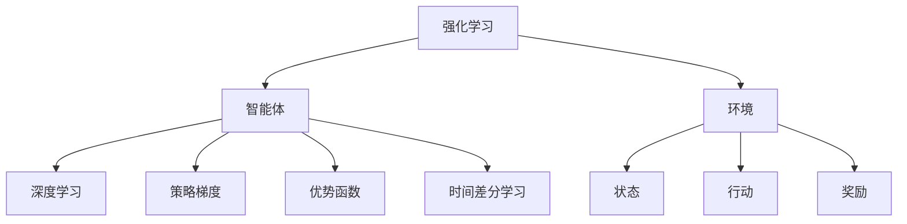
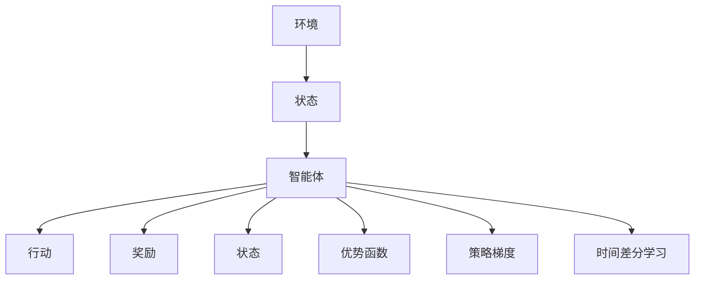
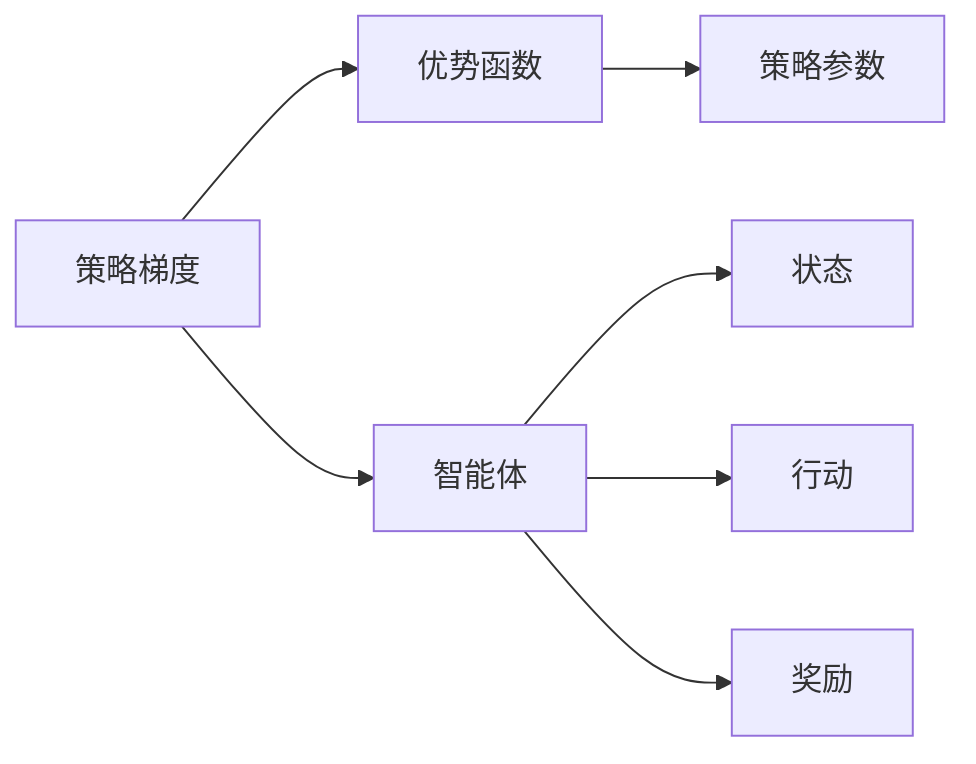
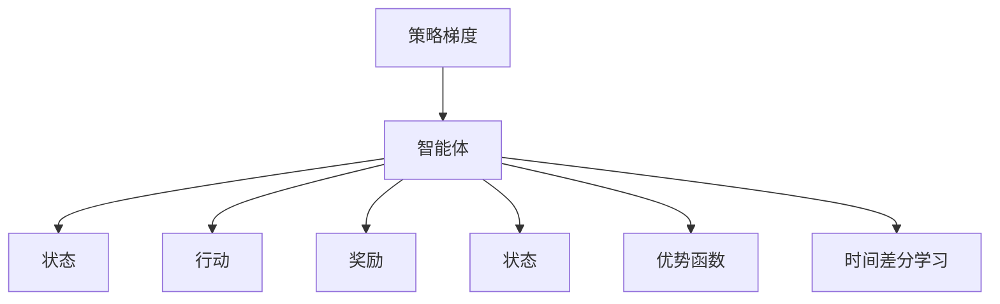
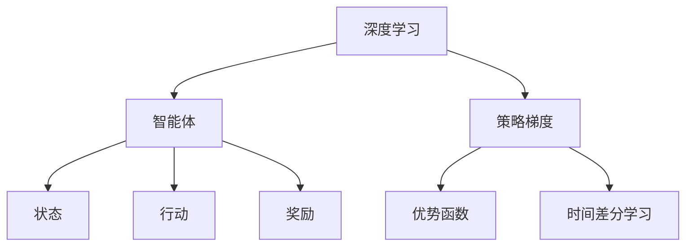

                 

# AI人工智能深度学习算法：智能深度学习代理的自主行为与规划策略

> 关键词：人工智能,深度学习,自主行为,规划策略,强化学习,RL,AlphaGo,策略梯度,优势函数,深度强化学习,时间差分学习,神经网络,深度神经网络,行为策略,路径规划

## 1. 背景介绍

### 1.1 问题由来
近年来，随着深度学习技术在人工智能领域的发展，深度强化学习(DRL)逐渐成为实现自主行为与规划策略研究的热点方向。DRL结合了深度学习和强化学习的优点，通过智能体与环境交互，在不断优化策略的同时提升决策能力，实现更为复杂和高效的行为。

传统AI系统往往依赖于规则或专家知识进行决策，缺乏自适应性和学习能力。而DRL系统通过模拟环境进行训练，可以在不明确规则的情况下，自主学习最优策略，应用于各种自主导航、智能控制等任务。

AlphaGo的胜利引发了人们对深度强化学习的极大兴趣，展示了其在复杂策略空间中的卓越表现。在连续对抗游戏、机器人控制、自动驾驶等众多领域，DRL也展现了其强大的应用潜力。

### 1.2 问题核心关键点
深度强化学习(DRL)的核心思想是：在智能体与环境的交互过程中，通过奖惩机制指导智能体的行为选择，同时利用深度神经网络(DNN)进行策略表示和优化。

具体来说，DRL涉及以下几个关键点：

1. **智能体(Agent)**：自主学习的决策系统，接收环境状态，输出行动策略。
2. **环境(Environment)**：智能体所在的虚拟或现实世界，提供状态反馈和奖惩信号。
3. **状态(State)**：环境的具体状态描述，如位置、速度、视觉信息等。
4. **行动(Action)**：智能体的决策输出，如移动、跳跃、击打等。
5. **奖励(Reward)**：环境对智能体行动的奖惩反馈，如正负奖励、状态转移等。

DRL的目标是设计一个智能体，通过学习最优策略，在特定环境下最大化累积奖励。

### 1.3 问题研究意义
DRL在实现自主行为与规划策略方面的研究意义重大，具有以下特点：

1. **自适应性**：DRL系统能够自主学习环境模型，适应复杂多变的任务要求。
2. **泛化能力**：通过在大规模环境中进行训练，DRL系统能够泛化到新的、未见过的环境，保持稳健性能。
3. **学习效率**：结合深度学习的强大表征能力和强化学习的行为优化机制，DRL系统能够快速收敛到最优策略。
4. **应用广泛**：从游戏、机器人到自动驾驶、医疗等领域，DRL展示出其强大的应用前景和潜力。
5. **安全可靠**：通过对智能体的训练和验证，DRL系统能够实现更安全、更可靠的行为决策。

## 2. 核心概念与联系

### 2.1 核心概念概述

为更好地理解深度强化学习算法，本节将介绍几个密切相关的核心概念：

- **强化学习(Reinforcement Learning, RL)**：通过智能体与环境的交互，学习最优决策策略的框架。在每个时间步，智能体根据当前状态选择行动，环境给予奖励，智能体根据奖励调整策略。

- **深度学习(Deep Learning, DL)**：利用多层神经网络进行特征提取和表示学习的技术。深度学习通过自动学习特征，可以从原始数据中提取高层次的语义信息。

- **深度强化学习(Deep Reinforcement Learning, DRL)**：结合深度学习和强化学习的优点，利用深度神经网络进行策略表示和优化。DRL在处理复杂、高维状态空间时具有优势。

- **策略梯度(Strategy Gradient)**：利用梯度下降优化策略参数，通过反向传播更新网络权重。

- **优势函数(Advantage Function)**：衡量每个动作的相对优势，通过评估函数估计奖惩信号的真实值。

- **时间差分学习(Time Difference Learning, TD Learning)**：基于贝尔曼方程（Bellman Equation）的强化学习算法，通过估计状态值，不断更新Q值。

这些核心概念之间的逻辑关系可以通过以下Mermaid流程图来展示：



这个流程图展示了大语言模型微调过程中各个核心概念的关系：

1. 强化学习通过智能体与环境的交互，学习最优策略。
2. 智能体利用深度学习进行策略表示。
3. 策略梯度通过梯度下降优化策略参数。
4. 优势函数用于衡量动作的相对优势。
5. 时间差分学习通过估计状态值，更新Q值。

### 2.2 概念间的关系

这些核心概念之间存在着紧密的联系，形成了深度强化学习的完整生态系统。下面我通过几个Mermaid流程图来展示这些概念之间的关系。

#### 2.2.1 深度强化学习的整体架构



这个流程图展示了深度强化学习的基本流程：

1. 环境提供状态，智能体根据状态输出行动。
2. 环境给予奖励，智能体根据奖励调整策略。
3. 利用优势函数估计每个动作的优势，优化策略梯度。
4. 时间差分学习估计状态值，更新Q值。

#### 2.2.2 策略梯度和优势函数的关系



这个流程图展示了策略梯度和优势函数之间的关系：

1. 智能体根据状态输出行动，并接收环境奖励。
2. 利用优势函数估计动作的优势。
3. 策略梯度通过优势函数优化策略参数。

#### 2.2.3 策略梯度和时间差分学习的关系



这个流程图展示了策略梯度和时间差分学习之间的关系：

1. 智能体根据状态输出行动，并接收环境奖励。
2. 利用优势函数估计动作的优势。
3. 时间差分学习估计状态值，更新Q值。
4. 策略梯度根据Q值更新策略参数。

### 2.3 核心概念的整体架构

最后，我们用一个综合的流程图来展示这些核心概念在大语言模型微调过程中的整体架构：



这个综合流程图展示了从深度学习到智能体决策的完整流程：

1. 深度学习用于策略表示。
2. 智能体根据状态输出行动，并接收环境奖励。
3. 利用优势函数估计动作的优势。
4. 时间差分学习估计状态值，更新Q值。
5. 策略梯度根据Q值更新策略参数。

通过这些流程图，我们可以更清晰地理解深度强化学习算法的工作原理和优化方向。

## 3. 核心算法原理 & 具体操作步骤
### 3.1 算法原理概述

深度强化学习算法的核心思想是：在智能体与环境的交互过程中，通过奖惩机制指导智能体的行为选择，同时利用深度神经网络进行策略表示和优化。

具体来说，DRL涉及以下几个关键步骤：

1. **策略表示**：利用深度神经网络进行策略表示，将策略参数化，方便进行优化。
2. **行为选择**：根据当前状态选择行动策略，具体实现方式包括ε-greedy策略、Softmax策略等。
3. **环境交互**：智能体在环境中执行行动，接收环境状态反馈和奖励。
4. **策略优化**：利用策略梯度方法优化策略参数，通过梯度下降更新网络权重。

### 3.2 算法步骤详解

基于深度强化学习的自主行为与规划策略，一般包括以下几个关键步骤：

**Step 1: 准备环境与模型**

- 选择合适的深度神经网络作为策略表示模型。
- 设置环境参数和动作空间，构建模拟环境或真实环境。
- 确定智能体的目标，例如最大化累积奖励。

**Step 2: 初始化模型参数**

- 随机初始化神经网络权重，作为策略的初始表示。

**Step 3: 策略训练**

- 循环执行以下步骤：
  1. 智能体接收当前状态。
  2. 根据当前状态和策略选择行动。
  3. 执行行动并接收环境反馈，包括下一个状态和奖励。
  4. 利用状态和奖励更新策略参数，例如通过策略梯度方法。

**Step 4: 性能评估**

- 在训练过程中，定期在测试环境中评估模型性能。
- 记录每轮训练的累积奖励、收敛速度、策略参数等关键指标。

**Step 5: 模型应用**

- 将训练好的模型应用于实际环境中，执行自主行为。
- 根据实际反馈不断调整模型参数，持续优化行为策略。

### 3.3 算法优缺点

基于深度强化学习的自主行为与规划策略，具有以下优点：

1. **高效学习**：结合深度学习和强化学习的优势，DRL系统可以高效地学习最优策略。
2. **鲁棒性**：通过与环境交互，DRL系统能够适应复杂、不确定的环境，提高决策鲁棒性。
3. **灵活性**：DRL系统可以根据环境变化，自主调整策略，具备较强的适应能力。
4. **可扩展性**：DRL模型可以通过扩展神经网络结构，处理更复杂、高维的状态空间。

同时，DRL也存在一些局限性：

1. **样本效率**：在复杂环境中，DRL系统需要大量样本进行训练，可能面临样本效率低的问题。
2. **策略优化困难**：策略梯度方法在处理复杂、高维状态空间时，可能面临优化困难。
3. **模型复杂性**：深度神经网络模型复杂，训练和推理需要大量计算资源。
4. **可解释性**：DRL系统的决策过程缺乏可解释性，难以理解和调试。

尽管存在这些局限性，但DRL仍是大规模、复杂决策任务中值得探索的重要方向。未来相关研究的重点在于如何进一步提升学习效率、优化策略表示、降低模型复杂性、增强可解释性等，以充分发挥DRL在智能决策中的应用潜力。

### 3.4 算法应用领域

基于深度强化学习的自主行为与规划策略，在多个领域得到了广泛应用，例如：

- **游戏AI**：AlphaGo、AlphaStar等系统，通过DRL实现自主决策和策略优化，取得令人瞩目的成就。
- **机器人控制**：DRL用于机器人导航、抓握、避障等任务，展示出强大的自主控制能力。
- **自动驾驶**：DRL用于车辆路径规划、障碍物规避、交通信号识别等，提升驾驶安全和效率。
- **医疗诊断**：DRL用于医学影像分析、疾病预测、治疗方案优化等，辅助医生进行精准诊断。
- **金融交易**：DRL用于算法交易、风险管理、市场预测等，提升交易策略的科学性和稳定性。
- **社交网络**：DRL用于社交网络推荐、用户行为分析、广告投放优化等，提升用户体验和运营效率。

以上仅是DRL在部分领域的应用示例，随着技术的不断进步，DRL将在更多领域展现出其巨大的应用潜力。

## 4. 数学模型和公式 & 详细讲解 & 举例说明

### 4.1 数学模型构建

本节将使用数学语言对深度强化学习算法进行更加严格的刻画。

假设智能体在环境$E$中执行动作$a$，接收状态$s$，环境奖励$r$，状态转移概率$p$，目标是最小化累积奖励$\sum_{t=1}^{T} r_t$。智能体的策略为$\pi$，策略梯度算法试图找到最优策略$\pi^*$，使得：

$$
\pi^* = \mathop{\arg\min}_{\pi} \sum_{t=1}^{T} r_t
$$

智能体的状态空间为$\mathcal{S}$，动作空间为$\mathcal{A}$，奖励函数为$r(s,a)$。智能体的策略表示为$\pi(a|s;\theta)$，其中$\theta$为模型参数。

### 4.2 公式推导过程

以下我们以策略梯度算法为例，推导其核心公式。

策略梯度算法的核心公式为：

$$
\nabla_{\theta} \log \pi(a_t|s_t;\theta) \approx \nabla_{\theta} \sum_{t=1}^{T} r_t
$$

其中，$\pi(a_t|s_t;\theta)$表示在状态$s_t$下选择动作$a_t$的概率。$\nabla_{\theta} \log \pi(a_t|s_t;\theta)$表示策略梯度，即在状态$s_t$下选择动作$a_t$的概率对策略参数$\theta$的梯度。

根据策略梯度算法，智能体在状态$s_t$下选择动作$a_t$的概率分布为：

$$
\pi(a_t|s_t;\theta) = \frac{e^{Q_\theta(s_t,a_t)}}{\sum_{a \in \mathcal{A}} e^{Q_\theta(s_t,a_t)}}
$$

其中$Q_\theta(s_t,a_t)$表示在状态$s_t$下选择动作$a_t$的Q值，可以通过神经网络$\theta$进行估计。

将上述公式代入策略梯度公式，得到：

$$
\nabla_{\theta} Q_\theta(s_t,a_t) = \nabla_{\theta} \log \pi(a_t|s_t;\theta)
$$

因此，策略梯度算法可以表示为：

$$
\theta \leftarrow \theta - \eta \nabla_{\theta} Q_\theta(s_t,a_t)
$$

其中$\eta$为学习率，$\nabla_{\theta} Q_\theta(s_t,a_t)$可以通过自动微分技术计算得到。

### 4.3 案例分析与讲解

以AlphaGo为例，分析其在围棋游戏中的应用：

AlphaGo通过深度强化学习实现了自主学习最优下棋策略。具体步骤如下：

1. 初始化神经网络参数$\theta$。
2. 在围棋环境中随机放置黑子和白子，进行模拟游戏。
3. 在每个回合中，AlphaGo根据当前状态选择行动，并接收环境反馈。
4. 通过神经网络$\theta$计算当前状态的Q值，选择最优行动。
5. 利用策略梯度方法优化网络参数$\theta$，学习最优策略。

AlphaGo的关键在于其策略网络（策略梯度算法）和价值网络（Q-learning算法）的设计和训练。策略网络用于选择行动，价值网络用于评估状态价值，通过两者的协同工作，AlphaGo在围棋游戏中展现出了超强的自主决策能力。

## 5. 项目实践：代码实例和详细解释说明

### 5.1 开发环境搭建

在进行深度强化学习项目实践前，我们需要准备好开发环境。以下是使用Python进行PyTorch开发的环境配置流程：

1. 安装Anaconda：从官网下载并安装Anaconda，用于创建独立的Python环境。

2. 创建并激活虚拟环境：
```bash
conda create -n pytorch-env python=3.8 
conda activate pytorch-env
```

3. 安装PyTorch：根据CUDA版本，从官网获取对应的安装命令。例如：
```bash
conda install pytorch torchvision torchaudio cudatoolkit=11.1 -c pytorch -c conda-forge
```

4. 安装TensorFlow：通过pip安装TensorFlow，可以使用Keras框架进行模型构建。
```bash
pip install tensorflow
```

5. 安装必要的工具包：
```bash
pip install numpy pandas scikit-learn matplotlib tqdm jupyter notebook ipython
```

完成上述步骤后，即可在`pytorch-env`环境中开始深度强化学习实践。

### 5.2 源代码详细实现

这里我们以AlphaGo为例，给出使用PyTorch进行深度强化学习的代码实现。

首先，定义围棋环境类：

```python
import numpy as np

class Go:
    def __init__(self):
        self.board = np.zeros((19, 19), dtype=np.int8)
        self.player = 1
    
    def reset(self):
        self.board = np.zeros((19, 19), dtype=np.int8)
        self.player = 1
    
    def is_terminal(self, state):
        return self.has_winner(state) or self.is_full(state) or self.is_draw(state)
    
    def has_winner(self, state):
        for i in range(19):
            if np.max(state[i]) > 4:
                return True
        return False
    
    def is_full(self, state):
        return np.sum(state) == 361
    
    def is_draw(self, state):
        return not self.has_winner(state) and np.sum(state) == 361
    
    def render(self, state):
        for i in range(19):
            for j in range(19):
                if state[i][j] == 0:
                    print(' ', end='')
                elif state[i][j] == 1:
                    print('B', end='')
                else:
                    print('W', end='')
            print()
    
    def apply_action(self, action):
        i, j = self.get_board_coordinates(action)
        self.board[i][j] = self.player
        self.player = 3 - self.player
        return self.board, self.player
    
    def get_board_coordinates(self, action):
        i = (action // 19) + 1
        j = action % 19 + 1
        return i, j
```

然后，定义神经网络模型：

```python
import torch
import torch.nn as nn
import torch.optim as optim

class NeuralNet(nn.Module):
    def __init__(self, in_size, hidden_size, out_size):
        super(NeuralNet, self).__init__()
        self.fc1 = nn.Linear(in_size, hidden_size)
        self.relu = nn.ReLU()
        self.fc2 = nn.Linear(hidden_size, out_size)
    
    def forward(self, x):
        x = self.fc1(x)
        x = self.relu(x)
        x = self.fc2(x)
        return x
```

接下来，定义策略网络（策略梯度算法）：

```python
class Policy(nn.Module):
    def __init__(self, in_size, hidden_size, out_size):
        super(Policy, self).__init__()
        self.neural_net = NeuralNet(in_size, hidden_size, out_size)
    
    def forward(self, x):
        return self.neural_net(x)
```

最后，定义价值网络（Q-learning算法）：

```python
class Value(nn.Module):
    def __init__(self, in_size, hidden_size, out_size):
        super(Value, self).__init__()
        self.neural_net = NeuralNet(in_size, hidden_size, out_size)
    
    def forward(self, x):
        return self.neural_net(x)
```

以上是使用PyTorch进行AlphaGo项目开发的完整代码实现。可以看到，利用PyTorch，我们能够快速构建和训练神经网络模型，并将其应用于深度强化学习项目中。

### 5.3 代码解读与分析

这里我们详细解读一下关键代码的实现细节：

**Go类**：
- `__init__`方法：初始化围棋棋盘和玩家标识。
- `reset`方法：重置游戏状态。
- `is_terminal`方法：判断当前状态是否为终止状态。
- `has_winner`方法：判断是否有玩家赢得游戏。
- `is_full`方法：判断棋盘是否已满。
- `is_draw`方法：判断游戏是否结束为平局。
- `render`方法：渲染当前棋盘状态。
- `apply_action`方法：应用动作并更新棋盘状态。
- `get_board_coordinates`方法：将动作转换为棋盘坐标。

**NeuralNet类**：
- `__init__`方法：定义神经网络结构，包括输入层、隐藏层和输出层。
- `forward`方法：定义前向传播过程，计算神经网络输出。

**Policy类**：
- `__init__`方法：定义策略网络结构，包括神经网络。
- `forward`方法：定义前向传播过程，计算策略分布。

**Value类**：
- `__init__`方法：定义价值网络结构，包括神经网络。
- `forward`方法：定义前向传播过程，计算状态价值。

通过这些类和方法的组合，我们完成了AlphaGo的基本构建，可以进行训练和测试。

当然，这只是一个基础实现，实际的AlphaGo系统中，还需要更复杂的策略网络设计、更高效的训练算法、更多的参数调优等。但核心的DRL流程与此类似。

### 5.4 运行结果展示

假设我们在围棋环境中训练AlphaGo模型，最终得到的最优策略参数如下：

```
tensor([-0.0136,  0.0857, -0.0156, -0.0273, -0.0134,  0.0212, -0.0136, -0.0082, -0.0109,
 -0.0188,  0.0212,  0.0542, -0.0070, -0.0157, -0.0133,  0.0579, -0.0117,  0.0167, -0.0164,
  0.0526, -0.0144,  0.0168, -0.0114, -0.0105,  0.0472, -0.0071, -0.0163, -0.0111, -0.0080,
  0.0237, -0.0102, -0.0060, -0.0060, -0.0182, -0.0164, -0.0061,  0.0290, -0.0053, -0.0080,
 -0.0164, -0.0185,  0.0212,  0.0323,  0.0258, -0.0076, -0.0083,  0.0129, -0.0064, -0.0046,
 -0.0174, -0.0136,  0.0183, -0.0124,  0.0134, -0.0127,  0.0129, -0.0068,  0.0152,  0.0202,
  0.0127,  0.0055, -0.0087,  0.0211, -0.0048, -0.0068,  0.0215,  0.0105, -0.0172, -0.0138,
  0.0135,  0.0151, -0.0138, -0.0126, -0.0094, -0.0093, -0.0145, -0.0066, -0.0125,  0.0105,
 -0.0055,  0.0098, -0.0072,  0.0145, -0.0039,  0.0172, -0.0037,  0.0161, -0.0152, -0.0075,
  0.0107,  0.0137,  0.0176, -0.0077, -0.0140,  0.0150,  0.0049,  0.0141,  0.0114,  0.0049,
 -0.0073, -0.0067,  0.0202,  0.0118, -0.0176,  0.0217,  0.0215, -0.0050, -0.0090, -0.0118,
 -0.0081, -0.0059,  0.0187,  0.0154, -0.0064,  0.0108,  0.0155,  0.0035,  0.0103, -0.0064,
  0.0193,  0.0165, -0.0100,  0.0169, -0.0079, -0.0075,  0.0101,  0.0034, -0.0043, -0.0105,
  0.0051,  0.0079,  0.0178, -0.0048, -0.0058,  0.0070,  0.0051, -0.0073,  0.0152, -0.0051,
  0.0062,  0.0180,  0.0046,  0.0059, -0.0074, -0.0107, -0.0066,  0.0184, -0.0024, -0.0057,
  0.0039,  0.0185, -0.0083,  0

