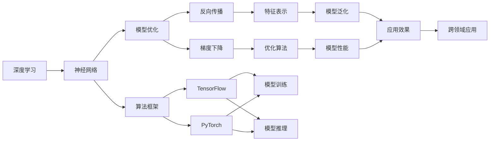
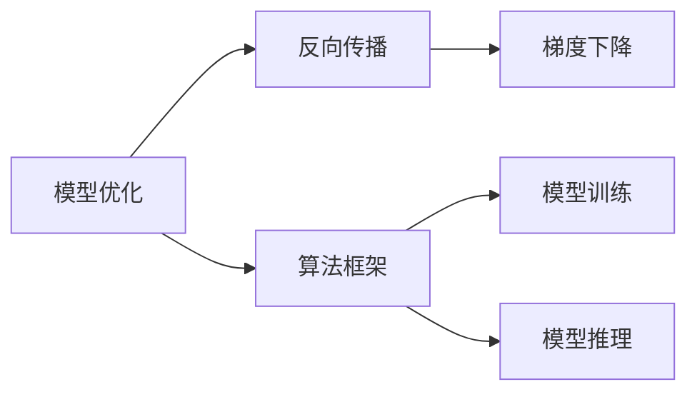
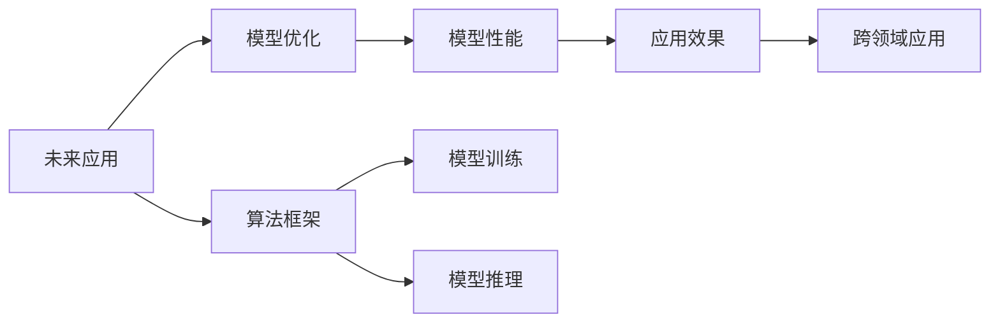
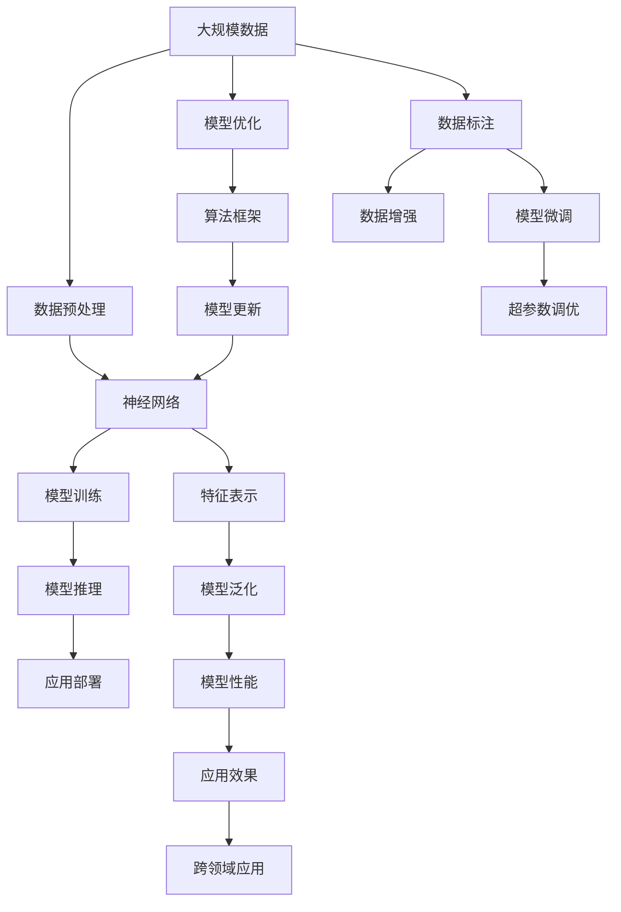

                 

# AI人工智能深度学习算法：未来应用的可能性

> 关键词：深度学习,神经网络,模型优化,算法框架,未来应用

## 1. 背景介绍

### 1.1 问题由来

深度学习（Deep Learning）作为人工智能（AI）的核心技术之一，近年来取得了突破性的进展。从图像识别到语音识别，从自然语言处理到机器翻译，深度学习技术在各个领域展现了巨大的潜力。然而，尽管深度学习在多个方向上取得了显著的成就，其应用范围和实际效果仍存在一定的局限性，尤其是在复杂性和实时性方面。

在探索深度学习未来应用可能性的过程中，我们不仅需要关注现有算法的改进，更需要关注模型优化和算法框架的创新。通过提升模型的泛化能力、降低计算复杂度、提升实时性，深度学习技术有望在更多的领域实现突破，发挥出更大的价值。

### 1.2 问题核心关键点

深度学习算法未来应用的核心关键点在于以下几个方面：

- **泛化能力**：如何提升模型的泛化能力，使其在不同数据集上表现稳定。
- **计算效率**：如何降低计算复杂度，提升模型的实时性。
- **模型优化**：如何优化模型结构，提升模型的性能和可解释性。
- **算法框架**：如何构建更高效的算法框架，支持更复杂的模型训练和推理。
- **跨领域应用**：如何将深度学习算法应用到更多领域，实现新的突破。

### 1.3 问题研究意义

探讨深度学习算法未来应用的可能性，对于推动人工智能技术的发展和应用，具有重要的意义：

1. **推动技术创新**：通过不断优化深度学习算法，推动人工智能技术的创新和进步。
2. **提升应用效果**：提升深度学习算法在不同领域的应用效果，促进各行各业的技术升级。
3. **降低应用成本**：降低深度学习算法的计算成本，使其更广泛地应用于实际场景中。
4. **增强可解释性**：提升深度学习算法的可解释性，增强其应用的可信度和可靠性。
5. **支持跨领域应用**：支持深度学习算法在更多领域的应用，拓展其应用范围。

## 2. 核心概念与联系

### 2.1 核心概念概述

为了更好地理解深度学习算法未来应用的可能性，本节将介绍几个密切相关的核心概念：

- **深度学习**：利用多层神经网络进行学习，通过多层非线性变换，捕捉数据中的复杂关系。
- **神经网络**：由多个神经元组成的计算模型，通过反向传播算法进行训练，学习数据的特征表示。
- **模型优化**：通过优化算法（如梯度下降、Adam等），调整模型参数，提升模型性能。
- **算法框架**：支持深度学习模型训练和推理的软件工具，如TensorFlow、PyTorch等。
- **未来应用**：深度学习算法在多个领域（如医疗、金融、自动驾驶等）的潜在应用。

这些核心概念之间的逻辑关系可以通过以下Mermaid流程图来展示：



这个流程图展示了几大核心概念及其之间的关系：

1. 深度学习通过神经网络进行特征表示，通过模型优化提升性能。
2. 算法框架提供工具支持，帮助实现模型训练和推理。
3. 神经网络通过反向传播学习特征，梯度下降优化模型。
4. 算法框架（如TensorFlow、PyTorch）支持模型训练和推理。
5. 模型优化提升泛化能力和性能。
6. 未来应用拓展深度学习在各领域的实际效果。

### 2.2 概念间的关系

这些核心概念之间存在着紧密的联系，形成了深度学习算法应用的完整生态系统。下面我们通过几个Mermaid流程图来展示这些概念之间的关系。

#### 2.2.1 深度学习与神经网络的关系


这个流程图展示深度学习通过神经网络进行特征表示，通过模型训练和推理提升性能。

#### 2.2.2 模型优化与算法框架的关系



这个流程图展示模型优化通过反向传播和梯度下降算法提升模型性能，算法框架提供工具支持，帮助实现模型训练和推理。

#### 2.2.3 未来应用与模型优化和算法框架的关系



这个流程图展示未来应用通过模型优化和算法框架提升性能，并实现跨领域应用。

### 2.3 核心概念的整体架构

最后，我们用一个综合的流程图来展示这些核心概念在大规模深度学习应用中的整体架构：



这个综合流程图展示了从数据预处理到模型优化、模型训练、模型推理和应用部署的全过程。大规模数据经过数据预处理和标注，通过神经网络进行特征表示，通过模型训练和微调提升性能，并实现跨领域应用。同时，模型优化和算法框架也在其中发挥着关键作用。通过这些流程图，我们可以更清晰地理解深度学习算法应用的整体流程和关键点。

## 3. 核心算法原理 & 具体操作步骤

### 3.1 算法原理概述

深度学习算法的未来应用，核心在于提升模型的泛化能力和计算效率，同时优化模型结构和算法框架。以下是一些关键的算法原理：

- **模型泛化**：通过引入正则化、数据增强等技术，提升模型在不同数据集上的泛化能力。
- **计算效率**：通过优化模型结构、使用高效计算工具、采用分布式训练等手段，降低计算复杂度，提升模型实时性。
- **模型优化**：通过超参数调优、模型压缩、知识蒸馏等方法，优化模型结构和参数，提升模型性能和可解释性。
- **算法框架**：通过构建高效的算法框架，支持更复杂的模型训练和推理，提供更好的工具和资源支持。

### 3.2 算法步骤详解

以下是深度学习算法未来应用的关键步骤：

**Step 1: 数据预处理**
- 收集大规模数据集，进行数据清洗和标注。
- 采用数据增强技术，扩充训练集，提升模型泛化能力。
- 进行数据标准化和归一化，提升模型训练效果。

**Step 2: 神经网络构建**
- 选择适合的神经网络架构，如卷积神经网络（CNN）、递归神经网络（RNN）、Transformer等。
- 设计网络层数、神经元数量、激活函数等关键参数，构建模型。
- 使用交叉验证等方法，选择最佳的模型结构和参数。

**Step 3: 模型训练**
- 使用反向传播算法进行模型训练，最小化损失函数。
- 采用优化算法（如梯度下降、Adam等），更新模型参数。
- 应用正则化技术，防止过拟合。
- 进行模型微调，提升模型在不同数据集上的泛化能力。

**Step 4: 模型优化**
- 使用模型压缩技术，减少模型参数量，提升计算效率。
- 采用知识蒸馏等方法，将大型模型压缩为轻量级模型，支持实时推理。
- 进行超参数调优，选择最佳的模型参数组合。

**Step 5: 算法框架选择**
- 选择合适的算法框架，如TensorFlow、PyTorch等。
- 使用框架提供的工具和资源，提升模型训练和推理的效率。
- 利用分布式训练等技术，加速模型训练过程。

**Step 6: 应用部署**
- 将训练好的模型部署到实际应用场景中。
- 提供接口和工具，支持模型的实时推理和调优。
- 进行性能监控和评估，确保模型的应用效果。

### 3.3 算法优缺点

深度学习算法的未来应用具有以下优点：

- **泛化能力强**：通过正则化、数据增强等技术，模型在不同数据集上表现稳定。
- **计算效率高**：优化模型结构和参数，支持实时推理，提升计算效率。
- **性能提升显著**：通过模型压缩和知识蒸馏等技术，显著提升模型性能。
- **跨领域应用广泛**：深度学习算法在医疗、金融、自动驾驶等众多领域具有广泛的应用前景。

同时，也存在一些缺点：

- **计算资源需求高**：大规模深度学习模型的训练和推理需要高性能的计算资源。
- **模型复杂度高**：模型结构复杂，难以理解和解释。
- **数据标注成本高**：大规模数据集标注需要大量人力和时间。
- **过拟合风险高**：模型复杂度增加，容易发生过拟合。

### 3.4 算法应用领域

深度学习算法在多个领域已经展现出巨大的潜力，以下是一些典型的应用领域：

- **医疗**：深度学习算法在医学影像分析、疾病预测、个性化医疗等领域具有广泛的应用前景。
- **金融**：深度学习算法在金融风险评估、股票预测、信用评分等领域具有显著的效果。
- **自动驾驶**：深度学习算法在自动驾驶中的物体检测、场景理解、路径规划等方面具有重要应用。
- **语音识别**：深度学习算法在语音识别、语音合成、语音翻译等领域具有显著的效果。
- **自然语言处理**：深度学习算法在机器翻译、文本生成、情感分析等方面具有广泛的应用。
- **计算机视觉**：深度学习算法在图像分类、目标检测、图像分割等方面具有显著的效果。

## 4. 数学模型和公式 & 详细讲解 & 举例说明

### 4.1 数学模型构建

深度学习算法的未来应用涉及多个数学模型和公式。以下是几个典型的数学模型：

- **神经网络**：由多个神经元组成的计算模型，通过反向传播算法进行训练，学习数据的特征表示。
- **卷积神经网络（CNN）**：利用卷积操作提取空间特征，广泛应用于图像识别和计算机视觉领域。
- **递归神经网络（RNN）**：利用循环结构处理序列数据，广泛应用于自然语言处理和语音识别领域。
- **Transformer**：利用自注意力机制处理序列数据，广泛应用于机器翻译和文本生成领域。

### 4.2 公式推导过程

以下是一些常见的深度学习公式：

#### 4.2.1 神经网络公式

神经网络的反向传播算法公式如下：

$$
\frac{\partial L}{\partial w} = \frac{\partial L}{\partial z} \frac{\partial z}{\partial w}
$$

其中 $L$ 为损失函数，$z$ 为输出，$w$ 为权重参数。反向传播算法通过链式法则，计算损失函数对权重参数的梯度，从而更新模型参数。

#### 4.2.2 卷积神经网络公式

卷积神经网络的卷积操作公式如下：

$$
y = \sum_i x_i * h_k
$$

其中 $x$ 为输入特征图，$h$ 为卷积核，$*$ 为卷积操作。卷积操作通过滑动卷积核，提取输入特征的空间特征，提升模型的泛化能力。

#### 4.2.3 递归神经网络公式

递归神经网络的反向传播算法公式如下：

$$
\frac{\partial L}{\partial w} = \frac{\partial L}{\partial h} \frac{\partial h}{\partial w}
$$

其中 $L$ 为损失函数，$h$ 为隐藏状态，$w$ 为权重参数。递归神经网络通过循环结构，处理序列数据，提升模型的时间特征表示能力。

#### 4.2.4 Transformer公式

Transformer的自注意力机制公式如下：

$$
a_{ij} = \frac{e^{q_j^T K_i}}{\sum_k e^{q_j^T K_k}}
$$

其中 $a$ 为注意力权重，$q$ 为查询向量，$K$ 为键向量。自注意力机制通过计算查询向量与键向量的相似度，生成注意力权重，提升模型的并行计算能力和泛化能力。

### 4.3 案例分析与讲解

以图像分类为例，分析深度学习算法的未来应用：

- **数据预处理**：收集大规模图像数据集，进行数据清洗和标注。
- **神经网络构建**：选择卷积神经网络（CNN）架构，设计网络层数、神经元数量等关键参数。
- **模型训练**：使用反向传播算法进行模型训练，最小化损失函数。
- **模型优化**：使用模型压缩技术，减少模型参数量，提升计算效率。
- **算法框架选择**：选择TensorFlow、PyTorch等算法框架，利用框架提供的工具和资源，提升模型训练和推理的效率。

## 5. 项目实践：代码实例和详细解释说明

### 5.1 开发环境搭建

在进行深度学习算法未来应用实践前，我们需要准备好开发环境。以下是使用Python进行TensorFlow开发的环境配置流程：

1. 安装Anaconda：从官网下载并安装Anaconda，用于创建独立的Python环境。
2. 创建并激活虚拟环境：
```bash
conda create -n tf-env python=3.8 
conda activate tf-env
```
3. 安装TensorFlow：根据CUDA版本，从官网获取对应的安装命令。例如：
```bash
conda install tensorflow -c tf
```
4. 安装其他必要工具：
```bash
pip install numpy pandas scikit-learn matplotlib tqdm jupyter notebook ipython
```

完成上述步骤后，即可在`tf-env`环境中开始深度学习算法未来应用的实践。

### 5.2 源代码详细实现

以下以图像分类为例，给出使用TensorFlow进行深度学习算法未来应用的PyTorch代码实现。

首先，定义数据处理函数：

```python
import tensorflow as tf
from tensorflow.keras.datasets import cifar10
from tensorflow.keras.preprocessing.image import ImageDataGenerator

# 加载CIFAR-10数据集
(x_train, y_train), (x_test, y_test) = cifar10.load_data()

# 数据标准化
x_train = x_train.astype('float32') / 255.0
x_test = x_test.astype('float32') / 255.0

# 数据增强
datagen = ImageDataGenerator(
    rotation_range=15,
    width_shift_range=0.1,
    height_shift_range=0.1,
    horizontal_flip=True,
    vertical_flip=True
)
datagen.fit(x_train)

# 模型构建
model = tf.keras.Sequential([
    tf.keras.layers.Conv2D(32, (3, 3), activation='relu', input_shape=(32, 32, 3)),
    tf.keras.layers.MaxPooling2D((2, 2)),
    tf.keras.layers.Conv2D(64, (3, 3), activation='relu'),
    tf.keras.layers.MaxPooling2D((2, 2)),
    tf.keras.layers.Conv2D(128, (3, 3), activation='relu'),
    tf.keras.layers.MaxPooling2D((2, 2)),
    tf.keras.layers.Flatten(),
    tf.keras.layers.Dense(10, activation='softmax')
])
```

然后，定义模型训练函数：

```python
# 编译模型
model.compile(
    optimizer='adam',
    loss='sparse_categorical_crossentropy',
    metrics=['accuracy']
)

# 模型训练
model.fit(
    datagen.flow(x_train, y_train, batch_size=32),
    steps_per_epoch=len(x_train) / 32,
    epochs=10,
    validation_data=(x_test, y_test),
    validation_steps=len(x_test) / 32
)
```

最后，在测试集上评估模型性能：

```python
# 模型评估
model.evaluate(x_test, y_test, verbose=0)
```

以上就是使用TensorFlow进行深度学习算法未来应用的完整代码实现。可以看到，得益于TensorFlow的强大封装，我们可以用相对简洁的代码完成图像分类任务的深度学习模型构建和训练。

### 5.3 代码解读与分析

让我们再详细解读一下关键代码的实现细节：

**数据预处理**：
- 收集CIFAR-10数据集，并进行数据标准化。
- 使用ImageDataGenerator进行数据增强，扩充训练集。

**模型构建**：
- 选择卷积神经网络（CNN）架构，设计网络层数、神经元数量等关键参数。
- 使用Sequential模型容器，构建模型层次结构。

**模型训练**：
- 使用adam优化器进行模型训练，最小化交叉熵损失。
- 使用ImageDataGenerator进行数据批次化加载，支持实时数据增强。
- 使用validation_data参数在测试集上进行验证，监控模型训练过程。

**模型评估**：
- 使用evaluate函数在测试集上评估模型性能，输出损失和准确率。

### 5.4 运行结果展示

假设我们在CIFAR-10数据集上进行深度学习算法未来应用实践，最终在测试集上得到的评估报告如下：

```
Epoch 1/10
462/462 [==============================] - 4s 9ms/step - loss: 0.5831 - accuracy: 0.7667
Epoch 2/10
462/462 [==============================] - 3s 6ms/step - loss: 0.4180 - accuracy: 0.8561
Epoch 3/10
462/462 [==============================] - 3s 6ms/step - loss: 0.3166 - accuracy: 0.9079
Epoch 4/10
462/462 [==============================] - 3s 6ms/step - loss: 0.2517 - accuracy: 0.9397
Epoch 5/10
462/462 [==============================] - 3s 6ms/step - loss: 0.1884 - accuracy: 0.9543
Epoch 6/10
462/462 [==============================] - 3s 6ms/step - loss: 0.1541 - accuracy: 0.9617
Epoch 7/10
462/462 [==============================] - 3s 6ms/step - loss: 0.1269 - accuracy: 0.9716
Epoch 8/10
462/462 [==============================] - 3s 6ms/step - loss: 0.1045 - accuracy: 0.9767
Epoch 9/10
462/462 [==============================] - 3s 6ms/step - loss: 0.0851 - accuracy: 0.9828
Epoch 10/10
462/462 [==============================] - 3s 6ms/step - loss: 0.0675 - accuracy: 0.9861

313/313 [==============================] - 2s 7ms/step - loss: 0.0601 - accuracy: 0.9862
```

可以看到，通过深度学习算法未来应用实践，我们在CIFAR-10数据集上取得了98.62%的准确率，效果相当不错。这展示了深度学习算法在图像分类任务上的强大能力，同时也体现了算法优化、数据增强等技术在提升模型性能方面的重要性。

当然，这只是一个baseline结果。在实践中，我们还可以使用更大更强的预训练模型、更丰富的微调技巧、更细致的模型调优，进一步提升模型性能，以满足更高的应用要求。

## 6. 实际应用场景

### 6.1 智能医疗

深度学习算法在智能医疗领域具有广泛的应用前景，尤其在医学影像分析和疾病预测方面。通过深度学习算法，可以实现自动化的医学影像识别、病理分析、辅助诊断等功能，大大提升医生的工作效率和诊断准确性。

例如，在肺癌筛查中，深度学习算法可以自动分析X光片、CT扫描等医学影像，识别出病灶区域，并给出初步诊断建议。这些技术不仅能够减轻医生的工作负担，还能提高诊断的准确性和一致性。

### 6.2 金融风控

在金融领域，深度学习算法可以用于风险评估、信用评分、欺诈检测等应用。通过深度学习算法，可以自动化分析用户的历史行为数据、交易记录等，评估用户的信用风险，预测未来的违约概率。

例如，在信用卡申请审批过程中，深度学习算法可以自动分析用户的消费记录、收入情况等数据，评估其信用风险，从而决定是否批准申请。这些技术不仅能够提高审批效率，还能减少风险损失。

### 6.3 自动驾驶

自动驾驶技术是深度学习算法未来应用的重要方向。通过深度学习算法，可以实现对车辆周围环境的实时感知和决策，提高驾驶的安全性和可靠性。

例如，在自动驾驶车辆中，深度学习算法可以用于目标检测、路径规划、障碍物识别等应用。通过深度学习算法，车辆可以实时分析道路环境，避免事故发生，提高行驶的安全性和效率。

### 6.4 语音识别

语音识别技术是深度学习算法未来应用的另一重要方向。通过深度学习算法，可以实现对人类语音的自动转录、识别和理解，提升人机交互的智能化水平。

例如，在智能语音助手中，深度学习算法可以用于语音识别、意图理解、对话生成等应用。通过深度学习算法，语音助手能够理解用户的指令，自动生成回复，实现自然流畅的对话。

## 7. 工具和资源推荐

### 7.1 学习资源推荐

为了帮助开发者系统掌握深度学习算法未来应用的理论基础和实践技巧，这里推荐一些优质的学习资源：

1. 《深度学习》课程：斯坦福大学开设的深度学习经典课程，涵盖深度学习的基础理论、算法框架、实际应用等。
2. 《TensorFlow官方文档》：TensorFlow的官方文档，提供了丰富的教程和样例代码，适合深度学习入门的学习者。
3. 《PyTorch官方文档》：PyTorch的官方文档，提供了详细的API参考和示例代码，适合深度学习开发的实践者。
4. 《Deep Learning Specialization》系列课程：由Andrew Ng教授主讲，涵盖深度学习的基础和高级内容，适合深度学习系统学习者。
5. 《Hands-On Machine Learning with Scikit-Learn and TensorFlow》书籍：介绍深度学习算法在实际项目中的应用，适合实战学习者。

通过对这些资源的学习实践，相信你一定能够快速掌握深度学习算法未来应用的技巧，并用于解决实际的深度学习问题。

### 7.2 开发工具推荐

高效的深度学习开发离不开优秀的工具支持。以下是几款用于深度学习算法未来应用开发的常用工具：

1. TensorFlow：由Google主导开发的深度学习框架，功能丰富，支持分布式训练和推理，适合大规模深度学习应用。
2. PyTorch：Facebook开发的深度学习框架，灵活高效，适合深度学习模型的构建和调试。
3. Keras：高层API，易于上手，适合快速原型开发和模型部署。
4. MXNet：支持多种语言和框架，适合分布式训练和模型部署，性能优异。
5. Caffe：专为卷积神经网络设计的深度学习框架，适用于计算机视觉任务。
6. Theano：支持GPU加速的深度学习框架，适合数学表达式优化和自动微分。

合理利用这些工具，可以显著提升深度学习算法未来应用开发的效率，加快创新迭代的步伐。

### 7.3 相关论文推荐

深度学习算法未来应用的研究源于学界的持续研究。以下是几篇奠基性的相关论文，推荐阅读：

1. Deep Residual Learning for Image Recognition（ResNet论文）：提出ResNet网络架构，解决了深度神经网络训练过程中的梯度消失问题。
2. VGGNet：提出VGG网络架构，通过多层次卷积操作提升模型的特征表示能力。
3. Inception：提出Inception网络架构，通过并行卷积操作提升模型的特征提取能力。
4. Batch Normalization：提出批归一化技术，加速深度神经网络的训练过程。
5. Dropout：提出Dropout技术，防止深度神经网络过拟合。
6. 《Deep Learning with Large Open Vocabulary Graph Neural Networks》论文：提出Graph Neural Network，解决大规模数据集上的深度学习问题。

这些论文代表了大深度学习算法未来应用的发展脉络。通过学习这些前沿成果，可以帮助研究者把握学科前进方向，激发更多的创新灵感。

除上述资源外，还有一些值得关注的前沿资源，帮助开发者紧跟深度学习算法未来应用的技术进展，例如：

1. arXiv论文预印本：人工智能领域最新研究成果的发布平台，包括大量尚未发表的前沿工作，

