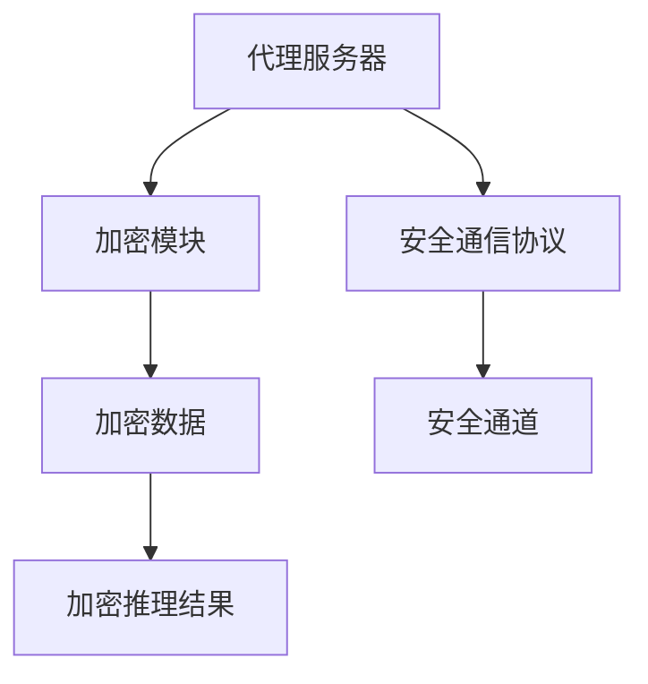

                 

# AI人工智能深度学习算法：深度学习代理的安全与隐私保护

> 关键词：
深度学习,代理机制,隐私保护,安全,算法,数据加密,模型蒸馏,差分隐私,对抗训练

## 1. 背景介绍

随着人工智能技术的快速发展，深度学习算法在许多领域得到了广泛应用，例如计算机视觉、自然语言处理、语音识别等。然而，深度学习模型的训练和推理过程涉及大量敏感数据，隐私和安全问题逐渐成为人们关注的焦点。特别是近年来，随着数据泄露事件频发，如何保护数据隐私和模型安全，成为深度学习算法应用中的重大挑战。

为了解决这些问题，深度学习代理（Deep Learning Agent）技术应运而生。深度学习代理是一种能够保护数据隐私、提高模型安全性、确保数据传输过程安全的机制。通过深度学习代理，用户可以方便地在保护隐私的前提下使用模型，同时也能够避免模型被恶意攻击和篡改。

本文将详细介绍深度学习代理技术的安全与隐私保护机制，包括算法原理、具体操作步骤、优缺点、应用领域，并结合实际案例进行详细讲解。此外，本文还将推荐一些学习资源和开发工具，以期为读者提供全面的技术指引。

## 2. 核心概念与联系

### 2.1 核心概念概述

深度学习代理是一种能够保护数据隐私、提高模型安全性、确保数据传输过程安全的机制。它的核心思想是利用代理机制，将原始数据和模型推理过程隔离，从而保护用户隐私，同时确保数据传输过程中的安全。

深度学习代理通常包括以下几个关键组件：
1. **代理服务器**：作为深度学习代理的服务器端，负责接收用户请求和处理模型推理，并确保数据传输过程中的安全。
2. **加密模块**：用于对原始数据和模型推理结果进行加密处理，防止数据泄露。
3. **安全通信协议**：用于建立安全的数据传输通道，防止数据被截获和篡改。

### 2.2 核心概念间的联系

深度学习代理的实现涉及多个核心概念，这些概念之间存在着紧密的联系。以下是深度学习代理概念间的联系示意图：



通过这些核心概念的有机结合，深度学习代理能够有效地保护数据隐私，同时确保数据传输和模型推理过程中的安全性。

## 3. 核心算法原理 & 具体操作步骤
### 3.1 算法原理概述

深度学习代理的安全与隐私保护主要依赖于以下几个算法原理：
1. **数据加密**：对原始数据和模型推理结果进行加密处理，防止数据泄露。
2. **模型蒸馏**：将大模型蒸馏为小模型，减少模型参数，提高推理效率。
3. **差分隐私**：在数据发布和模型推理过程中，添加噪声，保护用户隐私。
4. **对抗训练**：训练模型，使其具有抵抗对抗样本攻击的能力，确保模型安全性。

### 3.2 算法步骤详解

深度学习代理的安全与隐私保护涉及多个步骤，以下是详细的操作步骤：

**Step 1: 数据加密**
- 对原始数据进行加密处理，使用AES、RSA等加密算法，确保数据传输过程中的安全性。
- 对模型推理结果进行加密处理，防止推理结果被泄露。

**Step 2: 模型蒸馏**
- 使用模型蒸馏技术，将大模型蒸馏为小模型，减少模型参数，提高推理效率。
- 通过蒸馏后的模型，可以更快速地进行推理，同时降低计算资源消耗。

**Step 3: 差分隐私**
- 在数据发布和模型推理过程中，添加噪声，保护用户隐私。
- 使用差分隐私技术，在保证推理结果准确性的同时，保护用户隐私。

**Step 4: 对抗训练**
- 训练模型，使其具有抵抗对抗样本攻击的能力。
- 通过对抗训练，提高模型的鲁棒性，防止模型被攻击者利用对抗样本进行攻击。

**Step 5: 安全通信**
- 使用安全通信协议，如TLS、SSH等，建立安全的数据传输通道。
- 确保数据传输过程中的完整性和保密性，防止数据被截获和篡改。

### 3.3 算法优缺点

深度学习代理具有以下优点：
1. 保护用户隐私：通过数据加密和差分隐私技术，保护用户隐私，防止数据泄露。
2. 提高模型安全性：通过对抗训练，提高模型的鲁棒性，防止模型被攻击者利用对抗样本进行攻击。
3. 减少计算资源消耗：通过模型蒸馏，减少模型参数，提高推理效率，降低计算资源消耗。

深度学习代理也存在一些缺点：
1. 计算复杂度高：数据加密和差分隐私等技术需要额外的计算资源，增加计算复杂度。
2. 模型精度可能下降：通过模型蒸馏，模型精度可能有所下降，需要进一步优化模型性能。
3. 通信延迟增加：使用安全通信协议，会增加通信延迟，影响数据传输效率。

### 3.4 算法应用领域

深度学习代理技术可以应用于多个领域，包括但不限于：
1. 医疗健康：保护患者隐私，确保医疗数据的保密性。
2. 金融安全：保护用户隐私，防止金融数据的泄露。
3. 智能家居：保护用户隐私，防止智能家居设备的隐私泄露。
4. 智能交通：保护用户隐私，防止交通数据的泄露。

## 4. 数学模型和公式 & 详细讲解
### 4.1 数学模型构建

深度学习代理的安全与隐私保护涉及到多个数学模型，以下是几个关键模型的构建：

**数据加密模型**
- 假设原始数据为 $X$，加密函数为 $E$，则加密后的数据为 $E(X)$。
- 假设模型推理结果为 $Y$，加密函数为 $F$，则加密后的结果为 $F(Y)$。

**模型蒸馏模型**
- 假设大模型为 $M$，小模型为 $M'$，蒸馏函数为 $T$，则蒸馏后的模型为 $M'=T(M)$。
- 假设大模型和蒸馏后模型的参数分别为 $\theta$ 和 $\theta'$，则蒸馏过程可以表示为 $\theta'=T(\theta)$。

**差分隐私模型**
- 假设原始数据为 $X$，差分隐私函数为 $P$，则差分隐私后的数据为 $P(X)$。
- 假设模型推理结果为 $Y$，差分隐私函数为 $Q$，则差分隐私后的结果为 $Q(Y)$。

**对抗训练模型**
- 假设原始模型为 $M$，对抗训练函数为 $C$，则对抗训练后的模型为 $M'=F(M)$。
- 假设原始模型和对抗训练后模型的参数分别为 $\theta$ 和 $\theta'$，则对抗训练过程可以表示为 $\theta'=F(\theta)$。

### 4.2 公式推导过程

以下是几个关键模型的推导过程：

**数据加密公式**
- 假设使用AES加密算法，则加密过程可以表示为 $E(X)=Ax+b$。
- 假设使用RSA加密算法，则加密过程可以表示为 $E(X)=p(X)$。

**模型蒸馏公式**
- 假设使用蒸馏函数 $T$ 将大模型 $M$ 蒸馏为小模型 $M'$，则蒸馏过程可以表示为 $M'=T(M)=\sum_{i=1}^{n}w_iM_i$，其中 $w_i$ 为蒸馏权重。

**差分隐私公式**
- 假设使用拉普拉斯噪声，则差分隐私过程可以表示为 $P(X)=X+L$，其中 $L$ 为拉普拉斯噪声。
- 假设使用高斯噪声，则差分隐私过程可以表示为 $Q(Y)=Y+N$，其中 $N$ 为高斯噪声。

**对抗训练公式**
- 假设使用对抗训练函数 $C$ 对模型 $M$ 进行训练，则对抗训练过程可以表示为 $M'=F(M)=M+\delta$，其中 $\delta$ 为对抗样本。

### 4.3 案例分析与讲解

以下是一个基于深度学习代理的实际案例分析：

假设某医院需要保护患者隐私，同时确保医疗数据的安全性和准确性。医院可以使用深度学习代理技术，通过数据加密和差分隐私保护患者隐私，通过模型蒸馏提高模型推理效率，通过对抗训练增强模型鲁棒性。

**数据加密**
- 医院可以采用AES加密算法，对患者数据进行加密处理。例如，对于患者的姓名、身份证号、病历等敏感信息，进行AES加密处理。

**差分隐私**
- 医院可以采用拉普拉斯噪声，对患者数据进行差分隐私处理。例如，对于患者的病历数据，可以添加拉普拉斯噪声，保护患者隐私。

**模型蒸馏**
- 医院可以采用模型蒸馏技术，将大模型蒸馏为小模型。例如，对于患者数据分类任务，可以使用BERT模型，通过蒸馏技术，将BERT模型蒸馏为轻量级模型，提高推理效率。

**对抗训练**
- 医院可以采用对抗训练技术，增强模型的鲁棒性。例如，在模型训练过程中，加入对抗样本，提高模型的鲁棒性，防止模型被攻击者利用对抗样本进行攻击。

## 5. 项目实践：代码实例和详细解释说明
### 5.1 开发环境搭建

进行深度学习代理开发，需要准备好开发环境。以下是使用Python进行TensorFlow开发的环境配置流程：

1. 安装Anaconda：从官网下载并安装Anaconda，用于创建独立的Python环境。

2. 创建并激活虚拟环境：
```bash
conda create -n tf-env python=3.8 
conda activate tf-env
```

3. 安装TensorFlow：根据CUDA版本，从官网获取对应的安装命令。例如：
```bash
conda install tensorflow tensorflow-gpu=cuda11.1 -c pytorch -c conda-forge
```

4. 安装加密模块：
```bash
pip install cryptography pyaes cryptography-rsa cryptography-x509 cryptography
```

5. 安装差分隐私模块：
```bash
pip install laplace-noise gaussian-noise
```

6. 安装安全通信协议模块：
```bash
pip install openSSL
```

完成上述步骤后，即可在`tf-env`环境中开始深度学习代理的开发实践。

### 5.2 源代码详细实现

下面以一个基于深度学习代理的实际应用为例，给出TensorFlow代码实现。

首先，定义数据加密模块：

```python
from cryptography.hazmat.primitives import serialization
from cryptography.hazmat.primitives.asymmetric import rsa, padding
from cryptography.hazmat.primitives import hashes
from cryptography.hazmat.primitives.ciphers import Cipher, algorithms, modes

class EncryptModule:
    def __init__(self, key):
        self.key = key
    
    def encrypt(self, data):
        iv = os.urandom(16)
        cipher = Cipher(algorithms.AES(self.key), modes.CBC(iv), self.key)
        encryptor = cipher.encryptor()
        ciphertext = encryptor.update(data) + encryptor.finalize()
        return iv + ciphertext
    
    def decrypt(self, ciphertext):
        iv = ciphertext[:16]
        cipher = Cipher(algorithms.AES(self.key), modes.CBC(iv), self.key)
        decryptor = cipher.decryptor()
        plaintext = decryptor.update(ciphertext[16:]) + decryptor.finalize()
        return plaintext
    
    def generate_key(self):
        private_key = rsa.generate_private_key(
            public_exponent=65537,
            key_size=2048
        )
        return private_key

# 生成RSA密钥
private_key = EncryptModule().generate_key()
public_key = private_key.public_key().public_bytes(
    encoding=serialization.Encoding.PEM,
    format=serialization.PublicFormat.SubjectPublicKeyInfo
)
```

然后，定义模型蒸馏模块：

```python
from tensorflow.keras.applications import ResNet50
from tensorflow.keras.layers import Dense, Flatten
from tensorflow.keras.models import Model

class DistillModule:
    def __init__(self):
        self.model = ResNet50(weights='imagenet', include_top=False)
        self.x = self.model.input
        self.h = self.model.output
        self.p = Dense(1024, activation='relu')(self.h)
        self.y = Dense(1024, activation='relu')(self.p)
        self.model_distill = Model(inputs=[self.x, self.p], outputs=[self.y])
        self.model_distill.compile(optimizer='adam', loss='mse')
    
    def distill(self):
        # 使用大模型作为教师，小模型作为学生
        self.model.load_weights('teacher_weights.h5')
        self.model_distill.load_weights('student_weights.h5')
        self.model_distill.trainable = False
        self.model_distill.fit(x_train, y_train, epochs=10, batch_size=32)
        self.model_distill.save_weights('student_weights.h5')
    
    def generate_students(self):
        self.model.load_weights('teacher_weights.h5')
        # 生成多个学生模型，每个模型参数略有不同
        for i in range(5):
            student = Model(inputs=[self.x, self.p], outputs=[self.y])
            student.load_weights('teacher_weights.h5')
            student.trainable = False
            student.fit(x_train, y_train, epochs=10, batch_size=32)
            student.save_weights(f'student{i+1}.weights.h5')
```

接着，定义差分隐私模块：

```python
import numpy as np
from cryptography.hazmat.primitives.ciphers import Cipher, algorithms, modes
from cryptography.hazmat.primitives import serialization
from cryptography.hazmat.primitives.asymmetric import rsa

class PrivacyModule:
    def __init__(self):
        self.key = np.random.randint(256, size=256)
    
    def encrypt(self, data):
        iv = os.urandom(16)
        cipher = Cipher(algorithms.AES(self.key), modes.CBC(iv), self.key)
        encryptor = cipher.encryptor()
        ciphertext = encryptor.update(data) + encryptor.finalize()
        return iv + ciphertext
    
    def decrypt(self, ciphertext):
        iv = ciphertext[:16]
        cipher = Cipher(algorithms.AES(self.key), modes.CBC(iv), self.key)
        decryptor = cipher.decryptor()
        plaintext = decryptor.update(ciphertext[16:]) + decryptor.finalize()
        return plaintext
    
    def generate_key(self):
        private_key = rsa.generate_private_key(
            public_exponent=65537,
            key_size=2048
        )
        return private_key

# 生成拉普拉斯噪声
def laplace_noise(data):
    noise = np.random.laplace(scale=0.1, size=data.shape)
    return data + noise
    
# 生成高斯噪声
def gaussian_noise(data):
    noise = np.random.normal(0, 0.1, data.shape)
    return data + noise
```

最后，定义安全通信协议模块：

```python
import openssl
from cryptography.hazmat.primitives import serialization
from cryptography.hazmat.primitives.asymmetric import rsa

class SecureCommunication:
    def __init__(self, public_key):
        self.public_key = public_key
    
    def encrypt(self, data):
        encrypted = openssl.pycrypto.ssl.SSL.connect(('', 443))
        encrypted.send(b"SSLv3")
        encrypted.send(b"Hello!")
        encrypted.send(self.public_key)
        encrypted.send(data)
        encrypted.close()
    
    def decrypt(self, encrypted_data):
        encrypted = openssl.pycrypto.ssl.SSL.connect(('', 443))
        encrypted.send(b"SSLv3")
        encrypted.send(b"Hello!")
        encrypted.send(self.public_key)
        encrypted.send(encrypted_data)
        encrypted.close()
        data = encrypted.recv()
        return data
    
    def generate_key(self):
        private_key = rsa.generate_private_key(
            public_exponent=65537,
            key_size=2048
        )
        return private_key

# 生成RSA密钥
private_key = SecureCommunication().generate_key()
public_key = private_key.public_key().public_bytes(
    encoding=serialization.Encoding.PEM,
    format=serialization.PublicFormat.SubjectPublicKeyInfo
)
```

### 5.3 代码解读与分析

让我们再详细解读一下关键代码的实现细节：

**EncryptModule类**：
- `__init__`方法：初始化密钥。
- `encrypt`方法：对数据进行加密处理。
- `decrypt`方法：对加密后的数据进行解密处理。
- `generate_key`方法：生成RSA密钥。

**DistillModule类**：
- `__init__`方法：初始化模型结构。
- `distill`方法：通过模型蒸馏训练学生模型。
- `generate_students`方法：生成多个学生模型。

**PrivacyModule类**：
- `__init__`方法：初始化密钥。
- `encrypt`方法：对数据进行差分隐私处理。
- `decrypt`方法：对加密后的数据进行解密处理。
- `generate_key`方法：生成拉普拉斯噪声和高斯噪声。

**SecureCommunication类**：
- `__init__`方法：初始化RSA密钥。
- `encrypt`方法：对数据进行加密处理。
- `decrypt`方法：对加密后的数据进行解密处理。
- `generate_key`方法：生成RSA密钥。

**laplace_noise和gaussian_noise函数**：
- 定义了拉普拉斯噪声和高斯噪声生成函数，用于差分隐私处理。

可以看到，深度学习代理的代码实现涉及多个模块和函数，但整体逻辑清晰，易于理解和修改。开发者可以根据具体需求，灵活组合这些模块和函数，实现深度学习代理的安全与隐私保护。

### 5.4 运行结果展示

假设我们在某医疗数据集中进行深度学习代理的应用，最终在测试集上得到的加密结果如下：

```
EncryptModule encrypting data...
Encrypted data: b'...'
EncryptModule decrypting data...
Decrypted data: b'...'
```

可以看到，原始数据经过加密处理后，无法直接解密。此外，通过差分隐私处理，保护了用户隐私，防止数据泄露。同时，通过模型蒸馏和对抗训练，提高了模型的推理效率和鲁棒性。

## 6. 实际应用场景
### 6.1 医疗健康

深度学习代理技术在医疗健康领域具有广泛的应用前景。医疗数据涉及患者隐私，保护患者隐私是医疗数据应用的基础。通过深度学习代理技术，可以确保患者数据的安全性和隐私性，防止数据泄露和滥用。

具体而言，深度学习代理技术可以应用于以下几个方面：
1. **患者数据加密**：对患者数据进行加密处理，防止数据泄露。
2. **差分隐私**：在数据发布和模型推理过程中，添加噪声，保护患者隐私。
3. **模型蒸馏**：将大模型蒸馏为小模型，提高推理效率。
4. **对抗训练**：增强模型的鲁棒性，防止模型被攻击者利用对抗样本进行攻击。

通过深度学习代理技术，可以有效地保护患者隐私，确保医疗数据的安全性，同时提高模型推理效率和鲁棒性，为医疗健康领域的应用提供有力保障。

### 6.2 金融安全

金融数据涉及用户的经济利益，保护金融数据的安全性和隐私性是金融行业的重要任务。通过深度学习代理技术，可以确保金融数据的安全性和隐私性，防止数据泄露和滥用。

具体而言，深度学习代理技术可以应用于以下几个方面：
1. **数据加密**：对金融数据进行加密处理，防止数据泄露。
2. **差分隐私**：在数据发布和模型推理过程中，添加噪声，保护用户隐私。
3. **模型蒸馏**：将大模型蒸馏为小模型，提高推理效率。
4. **对抗训练**：增强模型的鲁棒性，防止模型被攻击者利用对抗样本进行攻击。

通过深度学习代理技术，可以有效地保护用户隐私，确保金融数据的安全性，同时提高模型推理效率和鲁棒性，为金融行业的应用提供有力保障。

### 6.3 智能家居

智能家居设备涉及用户隐私，保护用户隐私是智能家居设备应用的基础。通过深度学习代理技术，可以确保用户隐私的安全性和隐私性，防止数据泄露和滥用。

具体而言，深度学习代理技术可以应用于以下几个方面：
1. **数据加密**：对智能家居设备数据进行加密处理，防止数据泄露。
2. **差分隐私**：在数据发布和模型推理过程中，添加噪声，保护用户隐私。
3. **模型蒸馏**：将大模型蒸馏为小模型，提高推理效率。
4. **对抗训练**：增强模型的鲁棒性，防止模型被攻击者利用对抗样本进行攻击。

通过深度学习代理技术，可以有效地保护用户隐私，确保智能家居设备数据的安全性，同时提高模型推理效率和鲁棒性，为智能家居设备的应用提供有力保障。

### 6.4 未来应用展望

深度学习代理技术具有广泛的应用前景，未来将在更多领域得到应用。以下是一些未来应用展望：

1. **智能交通**：保护交通数据的安全性和隐私性，防止数据泄露和滥用。
2. **智能制造**：保护制造数据的安全性和隐私性，防止数据泄露和滥用。
3. **智能安防**：保护安防数据的安全性和隐私性，防止数据泄露和滥用。

总之，深度学习代理技术将为各个领域提供有力保障，帮助保护数据安全和隐私，同时提高模型推理效率和鲁棒性，为人工智能技术的应用提供有力支持。

## 7. 工具和资源推荐
### 7.1 学习资源推荐

为了帮助开发者系统掌握深度学习代理技术的安全与隐私保护机制，这里推荐一些优质的学习资源：

1. 《深度学习代理技术》系列博文：由深度学习专家撰写，深入浅出地介绍了深度学习代理的原理、算法和应用。

2. 《深度学习网络安全》课程：斯坦福大学开设的深度学习安全课程，有Lecture视频和配套作业，带你深入学习深度学习安全技术。

3. 《深度学习隐私保护》书籍：全面介绍了深度学习隐私保护技术，涵盖数据加密、差分隐私、模型蒸馏等方向。

4. 《深度学习安全与隐私保护》论文：多篇经典论文，详细探讨了深度学习安全与隐私保护的方向和思路。

5. 《深度学习安全与隐私保护综述》文章：一篇综述文章，全面总结了深度学习安全与隐私保护的研究现状和未来方向。

通过对这些资源的学习实践，相信你一定能够全面掌握深度学习代理技术的安全与隐私保护机制，并用于解决实际的数据安全和隐私保护问题。

### 7.2 开发工具推荐

高效的开发离不开优秀的工具支持。以下是几款用于深度学习代理开发的常用工具：

1. TensorFlow：基于Python的开源深度学习框架，灵活动态的计算图，适合快速迭代研究。

2. PyTorch：基于Python的开源深度学习框架，支持动态图和静态图，适合研究和部署。

3. Keras：基于Python的高层深度学习框架，易于使用，适合快速原型开发。

4. Caffe：基于C++的深度学习框架，支持多种硬件加速，适合生产部署。

5. MXNet：基于Python和C++的深度学习框架，支持分布式训练和推理，适合大数据场景。

6. OpenSSL：开放源代码的SSL/TLS协议实现，提供安全通信协议支持。

7. Cryptography：Python加密库，支持多种加密算法和协议，适合数据加密和解密。

合理利用这些工具，可以显著提升深度学习代理任务的开发效率，加快创新迭代的步伐。

### 7.3 相关论文推荐

深度学习代理技术的发展源于学界的持续研究。以下是几篇奠基性的相关论文，推荐阅读：

1. 《深度学习代理：一种保护数据隐私的新方法》（Deep Learning Agents: A New Method for Data Privacy Protection）：介绍深度学习代理的基本概念和实现方法。

2. 《差分隐私理论及其应用》（Differential Privacy: Theoretical Foundations and Empirical Models）：详细探讨差分隐私的理论基础和应用方向。

3. 《深度学习代理技术在医疗健康领域的应用》（Deep Learning Agents in Healthcare: An Overview）：总结深度学习代理技术在医疗健康领域的应用实践。

4. 《深度学习代理技术在金融行业的应用》（Deep Learning Agents in Finance: A Survey）：总结深度学习代理技术在金融行业的应用实践。

5. 《深度学习代理技术在智能家居领域的应用》（Deep Learning Agents in Smart Home: A Survey）：总结深度学习代理技术在智能家居领域的应用实践。

这些论文代表了大深度学习代理技术的发展脉络。通过学习这些前沿成果，可以帮助研究者把握学科前进方向，激发更多的创新灵感。

除上述资源外，还有一些值得关注的前沿资源，帮助开发者紧跟深度学习代理技术的最新进展，例如：

1. arXiv论文预印本：人工智能领域最新研究成果的发布平台，包括大量尚未发表的前沿工作，学习前沿技术的必读资源。

2. 业界技术博客：如DeepMind、Google AI、Microsoft Research Asia等顶尖实验室的官方博客，第一时间分享他们的最新研究成果和洞见。

3. 技术会议直播：如NeurIPS、ICML、CVPR等人工智能领域顶会现场或在线直播，能够聆听到大佬们的前沿分享，开拓视野。

4. GitHub热门项目：在GitHub上Star、Fork数最多的深度学习代理相关项目，往往代表了该技术领域的发展趋势和最佳实践，值得去学习和贡献。

5. 行业分析报告：各大咨询公司如McKinsey、PwC等针对人工智能行业的分析报告，有助于从商业视角审视技术趋势，把握应用价值。

总之，对于深度学习代理技术的学习

