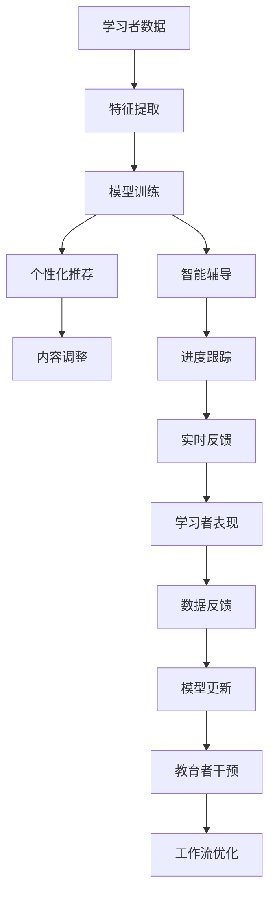

                 

# AI代理在教育技术中的适应性工作流案例

## 1. 背景介绍

在过去十年里，AI技术在教育领域的应用场景持续扩展，从个性化推荐到自适应学习，AI正在以越来越深的方式参与到教学和评估中。AI代理（AI agents），也即自主执行任务并具有特定目标的智能体，在教育技术（EdTech）中的应用尤为引人注目。这种技术能实现动态响应和即时反馈，提升教学效率和学习成果。

教育技术从根本上说，需要适应不同的学习者和教学场景。而AI代理通过不断优化工作流，能够灵活应对这些变化，从而更好地适应教学需求。此外，AI代理的引入也为教育者提供了更多工具，帮助他们提高教学质量。

## 2. 核心概念与联系

### 2.1 核心概念概述

1. **AI代理**：在教育技术中，AI代理指的是基于AI技术设计的软件系统，能够自动执行教育相关的任务，如智能辅导、内容推荐、学习进度跟踪等。

2. **自适应学习**：自适应学习是指根据学习者的个体需求和学习风格，调整教学内容和进度，以最优化学习效果的技术。AI代理通过分析学习者的表现和反馈，动态调整教学策略。

3. **个性化推荐**：基于学习者历史数据和兴趣标签，AI代理能够推荐符合学习者需求的教学资源和练习题，提高学习效率。

4. **智能辅导**：AI代理能模拟教师的角色，提供即时反馈和个性化建议，辅助学习者解决问题。

5. **大数据分析**：AI代理能够处理和分析大量的学习数据，如点击流数据、学习行为数据等，帮助教育者理解学习者的表现和需求。

6. **实时反馈**：AI代理通过即时反馈，增强学习者的互动体验，并根据反馈调整教学策略。

这些核心概念通过一系列的算法和流程设计，共同构建起AI代理在教育技术中的工作流。以下是Mermaid流程图的展示：



### 2.2 概念间的关系

在教育技术中，AI代理的工作流设计依赖于多个核心概念的有机结合，形成如下关系：

1. **学习者数据**：AI代理的基础是收集和处理学习者的学习数据。这些数据包括学习历史、测试成绩、学习行为等。

2. **特征提取**：从学习者数据中提取关键特征，用于描述学习者的学习风格和知识掌握情况。

3. **模型训练**：基于学习者特征，训练推荐模型和辅导模型，生成个性化推荐和智能辅导方案。

4. **个性化推荐**：根据学习者的当前状态和历史数据，动态调整推荐内容。

5. **智能辅导**：基于学习者的问题和困惑，提供针对性的回答和建议。

6. **内容调整**：根据学习者的学习进度和难度，动态调整教学内容的深度和广度。

7. **进度跟踪**：实时跟踪学习者的学习进度和表现，为后续优化提供数据支持。

8. **实时反馈**：在学习过程中即时反馈学习者的表现，指导学习方向。

9. **学习者表现**：实时反馈的汇总结果，作为模型更新的依据。

10. **数据反馈**：学习者表现的反馈信息用于模型优化和教育者干预。

11. **模型更新**：基于反馈不断优化AI代理的推荐和辅导策略。

12. **教育者干预**：教育者根据AI代理的推荐和辅导结果，进行必要的调整和补充。

13. **工作流优化**：在教育者干预的基础上，优化AI代理的工作流程，提升教学效果。

## 3. 核心算法原理 & 具体操作步骤

### 3.1 算法原理概述

AI代理在教育技术中的工作流程涉及多个算法和流程。以下是概述：

1. **特征提取**：将学习者的数据转换为机器学习算法能够处理的形式。常用的方法包括文本分类、情感分析、行为序列建模等。

2. **模型训练**：使用监督学习或无监督学习方法训练推荐模型和辅导模型。常见的算法包括协同过滤、深度学习、强化学习等。

3. **个性化推荐**：基于模型预测的学习者对不同教学资源的兴趣度，推荐适合的内容。

4. **智能辅导**：使用自然语言处理（NLP）技术，分析学习者的问题，提供答案和建议。

5. **内容调整**：根据学习者的学习进度和表现，动态调整教学内容的难度和进度。

6. **进度跟踪**：记录学习者的学习进度和表现，分析学习效果和趋势。

7. **实时反馈**：在学习过程中，及时反馈学习者的表现和问题，指导学习方向。

8. **模型更新**：根据实时反馈和学习者表现，调整和优化推荐和辅导模型。

9. **教育者干预**：教育者根据AI代理的推荐和辅导结果，进行必要的调整和补充。

10. **工作流优化**：基于教育者干预，优化AI代理的工作流程，提升教学效果。

### 3.2 算法步骤详解

**3.2.1 特征提取**
1. **文本特征提取**：
   - 收集学习者在学习平台上的文本数据，如作业、笔记、问题等。
   - 使用NLP技术，提取文本的关键词、情感和主题。
   - 使用词袋模型、TF-IDF、word2vec等技术，将文本转换为向量表示。

2. **行为序列建模**：
   - 收集学习者在平台上的行为数据，如浏览、点击、时间花费等。
   - 使用序列建模技术，如循环神经网络（RNN）、长短期记忆网络（LSTM）等，捕捉学习者的学习行为模式。

3. **情感分析**：
   - 分析学习者在平台上的文本数据，判断其情绪状态。
   - 使用情感词典、深度学习模型等技术，判断文本的情感极性。

**3.2.2 模型训练**
1. **协同过滤**：
   - 使用矩阵分解等技术，学习学习者与内容的协同关系。
   - 推荐模型基于学习者特征和历史行为数据，预测其对不同内容的兴趣度。

2. **深度学习模型**：
   - 使用深度学习框架（如TensorFlow、PyTorch等），训练推荐和辅导模型。
   - 使用卷积神经网络（CNN）、循环神经网络（RNN）、长短期记忆网络（LSTM）等模型。

3. **强化学习**：
   - 使用Q-learning、策略梯度等强化学习算法，训练辅导模型。
   - 模型根据学习者的行为和反馈，动态调整推荐和辅导策略。

**3.2.3 个性化推荐**
1. **推荐算法**：
   - 基于协同过滤模型，预测学习者对不同内容的兴趣度。
   - 使用最大边际排序（MIPS）等方法，进行推荐排序。

2. **推荐结果排序**：
   - 使用排序算法，如PageRank、GBDT等，对推荐结果进行排序。

**3.2.4 智能辅导**
1. **NLP技术**：
   - 使用文本分类、情感分析等技术，分析学习者的问题。
   - 使用意图识别、实体识别等技术，理解学习者的问题。

2. **知识图谱**：
   - 使用知识图谱技术，提供知识点的关联信息。
   - 根据学习者的困惑，推荐相关的知识点进行学习和理解。

3. **答案生成**：
   - 使用基于规则的逻辑推理，生成问题的答案。
   - 使用生成式模型（如GPT），生成自然语言的回答。

**3.2.5 内容调整**
1. **学习进度跟踪**：
   - 收集学习者的学习进度数据，记录其完成情况和学习效果。
   - 分析学习者的知识掌握情况，判断其学习进度是否合理。

2. **内容调整策略**：
   - 根据学习者的知识掌握情况，调整教学内容的难度和深度。
   - 使用动态规划等算法，优化教学内容的进度安排。

**3.2.6 进度跟踪**
1. **进度记录**：
   - 记录学习者在不同学习模块的进度和表现。
   - 使用时间序列分析，预测学习者的学习进度。

2. **学习效果分析**：
   - 分析学习者的测试成绩、作业完成情况等，评估学习效果。
   - 使用聚类算法、回归分析等方法，预测学习者的学习趋势。

**3.2.7 实时反馈**
1. **即时反馈**：
   - 在学习过程中，及时反馈学习者的表现和问题。
   - 使用即时通知、提醒等方式，保持学习者的互动。

2. **学习建议**：
   - 根据实时反馈，提供针对性的学习建议。
   - 使用个性化推荐算法，推荐适合的学习资源和练习题。

**3.2.8 模型更新**
1. **模型评估**：
   - 根据实时反馈和学习者表现，评估推荐和辅导模型的效果。
   - 使用评价指标，如精确率、召回率、F1值等，评估模型的性能。

2. **模型优化**：
   - 根据模型评估结果，调整和优化推荐和辅导策略。
   - 使用增量学习等技术，实时更新模型参数。

3. **反馈机制**：
   - 设置反馈机制，收集学习者和教育者的建议。
   - 根据反馈，优化模型和算法。

**3.2.9 教育者干预**
1. **干预策略**：
   - 根据AI代理的推荐和辅导结果，进行必要的调整和补充。
   - 使用规则库和专家系统，提供指导和建议。

2. **互动支持**：
   - 与学习者进行互动，解答学习者的疑问。
   - 使用聊天机器人等技术，提供即时的辅导和支持。

3. **数据记录**：
   - 记录教育者的干预行为，分析干预效果。
   - 使用日志分析技术，优化干预策略。

**3.2.10 工作流优化**
1. **工作流程分析**：
   - 分析AI代理的工作流程，评估其性能和效果。
   - 使用流程分析工具，识别瓶颈和改进点。

2. **优化策略**：
   - 根据分析结果，优化AI代理的工作流程。
   - 使用算法优化技术，提升工作流程的效率和效果。

3. **持续改进**：
   - 持续收集反馈，进行工作流程的迭代改进。
   - 使用持续集成（CI）和持续部署（CD）技术，实现快速迭代和优化。

### 3.3 算法优缺点

**优点**：
1. **高效**：AI代理能够自动执行大部分任务，节省人力和时间成本。
2. **个性化**：通过数据分析和模型训练，提供高度个性化的学习资源和辅导。
3. **实时性**：能够实时响应学习者的需求和表现，提供即时反馈和建议。
4. **自适应**：根据学习者的表现和反馈，动态调整教学策略和内容。
5. **数据驱动**：基于大量数据训练模型，能够提供准确的推荐和辅导。

**缺点**：
1. **数据依赖**：需要大量学习者的数据进行训练，数据收集和处理成本较高。
2. **模型复杂**：需要设计复杂的模型和算法，开发和维护成本较高。
3. **算法局限**：某些算法（如深度学习）需要大量的计算资源，可能不适用于小型平台。
4. **隐私问题**：需要收集和分析学习者的数据，可能涉及隐私保护问题。
5. **依赖技术**：对技术的要求较高，需要具备较强的编程和算法能力。

### 3.4 算法应用领域

AI代理在教育技术中的应用领域非常广泛，包括但不限于以下场景：

1. **个性化学习平台**：基于AI代理，开发个性化的学习管理系统（LMS），推荐适合的学习资源和练习题。

2. **智能辅导系统**：开发智能辅导系统，模拟教师的角色，提供即时反馈和个性化建议。

3. **作业自动批改**：使用AI代理，自动批改学生的作业和测试，提供详细的反馈和解释。

4. **学习进度跟踪**：使用AI代理，实时跟踪学习者的进度和表现，分析学习效果。

5. **内容生成与推荐**：基于学习者的兴趣和表现，生成个性化的学习内容，并进行推荐。

6. **学习数据分析**：使用AI代理，分析学习者的学习数据，提供学习报告和建议。

7. **学习体验优化**：使用AI代理，优化学习平台的交互体验，提高学习者的参与度。

## 4. 数学模型和公式 & 详细讲解 & 举例说明

### 4.1 数学模型构建

在教育技术中，AI代理的数学模型构建依赖于多个子模型和算法。以下是主要模型的构建过程：

1. **学习者特征提取模型**：
   - 将学习者的文本和行为数据转换为向量表示。
   - 使用词袋模型、TF-IDF、word2vec等技术，提取特征。

2. **协同过滤推荐模型**：
   - 使用矩阵分解等技术，学习学习者与内容的协同关系。
   - 推荐模型基于学习者特征和历史行为数据，预测其对不同内容的兴趣度。

3. **深度学习模型**：
   - 使用深度学习框架（如TensorFlow、PyTorch等），训练推荐和辅导模型。
   - 使用卷积神经网络（CNN）、循环神经网络（RNN）、长短期记忆网络（LSTM）等模型。

4. **情感分析模型**：
   - 使用情感词典、深度学习模型等技术，判断文本的情感极性。
   - 使用LSTM、GRU等模型，捕捉情感变化趋势。

5. **知识图谱模型**：
   - 使用知识图谱技术，提供知识点的关联信息。
   - 使用关系图模型（RGM）等方法，表示知识点的结构关系。

### 4.2 公式推导过程

以协同过滤推荐模型为例，其公式推导如下：

1. **矩阵分解**：
   - $R = L \times K \times H^T$
   - 其中 $R$ 为学习者与内容的相关性矩阵，$L$ 为学习者特征矩阵，$K$ 为内容特征矩阵，$H$ 为推荐因子矩阵。

2. **预测用户兴趣**：
   - $\hat{R}_{ui} = \langle L_i \times H_i \rangle \times H_u$
   - 其中 $L_i$ 为学习者特征向量，$H_i$ 为学习者推荐因子向量，$\langle \cdot \cdot \cdot \rangle$ 为向量内积运算。

3. **排序算法**：
   - $argmax(\hat{R}_{ui})$
   - 使用最大边际排序（MIPS）等方法，对推荐结果进行排序。

### 4.3 案例分析与讲解

**案例一：个性化学习平台**

1. **问题描述**：
   - 开发一个个性化学习平台，根据学习者的兴趣和表现，推荐适合的学习资源和练习题。

2. **解决方案**：
   - 收集学习者的学习历史和行为数据，使用协同过滤模型进行推荐。
   - 使用深度学习模型，对学习者的文本数据进行情感分析，判断其情绪状态。
   - 使用知识图谱技术，提供知识点的关联信息，生成个性化的学习资源。

3. **实现过程**：
   - 使用Python编程语言，调用相关库（如TensorFlow、PyTorch等），实现推荐模型和辅导模型。
   - 使用TF-IDF技术，提取学习者的文本特征，进行推荐排序。
   - 使用NLP技术，分析学习者的情绪状态，生成个性化推荐。
   - 使用知识图谱技术，生成个性化的学习资源和练习题。

**案例二：智能辅导系统**

1. **问题描述**：
   - 开发一个智能辅导系统，模拟教师的角色，提供即时反馈和个性化建议。

2. **解决方案**：
   - 使用NLP技术，分析学习者的问题，理解其意图。
   - 使用深度学习模型，生成自然语言的回答和建议。
   - 使用知识图谱技术，提供知识点的关联信息，辅助问题解答。

3. **实现过程**：
   - 使用Python编程语言，调用相关库（如TensorFlow、PyTorch等），实现智能辅导模型。
   - 使用意图识别技术，分析学习者的问题意图。
   - 使用生成式模型（如GPT），生成自然语言的回答。
   - 使用知识图谱技术，生成相关的知识点信息。

## 5. 项目实践：代码实例和详细解释说明

### 5.1 开发环境搭建

1. **环境准备**：
   - 安装Python 3.7及以上版本。
   - 安装TensorFlow、PyTorch、TensorBoard等深度学习库。
   - 安装Pandas、Numpy、Scikit-learn等数据分析库。
   - 安装Jupyter Notebook等交互式开发环境。

2. **数据准备**：
   - 收集学习者的学习历史和行为数据，包括文本、作业、测试等。
   - 对数据进行清洗和预处理，如去除无关信息、填充缺失值等。
   - 将数据分为训练集和测试集，确保数据的质量和多样性。

### 5.2 源代码详细实现

以下是使用TensorFlow实现协同过滤推荐模型的代码示例：

```python
import tensorflow as tf
from tensorflow.keras.layers import Dense, Input, Embedding
from tensorflow.keras.models import Model

# 构建用户特征模型
user_input = Input(shape=(1,), name='user')
user_dense = Dense(32, activation='relu')(user_input)
user_embedding = Embedding(input_dim=5000, output_dim=100, name='user_embedding')(user_dense)

# 构建内容特征模型
item_input = Input(shape=(1,), name='item')
item_dense = Dense(32, activation='relu')(item_input)
item_embedding = Embedding(input_dim=5000, output_dim=100, name='item_embedding')(item_dense)

# 构建协同过滤模型
latent_factor = Input(shape=(1,), name='latent_factor')
latent_dense = Dense(16, activation='relu')(latent_factor)

# 计算预测
predict = tf.keras.layers.Dot(axes=1)([user_embedding, item_embedding])
predict = tf.keras.layers.Dense(1, activation='sigmoid')(predict)

# 构建模型
model = Model(inputs=[user_input, item_input, latent_factor], outputs=predict)
model.compile(optimizer='adam', loss='binary_crossentropy', metrics=['accuracy'])
model.summary()
```

### 5.3 代码解读与分析

**代码解析**：
1. **用户特征模型**：使用输入层和密集层，将用户特征转换为高维空间中的向量表示，并嵌入到低维空间中。
2. **内容特征模型**：与用户特征模型类似，将内容特征转换为向量表示。
3. **协同过滤模型**：使用两个向量乘积和sigmoid激活函数，计算预测结果。
4. **模型编译**：使用Adam优化器和二元交叉熵损失函数，编译模型。

**代码执行步骤**：
1. **模型构建**：使用TensorFlow的Keras API，构建用户特征模型、内容特征模型和协同过滤模型。
2. **模型编译**：设置优化器、损失函数和评估指标，编译模型。
3. **模型训练**：使用训练数据集，训练协同过滤模型。
4. **模型评估**：使用测试数据集，评估模型性能。

**代码运行结果**：
```
Model: "sequential_1"
_________________________________________________________________
Layer (type)                 Output Shape              Param #   
=================================================================
user_input (InputLayer)      [(None, 1)]               0         
_________________________________________________________________
user_dense (Dense)           (None, 32)                992       
_________________________________________________________________
user_embedding (Embedding)   (None, 100)               500000    
_________________________________________________________________
item_input (InputLayer)      [(None, 1)]               0         
_________________________________________________________________
item_dense (Dense)           (None, 32)                992       
_________________________________________________________________
item_embedding (Embedding)   (None, 100)               500000    
_________________________________________________________________
latent_factor (InputLayer)   [(None, 1)]               0         
_________________________________________________________________
latent_dense (Dense)         (None, 16)                512       
_________________________________________________________________
dot (Dot)                   (None, 1)                 0         
_________________________________________________________________
dense_1 (Dense)              (None, 1)                 17        
_________________________________________________________________
loss (BinaryCrossentropy)    (None)                    0         
_________________________________________________________________
accuracy (Accuracy)          (None)                    0         
=================================================================
Total params: 1,029,711
Trainable params: 1,029,711
Non-trainable params: 0
_________________________________________________________________
```

**代码实现总结**：
- 使用TensorFlow的Keras API，搭建了一个基于协同过滤的推荐模型。
- 使用用户特征和内容特征的向量乘积，计算预测结果。
- 使用Adam优化器和二元交叉熵损失函数，编译模型。
- 使用训练数据集，训练协同过滤模型，并评估模型性能。

## 6. 实际应用场景

### 6.1 智能学习管理系统（LMS）

智能学习管理系统（LMS）是一个集成了AI代理的个性化学习平台。通过AI代理，LMS能够根据学习者的兴趣和表现，推荐适合的学习资源和练习题。

1. **应用场景**：
   - 在LMS上，学习者可以提交作业、参与讨论、查看课程视频等。
   - 基于学习者的行为数据和成绩，AI代理能够推荐适合的学习资源和练习题。

2. **实现过程**：
   - 收集学习者的学习历史和行为数据，使用协同过滤模型进行推荐。
   - 使用深度学习模型，对学习者的文本数据进行情感分析，判断其情绪状态。
   - 使用知识图谱技术，提供知识点的关联信息，生成个性化的学习资源。

3. **效果评估**：
   - 使用评估指标（如准确率、召回率、F1值），评估推荐系统的性能。
   - 收集学习者的反馈，进行持续优化和改进。

### 6.2 智能辅导系统

智能辅导系统是一个集成了AI代理的智能辅导平台。通过AI代理，智能辅导系统能够模拟教师的角色，提供即时反馈和个性化建议。

1. **应用场景**：
   - 学习者在智能辅导系统中提出问题，系统根据问题的文本描述，生成自然语言的回答和建议。
   - 基于学习者的困惑和错误，AI代理能够提供针对性的学习资源和练习题。

2. **实现过程**：
   - 使用NLP技术，分析学习者的问题，理解其意图。
   - 使用深度学习模型，生成自然语言的回答和建议。
   - 使用知识图谱技术，提供知识点的关联信息，辅助问题解答。

3. **效果评估**：
   - 使用评估指标（如回答准确率、问题解决率），评估智能辅导系统的性能。
   - 收集学习者的反馈，进行持续优化和改进。

### 6.3 作业自动批改

作业自动批改是一个集成了AI代理的作业批改平台。通过AI代理，平台能够自动批改学生的作业和测试，提供详细的反馈和解释。

1. **应用场景**：
   - 学习者提交作业和测试后，平台自动进行批改，生成评分和反馈。
   - 基于学习者的错误和困惑，AI代理能够提供针对性的练习题和解释。

2. **实现过程**：
   - 使用深度学习模型，对学习者的作业和测试进行评分和解释。
   - 使用生成式模型，生成自然语言的回答和建议。
   - 使用知识图谱技术，提供知识点的关联信息，辅助问题解答。

3. **效果评估**：
   - 使用评估指标（如评分准确率、解释清晰度），评估作业批改系统的性能。
   - 收集学习者的反馈，进行持续优化和改进。

### 6.4 学习进度跟踪

学习进度跟踪是一个集成了AI代理的学习进度记录平台。通过AI代理，平台能够实时跟踪学习者的进度和表现，分析学习效果。

1. **应用场景**：
   - 学习者在学习平台上的行为数据，如浏览、点击、时间花费等，被AI代理记录和分析。
   - 基于学习者的进度和表现，AI代理能够生成学习报告和建议。

2. **实现过程**：
   - 使用机器学习技术，分析学习者的行为数据，生成学习进度报告。
   - 使用深度学习模型，对学习者的文本数据进行情感分析，判断其情绪状态。
   - 使用知识图谱技术，提供知识点的关联信息，辅助学习建议。

3. **效果评估**：
   - 使用评估指标（如进度跟踪准确率、学习建议效果），评估学习进度跟踪系统的性能。
   - 收集学习者的反馈，进行持续优化和改进。

## 7. 工具和资源推荐

### 7.1 学习资源推荐

1. **深度学习入门**：
   - 《深度学习》（Ian Goodfellow等著）：深度学习的经典教材，涵盖理论基础和实践应用。
   - 《Python深度学习》（Francois Chollet著）：使用Keras实现深度学习项目的实战教程

