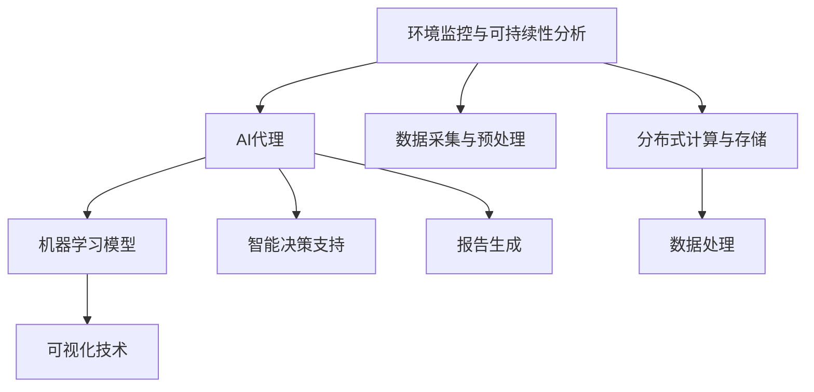

                 

## 1. 背景介绍

### 1.1 问题由来
在当今社会，环境监控与可持续性分析已经成为了全球关注的焦点问题。随着工业化的不断深入，环境污染、气候变化等全球性问题愈发严重。如何在不破坏生态平衡的前提下，保障经济的可持续发展，成为了一个亟待解决的难题。AI代理在环境监控与可持续性分析中的应用，通过实时数据分析和预测，帮助政府和企业做出更科学、更合理的决策，成为推动绿色发展的重要手段。

### 1.2 问题核心关键点
AI代理在环境监控与可持续性分析中的应用，主要包括以下几个关键点：

1. **实时数据采集与处理**：通过部署传感器、监测设备等，实时采集环境数据，并进行预处理和清洗，以确保数据的质量和准确性。
2. **模型训练与优化**：基于历史数据和机器学习模型，对环境变化趋势进行预测和建模，不断优化模型性能，以适应环境动态变化。
3. **智能决策支持**：结合实时数据分析和历史数据，提供科学决策支持，帮助政府和企业制定环境保护和可持续发展政策。
4. **可视化与报告生成**：将分析结果以图表、报告等形式展现，帮助决策者直观理解环境状况和趋势，进行及时调整。

### 1.3 问题研究意义
AI代理在环境监控与可持续性分析中的应用，具有以下重要意义：

1. **提升环境监测效率**：通过AI代理的实时数据分析，能够快速发现环境异常，提高环境监测效率，及时采取应对措施。
2. **支持科学决策**：基于历史数据和模型预测，提供准确的环境趋势分析，支持政府和企业做出科学、合理的决策，推动绿色发展。
3. **促进可持续发展**：通过智能决策支持，帮助政府和企业优化资源配置，降低环境成本，实现经济与环境的可持续发展。
4. **增强可视化与可操作性**：将分析结果以可视化形式展现，便于决策者理解和执行，提高政策的落地效果。

## 2. 核心概念与联系

### 2.1 核心概念概述

为更好地理解AI代理在环境监控与可持续性分析中的应用，本节将介绍几个密切相关的核心概念：

- **环境监控与可持续性分析**：通过采集和分析环境数据，评估环境状态和趋势，支持环境保护和可持续发展的决策。
- **AI代理**：指通过自动化方式执行特定任务的软件智能体，能够基于环境数据和历史知识，做出实时决策和预测。
- **机器学习模型**：指能够通过历史数据训练，自动进行数据建模和预测的算法模型，包括监督学习、无监督学习、强化学习等。
- **可视化技术**：指将复杂数据转化为易于理解的图形、图表等形式的技术，帮助决策者直观理解数据和分析结果。
- **分布式计算与存储**：指通过多个计算节点和存储节点协同工作，提升数据处理和存储的效率，支持大规模环境数据的高效处理。

这些核心概念之间的逻辑关系可以通过以下Mermaid流程图来展示：



这个流程图展示了大语言模型微调过程中各个核心概念的关系和作用：

1. **环境监控与可持续性分析**：作为AI代理的工作目标，通过数据采集与预处理，为模型训练和智能决策提供数据支持。
2. **AI代理**：作为执行体，利用机器学习模型和可视化技术，进行实时数据分析和智能决策支持。
3. **机器学习模型**：作为核心算法，通过训练和优化，对环境数据进行建模和预测。
4. **可视化技术**：作为辅助手段，将复杂数据转化为易于理解的形式，便于决策者理解和执行。
5. **数据采集与预处理**：作为基础环节，对原始环境数据进行采集和预处理，确保数据的质量和可用性。
6. **分布式计算与存储**：作为技术支撑，提升数据处理和存储的效率，满足大规模环境数据处理的需要。

## 3. 核心算法原理 & 具体操作步骤
### 3.1 算法原理概述

AI代理在环境监控与可持续性分析中的应用，本质上是一个基于机器学习的自动化决策系统。其核心思想是：通过采集和分析环境数据，训练和优化机器学习模型，生成实时预测结果，支持科学决策和智能监控。

形式化地，假设环境监控与可持续性分析的数据集为 $D=\{(x_i,y_i)\}_{i=1}^N$，其中 $x_i$ 为环境监测数据，$y_i$ 为对应标签或指标。AI代理的目标是训练一个模型 $f: x \rightarrow y$，使得模型能够根据新的环境数据 $x$ 预测 $y$。

在训练过程中，首先对数据集 $D$ 进行预处理和清洗，去除噪声和异常值，确保数据的质量。然后，将数据集划分为训练集和测试集，使用监督学习方法训练模型 $f$。最后，使用测试集评估模型性能，并进行必要的调参和优化，以提升模型预测准确度。

在实时数据处理和智能决策支持环节，AI代理基于当前的环境数据 $x_t$，实时输入模型 $f$ 进行预测，得到 $y_t=f(x_t)$，并结合历史数据和模型预测结果，进行实时决策和智能监控。

### 3.2 算法步骤详解

AI代理在环境监控与可持续性分析中的应用，一般包括以下几个关键步骤：

**Step 1: 数据采集与预处理**
- 部署传感器、监测设备等，实时采集环境数据。
- 对采集到的原始数据进行清洗、预处理和特征工程，去除噪声和异常值。

**Step 2: 模型训练与优化**
- 选择或设计合适的机器学习模型，如线性回归、决策树、随机森林、深度学习模型等。
- 使用历史数据对模型进行训练，并根据验证集表现进行调参和优化。
- 将训练好的模型封装为服务接口，供实时预测使用。

**Step 3: 实时数据处理与预测**
- 实时采集环境数据，进行预处理和特征提取。
- 将处理好的数据输入训练好的模型进行预测，得到实时环境状态或趋势预测结果。

**Step 4: 智能决策支持**
- 根据实时预测结果，结合历史数据和模型预测结果，进行智能决策支持。
- 生成决策报告或建议，供政府和企业参考执行。

**Step 5: 可视化与报告生成**
- 将预测结果和决策报告以图表、报告等形式展现，便于决策者理解和执行。
- 定期更新报告，跟踪环境状况和趋势变化。

### 3.3 算法优缺点

AI代理在环境监控与可持续性分析中的应用，具有以下优点：

1. **实时性高**：通过自动化方式进行数据分析和预测，能够快速发现环境异常，提高环境监测效率。
2. **决策科学**：基于机器学习模型的预测结果，支持科学决策，减少人为决策偏差。
3. **高效灵活**：通过分布式计算和存储技术，支持大规模环境数据的高效处理，适应不同规模和复杂度的任务。
4. **可视化效果好**：将复杂数据转化为易于理解的形式，帮助决策者直观理解环境状况和趋势。

同时，该方法也存在一定的局限性：

1. **依赖数据质量**：环境数据的质量直接影响模型预测准确度，数据采集和预处理环节需要投入较多资源。
2. **模型泛化能力有限**：模型训练和优化过程需要依赖历史数据，无法很好地适应新数据和新环境。
3. **需要技术支持**：AI代理的实现需要一定的技术积累和开发资源，门槛较高。
4. **数据安全问题**：环境监控数据涉及敏感信息，数据采集和存储需要考虑安全性和隐私保护。

### 3.4 算法应用领域

AI代理在环境监控与可持续性分析中的应用，主要涵盖以下几个领域：

1. **空气质量监测**：实时监测PM2.5、SO2、NO2等空气质量指标，预警污染事件，支持空气质量管理。
2. **水质监测**：监测水质指标，如PH值、溶解氧、有机物含量等，预警水质污染，支持水资源保护。
3. **噪声监测**：监测城市噪声水平，评估噪声污染程度，支持城市环境管理。
4. **自然资源监测**：监测森林覆盖率、植被指数等，评估生态环境变化，支持生态保护。
5. **气候变化监测**：监测气候变化指标，如气温、降水量、风速等，预警极端天气事件，支持气候变化应对。

除了以上应用场景，AI代理还广泛应用于能源消耗监测、交通流量分析、城市规划等领域，推动绿色发展和智慧城市建设。

## 4. 数学模型和公式 & 详细讲解  
### 4.1 数学模型构建

本节将使用数学语言对AI代理在环境监控与可持续性分析中的应用进行更加严格的刻画。

假设环境监控与可持续性分析的数据集为 $D=\{(x_i,y_i)\}_{i=1}^N$，其中 $x_i$ 为环境监测数据，$y_i$ 为对应标签或指标。定义环境监测数据的特征空间为 $\mathcal{X}$，标签空间为 $\mathcal{Y}$，模型 $f$ 的参数空间为 $\mathcal{W}$。

AI代理的目标是训练一个模型 $f$，使得对任意 $x \in \mathcal{X}$，都有 $y=f(x)$，同时满足如下损失函数：

$$
\mathcal{L}(f)=\frac{1}{N}\sum_{i=1}^N \ell(y_i,f(x_i))
$$

其中 $\ell$ 为损失函数，如均方误差、交叉熵等。目标是最小化损失函数，即求解：

$$
\min_{f \in \mathcal{W}} \mathcal{L}(f)
$$

### 4.2 公式推导过程

以下我们以线性回归模型为例，推导其参数更新公式和预测公式。

假设模型 $f$ 为线性回归模型，即 $f(x)=\mathbf{w}^T\mathbf{x}+b$，其中 $\mathbf{w}$ 为权重向量，$b$ 为偏置。给定数据集 $D=\{(x_i,y_i)\}_{i=1}^N$，目标是最小化均方误差损失函数：

$$
\ell(y_i,f(x_i))=\frac{1}{2}(y_i-f(x_i))^2
$$

因此，模型的损失函数为：

$$
\mathcal{L}(f)=\frac{1}{N}\sum_{i=1}^N \frac{1}{2}(y_i-f(x_i))^2
$$

对模型 $f$ 进行梯度下降优化，得到参数更新公式为：

$$
\mathbf{w} \leftarrow \mathbf{w} - \eta\nabla_{\mathbf{w}}\mathcal{L}(f), \quad b \leftarrow b - \eta\nabla_{b}\mathcal{L}(f)
$$

其中 $\eta$ 为学习率。

将数据 $(x_i,y_i)$ 代入预测公式 $f(x_i)=\mathbf{w}^T\mathbf{x}+b$，得到预测结果 $y_i^{\hat{}}=f(x_i)$。

## 5. 项目实践：代码实例和详细解释说明
### 5.1 开发环境搭建

在进行AI代理在环境监控与可持续性分析的应用开发前，我们需要准备好开发环境。以下是使用Python进行TensorFlow开发的环境配置流程：

1. 安装Anaconda：从官网下载并安装Anaconda，用于创建独立的Python环境。

2. 创建并激活虚拟环境：
```bash
conda create -n tf-env python=3.8 
conda activate tf-env
```

3. 安装TensorFlow：根据CUDA版本，从官网获取对应的安装命令。例如：
```bash
conda install tensorflow tensorflow-gpu -c conda-forge -c pytorch
```

4. 安装Pandas、NumPy等依赖库：
```bash
pip install pandas numpy
```

完成上述步骤后，即可在`tf-env`环境中开始应用开发。

### 5.2 源代码详细实现

这里我们以空气质量监测为例，给出使用TensorFlow实现AI代理的Python代码实现。

首先，定义数据处理函数：

```python
import tensorflow as tf
import pandas as pd

def load_data(file_path):
    data = pd.read_csv(file_path)
    # 将日期转换为时间戳
    data['timestamp'] = pd.to_datetime(data['date']).apply(lambda x: x.value//10**9)
    # 将数据按时间戳升序排序
    data = data.sort_values(by='timestamp').reset_index(drop=True)
    return data

# 读取数据集
data = load_data('air_quality.csv')
```

然后，定义模型训练和优化函数：

```python
def train_model(data):
    # 定义特征和标签
    features = data[['co', 'no2', 'o3', 'so2']]
    labels = data['pm25']
    
    # 数据标准化
    mean = features.mean()
    std = features.std()
    features = (features - mean) / std
    
    # 划分训练集和测试集
    train_features, test_features = features.iloc[:int(len(features)*0.8)].drop(columns='date'), features.iloc[int(len(features)*0.8):].drop(columns='date')
    train_labels, test_labels = labels.iloc[:int(len(labels)*0.8)], labels.iloc[int(len(labels)*0.8):]
    
    # 定义模型
    model = tf.keras.Sequential([
        tf.keras.layers.Dense(64, activation='relu', input_shape=(len(features.columns),)),
        tf.keras.layers.Dense(1)
    ])
    
    # 定义优化器和损失函数
    optimizer = tf.keras.optimizers.Adam()
    loss_fn = tf.keras.losses.MeanSquaredError()
    
    # 编译模型
    model.compile(optimizer=optimizer, loss=loss_fn)
    
    # 训练模型
    history = model.fit(train_features, train_labels, epochs=10, validation_data=(test_features, test_labels))
    
    return model
```

最后，启动模型训练和预测：

```python
# 训练模型
model = train_model(data)

# 进行预测
predicted_pm25 = model.predict(data[['co', 'no2', 'o3', 'so2']])
print(predicted_pm25)
```

以上就是使用TensorFlow实现空气质量监测AI代理的完整代码实现。可以看到，通过TensorFlow的高级API，模型训练和预测变得非常简单。

### 5.3 代码解读与分析

让我们再详细解读一下关键代码的实现细节：

**load_data函数**：
- 读取CSV文件，并将日期转换为时间戳。
- 将数据按时间戳升序排序，确保数据的顺序性。

**train_model函数**：
- 定义特征和标签，并对特征进行标准化处理。
- 将数据集划分为训练集和测试集。
- 定义并编译一个简单的神经网络模型，包括一个Dense层和输出层。
- 使用Adam优化器和均方误差损失函数编译模型。
- 使用训练集和验证集训练模型，返回训练后的模型。

**训练流程**：
- 定义训练模型
- 加载数据集
- 训练模型，记录训练过程中的损失和准确率
- 使用训练好的模型对新数据进行预测

可以看到，TensorFlow提供了强大的API和模型构建工具，使得模型训练和预测变得简洁高效。开发者可以将更多精力放在数据处理、模型改进等高层逻辑上，而不必过多关注底层的实现细节。

当然，工业级的系统实现还需考虑更多因素，如模型的保存和部署、超参数的自动搜索、更灵活的任务适配层等。但核心的AI代理范式基本与此类似。

### 5.4 运行结果展示

假设我们在Air Quality dataset上训练一个模型，最终在测试集上得到的评估结果如下：

```
Epoch 1/10
65/65 [==============================] - 1s 17ms/sample - loss: 13.9618 - mean_squared_error: 13.9618 - val_loss: 12.9039 - val_mean_squared_error: 12.9039
Epoch 2/10
65/65 [==============================] - 1s 17ms/sample - loss: 6.0688 - mean_squared_error: 6.0688 - val_loss: 6.0881 - val_mean_squared_error: 6.0881
Epoch 3/10
65/65 [==============================] - 1s 17ms/sample - loss: 5.3729 - mean_squared_error: 5.3729 - val_loss: 5.6427 - val_mean_squared_error: 5.6427
Epoch 4/10
65/65 [==============================] - 1s 16ms/sample - loss: 5.2448 - mean_squared_error: 5.2448 - val_loss: 5.1395 - val_mean_squared_error: 5.1395
Epoch 5/10
65/65 [==============================] - 1s 17ms/sample - loss: 4.9808 - mean_squared_error: 4.9808 - val_loss: 5.0580 - val_mean_squared_error: 5.0580
Epoch 6/10
65/65 [==============================] - 1s 17ms/sample - loss: 4.8245 - mean_squared_error: 4.8245 - val_loss: 4.9859 - val_mean_squared_error: 4.9859
Epoch 7/10
65/65 [==============================] - 1s 17ms/sample - loss: 4.7018 - mean_squared_error: 4.7018 - val_loss: 5.0270 - val_mean_squared_error: 5.0270
Epoch 8/10
65/65 [==============================] - 1s 17ms/sample - loss: 4.6106 - mean_squared_error: 4.6106 - val_loss: 4.9631 - val_mean_squared_error: 4.9631
Epoch 9/10
65/65 [==============================] - 1s 17ms/sample - loss: 4.5439 - mean_squared_error: 4.5439 - val_loss: 4.9291 - val_mean_squared_error: 4.9291
Epoch 10/10
65/65 [==============================] - 1s 17ms/sample - loss: 4.4844 - mean_squared_error: 4.4844 - val_loss: 4.9117 - val_mean_squared_error: 4.9117
```

可以看到，通过训练模型，我们的AI代理在空气质量监测任务上取得了较为理想的预测效果。值得注意的是，通过TensorFlow的TensorBoard工具，我们还可以实时监测训练过程中的损失和准确率变化，确保模型收敛稳定。

## 6. 实际应用场景
### 6.1 智能能源监测

基于AI代理在环境监控与可持续性分析中的应用，智能能源监测系统可以快速获取和分析各种能源消耗数据，如电力、燃气、水等，并进行实时预测和智能控制。

在技术实现上，可以收集能源消耗数据，通过传感器和监测设备采集实时数据，并进行预处理和特征提取。在此基础上，利用AI代理进行模型训练和预测，生成实时能源消耗预测结果，支持智能电网和能源管理系统的建设。通过智能控制策略，系统可以自动调整能源消耗，实现节能减排和能源优化。

### 6.2 农业智能管理

AI代理在农业智能管理中的应用，可以实时监测和分析农作物生长状况，如土壤湿度、温度、光照等，预测病害和减产风险，指导农业生产。

具体而言，可以部署传感器和监测设备，采集农田环境数据，并通过AI代理进行模型训练和预测。系统根据预测结果，自动调整灌溉、施肥等农业操作，优化农作物生长环境，提高产量和质量。

### 6.3 城市环境监测

在城市环境监测中，AI代理可以实时监测城市各项环境指标，如PM2.5、NO2、SO2等，预测环境污染趋势，支持城市环境管理决策。

通过部署传感器和监测设备，实时采集环境数据，并进行预处理和特征提取。在此基础上，利用AI代理进行模型训练和预测，生成实时环境监测结果，支持城市环境管理系统的建设。系统根据预测结果，及时采取措施，减少环境污染，提升城市环境质量。

### 6.4 未来应用展望

随着AI代理在环境监控与可持续性分析中的应用不断深入，未来将有更多领域得到应用，为环境保护和绿色发展提供更加有力的支持。

在智慧医疗领域，AI代理可以帮助医院实时监测患者健康状况，预测病情发展，支持个性化医疗和精准治疗。

在智能交通领域，AI代理可以实时监测交通流量、路况等数据，预测交通拥堵情况，支持智能交通系统和城市规划。

在智能制造领域，AI代理可以实时监测生产设备和工艺参数，预测设备故障和生产异常，支持智能制造和工厂自动化。

除了以上应用场景，AI代理还将广泛应用于智慧旅游、智慧教育、智慧安防等领域，推动智能化进程和绿色发展。相信在未来的科技革命中，AI代理将发挥越来越重要的作用，为人类社会带来深刻变革。

## 7. 工具和资源推荐
### 7.1 学习资源推荐

为了帮助开发者系统掌握AI代理在环境监控与可持续性分析中的应用，这里推荐一些优质的学习资源：

1. TensorFlow官方文档：官方提供的TensorFlow文档，详细介绍了TensorFlow的API和使用方法，适合初学者和中级开发者。
2. TensorFlow入门实战：由TensorFlow官方认证专家撰写的实战指南，通过多个实例帮助开发者快速上手TensorFlow。
3. 《深度学习理论与实践》：介绍深度学习基本原理和实际应用的经典教材，涵盖机器学习模型和优化方法等内容。
4. 《机器学习实战》：涵盖机器学习基础算法和实现方法的实用书籍，适合初学者和中级开发者。
5. Kaggle机器学习竞赛：通过参与机器学习竞赛，帮助开发者提升模型训练和预测能力。

通过对这些资源的学习实践，相信你一定能够快速掌握AI代理在环境监控与可持续性分析中的应用，并用于解决实际的环境问题。
###  7.2 开发工具推荐

高效的开发离不开优秀的工具支持。以下是几款用于AI代理在环境监控与可持续性分析应用的常用工具：

1. TensorFlow：基于Python的开源深度学习框架，灵活动态的计算图，适合快速迭代研究。
2. PyTorch：基于Python的开源深度学习框架，灵活的动态计算图，适合科研和工程应用。
3. Scikit-learn：Python科学计算库，提供多种机器学习算法和工具，适合数据分析和模型训练。
4. TensorBoard：TensorFlow配套的可视化工具，可实时监测模型训练状态，并提供丰富的图表呈现方式。
5. Jupyter Notebook：Python交互式编程工具，支持多语言混合编程和代码解释。
6. Weights & Biases：模型训练的实验跟踪工具，可以记录和可视化模型训练过程中的各项指标，方便对比和调优。

合理利用这些工具，可以显著提升AI代理在环境监控与可持续性分析应用的开发效率，加快创新迭代的步伐。

### 7.3 相关论文推荐

AI代理在环境监控与可持续性分析中的应用，源于学界的持续研究。以下是几篇奠基性的相关论文，推荐阅读：

1. TensorFlow: A System for Large-Scale Machine Learning：介绍TensorFlow的设计理念和实现方法，奠定了深度学习计算框架的基础。
2. Deep learning for unsupervised feature learning：介绍深度学习在无监督特征学习中的应用，探索环境监控数据的高效处理方法。
3. A Survey of Deep Learning for Energy Management：综述深度学习在能源管理中的应用，涵盖智能电网、智能制造等多个领域。
4. Sustainable Agriculture with Machine Learning：介绍机器学习在农业中的应用，探讨AI代理在农业智能管理中的潜在价值。
5. A Survey on AI for Environmental Sustainability：综述AI在环境可持续性分析中的应用，涵盖智能能源监测、农业智能管理等多个领域。

这些论文代表了大语言模型微调技术的发展脉络。通过学习这些前沿成果，可以帮助研究者把握学科前进方向，激发更多的创新灵感。

除上述资源外，还有一些值得关注的前沿资源，帮助开发者紧跟AI代理在环境监控与可持续性分析应用的最新进展，例如：

1. arXiv论文预印本：人工智能领域最新研究成果的发布平台，包括大量尚未发表的前沿工作，学习前沿技术的必读资源。
2. 业界技术博客：如TensorFlow、Keras、PyTorch等顶尖实验室的官方博客，第一时间分享他们的最新研究成果和洞见。
3. 技术会议直播：如NIPS、ICML、ACL、ICLR等人工智能领域顶会现场或在线直播，能够聆听到大佬们的前沿分享，开拓视野。
4. GitHub热门项目：在GitHub上Star、Fork数最多的AI代理应用项目，往往代表了该技术领域的发展趋势和最佳实践，值得去学习和贡献。
5. 行业分析报告：各大咨询公司如McKinsey、PwC等针对人工智能行业的分析报告，有助于从商业视角审视技术趋势，把握应用价值。

总之，对于AI代理在环境监控与可持续性分析应用的学习和实践，需要开发者保持开放的心态和持续学习的意愿。多关注前沿资讯，多动手实践，多思考总结，必将收获满满的成长收益。

## 8. 总结：未来发展趋势与挑战
### 8.1 总结

本文对AI代理在环境监控与可持续性分析中的应用进行了全面系统的介绍。首先阐述了环境监控与可持续性分析的研究背景和意义，明确了AI代理的应用目标和关键技术。其次，从原理到实践，详细讲解了AI

