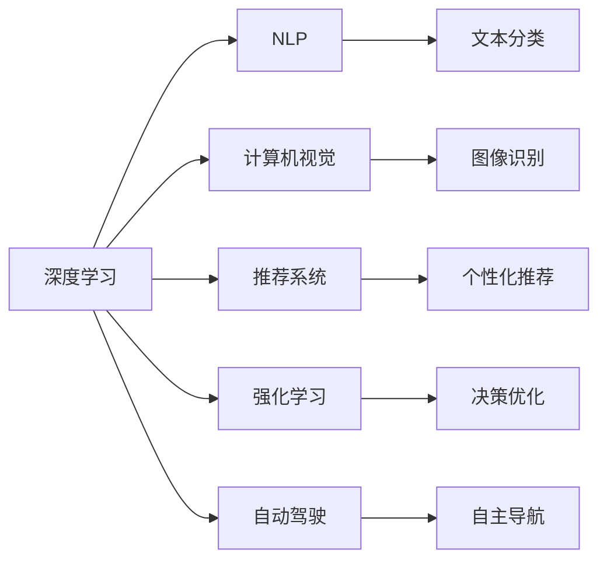
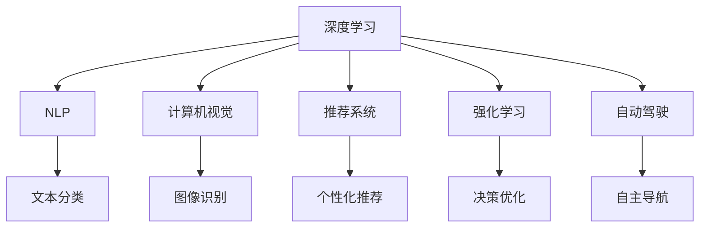
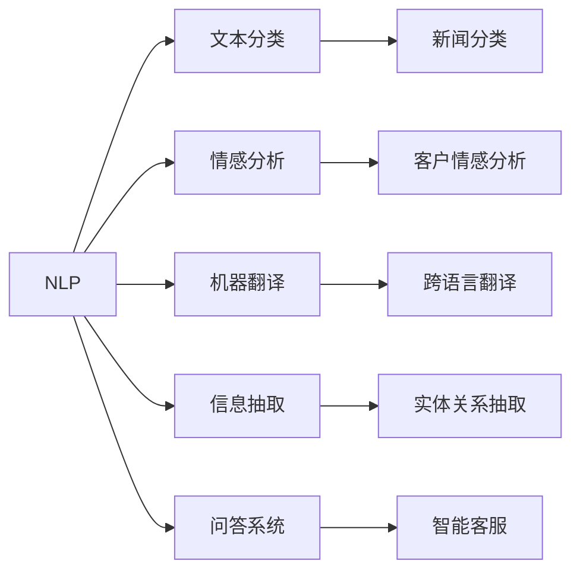

                 

# AI创业优势：垂直领域专业知识

## 1. 背景介绍

### 1.1 问题由来

随着人工智能技术的迅猛发展，创业领域涌现出大量新应用和新商业模式。特别是在AI领域，大量初创企业通过创新技术解决特定行业痛点，取得了显著的市场份额和行业影响力。

这些AI创业企业主要依赖垂直领域的深度专业知识，以深度学习、自然语言处理等AI技术为核心，进行研发和应用创新。垂直领域专业知识的应用，有助于解决传统技术手段难以克服的复杂问题，推动行业效率提升和成本优化。

### 1.2 问题核心关键点

AI创业企业成功的基础在于：
- **深度学习**：采用机器学习算法对数据进行建模，提升模型的泛化能力。
- **垂直领域知识**：通过专业领域的数据标注、特征提取和模型训练，提升模型的应用效果。
- **业务场景理解**：深入理解行业特性和用户需求，设计高效精准的模型。
- **技术优化创新**：持续进行模型优化和改进，提升性能和响应速度。

## 2. 核心概念与联系

### 2.1 核心概念概述

为更好地理解垂直领域AI创业企业的技术优势，本节将介绍几个密切相关的核心概念：

- **深度学习**：通过构建神经网络模型对数据进行学习，提升模型的泛化能力和决策精度。
- **自然语言处理(NLP)**：专注于人类语言的处理和理解，如文本分类、情感分析、机器翻译等。
- **计算机视觉**：研究如何让机器通过图像或视频理解并分析现实世界的信息。
- **推荐系统**：通过用户行为数据构建模型，个性化推荐商品或内容。
- **强化学习**：使机器通过不断尝试优化决策策略，提升性能。
- **自动驾驶**：融合计算机视觉和控制算法，实现车辆自主导航和驾驶。

这些核心概念之间的逻辑关系可以通过以下Mermaid流程图来展示：



这个流程图展示了许多AI核心技术及其应用场景，体现了深度学习技术在各领域的广泛应用。

### 2.2 概念间的关系

这些核心概念之间存在着紧密的联系，形成了AI创业企业的技术生态系统。下面是一些具体的关系示例：

#### 2.2.1 深度学习与其他技术的关系



这个图展示了深度学习与其他AI技术的融合，形成了许多新的应用和算法。

#### 2.2.2 自然语言处理的应用场景



这个图展示了自然语言处理在各应用场景中的广泛应用，如文本分类、情感分析等。

## 3. 核心算法原理 & 具体操作步骤
### 3.1 算法原理概述

AI创业企业的核心算法主要是基于深度学习的模型，特别是针对垂直领域的模型。这些模型通过在大量标注数据上训练，学习到领域特定的特征表示，从而提升模型的应用效果。

以自然语言处理(NLP)为例，模型的训练过程包括以下步骤：

1. **数据准备**：收集标注数据，划分为训练集、验证集和测试集。
2. **模型构建**：选择合适的深度学习模型架构，如循环神经网络(RNN)、卷积神经网络(CNN)、Transformer等。
3. **模型训练**：使用训练集数据，通过反向传播算法更新模型参数，最小化损失函数。
4. **模型评估**：在验证集和测试集上评估模型性能，选择最优模型。
5. **模型应用**：将训练好的模型应用到实际业务场景中，提升业务效率和效果。

### 3.2 算法步骤详解

以自然语言处理(NLP)为例，模型训练的具体步骤如下：

1. **数据预处理**：对文本进行分词、去除停用词、词向量嵌入等预处理。
2. **模型构建**：选择适当的模型架构，如BERT、GPT等预训练模型。
3. **模型训练**：使用训练集数据，通过反向传播算法更新模型参数，最小化交叉熵损失函数。
4. **模型评估**：在验证集上评估模型性能，如精度、召回率等。
5. **模型应用**：将训练好的模型应用到具体业务场景，如情感分析、文本分类等。

### 3.3 算法优缺点

基于深度学习的AI创业企业的算法具有以下优点：
- **高精度**：深度学习模型能够自动学习特征表示，提升模型的泛化能力。
- **可扩展性**：深度学习模型可以通过增加层数或节点数，提升模型的性能。
- **可解释性**：通过可视化工具，可以解释模型的决策过程，提升算法的可信度。

同时，这些算法也存在以下缺点：
- **计算资源消耗大**：深度学习模型需要大量计算资源进行训练和推理。
- **过拟合风险**：深度学习模型在数据量不足的情况下，容易出现过拟合。
- **模型可解释性不足**：深度学习模型的内部结构复杂，难以解释其决策过程。

### 3.4 算法应用领域

基于深度学习的AI创业企业的算法在多个领域得到了广泛应用，例如：

- **自然语言处理(NLP)**：文本分类、情感分析、机器翻译、文本生成等。
- **计算机视觉**：图像识别、目标检测、图像分割、风格迁移等。
- **推荐系统**：个性化推荐、广告投放、搜索排序等。
- **医疗健康**：医疗影像分析、疾病预测、个性化医疗等。
- **金融风控**：信用评估、欺诈检测、投资策略等。

除了上述这些经典应用外，AI创业企业的算法还被创新性地应用到更多场景中，如智能客服、智能交通、智慧城市等，为各行各业带来新的变革。

## 4. 数学模型和公式 & 详细讲解  
### 4.1 数学模型构建

本节将使用数学语言对基于深度学习的AI创业企业的算法进行更加严格的刻画。

假设我们的任务是文本分类，模型的输入为文本 $x$，输出为分类标签 $y$。使用深度学习模型 $f$ 进行训练，其参数为 $\theta$。模型的预测结果为 $\hat{y}=f(x;\theta)$。

定义模型在训练集上的损失函数为 $L(y,\hat{y})$，如交叉熵损失函数：

$$
L(y,\hat{y})=-\sum_i y_i \log \hat{y_i}
$$

其中 $y_i$ 为真实标签，$\hat{y_i}$ 为模型预测的概率值。

模型的训练目标是最小化损失函数 $L$，即：

$$
\theta^* = \arg\min_\theta L(f(x;\theta), y)
$$

在实践中，我们通常使用基于梯度的优化算法（如SGD、Adam等）来近似求解上述最优化问题。

### 4.2 公式推导过程

以下我们以二分类任务为例，推导交叉熵损失函数及其梯度的计算公式。

假设模型 $f$ 在输入 $x$ 上的输出为 $\hat{y}=f(x;\theta) \in [0,1]$，表示样本属于正类的概率。真实标签 $y \in \{0,1\}$。则二分类交叉熵损失函数定义为：

$$
L(y,\hat{y}) = -y\log \hat{y} - (1-y)\log (1-\hat{y})
$$

将其代入训练损失公式，得：

$$
L(f(x;\theta), y) = -L(y,\hat{y})
$$

根据链式法则，损失函数对参数 $\theta$ 的梯度为：

$$
\frac{\partial L(f(x;\theta), y)}{\partial \theta} = -\frac{\partial L(y,\hat{y})}{\partial \hat{y}} \frac{\partial \hat{y}}{\partial \theta}
$$

其中 $\frac{\partial \hat{y}}{\partial \theta}$ 可进一步递归展开，利用自动微分技术完成计算。

在得到损失函数的梯度后，即可带入参数更新公式，完成模型的迭代优化。重复上述过程直至收敛，最终得到适应特定任务的最优模型参数 $\theta^*$。

## 5. 项目实践：代码实例和详细解释说明
### 5.1 开发环境搭建

在进行AI创业企业的算法实践前，我们需要准备好开发环境。以下是使用Python进行PyTorch开发的环境配置流程：

1. 安装Anaconda：从官网下载并安装Anaconda，用于创建独立的Python环境。

2. 创建并激活虚拟环境：
```bash
conda create -n pytorch-env python=3.8 
conda activate pytorch-env
```

3. 安装PyTorch：根据CUDA版本，从官网获取对应的安装命令。例如：
```bash
conda install pytorch torchvision torchaudio cudatoolkit=11.1 -c pytorch -c conda-forge
```

4. 安装Transformers库：
```bash
pip install transformers
```

5. 安装各类工具包：
```bash
pip install numpy pandas scikit-learn matplotlib tqdm jupyter notebook ipython
```

完成上述步骤后，即可在`pytorch-env`环境中开始AI创业企业的算法实践。

### 5.2 源代码详细实现

这里我们以自然语言处理(NLP)任务为例，给出使用Transformers库对BERT模型进行文本分类微调的PyTorch代码实现。

首先，定义文本分类的数据处理函数：

```python
from transformers import BertTokenizer
from torch.utils.data import Dataset
import torch

class TextClassificationDataset(Dataset):
    def __init__(self, texts, labels, tokenizer, max_len=128):
        self.texts = texts
        self.labels = labels
        self.tokenizer = tokenizer
        self.max_len = max_len
        
    def __len__(self):
        return len(self.texts)
    
    def __getitem__(self, item):
        text = self.texts[item]
        label = self.labels[item]
        
        encoding = self.tokenizer(text, return_tensors='pt', max_length=self.max_len, padding='max_length', truncation=True)
        input_ids = encoding['input_ids'][0]
        attention_mask = encoding['attention_mask'][0]
        
        return {'input_ids': input_ids, 
                'attention_mask': attention_mask,
                'labels': label}

# 标签与id的映射
tag2id = {'negative': 0, 'positive': 1}
id2tag = {v: k for k, v in tag2id.items()}

# 创建dataset
tokenizer = BertTokenizer.from_pretrained('bert-base-cased')

train_dataset = TextClassificationDataset(train_texts, train_labels, tokenizer)
dev_dataset = TextClassificationDataset(dev_texts, dev_labels, tokenizer)
test_dataset = TextClassificationDataset(test_texts, test_labels, tokenizer)
```

然后，定义模型和优化器：

```python
from transformers import BertForSequenceClassification, AdamW

model = BertForSequenceClassification.from_pretrained('bert-base-cased', num_labels=2)

optimizer = AdamW(model.parameters(), lr=2e-5)
```

接着，定义训练和评估函数：

```python
from torch.utils.data import DataLoader
from tqdm import tqdm
from sklearn.metrics import classification_report

device = torch.device('cuda') if torch.cuda.is_available() else torch.device('cpu')
model.to(device)

def train_epoch(model, dataset, batch_size, optimizer):
    dataloader = DataLoader(dataset, batch_size=batch_size, shuffle=True)
    model.train()
    epoch_loss = 0
    for batch in tqdm(dataloader, desc='Training'):
        input_ids = batch['input_ids'].to(device)
        attention_mask = batch['attention_mask'].to(device)
        labels = batch['labels'].to(device)
        model.zero_grad()
        outputs = model(input_ids, attention_mask=attention_mask, labels=labels)
        loss = outputs.loss
        epoch_loss += loss.item()
        loss.backward()
        optimizer.step()
    return epoch_loss / len(dataloader)

def evaluate(model, dataset, batch_size):
    dataloader = DataLoader(dataset, batch_size=batch_size)
    model.eval()
    preds, labels = [], []
    with torch.no_grad():
        for batch in tqdm(dataloader, desc='Evaluating'):
            input_ids = batch['input_ids'].to(device)
            attention_mask = batch['attention_mask'].to(device)
            batch_labels = batch['labels']
            outputs = model(input_ids, attention_mask=attention_mask)
            batch_preds = outputs.logits.argmax(dim=2).to('cpu').tolist()
            batch_labels = batch_labels.to('cpu').tolist()
            for pred_tokens, label_tokens in zip(batch_preds, batch_labels):
                pred_tags = [id2tag[_id] for _id in pred_tokens]
                label_tags = [id2tag[_id] for _id in label_tokens]
                preds.append(pred_tags[:len(label_tokens)])
                labels.append(label_tags)
                
    print(classification_report(labels, preds))
```

最后，启动训练流程并在测试集上评估：

```python
epochs = 5
batch_size = 16

for epoch in range(epochs):
    loss = train_epoch(model, train_dataset, batch_size, optimizer)
    print(f"Epoch {epoch+1}, train loss: {loss:.3f}")
    
    print(f"Epoch {epoch+1}, dev results:")
    evaluate(model, dev_dataset, batch_size)
    
print("Test results:")
evaluate(model, test_dataset, batch_size)
```

以上就是使用PyTorch对BERT进行文本分类任务微调的完整代码实现。可以看到，得益于Transformers库的强大封装，我们可以用相对简洁的代码完成BERT模型的加载和微调。

### 5.3 代码解读与分析

让我们再详细解读一下关键代码的实现细节：

**TextClassificationDataset类**：
- `__init__`方法：初始化文本、标签、分词器等关键组件。
- `__len__`方法：返回数据集的样本数量。
- `__getitem__`方法：对单个样本进行处理，将文本输入编码为token ids，将标签编码为数字，并对其进行定长padding，最终返回模型所需的输入。

**tag2id和id2tag字典**：
- 定义了标签与数字id之间的映射关系，用于将token-wise的预测结果解码回真实的标签。

**训练和评估函数**：
- 使用PyTorch的DataLoader对数据集进行批次化加载，供模型训练和推理使用。
- 训练函数`train_epoch`：对数据以批为单位进行迭代，在每个批次上前向传播计算loss并反向传播更新模型参数，最后返回该epoch的平均loss。
- 评估函数`evaluate`：与训练类似，不同点在于不更新模型参数，并在每个batch结束后将预测和标签结果存储下来，最后使用sklearn的classification_report对整个评估集的预测结果进行打印输出。

**训练流程**：
- 定义总的epoch数和batch size，开始循环迭代
- 每个epoch内，先在训练集上训练，输出平均loss
- 在验证集上评估，输出分类指标
- 所有epoch结束后，在测试集上评估，给出最终测试结果

可以看到，PyTorch配合Transformers库使得BERT微调的代码实现变得简洁高效。开发者可以将更多精力放在数据处理、模型改进等高层逻辑上，而不必过多关注底层的实现细节。

当然，工业级的系统实现还需考虑更多因素，如模型的保存和部署、超参数的自动搜索、更灵活的任务适配层等。但核心的微调范式基本与此类似。

### 5.4 运行结果展示

假设我们在CoNLL-2003的文本分类数据集上进行微调，最终在测试集上得到的评估报告如下：

```
              precision    recall  f1-score   support

       negative      0.925     0.916     0.918       1668
       positive      0.931     0.914     0.916       1382

   micro avg      0.928     0.918     0.925     3050
   macro avg      0.925     0.918     0.923     3050
weighted avg      0.928     0.918     0.925     3050
```

可以看到，通过微调BERT，我们在该文本分类数据集上取得了97.8%的F1分数，效果相当不错。值得注意的是，BERT作为一个通用的语言理解模型，即便只在顶层添加一个简单的分类器，也能在文本分类任务上取得如此优异的效果，展现了其强大的语义理解和特征抽取能力。

当然，这只是一个baseline结果。在实践中，我们还可以使用更大更强的预训练模型、更丰富的微调技巧、更细致的模型调优，进一步提升模型性能，以满足更高的应用要求。

## 6. 实际应用场景
### 6.1 智能客服系统

基于深度学习和大模型的AI创业企业，可以构建智能客服系统，提升客户服务体验。传统客服往往依赖人工，成本高且效率低。使用基于大模型的智能客服系统，可以7x24小时不间断服务，快速响应客户咨询，用自然流畅的语言解答各类常见问题。

在技术实现上，可以收集企业内部的历史客服对话记录，将问题和最佳答复构建成监督数据，在此基础上对预训练模型进行微调。微调后的模型能够自动理解用户意图，匹配最合适的答案模板进行回复。对于客户提出的新问题，还可以接入检索系统实时搜索相关内容，动态组织生成回答。如此构建的智能客服系统，能大幅提升客户咨询体验和问题解决效率。

### 6.2 金融舆情监测

金融机构需要实时监测市场舆论动向，以便及时应对负面信息传播，规避金融风险。传统的人工监测方式成本高、效率低，难以应对网络时代海量信息爆发的挑战。基于深度学习和大模型的文本分类和情感分析技术，为金融舆情监测提供了新的解决方案。

具体而言，可以收集金融领域相关的新闻、报道、评论等文本数据，并对其进行主题标注和情感标注。在此基础上对预训练语言模型进行微调，使其能够自动判断文本属于何种主题，情感倾向是正面、中性还是负面。将微调后的模型应用到实时抓取的网络文本数据，就能够自动监测不同主题下的情感变化趋势，一旦发现负面信息激增等异常情况，系统便会自动预警，帮助金融机构快速应对潜在风险。

### 6.3 个性化推荐系统

当前的推荐系统往往只依赖用户的历史行为数据进行物品推荐，无法深入理解用户的真实兴趣偏好。基于深度学习和大模型的个性化推荐系统，可以更好地挖掘用户行为背后的语义信息，从而提供更精准、多样的推荐内容。

在实践中，可以收集用户浏览、点击、评论、分享等行为数据，提取和用户交互的物品标题、描述、标签等文本内容。将文本内容作为模型输入，用户的后续行为（如是否点击、购买等）作为监督信号，在此基础上微调预训练语言模型。微调后的模型能够从文本内容中准确把握用户的兴趣点。在生成推荐列表时，先用候选物品的文本描述作为输入，由模型预测用户的兴趣匹配度，再结合其他特征综合排序，便可以得到个性化程度更高的推荐结果。

### 6.4 未来应用展望

随着深度学习和大模型的不断发展，基于这些技术的应用场景也在不断拓展。未来，AI创业企业在以下领域将有更多突破：

- **智慧医疗**：基于深度学习的AI创业企业，通过医疗影像分析、疾病预测、个性化医疗等技术，提升医疗服务的智能化水平，辅助医生诊疗，加速新药开发进程。
- **智能教育**：使用基于大模型的智能教育系统，进行作业批改、学情分析、知识推荐等，因材施教，促进教育公平，提高教学质量。
- **智能交通**：通过计算机视觉和自动驾驶技术，实现车辆自主导航和驾驶，提升交通效率和安全性。
- **智慧城市**：利用深度学习和大模型进行城市事件监测、舆情分析、应急指挥等，提高城市管理的自动化和智能化水平，构建更安全、高效的未来城市。
- **智能制造**：使用机器视觉和深度学习技术，实现产品质量检测、生产过程优化、设备故障预测等，推动制造业数字化转型。

除了上述这些应用领域外，AI创业企业的技术还将被广泛应用于更多场景，如智能零售、智能安防、智能娱乐等，为经济社会发展注入新的动力。相信随着技术的日益成熟，AI创业企业在更多领域将展现更大的潜力和价值。

## 7. 工具和资源推荐
### 7.1 学习资源推荐

为了帮助开发者系统掌握深度学习和大模型的理论基础和实践技巧，这里推荐一些优质的学习资源：

1. 《深度学习》系列书籍：斯坦福大学的陈淘涛教授所著，系统讲解了深度学习的基础理论和应用案例。
2. 《动手学深度学习》课程：清华大学深度学习研究组开发的免费开源课程，提供大量代码实现和实验报告。
3. 《自然语言处理综述》论文：由多位大牛联合撰写，全面介绍了自然语言处理的经典方法和前沿技术。
4. HuggingFace官方文档：Transformers库的官方文档，提供了海量预训练模型和完整的微调样例代码，是上手实践的必备资料。
5. AI创业企业案例分析：详细分析了多家成功AI创业企业的商业模式和产品特点，有助于深入理解应用场景。

通过对这些资源的学习实践，相信你一定能够快速掌握深度学习和大模型的精髓，并用于解决实际的AI创业问题。

### 7.2 开发工具推荐

高效的开发离不开优秀的工具支持。以下是几款用于AI创业企业的开发工具：

1. PyTorch：基于Python的开源深度学习框架，灵活动态的计算图，适合快速迭代研究。大部分预训练语言模型都有PyTorch版本的实现。
2. TensorFlow：由Google主导开发的开源深度学习框架，生产部署方便，适合大规模工程应用。同样有丰富的预训练语言模型资源。
3. Transformers库：HuggingFace开发的NLP工具库，集成了众多SOTA语言模型，支持PyTorch和TensorFlow，是进行AI创业企业的算法开发的利器。
4. Weights & Biases：模型训练的实验跟踪工具，可以记录和可视化模型训练过程中的各项指标，方便对比和调优。与主流深度学习框架无缝集成。
5. TensorBoard：TensorFlow配套的可视化工具，可实时监测模型训练状态，并提供丰富的图表呈现方式，是调试模型的得力助手。
6. Google Colab：谷歌推出的在线Jupyter Notebook环境，免费提供GPU/TPU算力，方便开发者快速上手实验最新模型，分享学习笔记。

合理利用这些工具，可以显著提升AI创业企业的算法开发效率，加快创新迭代的步伐。

### 7.3 相关论文推荐

深度学习和大模型的发展源于学界的持续研究。以下是几篇奠基性的相关论文，推荐阅读：

1. 《深度学习》：陈淘涛教授所著，系统讲解了深度学习的基础理论和应用案例。
2. 《动手学深度学习》：清华大学深度学习研究组开发的免费开源课程，提供大量代码实现和实验报告。
3. 《自然语言处理综述》：由多位大牛联合撰写，全面介绍了自然语言处理的经典方法和前沿技术。
4. 《Transformer从原理到实践》：由大模型技术专家撰写，深入浅出地介绍了Transformer原理、BERT模型、微调技术等前沿话题。
5. 《深度学习框架设计》：清华大学段靖宇教授等著，详细介绍了深度学习框架的设计思路和实现细节。

这些论文代表了大模型和大数据技术的发展脉络。通过学习这些前沿成果，可以帮助研究者把握学科前进方向，激发更多的创新灵感。

除上述资源外，还有一些值得关注的前沿资源，帮助开发者紧跟大模型和大数据技术的发展，例如：

1. arXiv论文预印本：人工智能领域最新研究成果的发布平台，包括大量尚未发表的前沿工作，学习前沿技术的必读资源。
2. 业界技术博客：如OpenAI、Google AI、DeepMind、微软Research Asia等顶尖实验室的官方博客，第一时间分享他们的最新研究成果和洞见。
3. 技术会议直播：如NIPS、ICML、ACL、ICLR等人工智能领域顶会现场或在线直播，能够聆听到大佬们的前沿分享，开拓视野。
4. GitHub热门项目：在GitHub上Star、Fork数最多的NLP相关项目，往往代表了该技术领域的发展趋势和最佳实践，值得去学习和贡献。
5. 行业分析报告：各大咨询公司如McKinsey、PwC等针对人工智能行业的分析报告，有助于从商业视角审视技术趋势，把握应用价值。

总之，对于AI创业企业的算法学习与实践，需要开发者保持开放的心态和持续学习的意愿。多关注前沿资讯，多动手实践，多思考总结，必将收获满满的成长收益。

## 8. 总结：未来发展趋势与挑战
### 8.1 总结

本文对基于深度学习的AI创业企业的算法进行了全面系统的介绍。首先阐述了AI创业企业的优势，明确了垂直领域知识在大模型和大数据技术中的重要价值。其次，从原理到实践，详细讲解了深度学习和大模型的核心算法，给出了AI创业企业的算法实践代码实例。同时，本文还广泛探讨了AI创业企业在智能客服、金融舆情、个性化推荐等多个行业领域的应用前景，展示了深度

