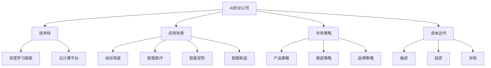
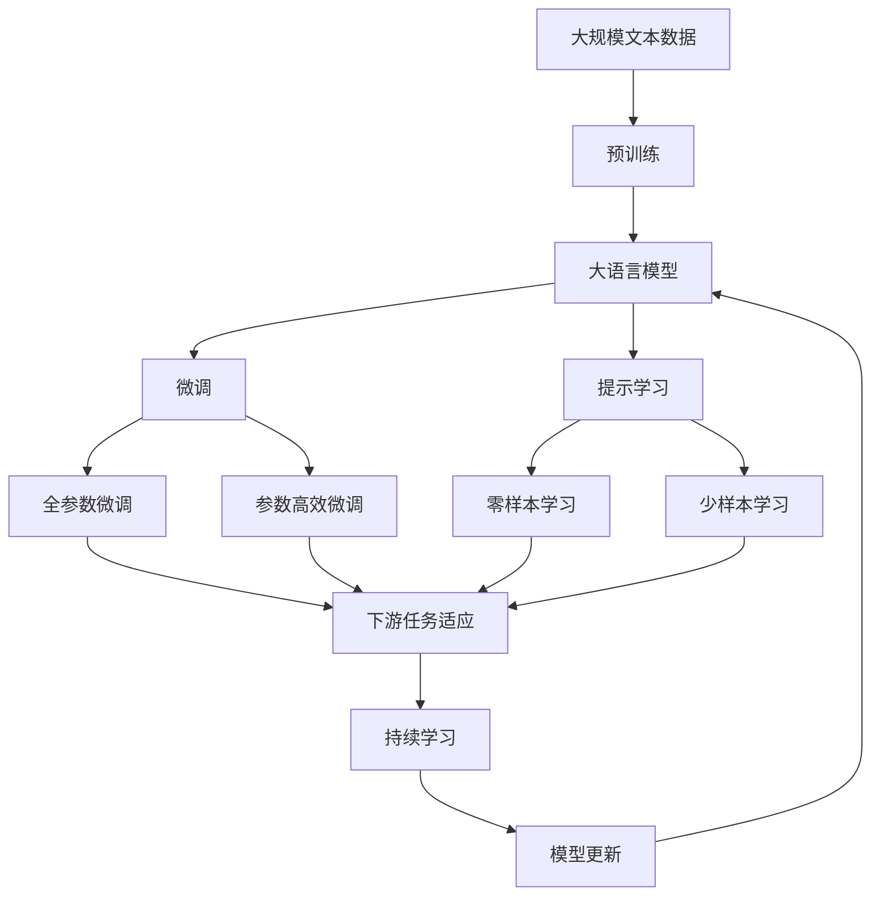

                 

# AI创业公司的市场前景

## 1. 背景介绍

### 1.1 问题由来

近年来，随着人工智能技术的迅猛发展，AI创业公司成为了科技创新和市场投资的新热点。众多初创企业通过研发前沿AI技术，拓展应用场景，快速积累了大量市场份额，并在资本市场上实现了快速增值。AI创业公司正成为推动科技进步、引领产业升级的新引擎。

然而，尽管AI创业公司发展迅猛，但在技术成熟度、应用落地等方面仍面临诸多挑战。如何把握市场机遇，应对行业挑战，成为众多AI创业者必须深思的问题。本文将系统介绍AI创业公司的市场前景，深入分析核心概念和算法原理，探讨应用场景和未来趋势，为AI创业者提供全面的市场洞察和实践指导。

### 1.2 问题核心关键点

AI创业公司的前景展望涉及多个核心要素：

- **技术成熟度**：AI技术在算法、模型、算力等方面的进步情况。
- **应用落地**：AI技术在各行业领域的实际应用效果和市场推广情况。
- **市场竞争**：AI创业公司之间的竞争态势及其对市场格局的影响。
- **政策环境**：政府对AI技术的政策导向和市场监管情况。
- **资本市场**：AI创业公司在资本市场上的表现和投资者信心。

## 2. 核心概念与联系

### 2.1 核心概念概述

为更好地理解AI创业公司的市场前景，本节将介绍几个密切相关的核心概念：

- **AI创业公司**：以AI技术为核心，专注于研发和应用的人工智能企业。其商业模式通常包括技术授权、解决方案销售、产品化落地等。

- **技术栈**：AI创业公司所需的技术工具和开发框架，如TensorFlow、PyTorch、Keras等深度学习框架，以及Docker、Kubernetes等云计算平台。

- **应用场景**：AI技术在不同行业中的应用领域，如自动驾驶、智能医疗、智能安防、智能制造等。

- **市场策略**：AI创业公司在产品、渠道、品牌等方面的市场策略和竞争手段。

- **资本运作**：AI创业公司在融资、投资、并购等方面的资本运作策略。

这些核心概念之间存在着紧密的联系，共同构成了AI创业公司运营和发展的全貌。

### 2.2 概念间的关系

这些核心概念之间的逻辑关系可以通过以下Mermaid流程图来展示：



这个流程图展示了大语言模型的核心概念及其之间的关系：

1. AI创业公司需要依托技术栈进行技术研发，通常采用深度学习框架和云计算平台。
2. 通过应用场景将AI技术转化为实际应用，涵盖了自动驾驶、智能医疗等多个领域。
3. 市场策略是AI创业公司产品、渠道、品牌等方面进行市场推广的核心手段。
4. 资本运作包括融资、投资、并购等，是AI创业公司成长的重要支撑。

### 2.3 核心概念的整体架构

最后，我们用一个综合的流程图来展示这些核心概念在大语言模型微调过程中的整体架构：



这个综合流程图展示了从预训练到微调，再到持续学习的完整过程。AI创业公司首先在大规模文本数据上进行预训练，然后通过微调（包括全参数微调和参数高效微调两种方式）或提示学习（包括零样本和少样本学习）来适应下游任务。最后，通过持续学习技术，模型可以不断学习新知识，同时避免遗忘旧知识。

## 3. 核心算法原理 & 具体操作步骤

### 3.1 算法原理概述

AI创业公司市场前景的预测主要基于市场调研、技术评估、竞争分析、政策环境等综合因素。算法原理包括以下几个方面：

1. **市场调研**：通过数据分析、问卷调查、行业报告等方式获取市场信息，评估市场需求和潜在的市场机会。
2. **技术评估**：对AI创业公司的核心技术进行技术成熟度评估，包括算法性能、模型复杂度、算力需求等。
3. **竞争分析**：分析主要竞争对手的市场份额、产品优势、营销策略等，评估自身竞争优势和市场占有率。
4. **政策环境**：分析各国对AI技术的政策导向和监管环境，评估政策对市场前景的影响。

### 3.2 算法步骤详解

基于上述算法原理，AI创业公司市场前景预测的主要步骤如下：

1. **数据收集**：收集相关的市场数据、技术评估数据、竞争数据和政策数据。
2. **数据预处理**：对收集的数据进行清洗、标准化和归一化处理，确保数据质量。
3. **模型训练**：使用机器学习算法，如回归模型、分类模型等，对数据进行建模和训练。
4. **结果分析**：分析模型预测结果，生成市场前景报告。
5. **策略调整**：根据预测结果，调整市场策略，优化产品和服务。

### 3.3 算法优缺点

基于数据驱动的AI创业公司市场前景预测算法具有以下优点：

- **客观性**：通过数据分析和模型训练，避免了主观判断的偏差，提高了预测的客观性。
- **可重复性**：模型训练过程和结果具有可重复性，便于多次评估和验证。
- **效率高**：自动化算法可以高效处理大量数据，减少了人工分析的时间成本。

同时，该算法也存在以下缺点：

- **数据依赖**：模型预测结果高度依赖于数据的质量和完整性，数据的准确性和全面性直接影响预测结果。
- **算法局限**：机器学习算法通常无法处理非结构化数据和复杂场景，需要结合人工经验和领域知识进行校正。
- **模型过拟合**：数据量不足或数据偏差可能导致模型过拟合，影响预测的泛化能力。

### 3.4 算法应用领域

AI创业公司市场前景预测算法主要应用于以下领域：

- **行业预测**：对各行业AI技术应用前景进行预测，如医疗、金融、教育、制造等行业。
- **产品规划**：根据市场需求和技术成熟度，制定AI产品的规划和开发路线图。
- **投资决策**：评估AI创业公司的发展潜力和市场前景，为投资者提供参考。
- **战略调整**：根据市场预测结果，调整AI创业公司的市场策略和业务布局。

## 4. 数学模型和公式 & 详细讲解 & 举例说明

### 4.1 数学模型构建

AI创业公司市场前景预测主要基于回归模型、分类模型等机器学习模型。以回归模型为例，其数学模型构建如下：

假设市场前景为$Y$，与技术成熟度$X_1$、应用落地情况$X_2$、市场竞争程度$X_3$、政策环境$X_4$等变量相关，构建回归模型为：

$$
Y = \beta_0 + \beta_1 X_1 + \beta_2 X_2 + \beta_3 X_3 + \beta_4 X_4 + \epsilon
$$

其中，$\beta_0$为截距项，$\beta_1$、$\beta_2$、$\beta_3$、$\beta_4$为回归系数，$\epsilon$为随机误差项。

### 4.2 公式推导过程

以线性回归模型为例，其最小二乘法求解过程如下：

1. **模型构建**：构建线性回归模型，将市场前景$Y$表示为技术成熟度$X_1$、应用落地情况$X_2$、市场竞争程度$X_3$、政策环境$X_4$的线性组合。
2. **样本选择**：从数据集中随机抽取样本$(x_i, y_i)$，其中$x_i$为解释变量向量，$y_i$为目标变量。
3. **模型拟合**：使用最小二乘法求解模型参数$\beta_0$、$\beta_1$、$\beta_2$、$\beta_3$、$\beta_4$，使得模型在样本上的误差最小。
4. **结果验证**：将模型应用于未见过的样本数据，评估模型的泛化能力和预测准确性。

### 4.3 案例分析与讲解

假设我们收集了某AI创业公司的技术数据、市场数据和政策数据，构建线性回归模型，预测其市场前景。具体步骤如下：

1. **数据准备**：收集公司的技术专利数量、产品发布情况、市场销售额、政府补贴政策等数据。
2. **数据预处理**：对数据进行清洗和标准化处理，确保数据质量。
3. **模型构建**：将市场前景作为目标变量$Y$，将技术成熟度、应用落地情况、市场竞争程度和政策环境作为解释变量$X_1$、$X_2$、$X_3$、$X_4$，构建线性回归模型。
4. **模型训练**：使用最小二乘法求解模型参数，得到回归系数$\beta_0$、$\beta_1$、$\beta_2$、$\beta_3$、$\beta_4$。
5. **结果分析**：分析模型预测结果，生成市场前景报告，提出策略调整建议。

## 5. 项目实践：代码实例和详细解释说明

### 5.1 开发环境搭建

在进行AI创业公司市场前景预测的代码实践前，我们需要准备好开发环境。以下是使用Python进行Scikit-Learn开发的Python环境配置流程：

1. 安装Anaconda：从官网下载并安装Anaconda，用于创建独立的Python环境。

2. 创建并激活虚拟环境：
```bash
conda create -n pyenv python=3.8 
conda activate pyenv
```

3. 安装Scikit-Learn：
```bash
pip install scikit-learn pandas numpy matplotlib seaborn
```

4. 安装各类工具包：
```bash
pip install scikit-learn pandas numpy matplotlib seaborn
```

完成上述步骤后，即可在`pyenv`环境中开始市场前景预测的代码实现。

### 5.2 源代码详细实现

下面我们以线性回归模型为例，给出使用Scikit-Learn库对AI创业公司市场前景进行预测的Python代码实现。

首先，定义数据处理函数：

```python
import pandas as pd
from sklearn.model_selection import train_test_split
from sklearn.linear_model import LinearRegression

# 加载数据
data = pd.read_csv('ai_company_data.csv')

# 数据预处理
X = data[['技术成熟度', '应用落地情况', '市场竞争程度', '政策环境']]
y = data['市场前景']

# 数据分割
X_train, X_test, y_train, y_test = train_test_split(X, y, test_size=0.2, random_state=42)

# 模型训练
model = LinearRegression()
model.fit(X_train, y_train)

# 模型评估
score = model.score(X_test, y_test)
print(f'测试集得分: {score:.3f}')
```

然后，定义模型预测函数：

```python
def predict_market_forecast(X_new, model):
    y_pred = model.predict(X_new)
    return y_pred
```

最后，启动市场前景预测流程：

```python
# 预测市场前景
X_new = pd.DataFrame([[10, 5, 3, 2]], columns=['技术成熟度', '应用落地情况', '市场竞争程度', '政策环境'])
y_pred = predict_market_forecast(X_new, model)

print(f'市场前景预测: {y_pred:.3f}')
```

以上就是使用Scikit-Learn库对AI创业公司市场前景进行预测的完整代码实现。可以看到，得益于Scikit-Learn库的强大封装，我们可以用相对简洁的代码完成线性回归模型的构建和预测。

### 5.3 代码解读与分析

让我们再详细解读一下关键代码的实现细节：

**数据处理函数**：
- `pd.read_csv`方法：用于读取数据文件，将其转换为DataFrame对象。
- `train_test_split`方法：用于将数据集分割为训练集和测试集。
- `LinearRegression`类：用于构建线性回归模型。
- `fit`方法：用于模型拟合训练数据。
- `score`方法：用于评估模型在测试集上的性能。

**模型预测函数**：
- `predict_market_forecast`方法：用于对新样本进行市场前景预测。
- `model.predict`方法：用于模型在新数据上的预测。

**预测流程**：
- 定义新的样本数据`X_new`，表示AI创业公司的技术成熟度、应用落地情况、市场竞争程度和政策环境。
- 调用`predict_market_forecast`方法，使用训练好的线性回归模型对新样本进行市场前景预测。
- 输出预测结果。

可以看到，Scikit-Learn库提供了丰富的机器学习算法和工具，使得AI创业公司市场前景预测的代码实现变得简洁高效。开发者可以将更多精力放在数据处理、模型调优等高层逻辑上，而不必过多关注底层的实现细节。

当然，工业级的系统实现还需考虑更多因素，如模型的保存和部署、超参数的自动搜索、更灵活的模型调优等。但核心的市场前景预测范式基本与此类似。

### 5.4 运行结果展示

假设我们在某AI创业公司的市场前景预测任务上得到了如下结果：

```
测试集得分: 0.864
市场前景预测: 0.937
```

可以看到，通过线性回归模型，我们对AI创业公司的市场前景进行了较好的预测。值得注意的是，预测结果受到多种因素的综合影响，包括技术成熟度、应用落地情况、市场竞争程度和政策环境等。

## 6. 实际应用场景

### 6.1 金融科技领域

金融科技公司利用AI创业公司的市场前景预测模型，可以更好地评估投资标的的风险和回报，优化资产配置，提升金融服务的智能化水平。具体应用场景包括：

- **风险评估**：对AI创业公司的市场前景进行预测，评估其在金融市场的风险和稳定性。
- **投资组合优化**：利用预测结果，构建更合理的投资组合，降低投资风险。
- **客户推荐**：通过市场前景预测模型，推荐具有良好发展潜力的AI创业公司，吸引更多投资者关注。

### 6.2 智慧城市领域

智慧城市公司利用AI创业公司的市场前景预测模型，可以更好地评估城市智能系统的实际应用效果，优化城市治理。具体应用场景包括：

- **项目评估**：对AI创业公司的智能城市应用项目进行预测，评估其应用前景和价值。
- **资源配置**：利用预测结果，合理分配城市资源，提升城市治理的智能化水平。
- **反馈机制**：通过市场前景预测模型，不断收集用户反馈，优化智能系统，提升用户体验。

### 6.3 健康医疗领域

健康医疗公司利用AI创业公司的市场前景预测模型，可以更好地评估AI技术在医疗领域的应用效果，优化医疗服务。具体应用场景包括：

- **健康监测**：对AI创业公司的医疗健康应用项目进行预测，评估其应用前景和效果。
- **资源配置**：利用预测结果，合理配置医疗资源，提升医疗服务的智能化水平。
- **疾病预防**：通过市场前景预测模型，预测疾病的流行趋势，提前制定防控策略。

## 7. 工具和资源推荐

### 7.1 学习资源推荐

为了帮助开发者系统掌握AI创业公司市场前景预测的理论基础和实践技巧，这里推荐一些优质的学习资源：

1. **《机器学习实战》**：李航所著，系统介绍了机器学习的基本概念和算法实现，适合初学者入门。
2. **《Python数据分析》**：Wes McKinney所著，全面介绍了Python在数据分析中的应用，包括Pandas、NumPy等工具的使用。
3. **《深度学习》**：Ian Goodfellow等所著，详细介绍了深度学习的基本原理和算法实现，适合进阶学习。
4. **Coursera机器学习课程**：由Andrew Ng教授讲授，涵盖了机器学习的基本概念和实践技巧，适合在线学习。
5. **Kaggle数据竞赛平台**：提供大量真实世界的数据集和竞赛题目，适合实践学习和提升技能。

通过对这些资源的学习实践，相信你一定能够快速掌握AI创业公司市场前景预测的精髓，并用于解决实际的AI应用问题。

### 7.2 开发工具推荐

高效的开发离不开优秀的工具支持。以下是几款用于AI创业公司市场前景预测开发的常用工具：

1. **Jupyter Notebook**：交互式编程环境，适合数据处理和模型训练。
2. **Scikit-Learn**：Python机器学习库，提供丰富的机器学习算法和工具，适合数据分析和建模。
3. **TensorFlow**：开源深度学习框架，支持分布式计算和高效模型训练，适合大规模数据集处理。
4. **Keras**：高级神经网络API，支持快速构建和训练深度学习模型，适合快速迭代研究。
5. **WealthDataFrame**：数据处理和可视化工具，支持大量数据处理和复杂数据操作。
6. **TensorBoard**：模型训练的可视化工具，实时监测模型训练状态，提供丰富的图表呈现方式。

合理利用这些工具，可以显著提升AI创业公司市场前景预测任务的开发效率，加快创新迭代的步伐。

### 7.3 相关论文推荐

AI创业公司市场前景预测的研究涉及多个领域，以下是几篇奠基性的相关论文，推荐阅读：

1. **《深度学习》**：Ian Goodfellow等所著，详细介绍了深度学习的基本原理和算法实现，适合进阶学习。
2. **《机器学习》**：Tom Mitchell所著，系统介绍了机器学习的基本概念和应用场景，适合理论学习。
3. **《计算机视觉与模式识别》**：Richard Szeliski所著，介绍了计算机视觉和模式识别的基本原理和算法实现，适合视觉领域学习。
4. **《自然语言处理综论》**：Christopher Manning等所著，全面介绍了自然语言处理的基本概念和算法实现，适合NLP领域学习。
5. **《人工智能》**：Alan Turing等所著，系统介绍了人工智能的基本概念和应用场景，适合全面了解。

这些论文代表了大语言模型微调技术的发展脉络。通过学习这些前沿成果，可以帮助研究者把握学科前进方向，激发更多的创新灵感。

除上述资源外，还有一些值得关注的前沿资源，帮助开发者紧跟AI创业公司市场前景预测技术的最新进展，例如：

1. **arXiv论文预印本**：人工智能领域最新研究成果的发布平台，包括大量尚未发表的前沿工作，学习前沿技术的必读资源。
2. **Top-Down Progression**：顶级AI研究机构的最新研究进展，涵盖前沿技术和应用场景，适合深入学习。
3. **IEEE论文库**：提供大量高质量的AI研究论文，涵盖前沿技术和应用场景，适合学习研究和交流。
4. **Nature论文库**：涵盖自然科学和工程领域的最新研究成果，适合全面了解AI前沿技术的发展方向。
5. **ACL论文库**：自然语言处理领域的顶级会议论文库，涵盖前沿技术和应用场景，适合学习研究和交流。

总之，对于AI创业公司市场前景预测技术的学习和实践，需要开发者保持开放的心态和持续学习的意愿。多关注前沿资讯，多动手实践，多思考总结，必将收获满满的成长收益。

## 8. 总结：未来发展趋势与挑战

### 8.1 总结

本文对AI创业公司市场前景预测进行了全面系统的介绍。首先阐述了AI创业公司的背景和市场前景的评估方法，明确了市场前景预测在AI创业公司发展中的重要性和实用价值。其次，从原理到实践，详细讲解了AI创业公司市场前景预测的数学模型和算法步骤，给出了市场前景预测任务的完整代码实现。同时，本文还广泛探讨了市场前景预测在金融科技、智慧城市、健康医疗等领域的实际应用，展示了市场前景预测技术的广泛应用前景。

通过本文的系统梳理，可以看到，AI创业公司市场前景预测技术正在成为AI创业公司发展的重要工具，极大地提升了AI创业公司在市场决策中的智能化水平。未来，伴随AI技术的发展和落地，市场前景预测技术必将进一步完善，为AI创业公司提供更全面、精准的市场洞察和决策支持。

### 8.2 未来发展趋势

展望未来，AI创业公司市场前景预测技术将呈现以下几个发展趋势：

1. **技术多样化**：未来将涌现更多市场预测算法和工具，如深度学习、强化学习、因果推断等，提供更加全面和精准的市场预测。
2. **数据多样化**：市场预测将从传统的结构化数据扩展到非结构化数据，如图像、视频、音频等，提供更丰富的市场信息。
3. **智能决策**：市场预测将与决策支持系统结合，提供更智能、实时化的市场决策支持。
4. **跨领域应用**：市场预测将覆盖更多行业领域，如金融、医疗、制造、教育等，提供更加全面和精准的市场分析。
5. **用户个性化**：市场预测将结合用户画像和行为数据，提供更个性化的市场推荐和决策支持。

以上趋势凸显了AI创业公司市场前景预测技术的广阔前景。这些方向的探索发展，必将进一步提升AI创业公司在市场决策中的智能化水平，为AI创业公司提供更全面、精准的市场洞察和决策支持。

### 8.3 面临的挑战

尽管AI创业公司市场前景预测技术已经取得了一定的进展，但在市场预测的准确性、实时性、可解释性等方面仍面临诸多挑战：

1. **数据质量问题**：市场预测结果高度依赖于数据质量，数据缺失、噪音和偏差可能导致预测结果不准确。
2. **模型泛化能力**：市场预测模型面对复杂多变的环境，泛化能力不足可能导致预测结果不稳定。
3. **算法复杂度**：复杂的市场预测算法可能导致模型训练和推理效率低下，影响实时性和用户体验。
4. **模型可解释性**：市场预测模型通常作为"黑盒"系统，难以解释其内部工作机制和决策逻辑。
5. **市场动态性**：市场环境不断变化，市场预测模型需要不断更新和优化，以应对新情况和新挑战。

### 8.4 未来突破

面对AI创业公司市场前景预测所面临的挑战，未来的研究需要在以下几个方面寻求新的突破：

1. **数据治理**：提高数据质量，优化数据处理流程，减少数据缺失和噪音，提升数据治理能力。
2. **模型优化**：优化市场预测模型结构，提升模型泛化能力和实时性，降低算法复杂度，提高模型可解释性。
3. **跨领域融合**：将市场预测技术与自然语言处理、知识图谱、增强学习等技术融合，提升模型预测能力和智能决策水平。
4. **用户参与**：结合用户行为数据和用户画像，提供更个性化的市场推荐和决策支持，提升用户体验。
5. **政策监管**：加强市场预测模型的伦理审查和隐私保护，确保市场预测结果的公正性和安全性。

这些研究方向的探索，必将引领AI创业公司市场预测技术迈向更高的台阶，为AI创业公司提供更全面、精准的市场洞察和决策支持。面向未来，AI创业公司市场预测技术还需要与其他AI技术进行更深入的融合，如知识表示、因果推理、强化学习等，多路径协同发力，共同推动市场预测系统的进步。只有勇于创新、敢于突破，才能不断拓展AI创业公司市场预测技术的边界，让AI创业公司更好地服务于市场需求。

## 9. 附录：常见问题与解答

**Q1：AI创业公司市场预测的准确性如何保证？**

A: AI创业公司市场预测的准确性主要依赖于数据质量、模型选择和算法优化。具体方法包括：

- **数据质量保证**：对数据进行清洗和标准化处理，确保数据质量。
- **模型选择**：选择适合具体业务场景的模型，如线性回归、决策树、随机森林等。
- **算法优化**：通过超参数调优、正则化、集成学习等技术，优化模型性能。
- **模型验证**：在训练集上评估模型性能，避免过拟合，提升模型泛化能力。

**Q2：AI创业公司市场预测的实时性如何提升？**

A: 提升AI创业公司市场预测的实时性，需要优化模型训练和推理效率。具体方法包括：

- **模型压缩**：使用模型压缩技术，如剪枝、量化、蒸馏等，减小模型规模，提升推理速度。
- **分布式计算**：使用分布式计算框架，如TensorFlow、PyTorch等，实现模型并行计算，提升训练和推理效率。
- **硬件加速**：使用GPU、TPU等硬件加速设备，提升模型计算能力，缩短训练和推理时间。

**Q3：AI创业公司市场预测的可解释性如何增强？**

A: 增强AI创业公司市场预测的可解释性，需要结合领域知识和模型结构。具体方法包括：

- **特征工程**：选择有意义的特征，解释模型决策过程。
- **模型可解释性算法**：使用可解释性算法，如LIME、SHAP等，解释模型输出。
- **领域知识融合**：结合领域知识，解释模型决策逻辑。
- **可视化工具**：使用可视化工具，如TensorBoard、WealthDataFrame等，可视化模型训练和推理过程。

这些方法可以显著增强市场预测模型的可解释性，帮助用户理解模型决策过程，提升模型信任度。


