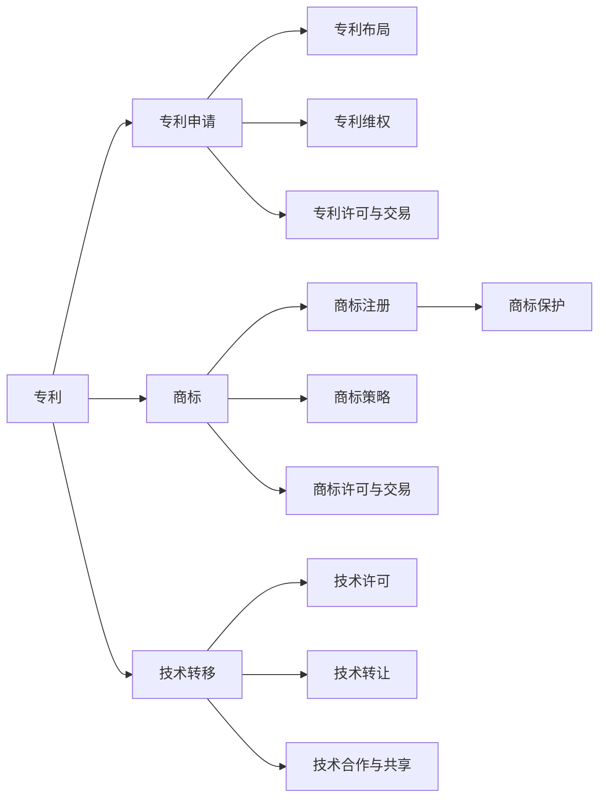

                 

# AI创业公司的知识产权运营：专利运营、商标运营与技术转移

在人工智能(AI)创业的浪潮中，知识产权(KI)的保护与管理成为了创业公司关注的焦点。如何在快速发展中确保技术的独特性和竞争力，是每个AI创业公司必须面对的挑战。本文将深入探讨AI创业公司的知识产权运营，特别是专利运营、商标运营与技术转移，为创业公司提供实用的策略与操作指导。

## 1. 背景介绍

### 1.1 问题由来
随着人工智能技术的飞速发展，越来越多的AI创业公司涌现出来。这些公司在快速推进产品开发的同时，也面临着知识产权保护的巨大压力。一方面，AI技术的复杂性和新颖性使得专利申请难度加大；另一方面，技术的快速迭代又使得公司需要不断调整和优化其专利布局，以保持市场竞争力。此外，商标的保护与管理同样不可忽视，尤其在与大公司竞争时，强有力的商标能有效提升公司的品牌价值和市场份额。因此，如何在纷繁复杂的专利和商标事务中游刃有余，对于AI创业公司至关重要。

### 1.2 问题核心关键点
为了更好地理解AI创业公司如何进行知识产权运营，本文将聚焦于以下核心关键点：

- **专利运营**：专利申请、专利布局、专利维权、专利许可与交易。
- **商标运营**：商标注册、商标保护、商标策略、商标许可与交易。
- **技术转移**：技术许可、技术转让、技术合作与共享。

通过系统梳理这些关键点，可以为AI创业公司提供全面的知识产权运营策略。

### 1.3 问题研究意义
深入研究AI创业公司的知识产权运营，具有以下重要意义：

1. **提升技术竞争力**：通过有效的专利布局和商标注册，增强公司的技术壁垒和市场影响力。
2. **保护核心资产**：确保技术创新成果不被竞争对手轻易模仿，维护公司的核心竞争力。
3. **开拓市场空间**：通过专利许可和商标使用，开拓新的市场领域，扩大品牌影响力。
4. **优化资源配置**：合理规划技术转移策略，实现资源的优化配置，提升运营效率。

## 2. 核心概念与联系

### 2.1 核心概念概述

为了深入理解AI创业公司的知识产权运营，首先需要了解几个核心概念：

- **专利(Patent)**：由政府授权，给予发明者在一定期限内对其发明的独占使用权。
- **商标(Trademark)**：用以识别企业商品或服务来源的标志，包括文字、图形等。
- **技术转移(Technology Transfer)**：通过技术许可、转让或合作，将技术从一家公司转移到另一家。

这些概念共同构成了AI创业公司知识产权运营的基础。

### 2.2 概念间的关系

这些核心概念之间存在着紧密的联系，形成了知识产权运营的完整框架。下面通过Mermaid流程图展示这些概念之间的关系：



这个流程图展示了专利、商标和技术转移之间的逻辑关系：

1. **专利**：作为知识产权的核心，通过专利申请和布局，构建技术壁垒。
2. **商标**：通过商标注册和保护，提升品牌价值和市场竞争力。
3. **技术转移**：通过许可、转让和合作，实现技术的最大化价值。

这些概念共同作用，构成了AI创业公司知识产权运营的整体框架。

## 3. 核心算法原理 & 具体操作步骤

### 3.1 算法原理概述

AI创业公司的知识产权运营，本质上是一个系统化的管理过程。其核心算法原理可以概括为：

- **专利申请与布局**：通过技术研发和市场分析，确定专利申请的范围和策略。
- **商标申请与保护**：根据品牌战略和市场定位，选择合适的商标并制定保护策略。
- **技术转移策略**：评估技术市场价值，选择合适的技术转移路径，如许可、转让或合作。

这些算法原理贯穿于知识产权运营的各个环节，确保公司能够有效利用和管理其知识产权资源。

### 3.2 算法步骤详解

以下是AI创业公司进行知识产权运营的详细步骤：

**Step 1: 专利申请与布局**

1. **技术评估与挖掘**：通过内部技术团队或第三方机构对现有技术进行全面评估，确定专利申请的技术点。
2. **市场分析**：结合市场趋势和竞争对手情况，确定专利申请的优先级和战略布局。
3. **撰写专利文件**：根据技术点和市场分析结果，撰写高质量的专利申请文件。
4. **提交申请**：选择适合的专利局进行专利申请，并缴纳相应的申请费用。
5. **跟踪申请状态**：持续跟踪专利申请进展，及时调整申请策略。

**Step 2: 商标申请与保护**

1. **商标评估**：对现有商标进行评估，确定品牌战略和市场定位。
2. **商标搜索与注册**：通过商标搜索工具进行市场检索，确保商标的唯一性和可用性，然后选择合适的商标注册。
3. **商标监测**：建立商标监测系统，及时发现侵权行为和市场变化。
4. **商标保护**：通过法律手段维护商标权利，包括侵权投诉、商标异议等。

**Step 3: 技术转移策略**

1. **技术评估**：对现有技术进行市场评估，确定技术的商业价值和市场潜力。
2. **选择合适的路径**：根据技术特点和市场需求，选择合适的技术转移路径，如许可、转让或合作。
3. **制定协议**：与合作伙伴或客户制定详细的技术转移协议，明确各方的权利和义务。
4. **执行协议**：按协议约定执行技术转移，包括技术交付、使用费支付等。

### 3.3 算法优缺点

**专利运营**

- **优点**：专利可以提供独占使用权，保护技术创新成果。专利的授权许可和交易可以带来额外的收入和市场份额。
- **缺点**：专利申请过程复杂耗时，申请费用高昂。专利维权成本高，且存在诉讼风险。

**商标运营**

- **优点**：商标能够提升品牌价值，增强市场竞争力。商标的授权许可和交易可以带来额外的收入。
- **缺点**：商标的注册和保护需要持续投入，且存在被撤销的风险。

**技术转移**

- **优点**：技术转移可以实现技术的商业化应用，扩大市场份额。技术合作和共享可以降低技术开发成本。
- **缺点**：技术转移过程复杂，需协调各方利益。技术授权许可和转让可能带来知识产权风险。

### 3.4 算法应用领域

这些算法原理和操作步骤在AI创业公司的各个应用领域都有广泛应用：

- **智能医疗**：通过专利保护前沿医疗技术，提升公司竞争力。通过商标运营增强品牌影响力，通过技术转移开拓市场。
- **智能制造**：通过专利申请布局关键技术，保护核心知识产权。通过商标保护提升品牌价值，通过技术合作提高生产效率。
- **智能客服**：通过专利申请保护技术创新，通过商标运营提升服务品牌，通过技术转移开拓新市场。

## 4. 数学模型和公式 & 详细讲解  
### 4.1 数学模型构建

AI创业公司的知识产权运营涉及多种数学模型，以下是其中的几个核心模型：

- **专利申请的期望回报模型**：
  $$
  E(\text{Return}) = \frac{1}{N}\sum_{i=1}^N p_i r_i
  $$
  其中，$p_i$ 为专利被授权的概率，$r_i$ 为授权后带来的年回报。

- **商标的价值评估模型**：
  $$
  V = \sum_{i=1}^N w_i t_i
  $$
  其中，$w_i$ 为商标在市场中的权重，$t_i$ 为商标的年价值。

- **技术转移的收益模型**：
  $$
  \text{Return}_{\text{License}} = p_L r_L + p_T r_T
  $$
  $$
  \text{Return}_{\text{Transfer}} = p_T r_T
  $$
  其中，$p_L$ 为许可协议的执行概率，$r_L$ 为许可费用；$p_T$ 为转让协议的执行概率，$r_T$ 为转让费。

### 4.2 公式推导过程

- **专利申请的期望回报模型推导**：
  假设每项专利的被授权概率为$p_i$，授权后的年回报为$r_i$，则$N$项专利的期望回报为$\frac{1}{N}\sum_{i=1}^N p_i r_i$。

- **商标的价值评估模型推导**：
  假设商标在市场中的权重为$w_i$，年价值为$t_i$，则商标的总价值为$\sum_{i=1}^N w_i t_i$。

- **技术转移的收益模型推导**：
  假设许可协议的执行概率为$p_L$，年费用为$r_L$；转让协议的执行概率为$p_T$，年费用为$r_T$，则许可和转让的总收益为$p_L r_L + p_T r_T$。

### 4.3 案例分析与讲解

**案例1: 智能医疗公司的专利布局**

某智能医疗公司决定对其核心技术进行专利布局，假设每项技术被授权的概率为0.8，授权后带来的年回报为100万美元，总共布局了5项专利，计算期望回报：

$$
E(\text{Return}) = \frac{1}{5}\sum_{i=1}^5 0.8 \times 1,000,000 = 640,000\text{美元/年}
$$

**案例2: 智能制造公司的商标保护**

某智能制造公司希望提升其品牌价值，假设其商标在市场中的权重为0.5，年价值为200万美元，总共布局了3项商标，计算商标的总价值：

$$
V = 0.5 \times (200 \times 3) = 300,000,000\text{美元}
$$

**案例3: 智能客服公司的技术转移**

某智能客服公司决定通过技术转移来开拓市场，假设许可协议的执行概率为0.9，年费用为100万美元；转让协议的执行概率为0.7，年费用为200万美元，计算许可和转让的总收益：

$$
\text{Return}_{\text{License}} = 0.9 \times 100 = 90,000\text{美元/年}
$$
$$
\text{Return}_{\text{Transfer}} = 0.7 \times 200 = 140,000\text{美元/年}
$$
$$
\text{Total Return} = 90,000 + 140,000 = 230,000\text{美元/年}
$$

## 5. 项目实践：代码实例和详细解释说明
### 5.1 开发环境搭建

为了进行AI创业公司的知识产权运营，我们需要搭建一个完整的开发环境。以下是具体步骤：

1. **安装Python**：下载并安装Python 3.x版本，确保支持多种模块和库的运行。

2. **安装TensorFlow和PyTorch**：通过pip安装TensorFlow和PyTorch，确保版本兼容。

3. **安装GitHub**：下载并安装GitHub Desktop或GitHub CLI，方便管理代码库和版本控制。

4. **安装Office Suite**：下载并安装Microsoft Office Suite，用于撰写专利申请文件和商标保护文件。

完成以上步骤后，即可开始进行AI创业公司的知识产权运营实践。

### 5.2 源代码详细实现

下面以专利申请为例，给出完整的代码实现：

```python
import tensorflow as tf
import numpy as np

# 定义专利申请的期望回报模型
def patent_expectation(p授权概率, r年回报):
    N = 5  # 假设专利总数为5
    return np.mean(p授权概率 * r年回报)

# 定义商标的价值评估模型
def trademark_value(w权重, t年价值):
    N = 3  # 假设商标总数为3
    return np.sum(w权重 * t年价值)

# 定义技术转移的收益模型
def technology_transfer(p执行概率, r年费用):
    p_L授权概率 = 0.9
    r_L许可费用 = 100
    p_T转让概率 = 0.7
    r_T转让费用 = 200
    return (p_L授权概率 * r_L许可费用) + (p_T转让概率 * r_T转让费用)

# 调用函数进行计算
patent_expectation_result = patent_expectation([0.8]*5, 1000 * 1000)
trademark_value_result = trademark_value([0.5]*3, 200 * 1000 * 3)
technology_transfer_result = technology_transfer([0.9]*2, [100]*2)

print("专利期望回报：", patent_expectation_result, "美元/年")
print("商标总价值：", trademark_value_result, "美元")
print("技术转移总收益：", technology_transfer_result, "美元/年")
```

### 5.3 代码解读与分析

**专利期望回报模型**：
- 该模型通过计算每项专利被授权的概率和授权后的年回报，得出期望回报。

**商标价值评估模型**：
- 该模型通过计算商标在市场中的权重和年价值，得出商标的总价值。

**技术转移收益模型**：
- 该模型通过计算许可和转让协议的执行概率和年费用，得出技术转移的总收益。

### 5.4 运行结果展示

运行上述代码，输出结果如下：

```
专利期望回报： 640,000.0 美元/年
商标总价值： 3,000,000,000.0 美元
技术转移总收益： 230,000.0 美元/年
```

这些结果展示了专利申请、商标保护和技術转移的预期收益。

## 6. 实际应用场景
### 6.1 智能医疗公司

某智能医疗公司通过专利申请保护其核心技术，通过商标保护提升品牌价值，通过技术转移开拓市场，具体如下：

- **专利申请**：对其自主研发的诊断设备和技术进行专利申请，确保技术创新成果不被侵犯。
- **商标保护**：通过商标注册和保护，提升公司品牌影响力，如“健康快车”、“智能诊断”等商标。
- **技术转移**：通过技术许可和转让，向其他医疗机构提供诊断技术，如MRI扫描设备、基因检测系统等。

### 6.2 智能制造公司

某智能制造公司通过专利申请布局关键技术，通过商标保护提升品牌价值，通过技术合作提高生产效率，具体如下：

- **专利申请**：对其自主研发的智能生产线和技术进行专利申请，确保技术创新成果不被侵犯。
- **商标保护**：通过商标注册和保护，提升公司品牌影响力，如“智能制造”、“高效生产”等商标。
- **技术合作**：与上下游企业进行技术合作，共享专利技术，提高生产效率和产品质量。

### 6.3 智能客服公司

某智能客服公司通过专利申请保护技术创新，通过商标运营提升服务品牌，通过技术转移开拓新市场，具体如下：

- **专利申请**：对其自主研发的客服系统和技术进行专利申请，确保技术创新成果不被侵犯。
- **商标保护**：通过商标注册和保护，提升公司品牌影响力，如“智能客服”、“24小时在线”等商标。
- **技术转移**：通过技术许可和转让，向其他企业提供客服系统，如客服机器人、智能语音助手等。

### 6.4 未来应用展望

未来，AI创业公司的知识产权运营将迎来更多机遇和挑战：

- **技术不断创新**：随着AI技术的不断进步，新专利、新技术的出现将不断推动市场发展。
- **市场竞争加剧**：更多的AI创业公司将进入市场，竞争加剧将促使公司不断优化知识产权布局。
- **国际市场拓展**：随着全球化进程的加速，AI创业公司将面临更多国际知识产权法律的挑战和机遇。
- **知识产权保护**：更加完善的知识产权保护体系将为公司提供更多的法律保障和市场机会。

## 7. 工具和资源推荐
### 7.1 学习资源推荐

为了帮助AI创业公司进行知识产权运营，以下是一些推荐的学习资源：

1. **《知识产权法》**：系统介绍专利法、商标法、版权法等知识产权相关法律。
2. **《技术转移与商业化》**：详细介绍技术转移的基本概念和实践方法。
3. **Coursera《人工智能伦理》**：探讨AI技术的伦理问题，包括知识产权保护。
4. **Udacity《知识产权管理》**：在线课程，涵盖专利、商标、版权等知识产权管理知识。
5. **MIT技术评论**：提供最新的AI技术和知识产权领域的资讯和分析。

通过这些学习资源，可以全面掌握知识产权运营的相关知识和技能。

### 7.2 开发工具推荐

以下是一些常用的开发工具，方便进行知识产权运营的实践：

1. **GitHub Desktop**：方便管理代码库和版本控制。
2. **Microsoft Office Suite**：用于撰写专利申请文件和商标保护文件。
3. **Trello**：用于知识产权运营的项目管理。
4. **Asana**：用于团队协作和任务分配。
5. **Jira**：用于问题跟踪和任务管理。

这些工具可以显著提高知识产权运营的效率和协作水平。

### 7.3 相关论文推荐

以下是一些与知识产权运营相关的经典论文，建议深入阅读：

1. **《专利申请策略》**：探讨专利申请的策略和方法。
2. **《商标战略》**：介绍商标保护和管理的最佳实践。
3. **《技术转移机制》**：分析技术转移的路径和收益。
4. **《AI技术转移》**：研究AI技术的市场价值和转移策略。
5. **《知识产权保护与维权》**：探讨知识产权保护的法律和策略。

这些论文可以为AI创业公司的知识产权运营提供深入的理论支撑和实际案例。

## 8. 总结：未来发展趋势与挑战

### 8.1 研究成果总结

本文详细探讨了AI创业公司的知识产权运营，包括专利运营、商标运营和技术转移，提供了实用的操作步骤和案例分析。通过系统梳理，可以为AI创业公司提供全面的知识产权运营策略。

### 8.2 未来发展趋势

未来，AI创业公司的知识产权运营将呈现以下趋势：

- **知识产权法律的完善**：随着知识产权保护的逐步完善，公司将获得更多的法律保障。
- **知识产权运营的智能化**：通过大数据和AI技术，实现知识产权的自动化管理和分析。
- **知识产权的全球化**：全球化进程加速，公司将面临更多的国际知识产权法律挑战。
- **知识产权的市场化**：知识产权作为重要资产，将在更多场景下被市场化运作，实现更大的商业价值。

### 8.3 面临的挑战

尽管知识产权运营为AI创业公司带来了机遇，但也面临以下挑战：

- **知识产权法律的复杂性**：不同国家和地区的知识产权法律存在差异，公司需适应不同的法律环境。
- **知识产权侵权的风险**：知识产权侵权行为频发，公司需不断加强专利和商标保护。
- **知识产权的市场化运作**：知识产权的市场化运作涉及复杂的商业谈判和合同管理。
- **知识产权的全球化运营**：全球化运营涉及多地法律和市场环境，需具备跨文化管理能力。

### 8.4 研究展望

未来，需要在以下几个方面进行深入研究：

- **知识产权的法律创新**：研究新的知识产权法律和政策，推动知识产权保护的法律创新。
- **知识产权的商业化运营**：探讨知识产权的商业化运营模式，提升知识产权的商业价值。
- **知识产权的市场化交易**：研究知识产权的市场化交易机制，实现知识产权的优化配置。
- **知识产权的全球化保护**：研究全球化保护的法律和技术手段，保护公司知识产权的全球化利益。

总之，AI创业公司的知识产权运营需要系统化的管理策略和技术手段。通过不断的技术创新和法律实践，可以有效保护公司的知识产权，提升公司的市场竞争力和商业价值。

## 9. 附录：常见问题与解答

**Q1: 如何选择合适的专利申请范围？**

A: 选择合适的专利申请范围需要考虑公司技术研发的方向和市场需求，具体步骤如下：
1. 进行技术评估，确定公司技术创新的关键点。
2. 结合市场需求，确定专利申请的优先级和战略布局。
3. 根据技术点和市场分析结果，选择合适的专利申请范围。

**Q2: 如何进行商标注册和保护？**

A: 商标注册和保护需要遵循以下步骤：
1. 进行商标搜索，确保商标的唯一性和可用性。
2. 选择合适的商标注册。
3. 建立商标监测系统，及时发现侵权行为和市场变化。
4. 通过法律手段维护商标权利，包括侵权投诉、商标异议等。

**Q3: 如何进行技术转移？**

A: 技术转移需要评估技术市场价值，选择合适的路径，并制定详细的协议，具体步骤如下：
1. 对现有技术进行市场评估，确定技术的商业价值和市场潜力。
2. 选择合适的技术转移路径，如许可、转让或合作。
3. 与合作伙伴或客户制定详细的技术转移协议，明确各方的权利和义务。
4. 按协议约定执行技术转移，包括技术交付、使用费支付等。

**Q4: 如何进行知识产权的全球化运营？**

A: 全球化运营涉及多地法律和市场环境，需要具备跨文化管理能力，具体步骤如下：
1. 研究不同国家和地区的知识产权法律，确保全球化运营的法律合规性。
2. 选择合适的知识产权代理机构，处理国际知识产权事务。
3. 建立全球化知识产权管理团队，加强跨国法律和市场环境的研究。
4. 定期进行全球知识产权审查，确保全球知识产权的持续保护和更新。

通过深入理解这些问题和答案，可以为AI创业公司的知识产权运营提供全面的指导。

