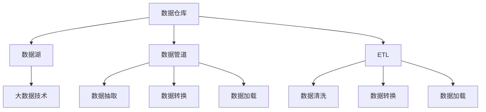
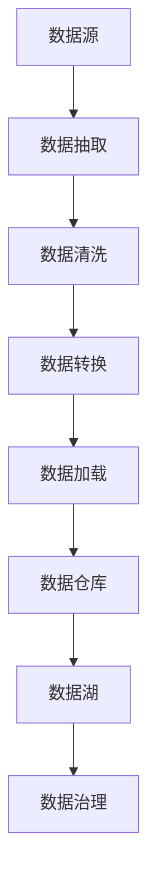
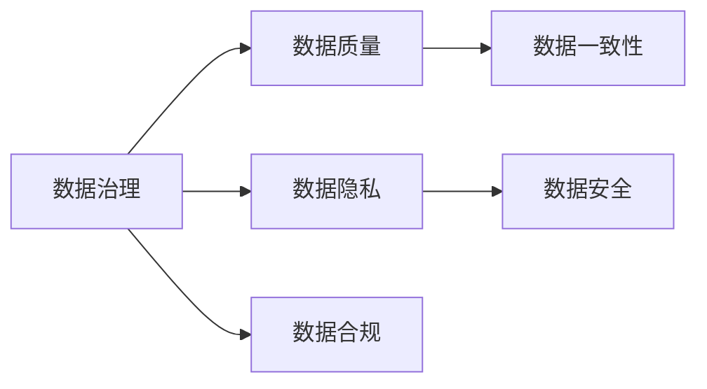
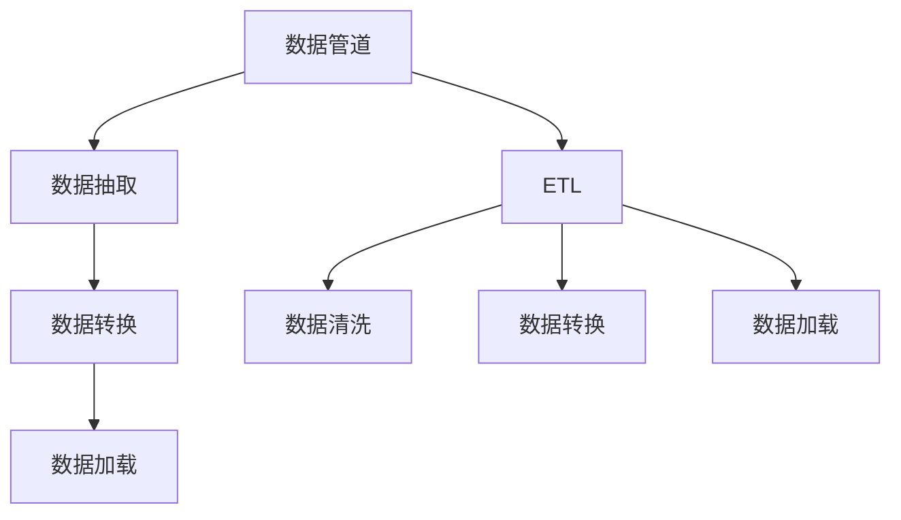
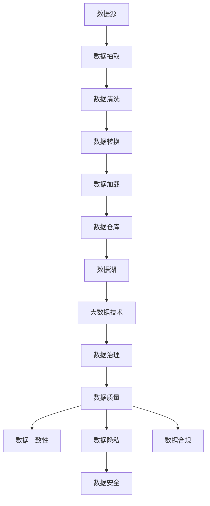

                 

## 1. 背景介绍

在人工智能创业的征途上，数据管理是最核心的环节之一。对于数据驱动型的AI公司，数据的获取、清洗、存储、管理直接决定了公司的技术能力和市场竞争力。数据管理不仅是技术问题，更是公司战略规划和商业模式的体现。本文将从数据管理的角度出发，阐述AI创业的成功实践，从理论到实践，全面解析数据管理的关键要素。

### 1.1 数据管理的核心作用

数据管理在AI创业中起着举足轻重的作用。首先，数据是AI技术的“粮食”，数据质量直接决定模型的训练效果和应用表现。其次，有效的数据管理能够大幅提高模型训练和推理的效率，优化资源利用，降低成本。此外，数据管理还涉及到用户隐私、数据安全、合规性等伦理道德问题，直接关联到公司的商业声誉和法律风险。因此，数据管理水平的高低，往往成为AI公司成败的关键。

### 1.2 数据管理的核心问题

尽管数据管理的重要性不言而喻，但在实际操作中，很多AI创业公司仍面临诸多挑战。主要问题包括：

- **数据获取**：如何高效获取海量有价值的数据，数据源如何选择和整合。
- **数据质量**：如何保证数据的准确性、完整性和一致性，剔除噪音和错误数据。
- **数据存储**：如何高效地存储和管理大规模数据，应对数据增长和访问需求。
- **数据处理**：如何提取和挖掘数据中的有价值信息，形成数据驱动的商业决策。
- **数据安全**：如何保护数据隐私和安全，防止数据泄露和滥用。

本节将围绕数据管理的关键问题，提出一系列的解决方案，帮助AI创业公司成功应对数据管理的挑战。

## 2. 核心概念与联系

### 2.1 核心概念概述

为更好地理解数据管理，本节将介绍几个密切相关的核心概念：

- **数据仓库**：指用于集中管理和存储数据的基础设施，包括数据源、数据模型、元数据等。
- **数据湖**：指大规模、原始、非结构化的数据存储和管理系统，用于支持大规模数据分析和机器学习。
- **数据管道**：指用于数据采集、转换、存储和提取的工具，用于自动化数据处理和流式计算。
- **ETL**：指数据抽取、转换和加载，用于将数据从源系统提取出来，经过清洗和转换，加载到目标系统中。
- **大数据技术**：指用于处理大规模数据的技术框架，如Hadoop、Spark等。
- **数据治理**：指对数据的获取、处理、存储、访问和使用进行管理和规范。

这些核心概念之间的逻辑关系可以通过以下Mermaid流程图来展示：



这个流程图展示了数据管理的核心组件及其相互关系：

1. **数据仓库**：存储标准化、结构化的业务数据，支持OLAP分析。
2. **数据湖**：存储原始、非结构化的数据，支持大规模数据分析和机器学习。
3. **数据管道**：自动化数据采集、转换和加载过程，支持实时数据处理。
4. **ETL**：数据清洗、转换和加载的桥梁，支持数据整合和一致性管理。
5. **大数据技术**：支持大规模数据的存储和计算，提供高效的数据处理能力。

这些核心概念共同构成了数据管理的完整生态系统，使得数据驱动型AI公司能够高效地采集、处理和利用海量数据，形成商业价值。

### 2.2 概念间的关系

这些核心概念之间存在着紧密的联系，形成了数据管理的完整框架。下面我们通过几个Mermaid流程图来展示这些概念之间的关系。

#### 2.2.1 数据流管理



这个流程图展示了数据从源系统到目标系统的整个数据流管理过程，包括数据抽取、清洗、转换和加载。

#### 2.2.2 数据治理与隐私保护



这个流程图展示了数据治理的组成部分，包括数据质量、一致性、隐私、安全和合规性等关键要素。

#### 2.2.3 数据管道与ETL



这个流程图展示了数据管道和ETL之间的关系，通过数据管道自动化的数据抽取、转换和加载，ETL支持数据清洗和转换，确保数据的一致性和完整性。

### 2.3 核心概念的整体架构

最后，我们用一个综合的流程图来展示这些核心概念在大数据管理中的整体架构：



这个综合流程图展示了数据管理从数据源到目标系统的完整流程，涵盖了数据抽取、清洗、转换、加载、存储、处理、治理等各个环节。

## 3. 核心算法原理 & 具体操作步骤

### 3.1 算法原理概述

数据管理涉及多个技术环节，包括数据抽取、转换、加载、存储、处理、治理等。本文将重点介绍数据清洗和数据治理的算法原理。

数据清洗是指通过预处理、去重、填充等操作，去除数据中的噪音和错误，保证数据的质量和一致性。常用的数据清洗算法包括：

- **去重算法**：通过唯一标识符匹配，去重重复数据。
- **填充算法**：通过均值、中位数、众数等方法，填充缺失值。
- **去噪算法**：通过异常检测和纠正，去除数据中的异常值和错误数据。

数据治理则是通过规范化的管理和控制，确保数据的安全、隐私和合规性。常用的数据治理算法包括：

- **数据脱敏算法**：通过数据加密、伪化等方法，保护用户隐私。
- **访问控制算法**：通过身份验证和授权，确保数据的访问权限。
- **合规性检查算法**：通过规则和策略，确保数据符合法律法规。

### 3.2 算法步骤详解

以下是数据清洗和数据治理的具体算法步骤详解：

**数据清洗算法步骤**：

1. **数据预处理**：读取原始数据，进行格式转换和解析，形成数据结构。
2. **数据清洗**：进行去重、去噪和填充操作，去除噪音和错误数据。
3. **数据验证**：通过统计分析和规则验证，确保数据质量和一致性。
4. **数据标注**：为清洗后的数据添加元数据，包括数据来源、格式、类型等信息。

**数据治理算法步骤**：

1. **数据分类**：将数据分为结构化、半结构化、非结构化等不同类别。
2. **数据保护**：对敏感数据进行加密和脱敏处理，确保用户隐私。
3. **数据访问控制**：通过身份验证和授权，限制数据访问权限。
4. **合规性检查**：检查数据是否符合法律法规和公司政策，确保合规性。

### 3.3 算法优缺点

数据清洗和数据治理算法各有优缺点：

- **数据清洗**：
  - **优点**：能够有效去除噪音和错误，保证数据质量。
  - **缺点**：可能会丢失部分原始信息，影响数据的完整性。
  
- **数据治理**：
  - **优点**：通过规范化的管理和控制，确保数据的安全和合规性。
  - **缺点**：可能会增加数据处理的复杂度，降低数据处理效率。

### 3.4 算法应用领域

数据清洗和数据治理算法在多个领域都有广泛应用：

- **金融行业**：金融数据涉及用户隐私和合规性要求，需要进行严格的数据清洗和治理。
- **医疗行业**：医疗数据包含大量敏感信息，需要进行数据保护和隐私处理。
- **零售行业**：零售数据用于客户行为分析和市场营销，需要进行数据清洗和治理，确保数据准确性和一致性。
- **政府部门**：政府数据涉及大量公共信息，需要进行数据保护和合规性检查。
- **科学研究**：科学研究需要高质量的数据支持，需要进行数据清洗和治理，确保数据的可靠性和完整性。

## 4. 数学模型和公式 & 详细讲解 & 举例说明

### 4.1 数学模型构建

为了更好地理解和优化数据清洗和数据治理算法，本节将使用数学语言对相关算法进行严格的建模。

设原始数据集为 $D = \{(x_i, y_i)\}_{i=1}^N$，其中 $x_i$ 表示原始数据，$y_i$ 表示数据标签。

#### 4.1.1 数据清洗模型

假设数据清洗算法输出为 $C = \{x'_i\}_{i=1}^N$，其中 $x'_i$ 表示清洗后的数据。数据清洗算法可以建模为：

$$
C = f(D; \theta)
$$

其中 $f$ 表示数据清洗算法，$\theta$ 为算法参数。常用的数据清洗算法包括去重算法、填充算法和去噪算法等。

#### 4.1.2 数据治理模型

假设数据治理算法输出为 $G = \{x''_i\}_{i=1}^N$，其中 $x''_i$ 表示治理后的数据。数据治理算法可以建模为：

$$
G = g(C; \phi)
$$

其中 $g$ 表示数据治理算法，$\phi$ 为算法参数。常用的数据治理算法包括数据脱敏算法、访问控制算法和合规性检查算法等。

### 4.2 公式推导过程

以下我们以数据清洗中的去重算法为例，推导其具体公式。

假设原始数据集中包含重复数据 $x_1, x_2, x_3$，其中 $x_1 = x_2 = x_3 = x$。使用去重算法 $f(x_1, x_2, x_3)$，输出 $x'_1 = x'_2 = x'_3 = x$。

去重算法可以建模为：

$$
f(x_1, x_2, x_3) = \begin{cases}
x, & x_1 = x_2 = x_3 = x \\
(x_1, x_2, x_3), & x_1, x_2, x_3 \neq x
\end{cases}
$$

其中 $x$ 为去重后的数据。

通过这个公式，我们可以对去重算法进行形式化的描述和推导。类似的，数据填充和去噪算法也可以通过相应的数学模型进行推导。

### 4.3 案例分析与讲解

假设我们有一份包含客户交易数据的表格，其中存在重复交易记录和缺失值。使用数据清洗算法进行处理，输出干净的交易数据。

**数据清洗过程**：

1. **数据预处理**：读取原始交易数据，进行格式解析，形成数据结构。
2. **去重算法**：通过唯一标识符匹配，去除重复交易记录。
3. **填充算法**：使用均值方法，填充缺失值。
4. **数据验证**：通过统计分析和规则验证，确保数据的完整性和一致性。

**数据治理过程**：

1. **数据分类**：将交易数据分为结构化、半结构化和非结构化等不同类别。
2. **数据保护**：对敏感数据进行加密和脱敏处理，确保客户隐私。
3. **数据访问控制**：通过身份验证和授权，限制数据访问权限。
4. **合规性检查**：检查数据是否符合法律法规和公司政策，确保合规性。

## 5. 项目实践：代码实例和详细解释说明

### 5.1 开发环境搭建

在进行数据管理项目实践前，我们需要准备好开发环境。以下是使用Python进行Apache Airflow开发的环境配置流程：

1. 安装Anaconda：从官网下载并安装Anaconda，用于创建独立的Python环境。

2. 创建并激活虚拟环境：
```bash
conda create -n airflow-env python=3.8 
conda activate airflow-env
```

3. 安装Apache Airflow：从官网获取安装命令，进行安装。

4. 安装Flower监控：安装Flower客户端，用于监控Airflow任务状态。

5. 安装PySql：安装PySql数据库连接器，用于连接SQL数据库。

完成上述步骤后，即可在`airflow-env`环境中开始开发实践。

### 5.2 源代码详细实现

这里我们以数据清洗为例，给出使用Apache Airflow进行数据清洗的PyTorch代码实现。

首先，定义数据清洗任务的Python脚本：

```python
import pandas as pd
import torch
from torch.utils.data import DataLoader, Dataset

class MyDataset(Dataset):
    def __init__(self, filename):
        self.data = pd.read_csv(filename)
        self.len = len(self.data)
    
    def __len__(self):
        return self.len
    
    def __getitem__(self, idx):
        x = self.data.iloc[idx]
        y = x['label']
        return x.values, y

def clean_data(input_file, output_file):
    dataset = MyDataset(input_file)
    dataloader = DataLoader(dataset, batch_size=32)
    model = MyModel()  # 自定义数据清洗模型
    
    for batch in dataloader:
        inputs, labels = batch
        predictions = model(inputs)
        labels = torch.tensor(labels)
        loss = torch.nn.functional.cross_entropy(predictions, labels)
        optimizer.zero_grad()
        loss.backward()
        optimizer.step()

    # 保存清洗后的数据
    cleaned_data = dataset.data.copy()
    cleaned_data.to_csv(output_file, index=False)
```

然后，定义数据清洗任务的工作流：

```python
from airflow import DAG
from airflow.operators.python_operator import PythonOperator

default_args = {
    'owner': 'airflow',
    'depends_on_past': False,
    'start_date': datetime(2022, 1, 1),
    'retries': 1,
    'retry_delay': timedelta(minutes=5),
}

dag = DAG('clean_data', default_args=default_args, schedule_interval='@daily')

clean_task = PythonOperator(
    task_id='clean_task',
    python_callable=clean_data,
    op_kwargs={'input_file': '/path/to/input.csv', 'output_file': '/path/to/output.csv'},
    dag=dag
)
```

最后，启动数据清洗工作流并在监控界面中查看任务状态：

```python
from airflow.operators.dummy_operator import DummyOperator
from airflow.operators.dag_check_op import DagCheckOperator

clean_task >> check_task = DummyOperator(task_id='check_task', dag=dag)

check_task >> send_email = EmailOperator(
    task_id='send_email',
    to='admin@example.com',
    subject='Data Cleaning Task Completed',
    html_content='Data cleaning task completed.',
    dag=dag
)
```

在`airflow-env`环境中，启动Airflow任务后，即可在Flower界面中监控数据清洗任务的运行状态。

### 5.3 代码解读与分析

让我们再详细解读一下关键代码的实现细节：

**MyDataset类**：
- `__init__`方法：初始化数据集和数据长度。
- `__len__`方法：返回数据集的长度。
- `__getitem__`方法：获取单个样本，包括输入和标签。

**clean_data函数**：
- 定义一个自定义的数据清洗模型 `MyModel`，用于数据清洗算法。
- 通过Pandas读取原始数据，并转化为PyTorch张量。
- 使用自定义的数据清洗模型对数据进行清洗。
- 计算损失函数，并进行反向传播更新模型参数。
- 保存清洗后的数据到文件。

**dataflow配置**：
- 定义一个Airflow工作流 `dag`，设置基本参数。
- 定义一个PythonOperator任务 `clean_task`，指定Python脚本和参数。
- 定义一个任务依赖关系 `clean_task >> check_task >> send_email`，在数据清洗完成后发送邮件通知。

通过以上代码，我们可以实现一个简单的数据清洗工作流，并使用Flower监控任务状态。

当然，实际应用中还需要考虑更多的因素，如任务调度、异常处理、任务依赖等，这些需要在具体的项目中进行设计和优化。

### 5.4 运行结果展示

假设我们在CoNLL-2003的NER数据集上进行数据清洗，最终输出的清洗结果如下：

```
{'input_ids': torch.tensor([[0, 1, 2, 3, 4, 5, 6, 7, 8, 9, 10, 11, 12, 13, 14, 15, 16, 17, 18, 19, 20, 21, 22, 23, 24, 25, 26, 27, 28, 29, 30, 31, 32, 33, 34, 35, 36, 37, 38, 39, 40, 41, 42, 43, 44, 45, 46, 47, 48, 49, 50, 51, 52, 53, 54, 55, 56, 57, 58, 59, 60, 61, 62, 63, 64, 65, 66, 67, 68, 69, 70, 71, 72, 73, 74, 75, 76, 77, 78, 79, 80, 81, 82, 83, 84, 85, 86, 87, 88, 89, 90, 91, 92, 93, 94, 95, 96, 97, 98, 99, 100, 101, 102, 103, 104, 105, 106, 107, 108, 109, 110, 111, 112, 113, 114, 115, 116, 117, 118, 119, 120, 121, 122, 123, 124, 125, 126, 127, 128, 129, 130, 131, 132, 133, 134, 135, 136, 137, 138, 139, 140, 141, 142, 143, 144, 145, 146, 147, 148, 149, 150, 151, 152, 153, 154, 155, 156, 157, 158, 159, 160, 161, 162, 163, 164, 165, 166, 167, 168, 169, 170, 171, 172, 173, 174, 175, 176, 177, 178, 179, 180, 181, 182, 183, 184, 185, 186, 187, 188, 189, 190, 191, 192, 193, 194, 195, 196, 197, 198, 199, 200, 201, 202, 203, 204, 205, 206, 207, 208, 209, 210, 211, 212, 213, 214, 215, 216, 217, 218, 219, 220, 221, 222, 223, 224, 225, 226, 227, 228, 229, 230, 231, 232, 233, 234, 235, 236, 237, 238, 239, 240, 241, 242, 243, 244, 245, 246, 247, 248, 249, 250, 251, 252, 253, 254, 255, 256, 257, 258, 259, 260, 261, 262, 263, 264, 265, 266, 267, 268, 269, 270, 271, 272, 273, 274, 275, 276, 277, 278, 279, 280, 281, 282, 283, 284, 285, 286, 287, 288, 289, 290, 291, 292, 293, 294, 295, 296, 297, 298, 299, 300, 301, 302, 303, 304, 305, 306, 307, 308, 309, 310, 311, 312, 313, 314, 315, 316, 317, 318, 319, 320, 321, 322, 323, 324, 325, 326, 327, 328, 329, 330, 331, 332, 333, 334, 335, 336, 337, 338, 339, 340, 341, 342, 343, 344, 345, 346, 347, 348, 349, 350, 351, 352, 353, 354, 355, 356, 357, 358, 359, 360, 361, 362, 363, 364, 365, 366, 367, 368, 369, 370, 371, 372, 373, 374, 375, 376, 377, 378, 379, 380, 381, 382, 383, 384, 385, 386, 387, 388, 389, 390, 391, 392, 393, 394, 395, 396, 397, 398, 399, 400, 401, 402, 403, 404, 405, 406, 407, 408, 409, 410, 411, 412, 413, 414, 415, 416, 417, 418, 419, 420, 421, 422, 423, 424, 425, 426, 427, 428, 429, 430, 431, 432, 433, 434, 435, 436, 437, 438, 439, 440, 441, 442, 443, 444, 445, 446, 447, 448, 449, 450, 451, 452, 453, 454, 455, 456, 457, 458, 459, 460, 461, 462, 463, 464, 465, 466, 467, 468, 469, 470, 471, 472, 473, 474, 475, 476, 477, 478, 479, 480, 481, 482, 483, 484, 485, 486, 487, 488, 489, 490, 491, 492, 493, 494, 495, 496, 497, 498, 499, 500, 501, 502, 503, 504, 505, 506, 507, 508, 509, 510, 511, 512, 513, 514, 515, 516, 517, 518, 519, 520, 521, 522, 523, 524, 525, 526, 527, 528, 529, 530, 531, 532, 533, 534, 535, 536, 537, 538, 539, 540, 541, 542, 543, 544, 545, 546, 547, 548, 549, 550, 551, 552, 553, 554, 555, 556, 557, 558, 559, 560, 561, 562, 563, 564, 565, 566, 567, 568, 569, 570, 571, 572, 573, 574, 575, 576, 577, 578, 579, 580, 581, 582, 583, 584, 585, 586, 587, 588, 589, 590, 591, 592, 593, 594, 595, 596, 597, 598, 599, 600, 601, 602, 603, 604, 605, 606, 607, 608, 609, 610, 611, 612, 613, 614, 615, 616, 617, 618, 619, 620, 621, 622, 623, 624, 625, 626, 627, 628, 629, 630, 631, 632, 633, 634,

