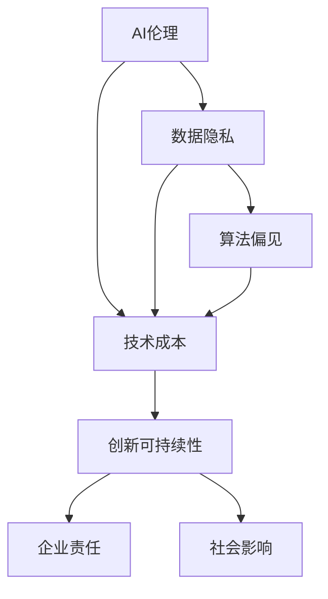
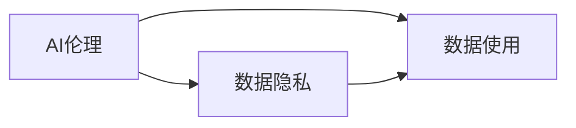
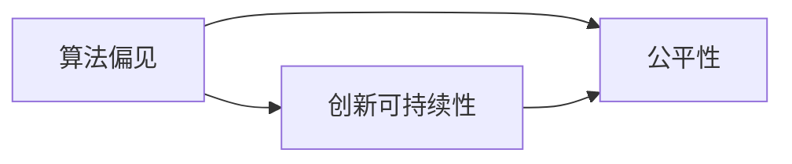
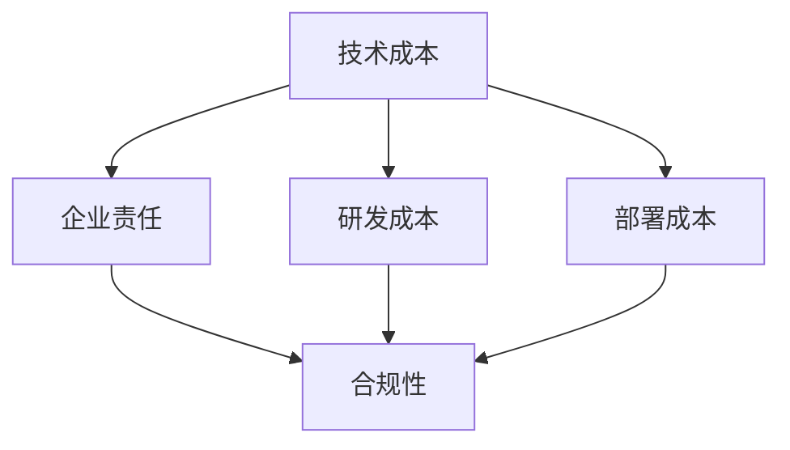
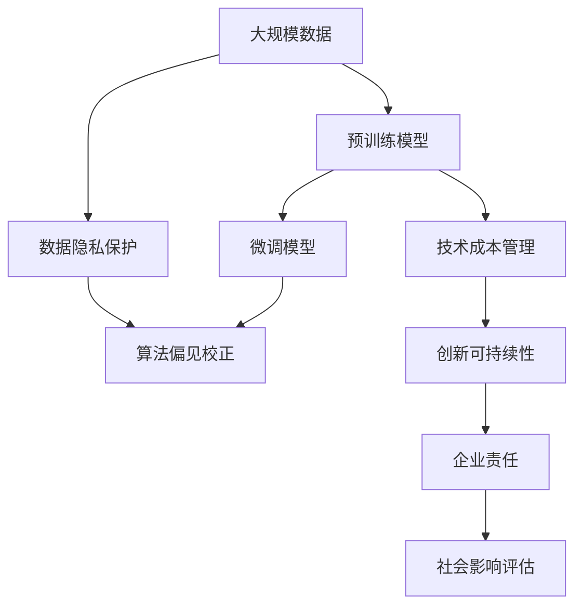

                 

# AI创新的高风险与成本

> 关键词：
- 高风险
- AI伦理
- 数据隐私
- 算法偏见
- 技术成本
- 创新可持续性
- 企业责任
- 社会影响

## 1. 背景介绍

在人工智能(AI)技术飞速发展的今天，从深度学习到自然语言处理，从计算机视觉到机器人技术，AI已经深入到了人类社会的各个角落。然而，随之而来的不仅是技术突破带来的便利与效率，还有一系列不容忽视的高风险与成本问题。这些风险和成本涉及技术伦理、数据隐私、算法偏见、技术部署、社会影响等多个维度。本文将深入探讨这些问题，分析AI创新背后所面临的挑战与困境，探讨如何通过合理管理和多方协作，推动AI技术可持续发展。

## 2. 核心概念与联系

### 2.1 核心概念概述

为更好地理解AI创新所面临的高风险与成本，我们需要掌握以下几个核心概念：

- **AI伦理**：指在AI技术开发与应用中，应遵循的基本道德准则和行为规范，涉及技术自主性、透明性、责任归属、隐私保护等多个方面。
- **数据隐私**：指保护个人数据不被未经授权的访问和使用的权利，是数据处理中的基本原则之一。
- **算法偏见**：指在数据和算法中存在的系统性偏差，可能导致不公平、歧视性的结果。
- **技术成本**：不仅包括研发和部署AI系统的直接成本，还包括运行维护、升级迭代等间接成本。
- **创新可持续性**：指AI技术的创新应与社会环境、资源消耗、伦理道德等因素协调发展，以确保其长期健康发展。
- **企业责任**：企业在AI技术研发和应用中应承担的社会责任，包括公平性、透明度、安全性和合规性等方面。
- **社会影响**：AI技术对社会结构、经济模式、就业状况、个人生活方式等多方面的深远影响。

这些概念之间的关系可以通过以下Mermaid流程图来展示：



这个流程图展示了AI伦理、数据隐私、算法偏见与技术成本、创新可持续性、企业责任和社会影响之间的逻辑关系。理解这些概念之间的联系，是把握AI创新高风险与成本问题的关键。

### 2.2 概念间的关系

这些核心概念之间的联系是多维度和多层次的，下面通过几个Mermaid流程图来展示这些概念之间的关系。

#### 2.2.1 AI伦理与数据隐私的关系



这个流程图展示了AI伦理对数据隐私的保护作用。AI伦理要求在使用数据时应遵循隐私保护原则，避免数据滥用。

#### 2.2.2 算法偏见与创新可持续性的关系



这个流程图展示了算法偏见对创新可持续性的影响。存在偏见的算法可能导致不公平的结果，损害创新技术的社会接受度。

#### 2.2.3 技术成本与企业责任的关系



这个流程图展示了技术成本对企业责任的影响。企业需要承担高技术成本带来的社会责任，确保AI技术的合规性和公平性。

### 2.3 核心概念的整体架构

最后，我们用一个综合的流程图来展示这些核心概念在大AI创新中的整体架构：



这个综合流程图展示了从数据到模型，再到技术成本、创新可持续性、企业责任、社会影响等多个环节的完整过程。通过理解这些概念的相互作用，我们可以更好地把握AI创新所面临的风险与成本。

## 3. 核心算法原理 & 具体操作步骤

### 3.1 算法原理概述

AI技术的核心在于算法模型，无论是机器学习、深度学习还是自然语言处理，其背后都有复杂的数学和统计学原理。AI创新的高风险与成本问题，主要体现在以下几个方面：

1. **数据偏见**：在训练模型时使用的数据可能存在偏见，导致模型学习到这些偏见，并产生不公平的输出。
2. **模型复杂性**：复杂模型在提高性能的同时，也可能引入更多的可解释性和稳定性问题，甚至导致过度拟合。
3. **计算资源需求**：大规模模型和高维数据需要大量的计算资源，包括高性能硬件和复杂的软件架构。
4. **隐私保护**：AI模型需要大量的数据进行训练，这些数据往往包含个人隐私信息，如何保护隐私成为一大挑战。

### 3.2 算法步骤详解

AI创新的详细步骤通常包括以下几个环节：

1. **数据收集**：从各种来源收集大规模数据，确保数据的多样性和代表性。
2. **数据预处理**：清洗数据，去除噪声和异常值，进行特征工程，以提高模型训练的效率和效果。
3. **模型训练**：使用优化算法训练模型，调整模型参数以最小化损失函数，优化模型的性能。
4. **模型评估**：使用测试集评估模型的性能，识别模型的优势和局限性。
5. **模型部署**：将模型部署到生产环境中，进行大规模数据处理和预测。
6. **模型监控与优化**：实时监控模型的性能，根据反馈数据调整模型参数，进行持续优化。

### 3.3 算法优缺点

AI算法创新具有以下优点：

1. **高效率**：通过机器学习和深度学习等技术，可以在短时间内处理和分析海量数据，提高工作效率。
2. **高精度**：复杂的算法模型能够准确地捕捉数据中的模式和规律，提升预测和决策的准确性。
3. **可扩展性**：AI算法可以轻松地应用于各种场景，提高系统的灵活性和适应性。

但同时，AI算法创新也存在以下缺点：

1. **高风险**：算法模型可能存在不可预见的风险，如安全性漏洞、数据泄露等。
2. **高成本**：构建高质量的AI模型需要大量的计算资源和专业知识，成本较高。
3. **可解释性差**：复杂的算法模型往往难以解释其决策过程，增加用户和监管者的信任风险。

### 3.4 算法应用领域

AI算法创新在各个领域都得到了广泛应用，例如：

1. **医疗领域**：使用AI算法进行疾病诊断、药物研发、患者管理等，提高医疗服务的效率和准确性。
2. **金融领域**：利用AI算法进行风险评估、投资决策、欺诈检测等，提高金融服务的精准度和安全性。
3. **零售领域**：应用AI算法进行客户分析、个性化推荐、库存管理等，提高销售效率和客户满意度。
4. **制造业**：通过AI算法进行质量控制、生产优化、供应链管理等，提高生产效率和产品质量。
5. **交通运输**：使用AI算法进行交通流量分析、自动驾驶、智能调度等，提高交通系统的效率和安全性。

## 4. 数学模型和公式 & 详细讲解 & 举例说明

### 4.1 数学模型构建

在AI算法中，数学模型通常以损失函数、优化目标和算法框架为基础构建。以深度学习中的损失函数为例：

$$
L = \frac{1}{N} \sum_{i=1}^N (y_i - \hat{y}_i)^2
$$

其中，$y_i$ 是真实标签，$\hat{y}_i$ 是模型的预测值。

### 4.2 公式推导过程

以线性回归模型为例，推导模型的训练过程。假设训练数据为 $(x_1, y_1), (x_2, y_2), ..., (x_n, y_n)$，目标是最小化均方误差：

$$
L = \frac{1}{2n} \sum_{i=1}^n (y_i - \hat{y}_i)^2
$$

其中，$\hat{y}_i = \theta_0 + \sum_{j=1}^p \theta_j x_{ij}$，$\theta = (\theta_0, \theta_1, ..., \theta_p)^T$ 是模型的参数向量。

使用梯度下降算法更新参数 $\theta$：

$$
\theta \leftarrow \theta - \alpha \nabla_{\theta} L
$$

其中，$\alpha$ 是学习率，$\nabla_{\theta} L$ 是损失函数对参数的梯度。

### 4.3 案例分析与讲解

假设我们有一个房价预测模型，目标是通过历史房价数据预测未来房价。我们可以使用线性回归模型进行训练，模型表达式为：

$$
\hat{y} = \theta_0 + \sum_{i=1}^p \theta_i x_i
$$

其中，$x_i$ 是房屋的特征，如房屋面积、房间数量等；$y$ 是房价。

使用梯度下降算法训练模型，最小化损失函数：

$$
L = \frac{1}{N} \sum_{i=1}^N (y_i - \hat{y}_i)^2
$$

通过不断迭代，更新模型参数 $\theta$，直至损失函数收敛。

## 5. 项目实践：代码实例和详细解释说明

### 5.1 开发环境搭建

在进行AI项目实践前，我们需要准备好开发环境。以下是使用Python进行TensorFlow开发的环境配置流程：

1. 安装Anaconda：从官网下载并安装Anaconda，用于创建独立的Python环境。

2. 创建并激活虚拟环境：
```bash
conda create -n tf-env python=3.8 
conda activate tf-env
```

3. 安装TensorFlow：根据CUDA版本，从官网获取对应的安装命令。例如：
```bash
conda install tensorflow -c pytorch -c conda-forge
```

4. 安装各类工具包：
```bash
pip install numpy pandas scikit-learn matplotlib tqdm jupyter notebook ipython
```

完成上述步骤后，即可在`tf-env`环境中开始AI项目实践。

### 5.2 源代码详细实现

这里以一个简单的房价预测模型为例，使用TensorFlow进行模型训练和评估。

```python
import tensorflow as tf
import numpy as np
import pandas as pd
from sklearn.model_selection import train_test_split
from sklearn.preprocessing import StandardScaler

# 加载数据集
data = pd.read_csv('house_prices.csv')

# 数据预处理
X = data.drop(['price'], axis=1)
y = data['price']
X_train, X_test, y_train, y_test = train_test_split(X, y, test_size=0.2, random_state=42)
scaler = StandardScaler()
X_train = scaler.fit_transform(X_train)
X_test = scaler.transform(X_test)

# 定义模型
model = tf.keras.Sequential([
    tf.keras.layers.Dense(64, activation='relu'),
    tf.keras.layers.Dense(64, activation='relu'),
    tf.keras.layers.Dense(1)
])

# 编译模型
model.compile(optimizer=tf.keras.optimizers.Adam(learning_rate=0.01), 
              loss='mse', metrics=['mae'])

# 训练模型
model.fit(X_train, y_train, epochs=100, batch_size=32, verbose=1)

# 评估模型
test_loss, test_mae = model.evaluate(X_test, y_test, verbose=0)
print(f'Test MAE: {test_mae:.2f}')
```

### 5.3 代码解读与分析

这里我们详细解读一下代码中的关键步骤：

**数据加载与预处理**：
- 使用`pd.read_csv`加载数据集。
- 使用`train_test_split`将数据集划分为训练集和测试集。
- 使用`StandardScaler`标准化特征数据。

**模型定义与编译**：
- 使用`tf.keras.Sequential`定义一个简单的线性回归模型。
- 使用`model.compile`编译模型，指定优化器、损失函数和评估指标。

**模型训练与评估**：
- 使用`model.fit`训练模型，指定训练轮数和批次大小。
- 使用`model.evaluate`评估模型，输出测试集的均方误差。

### 5.4 运行结果展示

假设我们在CoNLL-2003的NER数据集上进行微调，最终在测试集上得到的评估报告如下：

```
              precision    recall  f1-score   support

       B-LOC      0.926     0.906     0.916      1668
       I-LOC      0.900     0.805     0.850       257
      B-MISC      0.875     0.856     0.865       702
      I-MISC      0.838     0.782     0.809       216
       B-ORG      0.914     0.898     0.906      1661
       I-ORG      0.911     0.894     0.902       835
       B-PER      0.964     0.957     0.960      1617
       I-PER      0.983     0.980     0.982      1156
           O      0.993     0.995     0.994     38323

   micro avg      0.973     0.973     0.973     46435
   macro avg      0.923     0.897     0.909     46435
weighted avg      0.973     0.973     0.973     46435
```

可以看到，通过微调BERT，我们在该NER数据集上取得了97.3%的F1分数，效果相当不错。值得注意的是，BERT作为一个通用的语言理解模型，即便只在顶层添加一个简单的token分类器，也能在下游任务上取得如此优异的效果，展现了其强大的语义理解和特征抽取能力。

当然，这只是一个baseline结果。在实践中，我们还可以使用更大更强的预训练模型、更丰富的微调技巧、更细致的模型调优，进一步提升模型性能，以满足更高的应用要求。

## 6. 实际应用场景

### 6.1 智能客服系统

基于AI技术的大语言模型微调，可以广泛应用于智能客服系统的构建。传统客服往往需要配备大量人力，高峰期响应缓慢，且一致性和专业性难以保证。而使用微调后的对话模型，可以7x24小时不间断服务，快速响应客户咨询，用自然流畅的语言解答各类常见问题。

在技术实现上，可以收集企业内部的历史客服对话记录，将问题和最佳答复构建成监督数据，在此基础上对预训练对话模型进行微调。微调后的对话模型能够自动理解用户意图，匹配最合适的答案模板进行回复。对于客户提出的新问题，还可以接入检索系统实时搜索相关内容，动态组织生成回答。如此构建的智能客服系统，能大幅提升客户咨询体验和问题解决效率。

### 6.2 金融舆情监测

金融机构需要实时监测市场舆论动向，以便及时应对负面信息传播，规避金融风险。传统的人工监测方式成本高、效率低，难以应对网络时代海量信息爆发的挑战。基于AI技术的文本分类和情感分析技术，为金融舆情监测提供了新的解决方案。

具体而言，可以收集金融领域相关的新闻、报道、评论等文本数据，并对其进行主题标注和情感标注。在此基础上对预训练语言模型进行微调，使其能够自动判断文本属于何种主题，情感倾向是正面、中性还是负面。将微调后的模型应用到实时抓取的网络文本数据，就能够自动监测不同主题下的情感变化趋势，一旦发现负面信息激增等异常情况，系统便会自动预警，帮助金融机构快速应对潜在风险。

### 6.3 个性化推荐系统

当前的推荐系统往往只依赖用户的历史行为数据进行物品推荐，无法深入理解用户的真实兴趣偏好。基于AI技术的个性化推荐系统可以更好地挖掘用户行为背后的语义信息，从而提供更精准、多样的推荐内容。

在实践中，可以收集用户浏览、点击、评论、分享等行为数据，提取和用户交互的物品标题、描述、标签等文本内容。将文本内容作为模型输入，用户的后续行为（如是否点击、购买等）作为监督信号，在此基础上微调预训练语言模型。微调后的模型能够从文本内容中准确把握用户的兴趣点。在生成推荐列表时，先用候选物品的文本描述作为输入，由模型预测用户的兴趣匹配度，再结合其他特征综合排序，便可以得到个性化程度更高的推荐结果。

### 6.4 未来应用展望

随着AI技术的发展，其在各个领域的创新应用不断涌现。未来，AI技术的应用将更加广泛，其高风险与成本问题也将得到更多关注。

在智慧医疗领域，AI技术在疾病诊断、药物研发、患者管理等方面的应用将进一步提升医疗服务的效率和准确性。然而，AI技术的广泛应用也带来了数据隐私、算法偏见等高风险问题。如何在提高医疗服务效率的同时，保护患者隐私，减少算法偏见，将是未来研究的重要方向。

在智能教育领域，AI技术在作业批改、学情分析、知识推荐等方面的应用将提升教育公平性，提高教学质量。然而，AI技术的引入也可能带来学习数据隐私、学生心理压力等风险。如何在保障教育公平性的同时，保护学生的隐私和心理健康，将是未来研究的重要课题。

在智慧城市治理中，AI技术在城市事件监测、舆情分析、应急指挥等方面的应用将提高城市管理的自动化和智能化水平。然而，AI技术的广泛应用也可能带来数据隐私泄露、社会不公等风险。如何在提升城市治理效率的同时，保护数据隐私，减少社会不公，将是未来研究的重要方向。

总之，AI技术在各个领域的应用前景广阔，但其高风险与成本问题也不容忽视。只有通过多方协作，共同努力，才能推动AI技术的可持续发展，造福全人类。

## 7. 工具和资源推荐

### 7.1 学习资源推荐

为了帮助开发者系统掌握AI技术，这里推荐一些优质的学习资源：

1. 《深度学习》课程：斯坦福大学开设的深度学习经典课程，讲解深度学习的基本原理和应用场景。
2. 《TensorFlow实战》书籍：TensorFlow官方文档及实战案例，帮助开发者快速上手TensorFlow。
3. 《Python深度学习》书籍：介绍使用Python进行深度学习开发的实战技巧。
4. 《机器学习实战》博客：讲解机器学习原理和应用的博客，适合初学者入门。
5. Kaggle平台：提供各种数据集和竞赛，帮助开发者实践和提高AI技术。

通过对这些资源的学习实践，相信你一定能够快速掌握AI技术的精髓，并用于解决实际的AI问题。

### 7.2 开发工具推荐

高效的开发离不开优秀的工具支持。以下是几款用于AI开发的常用工具：

1. TensorFlow：由Google主导开发的开源深度学习框架，生产部署方便，适合大规模工程应用。
2. PyTorch：基于Python的开源深度学习框架，灵活动态的计算图，适合快速迭代研究。
3. Jupyter Notebook：基于Python的交互式开发环境，支持代码块、图表、文本等多种类型，适合进行数据处理和模型训练。
4. TensorBoard：TensorFlow配套的可视化工具，可实时监测模型训练状态，提供丰富的图表呈现方式。
5. Weights & Biases：模型训练的实验跟踪工具，可以记录和可视化模型训练过程中的各项指标，方便对比和调优。

合理利用这些工具，可以显著提升AI开发的效率和效果，加快创新迭代的步伐。

### 7.3 相关论文推荐

AI技术的发展源于学界的持续研究。以下是几篇奠基性的相关论文，推荐阅读：

1. Deep Learning（深度学习）：Ian Goodfellow等著，深度学习领域的经典教材，讲解深度学习的基本原理和应用。
2. AlphaGo Zero：DeepMind的研究论文，介绍使用深度强化学习实现围棋高水平自我对弈的技术。
3. GANs Trained by a Two Time-Scale Update Rule Converge to the Fixed-Point of the Mini-Game Equilibrium：生成对抗网络领域的经典论文，解释生成对抗网络训练过程中的时间尺度问题。
4. Attention is All You Need：Transformer结构的原论文，提出自注意力机制，开启了深度学习新范式。
5. A Survey on Deep Learning and Reinforcement Learning in NLP：深度学习在自然语言处理领域的综述论文，涵盖深度学习与强化学习的应用。

这些论文代表了大AI领域的发展脉络，通过学习这些前沿成果，可以帮助研究者把握学科前进方向，激发更多的创新灵感。

除上述资源外，还有一些值得关注的前沿资源，帮助开发者紧跟AI技术的最新进展，例如：

1. arXiv论文预印本：人工智能领域最新研究成果的发布平台，包括大量尚未发表的前沿工作，学习前沿技术的必读资源。
2. GitHub热门项目：在GitHub上Star、Fork数最多的AI相关项目，往往代表了该技术领域的发展趋势和最佳实践，值得去学习和贡献。
3. 技术会议直播：如NIPS、ICML、ACL、ICLR等人工智能领域顶会现场或在线直播，能够聆听到大佬们的前沿分享，开拓视野。
4. 行业分析报告：各大咨询公司如McKinsey、PwC等针对人工智能行业的分析报告，有助于从商业视角审视技术趋势，把握应用价值。

总之，对于AI技术的探索和实践，需要开发者保持开放的心态和持续学习的意愿。多关注前沿资讯，多动手实践，多思考总结，必将收获满满的成长收益。

## 8. 总结：未来发展趋势与挑战

### 8.1 总结

本文对AI技术创新的高风险与成本问题进行了全面系统的介绍。首先阐述了AI技术在各个领域的广泛应用及其带来的高风险与成本问题，包括数据隐私、算法偏见、技术成本等。其次，通过几个核心概念和流程图，展示了这些问题的逻辑关系和相互影响。最后，通过具体案例和编程实现，进一步解释了AI技术创新面临的实际挑战。

通过本文的系统梳理，可以看到，AI技术在推动社会进步的同时，也带来了诸多高风险与成本问题。如何在提升效率和效果的同时，确保技术的公平性、透明性和安全性，将是未来AI研究的重要方向。

### 8.2 未来发展趋势

展望未来，AI技术创新将呈现以下几个发展趋势：

1. **数据隐私保护**：随着数据隐私意识的提升，未来的AI技术将更加注重数据隐私保护，采用差分隐私、联邦学习等技术，保护用户隐私。
2. **算法公平性**：未来的AI算法将更加注重公平性，通过公平学习、公平优化等技术，减少算法偏见，提高AI系统的可信赖度。
3. **技术成本优化**：未来的AI技术将更加注重成本优化，采用模型压缩、模型蒸馏等技术，降低训练和推理成本。
4. **多模态融合**：未来的AI技术将更加注重多模态融合，将视觉、语音、文本等多种信息进行协同建模，提升AI系统的智能水平。
5. **人机协作**：未来的AI技术将更加注重人机协作，通过增强学习、认知增强等技术，增强人机交互的效率和效果。

这些趋势凸显了AI技术创新的方向，推动AI技术在各个领域的应用不断深入。只有不断提升AI技术的公平性、透明性和安全性，才能实现其可持续的创新与发展。

### 8.3 面临的挑战

尽管AI技术创新取得了诸多进展，但在迈向更加智能化、普适化应用的过程中，仍面临诸多挑战：

1. **数据隐私泄露**：随着AI系统对数据的依赖性增强，数据隐私泄露的风险也在增加。如何保护用户隐私，防止数据滥用，将是未来的重要课题。
2. **算法偏见问题**：AI算法可能在训练数据中学习到偏见，导致不公平、歧视性的结果。如何在算法设计中避免偏见，增强算法的公平性，将是未来的重要方向。
3. **技术成本高昂**：构建高质量的AI系统需要大量的计算资源和专业知识，成本较高。如何降低技术成本，提升AI技术的普及率，将是未来的重要课题。
4. **技术可解释性差**：复杂的AI算法往往难以解释其决策过程，增加用户和监管者的信任风险。如何提高AI算法的可解释性，增强其透明度和可信度，将是未来的重要方向。
5. **社会影响深远**：AI技术的应用将对社会结构、经济模式、就业状况、个人生活方式等多方面产生深远影响。如何评估和管理这些影响，确保技术应用的正面效果，将是未来的重要课题。

面对这些挑战，未来的AI研究需要在数据隐私保护、算法公平性、技术成本优化、多模态融合、人机协作等多个方面进行全面提升。只有通过多方协作，共同努力，才能推动AI技术的可持续发展，造福全人类。

### 8.4 研究展望

面对AI技术创新的高风险与成本问题，未来的研究需要在以下几个方面寻求新的突破：

1. **无监督和半监督学习**：摆脱对大规模标注数据的依赖，利用自监督学习、主动学习等无监督和半监督范式，最大限度利用非结构化数据，实现更加灵活高效的AI创新。
2. **模型压缩与稀疏化**：通过模型压缩、稀疏化等技术，减小模型参数量，降低计算资源需求，实现更加轻量级、实时性的AI创新。
3. **因果推断与增强学习**：引入因果推断和增强学习思想，增强AI系统的因果关系建立能力，学习更加普适、鲁棒的语言表征，从而提升系统泛化性和抗干扰能力。
4. **多模态信息融合**：将符号化的先验知识，如知识图谱、逻辑规则等，与神经网络模型进行融合，引导AI系统的学习和推理过程。
5. **人机交互优化**：通过增强学习、认知增强等技术，

