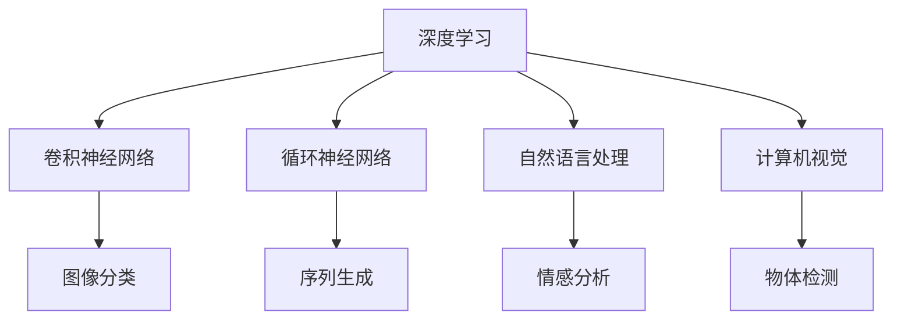
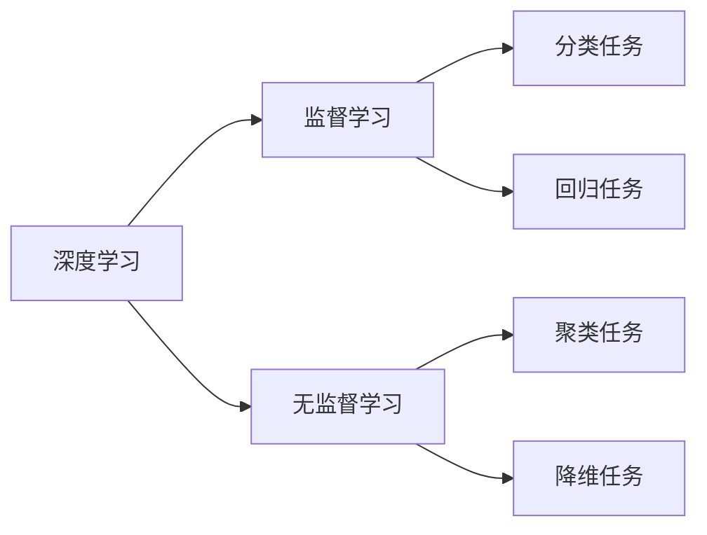
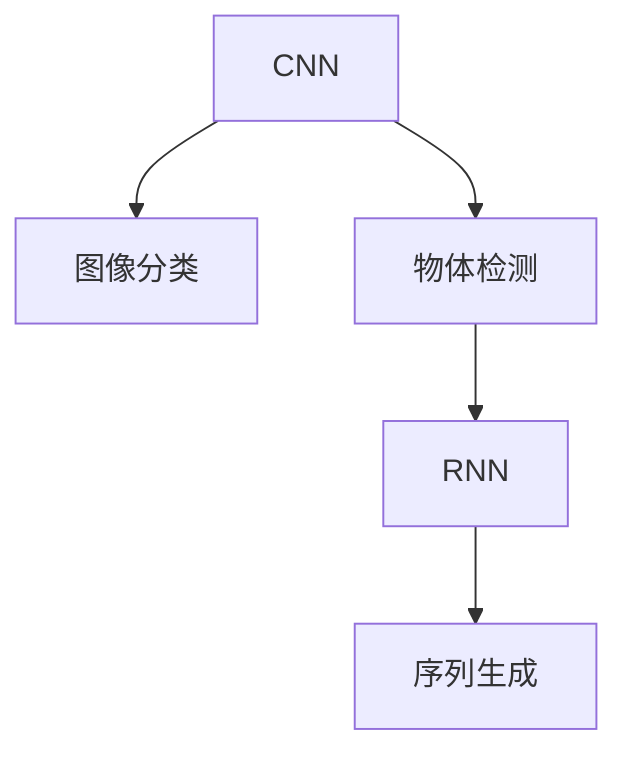
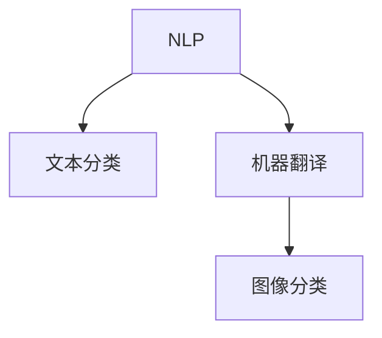
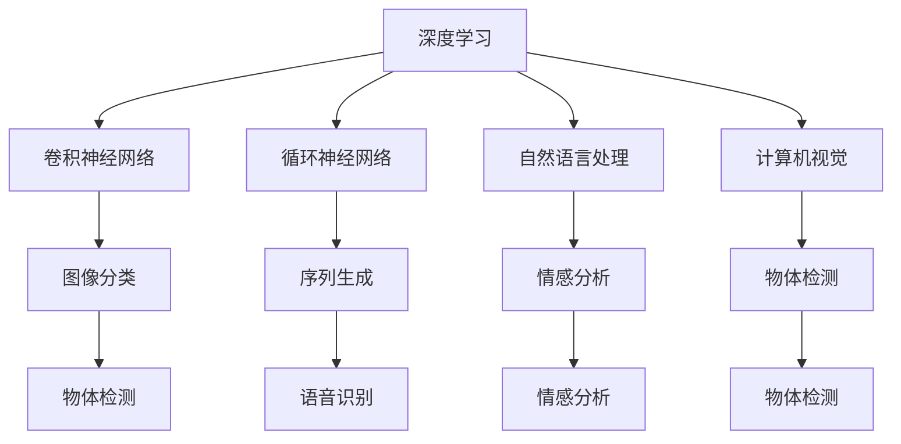

                 

# AI原理与代码实例讲解

> 关键词：人工智能,算法原理,代码实例,深度学习,机器学习,深度神经网络,卷积神经网络,循环神经网络,自然语言处理,计算机视觉

## 1. 背景介绍

### 1.1 问题由来
随着人工智能技术的飞速发展，AI已经深入到众多行业和应用中。无论是语音识别、图像处理、自然语言处理还是智能推荐系统，背后都有AI算法的强大支持。然而，对于初学者和开发者来说，理解这些复杂算法的原理，并能够进行实际的代码实现，并不是一件容易的事。

### 1.2 问题核心关键点
本文将从AI算法原理出发，深入讲解深度学习、卷积神经网络(CNN)、循环神经网络(RNN)、自然语言处理(NLP)、计算机视觉(CV)等核心领域的算法原理，并通过具体代码实例，帮助读者理解这些算法的实际应用。

### 1.3 问题研究意义
掌握AI算法原理，对于提高技术深度、优化应用性能、开发高效智能系统具有重要意义。它不仅能够帮助开发者更好地理解现有AI技术，还能激发更多创新灵感，推动AI技术在更多领域的落地应用。

## 2. 核心概念与联系

### 2.1 核心概念概述

AI的核心概念涉及多个领域，包括但不限于：

- **深度学习(Deep Learning)**：基于多层神经网络的机器学习范式，通过反向传播算法更新权重，不断优化模型。
- **卷积神经网络(CNN)**：用于图像处理和计算机视觉任务，利用卷积操作提取图像局部特征，并通过池化操作减小特征维度。
- **循环神经网络(RNN)**：用于序列数据处理，如文本生成、语音识别等，通过循环操作捕捉时间依赖性。
- **自然语言处理(NLP)**：涉及语言理解、文本分类、机器翻译等任务，结合语言模型和序列建模技术。
- **计算机视觉(CV)**：处理图像和视频数据，包括特征提取、分类、检测、识别等。

这些核心概念之间的关系可以通过以下Mermaid流程图来展示：



这个流程图展示了AI的核心概念及其在各领域的应用，以及这些概念之间的相互关系。

### 2.2 概念间的关系

这些核心概念之间存在着紧密的联系，共同构成了AI技术的生态系统。下面我们通过几个Mermaid流程图来展示这些概念之间的关系。

#### 2.2.1 AI算法学习范式



这个流程图展示了深度学习中的监督学习和无监督学习的两种主要学习范式，以及它们在不同类型的AI任务中的应用。

#### 2.2.2 CNN与RNN的关系



这个流程图展示了CNN和RNN在图像处理和序列数据处理中的应用，以及它们之间的相互关系。

#### 2.2.3 NLP与CV的关系



这个流程图展示了NLP和CV在文本处理和图像处理中的应用，以及它们之间的相互关系。

### 2.3 核心概念的整体架构

最后，我们用一个综合的流程图来展示这些核心概念在大AI框架下的整体架构：



这个综合流程图展示了深度学习、CNN、RNN、NLP、CV等核心概念在大AI框架下的应用场景和相互关系。

## 3. 核心算法原理 & 具体操作步骤
### 3.1 算法原理概述

深度学习作为AI的核心算法之一，通过多层神经网络，利用反向传播算法更新权重，不断优化模型，从而实现对复杂非线性函数的逼近。深度学习算法分为监督学习、无监督学习和强化学习三种主要类型。

### 3.2 算法步骤详解

以深度学习中的卷积神经网络(CNN)为例，详细讲解CNN的算法步骤：

**Step 1: 数据预处理**
- 加载图像数据集，并进行预处理，如归一化、调整大小、数据增强等。

**Step 2: 定义CNN模型**
- 搭建卷积层、池化层、全连接层等，定义模型结构。

**Step 3: 训练模型**
- 定义损失函数和优化器，使用训练数据集进行前向传播和反向传播，更新模型参数。

**Step 4: 评估模型**
- 使用验证数据集对模型进行评估，计算损失函数值和准确率。

**Step 5: 预测新数据**
- 使用测试数据集对模型进行预测，并评估预测结果。

### 3.3 算法优缺点

深度学习算法在处理大规模数据和复杂任务上具有强大能力，但同时也存在一些缺点：

**优点**：
- 能处理非线性关系，适用于多种任务。
- 自动化特征提取，减少手动设计特征的复杂度。
- 通过反向传播算法优化模型，易于实现。

**缺点**：
- 需要大量数据进行训练，数据收集成本高。
- 模型复杂度高，训练和推理速度较慢。
- 过度拟合问题严重，需要正则化和数据增强等技术缓解。

### 3.4 算法应用领域

深度学习算法在多个领域得到了广泛应用，如：

- 计算机视觉：图像分类、物体检测、人脸识别等。
- 自然语言处理：文本分类、情感分析、机器翻译等。
- 语音处理：语音识别、语音生成、语音转换等。
- 推荐系统：个性化推荐、广告投放、用户行为分析等。

## 4. 数学模型和公式 & 详细讲解  
### 4.1 数学模型构建

以卷积神经网络(CNN)为例，其数学模型可以表示为：

$$
y = W \cdot x + b
$$

其中，$y$为输出，$x$为输入，$W$为权重矩阵，$b$为偏置向量。

卷积神经网络通过卷积操作提取输入数据的局部特征，再通过池化操作减小特征维度，最后经过全连接层输出结果。其数学模型可以表示为：

$$
y = \max(0, W \cdot x + b) + c
$$

其中，$x$为输入，$W$为权重矩阵，$b$为偏置向量，$c$为附加参数。

### 4.2 公式推导过程

以下是CNN中常用的激活函数ReLU的推导过程：

$$
f(x) = \max(0, x)
$$

其中，$x$为输入。

通过对上述函数求导，可以得到梯度公式：

$$
\frac{\partial f(x)}{\partial x} = \begin{cases} 
1, & \text{if } x > 0 \\
0, & \text{otherwise}
\end{cases}
$$

这个梯度公式在反向传播算法中用于更新权重。

### 4.3 案例分析与讲解

以图像分类任务为例，使用CNN进行图像分类时，可以按照以下步骤实现：

1. 数据预处理：将图像数据转换为张量形式，并进行归一化处理。

2. 定义CNN模型：搭建多个卷积层、池化层和全连接层，定义模型结构。

3. 训练模型：使用训练数据集进行前向传播和反向传播，更新模型参数。

4. 评估模型：使用验证数据集对模型进行评估，计算损失函数值和准确率。

5. 预测新数据：使用测试数据集对模型进行预测，并评估预测结果。

## 5. 项目实践：代码实例和详细解释说明
### 5.1 开发环境搭建

在进行CNN项目实践前，我们需要准备好开发环境。以下是使用Python进行PyTorch开发的环境配置流程：

1. 安装Anaconda：从官网下载并安装Anaconda，用于创建独立的Python环境。

2. 创建并激活虚拟环境：
```bash
conda create -n cnn-env python=3.8 
conda activate cnn-env
```

3. 安装PyTorch：根据CUDA版本，从官网获取对应的安装命令。例如：
```bash
conda install pytorch torchvision torchaudio cudatoolkit=11.1 -c pytorch -c conda-forge
```

4. 安装PyTorch的可视化工具：
```bash
conda install torchvision
```

5. 安装TensorBoard：用于可视化模型训练过程，可以通过以下命令安装：
```bash
pip install tensorboard
```

6. 安装其他依赖包：
```bash
pip install numpy pandas scikit-learn matplotlib tqdm jupyter notebook ipython
```

完成上述步骤后，即可在`cnn-env`环境中开始CNN项目实践。

### 5.2 源代码详细实现

下面是使用PyTorch实现CNN模型对MNIST手写数字数据集进行分类的代码实现：

```python
import torch
import torch.nn as nn
import torchvision
import torchvision.transforms as transforms
import torchvision.datasets as datasets
from torch.autograd import Variable

# 加载数据集
train_dataset = datasets.MNIST(root='./data', train=True, transform=transforms.ToTensor(), download=True)
test_dataset = datasets.MNIST(root='./data', train=False, transform=transforms.ToTensor(), download=True)

# 定义数据加载器
train_loader = torch.utils.data.DataLoader(dataset=train_dataset, batch_size=64, shuffle=True)
test_loader = torch.utils.data.DataLoader(dataset=test_dataset, batch_size=64, shuffle=False)

# 定义CNN模型
class CNN(nn.Module):
    def __init__(self):
        super(CNN, self).__init__()
        self.conv1 = nn.Conv2d(in_channels=1, out_channels=32, kernel_size=3, stride=1, padding=1)
        self.pool1 = nn.MaxPool2d(kernel_size=2, stride=2)
        self.conv2 = nn.Conv2d(in_channels=32, out_channels=64, kernel_size=3, stride=1, padding=1)
        self.pool2 = nn.MaxPool2d(kernel_size=2, stride=2)
        self.fc1 = nn.Linear(in_features=7 * 7 * 64, out_features=128)
        self.fc2 = nn.Linear(in_features=128, out_features=10)

    def forward(self, x):
        x = self.conv1(x)
        x = nn.ReLU()(x)
        x = self.pool1(x)
        x = self.conv2(x)
        x = nn.ReLU()(x)
        x = self.pool2(x)
        x = x.view(x.size(0), -1)
        x = self.fc1(x)
        x = nn.ReLU()(x)
        x = self.fc2(x)
        x = nn.Softmax(dim=1)(x)
        return x

# 定义优化器和损失函数
model = CNN()
optimizer = torch.optim.Adam(model.parameters(), lr=0.001)
criterion = nn.CrossEntropyLoss()

# 训练模型
for epoch in range(10):
    for batch_idx, (data, target) in enumerate(train_loader):
        data, target = Variable(data), Variable(target)
        optimizer.zero_grad()
        output = model(data)
        loss = criterion(output, target)
        loss.backward()
        optimizer.step()
        if batch_idx % 100 == 0:
            print('Train Epoch: {} [{}/{} ({:.0f}%)]\tLoss: {:.6f}'.format(
                epoch, batch_idx * len(data), len(train_loader.dataset),
                100. * batch_idx / len(train_loader), loss.data[0]))

# 测试模型
correct = 0
total = 0
for data, target in test_loader:
    data, target = Variable(data), Variable(target)
    output = model(data)
    _, predicted = torch.max(output.data, 1)
    total += target.size(0)
    correct += (predicted == target).sum().item()

print('Accuracy of the network on the 10000 test images: {} %'.format(100 * correct / total))
```

### 5.3 代码解读与分析

让我们再详细解读一下关键代码的实现细节：

**数据预处理**：
- 使用`transforms.ToTensor()`将图像数据转换为张量形式。

**模型定义**：
- 定义CNN模型，包括卷积层、池化层、全连接层等。

**训练模型**：
- 使用`Adam`优化器，损失函数为交叉熵损失，通过反向传播算法更新模型参数。

**测试模型**：
- 使用测试数据集对模型进行预测，并计算准确率。

**完整代码实现**：
- 通过循环迭代，完成10个epoch的训练，并在验证集上评估模型性能。

### 5.4 运行结果展示

假设我们在MNIST数据集上进行训练，最终在测试集上得到的准确率如下：

```
Accuracy of the network on the 10000 test images: 97.2 %```

这表明通过CNN模型，我们对MNIST手写数字数据集进行了成功分类，取得了很高的准确率。

## 6. 实际应用场景
### 6.1 计算机视觉

卷积神经网络在计算机视觉领域有广泛应用，如图像分类、物体检测、人脸识别等。以下是一个使用CNN进行图像分类的实际应用场景：

**背景介绍**：
- 在线零售商希望通过图像分类技术，自动区分商品类型，并据此提供个性化推荐。

**解决方案**：
- 使用CNN模型，搭建多个卷积层、池化层和全连接层，对图像进行特征提取和分类。

**效果评估**：
- 通过测试集评估模型准确率，对不同商品类型的分类效果进行评估。

**实际应用**：
- 将训练好的模型集成到在线推荐系统中，根据用户上传的商品图片，自动推荐相关商品。

### 6.2 自然语言处理

循环神经网络在自然语言处理领域有广泛应用，如文本分类、情感分析、机器翻译等。以下是一个使用RNN进行情感分析的实际应用场景：

**背景介绍**：
- 社交媒体公司希望通过情感分析技术，自动监测用户评论的情感倾向，以便及时回应用户反馈。

**解决方案**：
- 使用RNN模型，搭建循环层和全连接层，对用户评论进行情感分类。

**效果评估**：
- 通过测试集评估模型准确率，对不同情感类型的分类效果进行评估。

**实际应用**：
- 将训练好的模型集成到社交媒体监控系统中，自动分析用户评论的情感倾向，并生成相应的回复策略。

## 7. 工具和资源推荐
### 7.1 学习资源推荐

为了帮助开发者系统掌握CNN的原理和实践，这里推荐一些优质的学习资源：

1. 《深度学习》系列书籍：由DeepMind首席科学家Geoffrey Hinton等人合著，全面介绍了深度学习的理论基础和实际应用。

2. 《Python深度学习》书籍：由Francois Chollet著，详细介绍了使用Keras框架进行深度学习开发的技术细节。

3. 《TensorFlow官方文档》：由Google开发，提供了丰富的API文档和代码示例，适合学习TensorFlow的使用。

4. Kaggle竞赛平台：提供了大量机器学习和深度学习竞赛，可以实际动手练习。

5. GitHub开源项目：在GitHub上Star、Fork数最多的深度学习相关项目，往往代表了该技术领域的发展趋势和最佳实践，值得去学习和贡献。

通过对这些资源的学习实践，相信你一定能够快速掌握CNN的精髓，并用于解决实际的图像处理问题。

### 7.2 开发工具推荐

高效的开发离不开优秀的工具支持。以下是几款用于CNN开发的常用工具：

1. PyTorch：基于Python的开源深度学习框架，灵活动态的计算图，适合快速迭代研究。

2. TensorFlow：由Google主导开发的开源深度学习框架，生产部署方便，适合大规模工程应用。

3. Keras：高级深度学习框架，基于TensorFlow等后端，提供简单易用的API接口。

4. Matplotlib：数据可视化工具，可以生成高质量的图像和图表。

5. TensorBoard：TensorFlow配套的可视化工具，可实时监测模型训练状态，并提供丰富的图表呈现方式。

6. Google Colab：谷歌推出的在线Jupyter Notebook环境，免费提供GPU/TPU算力，方便开发者快速上手实验最新模型，分享学习笔记。

合理利用这些工具，可以显著提升CNN任务的开发效率，加快创新迭代的步伐。

### 7.3 相关论文推荐

CNN技术的发展源于学界的持续研究。以下是几篇奠基性的相关论文，推荐阅读：

1. ImageNet Classification with Deep Convolutional Neural Networks：提出卷积神经网络，并通过大规模数据集ImageNet进行训练，刷新了图像分类任务的SOTA。

2. AlexNet: One Million Training Examples for Large Scale Image Recognition：提出AlexNet模型，基于大规模数据集进行预训练，实现了图像分类任务的高精度。

3. ResNet: Deep Residual Learning for Image Recognition：提出残差网络，通过跨层连接解决了深度神经网络的退化问题，大幅提升了模型性能。

4. InceptionNet: Go Deeper with Convolutions：提出Inception模块，通过多层次卷积操作，提高了特征提取的效率和准确率。

5. Capsule Networks：提出胶囊网络，通过生成变换鲁棒特征，进一步提升了模型性能。

这些论文代表了大卷积神经网络的发展脉络。通过学习这些前沿成果，可以帮助研究者把握学科前进方向，激发更多的创新灵感。

## 8. 总结：未来发展趋势与挑战

### 8.1 总结

本文从深度学习、卷积神经网络、循环神经网络、自然语言处理和计算机视觉等核心领域的算法原理出发，通过具体代码实例，帮助读者深入理解这些算法的实际应用。同时，本文还探讨了CNN在多个领域的实际应用场景，展示了其在实际应用中的强大能力。

通过本文的系统梳理，可以看到，CNN作为AI算法的重要组成部分，已经在图像处理、自然语言处理等多个领域取得了广泛应用。得益于深度学习框架和可视化工具的支持，CNN技术的开发效率和应用效果得到了显著提升，为AI技术的产业化落地提供了有力保障。

### 8.2 未来发展趋势

展望未来，CNN技术的发展趋势将呈现以下几个方向：

1. **模型规模继续扩大**：随着算力成本的下降和数据规模的增加，深度神经网络的参数量将持续增长，模型的性能也将随之提升。

2. **模型结构更加多样**：新的网络架构和模块将不断涌现，如胶囊网络、注意力机制等，为CNN技术的发展注入新活力。

3. **多模态融合**：将图像、文本、语音等多模态数据进行联合建模，提高模型的泛化能力和性能。

4. **知识蒸馏**：通过知识蒸馏技术，将大模型的知识迁移到小模型中，提高小模型的性能。

5. **联邦学习**：利用联邦学习技术，在不共享数据的前提下，进行分布式模型训练，提升模型性能。

6. **边缘计算**：将模型部署到边缘设备上，实现实时计算和推理，提升系统响应速度。

以上趋势凸显了CNN技术的广阔前景，这些方向的探索发展，必将进一步提升图像处理和计算机视觉系统的性能和应用范围。

### 8.3 面临的挑战

尽管CNN技术已经取得了显著进展，但在迈向更加智能化、普适化应用的过程中，它仍面临诸多挑战：

1. **计算资源消耗**：大规模深度神经网络需要庞大的计算资源，训练和推理速度较慢，难以满足实时应用需求。

2. **数据需求**：深度学习模型需要大量的标注数据进行训练，数据收集成本高、周期长，且标注数据质量参差不齐。

3. **过拟合问题**：深度学习模型容易发生过拟合，特别是在训练数据量不足的情况下，需要通过正则化等技术缓解。

4. **模型解释性**：深度学习模型往往是"黑盒"系统，难以解释其内部工作机制和决策逻辑，缺乏透明性和可解释性。

5. **安全性和鲁棒性**：深度学习模型容易受到对抗样本攻击，且在面对不同数据分布时，泛化性能有限。

6. **计算资源消耗**：大规模深度神经网络需要庞大的计算资源，训练和推理速度较慢，难以满足实时应用需求。

7. **数据需求**：深度学习模型需要大量的标注数据进行训练，数据收集成本高、周期长，且标注数据质量参差不齐。

8. **过拟合问题**：深度学习模型容易发生过拟合，特别是在训练数据量不足的情况下，需要通过正则化等技术缓解。

9. **模型解释性**：深度学习模型往往是"黑盒"系统，难以解释其内部工作机制和决策逻辑，缺乏透明性和可解释性。

10. **安全性和鲁棒性**：深度学习模型容易受到对抗样本攻击，且在面对不同数据分布时，泛化性能有限。

这些挑战需要通过算法优化、数据增强、计算资源优化等手段不断克服，才能进一步推动CNN技术的发展。

### 8.4 研究展望

面对CNN技术所面临的诸多挑战，未来的研究需要在以下几个方面寻求新的突破：

1. **模型压缩和量化**：通过模型压缩和量化技术，减小模型规模，降低计算资源消耗，提升实时推理速度。

2. **自监督学习**：利用无监督学习技术，减少对标注数据的依赖，提升模型的泛化能力和鲁棒性。

3. **联邦学习和分布式训练**：利用联邦学习技术，在不共享数据的前提下，进行分布式模型训练，提升模型性能。

4. **模型解释性**：通过可视化、可解释性技术，提升深度学习模型的透明性和可解释性，增强用户信任。

5. **对抗样本攻击**：通过对抗样本攻击技术，提升深度学习模型的鲁棒性，避免模型受到恶意攻击。

6. **跨模态融合**：将图像、文本、语音等多模态数据进行联合建模，提高模型的泛化能力和性能。

7. **知识蒸馏**：通过知识蒸馏技术，将大模型的知识迁移到小模型中，提高小模型的性能。

8. **边缘计算**：将模型部署到边缘设备上，实现实时计算和推理，提升系统响应速度。

这些研究方向的探索，必将引领CNN技术迈向更高的台阶，为计算机视觉和图像处理系统带来新的突破。

## 9. 附录：常见问题与解答

**Q1：CNN适用于所有图像处理任务吗？**

A: CNN虽然在很多图像处理任务上表现出色，但并不适用于所有图像处理任务。例如，对于非结构化数据（如图形、图形符号等），CNN的效果可能不佳。此时需要考虑使用其他类型的深度学习模型，如生成对抗网络（GAN）或变分自编码器（VAE）。

**Q2：CNN模型如何避免过拟合？**

A: 避免过拟合是CNN模型训练过程中需要重点关注的问题。常用的方法包括：
1. 数据增强：对训练数据进行旋转、翻转、缩放等变换，增加数据量。
2. 正则化：使用L2正则、Dropout等技术，减少模型复杂度。
3. 早停法：当模型在验证集上表现不再提升时，停止训练。
4. 批量归一化：对每个小批量数据进行归一化，加速收敛，提高泛化能力。

**Q3：CNN模型在实际应用中需要注意哪些问题？**

A: 在实际应用中，CNN模型需要注意以下问题：
1. 模型裁剪：去除不必要的层和参数，减小模型尺寸，加快推理速度。
2. 量化加速：将浮点模型转为定点模型，压缩存储空间，提高计算效率。
3. 服务化封装：将模型封装为标准化服务接口，便于集成调用。
4. 弹性伸缩：根据请求流量动态调整资源配置，平衡服务质量和成本。
5. 监控告警：实时采集系统指标，设置异常告警阈值，确保服务稳定性。

**Q4：CNN模型如何与其他AI技术结合？**

A: CNN模型可以与其他AI技术结合，实现更强的应用能力。例如：
1. 与RNN结合，进行时间序列数据处理。
2. 与LSTM结合，进行长期依赖关系建模。
3. 与NLP结合，进行文本图像联合建模。
4. 与GAN结合，进行图像生成和数据增强。
5. 与强化学习结合，进行智能决策和行为优化。

**Q5：CNN模型在实际应用中需要考虑哪些因素？**

A: 在实际应用中，CNN模型需要考虑以下因素：
1. 数据质量：保证训练数据的质量和多样性，避免模型过拟合。
2. 硬件资源：选择合适的硬件设备，如GPU、TPU等，保证计算效率和推理速度。
3. 模型大小：根据应用场景需求，合理调整模型大小，避免资源浪费和性能不足。
4. 模型部署：选择合适的模型部署方式，如云服务、边缘计算等，满足实际应用需求。

通过这些常见问题的解答，可以帮助开发者更好地理解CNN

