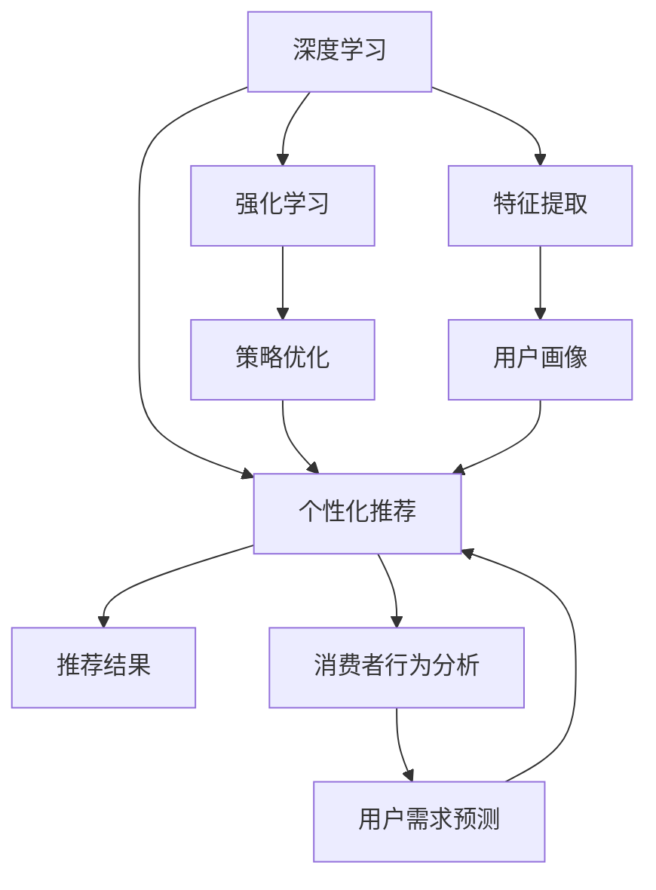
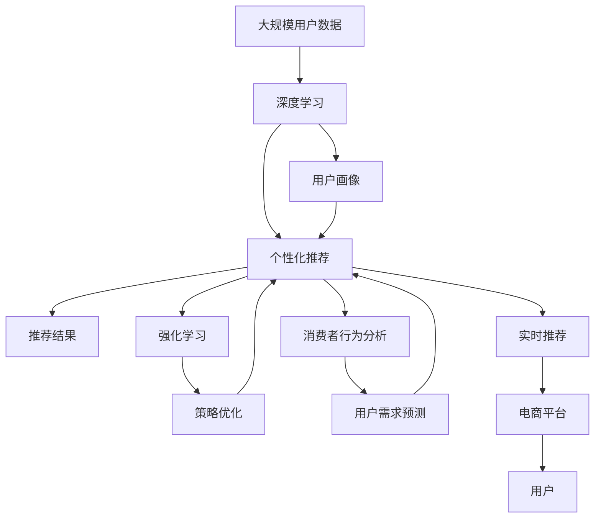

                 

# AI在个性化购物中的最新应用

> 关键词：个性化推荐系统、深度学习、强化学习、消费者行为分析、用户画像、购物体验优化

## 1. 背景介绍

在数字经济时代，电子商务已成为消费者购物的主要渠道之一。然而，面对海量的商品信息和不断变化的消费需求，如何提升购物体验、优化决策过程、促进用户忠诚度，成为电商平台和商家需要解决的重要问题。AI技术的蓬勃发展，尤其是深度学习和强化学习等算法的应用，为个性化购物提供了新的解决方案。

### 1.1 问题由来

个性化购物的核心在于满足消费者多样化和个性化的需求。过去，电商平台主要依靠推荐算法根据用户历史行为和兴趣进行商品推荐，但这种推荐方式存在以下问题：

- **用户数据单一**：历史行为和兴趣只能反映用户的部分需求，无法全面了解用户的真实偏好。
- **推荐结果单一**：推荐算法往往只考虑商品的相关性，忽视了用户的多样化需求。
- **用户体验不足**：推荐算法未能考虑到用户对于商品情感、背景和场景等因素的考量。

因此，如何构建一个更全面、多样化和智能的个性化购物体验，成为了电商领域亟需解决的关键问题。

### 1.2 问题核心关键点

AI在个性化购物中的应用，主要包括两个方面：

1. **深度学习和强化学习**：通过深度学习模型对用户行为数据进行建模，提取用户特征，并结合强化学习算法进行动态调整，优化推荐结果。
2. **消费者行为分析**：利用AI技术分析用户行为数据，预测用户需求，提升推荐准确性。

## 2. 核心概念与联系

### 2.1 核心概念概述

为了更好地理解AI在个性化购物中的应用，本节将介绍几个关键概念：

- **个性化推荐系统**：利用AI技术对用户历史行为和兴趣进行建模，预测用户可能感兴趣的物品，并将其推荐给用户。
- **深度学习**：一种基于神经网络的机器学习方法，能够通过大量数据自动提取特征，并自动进行分类、回归等任务。
- **强化学习**：通过与环境的交互，智能体在试错中不断调整策略，以最大化累积奖励。
- **消费者行为分析**：利用AI技术分析用户行为数据，了解用户的真实需求和偏好，辅助个性化推荐和用户画像构建。
- **用户画像**：基于用户行为数据和背景信息构建的描述用户特征的模型，用于指导个性化推荐和营销策略。

这些概念之间存在紧密联系，共同构成了个性化购物的AI技术框架。

### 2.2 概念间的关系

这些核心概念之间的逻辑关系可以通过以下Mermaid流程图来展示：



这个流程图展示了深度学习、强化学习和消费者行为分析在个性化购物中的应用：

1. 深度学习用于提取用户行为特征，构建用户画像。
2. 个性化推荐系统基于用户画像和行为特征，生成推荐结果。
3. 强化学习用于优化推荐策略，提升推荐效果。
4. 消费者行为分析用于预测用户需求，进一步优化推荐。

这些概念共同构成了个性化购物的AI技术框架，使得电商平台能够更精准地推荐商品，提升用户体验和满意度。

### 2.3 核心概念的整体架构

最后，我们用一个综合的流程图来展示这些核心概念在大规模个性化购物中的整体架构：



这个综合流程图展示了从数据收集、特征提取、个性化推荐、策略优化到实时推荐的全过程。大数据、深度学习和强化学习等AI技术的应用，使得电商平台能够更精准地推荐商品，提升用户体验和满意度。

## 3. 核心算法原理 & 具体操作步骤
### 3.1 算法原理概述

AI在个性化购物中的应用主要基于深度学习和强化学习的原理。

**深度学习原理**：通过神经网络模型对用户行为数据进行建模，提取用户特征，并通过反向传播算法不断优化模型参数，提升特征提取能力。

**强化学习原理**：通过与环境的交互，智能体在试错中不断调整策略，以最大化累积奖励。在个性化购物中，策略即为推荐算法，奖励即为用户的满意度。

### 3.2 算法步骤详解

以下是AI在个性化购物中的核心算法步骤：

1. **数据收集与预处理**：收集用户行为数据，包括浏览记录、购买历史、评价反馈等，进行数据清洗和标准化处理。

2. **特征提取与用户画像构建**：利用深度学习模型对用户行为数据进行建模，提取用户特征，构建用户画像。

3. **个性化推荐**：基于用户画像和行为特征，生成推荐结果。使用协同过滤、内容推荐、基于规则等方法，结合用户反馈进行动态调整。

4. **消费者行为分析**：利用AI技术分析用户行为数据，了解用户需求和偏好，预测用户行为。

5. **强化学习策略优化**：通过强化学习算法不断调整推荐策略，提升推荐效果。使用Q-learning、SARSA等算法，结合用户满意度等指标进行策略优化。

6. **实时推荐与反馈循环**：实时获取用户反馈，根据反馈数据调整推荐策略，形成反馈循环，不断优化推荐效果。

### 3.3 算法优缺点

AI在个性化购物中的应用具有以下优点：

1. **提升推荐效果**：通过深度学习和强化学习技术，能够更全面、精准地理解用户需求和行为，提升推荐效果。
2. **动态调整**：能够根据用户反馈实时调整推荐策略，优化推荐结果。
3. **跨平台一致性**：能够在多个平台和渠道上保持一致的推荐体验，提升用户粘性。

同时，该方法也存在一定的局限性：

1. **数据依赖性高**：需要大量用户行为数据进行模型训练和优化，数据收集和预处理成本高。
2. **模型复杂性**：深度学习模型参数量较大，需要较强的计算资源和存储空间。
3. **隐私问题**：用户行为数据的收集和处理需要符合隐私保护法规，确保用户数据安全。
4. **技术门槛高**：AI技术的应用需要高水平的技术支持和经验积累，对团队技术要求较高。

尽管存在这些局限性，但AI技术在个性化购物中的应用前景广阔，已经成为电商平台提升用户体验的重要手段。

### 3.4 算法应用领域

AI在个性化购物中的应用已经广泛覆盖了以下领域：

- **电商推荐系统**：基于深度学习和强化学习，生成个性化推荐结果，提升用户体验和满意度。
- **内容推荐平台**：在视频、音乐等平台，利用AI技术生成内容推荐列表，提升用户参与度和粘性。
- **用户行为分析**：利用AI技术分析用户行为数据，预测用户需求，辅助个性化推荐和用户画像构建。
- **跨平台推荐**：在多个平台和渠道上保持一致的推荐体验，提升用户粘性。
- **动态定价**：根据用户行为数据和市场需求，动态调整商品价格，提升销售效果。

## 4. 数学模型和公式 & 详细讲解  
### 4.1 数学模型构建

假设用户行为数据为 $D=\{x_1, x_2, ..., x_n\}$，其中每个 $x_i$ 表示用户的一次行为记录，包括浏览、点击、购买等。

定义用户画像特征为 $P=\{p_1, p_2, ..., p_m\}$，其中每个 $p_j$ 表示用户画像的一个维度，如年龄、性别、兴趣等。

推荐系统的目标是最小化用户满意度的负对数似然，即：

$$
\min_{\theta} -\frac{1}{N}\sum_{i=1}^N \log p(y_i|x_i, \theta)
$$

其中 $y_i$ 表示用户对于推荐结果的满意度，$p(y_i|x_i, \theta)$ 表示用户对于推荐结果的预测概率，$\theta$ 表示模型的参数。

### 4.2 公式推导过程

以协同过滤算法为例，假设推荐系统有 $M$ 个物品，用户有 $U$ 个。用户 $u$ 对物品 $i$ 的评分表示为 $r_{ui}$。协同过滤算法的目标是最小化用户评分和模型预测评分的差异：

$$
\min_{\theta} \sum_{i=1}^M \sum_{u=1}^U (r_{ui} - p(u_i|u, \theta))^2
$$

其中 $p(u_i|u, \theta)$ 表示用户 $u$ 对物品 $i$ 的预测评分。使用矩阵分解的方法，可以将用户-物品评分矩阵 $R$ 分解为用户特征矩阵 $U$ 和物品特征矩阵 $V$ 的乘积：

$$
R = U V^T
$$

因此，协同过滤算法可以表示为：

$$
p(u_i|u, \theta) = \sum_{j=1}^k u_j v_{ji}
$$

其中 $u_j$ 表示用户特征向量的第 $j$ 个元素，$v_{ji}$ 表示物品特征向量的第 $j$ 个元素，$k$ 表示特征向量的维度。

### 4.3 案例分析与讲解

以Amazon为例，利用协同过滤算法为用户生成个性化推荐。首先，收集用户的历史行为数据，包括浏览、点击、购买等记录。利用深度学习模型对用户行为数据进行建模，提取用户特征。然后，利用协同过滤算法生成个性化推荐结果。最后，通过用户反馈数据对模型进行动态调整，不断优化推荐效果。

## 5. 项目实践：代码实例和详细解释说明
### 5.1 开发环境搭建

在进行AI在个性化购物中的应用实践前，我们需要准备好开发环境。以下是使用Python进行TensorFlow开发的环境配置流程：

1. 安装Anaconda：从官网下载并安装Anaconda，用于创建独立的Python环境。

2. 创建并激活虚拟环境：
```bash
conda create -n tf-env python=3.8 
conda activate tf-env
```

3. 安装TensorFlow：根据CUDA版本，从官网获取对应的安装命令。例如：
```bash
conda install tensorflow -c pytorch -c conda-forge
```

4. 安装各类工具包：
```bash
pip install numpy pandas scikit-learn matplotlib tqdm jupyter notebook ipython
```

完成上述步骤后，即可在`tf-env`环境中开始AI在个性化购物中的应用实践。

### 5.2 源代码详细实现

这里我们以Amazon的推荐系统为例，给出使用TensorFlow进行协同过滤算法实现的PyTorch代码实现。

首先，定义协同过滤算法的损失函数：

```python
import tensorflow as tf

def loss_function(y_true, y_pred):
    return tf.reduce_mean(tf.square(y_true - y_pred))
```

然后，定义协同过滤算法的模型：

```python
class CollaborativeFiltering(tf.keras.Model):
    def __init__(self, n_users, n_items, n_factors):
        super(CollaborativeFiltering, self).__init__()
        self.user_factor = tf.keras.layers.Dense(n_factors, input_shape=(n_users, 1))
        self.item_factor = tf.keras.layers.Dense(n_factors, input_shape=(n_items, 1))
        
    def call(self, inputs):
        user_id, item_id = inputs
        user_factor = self.user_factor(user_id)
        item_factor = self.item_factor(item_id)
        return tf.reduce_sum(user_factor * item_factor, axis=1)
```

接着，定义数据处理函数：

```python
def load_data():
    user_id = np.random.randint(0, 10000, size=(10000, 1))
    item_id = np.random.randint(0, 1000, size=(10000, 1))
    rating = np.random.normal(3, 0.5, size=(10000, 1))
    return user_id, item_id, rating
```

最后，启动模型训练：

```python
def train_model():
    user_id, item_id, rating = load_data()
    user_id = tf.keras.utils.to_categorical(user_id, num_classes=10000)
    item_id = tf.keras.utils.to_categorical(item_id, num_classes=1000)
    
    model = CollaborativeFiltering(n_users=10000, n_items=1000, n_factors=10)
    optimizer = tf.keras.optimizers.Adam(learning_rate=0.001)
    
    for epoch in range(100):
        with tf.GradientTape() as tape:
            predictions = model([user_id, item_id])
            loss = loss_function(rating, predictions)
        gradients = tape.gradient(loss, model.trainable_variables)
        optimizer.apply_gradients(zip(gradients, model.trainable_variables))
    
    return model
```

以上就是使用TensorFlow实现协同过滤算法的完整代码。可以看到，TensorFlow封装了大量的高级API，使得模型构建和训练变得简单高效。

### 5.3 代码解读与分析

让我们再详细解读一下关键代码的实现细节：

**协同过滤模型定义**：
- 利用 `tf.keras.Model` 定义一个深度学习模型，包含用户特征向量和物品特征向量的乘积，得到预测评分。
- 使用 `tf.keras.layers.Dense` 层定义用户和物品的特征向量，初始化维度为 $n_{factors}$。

**损失函数定义**：
- 利用 `tf.reduce_mean` 计算损失函数的平均值，即平方差值的平均。
- 使用 `tf.square` 计算预测评分和真实评分的平方差。

**数据处理函数**：
- 生成随机用户ID和物品ID，以及随机评分。
- 使用 `tf.keras.utils.to_categorical` 函数将ID转换为独热编码，方便输入模型。

**模型训练**：
- 在每个epoch中，将用户ID和物品ID输入模型，得到预测评分，计算损失函数。
- 使用 `tf.GradientTape` 计算梯度，使用 `tf.keras.optimizers.Adam` 优化器更新模型参数。

## 6. 实际应用场景
### 6.1 智能推荐系统

AI在个性化购物中的应用最典型的场景是智能推荐系统。智能推荐系统通过分析用户行为数据，构建用户画像，生成个性化推荐结果，提升用户体验和满意度。

以Amazon为例，其推荐系统通过协同过滤算法、深度学习模型、强化学习算法等多层技术，实现了跨平台、动态调整、实时推荐等功能，显著提升了用户的购物体验和满意度。

### 6.2 消费者行为分析

AI在个性化购物中的应用还包括消费者行为分析。通过分析用户行为数据，电商平台可以了解用户的真实需求和偏好，预测用户行为，优化推荐结果。

以淘宝为例，其消费者行为分析系统通过深度学习模型和强化学习算法，分析用户点击、浏览、购买等行为数据，预测用户购买意向，生成个性化推荐结果，提高了推荐准确性。

### 6.3 动态定价

AI在个性化购物中的应用还包括动态定价。通过分析用户行为数据和市场需求，电商平台可以动态调整商品价格，提升销售效果。

以携程为例，其动态定价系统通过机器学习模型分析用户搜索行为和市场竞争情况，实时调整机票、酒店等商品价格，提高了销售转化率和用户满意度。

### 6.4 未来应用展望

随着AI技术的不断进步，个性化购物的应用场景将会更加广泛，技术手段也将更加多样。

1. **多模态融合**：未来推荐系统将更多地融合图像、视频、语音等多模态数据，提升推荐效果。例如，视频网站可以根据用户观看视频的行为数据，生成个性化推荐。
2. **跨平台协同**：未来的推荐系统将能够在不同平台和渠道上保持一致的推荐体验，提升用户粘性。例如，用户在淘宝购物时，可以在抖音上看到相关推荐。
3. **用户情感分析**：未来的推荐系统将更多地利用自然语言处理技术，分析用户情感、评价等文本数据，提升推荐准确性。例如，电商平台可以根据用户评价中的情感倾向，生成个性化推荐。

## 7. 工具和资源推荐
### 7.1 学习资源推荐

为了帮助开发者系统掌握AI在个性化购物中的应用，这里推荐一些优质的学习资源：

1. 《深度学习》系列书籍：由吴恩达教授所著，深入浅出地介绍了深度学习的原理和应用，是入门AI技术的经典教材。
2. 《强化学习》系列书籍：由Richard S. Sutton和Andrew G. Barto所著，全面介绍了强化学习的原理和算法，是AI领域的经典教材。
3. Coursera《深度学习专项课程》：斯坦福大学开设的深度学习课程，涵盖深度学习的基础理论和实践技能。
4. Udacity《强化学习纳米学位》：面向业界工程师的强化学习课程，涵盖强化学习的理论、算法和实践。
5. Google AI Blog：谷歌AI团队定期发布的博客文章，涵盖深度学习、强化学习、自然语言处理等前沿技术。

通过对这些资源的学习实践，相信你一定能够快速掌握AI在个性化购物中的应用，并用于解决实际的商业问题。

### 7.2 开发工具推荐

高效的开发离不开优秀的工具支持。以下是几款用于AI在个性化购物中的应用开发的常用工具：

1. TensorFlow：由Google主导开发的开源深度学习框架，生产部署方便，适合大规模工程应用。
2. PyTorch：基于Python的开源深度学习框架，灵活动态的计算图，适合快速迭代研究。
3. Keras：基于TensorFlow的高级API，提供简洁的接口，方便快速原型开发。
4. Weights & Biases：模型训练的实验跟踪工具，可以记录和可视化模型训练过程中的各项指标，方便对比和调优。
5. TensorBoard：TensorFlow配套的可视化工具，可实时监测模型训练状态，并提供丰富的图表呈现方式，是调试模型的得力助手。

合理利用这些工具，可以显著提升AI在个性化购物中的应用开发效率，加快创新迭代的步伐。

### 7.3 相关论文推荐

AI在个性化购物中的应用源于学界的持续研究。以下是几篇奠基性的相关论文，推荐阅读：

1. "Collaborative Filtering for Implicit Feedback Datasets"：Hu和Yan提出的协同过滤算法，详细介绍了协同过滤的基本原理和实现方法。
2. "Deep Learning with Gaussian Processes"：Rasmussen和Williams提出的深度学习与高斯过程结合的方法，用于模型不确定性建模和推荐系统。
3. "Adaptive Computation Time for Recurrent Neural Networks"：Bahdanau等人提出的自适应计算时间（AdaCT），用于优化RNN模型，提升推荐效果。
4. "A Survey on Deep Learning for Recommendation Systems"：Wu等人总结了深度学习在推荐系统中的应用，涵盖协同过滤、深度学习、强化学习等多个方向。
5. "A Comprehensive Survey on Multi-view Learning for Recommendation Systems"：Zhou等人总结了多视图学习在推荐系统中的应用，涵盖图像、文本、时间等不同视图数据的融合。

这些论文代表了大规模个性化购物中AI技术的发展脉络。通过学习这些前沿成果，可以帮助研究者把握学科前进方向，激发更多的创新灵感。

除上述资源外，还有一些值得关注的前沿资源，帮助开发者紧跟AI在个性化购物中的应用技术的最新进展，例如：

1. arXiv论文预印本：人工智能领域最新研究成果的发布平台，包括大量尚未发表的前沿工作，学习前沿技术的必读资源。
2. 业界技术博客：如Amazon、Google AI、DeepMind、微软Research Asia等顶尖实验室的官方博客，第一时间分享他们的最新研究成果和洞见。
3. 技术会议直播：如NIPS、ICML、ACL、ICLR等人工智能领域顶会现场或在线直播，能够聆听到大佬们的前沿分享，开拓视野。
4. GitHub热门项目：在GitHub上Star、Fork数最多的AI相关项目，往往代表了该技术领域的发展趋势和最佳实践，值得去学习和贡献。
5. 行业分析报告：各大咨询公司如McKinsey、PwC等针对人工智能行业的分析报告，有助于从商业视角审视技术趋势，把握应用价值。

总之，对于AI在个性化购物中的应用的学习和实践，需要开发者保持开放的心态和持续学习的意愿。多关注前沿资讯，多动手实践，多思考总结，必将收获满满的成长收益。

## 8. 总结：未来发展趋势与挑战

### 8.1 总结

本文对AI在个性化购物中的应用进行了全面系统的介绍。首先阐述了个性化购物的背景和AI技术的应用背景，明确了AI技术在个性化购物中的独特价值。其次，从原理到实践，详细讲解了协同过滤算法、深度学习、强化学习等核心算法，给出了模型实现的代码实例。同时，本文还广泛探讨了AI在个性化购物中的实际应用场景，展示了其广泛的应用前景。此外，本文精选了AI在个性化购物中的应用相关的学习资源，力求为读者提供全方位的技术指引。

通过本文的系统梳理，可以看到，AI在个性化购物中的应用已经成为电商平台提升用户体验的重要手段。AI技术在个性化购物中的应用前景广阔，已经成为电商平台提升用户体验的重要手段。未来，伴随AI技术的不断进步，个性化购物的应用场景将会更加广泛，技术手段也将更加多样。

### 8.2 未来发展趋势

展望未来，AI在个性化购物中的应用将呈现以下几个发展趋势：

1. **多模态融合**：未来的推荐系统将更多地融合图像、视频、语音等多模态数据，提升推荐效果。例如，视频网站可以根据用户观看视频的行为数据，生成个性化推荐。
2. **跨平台协同**：未来的推荐系统将能够在不同平台和渠道上保持一致的推荐体验，提升用户粘性。例如，用户在淘宝购物时，可以在抖音上看到相关推荐。
3. **用户情感分析**：未来的推荐系统将更多地利用自然语言处理技术，分析用户情感、评价等文本数据，提升推荐准确性。例如，电商平台可以根据用户评价中的情感倾向，生成个性化推荐。
4. **实时推荐与动态调整**：未来的推荐系统将更加注重实时推荐和动态调整，根据用户反馈和市场变化，不断优化推荐结果。例如，电商平台可以根据用户实时反馈数据，动态调整推荐策略。
5. **智能客服与个性化营销**：未来的电商平台将更多地利用AI技术提升客服和营销效果。例如，电商平台可以基于用户行为数据，生成个性化营销信息和客服响应，提升用户体验和满意度。

### 8.3 面临的挑战

尽管AI在个性化购物中的应用取得了显著成效，但在迈向更加智能化、普适化应用的过程中，仍面临诸多挑战：

1. **数据隐私问题**：用户行为数据的收集和处理需要符合隐私保护法规，确保用户数据安全。
2. **模型复杂性**：AI模型的参数量较大，需要较强的计算资源和存储空间。
3. **技术门槛高**：AI技术的应用需要高水平的技术支持和经验积累，对团队技术要求较高。
4. **用户接受度**：用户对于AI推荐的接受度不一，一些用户可能更倾向于传统推荐方式。
5. **算法公平性**：AI推荐算法可能存在偏见，需要考虑算法公平性问题。

尽管存在这些挑战，但AI在个性化购物中的应用前景广阔，已经成为电商平台提升用户体验的重要手段。

### 8.4 未来突破

面对AI在个性化购物中面临的种种挑战，未来的研究需要在以下几个方面寻求新的突破：

1. **多模态数据融合**：利用图像、视频、语音等多模态数据，提升推荐效果。例如，视频网站可以根据用户观看视频的行为数据，生成个性化推荐。
2. **跨平台协同**：在不同平台和渠道上保持一致的推荐体验，提升用户粘性。例如，用户在淘宝购物时，可以在抖音上看到相关推荐。
3. **用户情感分析**：利用自然语言处理技术，分析用户情感、评价等文本数据，提升推荐准确性。例如，电商平台可以根据用户评价中的情感倾向，生成个性化推荐。
4. **实时推荐与动态调整**：注重实时推荐和动态调整，根据用户反馈和市场变化，不断优化推荐结果。例如，电商平台可以根据用户实时反馈数据，动态调整推荐策略。
5. **智能客服与个性化营销**：利用AI技术提升客服和营销效果。例如，电商平台可以基于用户行为数据，生成个性化营销信息和客服响应，提升用户体验和满意度。

这些研究方向的探索，必将引领AI在个性化购物中的应用技术迈向更高的台阶，为构建人机协同的智能系统铺平道路。面向未来，AI在个性化购物中的应用还需要与其他人工智能技术进行更深入的融合，如知识表示、因果推理、强化学习等，多路径协同发力，共同推动自然语言理解和智能交互系统的进步。只有勇于创新、敢于突破，才能不断拓展语言模型的边界，让智能技术更好地造福人类社会。

## 9. 附录：常见问题与解答

**Q1：什么是协同过滤算法？**

A: 协同过滤算法是一种基于用户-物品评分矩阵的推荐算法。通过分析用户和物品之间的相似度，生成推荐结果。其中，用户-物品评分矩阵可以通过用户行为数据构建，例如浏览、点击、购买等记录。

**Q2：如何提高推荐系统的准确性？**

A: 提高推荐系统的准确性可以从以下几个方面入手：
1. 数据质量：确保数据的准确性和完备性，避免噪声和缺失。
2. 特征工程：提取有效的用户和物品特征，提升模型的泛化能力。
3. 模型优化：选择合适的推荐算法和模型结构，并进行参数调优。
4. 实时更新：实时获取用户反馈和市场变化，动态调整推荐策略。

**Q3：协同过滤算法的主要局限性有哪些？**

A: 协同过滤算法的主要局限性包括：
1. 数据稀疏性：用户-物品评分矩阵可能存在大量缺失值

