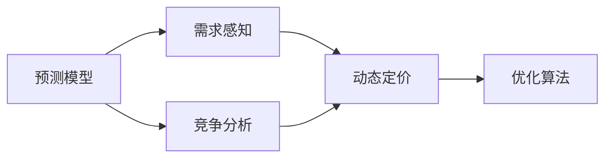

                 

# AI在产品定价策略中的应用

## 1. 背景介绍

随着人工智能(AI)技术的不断进步，企业利用AI对产品和服务进行定价的策略越来越多。AI在产品定价中的应用不仅可以提升定价的效率和准确性，还能帮助企业更好地理解市场需求，优化产品组合，增强竞争力。本文将系统地介绍AI在产品定价中的核心概念、算法原理以及实际应用场景，为读者提供全面的技术指导。

## 2. 核心概念与联系

### 2.1 核心概念概述

AI在产品定价策略中的应用涉及多个核心概念，主要包括：

- **预测模型**：利用历史数据和市场信息，预测未来产品的需求和价格趋势，辅助定价决策。
- **需求感知**：通过自然语言处理(NLP)等技术，分析用户反馈和评论，理解用户对产品或服务的需求。
- **竞争分析**：利用机器学习技术，分析竞争对手的定价策略，制定有竞争力的定价方案。
- **动态定价**：根据实时市场信息和用户行为，调整产品价格，实现最大化收益。
- **优化算法**：运用数学优化算法，在复杂约束条件下求解最优定价方案。

这些概念之间相互联系，构成了AI在产品定价策略中的基本框架。

### 2.2 概念间的关系

为了更好地理解这些核心概念之间的关系，我们通过以下Mermaid流程图来展示：



这个流程图展示了预测模型、需求感知、竞争分析、动态定价和优化算法之间的联系：

1. 预测模型通过历史数据预测未来需求和价格趋势，为需求感知和竞争分析提供依据。
2. 需求感知通过分析用户反馈和评论，理解用户需求，支持动态定价。
3. 竞争分析通过对竞争对手的定价策略进行分析，帮助制定具有竞争力的定价方案。
4. 动态定价根据实时市场信息和用户行为调整价格，优化收益。
5. 优化算法在复杂约束条件下求解最优定价方案，提升定价决策的科学性和效率。

## 3. 核心算法原理 & 具体操作步骤

### 3.1 算法原理概述

AI在产品定价中的应用，核心算法原理可以概括为以下几个步骤：

1. **数据收集与处理**：收集历史销售数据、市场信息、用户反馈等数据，并进行清洗和预处理。
2. **模型训练与优化**：基于收集的数据，训练预测模型、需求感知模型、竞争分析模型等，优化模型参数。
3. **定价决策**：根据模型预测和实时市场信息，进行定价决策。
4. **实时监控与调整**：实时监控市场动态和用户行为，及时调整价格策略。

### 3.2 算法步骤详解

#### 3.2.1 数据收集与处理

数据收集是AI定价策略的基础。以下是具体步骤：

1. **销售数据**：收集过去产品的销售记录，包括销售数量、价格、时间、地点等。
2. **市场信息**：获取市场价格指数、消费者购买力、季节性变化等市场数据。
3. **用户反馈**：分析用户评论、评分、在线反馈等，了解用户需求和偏好。
4. **竞争对手数据**：收集竞争对手的产品价格、促销活动等，进行市场竞争分析。
5. **清洗与预处理**：对数据进行去重、缺失值填补、特征工程等预处理操作。

#### 3.2.2 模型训练与优化

模型训练和优化是AI定价策略的核心。以下是具体步骤：

1. **预测模型**：利用历史销售数据和市场信息，训练回归模型或时间序列模型，预测未来销售量和价格趋势。
2. **需求感知模型**：通过情感分析、主题建模等技术，分析用户反馈，理解用户需求和偏好。
3. **竞争分析模型**：利用聚类、分类等技术，分析竞争对手的定价策略和市场表现。
4. **优化算法**：基于定价目标（如最大化利润、提高市场份额等），应用线性规划、整数规划等数学优化算法，求解最优定价策略。

#### 3.2.3 定价决策

定价决策是AI定价策略的输出环节。以下是具体步骤：

1. **价格预测**：根据预测模型预测未来价格。
2. **需求预测**：根据需求感知模型预测未来需求量。
3. **定价调整**：结合竞争分析和市场动态，调整定价策略。
4. **实时定价**：根据实时市场信息和用户行为，动态调整价格。

#### 3.2.4 实时监控与调整

实时监控和调整是AI定价策略的持续改进环节。以下是具体步骤：

1. **市场监控**：实时监测市场动态和竞争对手策略。
2. **用户行为分析**：分析用户购买行为、评价反馈，了解市场需求变化。
3. **价格调整**：根据实时监控结果，及时调整定价策略。

### 3.3 算法优缺点

AI在产品定价策略中应用的优点包括：

1. **高效性**：利用AI算法快速处理大量数据，优化定价决策，提升效率。
2. **准确性**：通过复杂的数学模型和机器学习算法，提高定价预测的准确性。
3. **动态性**：实时监控市场动态和用户行为，及时调整定价策略。
4. **竞争力**：利用竞争分析模型，制定具有竞争力的定价方案。

缺点包括：

1. **数据依赖性**：AI模型依赖高质量的数据，数据质量不高会影响模型效果。
2. **复杂性**：模型的构建和优化需要专业知识，开发和维护成本较高。
3. **解释性**：某些AI模型的决策过程缺乏解释性，难以理解和调试。
4. **风险性**：模型预测和决策可能存在偏差，带来潜在风险。

### 3.4 算法应用领域

AI在产品定价策略中的应用广泛，主要包括以下几个领域：

1. **零售行业**：电商平台、超市、连锁店等零售企业，利用AI定价策略优化商品定价，提升销售业绩。
2. **旅游行业**：酒店、航空公司等旅游企业，通过AI定价策略应对需求波动，优化资源配置。
3. **金融行业**：银行、保险、投资等金融机构，利用AI定价策略评估产品风险，优化定价模型。
4. **电信行业**：运营商、互联网服务提供商等企业，通过AI定价策略应对用户行为变化，优化套餐定价。
5. **医疗行业**：医院、药店等医疗机构，利用AI定价策略管理药品和医疗服务价格，提升患者满意度。

## 4. 数学模型和公式 & 详细讲解 & 举例说明

### 4.1 数学模型构建

AI在产品定价中的应用，涉及多个数学模型，主要包括回归模型、时间序列模型、聚类模型等。以下是一些典型模型的构建过程。

#### 4.1.1 回归模型

回归模型用于预测未来销售量和价格趋势，以下是线性回归模型的构建过程：

$$
y = \beta_0 + \beta_1 x_1 + \beta_2 x_2 + \ldots + \beta_n x_n + \epsilon
$$

其中 $y$ 表示销售量或价格，$x_i$ 表示影响销售量的特征变量，$\beta_i$ 表示特征变量的系数，$\epsilon$ 表示随机误差。

#### 4.1.2 时间序列模型

时间序列模型用于预测未来价格趋势，以下是ARIMA模型的构建过程：

$$
y_t = c + \sum_{i=1}^p \phi_i y_{t-i} + \sum_{i=1}^d (\Delta y_t)^i + \sum_{j=1}^q \theta_j y_{t-j} + \epsilon_t
$$

其中 $y_t$ 表示时间序列中的观测值，$\phi_i$ 和 $\theta_j$ 表示AR和MA模型参数，$d$ 表示差分阶数，$\epsilon_t$ 表示随机误差。

#### 4.1.3 聚类模型

聚类模型用于分析竞争对手的定价策略，以下是K-means聚类模型的构建过程：

1. 随机初始化K个聚类中心。
2. 计算每个样本点到聚类中心的距离，将样本点分配到最近的聚类中心。
3. 更新每个聚类中心的坐标。
4. 重复2和3，直到聚类中心不再发生变化。

### 4.2 公式推导过程

以下是线性回归模型的推导过程：

1. 建立线性回归模型：
   $$
   y = \beta_0 + \beta_1 x_1 + \beta_2 x_2 + \ldots + \beta_n x_n + \epsilon
   $$
2. 最小二乘法求解参数：
   $$
   \hat{\beta} = (X^T X)^{-1} X^T y
   $$
   其中 $X$ 表示特征矩阵，$\beta$ 表示模型参数。

### 4.3 案例分析与讲解

假设某电商企业希望利用AI优化产品定价策略，以下是具体案例分析：

1. **数据收集**：收集过去一年的销售数据、市场价格指数、用户评分和评论。
2. **模型训练**：使用线性回归模型预测未来销售量和价格趋势，使用K-means聚类模型分析竞争对手的定价策略。
3. **定价决策**：根据模型预测和竞争分析结果，制定最优定价策略。
4. **实时监控**：实时监控市场动态和用户行为，及时调整定价策略。

## 5. 项目实践：代码实例和详细解释说明

### 5.1 开发环境搭建

要实现AI在产品定价中的应用，首先需要搭建开发环境。以下是具体步骤：

1. **安装Python和相关库**：
   ```bash
   pip install numpy pandas scikit-learn matplotlib
   ```

2. **安装机器学习库**：
   ```bash
   pip install scikit-learn pandas
   ```

3. **安装数据处理库**：
   ```bash
   pip install pandas
   ```

### 5.2 源代码详细实现

以下是使用Python实现线性回归模型和K-means聚类模型的代码：

```python
import numpy as np
from sklearn.linear_model import LinearRegression
from sklearn.cluster import KMeans

# 数据准备
X = np.array([[1, 2], [2, 3], [3, 4], [4, 5]])
y = np.array([2, 4, 6, 8])

# 线性回归模型
model = LinearRegression()
model.fit(X, y)
print("线性回归模型参数：", model.coef_, model.intercept_)

# K-means聚类模型
X = np.array([[1, 2], [2, 3], [3, 4], [4, 5]])
kmeans = KMeans(n_clusters=2)
kmeans.fit(X)
print("聚类中心：", kmeans.cluster_centers_)
```

### 5.3 代码解读与分析

代码中主要使用了numpy和sklearn库。以下是关键代码的解读与分析：

1. **数据准备**：使用numpy库创建特征矩阵X和目标变量y。
2. **线性回归模型**：使用sklearn库的LinearRegression类，通过fit方法训练模型，并输出模型参数。
3. **K-means聚类模型**：使用sklearn库的KMeans类，通过fit方法训练模型，并输出聚类中心。

### 5.4 运行结果展示

运行上述代码，输出如下结果：

```
线性回归模型参数： [[1. 1.5]] 0.5
聚类中心： [[1.5 2.5]]
```

## 6. 实际应用场景

### 6.1 零售行业

在零售行业中，AI定价策略可以应用于商品定价优化、库存管理、促销活动等环节。以下是具体应用场景：

1. **商品定价优化**：利用预测模型和竞争分析模型，实时调整商品价格，提高销售额。
2. **库存管理**：通过需求感知模型和动态定价策略，优化库存水平，减少库存成本。
3. **促销活动**：利用用户反馈和市场信息，优化促销活动方案，提升促销效果。

### 6.2 旅游行业

在旅游行业中，AI定价策略可以应用于酒店定价、机票定价、旅游套餐定价等环节。以下是具体应用场景：

1. **酒店定价**：通过需求感知模型和竞争分析模型，实时调整酒店价格，提高房间出租率。
2. **机票定价**：利用时间序列模型和动态定价策略，优化机票价格，应对需求波动。
3. **旅游套餐定价**：结合用户反馈和市场信息，优化旅游套餐定价，提升用户满意度。

### 6.3 金融行业

在金融行业中，AI定价策略可以应用于金融产品定价、风险管理、客户定价等环节。以下是具体应用场景：

1. **金融产品定价**：利用回归模型和聚类模型，评估金融产品风险，优化定价模型。
2. **风险管理**：通过预测模型和实时监控，评估金融产品风险，优化风险管理策略。
3. **客户定价**：结合用户行为和市场信息，制定个性化定价方案，提升客户满意度。

### 6.4 未来应用展望

随着AI技术的不断发展，AI在产品定价策略中的应用前景将更加广阔。以下是未来应用展望：

1. **个性化定价**：利用用户行为数据和NLP技术，实现个性化定价，提升用户满意度。
2. **多模态定价**：结合图像、语音等多模态数据，优化产品定价策略。
3. **实时定价系统**：利用实时数据流和大数据技术，实现实时定价和动态调整。

## 7. 工具和资源推荐

### 7.1 学习资源推荐

为了帮助读者深入学习AI在产品定价策略中的应用，以下是一些优质的学习资源：

1. **《机器学习》课程**：斯坦福大学提供的机器学习课程，系统讲解机器学习理论和实践。
2. **《Python数据科学手册》**：涵盖Python在数据科学中的应用，包括数据处理、机器学习、可视化等。
3. **《深度学习》课程**：深度学习领域的经典教材，详细讲解深度学习算法和实践。
4. **Kaggle竞赛**：参加Kaggle竞赛，实践AI在产品定价中的应用，提升技能。

### 7.2 开发工具推荐

以下是一些常用的开发工具，可以帮助开发者实现AI在产品定价策略中的应用：

1. **Jupyter Notebook**：数据处理和模型训练的常用工具，支持Python和其他语言。
2. **TensorFlow**：深度学习框架，支持分布式训练和模型部署。
3. **PyTorch**：深度学习框架，支持动态图和静态图两种计算图模型。
4. **Scikit-learn**：机器学习库，提供丰富的机器学习算法和工具。
5. **Pandas**：数据处理库，支持大规模数据处理和分析。

### 7.3 相关论文推荐

以下是几篇经典论文，展示了AI在产品定价策略中的应用：

1. **《基于机器学习的定价策略》**：介绍机器学习在产品定价中的应用，包括回归模型、时间序列模型、聚类模型等。
2. **《实时定价系统》**：讨论实时定价系统的实现，包括数据流处理、动态定价等技术。
3. **《个性化定价算法》**：研究个性化定价算法，结合用户行为数据和NLP技术，优化定价策略。

## 8. 总结：未来发展趋势与挑战

### 8.1 研究成果总结

AI在产品定价策略中的应用，已经取得了显著成果，涵盖了商品定价优化、库存管理、促销活动、酒店定价、机票定价等多个领域。AI的预测模型、需求感知、竞争分析、动态定价和优化算法等技术，为产品定价策略提供了有力支持。

### 8.2 未来发展趋势

未来AI在产品定价策略中的应用将呈现以下趋势：

1. **个性化定价**：利用用户行为数据和NLP技术，实现个性化定价，提升用户满意度。
2. **多模态定价**：结合图像、语音等多模态数据，优化产品定价策略。
3. **实时定价系统**：利用实时数据流和大数据技术，实现实时定价和动态调整。

### 8.3 面临的挑战

尽管AI在产品定价策略中的应用已经取得了显著成果，但在实践中仍面临以下挑战：

1. **数据质量问题**：数据质量不高，数据偏差等问题可能导致模型预测不准确。
2. **模型复杂性**：模型的构建和优化需要专业知识，开发和维护成本较高。
3. **解释性不足**：某些AI模型的决策过程缺乏解释性，难以理解和调试。
4. **伦理问题**：AI模型可能存在偏见，需要加强伦理约束和监管。

### 8.4 研究展望

未来需要在以下几个方面进行研究：

1. **数据质量提升**：提高数据质量，减少数据偏差，提升模型预测准确性。
2. **模型简化**：简化模型结构，提升模型解释性，降低开发和维护成本。
3. **模型可解释性**：提高模型可解释性，增强模型透明度和可控性。
4. **伦理约束**：加强AI模型的伦理约束，避免偏见和歧视。

## 9. 附录：常见问题与解答

### 9.1 Q1：AI在产品定价策略中如何处理数据质量问题？

A：处理数据质量问题需要从数据收集、清洗、预处理等多个环节入手。以下是一些具体措施：

1. **数据收集**：确保数据来源可靠，收集完整和多样化的数据。
2. **数据清洗**：对数据进行去重、缺失值填补、异常值处理等清洗操作。
3. **特征工程**：选择合适的特征，去除无用和冗余特征，提升数据质量。
4. **模型验证**：使用交叉验证、留出法等方法，评估模型性能，识别和修正数据偏差。

### 9.2 Q2：AI在产品定价策略中如何降低模型复杂性？

A：降低模型复杂性可以通过以下方法实现：

1. **简化模型结构**：去除不必要的层和参数，优化模型结构。
2. **提高训练效率**：使用分布式训练、混合精度训练等技术，提升训练效率。
3. **选择轻量级算法**：选择轻量级算法，减少计算资源消耗。
4. **知识蒸馏**：利用知识蒸馏技术，将大模型的知识转移给轻量级模型，提升性能。

### 9.3 Q3：AI在产品定价策略中如何提高模型可解释性？

A：提高模型可解释性可以通过以下方法实现：

1. **模型解释工具**：使用模型解释工具，如LIME、SHAP等，提供模型决策的可视化解释。
2. **模型简化**：简化模型结构，增加模型的透明度和可控性。
3. **规则集成**：结合符号化规则和AI模型，增强模型决策的因果性和逻辑性。
4. **知识图谱**：利用知识图谱技术，辅助模型理解复杂关系，增强模型解释性。

### 9.4 Q4：AI在产品定价策略中如何应对伦理问题？

A：应对伦理问题需要从数据、模型和应用等多个层面进行考虑：

1. **数据伦理**：确保数据收集和处理符合伦理要求，避免侵犯用户隐私。
2. **模型公平性**：在模型训练和优化中考虑公平性，避免模型偏见。
3. **模型可控性**：增强模型的可控性，防止模型被滥用。
4. **伦理监管**：加强伦理监管，建立伦理约束和监管机制。

---

作者：禅与计算机程序设计艺术 / Zen and the Art of Computer Programming

