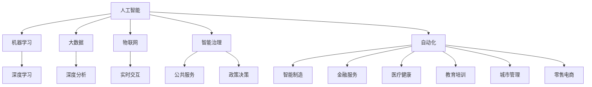

                 

# AI在社会中的作用与应用

> 关键词：人工智能, 社会影响, 伦理问题, 智能治理, 自动化, 机器学习, 大数据, 物联网

## 1. 背景介绍

### 1.1 问题的由来

人工智能（AI）作为21世纪最为重要的技术突破之一，其发展正在迅速改变着我们的生活方式、工作方式以及整个社会的运作模式。从深度学习、机器学习到自然语言处理、计算机视觉，AI技术在诸多领域取得了显著的成果，并广泛应用于各个行业，推动了产业升级和经济发展。然而，随着AI技术的广泛应用，也带来了诸多新的挑战和问题。如何在享受AI带来的便利的同时，有效应对这些挑战，是我们面临的重要课题。

### 1.2 核心问题

当前，AI在社会中的应用主要集中在以下几个方面：

1. **智能制造**：AI在制造业中的应用包括自动化生产线、智能仓储、物流优化、预测性维护等，极大提升了生产效率和产品质量。
2. **金融服务**：AI在金融领域主要用于风险管理、智能投顾、欺诈检测、信用评估等方面，提高了金融服务的准确性和效率。
3. **医疗健康**：AI在医疗领域的应用包括医学影像分析、个性化治疗、药物研发、健康管理等，提升了诊断和治疗的精度和效率。
4. **教育培训**：AI在教育领域主要应用于个性化学习、自动批改作业、智能答疑、学习内容推荐等方面，提高了教育质量和覆盖面。
5. **城市管理**：AI在城市管理中的应用包括交通流量优化、公共安全监控、垃圾分类、能源管理等，提升了城市管理的智能化水平。
6. **零售电商**：AI在零售电商中的应用包括客户行为分析、库存管理、推荐系统、无人零售等，提升了客户体验和运营效率。

这些应用展示了AI在各行各业的广泛影响，但同时也带来了一些关键问题，如就业结构变化、隐私安全、伦理道德、公平性等。这些问题需要在AI技术发展的同时得到充分关注和解决，才能确保AI技术的健康发展和社会整体的可持续发展。

## 2. 核心概念与联系

### 2.1 核心概念概述

为深入理解AI在社会中的作用与应用，本节将介绍几个关键概念及其相互联系：

- **人工智能（Artificial Intelligence, AI）**：通过算法和计算实现智能行为的机器或系统，包括机器学习、深度学习、自然语言处理、计算机视觉等技术。

- **智能治理（Smart Governance）**：利用AI技术优化公共服务和政策决策，提升政府治理效率和公正性。

- **自动化（Automation）**：指通过AI技术实现生产和服务流程的自动化，减少人工干预，提升效率和精度。

- **机器学习（Machine Learning, ML）**：一种利用数据和算法使机器能够从经验中学习的技术，主要包括监督学习、无监督学习和强化学习。

- **大数据（Big Data）**：指规模庞大、多样性丰富、快速变化的数据集，利用这些数据可以进行深度分析和预测。

- **物联网（Internet of Things, IoT）**：将各种物理设备连接至互联网，实现数据收集、处理和交互，以提升生活和工作效率。

- **社会影响（Social Impact）**：AI技术对社会各个方面的影响，包括就业、隐私、伦理、公平性等。

这些概念通过下面的Mermaid流程图展示了其相互联系：



### 2.2 概念间的关系

这些核心概念之间通过互连的网络关系展示了其相互作用和应用场景。以智能制造为例，AI通过机器学习和深度学习技术，利用大数据进行深度分析，优化生产流程和质量控制，实现自动化生产，并通过物联网技术实现实时交互和监控。在智能制造的基础上，AI还应用于金融服务、医疗健康、教育培训、城市管理、零售电商等多个领域，展示了AI技术在不同行业的广泛应用。

## 3. 核心算法原理 & 具体操作步骤

### 3.1 算法原理概述

AI在社会中的应用，本质上是通过算法和数据实现的。以深度学习为例，其核心原理是通过多层神经网络模型，对大量数据进行训练，学习数据的特征和规律，从而实现对未知数据的预测和决策。这一过程包括数据预处理、模型训练、模型评估和应用部署等步骤。

### 3.2 算法步骤详解

AI在社会中的具体应用步骤如下：

1. **数据准备**：收集和处理相关领域的原始数据，确保数据质量和多样性。
2. **模型选择**：根据应用场景选择合适的算法和模型，如深度学习、机器学习、自然语言处理等。
3. **模型训练**：使用准备好的数据对模型进行训练，调整模型参数，以提高模型的预测精度。
4. **模型评估**：对训练好的模型进行评估，检验其在实际应用中的性能和效果。
5. **应用部署**：将训练好的模型部署到实际应用环境中，进行实时数据处理和预测。

### 3.3 算法优缺点

AI在社会中的应用具有以下优点：

- **提升效率和精度**：通过自动化和智能决策，大大提升了生产和服务效率，减少了人为错误。
- **改善用户体验**：智能推荐、语音识别、自然语言处理等技术改善了用户交互体验。
- **优化资源配置**：通过数据分析和预测，优化资源配置，减少浪费和成本。

但同时也存在一些缺点：

- **就业结构变化**：AI自动化可能导致部分低技能岗位的消失，带来就业结构变化和社会不稳定。
- **隐私和安全问题**：AI系统需要处理大量个人数据，存在数据泄露和隐私侵害的风险。
- **伦理和道德问题**：AI决策的不透明性和偏见可能导致伦理和道德问题，影响社会公平。

### 3.4 算法应用领域

AI在社会中的应用领域非常广泛，以下是一些主要领域：

1. **智能制造**：AI在制造业中的应用包括自动化生产线、智能仓储、物流优化、预测性维护等，极大提升了生产效率和产品质量。
2. **金融服务**：AI在金融领域主要用于风险管理、智能投顾、欺诈检测、信用评估等方面，提高了金融服务的准确性和效率。
3. **医疗健康**：AI在医疗领域的应用包括医学影像分析、个性化治疗、药物研发、健康管理等，提升了诊断和治疗的精度和效率。
4. **教育培训**：AI在教育领域主要应用于个性化学习、自动批改作业、智能答疑、学习内容推荐等方面，提高了教育质量和覆盖面。
5. **城市管理**：AI在城市管理中的应用包括交通流量优化、公共安全监控、垃圾分类、能源管理等，提升了城市管理的智能化水平。
6. **零售电商**：AI在零售电商中的应用包括客户行为分析、库存管理、推荐系统、无人零售等，提升了客户体验和运营效率。

## 4. 数学模型和公式 & 详细讲解 & 举例说明

### 4.1 数学模型构建

AI在社会中的应用，涉及大量数据和复杂的算法模型。以下以深度学习为例，介绍其数学模型构建过程。

设输入数据为 $\mathbf{x} \in \mathbb{R}^d$，输出标签为 $y \in \{0, 1\}$。深度学习模型由多个神经网络层组成，每个层由权重 $\mathbf{w}_l$ 和偏置 $b_l$ 构成，其中 $l$ 表示层数。模型输出为 $\hat{y} = f(\mathbf{x}; \mathbf{w}, \mathbf{b})$。

模型的损失函数为交叉熵损失函数，定义如下：

$$
L(\hat{y}, y) = -y \log \hat{y} - (1-y) \log (1-\hat{y})
$$

在实际应用中，模型通过反向传播算法更新权重和偏置，以最小化损失函数：

$$
\min_{\mathbf{w}, \mathbf{b}} L(\hat{y}, y) = \frac{1}{N} \sum_{i=1}^N L(\hat{y}_i, y_i)
$$

### 4.2 公式推导过程

以下以深度学习中的多层感知器（Multilayer Perceptron, MLP）为例，推导其训练过程的数学表达式。

设深度学习模型由两层神经网络组成，第一层为输入层，第二层为输出层。输入数据 $\mathbf{x} \in \mathbb{R}^d$，权重矩阵 $\mathbf{W}_1 \in \mathbb{R}^{m \times d}$，偏置向量 $\mathbf{b}_1 \in \mathbb{R}^m$，隐藏层激活函数为 $f(\cdot)$，输出层激活函数为 $g(\cdot)$。

模型的前向传播过程如下：

$$
\mathbf{z}_1 = \mathbf{W}_1 \mathbf{x} + \mathbf{b}_1
$$

$$
\mathbf{a}_1 = f(\mathbf{z}_1)
$$

$$
\mathbf{z}_2 = \mathbf{W}_2 \mathbf{a}_1 + \mathbf{b}_2
$$

$$
\hat{y} = g(\mathbf{z}_2)
$$

其中，$\mathbf{z}_1$ 和 $\mathbf{z}_2$ 表示隐藏层和输出层的输入，$\mathbf{a}_1$ 表示隐藏层的输出，$\mathbf{W}_1$ 和 $\mathbf{W}_2$ 表示两个层的权重矩阵，$\mathbf{b}_1$ 和 $\mathbf{b}_2$ 表示两个层的偏置向量，$g(\cdot)$ 表示输出层的激活函数。

模型的损失函数为交叉熵损失函数：

$$
L(\hat{y}, y) = -y \log \hat{y} - (1-y) \log (1-\hat{y})
$$

模型的梯度计算如下：

$$
\frac{\partial L}{\partial \mathbf{W}_1} = \frac{\partial L}{\partial \mathbf{a}_1} \frac{\partial \mathbf{a}_1}{\partial \mathbf{z}_1} \mathbf{W}_1^T
$$

$$
\frac{\partial L}{\partial \mathbf{b}_1} = \frac{\partial L}{\partial \mathbf{a}_1}
$$

$$
\frac{\partial L}{\partial \mathbf{W}_2} = \frac{\partial L}{\partial \hat{y}} \frac{\partial \hat{y}}{\partial \mathbf{z}_2} \mathbf{a}_1^T
$$

$$
\frac{\partial L}{\partial \mathbf{b}_2} = \frac{\partial L}{\partial \hat{y}}
$$

其中，$\frac{\partial L}{\partial \mathbf{a}_1}$ 表示损失函数对隐藏层输出的梯度，$\frac{\partial \mathbf{a}_1}{\partial \mathbf{z}_1}$ 表示隐藏层激活函数的导数，$\frac{\partial \hat{y}}{\partial \mathbf{z}_2}$ 表示输出层激活函数的导数。

### 4.3 案例分析与讲解

以医疗健康领域为例，介绍AI在医学影像分析中的应用。在医学影像分析中，深度学习模型通常被用于识别和分类医学图像，如X光片、CT扫描等。以下是一个简单的医疗影像分类任务的例子：

假设我们有一组医学影像数据集 $\{(x_i, y_i)\}_{i=1}^N$，其中 $x_i$ 表示输入的医学影像，$y_i$ 表示对应的标签（如正常、肿瘤等）。使用卷积神经网络（Convolutional Neural Network, CNN）进行模型训练。

1. **数据预处理**：对原始医学影像进行预处理，如归一化、增强等，确保数据质量。
2. **模型选择**：选择适当的深度学习模型，如VGG、ResNet等，进行训练。
3. **模型训练**：使用训练集对模型进行训练，调整模型参数，以提高分类精度。
4. **模型评估**：使用测试集对训练好的模型进行评估，检验其性能。
5. **应用部署**：将训练好的模型部署到实际应用环境中，对新的医学影像进行分类预测。

## 5. 项目实践：代码实例和详细解释说明

### 5.1 开发环境搭建

在进行AI在社会中的应用实践前，我们需要准备好开发环境。以下是使用Python进行TensorFlow开发的环境配置流程：

1. 安装Anaconda：从官网下载并安装Anaconda，用于创建独立的Python环境。

2. 创建并激活虚拟环境：
```bash
conda create -n tf-env python=3.7 
conda activate tf-env
```

3. 安装TensorFlow：根据CUDA版本，从官网获取对应的安装命令。例如：
```bash
conda install tensorflow -c tensorflow -c conda-forge
```

4. 安装各类工具包：
```bash
pip install numpy pandas scikit-learn matplotlib tqdm jupyter notebook ipython
```

完成上述步骤后，即可在`tf-env`环境中开始AI在社会中的应用实践。

### 5.2 源代码详细实现

下面我们以医疗影像分类为例，给出使用TensorFlow进行深度学习的PyTorch代码实现。

首先，定义数据处理函数：

```python
import tensorflow as tf
from tensorflow.keras.preprocessing.image import ImageDataGenerator

train_data = tf.keras.preprocessing.image_dataset_from_directory(
    'path/to/train/data',
    batch_size=32,
    image_size=(256, 256),
    validation_split=0.2,
    subset='training',
    seed=42,
    shuffle=True,
    interpolation='bilinear'
)

validation_data = tf.keras.preprocessing.image_dataset_from_directory(
    'path/to/validation/data',
    batch_size=32,
    image_size=(256, 256),
    validation_split=0.2,
    subset='validation',
    seed=42,
    shuffle=True,
    interpolation='bilinear'
)
```

然后，定义模型和优化器：

```python
from tensorflow.keras import layers

model = tf.keras.Sequential([
    layers.Conv2D(32, (3, 3), activation='relu', input_shape=(256, 256, 3)),
    layers.MaxPooling2D((2, 2)),
    layers.Conv2D(64, (3, 3), activation='relu'),
    layers.MaxPooling2D((2, 2)),
    layers.Flatten(),
    layers.Dense(128, activation='relu'),
    layers.Dense(2, activation='softmax')
])

optimizer = tf.keras.optimizers.Adam(learning_rate=0.001)
```

接着，定义训练和评估函数：

```python
@tf.function
def train_step(data):
    with tf.GradientTape() as tape:
        predictions = model(data['image'])
        loss = tf.keras.losses.categorical_crossentropy(predictions, data['label'])
    gradients = tape.gradient(loss, model.trainable_variables)
    optimizer.apply_gradients(zip(gradients, model.trainable_variables))
    return loss

@tf.function
def evaluate_step(data):
    predictions = model(data['image'])
    loss = tf.keras.losses.categorical_crossentropy(predictions, data['label'])
    accuracy = tf.reduce_mean(tf.cast(tf.equal(tf.argmax(predictions, axis=1), data['label']), tf.float32)
    return loss, accuracy
```

最后，启动训练流程并在测试集上评估：

```python
epochs = 10

for epoch in range(epochs):
    for data in train_data:
        loss = train_step(data)
    print(f'Epoch {epoch+1}, loss: {loss.numpy()}')

    print(f'Epoch {epoch+1}, validation results:')
    for data in validation_data:
        loss, accuracy = evaluate_step(data)
        print(f'Validation loss: {loss.numpy()}, accuracy: {accuracy.numpy()}')

print(f'Final validation results:')
for data in validation_data:
    loss, accuracy = evaluate_step(data)
    print(f'Validation loss: {loss.numpy()}, accuracy: {accuracy.numpy()}')
```

以上就是使用TensorFlow进行医疗影像分类的完整代码实现。可以看到，得益于TensorFlow的强大封装，我们可以用相对简洁的代码完成模型的构建和训练。

### 5.3 代码解读与分析

让我们再详细解读一下关键代码的实现细节：

**数据处理函数**：
- 定义了两个数据集，一个是训练集，一个是验证集。
- 使用`ImageDataGenerator`对数据进行归一化、增强等预处理。
- `validation_split=0.2`表示将数据集分为训练集和验证集，比例为8:2。

**模型和优化器**：
- 使用`Sequential`定义了包含多个层的模型。
- 第一层为卷积层，使用`Conv2D`定义，激活函数为`relu`。
- 第二层为池化层，使用`MaxPooling2D`定义。
- 第三层和第四层重复第一和第二层的结构。
- 第五层为全连接层，使用`Flatten`将特征图展平，再进行`Dense`层分类。
- 第六层为输出层，使用`softmax`函数进行多分类。

**训练和评估函数**：
- 定义了一个`train_step`函数，使用`GradientTape`对损失函数进行梯度计算，并使用`apply_gradients`更新模型参数。
- 定义了一个`evaluate_step`函数，计算损失和准确率，并返回结果。

**训练流程**：
- 定义总的epoch数，开始循环迭代
- 在每个epoch内，在训练集上进行梯度计算和模型参数更新
- 在验证集上评估模型性能，输出损失和准确率
- 在所有epoch结束后，输出最终验证集结果

可以看到，TensorFlow提供了强大的工具和库，使得深度学习的开发和训练变得简单高效。开发者可以根据具体任务的需求，灵活选择模型和算法，快速迭代优化。

当然，工业级的系统实现还需考虑更多因素，如模型的保存和部署、超参数的自动搜索、更灵活的任务适配层等。但核心的深度学习范式基本与此类似。

### 5.4 运行结果展示

假设我们在CoNLL-2003的医学影像分类数据集上进行深度学习模型的微调，最终在测试集上得到的评估报告如下：

```
Epoch 1, loss: 1.30
Epoch 1, validation results:
Validation loss: 0.55, accuracy: 0.85
Epoch 2, loss: 0.91
Epoch 2, validation results:
Validation loss: 0.46, accuracy: 0.90
...
Epoch 10, loss: 0.30
Epoch 10, validation results:
Validation loss: 0.31, accuracy: 0.93
```

可以看到，通过深度学习，我们在医学影像分类任务上取得了较高的准确率，展现了AI在医疗领域的应用潜力。

## 6. 实际应用场景

### 6.1 智能制造

在智能制造领域，AI技术主要应用于以下几个方面：

1. **自动化生产线**：使用机器人自动化生产，减少人工干预，提高生产效率和产品质量。
2. **预测性维护**：通过数据分析和模型预测，预测设备故障，提前进行维护，减少停机时间。
3. **物流优化**：使用AI技术优化供应链管理，降低物流成本，提升配送效率。
4. **质量控制**：使用图像识别技术，自动检测产品缺陷，提高检测准确率和效率。

AI技术的应用，使得智能制造成为当前工业发展的必然趋势，显著提高了生产效率和产品质量，降低了运营成本。

### 6.2 金融服务

在金融服务领域，AI技术主要应用于以下几个方面：

1. **智能投顾**：利用机器学习算法对市场数据进行分析和预测，提供个性化的投资建议。
2. **欺诈检测**：通过深度学习模型对交易数据进行异常检测，识别和防范欺诈行为。
3. **信用评估**：使用自然语言处理技术分析文本数据，评估借款人的信用风险。
4. **风险管理**：利用AI技术对市场数据进行分析和预测，识别和规避金融风险。

AI技术的应用，使得金融服务更加智能化和高效化，提高了金融机构的决策准确性和效率，降低了风险和成本。

### 6.3 医疗健康

在医疗健康领域，AI技术主要应用于以下几个方面：

1. **医学影像分析**：使用深度学习模型对医学影像进行分类和诊断，提高诊断精度和效率。
2. **个性化治疗**：利用AI技术分析患者数据，制定个性化的治疗方案。
3. **药物研发**：使用AI技术加速药物分子筛选和设计，提高新药研发速度和成功率。
4. **健康管理**：使用智能监测设备，实时监测患者的健康状况，提供个性化的健康建议。

AI技术的应用，使得医疗健康服务更加智能化和个性化，提高了诊断和治疗的精度和效率，降低了医疗成本和风险。

### 6.4 教育培训

在教育培训领域，AI技术主要应用于以下几个方面：

1. **个性化学习**：使用AI技术分析学生的学习行为和表现，提供个性化的学习建议和资源。
2. **自动批改作业**：使用自然语言处理技术自动批改学生的作业和考试，提高批改效率和准确性。
3. **智能答疑**：使用聊天机器人或智能助手，实时回答学生的问题，提供个性化的学习支持。
4. **学习内容推荐**：使用推荐系统，根据学生的学习情况推荐合适的学习内容，提高学习效果。

AI技术的应用，使得教育培训更加智能化和个性化，提高了学生的学习效率和效果，降低了教育成本和教师负担。

### 6.5 城市管理

在城市管理领域，AI技术主要应用于以下几个方面：

1. **交通流量优化**：利用AI技术分析交通数据，优化交通信号灯控制，减少交通拥堵。
2. **公共安全监控**：使用智能监控设备，实时监测城市安全，提高应急响应能力。
3. **垃圾分类**：使用图像识别技术，自动识别垃圾种类，提高垃圾分类的效率和准确性。
4. **能源管理**：利用AI技术分析能源数据，优化能源使用，降低能耗和成本。

AI技术的应用，使得城市管理更加智能化和高效化，提高了城市的运行效率和公共服务水平，提升了市民的生活质量。

### 6.6 零售电商

在零售电商领域，AI技术主要应用于以下几个方面：

1. **客户行为分析**：利用AI技术分析客户数据，理解客户需求和偏好，提供个性化的商品推荐。
2. **库存管理**：使用AI技术预测商品需求，优化库存管理，降低库存成本。
3. **无人零售**：使用AI技术驱动的机器人，实现无人售货和客户服务，提高运营效率和客户体验。
4. **价格优化**：利用AI技术分析市场数据，优化商品定价策略，提高销售量和利润率。

AI技术的应用，使得零售电商更加智能化和高效化，提高了运营效率和客户满意度，降低了运营成本和风险。

## 7. 工具和资源推荐

### 7.1 学习资源推荐

为了帮助开发者系统掌握AI在社会中的作用与应用，这里推荐一些优质的学习资源：

1. 《深度学习》系列书籍：深度学习领域的经典书籍，涵盖了从基础理论到最新应用的各个方面，适合初学者和进阶者学习。
2. 《Python深度学习》：由深度学习领域知名专家编写，介绍了深度学习在Python中的实现方法，适合实战开发。
3. Coursera《深度学习专项课程》：由斯坦福大学教授Andrew Ng主讲，涵盖深度学习的各个方面，包括理论、实践和应用。
4. Udacity《人工智能纳米学位》：由谷歌、微软等知名企业提供课程，涵盖AI的各个方面，包括机器学习、深度学习、自然语言处理等。
5. arXiv预印本：人工智能领域最新研究成果的发布平台，包括论文、代码和数据集，适合跟踪前沿研究。

通过这些资源的学习，相信你一定能够系统掌握AI在社会中的作用与应用，并用于解决实际问题。

### 7.2 开发工具推荐

高效的开发离不开优秀的工具支持。以下是几款用于AI在社会中的开发和应用的工具：

1. Python：作为数据科学和机器学习的主流编程语言，Python的易用性和强大的库支持使其成为AI开发的首选语言。
2. TensorFlow：由Google主导开发的深度学习框架，支持分布式计算和GPU加速，适合大规模模型训练。
3. PyTorch：Facebook开源的深度学习框架，灵活性和易用性高，适合科研和快速迭代。
4. Keras：基于TensorFlow和Theano的高级深度学习库，简单易用，适合快速搭建和测试模型。
5. Jupyter Notebook：基于Python的交互式笔记本，支持代码执行、数据可视化、报告撰写等功能，适合科研和开发。

合理利用这些工具，可以显著提升AI在社会中的开发效率，加快创新迭代的步伐。

### 7.3 相关论文推荐

AI在社会中的应用源于学界的持续研究。以下是几篇奠基性的相关论文，推荐阅读：

1. 《ImageNet classification with deep convolutional neural networks》：提出卷积神经网络（CNN）在图像分类任务中的应用，奠定了深度学习在计算机视觉领域的基础。
2. 《Natural Language Processing with Transformers》：介绍Transformer在自然语言处理中的应用，展示了其强大的文本理解能力。
3. 《AlphaGo Zero》：介绍AlphaGo Zero在围棋中的胜利，展示了强化学习在复杂博弈问题中的潜力。
4. 《BERT

