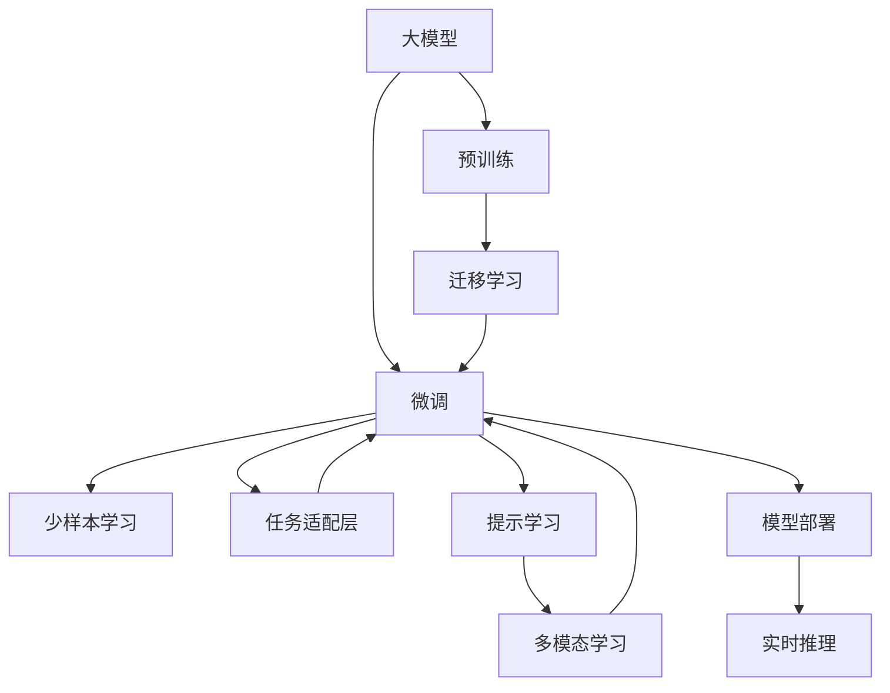

                 

# AI大模型创业：如何应对未来挑战？

在人工智能（AI）大模型时代，创业公司正面临着前所未有的机遇和挑战。从预训练模型到微调，从少样本学习到多模态融合，技术创新驱动着AI应用的不断突破。但与此同时，数据的隐私和安全性、模型的可解释性和稳定性等问题，也给AI创业公司带来了新的挑战。本文将深入探讨这些挑战，并提出相应的解决方案，帮助创业公司应对未来发展的不确定性。

## 1. 背景介绍

### 1.1 大模型的兴起

近年来，深度学习技术的迅猛发展和大规模预训练模型（Large Language Models, LLMs）的广泛应用，使AI领域迎来了新的转折点。这些大模型通过在大规模无标签数据上预训练，学习到丰富的语言知识和常识，并在下游任务上进行微调，可以显著提升模型的性能。Google的BERT、OpenAI的GPT系列模型等均是这一领域的代表。

大模型的兴起，极大地降低了应用开发的成本和门槛。通过微调，创业公司可以基于成熟的大模型快速适配特定任务，缩短开发周期，降低人力物力成本。但与此同时，这些模型庞大的参数量和复杂度，也带来了高昂的存储和计算资源需求。

### 1.2 创业公司的优势与挑战

对于创业公司而言，利用大模型进行微调可以迅速构建高性能的AI应用，缩短市场竞争的“起跑线”。但随之而来的挑战也不容忽视：

- **数据隐私和安全性**：大模型往往需要依赖海量数据进行预训练和微调，这些数据可能包含敏感信息，如何保护数据隐私和安全性成为关键问题。
- **模型的可解释性和稳定性**：大模型通常被视作“黑盒”，难以解释其决策过程。同时，在应对新任务时，模型的稳定性也会受到影响。
- **计算资源的需求**：大模型对计算资源的需求极高，创业公司如何高效利用有限的资源，是一个重要挑战。
- **技术持续创新**：AI领域技术迭代迅速，创业公司如何保持技术领先，是一个持续的难题。

## 2. 核心概念与联系

### 2.1 核心概念概述

为更好地理解大模型创业中的挑战与解决方案，本节将介绍几个关键概念及其相互联系：

- **大模型（Large Models）**：指使用大规模数据进行预训练的语言模型，如BERT、GPT等。这些模型通过深度学习算法，学习到丰富的语言知识和常识，具备强大的语言理解和生成能力。

- **微调（Fine-tuning）**：指在大模型上添加特定任务的目标层，使用少量标注数据对模型进行微调，以适应特定任务的需求。微调可以显著提升模型在特定任务上的性能，是AI创业公司常用的技术手段。

- **迁移学习（Transfer Learning）**：指将一个领域学到的知识，迁移到另一个不同但相关的领域，以加速新任务的适应。大模型可以通过迁移学习的方式，适应新的数据分布和任务类型。

- **少样本学习（Few-shot Learning）**：指模型仅使用少量标注样本，就能快速适应新任务。大模型通过提示学习等方法，可以在零样本或少样本条件下实现学习。

- **多模态学习（Multi-modal Learning）**：指模型能够同时处理多种模态的信息，如文本、图像、音频等。多模态学习可以提升模型对现实世界的理解和建模能力，拓展应用场景。

这些概念之间存在紧密联系，共同构成了AI大模型的核心技术框架。理解这些概念及其联系，有助于创业公司更好地应用和优化大模型。

### 2.2 概念间的关系

通过以下Mermaid流程图，我们可以更直观地理解这些概念之间的关系：



这个流程图展示了从预训练到大模型微调，再到多模态学习和实时推理的整个技术链条。大模型通过预训练学习到通用的语言知识，通过微调适应特定任务，通过少样本学习和提示学习提升模型泛化能力，通过多模态学习拓展应用场景，最终通过实时推理进行实际应用。

## 3. 核心算法原理 & 具体操作步骤

### 3.1 算法原理概述

基于大模型的AI创业，其核心算法原理可简述为：

1. **数据预处理**：从大规模无标签数据中提取文本特征，进行预训练。
2. **模型微调**：在预训练模型的基础上，使用特定任务的数据进行微调，调整模型参数以适应新任务。
3. **少样本学习**：在数据稀缺情况下，通过提示学习等方式，使用少量标注样本实现模型学习。
4. **多模态融合**：结合文本、图像、音频等多种数据模态，提升模型对现实世界的理解能力。
5. **实时推理**：将训练好的模型部署到生产环境中，进行实时推理和预测。

### 3.2 算法步骤详解

下面以命名实体识别（NER）任务为例，详细讲解基于大模型的微调流程。

**Step 1: 数据预处理**
- 收集标注数据集，划分为训练集、验证集和测试集。
- 对数据进行预处理，如分词、标注实体边界等。

**Step 2: 模型初始化**
- 选择预训练模型，如BERT、RoBERTa等。
- 对模型进行初始化，并加载预训练权重。

**Step 3: 任务适配层设计**
- 根据任务类型，设计适配层，如线性分类器、自编码器等。
- 在适配层中，添加损失函数，如交叉熵损失。

**Step 4: 微调训练**
- 将训练数据分批次输入模型，前向传播计算损失函数。
- 反向传播计算梯度，并使用优化器更新模型参数。
- 在验证集上评估模型性能，调整学习率等超参数。

**Step 5: 模型评估**
- 在测试集上评估模型性能，计算指标如精确度、召回率、F1分数等。
- 根据评估结果调整模型超参数，进行迭代训练。

**Step 6: 模型部署**
- 将训练好的模型部署到生产环境中，进行实时推理。
- 对推理结果进行后处理，如文本格式化、情感分析等。

### 3.3 算法优缺点

**优点**：
- **泛化能力强**：大模型通过预训练学习到广泛的语义知识，能够适应多种任务。
- **训练时间短**：微调仅需少量标注数据，训练时间较从头训练显著缩短。
- **应用灵活**：模型可快速适配新任务，支持多种应用场景。

**缺点**：
- **资源消耗高**：大模型参数量庞大，对计算资源需求高。
- **泛化能力有限**：在数据分布与预训练数据差异较大时，泛化性能可能受限。
- **可解释性差**：大模型通常被视作“黑盒”，难以解释其决策过程。

### 3.4 算法应用领域

基于大模型的微调技术，在多个领域得到了广泛应用，如：

- **智能客服**：使用大模型构建智能客服系统，快速响应客户咨询，提升服务效率。
- **金融风控**：结合金融领域知识，构建智能风控系统，预测风险并实时决策。
- **医疗诊断**：通过预训练模型和微调，构建医疗问答系统，辅助医生诊断和治疗。
- **教育推荐**：利用大模型对用户行为进行分析，推荐个性化的学习内容，提升学习效果。
- **智能家居**：结合语音识别、图像处理等技术，构建智能家居系统，提供个性化服务。

## 4. 数学模型和公式 & 详细讲解 & 举例说明

### 4.1 数学模型构建

假设预训练模型为 $M_{\theta}$，在特定任务 $T$ 上微调，其适配层的输出为 $y$，真实标签为 $y^*$，则微调的数学模型为：

$$
\min_{\theta} \frac{1}{N} \sum_{i=1}^N \ell(M_{\theta}(x_i), y^*_i)
$$

其中 $\ell$ 为损失函数，通常为交叉熵损失。

### 4.2 公式推导过程

以命名实体识别（NER）任务为例，假设模型输出为 $M_{\theta}(x)$，其中 $x$ 为输入文本，$y_i$ 为第 $i$ 个实体的边界标签。则模型输出 $y$ 的概率分布为：

$$
P(y|x, \theta) = \frac{e^{M_{\theta}(x)}}{Z}
$$

其中 $Z$ 为归一化常数。

假设模型输出为 $y$，真实标签为 $y^*$，则损失函数为：

$$
\ell = -\sum_{i=1}^N \log P(y^*_i|x_i, \theta)
$$

### 4.3 案例分析与讲解

以BertForTokenClassification为例，对微调过程进行详细分析。假设模型输入为 $x_i$，输出为 $y_i$，则微调过程可以表示为：

$$
\theta \leftarrow \theta - \eta \nabla_{\theta} \ell(M_{\theta}(x_i), y_i)
$$

其中 $\eta$ 为学习率，$\nabla_{\theta} \ell$ 为损失函数对模型参数的梯度。

通过反向传播算法，计算梯度，并使用优化器（如AdamW）更新模型参数。在训练过程中，需要不断调整学习率、正则化系数等超参数，以防止过拟合和提高泛化能力。

## 5. 项目实践：代码实例和详细解释说明

### 5.1 开发环境搭建

在进行大模型微调实践前，需要准备以下开发环境：

1. **安装Python**：安装Python 3.7及以上版本。
2. **安装Anaconda**：从官网下载并安装Anaconda，用于创建独立的Python环境。
3. **创建虚拟环境**：
   ```bash
   conda create -n pytorch-env python=3.7 
   conda activate pytorch-env
   ```
4. **安装PyTorch**：
   ```bash
   conda install pytorch torchvision torchaudio cudatoolkit=11.1 -c pytorch -c conda-forge
   ```
5. **安装Transformers库**：
   ```bash
   pip install transformers
   ```
6. **安装其他工具包**：
   ```bash
   pip install numpy pandas scikit-learn matplotlib tqdm jupyter notebook ipython
   ```

### 5.2 源代码详细实现

以命名实体识别（NER）任务为例，使用BertForTokenClassification进行微调。

```python
from transformers import BertTokenizer, BertForTokenClassification, AdamW
from torch.utils.data import Dataset, DataLoader
import torch
from sklearn.metrics import classification_report

# 数据准备
tokenizer = BertTokenizer.from_pretrained('bert-base-cased')
train_dataset = ...
dev_dataset = ...
test_dataset = ...

# 模型初始化
model = BertForTokenClassification.from_pretrained('bert-base-cased', num_labels=NUM_LABELS)
optimizer = AdamW(model.parameters(), lr=2e-5)

# 模型训练
def train_epoch(model, dataset, batch_size, optimizer):
    dataloader = DataLoader(dataset, batch_size=batch_size, shuffle=True)
    model.train()
    epoch_loss = 0
    for batch in dataloader:
        input_ids = batch['input_ids'].to(device)
        attention_mask = batch['attention_mask'].to(device)
        labels = batch['labels'].to(device)
        model.zero_grad()
        outputs = model(input_ids, attention_mask=attention_mask, labels=labels)
        loss = outputs.loss
        epoch_loss += loss.item()
        loss.backward()
        optimizer.step()
    return epoch_loss / len(dataloader)

# 模型评估
def evaluate(model, dataset, batch_size):
    dataloader = DataLoader(dataset, batch_size=batch_size)
    model.eval()
    preds, labels = [], []
    with torch.no_grad():
        for batch in dataloader:
            input_ids = batch['input_ids'].to(device)
            attention_mask = batch['attention_mask'].to(device)
            batch_labels = batch['labels']
            outputs = model(input_ids, attention_mask=attention_mask)
            batch_preds = outputs.logits.argmax(dim=2).to('cpu').tolist()
            batch_labels = batch_labels.to('cpu').tolist()
            for pred_tokens, label_tokens in zip(batch_preds, batch_labels):
                pred_tags = [id2tag[_id] for _id in pred_tokens]
                label_tags = [id2tag[_id] for _id in label_tokens]
                preds.append(pred_tags[:len(label_tags)])
                labels.append(label_tags)
    print(classification_report(labels, preds))

# 训练与评估
epochs = 5
batch_size = 16

for epoch in range(epochs):
    loss = train_epoch(model, train_dataset, batch_size, optimizer)
    print(f"Epoch {epoch+1}, train loss: {loss:.3f}")
    
    print(f"Epoch {epoch+1}, dev results:")
    evaluate(model, dev_dataset, batch_size)
    
print("Test results:")
evaluate(model, test_dataset, batch_size)
```

### 5.3 代码解读与分析

以下是关键代码的详细解读：

**NERDataset类**：
- `__init__`方法：初始化文本、标签、分词器等关键组件。
- `__len__`方法：返回数据集的样本数量。
- `__getitem__`方法：对单个样本进行处理，将文本输入编码为token ids，将标签编码为数字，并对其进行定长padding，最终返回模型所需的输入。

**tag2id和id2tag字典**：
- 定义了标签与数字id之间的映射关系，用于将token-wise的预测结果解码回真实的标签。

**训练和评估函数**：
- 使用PyTorch的DataLoader对数据集进行批次化加载，供模型训练和推理使用。
- 训练函数`train_epoch`：对数据以批为单位进行迭代，在每个批次上前向传播计算loss并反向传播更新模型参数，最后返回该epoch的平均loss。
- 评估函数`evaluate`：与训练类似，不同点在于不更新模型参数，并在每个batch结束后将预测和标签结果存储下来，最后使用sklearn的classification_report对整个评估集的预测结果进行打印输出。

**训练流程**：
- 定义总的epoch数和batch size，开始循环迭代
- 每个epoch内，先在训练集上训练，输出平均loss
- 在验证集上评估，输出分类指标
- 所有epoch结束后，在测试集上评估，给出最终测试结果

## 6. 实际应用场景

### 6.1 智能客服系统

基于大模型的微调技术，可以构建高效、智能的客服系统。传统的客服系统依赖人工，响应时间长、效率低，且难以保证服务质量。而使用微调后的语言模型，可以7x24小时不间断服务，快速响应客户咨询，提供高质量的智能客服。

在技术实现上，可以收集企业内部的历史客服对话记录，将问题和最佳答复构建成监督数据，在此基础上对预训练语言模型进行微调。微调后的语言模型能够自动理解用户意图，匹配最合适的答案模板进行回复。对于客户提出的新问题，还可以接入检索系统实时搜索相关内容，动态组织生成回答。

### 6.2 金融风控系统

金融行业面临复杂的风险管理需求，传统的人工风控方法成本高、效率低，难以适应大规模数据处理和实时决策的需求。而使用大模型微调技术，可以构建智能风控系统，实时监测市场舆情，预测风险并快速决策。

具体而言，可以收集金融领域相关的新闻、报道、评论等文本数据，并对其进行主题标注和情感标注。在此基础上对预训练语言模型进行微调，使其能够自动判断文本属于何种主题，情感倾向是正面、中性还是负面。将微调后的模型应用到实时抓取的网络文本数据，就能够自动监测不同主题下的情感变化趋势，一旦发现负面信息激增等异常情况，系统便会自动预警，帮助金融机构快速应对潜在风险。

### 6.3 医疗问答系统

医疗行业信息复杂，医生的工作强度大，存在误诊、漏诊的风险。基于大模型的微调技术，可以构建智能医疗问答系统，辅助医生诊疗，减少误诊、漏诊，提高诊疗效率。

具体而言，可以收集医疗领域的问诊记录和专家解答，将其作为监督数据，对预训练语言模型进行微调。微调后的模型能够自动理解患者的症状描述，推荐合适的问诊方案和检查项目，辅助医生进行诊断和治疗。

### 6.4 教育推荐系统

教育行业个性化需求高，传统的推荐系统无法满足学生的个性化学习需求。基于大模型的微调技术，可以构建智能教育推荐系统，为学生提供个性化推荐内容，提升学习效果。

具体而言，可以收集学生的浏览、点击、评论、分享等行为数据，提取和学生交互的物品标题、描述、标签等文本内容。将文本内容作为模型输入，学生的后续行为（如是否点击、学习等）作为监督信号，在此基础上微调预训练语言模型。微调后的模型能够从文本内容中准确把握学生的兴趣点，推荐个性化的学习内容，提升学生的学习效果。

## 7. 工具和资源推荐

### 7.1 学习资源推荐

为了帮助开发者系统掌握大模型微调的理论基础和实践技巧，这里推荐一些优质的学习资源：

1. **《Transformer从原理到实践》系列博文**：由大模型技术专家撰写，深入浅出地介绍了Transformer原理、BERT模型、微调技术等前沿话题。
2. **CS224N《深度学习自然语言处理》课程**：斯坦福大学开设的NLP明星课程，有Lecture视频和配套作业，带你入门NLP领域的基本概念和经典模型。
3. **《Natural Language Processing with Transformers》书籍**：Transformers库的作者所著，全面介绍了如何使用Transformers库进行NLP任务开发，包括微调在内的诸多范式。
4. **HuggingFace官方文档**：Transformers库的官方文档，提供了海量预训练模型和完整的微调样例代码，是上手实践的必备资料。
5. **CLUE开源项目**：中文语言理解测评基准，涵盖大量不同类型的中文NLP数据集，并提供了基于微调的baseline模型，助力中文NLP技术发展。

通过对这些资源的学习实践，相信你一定能够快速掌握大模型微调的精髓，并用于解决实际的NLP问题。

### 7.2 开发工具推荐

高效的开发离不开优秀的工具支持。以下是几款用于大模型微调开发的常用工具：

1. **PyTorch**：基于Python的开源深度学习框架，灵活动态的计算图，适合快速迭代研究。大部分预训练语言模型都有PyTorch版本的实现。
2. **TensorFlow**：由Google主导开发的开源深度学习框架，生产部署方便，适合大规模工程应用。同样有丰富的预训练语言模型资源。
3. **Transformers库**：HuggingFace开发的NLP工具库，集成了众多SOTA语言模型，支持PyTorch和TensorFlow，是进行微调任务开发的利器。
4. **Weights & Biases**：模型训练的实验跟踪工具，可以记录和可视化模型训练过程中的各项指标，方便对比和调优。与主流深度学习框架无缝集成。
5. **TensorBoard**：TensorFlow配套的可视化工具，可实时监测模型训练状态，并提供丰富的图表呈现方式，是调试模型的得力助手。
6. **Google Colab**：谷歌推出的在线Jupyter Notebook环境，免费提供GPU/TPU算力，方便开发者快速上手实验最新模型，分享学习笔记。

合理利用这些工具，可以显著提升大模型微调的开发效率，加快创新迭代的步伐。

### 7.3 相关论文推荐

大模型和微调技术的发展源于学界的持续研究。以下是几篇奠基性的相关论文，推荐阅读：

1. **Attention is All You Need**：提出了Transformer结构，开启了NLP领域的预训练大模型时代。
2. **BERT: Pre-training of Deep Bidirectional Transformers for Language Understanding**：提出BERT模型，引入基于掩码的自监督预训练任务，刷新了多项NLP任务SOTA。
3. **Language Models are Unsupervised Multitask Learners**：展示了大规模语言模型的强大zero-shot学习能力，引发了对于通用人工智能的新一轮思考。
4. **Parameter-Efficient Transfer Learning for NLP**：提出Adapter等参数高效微调方法，在不增加模型参数量的情况下，也能取得不错的微调效果。
5. **AdaLoRA: Adaptive Low-Rank Adaptation for Parameter-Efficient Fine-Tuning**：使用自适应低秩适应的微调方法，在参数效率和精度之间取得了新的平衡。
6. **Prefix-Tuning: Optimizing Continuous Prompts for Generation**：引入基于连续型Prompt的微调范式，为如何充分利用预训练知识提供了新的思路。

这些论文代表了大模型微调技术的发展脉络。通过学习这些前沿成果，可以帮助研究者把握学科前进方向，激发更多的创新灵感。

除上述资源外，还有一些值得关注的前沿资源，帮助开发者紧跟大模型微调技术的最新进展，例如：

1. **arXiv论文预印本**：人工智能领域最新研究成果的发布平台，包括大量尚未发表的前沿工作，学习前沿技术的必读资源。
2. **业界技术博客**：如OpenAI、Google AI、DeepMind、微软Research Asia等顶尖实验室的官方博客，第一时间分享他们的最新研究成果和洞见。
3. **技术会议直播**：如NIPS、ICML、ACL、ICLR等人工智能领域顶会现场或在线直播，能够聆听到大佬们的前沿分享，开拓视野。
4. **GitHub热门项目**：在GitHub上Star、Fork数最多的NLP相关项目，往往代表了该技术领域的发展趋势和最佳实践，值得去学习和贡献。
5. **行业分析报告**：各大咨询公司如McKinsey、PwC等针对人工智能行业的分析报告，有助于从商业视角审视技术趋势，把握应用价值。

总之，对于大模型微调技术的学习和实践，需要开发者保持开放的心态和持续学习的意愿。多关注前沿资讯，多动手实践，多思考总结，必将收获满满的成长收益。

## 8. 总结：未来发展趋势与挑战

### 8.1 总结

本文对基于大模型的AI创业进行系统介绍，探讨了其技术原理、操作步骤、应用领域及面临的挑战。通过详细的理论分析和技术实践，相信读者可以更好地理解大模型微调的精髓，并在实际应用中加以应用。

### 8.2 未来发展趋势

展望未来，大模型微调技术将呈现以下几个发展趋势：

1. **模型规模持续增大**：随着算力成本的下降和数据规模的扩张，预训练语言模型的参数量还将持续增长。超大规模语言模型蕴含的丰富语言知识，有望支撑更加复杂多变的下游任务微调。
2. **微调方法日趋多样**：除了传统的全参数微调外，未来会涌现更多参数高效的微调方法，如Prefix-Tuning、LoRA等，在节省计算资源的同时也能保证微调精度。
3. **持续学习成为常态**：随着数据分布的不断变化，微调模型也需要持续学习新知识以保持性能。如何在不遗忘原有知识的同时，高效吸收新样本信息，将成为重要的研究课题。
4. **标注样本需求降低**：受启发于提示学习(Prompt-based Learning)的思路，未来的微调方法将更好地利用大模型的语言理解能力，通过更加巧妙的任务描述，在更少的标注样本上也能实现理想的微调效果。
5. **多模态微调崛起**：当前的微调主要聚焦于纯文本数据，未来会进一步拓展到图像、视频、语音等多模态数据微调。多模态信息的融合，将显著提升语言模型对现实世界的理解和建模能力。
6. **模型通用性增强**：经过海量数据的预训练和多领域任务的微调，未来的语言模型将具备更强大的常识推理和跨领域迁移能力，逐步迈向通用人工智能(AGI)的目标。

以上趋势凸显了大模型微调技术的广阔前景。这些方向的探索发展，必将进一步提升NLP系统的性能和应用范围，为人类认知智能的进化带来深远影响。

### 8.3 面临的挑战

尽管大语言模型微调技术已经取得了瞩目成就，但在迈向更加智能化、普适化应用的过程中，它仍面临着诸多挑战：

1. **标注成本瓶颈**：大模型往往需要依赖海量数据进行预训练和微调，这些数据可能包含敏感信息，如何保护数据隐私和安全性成为关键问题。
2. **模型的鲁棒性不足**：当前微调模型面对域外数据时，泛化性能往往大打折扣。对于测试样本的微小扰动，微调模型的预测也容易发生波动。
3. **推理效率有待提高**：大规模语言模型虽然精度高，但在实际部署时往往面临推理速度慢、内存占用大等效率问题。
4. **可解释性亟需加强**：当前微调模型更像是“黑盒”，难以解释其决策过程。对于医疗、金融等高风险应用，算法的可解释性和可审计性尤为重要。
5. **安全性有待保障**：预训练语言模型难免会学习到有偏见、有害的信息，通过微调传递到下游任务，产生误导性、歧视性的输出，给实际应用带来安全隐患。
6. **知识整合能力不足**：现有的微调模型往往局限于任务内数据

