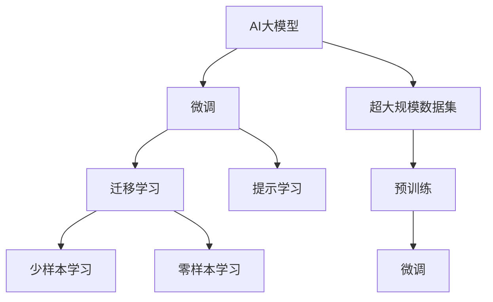
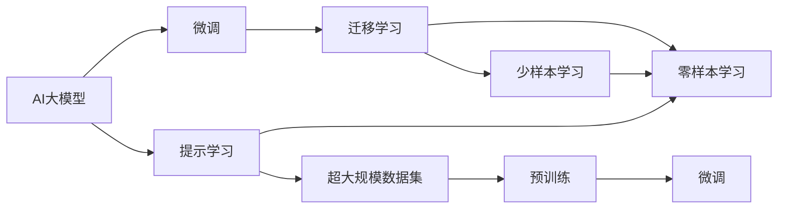
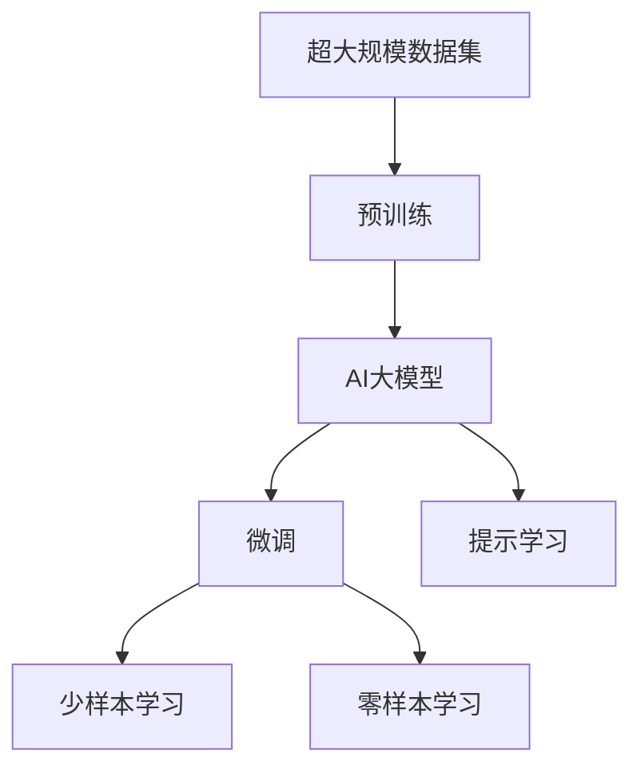

                 

## 1. 背景介绍

### 1.1 问题由来
近年来，AI大模型在自然语言处理（NLP）、计算机视觉（CV）、语音识别（ASR）等领域取得了革命性的突破，引发了广泛的关注和讨论。随着技术的不断发展，越来越多的创业者和企业开始探索如何利用AI大模型进行创业。然而，大模型在创业应用中面临很多挑战，如数据隐私、算力消耗、知识产权等。如何更好地应对这些挑战，成为创业成功与否的关键因素。

### 1.2 问题核心关键点
AI大模型在创业中的应用，需要考虑以下几个关键点：
- **数据隐私与安全**：如何保护用户隐私，避免数据泄露。
- **算力与成本**：如何高效利用算力，降低计算成本。
- **知识产权**：如何合理利用开源模型，保护自身技术。
- **技术落地**：如何将大模型应用到实际业务场景中。
- **用户体验**：如何提升用户对产品的满意度。

### 1.3 问题研究意义
AI大模型在创业中的应用，具有重要意义：
- **创新驱动**：帮助创业公司开发出具有创新性的产品和服务，增强市场竞争力。
- **降低成本**：利用大模型的通用能力和预训练知识，减少数据标注和模型训练成本。
- **提升效率**：提高自动化水平，加快产品迭代和市场响应速度。
- **增强体验**：通过智能化的服务提升用户体验，实现差异化竞争。
- **扩大应用**：拓展应用场景，开辟新的市场空间。

## 2. 核心概念与联系

### 2.1 核心概念概述

为更好地理解AI大模型在创业中的应用，本节将介绍几个密切相关的核心概念：

- **AI大模型**：包括BERT、GPT、ResNet等基于深度学习的预训练模型，具备强大的泛化能力和自我学习能力。
- **微调（Fine-tuning）**：在预训练模型的基础上，利用少量标注数据进行有监督学习，以适应特定任务。
- **迁移学习（Transfer Learning）**：将一个领域学到的知识，迁移到另一个领域的学习过程。
- **提示学习（Prompt Learning）**：在输入文本中添加提示信息，引导模型按期望方式推理。
- **少样本学习（Few-shot Learning）**：在少量样本情况下，快速适应新任务。
- **零样本学习（Zero-shot Learning）**：模型仅凭任务描述，即可执行新任务。
- **超大规模数据集（Big Data）**：包含海量数据的大型数据集，用于预训练大模型。

这些核心概念之间通过一系列技术和方法相连接，构成了一个完整的大模型应用生态系统。下面通过Mermaid流程图来展示这些概念之间的关系：



该流程图展示了从预训练到微调，再到提示学习等技术环节，并最终应用于零样本和少样本学习的过程。

### 2.2 概念间的关系

这些核心概念之间的关系可以通过以下Mermaid流程图来展示：



这个综合流程图展示了从预训练到微调，再到提示学习等技术环节，并最终应用于零样本和少样本学习的过程。

### 2.3 核心概念的整体架构

最后，我们用一个综合的流程图来展示这些核心概念在大模型应用中的整体架构：



这个综合流程图展示了从预训练到微调，再到提示学习等技术环节，并最终应用于零样本和少样本学习的过程。

## 3. 核心算法原理 & 具体操作步骤
### 3.1 算法原理概述

AI大模型的核心算法原理包括：
- **自监督学习（Self-Supervised Learning）**：在大规模无标签数据上，通过构建自监督任务训练模型，使其具备对数据的初步理解。
- **微调（Fine-tuning）**：在自监督学习的基础上，利用少量标注数据进行有监督学习，使模型适应特定任务。
- **迁移学习（Transfer Learning）**：将一个领域学到的知识迁移到另一个领域，以加速模型的训练和提升性能。
- **提示学习（Prompt Learning）**：在输入文本中添加提示信息，引导模型推理。
- **少样本学习（Few-shot Learning）**：利用少量样本训练模型，适应新任务。
- **零样本学习（Zero-shot Learning）**：模型仅凭任务描述，即可执行新任务。

### 3.2 算法步骤详解

AI大模型在创业应用中，通常需要以下步骤：
1. **数据收集与预处理**：收集与业务相关的数据，并进行清洗、标注和预处理。
2. **模型选择与配置**：选择合适的预训练模型，并进行必要的配置和微调。
3. **应用场景适配**：根据具体业务场景，设计任务适配层，进行微调。
4. **性能优化与评估**：对微调后的模型进行性能优化，并进行评估和调优。
5. **模型部署与应用**：将模型部署到实际应用场景中，并不断迭代改进。

### 3.3 算法优缺点

AI大模型的优点包括：
- **高效性**：利用大规模预训练模型，可以显著减少数据标注和模型训练成本。
- **泛化能力**：通过迁移学习和微调，可以适应各种不同的任务和场景。
- **可解释性**：大模型可以通过提示学习等方法，实现更可解释的推理过程。

其缺点包括：
- **数据隐私**：大模型需要大量数据进行训练，可能涉及用户隐私问题。
- **算力消耗**：大模型通常需要较高的算力支持，成本较高。
- **知识产权**：开源模型可能存在知识产权风险，需谨慎使用。
- **技术复杂性**：大模型应用需要较高的技术门槛，需投入较多研发资源。

### 3.4 算法应用领域

AI大模型在创业应用中，广泛应用于以下几个领域：
- **智能客服**：利用预训练模型进行任务适配，构建智能客服系统。
- **金融风控**：利用大模型进行情感分析、舆情监测等，提升金融风控能力。
- **医疗诊断**：利用大模型进行疾病诊断、病情分析，提升医疗诊断水平。
- **智能推荐**：利用大模型进行个性化推荐，提升用户体验。
- **智能制造**：利用大模型进行工业诊断、质量控制，提升生产效率。
- **智能教育**：利用大模型进行个性化教育、学习分析，提升教育效果。
- **智能家居**：利用大模型进行语音识别、自然语言理解，提升家居智能化水平。

## 4. 数学模型和公式 & 详细讲解
### 4.1 数学模型构建

AI大模型的数学模型构建主要包括以下几个部分：
- **预训练模型**：如BERT、GPT等，基于大规模无标签数据进行自监督学习，获得初始化权重。
- **微调模型**：在预训练模型的基础上，利用少量标注数据进行有监督学习，适应特定任务。
- **迁移学习模型**：在不同领域之间进行知识迁移，提升模型的泛化能力。
- **提示学习模型**：在输入文本中添加提示信息，引导模型推理。
- **少样本学习模型**：利用少量样本训练模型，适应新任务。
- **零样本学习模型**：仅凭任务描述，即可执行新任务。

### 4.2 公式推导过程

以下以BERT模型为例，推导其微调过程的数学公式：
假设BERT模型在输入文本 $x$ 上的输出为 $h(x)$，通过微调后的模型为 $h_{\theta}(x)$，其中 $\theta$ 为模型参数。则微调的损失函数可以表示为：
$$
L(h_{\theta}(x), y) = \frac{1}{N} \sum_{i=1}^N L(h_{\theta}(x_i), y_i)
$$
其中 $N$ 为样本数量，$L$ 为损失函数，$x_i$ 和 $y_i$ 分别为样本输入和标签。

根据链式法则，微调后的模型参数 $\theta$ 可以通过梯度下降算法更新：
$$
\theta \leftarrow \theta - \eta \nabla_{\theta}L(h_{\theta}(x), y)
$$
其中 $\eta$ 为学习率，$\nabla_{\theta}L$ 为损失函数对模型参数的梯度。

### 4.3 案例分析与讲解

以金融风控为例，利用BERT模型进行情感分析：
1. **数据收集**：收集金融领域的新闻、评论等文本数据。
2. **数据预处理**：对文本进行分词、清洗、标注等预处理。
3. **模型选择**：选择BERT作为预训练模型。
4. **任务适配**：在BERT的顶层添加分类器，进行情感分类。
5. **微调**：利用少量标注数据进行微调，适应情感分析任务。
6. **性能评估**：在验证集和测试集上进行评估，调整模型参数。
7. **模型部署**：将模型部署到实际应用中，进行实时情感分析。

## 5. 项目实践：代码实例和详细解释说明
### 5.1 开发环境搭建

在进行AI大模型应用开发时，需要准备以下开发环境：
1. **Python**：作为主要的编程语言，Python生态系统丰富，易于使用。
2. **TensorFlow/PyTorch**：深度学习框架，用于模型构建和训练。
3. **Transformers库**：开源NLP工具库，包含多个预训练模型，支持微调功能。
4. **Jupyter Notebook**：轻量级交互式编程环境，便于快速原型开发。
5. **GitHub/GitLab**：代码托管平台，便于版本控制和协作开发。
6. **AWS/GCP/阿里云**：云平台，提供强大的算力支持。

### 5.2 源代码详细实现

以下以金融风控应用为例，展示如何使用PyTorch进行BERT模型的微调：
```python
import torch
import torch.nn as nn
from transformers import BertTokenizer, BertForSequenceClassification
from torch.utils.data import Dataset, DataLoader

class FinancialData(Dataset):
    def __init__(self, texts, labels):
        self.tokenizer = BertTokenizer.from_pretrained('bert-base-cased')
        self.texts = texts
        self.labels = labels
        
    def __len__(self):
        return len(self.texts)
    
    def __getitem__(self, idx):
        text = self.texts[idx]
        label = self.labels[idx]
        encoding = self.tokenizer(text, return_tensors='pt', padding='max_length', truncation=True)
        input_ids = encoding['input_ids']
        attention_mask = encoding['attention_mask']
        return {'input_ids': input_ids, 
                'attention_mask': attention_mask,
                'labels': label}
        
class FinancialClassifier(nn.Module):
    def __init__(self, num_labels=2):
        super(FinancialClassifier, self).__init__()
        self.bert = BertForSequenceClassification.from_pretrained('bert-base-cased', num_labels=num_labels)
        
    def forward(self, input_ids, attention_mask, labels):
        output = self.bert(input_ids, attention_mask=attention_mask, labels=labels)
        logits = output.logits
        return logits

def train_model(model, dataloader, optimizer, num_epochs):
    device = torch.device('cuda' if torch.cuda.is_available() else 'cpu')
    model.to(device)
    
    for epoch in range(num_epochs):
        model.train()
        for batch in dataloader:
            input_ids = batch['input_ids'].to(device)
            attention_mask = batch['attention_mask'].to(device)
            labels = batch['labels'].to(device)
            optimizer.zero_grad()
            logits = model(input_ids, attention_mask=attention_mask)
            loss = nn.CrossEntropyLoss()(logits, labels)
            loss.backward()
            optimizer.step()
            
        print(f'Epoch {epoch+1}, loss: {loss.item()}')
        
def evaluate_model(model, dataloader):
    device = torch.device('cuda' if torch.cuda.is_available() else 'cpu')
    model.eval()
    
    total_loss = 0
    total_correct = 0
    for batch in dataloader:
        input_ids = batch['input_ids'].to(device)
        attention_mask = batch['attention_mask'].to(device)
        labels = batch['labels'].to(device)
        logits = model(input_ids, attention_mask=attention_mask)
        loss = nn.CrossEntropyLoss()(logits, labels)
        total_loss += loss.item()
        _, preds = torch.max(logits, 1)
        total_correct += torch.sum(preds == labels).item()
    
    print(f'Test accuracy: {total_correct / len(dataloader.dataset)}')
    
# 使用预训练模型进行微调
tokenizer = BertTokenizer.from_pretrained('bert-base-cased')
dataloader = DataLoader(FinancialData(train_texts, train_labels), batch_size=16)
model = FinancialClassifier(num_labels=2)
optimizer = torch.optim.Adam(model.parameters(), lr=2e-5)

train_model(model, dataloader, optimizer, num_epochs=5)
evaluate_model(model, dataloader)
```

### 5.3 代码解读与分析

以上代码展示了使用PyTorch进行BERT模型微调的过程。主要步骤如下：
1. **数据预处理**：将文本数据进行分词、标注、编码等处理，转化为模型可以接受的输入格式。
2. **模型构建**：使用BertForSequenceClassification类，构建一个包含BERT模型的金融分类器。
3. **训练**：使用Adam优化器，对模型进行训练，最小化损失函数。
4. **评估**：在验证集上对模型进行评估，输出准确率等性能指标。

## 6. 实际应用场景
### 6.1 智能客服

AI大模型在智能客服中的应用主要包括以下几个方面：
- **文本分类**：利用BERT等模型进行文本分类，将客户问题归类为常见问题、技术问题、服务问题等。
- **意图识别**：识别客户意图，自动分配到对应的客服人员或进行智能回复。
- **情感分析**：分析客户情绪，进行情感判断，及时提供情感支持。
- **知识库构建**：构建智能知识库，提升客服人员的专业知识和客户满意度。

### 6.2 金融风控

AI大模型在金融风控中的应用主要包括以下几个方面：
- **舆情监测**：实时监测金融舆情，预测市场风险。
- **欺诈检测**：利用BERT等模型进行交易数据分析，识别异常交易行为。
- **信用评估**：利用BERT等模型进行客户信用评估，降低坏账风险。
- **自动化交易**：基于深度学习模型进行算法交易，提高交易效率和收益。

### 6.3 医疗诊断

AI大模型在医疗诊断中的应用主要包括以下几个方面：
- **疾病预测**：利用BERT等模型进行疾病预测，提升诊断准确性。
- **病历分析**：利用BERT等模型进行病历分析，提供诊断建议。
- **基因分析**：利用BERT等模型进行基因分析，提供个性化治疗方案。
- **药物研发**：利用BERT等模型进行药物筛选，加快药物研发进程。

### 6.4 未来应用展望

未来，AI大模型在创业应用中的前景非常广阔：
- **跨领域应用**：AI大模型可以应用于多个领域，如金融、医疗、制造等，提供更全面的服务。
- **多模态融合**：AI大模型可以融合视觉、听觉、文本等多种模态信息，提供更加全面的智能服务。
- **边缘计算**：AI大模型可以在边缘计算设备上部署，提供实时智能服务。
- **联邦学习**：通过联邦学习，保护数据隐私，提升模型泛化能力。
- **持续学习**：通过持续学习，适应数据分布变化，提升模型性能。
- **AI伦理**：在AI大模型应用中，注重AI伦理，保护用户隐私，确保模型安全性。

## 7. 工具和资源推荐
### 7.1 学习资源推荐

为帮助创业者更好地掌握AI大模型应用，推荐以下学习资源：
1. **《深度学习》课程**：斯坦福大学的在线课程，涵盖深度学习的基础知识和前沿技术。
2. **《自然语言处理综论》书籍**：李航等人编写的经典教材，涵盖NLP的各个方面。
3. **Transformers官方文档**：HuggingFace官方文档，提供丰富的模型和工具支持。
4. **Kaggle竞赛**：Kaggle平台上众多NLP竞赛，提供大量实践机会。
5. **AI大模型社区**：如GitHub、Stack Overflow等，交流学习心得和经验。

### 7.2 开发工具推荐

为提高AI大模型应用的开发效率，推荐以下开发工具：
1. **Jupyter Notebook**：轻量级交互式编程环境，便于快速原型开发。
2. **TensorFlow/PyTorch**：深度学习框架，支持高效模型构建和训练。
3. **HuggingFace Transformers**：开源NLP工具库，支持多种预训练模型和微调功能。
4. **AWS/GCP/阿里云**：云平台，提供强大的算力支持。
5. **GitHub/GitLab**：代码托管平台，便于版本控制和协作开发。
6. **Visual Studio Code**：开发IDE，提供丰富的插件和扩展。

### 7.3 相关论文推荐

为深入理解AI大模型在创业应用中的关键技术，推荐以下相关论文：
1. **《BERT: Pre-training of Deep Bidirectional Transformers for Language Understanding》**：提出BERT模型，利用大规模无标签数据进行自监督学习。
2. **《Attention is All You Need》**：提出Transformer模型，利用注意力机制提升模型性能。
3. **《GPT-3: Language Models are Unsupervised Multitask Learners》**：提出GPT-3模型，展示了大规模语言模型的强大零样本学习能力。
4. **《AdaLoRA: Adaptive Low-Rank Adaptation for Parameter-Efficient Fine-Tuning》**：提出AdaLoRA方法，利用低秩适应技术，实现参数高效的微调。
5. **《Parameter-Efficient Transfer Learning for NLP》**：提出Adapter等参数高效微调方法，在不增加模型参数量的情况下，取得不错的微调效果。

## 8. 总结：未来发展趋势与挑战
### 8.1 研究成果总结

本文对AI大模型在创业应用中的关键技术进行了系统总结，包括数据处理、模型选择、微调、应用场景等。通过这些技术手段，AI大模型可以应用于智能客服、金融风控、医疗诊断等多个领域，提升业务智能化水平。

### 8.2 未来发展趋势

未来，AI大模型在创业应用中的发展趋势包括：
1. **多模态融合**：AI大模型可以融合视觉、听觉、文本等多种模态信息，提供更加全面的智能服务。
2. **联邦学习**：通过联邦学习，保护数据隐私，提升模型泛化能力。
3. **持续学习**：通过持续学习，适应数据分布变化，提升模型性能。
4. **跨领域应用**：AI大模型可以应用于多个领域，如金融、医疗、制造等，提供更全面的服务。
5. **边缘计算**：AI大模型可以在边缘计算设备上部署，提供实时智能服务。
6. **AI伦理**：在AI大模型应用中，注重AI伦理，保护用户隐私，确保模型安全性。

### 8.3 面临的挑战

尽管AI大模型在创业应用中具有广阔前景，但仍然面临以下挑战：
1. **数据隐私**：AI大模型需要大量数据进行训练，可能涉及用户隐私问题。
2. **算力消耗**：AI大模型通常需要较高的算力支持，成本较高。
3. **知识产权**：开源模型可能存在知识产权风险，需谨慎使用。
4. **技术复杂性**：AI大模型应用需要较高的技术门槛，需投入较多研发资源。
5. **用户接受度**：AI大模型应用需要提升用户接受度，避免技术障碍。
6. **安全性**：AI大模型应用需要保护用户数据，避免安全威胁。

### 8.4 研究展望

未来，需要在以下几个方面进行深入研究：
1. **隐私保护技术**：研究如何保护用户隐私，避免数据泄露。
2. **高效算力优化**：研究如何高效利用算力，降低计算成本。
3. **知识图谱融合**：研究如何融合知识图谱等专家知识，提升模型性能。
4. **模型压缩与优化**：研究如何压缩与优化模型，提升推理速度。
5. **可解释性增强**：研究如何增强模型可解释性，提升用户信任。
6. **安全与伦理**：研究如何保障模型安全性，避免安全威胁。
7. **跨领域应用**：研究如何在多个领域应用AI大模型，提供更加全面的服务。

总之，AI大模型在创业应用中的前景广阔，但面临诸多挑战。只有通过不断创新，才能克服这些挑战，推动AI大模型在创业中落地应用。

