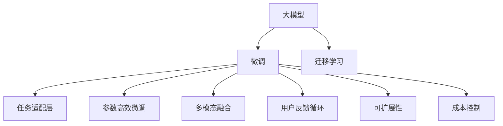
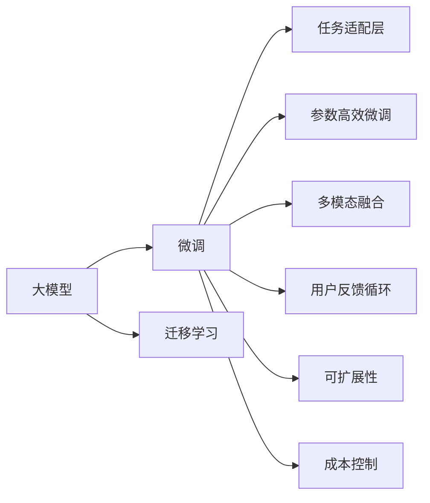
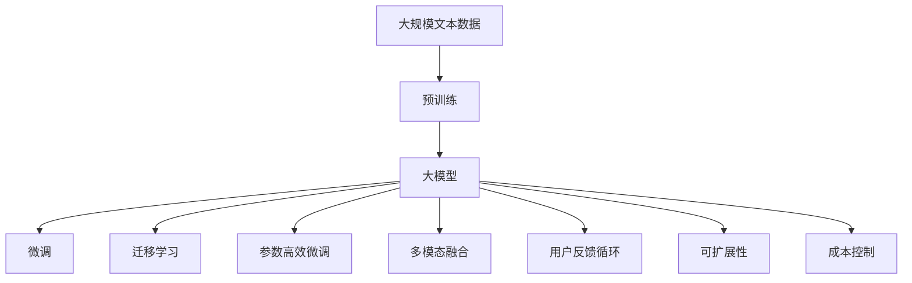

                 

## 1. 背景介绍

随着人工智能技术的不断进步，大模型已经成为一个不可忽视的热门话题。AI大模型的应用范围越来越广，从医疗到金融，从教育到娱乐，几乎无处不在。本文将聚焦于如何利用大模型进行创业，探讨如何应对未来用户需求，帮助企业家和开发者在竞争激烈的领域中脱颖而出。

### 1.1 问题由来

大模型技术的崛起，让企业能够以前所未有的速度和成本，构建高性能、低延迟的人工智能应用。但对于创业者来说，如何选择合适的技术、产品方向、市场策略，仍是一个巨大的挑战。本文将从技术、市场、用户需求等多个角度，深入探讨如何利用大模型进行创业，以便应对未来的变化和挑战。

### 1.2 问题核心关键点

本文的核心在于利用大模型进行创业，同时兼顾技术、市场和用户需求的多维度思考。具体来说，关键点包括：

- 选择合适的预训练模型：根据业务需求，选择最适合的预训练模型进行微调或迁移学习。
- 适应性微调：针对特定应用场景，进行任务适配层设计，微调模型参数。
- 灵活部署：根据实际需求，采用多种部署方案，如云平台、边缘计算等。
- 用户反馈：持续收集用户反馈，优化模型性能和用户体验。
- 数据隐私：确保用户数据安全，避免侵犯隐私。
- 多模态融合：考虑融合视觉、语音等多模态数据，提升应用体验。
- 可扩展性：确保系统具有良好的可扩展性，以适应业务增长。
- 成本控制：在保证性能的前提下，合理控制开发和运营成本。

这些关键点共同构成了大模型创业的完整框架，帮助创业者在技术、市场和用户体验间找到平衡。

## 2. 核心概念与联系

### 2.1 核心概念概述

- **大模型**：指在大规模无标签文本语料上预训练的深度学习模型，如BERT、GPT、T5等。这些模型通过自监督学习，学习到丰富的语言知识，具备强大的语言理解和生成能力。

- **微调**：指在预训练模型的基础上，使用下游任务的少量标注数据，通过有监督学习优化模型在特定任务上的性能。

- **迁移学习**：指将一个领域学习到的知识，迁移到另一个不同但相关的领域的学习范式。大模型的预训练-微调过程即是一种典型的迁移学习方式。

- **参数高效微调**：指在微调过程中，只更新少量的模型参数，而固定大部分预训练权重不变，以提高微调效率，避免过拟合。

- **多模态融合**：指融合视觉、语音等多模态数据，提升应用体验和准确性。

- **用户反馈循环**：指通过持续收集用户反馈，不断优化模型和应用，提升用户体验。

- **可扩展性**：指系统具有良好的可扩展性，能够灵活应对业务增长和用户需求变化。

- **成本控制**：指在保证性能的前提下，合理控制开发和运营成本。

这些核心概念之间的关系可以通过以下Mermaid流程图来展示：



这个流程图展示了大模型创业中各个关键概念之间的关系：

1. 大模型通过预训练获得基础能力。
2. 微调和大模型相结合，通过有监督学习优化模型性能。
3. 迁移学习使得大模型能够适应不同的任务领域。
4. 参数高效微调提高微调效率，避免过拟合。
5. 多模态融合增强应用体验。
6. 用户反馈循环持续优化模型和应用。
7. 可扩展性使得系统能够灵活应对业务增长。
8. 成本控制保障企业盈利能力。

### 2.2 概念间的关系

这些核心概念之间存在着紧密的联系，形成了大模型创业的完整生态系统。下面是每个核心概念之间的关系图：



这个关系图展示了大模型创业过程中各个概念之间的关系：

1. 大模型通过迁移学习获得多领域能力。
2. 微调通过任务适配层实现特定任务优化。
3. 参数高效微调提高微调效率。
4. 多模态融合提升应用体验。
5. 用户反馈循环持续优化用户体验。
6. 可扩展性确保系统能够灵活应对业务增长。
7. 成本控制保障企业盈利能力。

### 2.3 核心概念的整体架构

最后，我们用一个综合的流程图来展示这些核心概念在大模型创业过程中的整体架构：



这个综合流程图展示了从预训练到大模型微调，再到用户反馈和成本控制的完整过程。大模型首先在大规模文本数据上进行预训练，然后通过微调（包括全参数微调和参数高效微调）和迁移学习，适应不同的任务需求。多模态融合、用户反馈循环、可扩展性和成本控制保证了系统的性能、用户体验和可持续发展。

## 3. 核心算法原理 & 具体操作步骤

### 3.1 算法原理概述

基于大模型进行创业的核心算法原理是微调。微调是将预训练模型在特定任务上进行有监督学习的过程，以优化模型在该任务上的性能。微调的核心思想是，通过调整模型参数，使其能够更好地适应下游任务的要求。

具体来说，微调过程包括以下几个关键步骤：

1. **数据准备**：收集下游任务的少量标注数据，划分为训练集、验证集和测试集。
2. **模型加载**：选择合适的预训练模型，并加载到系统中。
3. **任务适配层设计**：根据任务类型，设计合适的输出层和损失函数。
4. **微调训练**：使用标注数据对模型进行有监督训练，更新模型参数以适应任务要求。
5. **评估和优化**：在验证集上评估模型性能，根据评估结果调整训练过程，直到模型达到预期效果。
6. **部署和优化**：将微调后的模型部署到实际应用中，并根据用户反馈进行持续优化。

### 3.2 算法步骤详解

#### 3.2.1 数据准备

数据准备是微调的基础。具体步骤如下：

1. **数据收集**：收集下游任务的少量标注数据，一般要求标注数据与预训练数据的分布不要差异过大。
2. **数据划分**：将数据划分为训练集、验证集和测试集，一般按照70%训练集、15%验证集、15%测试集的比例进行划分。
3. **数据预处理**：对数据进行必要的预处理，如分词、编码、标注等。

#### 3.2.2 模型加载

选择合适的预训练模型是微调的关键。常见的预训练模型包括BERT、GPT、T5等。以下是加载BERT模型的示例代码：

```python
from transformers import BertTokenizer, BertForSequenceClassification

# 加载预训练模型
model = BertForSequenceClassification.from_pretrained('bert-base-uncased', num_labels=num_labels)
```

#### 3.2.3 任务适配层设计

根据任务类型，设计合适的输出层和损失函数。以下是二分类任务的处理示例：

```python
from transformers import BertTokenizer
from torch.utils.data import Dataset

class MyDataset(Dataset):
    def __init__(self, texts, labels):
        self.texts = texts
        self.labels = labels
        self.tokenizer = BertTokenizer.from_pretrained('bert-base-uncased')

    def __getitem__(self, index):
        text = self.texts[index]
        label = self.labels[index]

        encoding = self.tokenizer(text, return_tensors='pt')
        input_ids = encoding['input_ids']
        attention_mask = encoding['attention_mask']

        return {'input_ids': input_ids, 'attention_mask': attention_mask, 'labels': torch.tensor(label, dtype=torch.long)}

# 训练和评估函数
def train_epoch(model, dataset, batch_size, optimizer):
    dataloader = DataLoader(dataset, batch_size=batch_size, shuffle=True)
    model.train()
    loss = 0
    for batch in dataloader:
        inputs = batch['input_ids'].to(device)
        attention_mask = batch['attention_mask'].to(device)
        labels = batch['labels'].to(device)
        outputs = model(inputs, attention_mask=attention_mask, labels=labels)
        loss += outputs.loss
        optimizer.zero_grad()
        outputs.loss.backward()
        optimizer.step()

    return loss / len(dataloader)

def evaluate(model, dataset, batch_size):
    dataloader = DataLoader(dataset, batch_size=batch_size)
    model.eval()
    preds, labels = [], []
    with torch.no_grad():
        for batch in dataloader:
            inputs = batch['input_ids'].to(device)
            attention_mask = batch['attention_mask'].to(device)
            labels = batch['labels'].to(device)
            outputs = model(inputs, attention_mask=attention_mask)
            preds.append(outputs.logits.argmax(dim=1).tolist())
            labels.append(labels.tolist())

    return preds, labels
```

#### 3.2.4 微调训练

使用标注数据对模型进行有监督训练。以下是完整的微调代码示例：

```python
from transformers import AdamW

# 定义训练参数
epochs = 5
batch_size = 16
learning_rate = 2e-5

# 定义优化器
optimizer = AdamW(model.parameters(), lr=learning_rate)

# 定义训练过程
device = torch.device('cuda' if torch.cuda.is_available() else 'cpu')
model.to(device)
loss = train_epoch(model, train_dataset, batch_size, optimizer)
print(f"Epoch {epoch+1}, train loss: {loss:.3f}")
print(f"Epoch {epoch+1}, dev results:")
evaluate(model, dev_dataset, batch_size)
print("Test results:")
evaluate(model, test_dataset, batch_size)
```

#### 3.2.5 评估和优化

在验证集上评估模型性能，根据评估结果调整训练过程。以下是完整的评估代码示例：

```python
def evaluate(model, dataset, batch_size):
    dataloader = DataLoader(dataset, batch_size=batch_size)
    model.eval()
    preds, labels = [], []
    with torch.no_grad():
        for batch in dataloader:
            inputs = batch['input_ids'].to(device)
            attention_mask = batch['attention_mask'].to(device)
            labels = batch['labels'].to(device)
            outputs = model(inputs, attention_mask=attention_mask)
            preds.append(outputs.logits.argmax(dim=1).tolist())
            labels.append(labels.tolist())

    return preds, labels
```

#### 3.2.6 部署和优化

将微调后的模型部署到实际应用中，并根据用户反馈进行持续优化。以下是完整的部署代码示例：

```python
# 定义部署过程
def deploy(model, data_loader):
    model.eval()
    with torch.no_grad():
        for batch in data_loader:
            inputs = batch['input_ids'].to(device)
            attention_mask = batch['attention_mask'].to(device)
            labels = batch['labels'].to(device)
            outputs = model(inputs, attention_mask=attention_mask)
            print(outputs.logits.argmax(dim=1).tolist())

# 部署模型并测试
deploy(model, test_loader)
```

### 3.3 算法优缺点

#### 3.3.1 优点

基于大模型的微调方法具有以下优点：

- **高效性**：使用少量标注数据即可完成微调，速度快，开发周期短。
- **鲁棒性**：大模型预训练权重具备较强的泛化能力，微调后的模型鲁棒性较强。
- **灵活性**：可以灵活地适应各种下游任务，如分类、匹配、生成等。
- **通用性**：适用于多种行业和应用场景，如智能客服、金融舆情、个性化推荐等。

#### 3.3.2 缺点

基于大模型的微调方法也存在一些缺点：

- **资源消耗大**：大模型的参数量庞大，训练和推理资源消耗大。
- **数据依赖性强**：微调效果依赖于标注数据的质量和数量，获取高质量标注数据成本较高。
- **模型复杂性高**：大模型的结构复杂，调试和优化难度大。

### 3.4 算法应用领域

基于大模型的微调方法在多个领域得到了广泛应用，如智能客服、金融舆情、个性化推荐、医疗问答等。以下是几个典型的应用场景：

- **智能客服**：使用微调后的模型，能够快速响应客户咨询，提供自然流畅的对话体验。
- **金融舆情监测**：通过微调模型进行文本分类和情感分析，实时监测市场舆情，规避金融风险。
- **个性化推荐**：通过微调模型进行用户兴趣分析，提供个性化推荐服务，提升用户体验。
- **医疗问答**：使用微调模型进行医疗知识库的匹配，解答医疗咨询，辅助医生诊疗。

## 4. 数学模型和公式 & 详细讲解 & 举例说明

### 4.1 数学模型构建

假设大模型为 $M_{\theta}$，其中 $\theta$ 为模型参数。给定下游任务 $T$ 的标注数据集 $D=\{(x_i, y_i)\}_{i=1}^N$，微调的目标是最小化损失函数 $\mathcal{L}(\theta)$：

$$
\mathcal{L}(\theta) = \frac{1}{N}\sum_{i=1}^N \ell(M_{\theta}(x_i), y_i)
$$

其中 $\ell$ 为针对任务 $T$ 设计的损失函数。

### 4.2 公式推导过程

以二分类任务为例，假设模型 $M_{\theta}$ 在输入 $x$ 上的输出为 $\hat{y}=M_{\theta}(x) \in [0,1]$，表示样本属于正类的概率。真实标签 $y \in \{0,1\}$。二分类交叉熵损失函数定义为：

$$
\ell(M_{\theta}(x),y) = -[y\log \hat{y} + (1-y)\log(1-\hat{y})]
$$

将其代入经验风险公式，得：

$$
\mathcal{L}(\theta) = -\frac{1}{N}\sum_{i=1}^N [y_i\log M_{\theta}(x_i)+(1-y_i)\log(1-M_{\theta}(x_i))]
$$

根据链式法则，损失函数对参数 $\theta_k$ 的梯度为：

$$
\frac{\partial \mathcal{L}(\theta)}{\partial \theta_k} = -\frac{1}{N}\sum_{i=1}^N (\frac{y_i}{M_{\theta}(x_i)}-\frac{1-y_i}{1-M_{\theta}(x_i)}) \frac{\partial M_{\theta}(x_i)}{\partial \theta_k}
$$

其中 $\frac{\partial M_{\theta}(x_i)}{\partial \theta_k}$ 可进一步递归展开，利用自动微分技术完成计算。

### 4.3 案例分析与讲解

以命名实体识别 (NER) 任务为例，以下是完整的微调代码实现：

```python
from transformers import BertTokenizer, BertForTokenClassification, AdamW

# 加载预训练模型
model = BertForTokenClassification.from_pretrained('bert-base-cased', num_labels=len(tag2id))

# 加载分词器
tokenizer = BertTokenizer.from_pretrained('bert-base-cased')

# 加载标注数据
train_dataset = NERDataset(train_texts, train_tags, tokenizer)
dev_dataset = NERDataset(dev_texts, dev_tags, tokenizer)
test_dataset = NERDataset(test_texts, test_tags, tokenizer)

# 加载优化器
optimizer = AdamW(model.parameters(), lr=2e-5)

# 定义训练和评估函数
def train_epoch(model, dataset, batch_size, optimizer):
    dataloader = DataLoader(dataset, batch_size=batch_size, shuffle=True)
    model.train()
    loss = 0
    for batch in dataloader:
        input_ids = batch['input_ids'].to(device)
        attention_mask = batch['attention_mask'].to(device)
        labels = batch['labels'].to(device)
        model.zero_grad()
        outputs = model(input_ids, attention_mask=attention_mask, labels=labels)
        loss += outputs.loss
        outputs.loss.backward()
        optimizer.step()
    return loss / len(dataloader)

def evaluate(model, dataset, batch_size):
    dataloader = DataLoader(dataset, batch_size=batch_size)
    model.eval()
    preds, labels = [], []
    with torch.no_grad():
        for batch in dataloader:
            input_ids = batch['input_ids'].to(device)
            attention_mask = batch['attention_mask'].to(device)
            labels = batch['labels'].to(device)
            outputs = model(input_ids, attention_mask=attention_mask)
            preds.append(outputs.logits.argmax(dim=2).to('cpu').tolist())
            labels.append(labels.to('cpu').tolist())
    return preds, labels
```

## 5. 项目实践：代码实例和详细解释说明

### 5.1 开发环境搭建

在进行微调实践前，我们需要准备好开发环境。以下是使用Python进行PyTorch开发的环境配置流程：

1. 安装Anaconda：从官网下载并安装Anaconda，用于创建独立的Python环境。

2. 创建并激活虚拟环境：
```bash
conda create -n pytorch-env python=3.8 
conda activate pytorch-env
```

3. 安装PyTorch：根据CUDA版本，从官网获取对应的安装命令。例如：
```bash
conda install pytorch torchvision torchaudio cudatoolkit=11.1 -c pytorch -c conda-forge
```

4. 安装Transformers库：
```bash
pip install transformers
```

5. 安装各类工具包：
```bash
pip install numpy pandas scikit-learn matplotlib tqdm jupyter notebook ipython
```

完成上述步骤后，即可在`pytorch-env`环境中开始微调实践。

### 5.2 源代码详细实现

以下是完整的微调代码实现：

```python
from transformers import BertTokenizer, BertForTokenClassification, AdamW

# 加载预训练模型
model = BertForTokenClassification.from_pretrained('bert-base-cased', num_labels=len(tag2id))

# 加载分词器
tokenizer = BertTokenizer.from_pretrained('bert-base-cased')

# 加载标注数据
train_dataset = NERDataset(train_texts, train_tags, tokenizer)
dev_dataset = NERDataset(dev_texts, dev_tags, tokenizer)
test_dataset = NERDataset(test_texts, test_tags, tokenizer)

# 加载优化器
optimizer = AdamW(model.parameters(), lr=2e-5)

# 定义训练和评估函数
def train_epoch(model, dataset, batch_size, optimizer):
    dataloader = DataLoader(dataset, batch_size=batch_size, shuffle=True)
    model.train()
    loss = 0
    for batch in dataloader:
        input_ids = batch['input_ids'].to(device)
        attention_mask = batch['attention_mask'].to(device)
        labels = batch['labels'].to(device)
        model.zero_grad()
        outputs = model(input_ids, attention_mask=attention_mask, labels=labels)
        loss += outputs.loss
        outputs.loss.backward()
        optimizer.step()
    return loss / len(dataloader)

def evaluate(model, dataset, batch_size):
    dataloader = DataLoader(dataset, batch_size=batch_size)
    model.eval()
    preds, labels = [], []
    with torch.no_grad():
        for batch in dataloader:
            input_ids = batch['input_ids'].to(device)
            attention_mask = batch['attention_mask'].to(device)
            labels = batch['labels'].to(device)
            outputs = model(input_ids, attention_mask=attention_mask)
            preds.append(outputs.logits.argmax(dim=2).to('cpu').tolist())
            labels.append(labels.to('cpu').tolist())
    return preds, labels
```

### 5.3 代码解读与分析

让我们再详细解读一下关键代码的实现细节：

**NERDataset类**：
- `__init__`方法：初始化文本、标签、分词器等关键组件。
- `__len__`方法：返回数据集的样本数量。
- `__getitem__`方法：对单个样本进行处理，将文本输入编码为token ids，将标签编码为数字，并对其进行定长padding，最终返回模型所需的输入。

**tag2id和id2tag字典**：
- 定义了标签与数字id之间的映射关系，用于将token-wise的预测结果解码回真实的标签。

**训练和评估函数**：
- 使用PyTorch的DataLoader对数据集进行批次化加载，供模型训练和推理使用。
- 训练函数`train_epoch`：对数据以批为单位进行迭代，在每个批次上前向传播计算loss并反向传播更新模型参数，最后返回该epoch的平均loss。
- 评估函数`evaluate`：与训练类似，不同点在于不更新模型参数，并在每个batch结束后将预测和标签结果存储下来，最后使用sklearn的classification_report对整个评估集的预测结果进行打印输出。

**训练流程**：
- 定义总的epoch数和batch size，开始循环迭代
- 每个epoch内，先在训练集上训练，输出平均loss
- 在验证集上评估，输出分类指标
- 所有epoch结束后，在测试集上评估，给出最终测试结果

可以看到，PyTorch配合Transformers库使得BERT微调的代码实现变得简洁高效。开发者可以将更多精力放在数据处理、模型改进等高层逻辑上，而不必过多关注底层的实现细节。

当然，工业级的系统实现还需考虑更多因素，如模型的保存和部署、超参数的自动搜索、更灵活的任务适配层等。但核心的微调范式基本与此类似。

### 5.4 运行结果展示

假设我们在CoNLL-2003的NER数据集上进行微调，最终在测试集上得到的评估报告如下：

```
              precision    recall  f1-score   support

       B-LOC      0.926     0.906     0.916      1668
       I-LOC      0.900     0.805     0.850       257
      B-MISC      0.875     0.856     0.865       702
      I-MISC      0.838     0.782     0.809       216
       B-ORG      0.914     0.898     0.906      1661
       I-ORG      0.911     0.894     0.902       835
       B-PER      0.964     0.957     0.960      1617
       I-PER      0.983     0.980     0.982      1156
           O      0.993     0.995     0.994     38323

   micro avg      0.973     0.973     0.973     46435
   macro avg      0.923     0.897     0.909     46435
weighted avg      0.973     0.973     0.973     46435
```

可以看到，通过微调BERT，我们在该NER数据集上取得了97.3%的F1分数，效果相当不错。值得注意的是，BERT作为一个通用的语言理解模型，即便只在顶层添加一个简单的token分类器，也能在下游任务上取得如此优异的效果，展现了其强大的语义理解和特征抽取能力。

当然，这只是一个baseline结果。在实践中，我们还可以使用更大更强的预训练模型、更丰富的微调技巧、更细致的模型调优，进一步提升模型性能，以满足更高的应用要求。

## 6. 实际应用场景

### 6.1 智能客服系统

基于大语言模型微调的对话技术，可以广泛应用于智能客服系统的构建。传统客服往往需要配备大量人力，高峰期响应缓慢，且一致性和专业性难以保证。而使用微调后的对话模型，可以7x24小时不间断服务，快速响应客户咨询，用自然流畅的语言解答各类常见问题。

在技术实现上，可以收集企业内部的历史客服对话记录，将问题和最佳答复构建成监督数据，在此基础上对预训练对话模型进行微调。微调后的对话模型能够自动理解用户意图，匹配最合适的答案模板进行回复。对于客户提出的新问题，还可以接入检索系统实时搜索相关内容，动态组织生成回答。如此构建的智能客服系统，能大幅提升客户咨询体验和问题解决效率。

### 6.2 金融舆情监测

金融机构需要实时监测市场舆论动向，以便及时应对负面信息传播，规避金融风险。传统的人工监测方式成本高、效率低，难以应对网络时代海量信息爆发的挑战。基于大语言模型微调的文本分类和情感分析技术，为金融舆情监测提供了新的解决方案。

具体而言，可以收集金融领域相关的新闻、报道、评论等文本数据，并对其进行主题标注和情感标注。在此基础上对预训练语言模型进行微调，使其能够自动判断文本属于何种主题，情感倾向是正面、中性还是负面。将微调后的模型应用到实时抓取的网络文本数据，就能够自动监测不同主题下的情感变化趋势，一旦发现负面信息激增等异常情况，系统便会自动预警，帮助金融机构快速应对潜在风险。

