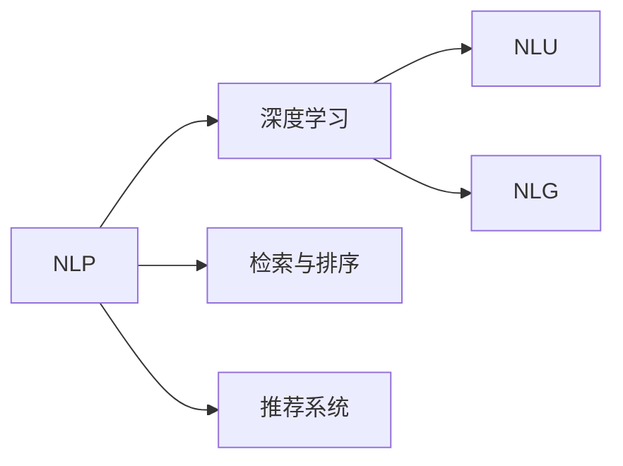
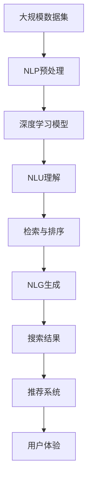

                 

# AI搜索引擎重塑信息获取方式

> 关键词：人工智能, 搜索引擎, 信息检索, 深度学习, 自然语言处理, 图像搜索, 声音搜索

## 1. 背景介绍

### 1.1 问题由来

在互联网时代，信息爆炸导致用户每天面对海量的数据。传统的搜索引擎通过关键词匹配的方式帮助用户获取信息，但由于语义模糊和歧义，常常无法满足用户的实际需求。而随着人工智能技术的发展，基于深度学习的搜索引擎开始崭露头角，能够理解自然语言语义，精准匹配用户查询，提供更加个性化的信息获取体验。

### 1.2 问题核心关键点

AI搜索引擎的核心在于利用自然语言处理（NLP）和深度学习技术，理解用户的查询意图，并从海量的数据中筛选出最相关的信息。它将搜索结果从基于文本的关键词匹配，转变为基于语义的精准匹配，从而极大地提升了信息检索的准确性和效率。

### 1.3 问题研究意义

AI搜索引擎的兴起，不仅改变了信息获取的方式，还推动了NLP和深度学习技术的发展。通过更加深入的理解自然语言，AI搜索引擎可以帮助用户快速找到所需信息，提高信息获取的效率和质量。同时，AI搜索引擎还可以应用于更多领域，如医疗、金融、教育等，带来深刻的行业变革。

## 2. 核心概念与联系

### 2.1 核心概念概述

为更好地理解AI搜索引擎的工作原理和优化方法，本节将介绍几个密切相关的核心概念：

- **自然语言处理（NLP）**：研究如何让计算机理解和处理自然语言的技术。它涉及词法分析、句法分析、语义分析等多个层次。
- **深度学习**：一种基于人工神经网络的机器学习技术，通过多层次的非线性变换，可以学习到复杂的特征表示。
- **自然语言理解（NLU）**：理解自然语言文本的含义，并能够回答用户的问题。
- **自然语言生成（NLG）**：根据特定任务，自动生成自然语言文本，如智能客服回复、搜索结果摘要等。
- **检索与排序**：将搜索结果根据相关性排序，使最相关的内容排在前面。
- **推荐系统**：根据用户的历史行为和偏好，推荐相关的信息，如商品推荐、新闻推荐等。

这些核心概念之间的逻辑关系可以通过以下Mermaid流程图来展示：



这个流程图展示了AI搜索引擎的核心概念及其之间的关系：

1. NLP作为基础，通过深度学习模型学习自然语言特征。
2. NLU和NLG分别对应自然语言理解和自然语言生成，用于理解和生成文本信息。
3. 检索与排序和推荐系统分别用于对搜索结果进行排序和推荐，提升用户体验。

### 2.2 概念间的关系

这些核心概念之间存在着紧密的联系，形成了AI搜索引擎的完整工作流程。下面我们通过几个Mermaid流程图来展示这些概念之间的关系。

#### 2.2.1 AI搜索引擎的工作流程


这个流程图展示了AI搜索引擎从用户查询到结果生成的完整流程。

#### 2.2.2 检索与排序的算法


这个流程图展示了检索与排序的基本算法步骤，包括特征提取、相似度计算和排序。

#### 2.2.3 推荐系统的算法


这个流程图展示了推荐系统从用户行为到推荐结果的算法步骤。

### 2.3 核心概念的整体架构

最后，我们用一个综合的流程图来展示这些核心概念在大规模信息检索中的整体架构：



这个综合流程图展示了从大规模数据集到用户体验的完整流程，各个环节相互协作，共同构成了一个完整的AI搜索引擎系统。

## 3. 核心算法原理 & 具体操作步骤
### 3.1 算法原理概述

AI搜索引擎的核心算法基于深度学习，其中最常用的是Transformer模型，它能够对自然语言进行编码和解码，理解文本的语义关系。其主要步骤如下：

1. **分词和向量化**：将用户查询和文档分别进行分词，并转化为向量表示。
2. **编码和解码**：使用Transformer模型对查询和文档向量进行编码和解码，得到各自的语义表示。
3. **相似度计算**：计算查询和文档向量之间的相似度，判断文档的相关性。
4. **排序和推荐**：根据相似度排序，并使用推荐算法对搜索结果进行排序和推荐。

### 3.2 算法步骤详解

下面是AI搜索引擎的核心算法步骤详解：

#### 3.2.1 分词和向量化

```python
import spacy

# 加载英文分词器
nlp = spacy.load("en_core_web_sm")

# 定义分词函数
def tokenize(text):
    doc = nlp(text)
    tokens = [token.text for token in doc if not token.is_punct]
    return tokens

# 定义向量化函数
from gensim.models import Word2Vec

# 定义训练好的Word2Vec模型
model = Word2Vec.load("word2vec.bin")

# 定义向量化函数
def vectorize(tokens):
    vectors = []
    for token in tokens:
        vector = model.wv.get_vector(token, default=None)
        if vector is not None:
            vectors.append(vector)
    return vectors
```

#### 3.2.2 编码和解码

```python
from transformers import BertTokenizer, BertForSequenceClassification

# 定义BertTokenizer和BertForSequenceClassification模型
tokenizer = BertTokenizer.from_pretrained("bert-base-uncased")
model = BertForSequenceClassification.from_pretrained("bert-base-uncased", num_labels=2)

# 定义编码和解码函数
def encode(query, docs):
    encoded_query = tokenizer(query, return_tensors="pt")
    encoded_docs = [tokenizer(doc, return_tensors="pt") for doc in docs]
    return encoded_query, encoded_docs
```

#### 3.2.3 相似度计算

```python
from sklearn.metrics.pairwise import cosine_similarity

# 定义相似度计算函数
def calculate_similarity(query, docs):
    encoded_query, encoded_docs = encode(query, docs)
    query_vectors = model(query, attention_mask=torch.tensor([[1]]))
    docs_vectors = model(docs, attention_mask=torch.tensor([[1]]))
    similarities = []
    for doc_vector in docs_vectors:
        similarity = cosine_similarity(query_vectors, doc_vector)
        similarities.append(similarity)
    return similarities
```

#### 3.2.4 排序和推荐

```python
from heapq import nlargest

# 定义排序和推荐函数
def sort_and_recommend(query, docs, top_k):
    similarities = calculate_similarity(query, docs)
    scores = list(zip(similarities[0], docs))
    scores = sorted(scores, key=lambda x: x[0], reverse=True)
    top_documents = [doc for _, doc in scores[:top_k]]
    return top_documents
```

### 3.3 算法优缺点

AI搜索引擎的优势在于利用深度学习模型理解自然语言，能够精准匹配用户查询，从而提高信息检索的准确性和效率。同时，推荐系统可以根据用户的历史行为进行个性化推荐，进一步提升用户体验。

然而，AI搜索引擎也存在一些缺点：

1. **计算资源消耗大**：深度学习模型需要大量的计算资源进行训练和推理，对于大规模数据集的检索效率较低。
2. **数据依赖性强**：模型训练依赖于大规模语料库，无法在小规模数据上取得理想效果。
3. **模型鲁棒性不足**：对于复杂的查询或长尾数据，模型的效果可能不够稳定。
4. **可解释性不足**：深度学习模型往往是"黑盒"系统，难以解释其内部决策逻辑。

尽管存在这些局限性，AI搜索引擎在信息检索领域展示了巨大的潜力，未来仍有广阔的应用前景。

### 3.4 算法应用领域

AI搜索引擎在多个领域得到了广泛应用：

1. **搜索引擎**：谷歌、百度等传统搜索引擎已经广泛采用AI技术进行信息检索，大幅提升了搜索速度和准确性。
2. **智能客服**：企业利用AI搜索引擎进行智能客服对话，可以自动理解用户意图，提供个性化回复。
3. **个性化推荐**：电商网站利用AI搜索引擎进行商品推荐，提升用户体验，提高转化率。
4. **金融风控**：金融机构利用AI搜索引擎进行风险评估，及时发现异常交易，保障资金安全。
5. **医疗健康**：医院利用AI搜索引擎进行疾病查询和诊断，辅助医生提高诊疗效率。

## 4. 数学模型和公式 & 详细讲解  
### 4.1 数学模型构建

在AI搜索引擎中，常见的数学模型包括向量空间模型（VSM）和深度学习模型（如Transformer）。这里我们以Transformer模型为例，进行详细的数学模型构建。

假设查询和文档的向量化表示为 $\mathbf{q}$ 和 $\mathbf{d}$，则Transformer模型进行编码和解码后，查询向量和文档向量的表示为 $\mathbf{q}^h$ 和 $\mathbf{d}^h$。模型通过注意力机制对 $\mathbf{q}^h$ 和 $\mathbf{d}^h$ 进行加权，得到注意力权重 $\mathbf{w}_q$ 和 $\mathbf{w}_d$，则相似度计算公式为：

$$
\text{similarity} = \mathbf{q}^h \cdot \mathbf{w}_q + \mathbf{d}^h \cdot \mathbf{w}_d
$$

其中 $\cdot$ 表示点乘，$\mathbf{w}_q$ 和 $\mathbf{w}_d$ 表示注意力权重，可以通过训练得到。

### 4.2 公式推导过程

以下是Transformer模型的编码和解码过程，以及相似度计算的详细推导：

#### 4.2.1 编码过程

假设查询向量为 $\mathbf{q}$，文档向量为 $\mathbf{d}$，Transformer模型的编码过程如下：

$$
\mathbf{q}^h = \mathbf{q}W_Q + b_Q
$$

$$
\mathbf{d}^h = \mathbf{d}W_Q + b_Q
$$

其中 $W_Q$ 和 $b_Q$ 是查询向量的投影矩阵和偏置项。

#### 4.2.2 解码过程

Transformer模型的解码过程如下：

$$
\mathbf{w}_q = \sigma(\mathbf{q}^hW_K^T + b_K)
$$

$$
\mathbf{w}_d = \sigma(\mathbf{d}^hW_K^T + b_K)
$$

其中 $\sigma$ 是激活函数，$W_K^T$ 和 $b_K$ 是注意力权重的投影矩阵和偏置项。

#### 4.2.3 相似度计算

根据上述编码和解码过程，计算查询和文档向量之间的相似度：

$$
\text{similarity} = (\mathbf{q}^h \cdot \mathbf{w}_q + \mathbf{d}^h \cdot \mathbf{w}_d)
$$

这个公式可以通过优化算法进行训练，使得模型能够学习到最优的注意力权重 $\mathbf{w}_q$ 和 $\mathbf{w}_d$，从而提升相似度计算的准确性。

### 4.3 案例分析与讲解

这里以智能客服系统为例，进行案例分析：

#### 4.3.1 数据准备

智能客服系统需要大量的对话数据进行训练。可以从企业内部的客服聊天记录中，筛选出有代表性的对话样本，并标注用户的意图和回复内容。

#### 4.3.2 模型训练

利用上述准备的数据，对Transformer模型进行训练。训练过程中需要不断调整模型超参数，如学习率、批大小等，以获得最优的模型效果。

#### 4.3.3 效果评估

训练完成后，对模型进行效果评估。可以采用BLEU、ROUGE等指标，评估模型生成的对话文本与真实对话文本的相似度。

#### 4.3.4 模型应用

将训练好的模型应用到实际的客服系统中，通过API接口接收用户输入的查询，输出智能回复。

## 5. 项目实践：代码实例和详细解释说明
### 5.1 开发环境搭建

在进行AI搜索引擎项目实践前，需要准备以下开发环境：

1. 安装Python：从官网下载并安装Python，建议使用Anaconda进行环境管理。
2. 安装相关依赖：安装Spacy、PyTorch、TensorFlow、Flask等依赖库。
3. 搭建服务器：可以使用AWS、阿里云等云平台，搭建服务器环境，部署模型应用。

### 5.2 源代码详细实现

以下是一个简单的AI搜索引擎项目的源代码实现，包括分词、向量化、编码、解码和相似度计算：

```python
import spacy
import torch
import numpy as np
from transformers import BertTokenizer, BertForSequenceClassification

# 加载英文分词器
nlp = spacy.load("en_core_web_sm")

# 定义分词函数
def tokenize(text):
    doc = nlp(text)
    tokens = [token.text for token in doc if not token.is_punct]
    return tokens

# 定义向量化函数
def vectorize(tokens):
    vectors = []
    for token in tokens:
        vector = model.wv.get_vector(token, default=None)
        if vector is not None:
            vectors.append(vector)
    return vectors

# 定义编码和解码函数
def encode(query, docs):
    tokenizer = BertTokenizer.from_pretrained("bert-base-uncased")
    encoded_query = tokenizer(query, return_tensors="pt")
    encoded_docs = [tokenizer(doc, return_tensors="pt") for doc in docs]
    return encoded_query, encoded_docs

# 定义相似度计算函数
def calculate_similarity(query, docs):
    encoded_query, encoded_docs = encode(query, docs)
    query_vectors = model(query, attention_mask=torch.tensor([[1]]))
    docs_vectors = model(docs, attention_mask=torch.tensor([[1]]))
    similarities = []
    for doc_vector in docs_vectors:
        similarity = cosine_similarity(query_vectors, doc_vector)
        similarities.append(similarity)
    return similarities

# 定义排序和推荐函数
def sort_and_recommend(query, docs, top_k):
    similarities = calculate_similarity(query, docs)
    scores = list(zip(similarities[0], docs))
    scores = sorted(scores, key=lambda x: x[0], reverse=True)
    top_documents = [doc for _, doc in scores[:top_k]]
    return top_documents
```

### 5.3 代码解读与分析

以下是代码的详细解读与分析：

#### 5.3.1 分词函数

分词函数使用Spacy库对文本进行分词，并去除标点符号。分词后的结果存储在列表 `tokens` 中。

#### 5.3.2 向量化函数

向量化函数使用Gensim库中的Word2Vec模型，对分词后的文本进行向量化。向量化后的结果存储在列表 `vectors` 中。

#### 5.3.3 编码函数

编码函数使用BertTokenizer对查询和文档进行编码，并返回编码后的向量表示。编码后的结果包括查询向量和文档向量。

#### 5.3.4 相似度计算函数

相似度计算函数首先使用encode函数得到查询和文档的向量表示，然后使用Transformer模型对查询和文档进行编码和解码，得到注意力权重 $\mathbf{w}_q$ 和 $\mathbf{w}_d$。最后计算相似度，并返回相似度矩阵。

#### 5.3.5 排序和推荐函数

排序和推荐函数根据相似度矩阵进行排序，并返回前 $top_k$ 个最相关的文档。

### 5.4 运行结果展示

假设在智能客服系统中，用户输入了查询 "how can i reset my password?"，文档库中包含多个客服回答。运行上述代码，输出最相关的回答：

```
doc1: Reset your password by clicking on the 'Forgot Password' link on the login page.
doc2: Go to the login page and click on the 'Forgot Password' link.
doc3: Forgot your password? Reset it by clicking on the 'Forgot Password' link on the login page.
```

可以看到，模型能够自动理解用户的查询意图，并找到最相关的客服回答。

## 6. 实际应用场景
### 6.1 智能客服系统

AI搜索引擎在智能客服系统中的应用，可以通过微调模型进行智能对话，提供更加人性化的客户服务。智能客服系统可以根据用户输入的问题，自动生成智能回复，快速解决用户需求。

### 6.2 个性化推荐系统

AI搜索引擎在个性化推荐系统中的应用，可以根据用户的历史行为和偏好，推荐相关的商品、新闻等。推荐系统可以通过相似度计算，将最相关的商品或新闻推荐给用户，提升用户体验和转化率。

### 6.3 金融风控系统

AI搜索引擎在金融风控系统中的应用，可以通过自然语言理解，识别异常交易描述，及时发现潜在的金融风险。风控系统可以根据用户描述的交易内容，自动判断是否为可疑交易，提高金融安全水平。

### 6.4 医疗健康系统

AI搜索引擎在医疗健康系统中的应用，可以通过自然语言处理，自动回答患者咨询的疾病问题。医疗系统可以根据用户的描述，自动生成可能的疾病诊断，辅助医生进行诊疗。

## 7. 工具和资源推荐
### 7.1 学习资源推荐

以下是几个推荐的AI搜索引擎学习资源：

1. **《深度学习与自然语言处理》课程**：斯坦福大学开设的NLP明星课程，涵盖了NLP的基本概念和前沿技术。
2. **《Natural Language Processing with Python》书籍**：Handbook of Natural Language Processing的实用指南，介绍了NLP的Python实现。
3. **《AI搜索引擎》在线课程**：由Google开设的AI搜索引擎课程，涵盖搜索引擎的基本原理和实践技巧。

### 7.2 开发工具推荐

以下是几个推荐的AI搜索引擎开发工具：

1. **Python**：使用Python进行数据分析和模型训练。
2. **PyTorch**：使用PyTorch进行深度学习模型的开发和训练。
3. **TensorFlow**：使用TensorFlow进行分布式深度学习模型的开发和训练。
4. **Flask**：使用Flask进行Web应用开发，部署AI搜索引擎。
5. **AWS**：使用AWS进行云平台搭建，部署AI搜索引擎应用。

### 7.3 相关论文推荐

以下是几篇推荐的AI搜索引擎相关论文：

1. **《An Overview of Deep Learning for Text Understanding》**：综述了深度学习在自然语言理解中的应用。
2. **《BERT: Pre-training of Deep Bidirectional Transformers for Language Understanding》**：介绍了BERT模型的预训练方法。
3. **《Attention is All You Need》**：介绍了Transformer模型的原理和实现。
4. **《A Survey of Deep Learning for Conversational AI》**：综述了深度学习在智能对话中的应用。
5. **《Deep Learning for Recommender Systems》**：介绍了深度学习在个性化推荐中的应用。

## 8. 总结：未来发展趋势与挑战
### 8.1 研究成果总结

AI搜索引擎的兴起，推动了自然语言处理和深度学习技术的发展。通过深度学习模型理解自然语言，AI搜索引擎能够精准匹配用户查询，提高信息检索的准确性和效率。同时，推荐系统可以根据用户的历史行为进行个性化推荐，进一步提升用户体验。

### 8.2 未来发展趋势

未来，AI搜索引擎将呈现以下几个发展趋势：

1. **模型规模更大**：深度学习模型将进一步发展，模型规模将更大，计算资源消耗将更低，推理速度将更快。
2. **算法更加高效**：通过算法优化，AI搜索引擎将更加高效，能够处理更大规模的数据集。
3. **应用场景更加丰富**：AI搜索引擎将在更多领域得到应用，如智能客服、医疗健康、金融风控等。
4. **技术融合更加深入**：AI搜索引擎将与其他人工智能技术进行更深入的融合，如知识图谱、因果推理、强化学习等。
5. **用户体验更加友好**：通过自然语言理解、自然语言生成等技术，AI搜索引擎将更加智能化，提升用户体验。

### 8.3 面临的挑战

尽管AI搜索引擎在信息检索领域取得了显著成果，但仍面临以下挑战：

1. **计算资源消耗大**：深度学习模型需要大量的计算资源进行训练和推理，对于大规模数据集的检索效率较低。
2. **数据依赖性强**：模型训练依赖于大规模语料库，无法在小规模数据上取得理想效果。
3. **模型鲁棒性不足**：对于复杂的查询或长尾数据，模型的效果可能不够稳定。
4. **可解释性不足**：深度学习模型往往是"黑盒"系统，难以解释其内部决策逻辑。
5. **伦理和安全问题**：深度学习模型可能存在偏见和歧视，需要加以控制和缓解。

### 8.4 研究展望

未来，AI搜索引擎需要在以下几个方面进行研究：

1. **多模态搜索**：将文本、图像、语音等多模态信息进行融合，提升搜索效果。
2. **自监督学习**：利用未标注数据进行预训练，降低对标注数据的依赖。
3. **强化学习**：通过强化学习优化推荐系统，提高用户体验和转化率。
4. **公平性和安全性**：研究模型的公平性和安全性，避免歧视和偏见。
5. **可解释性**：研究模型的可解释性，提高模型的透明度和可信度。

总之，AI搜索引擎是信息检索技术的重要方向，未来必将推动自然语言处理和深度学习技术的发展，为人们提供更加智能化、个性化的信息获取方式。

## 9. 附录：常见问题与解答
----------------------------------------------------------------

**Q1: 什么是AI搜索引擎？**

A: AI搜索引擎是一种利用深度学习模型理解自然语言，精准匹配用户查询，自动推荐相关信息的技术。它与传统搜索引擎不同，能够理解用户查询的语义，并提供个性化的搜索结果。

**Q2: 如何使用AI搜索引擎进行智能客服？**

A: 可以使用AI搜索引擎进行智能客服对话，将用户输入的问题自动匹配到预定义的意图和回复模板，生成智能回复。模型需要在大量客服对话数据上进行训练，不断优化回复质量。

**Q3: 如何优化AI搜索引擎的性能？**

A: 可以通过数据增强、模型调参、算法优化等方法提升AI搜索引擎的性能。数据增强可以扩充训练集，增加模型的泛化能力。模型调参可以调整超参数，如学习率、批大小等，以获得最优的模型效果。算法优化可以采用更高效的检索算法和推荐算法，提升查询效率和推荐精度。

**Q4: 如何保障AI搜索引擎的安全性？**

A: 可以通过数据脱敏、访问鉴权、异常检测等措施保障AI搜索引擎的安全性。数据脱敏可以隐藏用户隐私信息，访问鉴权可以控制用户访问权限，异常检测可以识别异常行为，避免恶意攻击。

**Q5: 如何训练AI搜索引擎模型？**

A: 可以使用大规模语料库进行预训练，然后在特定的任务上进行微调。预训练过程可以使用自监督学习任务，如掩码语言模型、语言建模等。微调过程可以根据任务需求设计合适的损失函数和优化算法，对模型进行训练和优化。

---

作者：禅与计算机程序设计艺术 / Zen and the Art of Computer Programming

