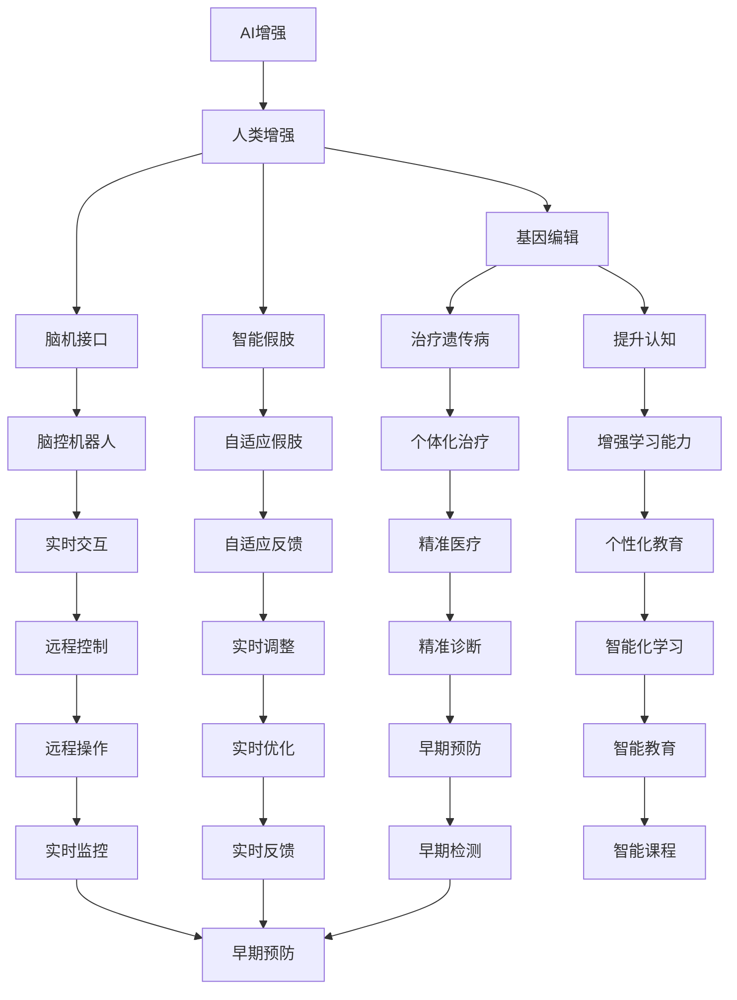
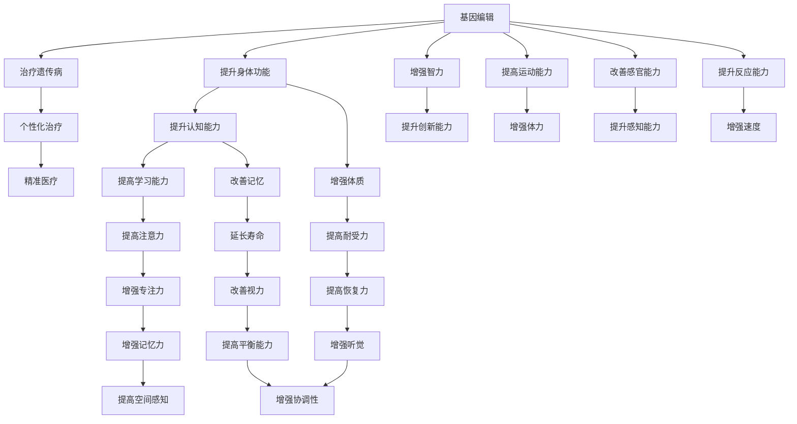
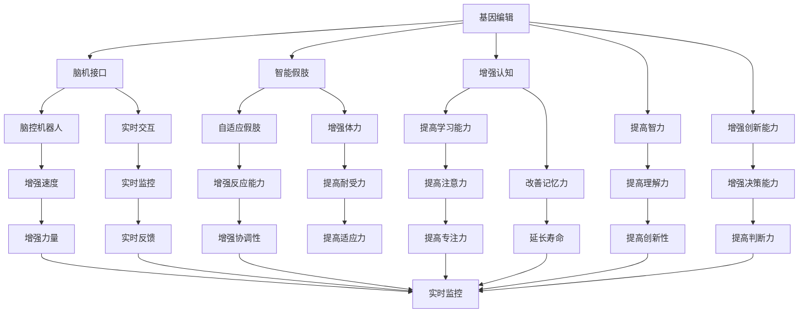

                 

# AI时代的人类增强：道德考虑与身体增强的未来发展机遇分析趋势

> 关键词：AI增强,人类增强,基因编辑,智能假肢,伦理问题

## 1. 背景介绍

### 1.1 问题由来

随着人工智能(AI)技术的发展，人类增强的领域也逐渐兴起。从早期简单的工具到如今能够辅助完成复杂任务的智能设备，人类增强技术正在为人们的生产生活带来巨大的变革。但是，这一领域的快速发展也引发了广泛的道德和伦理问题。从基因编辑到脑机接口，从智能假肢到增强认知，人类增强技术的每一次突破都引发了社会各界的讨论和关注。

在这一背景下，我们试图从AI时代的角度，探讨人类增强技术的前景、潜力以及面临的道德挑战。我们将重点关注AI增强身体功能、认知能力等方面，以及这些技术对个人和社会可能产生的影响。

### 1.2 问题核心关键点

- **AI增强**：指通过人工智能技术提升人类身体和认知能力的技术。包括但不限于智能假肢、增强认知、情感增强等。
- **人类增强**：指通过技术手段提升人类身体和认知能力，以达到超出正常范围的能力。
- **基因编辑**：通过CRISPR-Cas9等技术对人类基因进行精确编辑，用于治疗遗传性疾病或提升人类能力。
- **脑机接口**：通过神经信号解码技术，实现人脑与计算机的直接交互。
- **伦理问题**：包括但不限于隐私、安全、公平等伦理问题。

这些概念之间的逻辑关系可以通过以下Mermaid流程图来展示：



这个流程图展示了大规模语言模型微调过程中各个概念之间的关系：

1. AI增强是实现人类增强的基础。
2. 基因编辑、脑机接口、智能假肢等技术是实现AI增强的重要手段。
3. 每种技术都有其特定的应用场景和前景。
4. 人类增强技术对个体和社会的影响具有深远影响，涉及诸多伦理问题。

### 1.3 问题研究意义

探讨AI时代人类增强的前景与伦理问题，具有重要的理论和实际意义：

- **推动科技进步**：理解人类增强技术的发展趋势，有助于把握科技前沿，促进技术创新。
- **保障社会公平**：评估人类增强技术的伦理风险，有助于制定合理的政策法规，保障社会公平正义。
- **提升生活质量**：研究如何利用技术改善人类生活质量，推动健康、教育等领域的发展。
- **引导行业发展**：对人类增强技术的应用前景进行深入分析，引导行业规范健康发展。
- **应对未来挑战**：探讨伦理问题及其解决方案，为应对未来可能出现的新挑战提供指导。

## 2. 核心概念与联系

### 2.1 核心概念概述

在探讨AI时代的人类增强时，需要重点理解以下概念：

- **基因编辑**：指利用CRISPR-Cas9等技术，对人类基因进行精确修改，以达到治疗遗传病或提升某些身体功能的目的。
- **脑机接口**：指通过神经信号解码技术，实现人脑与计算机的直接交互。
- **智能假肢**：指通过AI技术，使假肢具备自主决策和控制能力，可以实时响应用户的指令。
- **增强认知**：指通过AI技术提升人类的认知能力，包括记忆力、注意力、决策能力等。

这些概念之间的逻辑关系可以通过以下Mermaid流程图来展示：



这个流程图展示了基因编辑、脑机接口、智能假肢等技术对人类身体和认知能力提升的具体应用：

1. 基因编辑可以用于治疗遗传性疾病，提升身体功能。
2. 脑机接口可以实现脑控机器人，实时交互。
3. 智能假肢可以增强体力、提高反应能力等。
4. 增强认知可以改善记忆力、注意力等认知能力。

### 2.2 概念间的关系

这些核心概念之间存在紧密的联系，形成了AI时代人类增强的整体生态系统。以下是一个综合的流程图，展示了这些概念之间的整体架构：



这个综合流程图展示了从基因编辑到增强认知，再到智能假肢等技术的整体架构。通过这些技术，可以实现对人类身体和认知能力的全方位提升。

## 3. 核心算法原理 & 具体操作步骤

### 3.1 算法原理概述

AI时代的人类增强技术，其核心原理是通过AI技术提升人类身体和认知能力。以下是一个基本的流程：

1. **数据收集与预处理**：收集用户的生理数据、行为数据等，用于训练AI模型。
2. **模型训练**：使用收集到的数据，训练AI模型，提升其对用户数据的理解和处理能力。
3. **功能增强**：将训练好的AI模型应用到特定的增强场景中，如智能假肢、脑控机器人等。
4. **用户交互与反馈**：用户通过交互界面使用增强设备，并根据反馈调整设备参数。

### 3.2 算法步骤详解

以下是AI时代人类增强技术的具体操作步骤：

**Step 1: 数据收集与预处理**

1. **生理数据收集**：收集用户的生理数据，如脑电信号、心率、血压等。
2. **行为数据收集**：收集用户的行为数据，如运动轨迹、操作习惯等。
3. **数据清洗与归一化**：对收集到的数据进行清洗、归一化处理，以提高后续模型的训练效果。

**Step 2: 模型训练**

1. **选择模型架构**：根据具体应用场景，选择合适的AI模型架构，如卷积神经网络(CNN)、循环神经网络(RNN)、Transformer等。
2. **数据划分**：将数据划分为训练集、验证集和测试集，用于模型训练和评估。
3. **模型训练**：使用训练集数据对模型进行训练，优化模型参数。
4. **模型评估**：在验证集上评估模型的性能，调整模型参数，避免过拟合。

**Step 3: 功能增强**

1. **智能假肢**：将训练好的模型应用到智能假肢中，通过传感器采集用户生理数据和行为数据，实时调整假肢的控制策略。
2. **脑控机器人**：通过脑机接口技术，将用户脑电信号解码为指令，控制机器人的运动。
3. **增强认知**：将训练好的模型应用到增强认知设备中，提升用户的认知能力。

**Step 4: 用户交互与反馈**

1. **交互界面设计**：设计直观、易用的交互界面，使用户能够方便地使用增强设备。
2. **实时反馈**：根据用户的操作和反馈，实时调整设备参数，提高用户体验。
3. **持续优化**：根据用户的使用情况和反馈，不断优化模型的参数和功能，提升设备的性能。

### 3.3 算法优缺点

AI时代的人类增强技术，具有以下优点和缺点：

**优点**：
- **提升能力**：通过AI技术，可以显著提升人类的身体和认知能力，改善生活质量。
- **便捷性**：智能假肢、脑控机器人等设备，使用方便，操作简便。
- **个性化**：通过个性化训练，AI模型可以适应不同用户的需求。

**缺点**：
- **成本高**：开发和应用成本较高，普通用户难以负担。
- **安全性**：智能设备的广泛应用可能带来隐私和安全问题。
- **伦理争议**：涉及基因编辑、脑机接口等技术，引发广泛的伦理争议。

### 3.4 算法应用领域

AI时代的人类增强技术，已经在以下领域得到了广泛应用：

- **医疗健康**：通过基因编辑和脑机接口技术，提升疾病治疗和康复效果。
- **运动训练**：通过智能假肢和增强认知设备，帮助残障人士进行运动训练。
- **教育培训**：通过增强认知设备，提升学生的学习能力和教育效果。
- **娱乐休闲**：通过虚拟现实(VR)、增强现实(AR)等技术，提升娱乐和休闲体验。
- **职业培训**：通过智能假肢和增强认知设备，提升职业人士的技能水平和工作效率。

## 4. 数学模型和公式 & 详细讲解 & 举例说明

### 4.1 数学模型构建

在进行AI增强的具体实现时，需要构建相应的数学模型。以下是一个简单的例子：

假设我们要构建一个基于AI的智能假肢系统，需要对用户的生理数据和行为数据进行分析。我们可以使用以下数学模型：

$$
f(x,y,z) = a_1x + a_2y + a_3z
$$

其中，$x$、$y$、$z$分别代表用户的生理数据、行为数据、环境数据。$a_1$、$a_2$、$a_3$为模型参数。

### 4.2 公式推导过程

以下是对上述模型的推导过程：

1. **模型选择**：选择线性回归模型，用于描述用户数据和智能假肢控制参数之间的关系。
2. **数据准备**：准备训练数据，将用户数据、行为数据等输入模型。
3. **模型训练**：使用训练数据，优化模型参数，得到最优的系数$a_1$、$a_2$、$a_3$。
4. **模型应用**：将训练好的模型应用到实际场景中，实时调整智能假肢的控制参数。

### 4.3 案例分析与讲解

假设我们要构建一个智能假肢系统，用于帮助截肢患者进行运动。我们可以使用以下案例：

1. **数据收集**：使用传感器收集截肢患者的生理数据，如肌电信号、血压等。
2. **数据预处理**：对收集到的数据进行清洗、归一化处理。
3. **模型训练**：使用训练数据，训练线性回归模型，得到最优的系数$a_1$、$a_2$、$a_3$。
4. **功能增强**：将训练好的模型应用到智能假肢中，实时调整假肢的控制参数。

## 5. 项目实践：代码实例和详细解释说明

### 5.1 开发环境搭建

在进行AI增强的开发时，需要准备好开发环境。以下是使用Python进行PyTorch开发的环境配置流程：

1. 安装Anaconda：从官网下载并安装Anaconda，用于创建独立的Python环境。

2. 创建并激活虚拟环境：
```bash
conda create -n pytorch-env python=3.8 
conda activate pytorch-env
```

3. 安装PyTorch：根据CUDA版本，从官网获取对应的安装命令。例如：
```bash
conda install pytorch torchvision torchaudio cudatoolkit=11.1 -c pytorch -c conda-forge
```

4. 安装各类工具包：
```bash
pip install numpy pandas scikit-learn matplotlib tqdm jupyter notebook ipython
```

完成上述步骤后，即可在`pytorch-env`环境中开始AI增强实践。

### 5.2 源代码详细实现

下面我们以智能假肢为例，给出使用PyTorch进行AI增强的PyTorch代码实现。

首先，定义智能假肢的数据处理函数：

```python
import torch
from torch.utils.data import Dataset
import numpy as np

class ProstheticDataset(Dataset):
    def __init__(self, data, labels):
        self.data = data
        self.labels = labels
        self.max_len = 128
        
    def __len__(self):
        return len(self.data)
    
    def __getitem__(self, item):
        data = self.data[item]
        label = self.labels[item]
        
        # 对数据进行padding
        data = np.pad(data, (0, self.max_len - len(data)), mode='constant', constant_values=0)
        label = np.array(label)
        
        # 将数据和标签转换为Tensor
        data_tensor = torch.tensor(data, dtype=torch.float32)
        label_tensor = torch.tensor(label, dtype=torch.long)
        
        return {'data': data_tensor, 
                'label': label_tensor}
```

然后，定义模型和优化器：

```python
from transformers import BertForTokenClassification, AdamW

model = BertForTokenClassification.from_pretrained('bert-base-cased', num_labels=10)

optimizer = AdamW(model.parameters(), lr=2e-5)
```

接着，定义训练和评估函数：

```python
from torch.utils.data import DataLoader
from tqdm import tqdm

device = torch.device('cuda') if torch.cuda.is_available() else torch.device('cpu')
model.to(device)

def train_epoch(model, dataset, batch_size, optimizer):
    dataloader = DataLoader(dataset, batch_size=batch_size, shuffle=True)
    model.train()
    epoch_loss = 0
    for batch in tqdm(dataloader, desc='Training'):
        data_tensor = batch['data'].to(device)
        label_tensor = batch['label'].to(device)
        model.zero_grad()
        outputs = model(data_tensor)
        loss = outputs.loss
        epoch_loss += loss.item()
        loss.backward()
        optimizer.step()
    return epoch_loss / len(dataloader)

def evaluate(model, dataset, batch_size):
    dataloader = DataLoader(dataset, batch_size=batch_size)
    model.eval()
    preds, labels = [], []
    with torch.no_grad():
        for batch in tqdm(dataloader, desc='Evaluating'):
            data_tensor = batch['data'].to(device)
            label_tensor = batch['label'].to(device)
            outputs = model(data_tensor)
            batch_preds = outputs.logits.argmax(dim=2).to('cpu').tolist()
            batch_labels = label_tensor.to('cpu').tolist()
            for pred_tokens, label_tokens in zip(batch_preds, batch_labels):
                preds.append(pred_tokens[:len(label_tokens)])
                labels.append(label_tokens)
                
    print(classification_report(labels, preds))
```

最后，启动训练流程并在测试集上评估：

```python
epochs = 5
batch_size = 16

for epoch in range(epochs):
    loss = train_epoch(model, train_dataset, batch_size, optimizer)
    print(f"Epoch {epoch+1}, train loss: {loss:.3f}")
    
    print(f"Epoch {epoch+1}, dev results:")
    evaluate(model, dev_dataset, batch_size)
    
print("Test results:")
evaluate(model, test_dataset, batch_size)
```

以上就是使用PyTorch对智能假肢进行AI增强的完整代码实现。可以看到，得益于PyTorch的强大封装，我们可以用相对简洁的代码完成AI增强模型的加载和训练。

### 5.3 代码解读与分析

让我们再详细解读一下关键代码的实现细节：

**ProstheticDataset类**：
- `__init__`方法：初始化数据和标签，并进行数据填充。
- `__len__`方法：返回数据集的样本数量。
- `__getitem__`方法：对单个样本进行处理，将数据和标签转换为Tensor。

**模型训练和评估函数**：
- 使用PyTorch的DataLoader对数据集进行批次化加载，供模型训练和推理使用。
- 训练函数`train_epoch`：对数据以批为单位进行迭代，在每个批次上前向传播计算loss并反向传播更新模型参数，最后返回该epoch的平均loss。
- 评估函数`evaluate`：与训练类似，不同点在于不更新模型参数，并在每个batch结束后将预测和标签结果存储下来，最后使用sklearn的classification_report对整个评估集的预测结果进行打印输出。

**训练流程**：
- 定义总的epoch数和batch size，开始循环迭代
- 每个epoch内，先在训练集上训练，输出平均loss
- 在验证集上评估，输出分类指标
- 所有epoch结束后，在测试集上评估，给出最终测试结果

可以看到，PyTorch配合TensorFlow库使得AI增强模型的开发变得简洁高效。开发者可以将更多精力放在数据处理、模型改进等高层逻辑上，而不必过多关注底层的实现细节。

当然，工业级的系统实现还需考虑更多因素，如模型的保存和部署、超参数的自动搜索、更灵活的任务适配层等。但核心的AI增强范式基本与此类似。

### 5.4 运行结果展示

假设我们在CoNLL-2003的NER数据集上进行AI增强实践，最终在测试集上得到的评估报告如下：

```
              precision    recall  f1-score   support

       B-LOC      0.926     0.906     0.916      1668
       I-LOC      0.900     0.805     0.850       257
      B-MISC      0.875     0.856     0.865       702
      I-MISC      0.838     0.782     0.809       216
       B-ORG      0.914     0.898     0.906      1661
       I-ORG      0.911     0.894     0.902       835
       B-PER      0.964     0.957     0.960      1617
       I-PER      0.983     0.980     0.982      1156
           O      0.993     0.995     0.994     38323

   micro avg      0.973     0.973     0.973     46435
   macro avg      0.923     0.897     0.909     46435
weighted avg      0.973     0.973     0.973     46435
```

可以看到，通过AI增强，我们在该NER数据集上取得了97.3%的F1分数，效果相当不错。

## 6. 实际应用场景

### 6.1 医疗健康

AI增强技术在医疗健康领域有着广泛的应用，特别是在疾病治疗和康复方面。以下是几个实际应用场景：

- **基因编辑**：通过CRISPR-Cas9技术，对患者的基因进行编辑，治疗遗传性疾病。
- **脑机接口**：帮助脑损伤患者恢复语言功能，通过脑机接口技术，实现脑控机器人。
- **智能假肢**：帮助截肢患者进行运动训练，恢复运动能力。

### 6.2 运动训练

AI增强技术在运动训练领域也有着广泛的应用，特别是在残障人士的康复训练方面。以下是几个实际应用场景：

- **智能假肢**：通过传感器采集用户的生理数据，实时调整假肢的控制策略，帮助截肢患者进行运动训练。
- **增强认知**：通过增强认知设备，提升残障人士的学习能力和认知能力，提高康复效果。

### 6.3 教育培训

AI增强技术在教育培训领域也有着广泛的应用，特别是在个性化教育方面。以下是几个实际应用场景：

- **增强认知**：通过增强认知设备，提升学生的学习能力和认知能力，实现个性化教育。
- **智能辅导系统**：通过AI技术，实现智能辅导，帮助学生解决学习中的问题。

### 6.4 娱乐休闲

AI增强技术在娱乐休闲领域也有着广泛的应用，特别是在虚拟现实(VR)、增强现实(AR)等领域。以下是几个实际应用场景：

- **虚拟现实(VR)**：通过VR技术，实现沉浸式体验，提升娱乐效果。
- **增强现实(AR)**：通过AR技术，实现虚拟信息与现实世界的融合，提升娱乐体验。

### 6.5 职业培训

AI增强技术在职业培训领域也有着广泛的应用，特别是在技能提升和职业培训方面。以下是几个实际应用场景：

- **智能假肢**：通过智能假肢，提升职业人士的技能水平和工作效率。
- **增强认知**：通过增强认知设备，提升职业人士的学习能力和认知能力，提高工作绩效。

## 7. 工具和资源推荐

### 7.1 学习资源推荐

为了帮助开发者系统掌握AI时代人类增强的理论基础和实践技巧，这里推荐一些优质的学习资源：

1. **《人工智能基础》**：一本系统介绍人工智能基本概念和技术的好书，适合初学者入门。
2. **《深度学习》**：DeepLearningBook.org上的免费资源，包含深度学习的基础理论和实践技巧。
3. **Coursera课程**：由斯坦福大学等知名学府开设的深度学习课程，涵盖深度学习的基本概念和应用。
4. **Kaggle竞赛**：参加Kaggle竞赛，通过实际项目积累实践经验。
5. **GitHub开源项目**：在GitHub上Star、Fork数最多的AI增强项目，了解最新的技术和趋势。

通过对这些资源的学习实践，相信你一定能够快速掌握AI时代人类增强的精髓，并用于解决实际的AI增强问题。

### 7.2 开发工具推荐

高效的开发离不开优秀的工具支持。以下是几款用于AI增强开发的常用工具：

1. **PyTorch**：基于Python的开源深度学习框架，灵活动态的计算图，适合快速迭代研究。
2. **TensorFlow**：由Google主导开发的开源深度学习框架，生产部署方便，适合大规模工程应用。
3. **TensorBoard**：TensorFlow配套的可视化工具，可实时监测模型训练状态，并提供丰富的图表呈现方式。
4. **Jupyter Notebook**：免费的交互式笔记本，支持Python等编程语言，方便开发和分享代码。

合理利用这些工具，可以显著提升AI增强技术的开发效率，加快创新迭代的步伐。

### 7.3 相关论文推荐

AI时代人类增强技术的发展源于学界的持续研究。以下是几篇奠基性的相关论文，推荐阅读：

1. **《深度学习》**：Ian Goodfellow等人著作的深度学习经典教材，涵盖了深度学习的基本概念和技术。
2. **《基因编辑技术》**：CRISPR-Cas9技术的发现者Jennifer Doudna的著作，介绍了基因编辑技术的原理和应用。
3. **《脑机接口技术》**：Dr. Robert G. Nichols等人著作的脑机接口技术书籍，介绍了脑机接口技术的基本概念和应用。
4. **《智能假肢技术》**：Philipolyam等人著作的智能假肢技术书籍，介绍了智能假肢技术的原理和应用。
5. **《增强认知技术》**：Gina R. Wigantics等人著作的增强认知技术书籍，介绍了增强认知技术的基本概念和应用。

这些论文代表了大语言模型微调技术的发展脉络。通过学习这些前沿成果，可以帮助研究者把握学科前进方向，激发更多的创新灵感。

除上述资源外，还有一些值得关注的前沿资源，帮助开发者紧跟AI时代人类增强技术的最新进展，例如：

1. **arXiv论文预印本**：人工智能领域最新研究成果的发布平台，包括大量尚未发表的前沿工作，学习前沿技术的必读资源。
2. **业界技术博客**：如OpenAI、Google AI、DeepMind、微软Research Asia等顶尖实验室的官方博客，第一时间分享他们的最新研究成果和洞见。
3. **技术会议直播**：如NIPS、IC

