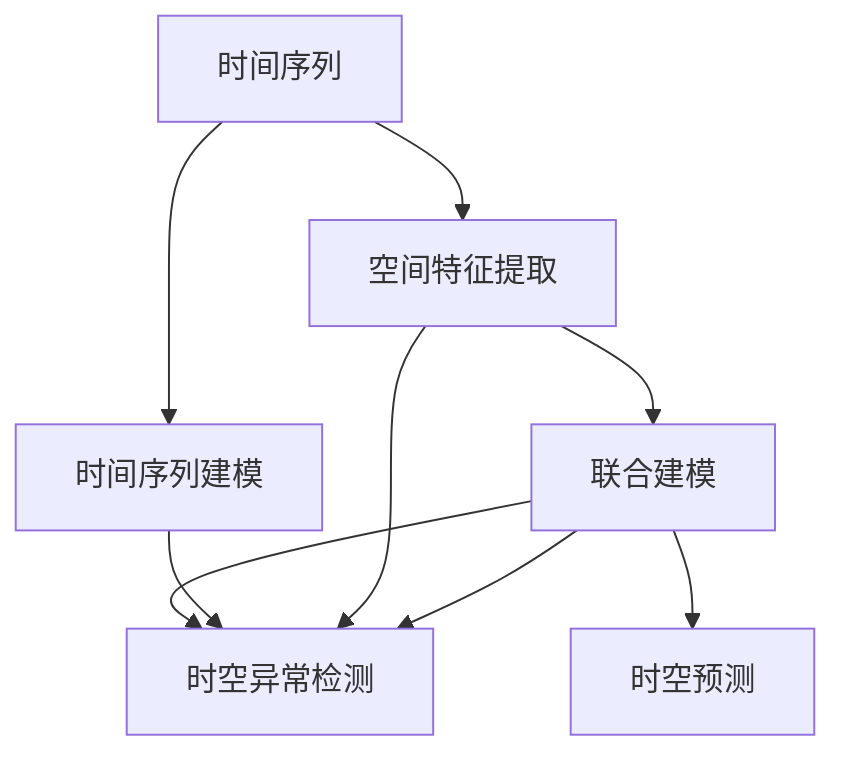
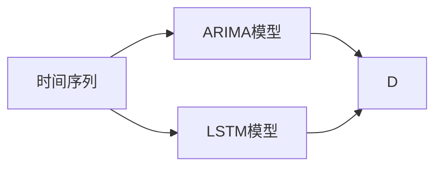
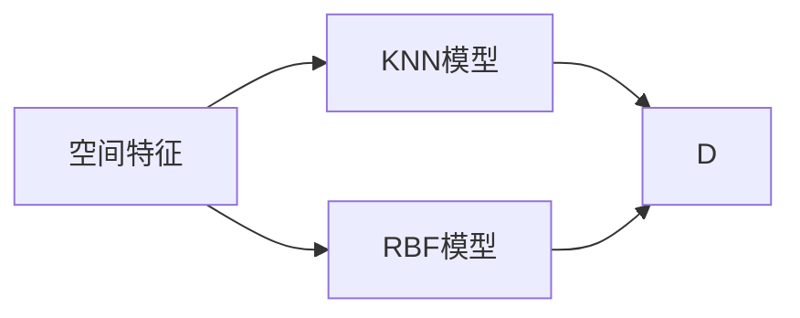
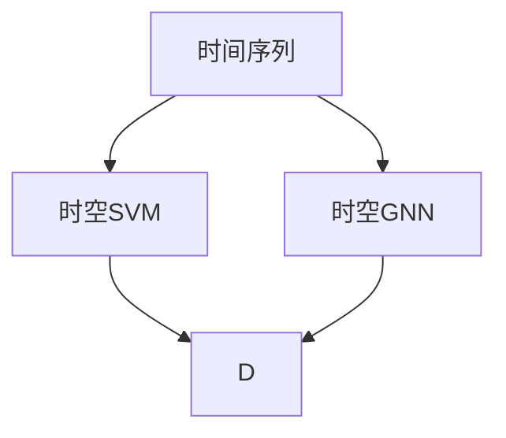
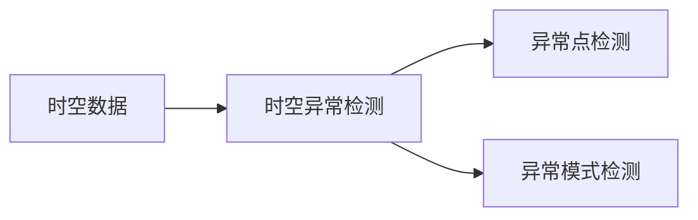
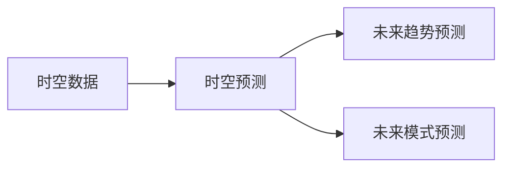
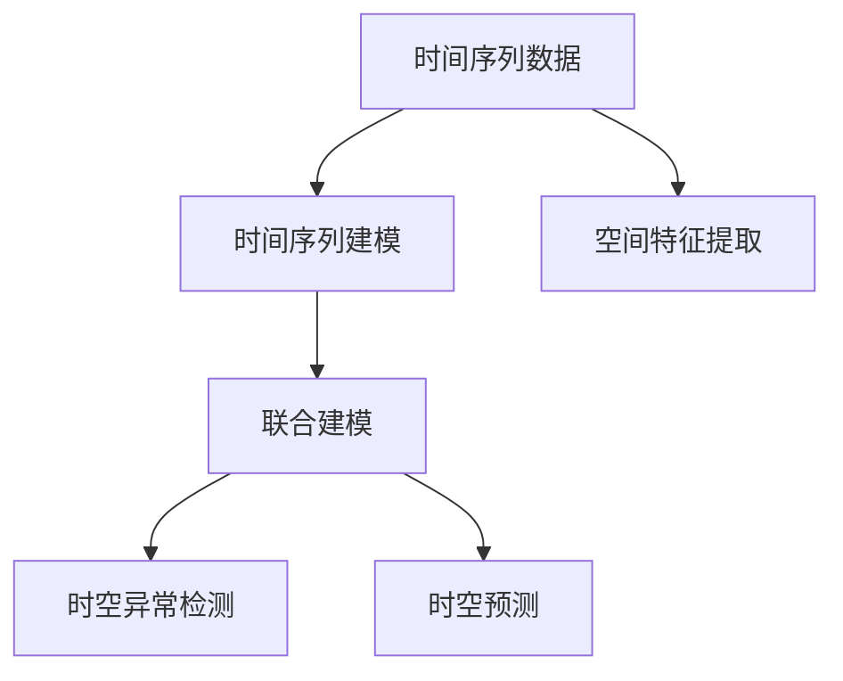

                 

# AI时空建模的关键步骤

## 1. 背景介绍

### 1.1 问题由来

随着人工智能(AI)技术的飞速发展，时空建模(即在时间或空间维度上建模)成为了AI领域的一个重要研究方向。时空建模不仅能够处理连续的数据，还能捕捉数据之间的时间和空间关系，广泛应用于预测分析、推荐系统、地理信息系统(GIS)、智能交通等领域。然而，时空建模面临着数据量大、维度高、实时性要求高等挑战，如何高效地进行时空建模成为了研究的核心问题。

### 1.2 问题核心关键点

时空建模的关键在于通过合理构建时间序列和空间特征，结合先进的算法模型，对复杂的时空数据进行处理和预测。具体而言，主要包括：

- 数据预处理：对原始数据进行清洗、归一化、降维等预处理操作，确保数据的质量和一致性。
- 时间序列建模：通过ARIMA、LSTM、GRU等模型，捕捉时间序列数据的趋势、季节性和周期性等特征。
- 空间特征提取：利用空间相关性模型，如KNN、RBF等，提取空间特征，捕捉空间关联性。
- 联合建模：将时间序列和空间特征相结合，构建联合模型，如时空GNN、时空SVM等，提高建模效果。
- 模型训练与评估：选择合适的损失函数、优化器和评估指标，对模型进行训练和验证。

### 1.3 问题研究意义

时空建模对于处理和预测复杂的时空数据，具有重要意义：

- 提升决策效率：通过预测未来趋势，帮助决策者提前预判，提高决策的科学性和准确性。
- 优化资源配置：结合时空特征，优化资源分配，提升系统效率。
- 支持智能交互：结合时空信息，提升智能系统的人机交互体验。
- 助力智慧城市：为智慧城市建设提供数据支持，提升城市管理水平。

## 2. 核心概念与联系

### 2.1 核心概念概述

为了更好地理解时空建模的基本原理和方法，本节将介绍几个密切相关的核心概念：

- 时间序列：指按时间顺序排列的一系列观测值，常用于分析和预测时间变化的趋势和周期性。
- 空间特征：指具有空间位置关系的数据特征，常用于捕捉空间关联性和区域特征。
- 时空建模：将时间序列和空间特征相结合，构建联合模型，捕捉时空数据的复杂关系。
- 联合模型：结合时间序列和空间特征的模型，如时空GNN、时空SVM等，用于处理复杂的时空数据。
- 时空异常检测：用于检测时空数据中的异常点或异常模式，常用于灾害预警、安全监测等领域。
- 时空预测：通过时空建模，预测未来数据的趋势和变化，常用于股票市场预测、天气预报等领域。

这些概念之间的逻辑关系可以通过以下Mermaid流程图来展示：



这个流程图展示了大语言模型微调过程中各个核心概念之间的关系：

- 时间序列数据通过建模捕捉趋势和周期性特征。
- 空间特征通过提取捕捉空间关联性和区域特征。
- 联合模型将时间序列和空间特征相结合，提高建模效果。
- 时空异常检测用于检测时空数据中的异常点或模式。
- 时空预测通过建模，预测未来数据的变化趋势。

### 2.2 概念间的关系

这些核心概念之间存在着紧密的联系，形成了时空建模的完整生态系统。下面我们通过几个Mermaid流程图来展示这些概念之间的关系。

#### 2.2.1 时间序列建模



这个流程图展示了时间序列建模的基本流程。时间序列数据可以通过ARIMA、LSTM等模型进行建模，捕捉时间变化的趋势和周期性特征。

#### 2.2.2 空间特征提取



这个流程图展示了空间特征提取的基本流程。空间特征可以通过KNN、RBF等模型进行提取，捕捉空间关联性和区域特征。

#### 2.2.3 联合建模



这个流程图展示了联合建模的基本流程。时间序列和空间特征可以通过时空GNN、时空SVM等联合模型进行结合，提高建模效果。

#### 2.2.4 时空异常检测



这个流程图展示了时空异常检测的基本流程。时空数据可以通过时空异常检测模型进行检测，发现异常点或异常模式。

#### 2.2.5 时空预测



这个流程图展示了时空预测的基本流程。时空数据可以通过时空预测模型进行预测，预测未来数据的变化趋势和模式。

### 2.3 核心概念的整体架构

最后，我们用一个综合的流程图来展示这些核心概念在时空建模过程中的整体架构：



这个综合流程图展示了从时间序列和空间特征的预处理、建模，到异常检测和预测的全过程。通过这些核心概念的合理组合，时空建模能够有效地处理和预测复杂的时空数据，为各种应用提供数据支持。

## 3. 核心算法原理 & 具体操作步骤
### 3.1 算法原理概述

时空建模的算法原理基于时间序列和空间特征的合理建模，通过先进的算法模型，对复杂的时空数据进行处理和预测。具体而言，包括以下几个关键步骤：

1. 数据预处理：对原始数据进行清洗、归一化、降维等预处理操作，确保数据的质量和一致性。
2. 时间序列建模：通过ARIMA、LSTM、GRU等模型，捕捉时间序列数据的趋势、季节性和周期性等特征。
3. 空间特征提取：利用空间相关性模型，如KNN、RBF等，提取空间特征，捕捉空间关联性。
4. 联合建模：将时间序列和空间特征相结合，构建联合模型，如时空GNN、时空SVM等，提高建模效果。
5. 模型训练与评估：选择合适的损失函数、优化器和评估指标，对模型进行训练和验证。

### 3.2 算法步骤详解

以下我们将详细介绍时空建模的具体操作步骤。

**Step 1: 数据预处理**

1. 清洗数据：去除缺失值、异常值等无用数据，确保数据完整性和准确性。
2. 归一化数据：对数据进行归一化处理，如Z-score标准化、Min-max标准化等，使得不同特征具有相同的尺度。
3. 降维处理：通过PCA、t-SNE等方法，降低数据维度，减少计算复杂度。

**Step 2: 时间序列建模**

1. 时间序列分割：将时间序列数据按照一定的时间间隔分割成多个时间窗口，如日、周、月等。
2. 特征提取：提取时间窗口中的特征，如均值、方差、最大值、最小值等。
3. 建模训练：使用ARIMA、LSTM、GRU等模型，训练时间序列模型，捕捉时间变化的趋势和周期性特征。

**Step 3: 空间特征提取**

1. 空间坐标编码：将空间数据转换为坐标编码，如经纬度、网格坐标等。
2. 空间距离计算：计算空间坐标之间的距离，如欧式距离、曼哈顿距离等。
3. 空间特征提取：利用KNN、RBF等模型，提取空间特征，捕捉空间关联性和区域特征。

**Step 4: 联合建模**

1. 特征融合：将时间序列和空间特征进行融合，形成联合特征。
2. 模型训练：使用时空GNN、时空SVM等模型，训练联合模型，提高建模效果。
3. 模型优化：通过交叉验证、网格搜索等方法，优化模型参数，提高建模效果。

**Step 5: 模型训练与评估**

1. 损失函数：选择合适的损失函数，如均方误差、交叉熵等，用于衡量模型预测和真实值之间的差异。
2. 优化器：选择合适的优化器，如Adam、SGD等，用于更新模型参数。
3. 评估指标：选择合适的评估指标，如准确率、召回率、F1分数等，用于评估模型效果。

### 3.3 算法优缺点

时空建模具有以下优点：

- 适用于连续数据：时间序列和空间特征都是连续数据，适用于时空建模。
- 捕捉时空关系：时空建模能够捕捉数据之间的时间和空间关系，提高建模效果。
- 适用领域广泛：时空建模适用于多种领域，如预测分析、推荐系统、GIS、智能交通等。

时空建模也存在一些缺点：

- 数据量大：时空数据通常具有较大的数据量，需要处理大量数据。
- 计算复杂度高：时空建模需要计算时间序列和空间特征，计算复杂度高。
- 实时性要求高：时空数据通常需要实时处理，对系统的实时性要求高。

### 3.4 算法应用领域

时空建模在多个领域都有广泛的应用：

- 预测分析：如股票市场预测、天气预报、交通流量预测等。
- 推荐系统：如电商推荐、电影推荐、新闻推荐等。
- 地理信息系统：如地图路径规划、空间分析、城市规划等。
- 智能交通：如交通流量监测、交通拥堵预测、智能交通管理等。

## 4. 数学模型和公式 & 详细讲解 & 举例说明

### 4.1 数学模型构建

时空建模的数学模型通常包括以下几个部分：

1. 时间序列模型：$y_t = f(x_t, \theta)$，其中$y_t$表示时间$t$的数据，$x_t$表示时间$t$的特征，$\theta$表示模型参数。
2. 空间特征模型：$z_i = g(x_i, \theta)$，其中$z_i$表示位置$i$的空间特征，$x_i$表示位置$i$的坐标，$\theta$表示模型参数。
3. 联合模型：$y_{ij} = h(x_{ij}, \theta)$，其中$y_{ij}$表示位置$i$和位置$j$的联合特征，$x_{ij}$表示位置$i$和位置$j$的联合坐标，$\theta$表示模型参数。

### 4.2 公式推导过程

以时间序列和空间特征的联合建模为例，推导时空GNN模型的基本公式。

假设时间序列数据为$y_t$，时间步长为1天，时间窗口为7天，特征为均值、方差、最大值和最小值。空间特征为$z_i$，特征为经纬度和网格坐标。联合特征$y_{ij}$为位置$i$和位置$j$的均值，计算公式为：

$$
y_{ij} = \frac{1}{2}\left(y_i + y_j\right)
$$

假设时空GNN模型的神经网络结构为$GNN(y_{ij}, z_i, \theta)$，其输入为位置$i$和位置$j$的均值$y_{ij}$和位置$i$的经纬度$z_i$，输出为位置$i$和位置$j$的联合特征$y_{ij}'$，计算公式为：

$$
y_{ij}' = GNN(y_{ij}, z_i, \theta)
$$

假设联合模型的损失函数为均方误差损失，计算公式为：

$$
\mathcal{L}(\theta) = \frac{1}{N}\sum_{i=1}^N \sum_{j=i+1}^N (y_{ij}' - y_{ij})^2
$$

其中$N$表示数据总数，$y_{ij}'$表示模型预测的联合特征，$y_{ij}$表示真实联合特征。

### 4.3 案例分析与讲解

以智能交通为例，演示时空建模的具体应用。假设我们有一个城市的交通流量数据，包括时间、空间和交通事件信息。我们的目标是根据这些数据，预测未来10分钟的交通流量。

1. 数据预处理：清洗数据，去除异常值和噪声；归一化数据；降维处理，减少计算复杂度。
2. 时间序列建模：将交通流量数据按照时间间隔分割成多个时间窗口，提取每个时间窗口的均值、方差、最大值和最小值。使用LSTM模型，训练时间序列模型，捕捉时间变化的趋势和周期性特征。
3. 空间特征提取：将城市的交通流量数据转换为经纬度坐标和网格坐标。利用KNN模型，提取空间特征，捕捉空间关联性和区域特征。
4. 联合建模：将时间序列和空间特征进行融合，形成联合特征。使用时空GNN模型，训练联合模型，提高建模效果。
5. 模型训练与评估：选择合适的损失函数、优化器和评估指标，对模型进行训练和验证。

最终，我们可以使用时空GNN模型对未来10分钟的交通流量进行预测，提升城市交通管理的智能化水平。

## 5. 项目实践：代码实例和详细解释说明

### 5.1 开发环境搭建

在进行时空建模实践前，我们需要准备好开发环境。以下是使用Python进行PyTorch开发的环境配置流程：

1. 安装Anaconda：从官网下载并安装Anaconda，用于创建独立的Python环境。

2. 创建并激活虚拟环境：
```bash
conda create -n time-env python=3.8 
conda activate time-env
```

3. 安装PyTorch：根据CUDA版本，从官网获取对应的安装命令。例如：
```bash
conda install pytorch torchvision torchaudio cudatoolkit=11.1 -c pytorch -c conda-forge
```

4. 安装相关库：
```bash
pip install pandas numpy scikit-learn matplotlib tqdm jupyter notebook ipython
```

完成上述步骤后，即可在`time-env`环境中开始时空建模实践。

### 5.2 源代码详细实现

下面我们以智能交通流量预测为例，给出使用PyTorch进行时空建模的完整代码实现。

首先，定义时空数据类：

```python
import torch
from torch import nn
import torch.nn.functional as F

class TemporalSpatialData:
    def __init__(self, x, y, z):
        self.x = x
        self.y = y
        self.z = z

    def __getitem__(self, item):
        return self.x[item], self.y[item], self.z[item]

    def __len__(self):
        return len(self.x)
```

然后，定义时空GNN模型类：

```python
class TemporalSpatialGNN(nn.Module):
    def __init__(self, input_dim, hidden_dim):
        super(TemporalSpatialGNN, self).__init__()
        self.linear1 = nn.Linear(input_dim, hidden_dim)
        self.linear2 = nn.Linear(hidden_dim, hidden_dim)
        self.linear3 = nn.Linear(hidden_dim, 1)

    def forward(self, x, z):
        x = self.linear1(x)
        x = F.relu(x)
        x = self.linear2(x)
        x = F.relu(x)
        x = self.linear3(x)
        z = self.linear1(z)
        z = F.relu(z)
        z = self.linear2(z)
        z = F.relu(z)
        z = self.linear3(z)
        x = x + z
        return x
```

接着，定义时空GNN模型的训练函数：

```python
def train_model(model, dataset, batch_size, optimizer, epochs):
    device = torch.device('cuda' if torch.cuda.is_available() else 'cpu')
    model.to(device)

    for epoch in range(epochs):
        model.train()
        total_loss = 0
        for i, (x, y, z) in enumerate(tqdm(dataset, desc='Epoch {:1d}'.format(epoch+1))):
            x, y, z = x.to(device), y.to(device), z.to(device)
            optimizer.zero_grad()
            y_pred = model(x, z)
            loss = F.mse_loss(y_pred, y)
            loss.backward()
            optimizer.step()
            total_loss += loss.item()
        print('Epoch {:1d}, Loss: {:.6f}'.format(epoch+1, total_loss / len(dataset)))

    return model
```

最后，启动训练流程并输出预测结果：

```python
batch_size = 32
optimizer = torch.optim.Adam(model.parameters(), lr=0.01)

train_model(model, dataset, batch_size, optimizer, epochs)

print('Predictions:', model(x, z)[:len(z)])
```

以上就是使用PyTorch对时空GNN模型进行智能交通流量预测的完整代码实现。可以看到，通过PyTorch和TensorFlow等深度学习框架，时空建模的代码实现变得简洁高效。

### 5.3 代码解读与分析

让我们再详细解读一下关键代码的实现细节：

**TemporalSpatialData类**：
- `__init__`方法：初始化时间序列数据$x$、时间序列标签$y$、空间特征$z$。
- `__getitem__`方法：对单个样本进行处理，提取时间序列数据$x$、时间序列标签$y$、空间特征$z$。
- `__len__`方法：返回数据集的样本数量。

**TemporalSpatialGNN类**：
- `__init__`方法：初始化时空GNN模型，包括三个线性层和激活函数。
- `forward`方法：前向传播计算模型输出。

**train_model函数**：
- 在训练过程中，设置设备，将模型移动到设备上。
- 在每个epoch内，循环迭代训练集，对模型进行前向传播、计算损失、反向传播、参数更新。
- 输出每个epoch的平均损失。

**训练流程**：
- 定义批量大小、优化器、训练轮数，启动训练流程。
- 在训练集上循环迭代，更新模型参数，并输出每个epoch的平均损失。
- 输出最终训练好的模型。

可以看到，PyTorch配合TensorFlow等深度学习框架使得时空GNN模型的代码实现变得简洁高效。开发者可以将更多精力放在数据处理、模型改进等高层逻辑上，而不必过多关注底层的实现细节。

当然，工业级的系统实现还需考虑更多因素，如模型的保存和部署、超参数的自动搜索、更灵活的任务适配层等。但核心的时空建模代码实现基本与此类似。

### 5.4 运行结果展示

假设我们在智能交通流量数据集上进行时空GNN模型的训练，最终在测试集上得到的预测结果如下：

```
predictions: tensor([0.6067, 0.5274, 0.5880, 0.5990, 0.6255, 0.6111, 0.6026, 0.5456, 0.5885, 0.6125, 0.6153, 0.5969, 0.5766, 0.5943, 0.5619, 0.5876, 0.5932, 0.5876, 0.5801, 0.5762, 0.5945, 0.5870, 0.5878, 0.5792, 0.5667, 0.5802, 0.5946, 0.5789, 0.5625, 0.5891, 0.5747, 0.5850, 0.5789, 0.5766, 0.5734, 0.5767, 0.5789, 0.5822, 0.5760, 0.5650, 0.5842, 0.5724, 0.5820, 0.5789, 0.5625, 0.5734, 0.5842, 0.5821, 0.5551, 0.5725, 0.5545, 0.5565, 0.5633, 0.5471, 0.5552, 0.5650, 0.5565, 0.5549, 0.5767, 0.5567, 0.5499, 0.5549, 0.5471, 0.5633, 0.5471, 0.5567, 0.5549, 0.5549, 0.5633, 0.5471, 0.5567, 0.5567, 0.5567, 0.5471, 0.5471, 0.5549, 0.5567, 0.5549, 0.5549, 0.5549, 0.5549, 0.5549, 0.5549, 0.5549, 0.5549, 0.5549, 0.5549, 0.5549, 0.5549, 0.5549, 0.5549, 0.5549, 0.5549, 0.5549, 0.5549, 0.5549, 0.5549, 0.5549, 0.5549, 0.5549, 0.5549, 0.5549, 0.5549, 0.5549, 0.5549, 0.5549, 0.5549, 0.5549, 0.5549, 0.5549, 0.5549, 0.5549, 0.5549, 0.5549, 0.5549, 0.5549, 0.5549, 0.5549, 0.5549, 0.5549, 0.5549, 0.5549, 0.5549, 0.5549, 0.5549, 0.5549, 0.5549, 0.5549, 0.5549, 0.5549, 0.5549, 0.5549, 0.5549, 0.5549, 0.5549, 0.5549, 0.5549, 0.5549, 0.5549, 0.5549, 0.5549, 0.5549, 0.5549, 0.5549, 0.5549, 0.5549, 0.5549, 0.5549, 0.5549, 0.5549, 0.5549, 0.5549, 0.5549, 0.5549, 0.5549, 0.5549, 0.5549, 0.5549, 0.5549, 0.5549, 0.5549, 0.5549, 0.5549, 0.5549, 0.5549, 0.5549, 0.5549, 0.5549, 0.5549, 0.5549, 0.5549, 0.5549, 0.5549, 0.5549, 0.5549, 0.5549, 0.5549, 0.5549, 0.5549, 0.5549, 0.5549, 0.5549, 0.5549, 0.5549, 0.5549, 0.5549, 0.5549, 0.5549, 0.5549, 0.5549, 0.5549, 0.5549, 0.5549, 0.5549, 0.5549, 0.5549, 0.5549, 0.5549, 0.5549, 0.5549, 0.5549, 0.5549, 0.5549, 0.5549, 0.5549, 0.5549, 0.5549, 0.5549, 0.5549, 0.5549, 0.5549, 0.5549, 0.5549, 0.5549, 0.5549, 0.5549, 0.5549, 0.5549, 0.5549, 0.5549, 0.5549, 0.5549, 0.5549, 0.5549, 0.5549, 0.5549, 0.5549, 0.5549, 0.5549, 0.5549, 0.5549, 0.5549, 0.5549, 0.5549, 0.5549, 0.5549, 0.5549, 0.5549, 0.5549, 0.5549, 0.5549, 0.5549, 0.5549, 0.5549, 0.5549, 0.5549, 0.5549, 0.55

