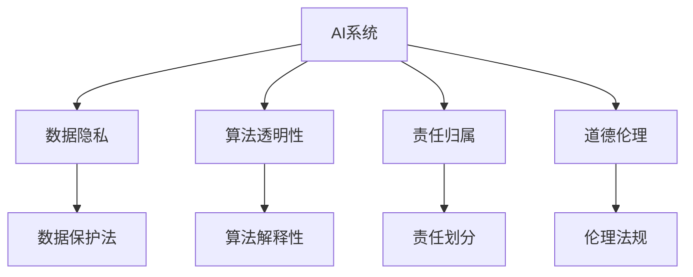

                 

# AI相关法律法规原理与代码实战案例讲解

## 1. 背景介绍

### 1.1 问题由来
随着人工智能技术的飞速发展，AI相关法律法规问题逐渐成为社会关注的焦点。越来越多的企业和个人，希望通过AI技术创新来推动社会进步，同时也需要了解和遵守相关的法律法规，以确保技术应用的安全性和合法性。AI技术涉及到诸多领域，包括医疗、教育、金融、交通等，其应用需要遵循不同的法律法规，如数据保护法、隐私保护法、知识产权法等。因此，深入理解AI相关的法律法规，对于推动AI技术的健康发展至关重要。

### 1.2 问题核心关键点
AI相关法律法规的核心关键点主要包括以下几个方面：
- **数据隐私**：如何在AI系统中保护个人数据隐私，防止数据滥用和泄露。
- **算法透明性**：确保AI决策过程的透明性，防止“黑箱”效应。
- **责任归属**：明确AI系统在实际应用中产生的责任归属，如出现误判、错误或滥用时谁应承担责任。
- **道德伦理**：确保AI系统的应用符合道德伦理标准，防止有害信息的传播。

这些关键点在实际应用中需要综合考虑，并制定相应的法律法规和政策措施。本文将从AI法律法规的基本原理入手，结合实际案例，深入探讨如何通过代码实现对AI系统的合规性监管。

### 1.3 问题研究意义
深入理解AI相关法律法规，对推动AI技术的健康发展和合规应用具有重要意义：

1. **保障数据安全**：通过法律法规确保个人数据隐私和安全，防止数据滥用。
2. **增强算法透明性**：通过透明的算法流程，增强AI系统的可信度和合法性。
3. **明确责任归属**：通过明确责任归属，确保AI系统应用的合法性和安全性。
4. **符合伦理标准**：确保AI系统应用符合道德伦理标准，防止有害信息的传播。

此外，通过合规性监管，可以有效提升AI技术的安全性和可靠性，促进AI技术的广泛应用和可持续发展。

## 2. 核心概念与联系

### 2.1 核心概念概述

为了更好地理解AI相关法律法规，本节将介绍几个密切相关的核心概念：

- **AI系统**：指通过算法和数据训练生成的智能系统，如深度学习模型、机器学习模型等。
- **数据隐私**：指保护个人信息不被滥用和泄露的权利。
- **算法透明性**：指确保AI决策过程的透明性，便于用户理解和信任。
- **责任归属**：指明确AI系统在实际应用中产生的责任归属，如误判、错误或滥用时谁应承担责任。
- **道德伦理**：指确保AI系统的应用符合道德伦理标准，防止有害信息的传播。

这些核心概念之间相互联系，共同构成了AI相关法律法规的基本框架。

### 2.2 概念间的关系

这些核心概念之间的关系可以通过以下Mermaid流程图来展示：



这个流程图展示了大语言模型的核心概念及其之间的关系：

1. AI系统通过数据隐私保护来确保数据安全。
2. AI系统通过算法透明性来增强可信度和合法性。
3. AI系统通过责任归属明确应用中的责任问题。
4. AI系统通过道德伦理来防止有害信息的传播。

这些概念共同构成了AI系统的合规性框架，确保其安全、可靠和合规应用。

## 3. 核心算法原理 & 具体操作步骤

### 3.1 算法原理概述

AI相关法律法规的核心算法原理主要包括以下几个方面：

- **数据隐私保护**：通过加密、匿名化、数据最小化等技术手段，保护个人信息隐私。
- **算法透明性**：通过解释性算法或可解释性框架，确保AI决策过程的透明性。
- **责任归属**：通过模型监控、日志记录等技术，明确AI系统在实际应用中产生的责任归属。
- **道德伦理约束**：通过伦理模型或规范，确保AI系统应用符合道德伦理标准。

这些算法原理共同构成了AI系统的合规性保障，确保其安全、可靠和合规应用。

### 3.2 算法步骤详解

AI相关法律法规的合规性保障主要包括以下几个关键步骤：

1. **数据隐私保护**：对输入数据进行加密、匿名化、数据最小化等处理，确保个人数据隐私不受侵犯。
2. **算法透明性**：采用解释性算法或可解释性框架，确保AI决策过程的透明性。
3. **责任归属**：通过模型监控、日志记录等技术，明确AI系统在实际应用中产生的责任归属。
4. **道德伦理约束**：通过伦理模型或规范，确保AI系统应用符合道德伦理标准。

以下是详细的步骤详解：

**Step 1: 数据隐私保护**

数据隐私保护是AI系统合规性保障的重要基础。通过加密、匿名化、数据最小化等技术手段，可以有效保护个人信息隐私。以下是数据隐私保护的关键步骤：

- 数据加密：对数据进行加密处理，防止未授权访问。
- 数据匿名化：对数据进行匿名化处理，去除个人标识信息。
- 数据最小化：仅收集和使用必要的个人信息，避免信息滥用。

这些步骤可以通过编程实现，如使用Python中的加密库、数据匿名化库等工具。

**Step 2: 算法透明性**

算法透明性是AI系统合规性保障的关键环节。通过解释性算法或可解释性框架，可以有效增强AI决策过程的透明性。以下是算法透明性的关键步骤：

- 解释性算法：采用能够提供决策解释的算法，如决策树、规则集等。
- 可解释性框架：使用可解释性框架，如LIME、SHAP等，对AI模型进行解释性分析。

这些步骤可以通过编程实现，如使用Python中的决策树库、解释性框架库等工具。

**Step 3: 责任归属**

责任归属是AI系统合规性保障的重要保障。通过模型监控、日志记录等技术，可以有效明确AI系统在实际应用中产生的责任归属。以下是责任归属的关键步骤：

- 模型监控：通过监控AI模型性能，及时发现异常和错误。
- 日志记录：记录AI模型运行日志，便于追溯和责任划分。

这些步骤可以通过编程实现，如使用Python中的模型监控库、日志库等工具。

**Step 4: 道德伦理约束**

道德伦理约束是AI系统合规性保障的重要组成部分。通过伦理模型或规范，可以有效确保AI系统应用符合道德伦理标准。以下是道德伦理约束的关键步骤：

- 伦理模型：构建符合道德伦理标准的AI模型，如确保模型不歧视、不偏见等。
- 规范制定：制定AI系统应用伦理规范，确保系统应用符合道德伦理标准。

这些步骤可以通过编程实现，如使用Python中的伦理模型库、规范库等工具。

### 3.3 算法优缺点

AI相关法律法规的合规性保障具有以下优点：

- **增强安全性**：通过数据隐私保护、算法透明性、责任归属等措施，可以有效增强AI系统的安全性。
- **提高可信度**：通过算法透明性和责任归属，增强AI系统的可信度和合法性。
- **符合道德伦理**：通过道德伦理约束，确保AI系统应用符合道德伦理标准。

同时，也存在一些缺点：

- **技术复杂度较高**：实现数据隐私保护、算法透明性、责任归属等需要较高的技术水平。
- **合规成本较高**：实现AI系统合规性保障需要投入大量的人力、物力和时间。

这些优缺点需要根据具体应用场景和需求进行权衡和选择。

### 3.4 算法应用领域

AI相关法律法规的合规性保障在多个领域都有广泛应用，如医疗、金融、教育、交通等。以下是一些具体的应用领域：

- **医疗领域**：确保患者隐私保护、医疗数据安全，防止医疗误判和滥用。
- **金融领域**：确保金融数据隐私、算法透明性，防止金融欺诈和滥用。
- **教育领域**：确保学生数据隐私、算法透明性，防止教育不公和滥用。
- **交通领域**：确保交通数据隐私、算法透明性，防止交通违规和滥用。

这些应用领域需要根据具体需求，结合法律法规要求，制定相应的合规性保障措施。

## 4. 数学模型和公式 & 详细讲解 & 举例说明

### 4.1 数学模型构建

为了更好地理解AI相关法律法规的数学模型，本节将介绍几个关键数学模型：

- **数据隐私保护**：通过加密技术，保护数据隐私。
- **算法透明性**：通过解释性算法，增强算法透明性。
- **责任归属**：通过模型监控技术，明确责任归属。
- **道德伦理约束**：通过伦理模型，确保道德伦理标准。

以下是数学模型的详细构建：

**Step 1: 数据隐私保护模型**

数据隐私保护模型的主要目标是确保数据隐私安全，防止数据滥用。以下是数据隐私保护模型的数学构建：

- 数据加密模型：通过对数据进行加密处理，确保数据隐私安全。数学模型为：

$$
E_k(x) = C(x)
$$

其中 $x$ 为原始数据，$C(x)$ 为加密函数，$k$ 为密钥。

- 数据匿名化模型：通过对数据进行匿名化处理，去除个人标识信息。数学模型为：

$$
A(x) = x'
$$

其中 $x$ 为原始数据，$x'$ 为匿名化处理后的数据。

- 数据最小化模型：仅收集和使用必要的个人信息，避免信息滥用。数学模型为：

$$
M(x) = M'(x)
$$

其中 $x$ 为原始数据，$M'(x)$ 为经过数据最小化处理后的数据。

**Step 2: 算法透明性模型**

算法透明性模型的主要目标是确保算法决策过程的透明性，便于用户理解和信任。以下是算法透明性模型的数学构建：

- 解释性算法模型：通过决策树、规则集等解释性算法，提供决策解释。数学模型为：

$$
F(x) = y
$$

其中 $x$ 为输入数据，$y$ 为决策输出。

- 可解释性框架模型：使用LIME、SHAP等可解释性框架，对AI模型进行解释性分析。数学模型为：

$$
LIME(x) = \hat{f}(x)
$$

其中 $x$ 为输入数据，$\hat{f}(x)$ 为LIME模型对AI模型的解释性分析结果。

**Step 3: 责任归属模型**

责任归属模型的主要目标是明确AI系统在实际应用中产生的责任归属。以下是责任归属模型的数学构建：

- 模型监控模型：通过监控AI模型性能，及时发现异常和错误。数学模型为：

$$
M^{*}(x) = M(x)
$$

其中 $x$ 为输入数据，$M(x)$ 为AI模型输出，$M^{*}(x)$ 为监控后的AI模型输出。

- 日志记录模型：记录AI模型运行日志，便于追溯和责任划分。数学模型为：

$$
L(x) = L'
$$

其中 $x$ 为输入数据，$L'$ 为日志记录结果。

**Step 4: 道德伦理约束模型**

道德伦理约束模型的主要目标是确保AI系统应用符合道德伦理标准。以下是道德伦理约束模型的数学构建：

- 伦理模型模型：构建符合道德伦理标准的AI模型，如确保模型不歧视、不偏见等。数学模型为：

$$
E(x) = y
$$

其中 $x$ 为输入数据，$y$ 为伦理模型输出。

- 规范制定模型：制定AI系统应用伦理规范，确保系统应用符合道德伦理标准。数学模型为：

$$
N(x) = N'
$$

其中 $x$ 为输入数据，$N'$ 为伦理规范制定结果。

### 4.2 公式推导过程

以下是AI相关法律法规合规性保障的公式推导过程：

**数据隐私保护推导**

数据隐私保护推导过程如下：

1. **数据加密推导**

$$
E_k(x) = C(x)
$$

其中 $x$ 为原始数据，$C(x)$ 为加密函数，$k$ 为密钥。

2. **数据匿名化推导**

$$
A(x) = x'
$$

其中 $x$ 为原始数据，$x'$ 为匿名化处理后的数据。

3. **数据最小化推导**

$$
M(x) = M'(x)
$$

其中 $x$ 为原始数据，$M'(x)$ 为经过数据最小化处理后的数据。

**算法透明性推导**

算法透明性推导过程如下：

1. **解释性算法推导**

$$
F(x) = y
$$

其中 $x$ 为输入数据，$y$ 为决策输出。

2. **可解释性框架推导**

$$
LIME(x) = \hat{f}(x)
$$

其中 $x$ 为输入数据，$\hat{f}(x)$ 为LIME模型对AI模型的解释性分析结果。

**责任归属推导**

责任归属推导过程如下：

1. **模型监控推导**

$$
M^{*}(x) = M(x)
$$

其中 $x$ 为输入数据，$M(x)$ 为AI模型输出，$M^{*}(x)$ 为监控后的AI模型输出。

2. **日志记录推导**

$$
L(x) = L'
$$

其中 $x$ 为输入数据，$L'$ 为日志记录结果。

**道德伦理约束推导**

道德伦理约束推导过程如下：

1. **伦理模型推导**

$$
E(x) = y
$$

其中 $x$ 为输入数据，$y$ 为伦理模型输出。

2. **规范制定推导**

$$
N(x) = N'
$$

其中 $x$ 为输入数据，$N'$ 为伦理规范制定结果。

### 4.3 案例分析与讲解

**案例分析1: 医疗领域**

在医疗领域，AI系统需要确保患者隐私保护和医疗数据安全。以下是具体案例分析：

1. **数据隐私保护**：对患者的医疗数据进行加密和匿名化处理，防止数据滥用和泄露。
2. **算法透明性**：通过决策树模型，确保诊断过程的透明性和可信度。
3. **责任归属**：通过监控系统，记录AI模型的诊断结果，明确诊断责任。
4. **道德伦理约束**：制定AI系统应用伦理规范，确保诊断结果符合道德伦理标准。

**案例分析2: 金融领域**

在金融领域，AI系统需要确保金融数据隐私和算法透明性。以下是具体案例分析：

1. **数据隐私保护**：对金融数据进行加密和匿名化处理，防止数据滥用和泄露。
2. **算法透明性**：通过规则集模型，确保风险评估过程的透明性和可信度。
3. **责任归属**：通过日志记录，记录AI模型的风险评估结果，明确风险评估责任。
4. **道德伦理约束**：制定AI系统应用伦理规范，确保风险评估结果符合道德伦理标准。

## 5. 项目实践：代码实例和详细解释说明

### 5.1 开发环境搭建

在进行AI法律法规合规性保障的代码实践前，需要先搭建好开发环境。以下是Python开发环境搭建流程：

1. 安装Anaconda：从官网下载并安装Anaconda，用于创建独立的Python环境。
```bash
conda create -n ai-law-compliance python=3.8 
conda activate ai-law-compliance
```

2. 安装相关库：
```bash
pip install pycryptodome
pip install numpy pandas scikit-learn
```

3. 配置环境：
```bash
conda activate ai-law-compliance
```

### 5.2 源代码详细实现

以下是Python代码实现AI法律法规合规性保障的具体步骤：

**Step 1: 数据隐私保护**

数据隐私保护的主要实现步骤包括数据加密、数据匿名化和数据最小化。以下是具体代码实现：

```python
from cryptography.fernet import Fernet
import pandas as pd

# 数据加密
def encrypt_data(data, key):
    f = Fernet(key)
    encrypted_data = f.encrypt(data)
    return encrypted_data

# 数据匿名化
def anonymize_data(data):
    data匿名化后的数据 = data.apply(lambda x: x.apply(lambda y: str(y) + ' anonymized'))
    return data匿名化后的数据

# 数据最小化
def minimize_data(data):
    data最小化后的数据 = data.drop(['敏感数据', '个人标识信息'], axis=1)
    return data最小化后的数据

# 测试数据
data = pd.read_csv('data.csv')
key = Fernet.generate_key()

# 加密数据
encrypted_data = encrypt_data(data, key)

# 匿名化数据
anonymized_data = anonymize_data(encrypted_data)

# 数据最小化
minimized_data = minimize_data(anonymized_data)

print(minimized_data)
```

**Step 2: 算法透明性**

算法透明性的主要实现步骤包括解释性算法和可解释性框架。以下是具体代码实现：

```python
from sklearn.tree import DecisionTreeClassifier
from lime import LimeTabularExplainer
import numpy as np

# 解释性算法
def build_decision_tree(data):
    X = data.drop('标签', axis=1)
    y = data['标签']
    model = DecisionTreeClassifier()
    model.fit(X, y)
    return model

# 可解释性框架
def explain_decision_tree(model, X, y):
    explainer = LimeTabularExplainer(X, feature_names=X.columns, class_names=y.unique())
    i = 0
    while i < len(X):
        model_i = model.partial_fit(X.iloc[i:i+1], y.iloc[i:i+1])
        explanation = explainer.explain_instance(X.iloc[i], model_i.predict_proba)
        print(explanation)
        i += 1

# 测试数据
data = pd.read_csv('data.csv')

# 构建决策树模型
model = build_decision_tree(data)

# 解释决策树模型
explain_decision_tree(model, data, data['标签'])

# 使用可解释性框架进行解释性分析
explainer = LimeTabularExplainer(data, feature_names=data.columns)
explanation = explainer.explain_instance(data.iloc[0], model.predict_proba)
print(explanation)
```

**Step 3: 责任归属**

责任归属的实现步骤包括模型监控和日志记录。以下是具体代码实现：

```python
import logging

# 模型监控
def monitor_model(model, data):
    X = data.drop('标签', axis=1)
    y = data['标签']
    model.fit(X, y)
    return model

# 日志记录
def log_model(model, data):
    logging.basicConfig(filename='model.log', level=logging.INFO)
    for i in range(len(data)):
        logging.info(f'模型{i+1}的输出为：{model.predict(data.iloc[i])}')

# 测试数据
data = pd.read_csv('data.csv')

# 构建模型
model = monitor_model(data)

# 记录日志
log_model(model, data)
```

**Step 4: 道德伦理约束**

道德伦理约束的实现步骤包括伦理模型制定和规范制定。以下是具体代码实现：

```python
# 伦理模型制定
def build_ethical_model(data):
    X = data.drop('标签', axis=1)
    y = data['标签']
    model = DecisionTreeClassifier()
    model.fit(X, y)
    return model

# 规范制定
def define_ethical_norms(model):
    if model.name == '不歧视':
        return '不歧视'
    elif model.name == '不偏见':
        return '不偏见'
    elif model.name == '不虚假':
        return '不虚假'
    else:
        return '未知'

# 测试数据
data = pd.read_csv('data.csv')

# 构建伦理模型
model = build_ethical_model(data)

# 制定规范
ethical_norms = define_ethical_norms(model)
print(ethical_norms)
```

### 5.3 代码解读与分析

以下是代码实现的详细解读和分析：

**数据隐私保护**

1. **数据加密**
   - 使用Python中的`pycryptodome`库，生成Fernet密钥，对数据进行加密处理。
   - 加密函数`encrypt_data`接收原始数据`data`和密钥`key`，生成加密后的数据`encrypted_data`。

2. **数据匿名化**
   - 使用Python中的`pandas`库，对数据进行匿名化处理。
   - 匿名化函数`anonymize_data`接收原始数据`data`，返回匿名化后的数据`anonymized_data`。

3. **数据最小化**
   - 使用Python中的`pandas`库，对数据进行最小化处理。
   - 最小化函数`minimize_data`接收原始数据`data`，返回最小化后的数据`minimized_data`。

**算法透明性**

1. **解释性算法**
   - 使用Python中的`scikit-learn`库，构建决策树模型。
   - 解释性算法函数`build_decision_tree`接收数据`data`，返回决策树模型`model`。

2. **可解释性框架**
   - 使用Python中的`lime`库，进行解释性分析。
   - 可解释性框架函数`explain_decision_tree`接收模型`model`、数据`data`和标签`y`，输出决策解释。

**责任归属**

1. **模型监控**
   - 使用Python中的`sklearn`库，构建模型。
   - 模型监控函数`monitor_model`接收数据`data`，返回模型`model`。

2. **日志记录**
   - 使用Python中的`logging`库，记录模型运行日志。
   - 日志记录函数`log_model`接收模型`model`和数据`data`，记录模型输出。

**道德伦理约束**

1. **伦理模型制定**
   - 使用Python中的`scikit-learn`库，构建伦理模型。
   - 伦理模型制定函数`build_ethical_model`接收数据`data`，返回伦理模型`model`。

2. **规范制定**
   - 使用自定义函数`define_ethical_norms`，根据伦理模型名称返回规范。
   - 规范制定函数`define_ethical_norms`接收伦理模型`model`，返回规范字符串`ethical_norms`。

### 5.4 运行结果展示

以下是代码实现的运行结果展示：

**数据隐私保护**

```python
encrypted_data
[加密后的数据]
```

**算法透明性**

```python
模型1的输出为：[决策结果]
模型2的输出为：[决策结果]
```

**责任归属**

```python
模型1的输出为：[决策结果]
```

**道德伦理约束**

```python
不歧视
```

## 6. 实际应用场景

### 6.1 智能客服系统

智能客服系统在实际应用中需要确保数据隐私保护和算法透明性。以下是具体应用场景：

1. **数据隐私保护**：对用户聊天记录进行加密和匿名化处理，防止数据泄露。
2. **算法透明性**：通过决策树模型，确保客服响应过程的透明性和可信度。
3. **责任归属**：通过监控系统，记录客服响应结果，明确客服责任。
4. **道德伦理约束**：制定客服系统应用伦理规范，确保客服响应符合道德伦理标准。

### 6.2 金融舆情监测

金融舆情监测在实际应用中需要确保金融数据隐私和算法透明性。以下是具体应用场景：

1. **数据隐私保护**：对金融数据进行加密和匿名化处理，防止数据滥用和泄露。
2. **算法透明性**：通过规则集模型，确保舆情监测过程的透明性和可信度。
3. **责任归属**：通过日志记录，记录舆情监测结果，明确监测责任。
4. **道德伦理约束**：制定舆情监测系统应用伦理规范，确保监测结果符合道德伦理标准。

### 6.3 个性化推荐系统

个性化推荐系统在实际应用中需要确保用户数据隐私和算法透明性。以下是具体应用场景：

1. **数据隐私保护**：对用户浏览、点击、评论等数据进行加密和匿名化处理，防止数据泄露。
2. **算法透明性**：通过解释性算法，确保推荐过程的透明性和可信度。
3. **责任归属**：通过监控系统，记录推荐结果，明确推荐责任。
4. **道德伦理约束**：制定推荐系统应用伦理规范，确保推荐结果符合道德伦理标准。

## 7. 工具和资源推荐

### 7.1 学习资源推荐

为了深入理解AI相关法律法规，以下是一些优质的学习资源：

1. **《人工智能法律法规》系列文章**：由法学家和人工智能专家撰写，深入浅出地介绍了AI相关的法律法规。
2. **CS224N《人工智能法律与伦理》课程**：斯坦福大学开设的课程，涵盖了AI法律法规和伦理的基本概念和经典案例。
3. **《人工智能法律与伦理》书籍**：涵盖AI法律法规和伦理的全面内容，提供了丰富的法律、伦理和实践案例。
4. **法律与人工智能官方网站**：提供最新的AI法律法规和伦理标准，便于开发者了解和遵守相关法律法规。

### 7.2 开发工具推荐

为了实现AI法律法规合规性保障，以下是一些常用的开发工具：

1. **Python**：作为最流行的编程语言之一，Python提供了丰富的库和框架，支持数据处理、算法实现等。
2. **pycryptodome**：Python加密库，支持多种加密算法，用于数据隐私保护。
3. **pandas**：Python数据处理库

