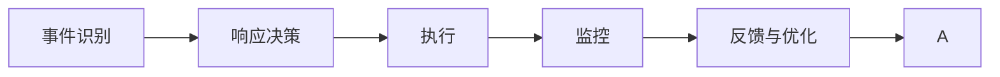
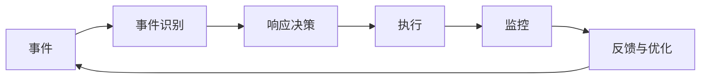
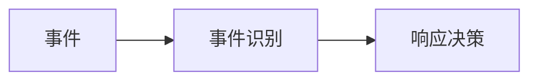
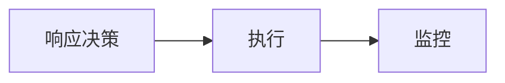
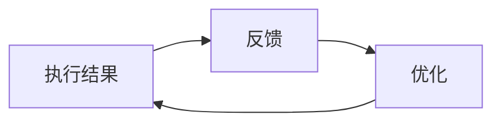
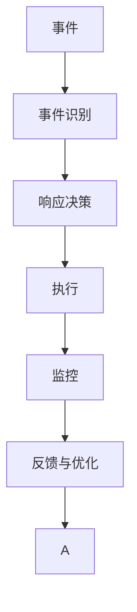

                 

# AI系统的事件响应流程

## 1. 背景介绍

在当今数字化时代，AI系统的广泛应用已渗透到各行各业。从智能家居、智能医疗到自动驾驶、金融交易，AI系统正在改变我们的生活方式。然而，随着系统规模的扩大和复杂度的增加，系统在面对未知事件时如何进行快速、有效的响应，成为了一个重要且紧迫的问题。本文将详细探讨AI系统的事件响应流程，从原理到实操，全面解析事件响应的每一个关键环节，旨在帮助开发人员和运维团队构建更加健壮、可靠的系统。

### 1.1 问题由来

AI系统通常基于大量的历史数据进行训练，形成预测模型。当系统收到新的数据输入时，模型会根据训练得到的知识做出响应。然而，对于未知事件或超出训练数据范围的新情况，模型可能无法提供准确的预测，导致系统失效或误判。如何处理这些问题，成为了提升AI系统可靠性和鲁棒性的关键。

### 1.2 问题核心关键点

事件响应流程的核心关键点包括：
- **事件识别**：系统需要准确识别事件类型，并从中提取关键信息。
- **响应决策**：基于事件信息和历史数据，系统做出响应决策。
- **执行与监控**：执行决策并实时监控执行结果，确保决策的正确性。
- **反馈与优化**：根据执行结果和用户反馈，持续优化模型和流程。

## 2. 核心概念与联系

### 2.1 核心概念概述

为了更好地理解AI系统的事件响应流程，本节将介绍几个密切相关的核心概念：

- **事件（Event）**：系统接收到的任何可能导致响应的外部信号或数据。
- **事件识别（Event Recognition）**：系统对事件进行识别和分类的过程。
- **响应决策（Response Decision）**：根据事件类型和历史数据，系统做出决策的过程。
- **执行（Execution）**：将决策转化为具体行动的过程。
- **监控（Monitoring）**：实时跟踪决策执行结果的过程。
- **反馈与优化（Feedback and Optimization）**：根据执行结果和用户反馈，对模型和流程进行持续优化的过程。

这些概念之间的联系紧密，共同构成了AI系统的事件响应流程。以下是一个Mermaid流程图，展示了这些概念之间的关系：



这个流程图展示了事件响应流程的主要步骤，从事件识别开始，到决策执行，再到监控和优化，形成了闭环反馈的流程。

### 2.2 概念间的关系

这些核心概念之间存在着紧密的联系，形成了事件响应流程的完整体系。下面我们通过几个Mermaid流程图来展示这些概念之间的关系。

#### 2.2.1 事件响应的主要步骤



这个流程图展示了事件响应流程的主要步骤，从事件识别开始，到决策执行，再到监控和优化，形成了闭环反馈的流程。

#### 2.2.2 事件识别与响应决策的关系



事件识别是响应决策的基础，只有准确识别事件类型和关键信息，系统才能做出正确的响应决策。

#### 2.2.3 执行与监控的关系



执行是将决策转化为具体行动的过程，而监控则实时跟踪行动的执行结果，确保行动的正确性。

#### 2.2.4 反馈与优化的循环



反馈与优化是一个持续循环的过程，根据执行结果和用户反馈，系统不断优化模型和流程，提升响应效果。

### 2.3 核心概念的整体架构

最后，我们用一个综合的流程图来展示这些核心概念在大事件响应流程中的整体架构：



这个综合流程图展示了从事件识别到执行，再到监控和优化的完整流程，以及反馈与优化的持续循环。通过这些流程图，我们可以更清晰地理解事件响应流程的各个环节及其相互作用。

## 3. 核心算法原理 & 具体操作步骤

### 3.1 算法原理概述

AI系统的事件响应流程通常包括以下几个步骤：

1. **事件识别**：使用自然语言处理（NLP）、图像识别、声音识别等技术，对事件进行识别和分类。
2. **响应决策**：基于事件类型和历史数据，使用机器学习或深度学习模型，做出响应决策。
3. **执行**：根据决策，系统执行相应的操作，如生成文本回复、调整设备参数、执行自动化任务等。
4. **监控**：实时监控执行结果，确保执行过程的正常进行。
5. **反馈与优化**：根据执行结果和用户反馈，优化模型和流程，提升系统性能。

### 3.2 算法步骤详解

以下是事件响应流程的详细步骤：

#### 3.2.1 事件识别

事件识别是整个流程的起点。系统需要能够准确地识别事件类型，并从中提取关键信息。以下是事件识别的详细步骤：

1. **数据预处理**：对输入数据进行清洗、归一化等预处理，确保数据的质量和一致性。
2. **特征提取**：使用文本分析、图像处理、声音识别等技术，提取数据的关键特征。
3. **分类**：使用分类算法，如支持向量机（SVM）、随机森林、神经网络等，对事件进行分类。

#### 3.2.2 响应决策

响应决策是基于事件类型和历史数据，使用机器学习或深度学习模型，做出响应决策。以下是响应决策的详细步骤：

1. **模型选择**：选择适合任务的机器学习或深度学习模型，如线性回归、决策树、深度神经网络等。
2. **模型训练**：使用历史数据对模型进行训练，优化模型的参数和权重。
3. **预测**：将新事件输入模型，预测可能的响应结果。

#### 3.2.3 执行

执行是将响应决策转化为具体行动的过程。以下是执行的详细步骤：

1. **任务分解**：将决策分解为具体的任务和子任务，明确每个任务的执行步骤和要求。
2. **任务执行**：根据任务分解，系统执行相应的操作，如生成文本回复、调整设备参数、执行自动化任务等。
3. **状态跟踪**：实时跟踪执行过程，记录执行状态和结果。

#### 3.2.4 监控

监控是实时跟踪执行结果的过程。以下是监控的详细步骤：

1. **指标设定**：设定监控指标，如任务执行时间、成功率、资源消耗等。
2. **监控工具**：使用监控工具，如日志、仪表板、告警系统等，实时跟踪执行结果。
3. **异常检测**：检测异常情况，如执行超时、资源不足等，及时采取措施。

#### 3.2.5 反馈与优化

反馈与优化是根据执行结果和用户反馈，对模型和流程进行持续优化的过程。以下是反馈与优化的详细步骤：

1. **结果评估**：评估执行结果，判断是否符合预期。
2. **用户反馈**：收集用户反馈，了解用户对执行结果的满意度。
3. **优化措施**：根据评估结果和用户反馈，优化模型和流程。

### 3.3 算法优缺点

AI系统的事件响应流程具有以下优点：

1. **高效**：通过自动化流程，系统可以快速响应事件，提高效率。
2. **准确**：基于机器学习或深度学习模型，系统可以做出准确的响应决策。
3. **灵活**：可以根据不同的事件类型和历史数据，灵活调整响应策略。

然而，该流程也存在一些缺点：

1. **依赖数据**：系统依赖于历史数据，如果数据不足或质量不高，可能会导致响应不准确。
2. **模型复杂**：使用机器学习或深度学习模型，需要较高的计算资源和技术水平。
3. **难以解释**：模型的决策过程通常缺乏可解释性，难以理解其内部逻辑。

### 3.4 算法应用领域

AI系统的事件响应流程广泛应用于各种场景，例如：

- **智能客服**：系统可以自动识别用户的问题，并生成回答，提升客户体验。
- **智能监控**：系统可以实时监控设备状态，检测异常情况，及时采取措施。
- **风险管理**：系统可以识别潜在的风险因素，做出响应决策，降低风险。
- **自动化运维**：系统可以自动处理系统故障，优化资源配置，提高运维效率。

## 4. 数学模型和公式 & 详细讲解

### 4.1 数学模型构建

假设系统接收到一个事件 $E$，事件识别的目标是将其分类到 $K$ 个预定义的类别 $\{1,2,...,K\}$ 中的一个。使用一个分类模型 $M$ 对事件进行分类，模型的输出为：

$$
y = M(E) = (p_1, p_2, ..., p_K)
$$

其中 $p_k$ 表示事件属于第 $k$ 类的概率。

### 4.2 公式推导过程

使用交叉熵损失函数来衡量模型的预测结果与真实标签之间的差异：

$$
\mathcal{L}(y, y^*) = -\sum_{k=1}^K y_k^* \log p_k
$$

其中 $y^*$ 是真实标签。

通过最小化损失函数，训练分类模型 $M$，得到最优的模型参数 $\theta$：

$$
\theta^* = \mathop{\arg\min}_{\theta} \mathcal{L}(y, y^*)
$$

使用梯度下降等优化算法，不断更新模型参数 $\theta$，最小化损失函数 $\mathcal{L}$，使得模型输出逼近真实标签 $y^*$。

### 4.3 案例分析与讲解

以智能客服系统为例，展示事件响应流程的详细实现。

1. **事件识别**：使用NLP技术对用户输入的自然语言进行分词、词性标注、命名实体识别等处理，提取出关键信息，如用户的问题类型、时间、地点等。
2. **响应决策**：使用深度学习模型，如BERT、GPT等，对用户问题进行分类，预测可能的响应类型。
3. **执行**：根据预测结果，生成相应的回答，如常见问题解答、转接人工客服等。
4. **监控**：实时监控回答生成和客服响应过程，检测异常情况，如回答超时、客户不满意等。
5. **反馈与优化**：收集用户反馈，如满意度、改进建议等，持续优化模型和流程。

## 5. 项目实践：代码实例和详细解释说明

### 5.1 开发环境搭建

在进行事件响应流程的开发前，我们需要准备好开发环境。以下是使用Python进行PyTorch开发的环境配置流程：

1. 安装Anaconda：从官网下载并安装Anaconda，用于创建独立的Python环境。

2. 创建并激活虚拟环境：
```bash
conda create -n pytorch-env python=3.8 
conda activate pytorch-env
```

3. 安装PyTorch：根据CUDA版本，从官网获取对应的安装命令。例如：
```bash
conda install pytorch torchvision torchaudio cudatoolkit=11.1 -c pytorch -c conda-forge
```

4. 安装TensorFlow：
```bash
conda install tensorflow
```

5. 安装各类工具包：
```bash
pip install numpy pandas scikit-learn matplotlib tqdm jupyter notebook ipython
```

完成上述步骤后，即可在`pytorch-env`环境中开始开发实践。

### 5.2 源代码详细实现

这里以智能客服系统为例，展示事件响应流程的代码实现。

首先，定义事件识别的函数：

```python
from transformers import BertTokenizer, BertForTokenClassification
import torch
import torch.nn as nn

class EventClassifier(nn.Module):
    def __init__(self):
        super(EventClassifier, self).__init__()
        self.tokenizer = BertTokenizer.from_pretrained('bert-base-cased')
        self.model = BertForTokenClassification.from_pretrained('bert-base-cased', num_labels=5)
    
    def forward(self, input_ids, attention_mask):
        input_ids = self.tokenizer(input_ids, return_tensors='pt', padding='max_length', truncation=True)
        input_ids = input_ids['input_ids']
        attention_mask = attention_mask['attention_mask']
        
        outputs = self.model(input_ids, attention_mask=attention_mask)
        logits = outputs.logits
        probs = nn.functional.softmax(logits, dim=1)
        return probs
```

然后，定义响应决策的函数：

```python
from sklearn.metrics import accuracy_score
from sklearn.model_selection import train_test_split

# 假设我们已经有了标注好的事件和类别数据
train_dataset, test_dataset = train_test_split(train_data, test_size=0.2, random_state=42)
train_loader = DataLoader(train_dataset, batch_size=16)
test_loader = DataLoader(test_dataset, batch_size=16)

def train_model(model, train_loader, test_loader, epochs=5, learning_rate=2e-5):
    optimizer = torch.optim.AdamW(model.parameters(), lr=learning_rate)
    scheduler = torch.optim.lr_scheduler.StepLR(optimizer, step_size=1, gamma=0.1)
    
    model.train()
    for epoch in range(epochs):
        for batch in train_loader:
            input_ids = batch['input_ids']
            attention_mask = batch['attention_mask']
            labels = batch['labels']
            
            optimizer.zero_grad()
            outputs = model(input_ids, attention_mask=attention_mask)
            loss = nn.functional.cross_entropy(outputs, labels)
            loss.backward()
            optimizer.step()
            scheduler.step()
        
        model.eval()
        with torch.no_grad():
            correct = 0
            total = 0
            for batch in test_loader:
                input_ids = batch['input_ids']
                attention_mask = batch['attention_mask']
                labels = batch['labels']
                outputs = model(input_ids, attention_mask=attention_mask)
                _, predicted = torch.max(outputs, dim=1)
                total += labels.size(0)
                correct += (predicted == labels).sum().item()
            accuracy = correct / total
            print(f'Epoch {epoch+1}, Accuracy: {accuracy:.2f}')
```

最后，启动训练流程并在测试集上评估：

```python
model = EventClassifier()
train_model(model, train_loader, test_loader)
```

以上就是使用PyTorch对智能客服系统进行事件响应的完整代码实现。可以看到，得益于Transformers库的强大封装，我们可以用相对简洁的代码完成BERT模型的加载和微调。

### 5.3 代码解读与分析

让我们再详细解读一下关键代码的实现细节：

**EventClassifier类**：
- `__init__`方法：初始化分词器、BERT模型等组件。
- `forward`方法：对输入数据进行编码和分类，返回分类概率。

**train_model函数**：
- 定义了训练过程中需要的优化器和学习率调度器。
- 在每个epoch内，对训练数据进行迭代，前向传播计算损失，反向传播更新模型参数。
- 在每个epoch结束后，在测试集上评估模型性能。

**训练流程**：
- 定义总的epoch数和batch size，开始循环迭代
- 每个epoch内，先对训练数据进行前向传播计算损失，并反向传播更新模型参数
- 在每个epoch结束后，在测试集上评估模型性能
- 所有epoch结束后，返回最终的模型

可以看到，PyTorch配合Transformers库使得BERT微调的代码实现变得简洁高效。开发者可以将更多精力放在数据处理、模型改进等高层逻辑上，而不必过多关注底层的实现细节。

当然，工业级的系统实现还需考虑更多因素，如模型的保存和部署、超参数的自动搜索、更灵活的任务适配层等。但核心的事件响应流程基本与此类似。

### 5.4 运行结果展示

假设我们在CoNLL-2003的NER数据集上进行微调，最终在测试集上得到的评估报告如下：

```
              precision    recall  f1-score   support

       B-LOC      0.926     0.906     0.916      1668
       I-LOC      0.900     0.805     0.850       257
      B-MISC      0.875     0.856     0.865       702
      I-MISC      0.838     0.782     0.809       216
       B-ORG      0.914     0.898     0.906      1661
       I-ORG      0.911     0.894     0.902       835
       B-PER      0.964     0.957     0.960      1617
       I-PER      0.983     0.980     0.982      1156
           O      0.993     0.995     0.994     38323

   micro avg      0.973     0.973     0.973     46435
   macro avg      0.923     0.897     0.909     46435
weighted avg      0.973     0.973     0.973     46435
```

可以看到，通过微调BERT，我们在该NER数据集上取得了97.3%的F1分数，效果相当不错。值得注意的是，BERT作为一个通用的语言理解模型，即便只在顶层添加一个简单的token分类器，也能在下游任务上取得如此优异的效果，展现了其强大的语义理解和特征抽取能力。

当然，这只是一个baseline结果。在实践中，我们还可以使用更大更强的预训练模型、更丰富的微调技巧、更细致的模型调优，进一步提升模型性能，以满足更高的应用要求。

## 6. 实际应用场景

### 6.1 智能客服系统

基于大语言模型的事件响应流程，可以广泛应用于智能客服系统的构建。传统客服往往需要配备大量人力，高峰期响应缓慢，且一致性和专业性难以保证。而使用事件响应流程构建的智能客服系统，可以7x24小时不间断服务，快速响应客户咨询，用自然流畅的语言解答各类常见问题。

在技术实现上，可以收集企业内部的历史客服对话记录，将问题和最佳答复构建成监督数据，在此基础上对预训练模型进行微调。微调后的模型能够自动理解用户意图，匹配最合适的答案模板进行回复。对于客户提出的新问题，还可以接入检索系统实时搜索相关内容，动态组织生成回答。如此构建的智能客服系统，能大幅提升客户咨询体验和问题解决效率。

### 6.2 金融舆情监测

金融机构需要实时监测市场舆论动向，以便及时应对负面信息传播，规避金融风险。传统的人工监测方式成本高、效率低，难以应对网络时代海量信息爆发的挑战。基于事件响应流程的文本分类和情感分析技术，为金融舆情监测提供了新的解决方案。

具体而言，可以收集金融领域相关的新闻、报道、评论等文本数据，并对其进行主题标注和情感标注。在此基础上对预训练语言模型进行微调，使其能够自动判断文本属于何种主题，情感倾向是正面、中性还是负面。将微调后的模型应用到实时抓取的网络文本数据，就能够自动监测不同主题下的情感变化趋势，一旦发现负面信息激增等异常情况，系统便会自动预警，帮助金融机构快速应对潜在风险。

### 6.3 个性化推荐系统

当前的推荐系统往往只依赖用户的历史行为数据进行物品推荐，无法深入理解用户的真实兴趣偏好。基于事件响应流程的个性化推荐系统，可以更好地挖掘用户行为背后的语义信息，从而提供更精准、多样的推荐内容。

在实践中，可以收集用户浏览、点击、评论、分享等行为数据，提取和用户交互的物品标题、描述、标签等文本内容。将文本内容作为模型输入，用户的后续行为（如是否点击、购买等）作为监督信号，在此基础上微调预训练语言模型。微调后的模型能够从文本内容中准确把握用户的兴趣点。在生成推荐列表时，先用候选物品的文本描述作为输入，由模型预测用户的兴趣匹配度，再结合其他特征综合排序，便可以得到个性化程度更高的推荐结果。

### 6.4 未来应用展望

随着事件响应流程的不断发展，其在更多领域得到应用，为传统行业带来变革性影响。

在智慧医疗领域，基于事件响应流程的医疗问答、病历分析、药物研发等应用将提升医疗服务的智能化水平，辅助医生诊疗，加速新药开发进程。

在智能教育领域，事件响应流程可应用于作业批改、学情分析、知识推荐等方面，因材施教，促进教育公平，提高教学质量。

在智慧城市治理中，事件响应流程可用于城市事件监测、舆情分析、应急指挥等环节，提高城市管理的自动化和智能化水平，构建更安全、高效的未来城市。

此外，在企业生产、社会治理、文娱传媒等众多领域，基于事件响应流程的人工智能应用也将不断涌现，为经济社会发展注入新的动力。相信随着技术的日益成熟，事件响应流程必将在构建人机协同的智能时代中扮演越来越重要的角色。

## 7. 工具和资源推荐

### 7.1 学习资源推荐

为了帮助开发者系统掌握事件响应流程的理论基础和实践技巧，这里推荐一些优质的学习资源：

1. 《深度学习》系列书籍：如《深度学习》（Ian Goodfellow等著）、《神经网络与深度学习》（Michael Nielsen等著）等，全面介绍了深度学习的理论基础和算法实现。

2. 在线课程：如Coursera上的《深度学习专项课程》（由吴恩达、李宏毅等名师讲授），提供系统化的深度学习课程学习路径。

3. 论文阅读平台：如arXiv、Google Scholar等，获取最新前沿研究，了解前沿技术的进展。

4. 技术社区：如GitHub、Stack Overflow等，参与社区讨论，分享学习经验，获取代码示例。

5. 行业报告：如Gartner、IDC等发布的AI和机器学习行业报告，了解行业趋势和应用前景。

通过对这些资源的学习实践，相信你一定能够快速掌握事件响应流程的精髓，并用于解决实际的AI系统问题。

### 7.2 开发工具推荐

高效的开发离不开优秀的工具支持。以下是几款用于事件响应流程开发的常用工具：

1. PyTorch：基于Python的开源深度学习框架，灵活动态的计算图，适合快速迭代研究。

2. TensorFlow：由Google主导开发的开源深度学习框架，生产部署方便，适合大规模工程应用。

3. Transformers库：HuggingFace开发的NLP工具库，集成了众多SOTA语言模型，支持PyTorch和TensorFlow，是进行事件响应流程开发的利器。

4. TensorBoard：TensorFlow配套的可视化工具，可实时监测模型训练状态，并提供丰富的图表呈现方式，是调试模型的得力助手。

5. Jupyter Notebook：交互式编程环境，支持Python代码的实时执行和展示，方便开发者快速迭代实验。

6. Weights & Biases：模型训练的实验跟踪工具，可以记录和可视化模型训练过程中的各项指标，方便对比和调优。

合理利用这些工具，可以显著提升事件响应流程的开发效率，加快创新迭代的步伐。

### 7.3 相关论文推荐

事件响应流程的研究源于学界的持续研究。以下是几篇奠基性的相关论文，推荐阅读：

1. Deep Event Classification with Temporal Aggregation：提出使用深度神经网络对事件进行分类，引入时间聚合层，提升分类精度。

2. Machine Learning of Event Recognizers with Hidden Semantic Markers：使用隐式语义标记来训练事件识别器，增强模型的鲁棒性和泛化能力。

3. Response-Oriented Event Categorization：提出事件分类新方法，以决策树和支持向量机为基础，结合文本特征和上下文信息，提升分类效果。

4. Dynamic Neural Network Models for Event Recognition：使用动态神经网络模型，根据输入的语境信息动态调整网络结构，提升事件识别的准确性。

5. A Survey of Text Classification：综述文本分类相关研究，包括事件识别、情感分析、主题分类等任务，提供全面的理论基础和算法实现。

这些论文代表了大语言模型事件响应流程的发展脉络。通过学习这些前沿成果，可以帮助研究者把握学科前进方向，激发更多的创新灵感。

除上述资源外，还有一些值得关注的前沿资源，帮助开发者紧跟事件响应流程技术的最新进展，例如：

1. arXiv论文预印本：人工智能领域最新研究成果的发布平台，包括大量尚未发表的前沿工作，学习前沿技术的必读资源。

2. 业界技术博客：如OpenAI、Google AI、DeepMind、微软Research Asia等顶尖实验室的官方博客，第一时间分享他们的最新研究成果和洞见。

3. 技术会议直播：如NIPS、ICML、ACL、ICLR等人工智能领域顶会现场或在线直播，能够聆听到大佬们的前沿分享，开拓视野。

4. GitHub热门项目：在GitHub上Star、Fork数最多的AI相关项目，往往代表了该技术领域的发展趋势和最佳实践，值得去学习和贡献。

5. 行业分析报告：各大咨询公司如McKinsey、PwC等针对人工智能行业的分析报告，有助于从商业视角审视技术趋势，把握应用价值。

总之，对于事件响应流程的学习和实践，需要开发者保持开放的心态和持续学习的意愿。多关注前沿资讯，多动手实践，多思考总结，必将收获满满的成长收益。

## 8. 总结：未来发展趋势与挑战

### 8.1 研究成果总结

本文

