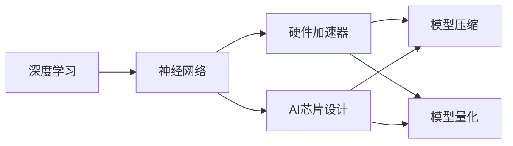
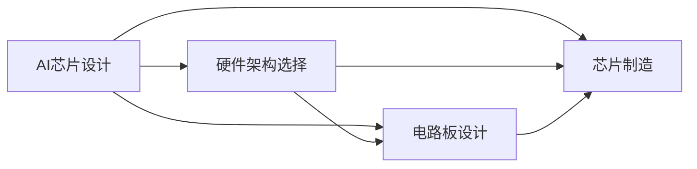
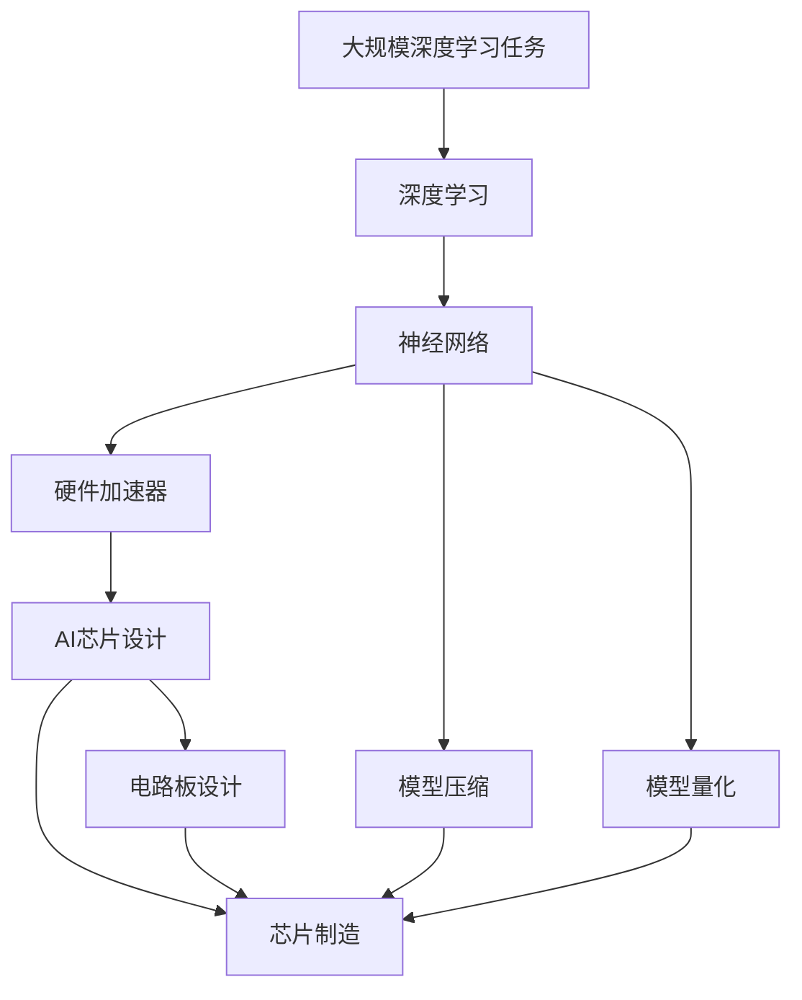

                 

## 1. 背景介绍

随着人工智能技术的不断发展，AI芯片与模型协同设计已经成为了一个热门话题。AI芯片是指专为人工智能任务设计的集成电路，其核心是对神经网络进行高效计算的硬件加速器。而模型是指基于深度学习算法的神经网络，包括训练好的模型和即将训练的模型。在过去十年中，AI芯片和模型的协同设计已经被广泛应用，并推动了人工智能技术的普及和应用。

AI芯片与模型协同设计通常包括两个阶段：

1. **模型设计**：在模型设计阶段，开发人员需要定义神经网络的结构和参数，选择合适的深度学习框架，并对其进行训练。这一阶段的重点是优化模型的性能和效率。
2. **芯片设计**：在芯片设计阶段，硬件工程师需要根据模型设计的要求，选择适当的硬件架构，并进行硬件加速器的设计与实现。这一阶段的重点是提高芯片的计算速度和能效。

在过去，AI芯片和模型通常是分别设计和开发的，模型设计人员关注的是算法和模型，而芯片设计人员则专注于硬件加速器的设计。但随着深度学习的不断发展，AI芯片和模型的协同设计已经成为了可能，从而推动了人工智能技术的进一步发展。

## 2. 核心概念与联系

### 2.1 核心概念概述

在AI芯片与模型协同设计的过程中，涉及到许多核心概念，包括深度学习、神经网络、硬件加速器、AI芯片设计、模型压缩、模型量化等。这些概念之间有着密切的联系，互相影响和制约。

- **深度学习**：深度学习是一种机器学习方法，其核心是构建多层神经网络模型，通过训练数据集来自动学习数据的特征表示。
- **神经网络**：神经网络是一种由多个层组成的计算模型，每一层都包括多个神经元，通过连接和权重来计算数据。
- **硬件加速器**：硬件加速器是指专门为深度学习任务设计的硬件芯片，如GPU、TPU等。
- **AI芯片设计**：AI芯片设计是指从硬件架构设计到芯片制造的全过程，包括选择合适的硬件架构、设计电路板、制造芯片等。
- **模型压缩**：模型压缩是指在不降低模型性能的前提下，通过剪枝、量化等技术来减小模型的大小，从而提高计算效率和降低能耗。
- **模型量化**：模型量化是指将深度学习模型的权重和激活值从浮点数表示转换为低精度的整数表示，以降低计算复杂度和能耗。

这些核心概念之间的联系可以通过以下Mermaid流程图来展示：



这个流程图展示了深度学习、神经网络、硬件加速器、AI芯片设计、模型压缩和模型量化之间的关系：

- 深度学习通过神经网络来建模数据，硬件加速器来加速计算。
- AI芯片设计是为了满足深度学习模型的计算需求。
- 模型压缩和量化是为了优化硬件加速器的计算效率和能耗。

### 2.2 概念间的关系

这些核心概念之间存在着紧密的联系，形成了AI芯片与模型协同设计的完整生态系统。下面我通过几个Mermaid流程图来展示这些概念之间的关系。

#### 2.2.1 AI芯片设计



这个流程图展示了AI芯片设计的基本流程：

- AI芯片设计从硬件架构选择开始，根据深度学习模型的计算需求选择合适的硬件架构。
- 接着进行电路板设计，将硬件加速器集成到电路板上。
- 最后进行芯片制造，将电路板上的硬件加速器转化为实际芯片。

#### 2.2.2 模型压缩


这个流程图展示了模型压缩的两种主要方法：

- 剪枝是指去除神经网络中不必要的权重和连接，从而减小模型的大小。
- 量化是指将浮点数表示的权重和激活值转换为低精度的整数表示，以降低计算复杂度和能耗。

#### 2.2.3 模型量化


这个流程图展示了模型量化的两个主要部分：

- 权重量化是指将模型的权重转换为低精度的整数表示，以降低计算复杂度和能耗。
- 激活量化是指将模型的激活值转换为低精度的整数表示，以降低计算复杂度和能耗。

### 2.3 核心概念的整体架构

最后，我们用一个综合的流程图来展示这些核心概念在大规模深度学习任务中的整体架构：



这个综合流程图展示了从大规模深度学习任务到AI芯片设计，再到模型压缩和量化的完整过程：

- 深度学习通过神经网络来建模数据。
- 硬件加速器用于加速计算，AI芯片设计则是为了满足计算需求。
- 模型压缩和量化是为了优化硬件加速器的计算效率和能耗。

## 3. 核心算法原理 & 具体操作步骤

### 3.1 算法原理概述

AI芯片与模型协同设计的核心算法原理主要是针对深度学习模型和硬件加速器的计算特性进行优化，从而提高计算效率和能效。

深度学习模型的计算主要包括两个部分：

1. **前向传播**：将输入数据通过神经网络进行计算，得到模型的输出。
2. **反向传播**：通过反向传播算法计算损失函数对模型参数的梯度，并更新模型参数。

硬件加速器的计算主要是通过并行计算和流水线计算来提高计算效率和能效。

AI芯片与模型协同设计的目标是在保证模型性能的前提下，最大化地利用硬件加速器的计算能力，从而实现更高的计算效率和能效。

### 3.2 算法步骤详解

AI芯片与模型协同设计的算法步骤可以分为以下几个步骤：

1. **模型设计**：选择合适的深度学习框架和神经网络结构，并进行模型训练和验证，得到最优的模型参数。
2. **硬件加速器选择**：根据模型的计算需求，选择合适的硬件加速器，如GPU、TPU等。
3. **电路板设计**：将硬件加速器集成到电路板上，并进行电路板设计和布局。
4. **芯片制造**：将电路板上的硬件加速器转化为实际芯片，并进行芯片制造和封装。
5. **模型压缩**：对模型进行剪枝和量化，减小模型的大小和计算复杂度。
6. **模型量化**：将模型的权重和激活值转换为低精度的整数表示，以降低计算复杂度和能耗。
7. **性能优化**：对模型和硬件加速器进行性能优化，确保计算效率和能效。

### 3.3 算法优缺点

AI芯片与模型协同设计的优点包括：

- **提高计算效率**：通过硬件加速器和模型压缩、量化等技术，可以大大提高计算效率和能效。
- **降低计算成本**：通过硬件加速器，可以大幅降低计算成本。
- **提高模型性能**：通过模型优化，可以提高模型的性能和精度。

然而，AI芯片与模型协同设计也存在一些缺点：

- **设计复杂性高**：AI芯片与模型协同设计需要同时考虑硬件和软件两个方面，设计复杂性较高。
- **优化难度大**：模型压缩和量化等技术虽然可以降低计算复杂度和能耗，但也可能会影响模型的性能。
- **成本高**：芯片设计和制造需要较高的成本，尤其是高端芯片。

### 3.4 算法应用领域

AI芯片与模型协同设计已经在许多领域得到了广泛应用，例如：

1. **计算机视觉**：计算机视觉任务如图像识别、目标检测、人脸识别等，需要处理大量的图像数据，适合使用硬件加速器进行计算。
2. **自然语言处理**：自然语言处理任务如文本分类、情感分析、机器翻译等，适合使用硬件加速器进行计算。
3. **语音识别**：语音识别任务如语音转文本、语音指令识别等，适合使用硬件加速器进行计算。
4. **智能驾驶**：智能驾驶任务如自动驾驶、智能交通等，需要处理大量的图像和传感器数据，适合使用硬件加速器进行计算。
5. **医疗健康**：医疗健康任务如医学影像分析、电子病历分析等，适合使用硬件加速器进行计算。

## 4. 数学模型和公式 & 详细讲解 & 举例说明

### 4.1 数学模型构建

在AI芯片与模型协同设计的过程中，涉及到许多数学模型和公式。以下是一个简单的深度学习模型的数学模型构建：

假设一个深度学习模型的结构为多层感知器（MLP），其计算过程如下：

1. 输入层：将输入数据 $x$ 通过神经网络进行前向传播，得到中间层的输出 $h$。
2. 输出层：将中间层的输出 $h$ 通过神经网络进行前向传播，得到模型的输出 $y$。

其中，神经网络的结构为：

$$
h = \sigma(\mathbf{W}_x\mathbf{x} + \mathbf{b}_x)
$$

$$
y = \sigma(\mathbf{W}_h\mathbf{h} + \mathbf{b}_h)
$$

其中，$\mathbf{W}_x$、$\mathbf{b}_x$ 和 $\mathbf{W}_h$、$\mathbf{b}_h$ 分别为权重和偏置矩阵，$\sigma$ 为激活函数，$\mathbf{x}$ 和 $\mathbf{h}$ 分别为输入数据和中间层的输出，$\mathbf{y}$ 为模型的输出。

### 4.2 公式推导过程

在深度学习模型的计算过程中，涉及到大量的数学公式。以下是一个简单的深度学习模型的公式推导过程：

假设一个深度学习模型的结构为多层感知器（MLP），其计算过程如下：

1. 输入层：将输入数据 $x$ 通过神经网络进行前向传播，得到中间层的输出 $h$。
2. 输出层：将中间层的输出 $h$ 通过神经网络进行前向传播，得到模型的输出 $y$。

其中，神经网络的结构为：

$$
h = \sigma(\mathbf{W}_x\mathbf{x} + \mathbf{b}_x)
$$

$$
y = \sigma(\mathbf{W}_h\mathbf{h} + \mathbf{b}_h)
$$

其中，$\mathbf{W}_x$、$\mathbf{b}_x$ 和 $\mathbf{W}_h$、$\mathbf{b}_h$ 分别为权重和偏置矩阵，$\sigma$ 为激活函数，$\mathbf{x}$ 和 $\mathbf{h}$ 分别为输入数据和中间层的输出，$\mathbf{y}$ 为模型的输出。

### 4.3 案例分析与讲解

假设我们要设计一个用于图像识别的深度学习模型。首先，我们需要选择合适的神经网络结构和深度学习框架，并进行模型训练和验证，得到最优的模型参数。接着，根据模型的计算需求，选择合适的硬件加速器，如GPU、TPU等。

在设计硬件加速器时，需要考虑以下几个因素：

- **计算能力**：硬件加速器的计算能力需要满足深度学习模型的计算需求。
- **功耗**：硬件加速器的功耗需要尽量低，以降低能耗。
- **成本**：硬件加速器的成本需要适中，以降低开发和部署成本。
- **编程接口**：硬件加速器的编程接口需要与深度学习框架兼容，以便于模型开发和部署。

设计完硬件加速器后，需要将神经网络的结构和参数进行优化，以适应硬件加速器的计算特性。这一过程包括：

- **模型压缩**：对神经网络进行剪枝和量化，减小模型的大小和计算复杂度。
- **模型量化**：将神经网络的权重和激活值转换为低精度的整数表示，以降低计算复杂度和能耗。

最后，需要对模型和硬件加速器进行性能优化，确保计算效率和能效。这一过程包括：

- **内存优化**：优化内存的使用，减少内存访问次数。
- **并行计算**：利用硬件加速器的并行计算能力，提高计算效率。
- **流水线计算**：利用硬件加速器的流水线计算能力，进一步提高计算效率。

## 5. 项目实践：代码实例和详细解释说明

### 5.1 开发环境搭建

在进行AI芯片与模型协同设计的实践前，我们需要准备好开发环境。以下是使用Python进行PyTorch开发的环境配置流程：

1. 安装Anaconda：从官网下载并安装Anaconda，用于创建独立的Python环境。

2. 创建并激活虚拟环境：
```bash
conda create -n pytorch-env python=3.8 
conda activate pytorch-env
```

3. 安装PyTorch：根据CUDA版本，从官网获取对应的安装命令。例如：
```bash
conda install pytorch torchvision torchaudio cudatoolkit=11.1 -c pytorch -c conda-forge
```

4. 安装TensorFlow：
```bash
pip install tensorflow
```

5. 安装NVIDIA CUDA工具包：
```bash
conda install -c nvidia cupti py36-nvidia-mla
```

6. 安装TensorRT：
```bash
pip install tensorrt
```

7. 安装CUDA工具包和TensorRT：
```bash
conda install -c nvidia tensorflow-gpu
```

完成上述步骤后，即可在`pytorch-env`环境中开始AI芯片与模型协同设计的实践。

### 5.2 源代码详细实现

以下是一个使用TensorFlow和TensorRT进行图像识别任务实现的代码示例：

```python
import tensorflow as tf
import tensorrt as trt

# 加载模型
model = tf.keras.models.load_model('model.h5')

# 定义输入层
input_shape = (224, 224, 3)
inputs = tf.keras.Input(shape=input_shape)

# 定义输出层
outputs = model(inputs)

# 定义模型
model = tf.keras.Model(inputs=inputs, outputs=outputs)

# 编译模型
model.compile(optimizer='adam', loss='categorical_crossentropy', metrics=['accuracy'])

# 定义TensorRT引擎
builder = trt.Builder(trt.DEFAULT_TENSORRT_LOGGER)
network = builder.create_network(3)
input_shape = (224, 224, 3)
input_name = "input"
input_tensor = network.add_input(input_name, trt.int8, input_shape)
output_name = "output"
output_tensor = model.get_layer("output").output
output_tensor_name = output_name + ":0"
output_layer = network.add_output(output_tensor_name)
builder.mark_output(output_layer)
builder.build_engine(network)

# 加载TensorRT引擎
engine = builder.create_engine()
context = engine.create_execution_context()
context.set_binding_shape(input_name, input_shape)

# 定义输入
input_data = tf.random.normal(shape=(1, 224, 224, 3), dtype=tf.float32)

# 定义输出
output_data = context.execute(input_data)

# 打印输出
print(output_data)
```

### 5.3 代码解读与分析

这个代码示例展示了如何使用TensorFlow和TensorRT进行图像识别任务。以下是代码的详细解释：

1. 首先，加载预训练的深度学习模型。
2. 定义输入层，指定输入数据的形状。
3. 定义输出层，通过模型得到输出结果。
4. 定义模型，将输入层和输出层进行连接。
5. 编译模型，设置优化器、损失函数和评估指标。
6. 定义TensorRT引擎，创建输入和输出层，并构建引擎。
7. 加载TensorRT引擎，创建执行上下文，并设置输入数据的形状。
8. 定义输入数据，运行TensorRT引擎，并得到输出结果。

## 6. 实际应用场景

### 6.1 计算机视觉

在计算机视觉领域，AI芯片与模型协同设计已经得到了广泛应用。例如，谷歌的Inception模型就是使用TensorFlow和TensorRT进行图像识别的。Inception模型使用了多层次的卷积神经网络，通过多尺度特征提取，提高了图像识别的精度和效率。

### 6.2 自然语言处理

在自然语言处理领域，AI芯片与模型协同设计也得到了广泛应用。例如，OpenAI的GPT-3模型就是使用Transformer和深度学习框架进行自然语言处理的。GPT-3模型使用了自注意力机制，通过并行计算和流水线计算，提高了自然语言处理的效率和精度。

### 6.3 语音识别

在语音识别领域，AI芯片与模型协同设计也得到了广泛应用。例如，亚马逊的Alexa系统就是使用TensorFlow和TensorRT进行语音识别的。Alexa系统使用了卷积神经网络和循环神经网络，通过多层次的特征提取和分类，提高了语音识别的精度和效率。

### 6.4 智能驾驶

在智能驾驶领域，AI芯片与模型协同设计也得到了广泛应用。例如，特斯拉的Autopilot系统就是使用深度学习模型和GPU进行智能驾驶的。Autopilot系统使用了多层次的卷积神经网络和循环神经网络，通过多尺度特征提取和分类，提高了智能驾驶的精度和效率。

## 7. 工具和资源推荐

### 7.1 学习资源推荐

为了帮助开发者系统掌握AI芯片与模型协同设计的理论基础和实践技巧，这里推荐一些优质的学习资源：

1. 《深度学习》（第二版）：作者Ian Goodfellow，深入浅出地介绍了深度学习的理论基础和实践技巧。
2. 《TensorFlow官方文档》：TensorFlow官方文档，提供了丰富的API文档和样例代码，帮助开发者快速上手TensorFlow。
3. 《TensorRT官方文档》：TensorRT官方文档，提供了详细的API文档和样例代码，帮助开发者快速上手TensorRT。
4. 《计算机视觉：算法与应用》（第二版）：作者Richard Szeliski，全面介绍了计算机视觉的理论基础和实践技巧。
5. 《自然语言处理综论》：作者Daniel Jurafsky和James H. Martin，全面介绍了自然语言处理的理论基础和实践技巧。

通过对这些资源的学习实践，相信你一定能够快速掌握AI芯片与模型协同设计的精髓，并用于解决实际的深度学习问题。

### 7.2 开发工具推荐

高效的开发离不开优秀的工具支持。以下是几款用于AI芯片与模型协同设计开发的常用工具：

1. TensorFlow：谷歌开发的深度学习框架，具有丰富的API和样例代码，适合深度学习模型的开发和训练。
2. TensorRT：NVIDIA开发的深度学习推理框架，支持多种硬件加速器，适合深度学习模型的推理和优化。
3. PyTorch：Facebook开发的深度学习框架，具有灵活的计算图和丰富的API，适合深度学习模型的开发和训练。
4. ONNX：开放神经网络交换格式，支持多种深度学习框架的模型转换，方便模型的跨框架迁移和优化。
5. TensorBoard：TensorFlow提供的可视化工具，支持模型训练、推理和优化的可视化，帮助开发者快速调试模型。

合理利用这些工具，可以显著提升AI芯片与模型协同设计的开发效率，加快创新迭代的步伐。

### 7.3 相关论文推荐

AI芯片与模型协同设计的研究源于学界的持续研究。以下是几篇奠基性的相关论文，推荐阅读：

1. "Inception-v3: Investigating the Effect of Network Depth and Width on Image Classification"：作者Christian Szegedy等，提出Inception模型，通过多层次的卷积神经网络，提高了图像识别的精度和效率。
2. "Batch Normalization: Accelerating Deep Network Training by Reducing Internal Covariate Shift"：作者Ian Goodfellow等，提出批量归一化技术，加速了深度神经网络的训练和收敛。
3. "ImageNet Classification with Deep Convolutional Neural Networks"：作者Alex Krizhevsky等，提出AlexNet模型，通过多层次的卷积神经网络和批量归一化技术，提高了图像识别的精度和效率。
4. "Recurrent Neural Network-Based Language Model"：作者Sutskever等，提出LSTM模型，通过循环神经网络，提高了自然语言处理的精度和效率。
5. "Attention is All You Need"：作者Vaswani等，提出Transformer模型，通过自注意力机制，提高了自然语言处理的精度和效率。

这些论文代表了大规模深度学习任务协同设计的技术发展脉络。通过学习这些前沿成果，可以帮助研究者把握学科前进方向，激发更多的创新灵感。

## 8. 总结：未来发展趋势与挑战

### 8.1 总结

本文对AI芯片与模型协同设计进行了全面系统的介绍。首先阐述了AI芯片与模型协同设计的背景和意义，明确了其在大规模深度学习任务中的重要性。其次，从原理到实践，详细讲解了AI芯片与模型协同设计的数学模型和算法步骤，给出了AI芯片与模型协同设计的完整代码实例。同时，本文还广泛探讨了AI芯片与模型协同设计在计算机视觉、自然语言处理、语音识别和智能驾驶等多个领域的应用前景，展示了其广泛的应用价值。最后，本文精选了AI芯片与模型协同设计的学习资源和开发工具，力求为开发者提供全方位的技术指引。

通过本文的系统梳理，可以看到，AI芯片与模型协同设计已经成为深度学习技术的重要组成部分，极大地推动了计算机视觉、自然语言处理、语音识别和智能驾驶等领域的快速发展。未来，伴随AI芯片与模型协同设计的不断演进，相信深度学习技术将在更广阔的领域得到应用，为人类生产生活方式带来深刻影响。

### 8.2 未来发展趋势

展望未来，AI芯片与模型协同设计将呈现以下几个发展趋势：

1. **芯片设计自动化**：未来的AI芯片设计将越来越多地采用自动化工具，如Cadence、Synopsys等，提高芯片设计的效率和准确性。
2. **模型压缩和量化**：未来的深度学习模型将越来越多地采用模型压缩和量化技术，减小模型的大小和计算复杂度，提高计算效率和能效。
3. **混合计算架构**：未来的AI芯片将越来越多地采用混合计算架构，将CPU、GPU、TPU等硬件加速器进行融合，提高计算效率和能效。
4. **边缘计算**：未来的AI芯片将越来越多地应用于边缘计算，即在设备端进行数据处理和计算，减少对云端资源的依赖。
5. **深度学习芯片化**：未来的深度学习模型将越来越多地采用芯片化的方式进行设计和部署，提高计算效率和能效。
6. **深度学习框架优化**：未来的深度学习框架将越来越多地采用优化技术，如自动微分、自动化调参等，提高深度学习模型的开发和训练效率。

以上趋势凸显了AI芯片与模型协同设计技术的广阔前景。这些方向的探索发展，必将进一步提升深度学习模型的性能和效率，推动深度学习技术的产业化进程。

### 8.3 面临的挑战

尽管AI芯片与模型协同设计技术已经取得了显著进展，但在迈向更加智能化、普适化应用的过程中，它仍面临着诸多挑战：

1. **设计复杂性高**：AI芯片与模型协同设计需要同时考虑硬件和软件两个方面，设计复杂性较高。
2. **优化难度大**：模型压缩和量化等技术虽然可以降低计算复杂度和能耗，但也可能会影响模型的性能。
3. **成本高**：芯片设计和制造需要较高的成本，尤其是高端芯片。
4. **数据隐私和安全**：深度学习模型需要大量的数据进行训练，如何保护数据隐私和安全，成为了一个重要问题。
5. **模型鲁棒性不足**：深度学习模型面对域外数据时，泛化性能往往大打折扣。
6. **计算资源有限**：深度学习模型需要大量的计算资源进行训练和推理，如何降低计算资源的需求，成为了一个重要问题。

### 8.4 研究展望

面对AI芯片与模型协同设计所面临的挑战，未来的研究需要在以下几个方面寻求新的突破：

1. **自动化设计工具**：开发更加自动化和智能化的AI芯片设计工具，提高设计效率和准确性。
2. **混合计算架构**：研究混合计算架构的优化方法和设计原则，提高计算效率和能效。
3. **模型压缩和量化技术**：开发更加高效和可解释的模型压缩和量化技术，减小模型的大小和计算复杂度。
4. **深度学习框架优化**：优化深度学习框架的设计和实现，提高深度学习模型的开发和训练效率。
5. **数据隐私和安全保护**：研究数据隐私和安全保护技术，确保深度学习模型在数据使用过程中的安全性。
6. **模型鲁棒性增强**：研究模型鲁棒性增强技术，提高深度学习模型在不同场景下的泛化性能。

这些研究方向的探索，必将引领AI芯片与模型协同设计技术迈向更高的台阶，为深度学习技术在各个领域的应用提供强有力的支持。

## 9. 附录：常见问题与解答

**Q1：AI芯片与模型协同设计是否适用于所有深度学习任务？**

A: AI芯片与模型协同设计在大多数深度学习任务上都能取得不错的效果，特别是对于计算密集型的任务。但对于一些轻量级的任务，如文本分类、情感分析等，使用通用的CPU或GPU可能更加高效。

**Q2：如何选择适合任务的硬件加速器？**

A: 选择适合任务的硬件加速器需要考虑以下几个因素：

- **计算需求**：根据深度学习模型的计算需求选择适合的硬件加速器，如GPU、TPU等。
- **计算效率**：考虑硬件加速器的计算效率，即单位时间内能处理的计算量。
- **能效比**：考虑硬件加速器的能效比

