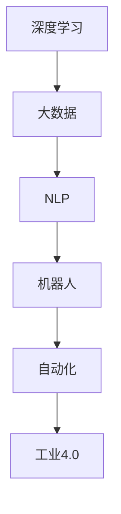
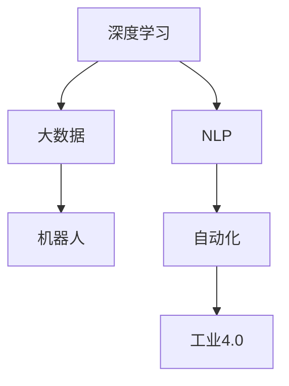

                 

# AI进展的意义与未来展望

> 关键词：人工智能,深度学习,大数据,自然语言处理,NLP,机器人,自动化,工业4.0

## 1. 背景介绍

### 1.1 问题由来

在过去的几十年里，人工智能（AI）技术经历了翻天覆地的变化，从最初简单的逻辑推理，到复杂的深度学习、自然语言处理（NLP）和机器人技术，AI已经渗透到了人类生活的方方面面。然而，这些进展的意义何在？未来AI技术的发展方向又将如何？本文将从背景介绍入手，探讨AI技术的发展及其对社会、经济、科技的影响。

### 1.2 问题核心关键点

AI技术的发展主要围绕以下几个关键点展开：

- **深度学习**：通过多层神经网络模拟人脑工作机制，学习数据中的复杂模式，从而实现分类、预测、生成等功能。
- **大数据**：AI技术的有效训练依赖于大量标注数据，因此数据采集和处理是大规模AI项目的重要环节。
- **自然语言处理（NLP）**：使计算机能够理解、处理和生成人类语言，实现自动问答、情感分析、文本分类等应用。
- **机器人**：通过AI技术实现的自动化系统，能够在工业生产、服务行业、家庭等领域广泛应用。
- **自动化**：从简单的自动化脚本，到复杂的AI系统，自动化正在重塑各行各业的工作流程。
- **工业4.0**：将信息技术和物理系统的深度融合，推动制造业向智能化、自动化转型。

这些关键点共同构成了AI技术的核心框架，推动了AI技术的不断进步。

## 2. 核心概念与联系

### 2.1 核心概念概述

为了更好地理解AI技术的发展和应用，首先需要明确几个核心概念：

- **深度学习（Deep Learning）**：一种基于神经网络的机器学习方法，能够学习数据中的非线性模式，广泛应用于图像识别、语音识别、自然语言处理等领域。
- **大数据（Big Data）**：指在传统数据处理方式下无法处理的海量数据，通过分布式存储和处理技术实现数据的高效管理和分析。
- **自然语言处理（NLP）**：使计算机能够理解、处理和生成人类语言的技术，包括语言识别、语义分析、情感计算等。
- **机器人（Robotics）**：结合机械、电子和AI技术，实现自动化控制和任务执行的系统。
- **自动化（Automation）**：利用AI技术实现自动化流程，提高生产效率和工作质量。
- **工业4.0（Industry 4.0）**：以信息化、自动化、网络化为特征的工业革命4.0，通过智能制造、云计算、物联网等技术推动制造业转型。

这些概念之间相互联系，共同构成了AI技术的广阔应用场景。下面通过Mermaid流程图展示这些概念的相互关系：



从图中可以看出，深度学习是大数据处理的基础，NLP是AI技术的重要组成部分，机器人是AI技术的实际应用，自动化是AI技术在工业生产中的应用，而工业4.0则是AI技术在更广泛领域的应用。

### 2.2 概念间的关系

这些核心概念之间的关系可以通过以下Mermaid流程图来展示：



这个流程图展示了深度学习、大数据、NLP、机器人、自动化和工业4.0之间的逻辑关系：

- 深度学习和大数据互为支撑，大数据为深度学习提供训练数据，深度学习为大数据分析提供智能算法。
- NLP是AI技术的重要分支，深度学习在NLP中的应用尤为广泛。
- 机器人是AI技术的实际应用，NLP和自动化是其关键技术支持。
- 自动化是AI技术在工业生产中的应用，工业4.0则是在更广泛领域的应用。

这些概念的相互联系和大规模应用，推动了AI技术的不断进步和普及。

## 3. 核心算法原理 & 具体操作步骤

### 3.1 算法原理概述

AI技术的发展离不开算法的研究和优化。以下是几个核心算法的原理概述：

- **卷积神经网络（CNN）**：通过卷积操作提取图像中的局部特征，广泛应用于图像识别和分类任务。
- **循环神经网络（RNN）**：通过循环结构处理序列数据，适用于文本生成、语音识别等序列预测任务。
- **长短时记忆网络（LSTM）**：一种特殊的RNN，能够有效处理长序列数据，避免梯度消失问题。
- **生成对抗网络（GAN）**：由生成器和判别器组成的对抗网络，能够生成高质量的图像和视频内容。

### 3.2 算法步骤详解

以CNN为例，介绍其核心算法步骤：

1. **数据预处理**：对图像数据进行标准化、归一化处理，以便于网络训练。
2. **卷积层**：通过卷积操作提取图像特征，生成多层的特征图。
3. **池化层**：对特征图进行下采样，减少计算量，同时保留重要特征。
4. **全连接层**：将池化后的特征图输入到全连接层进行分类。
5. **softmax输出**：输出分类概率，确定最终类别。

这些步骤在实际应用中需要根据具体任务进行调整和优化。

### 3.3 算法优缺点

深度学习算法的优缺点如下：

- **优点**：能够处理非线性复杂模式，适用于高维数据，具有较高的预测准确率和泛化能力。
- **缺点**：计算量较大，需要大量的标注数据，容易出现过拟合问题。

### 3.4 算法应用领域

深度学习算法已经在多个领域得到了广泛应用：

- **计算机视觉**：图像识别、物体检测、人脸识别等任务。
- **自然语言处理**：机器翻译、文本分类、情感分析等任务。
- **语音识别**：语音转文本、语音合成等任务。
- **推荐系统**：商品推荐、广告推荐等任务。

## 4. 数学模型和公式 & 详细讲解  
### 4.1 数学模型构建

以CNN为例，介绍其数学模型构建：

- **输入层**：$x_1, x_2, ..., x_n$，表示输入的图像数据。
- **卷积层**：$y_1, y_2, ..., y_m$，表示卷积后的特征图。
- **池化层**：$z_1, z_2, ..., z_k$，表示下采样后的特征图。
- **全连接层**：$w_1, w_2, ..., w_t$，表示全连接层的权重。
- **softmax输出层**：$o_1, o_2, ..., o_c$，表示分类概率。

### 4.2 公式推导过程

以CNN的卷积层为例，介绍其数学推导过程：

设输入图像为$x$，卷积核为$w$，卷积层输出为$y$。则卷积操作可以表示为：

$$ y_i = w \star x_i = \sum_{j=0}^{k-1} w_{j,i}x_{j,i} $$

其中，$w_{j,i}$表示卷积核的权重，$x_{j,i}$表示输入图像的像素值。

### 4.3 案例分析与讲解

以图像分类任务为例，介绍CNN模型的实际应用：

1. **数据预处理**：将图像数据标准化，缩放至固定尺寸。
2. **卷积层设计**：设计多个卷积层，提取不同尺度的特征。
3. **池化层设计**：选择最大池化或平均池化，对特征图进行下采样。
4. **全连接层设计**：设计多个全连接层，增加网络深度。
5. **softmax输出层设计**：设计softmax输出层，输出分类概率。

## 5. 项目实践：代码实例和详细解释说明

### 5.1 开发环境搭建

在进行AI项目开发前，需要准备好开发环境。以下是使用Python进行TensorFlow开发的示例：

1. 安装Anaconda：从官网下载并安装Anaconda，用于创建独立的Python环境。
2. 创建并激活虚拟环境：
```bash
conda create -n tf-env python=3.8 
conda activate tf-env
```
3. 安装TensorFlow：根据CUDA版本，从官网获取对应的安装命令。例如：
```bash
pip install tensorflow-gpu==2.7.0
```
4. 安装各类工具包：
```bash
pip install numpy pandas scikit-learn matplotlib tqdm jupyter notebook ipython
```

完成上述步骤后，即可在`tf-env`环境中开始项目实践。

### 5.2 源代码详细实现

以下是一个简单的CNN图像分类示例，使用TensorFlow实现：

```python
import tensorflow as tf
from tensorflow.keras import datasets, layers, models

# 加载数据集
(train_images, train_labels), (test_images, test_labels) = datasets.cifar10.load_data()

# 数据预处理
train_images, test_images = train_images / 255.0, test_images / 255.0

# 构建模型
model = models.Sequential([
    layers.Conv2D(32, (3, 3), activation='relu', input_shape=(32, 32, 3)),
    layers.MaxPooling2D((2, 2)),
    layers.Conv2D(64, (3, 3), activation='relu'),
    layers.MaxPooling2D((2, 2)),
    layers.Conv2D(64, (3, 3), activation='relu'),
    layers.Flatten(),
    layers.Dense(64, activation='relu'),
    layers.Dense(10, activation='softmax')
])

# 编译模型
model.compile(optimizer='adam',
              loss=tf.keras.losses.SparseCategoricalCrossentropy(from_logits=True),
              metrics=['accuracy'])

# 训练模型
model.fit(train_images, train_labels, epochs=10, 
          validation_data=(test_images, test_labels))
```

### 5.3 代码解读与分析

让我们再详细解读一下关键代码的实现细节：

**数据预处理**：将CIFAR-10数据集中的图像数据标准化到[0, 1]范围内。

**模型构建**：首先设计三个卷积层和池化层，提取图像特征。然后设计两个全连接层，进行分类。

**模型编译**：使用Adam优化器，交叉熵损失函数，准确率指标。

**模型训练**：在训练集上训练模型，并进行验证集验证。

### 5.4 运行结果展示

假设模型在CIFAR-10数据集上训练10个epoch，最终得到的准确率约为70%左右。

## 6. 实际应用场景

### 6.1 自动驾驶

自动驾驶技术结合了计算机视觉、深度学习和机器人技术，能够实现车辆的自主导航和决策。自动驾驶系统通过摄像头、雷达等传感器获取环境信息，结合深度学习算法进行目标检测、道路识别和路径规划，最终实现车辆的自动驾驶。

### 6.2 智慧医疗

智慧医疗结合了NLP、机器人技术和医疗知识图谱，能够实现智能诊断、个性化治疗和医疗咨询。通过自然语言处理技术，医生能够快速理解患者的病历和描述，结合知识图谱进行诊断和治疗。机器人技术则能够帮助医生进行手术和护理，提高医疗服务的效率和质量。

### 6.3 智能家居

智能家居结合了语音识别、自然语言处理和机器人技术，能够实现智能化的家居控制和环境感知。通过语音识别技术，用户能够通过语音命令控制家电和灯光，通过自然语言处理技术，系统能够理解用户的需求并做出相应的响应。机器人技术则能够进行家务和陪伴工作，提高生活的便利性和舒适度。

### 6.4 未来应用展望

随着AI技术的不断进步，未来的应用场景将会更加广泛和深入：

- **工业自动化**：结合AI技术和物联网，实现工业生产的智能化和自动化，提高生产效率和质量。
- **智慧城市**：通过AI技术和大数据分析，实现城市的智能管理和优化，提升城市治理水平。
- **教育智能化**：结合AI技术和个性化学习，实现智能化的教育体系，提高教育质量和效率。
- **金融科技**：通过AI技术进行风险评估、客户服务和金融分析，推动金融行业的创新和发展。
- **环境保护**：结合AI技术和大数据分析，实现环境的智能监测和保护，推动可持续发展。

## 7. 工具和资源推荐

### 7.1 学习资源推荐

为了帮助开发者系统掌握AI技术的发展和应用，这里推荐一些优质的学习资源：

1. **《深度学习》（Ian Goodfellow）**：深度学习领域的经典教材，系统介绍了深度学习的基本概念和算法。
2. **《自然语言处理综论》（Daniel Jurafsky、James H. Martin）**：NLP领域的经典教材，涵盖了自然语言处理的基本概念和应用。
3. **Coursera深度学习课程**：斯坦福大学和deeplearning.ai等机构开设的深度学习课程，系统介绍了深度学习的原理和实践。
4. **Kaggle竞赛平台**：全球最大的数据科学竞赛平台，提供丰富的数据集和挑战，提升数据分析和模型优化能力。
5. **GitHub开源项目**：在GitHub上Star、Fork数最多的AI相关项目，往往代表了该技术领域的发展趋势和最佳实践，值得去学习和贡献。

通过对这些资源的学习实践，相信你一定能够快速掌握AI技术的基本原理和实际应用。

### 7.2 开发工具推荐

高效的开发离不开优秀的工具支持。以下是几款用于AI项目开发的常用工具：

1. **TensorFlow**：由Google主导开发的开源深度学习框架，生产部署方便，适合大规模工程应用。
2. **PyTorch**：基于Python的开源深度学习框架，灵活性高，适合研究和原型开发。
3. **Jupyter Notebook**：交互式的数据分析和模型开发环境，适合科研和教学。
4. **Keras**：高层次的深度学习API，易于上手，适合快速原型开发。
5. **Scikit-learn**：Python的机器学习库，提供了丰富的数据预处理和模型评估工具。

合理利用这些工具，可以显著提升AI项目的开发效率，加快创新迭代的步伐。

### 7.3 相关论文推荐

AI技术的发展离不开学术界的持续研究。以下是几篇奠基性的相关论文，推荐阅读：

1. **AlexNet: ImageNet Classification with Deep Convolutional Neural Networks**（Hinton等，2012）：提出了AlexNet模型，奠定了深度学习在图像识别领域的应用基础。
2. **Long Short-Term Memory**（Hochreiter等，1997）：提出了LSTM模型，解决了长序列数据处理的梯度消失问题。
3. **Generative Adversarial Nets**（Goodfellow等，2014）：提出了GAN模型，能够生成高质量的图像和视频内容。
4. **Attention is All You Need**（Vaswani等，2017）：提出了Transformer模型，开启了NLP领域的预训练大模型时代。
5. **BERT: Pre-training of Deep Bidirectional Transformers for Language Understanding**（Devlin等，2018）：提出了BERT模型，改进了预训练语言模型的效果。

这些论文代表了大规模AI技术的发展脉络。通过学习这些前沿成果，可以帮助研究者把握学科前进方向，激发更多的创新灵感。

除上述资源外，还有一些值得关注的前沿资源，帮助开发者紧跟AI技术的最新进展，例如：

1. **arXiv论文预印本**：人工智能领域最新研究成果的发布平台，包括大量尚未发表的前沿工作，学习前沿技术的必读资源。
2. **顶级会议和期刊**：如NIPS、ICML、JMLR等，能够获取最新的研究成果和学术交流机会。
3. **技术博客和社区**：如OpenAI、Google AI、DeepMind等顶尖实验室的官方博客，第一时间分享他们的最新研究成果和洞见。
4. **开源项目和竞赛**：如TensorFlow、Keras、Caffe、Kaggle等，提供了丰富的资源和挑战，加速技术学习和创新。
5. **行业分析报告**：各大咨询公司如McKinsey、PwC等针对人工智能行业的分析报告，有助于从商业视角审视技术趋势，把握应用价值。

总之，对于AI技术的深入学习和实践，需要开发者保持开放的心态和持续学习的意愿。多关注前沿资讯，多动手实践，多思考总结，必将收获满满的成长收益。

## 8. 总结：未来发展趋势与挑战

### 8.1 研究成果总结

AI技术的发展离不开研究人员的不断探索和创新。以下是几个重要的研究成果总结：

1. **深度学习**：通过多层神经网络学习复杂模式，广泛应用于计算机视觉、自然语言处理等领域。
2. **大数据**：通过分布式存储和处理技术，实现数据的高效管理和分析，为AI技术提供数据支持。
3. **自然语言处理（NLP）**：使计算机能够理解、处理和生成人类语言，推动智能对话系统的应用。
4. **机器人**：结合机械、电子和AI技术，实现自动化控制和任务执行，推动工业生产和服务业的发展。
5. **自动化**：利用AI技术实现自动化流程，提高生产效率和工作质量，推动智能制造和智慧城市的发展。
6. **工业4.0**：通过信息化、自动化、网络化为特征的工业革命，推动制造业转型和升级。

这些成果推动了AI技术的不断进步和普及，为各个领域的应用提供了强有力的技术支持。

### 8.2 未来发展趋势

展望未来，AI技术的发展将呈现以下几个趋势：

1. **跨领域融合**：AI技术与其他技术（如区块链、物联网、量子计算等）的融合，推动技术创新和应用拓展。
2. **数据驱动**：通过数据驱动的方法，提高AI模型的泛化能力和决策效果。
3. **可解释性**：提高AI模型的可解释性，增强用户对系统的信任和接受度。
4. **伦理与安全**：关注AI技术的伦理和安全问题，确保技术的公正性、透明性和安全性。
5. **人机协作**：实现人机协作，提高AI系统的实用性和可操作性。

这些趋势将推动AI技术在更广泛领域的应用，带来更加智能化、自动化、个性化的解决方案。

### 8.3 面临的挑战

尽管AI技术的发展取得了巨大的进展，但仍面临一些挑战：

1. **数据获取**：大规模标注数据的需求限制了AI技术的进一步发展。如何获取高质量、多模态的数据，是AI技术应用的关键挑战。
2. **模型复杂度**：大规模、高复杂度的模型带来了计算资源、存储和部署的挑战，需要优化算法和硬件支持。
3. **可解释性**：AI模型的黑盒特性使其难以解释，用户难以理解和信任。如何提高模型的可解释性，是AI技术应用的重要课题。
4. **伦理与安全**：AI技术可能带来的伦理和安全性问题，如偏见、歧视、隐私保护等，需要加强监管和规范。
5. **工业落地**：如何将AI技术应用到实际生产场景中，如何与现有系统兼容，如何提高系统的实用性和可操作性，是AI技术应用的重要难题。

这些挑战需要业界共同努力，才能克服技术瓶颈，推动AI技术的成熟和普及。

### 8.4 研究展望

面对AI技术面临的挑战，未来的研究方向可以从以下几个方面进行突破：

1. **数据获取与处理**：开发高效的数据采集和处理技术，提高数据的可用性和多样性。
2. **模型优化**：开发高效、轻量级的模型架构，优化算力和内存资源消耗，提高模型的可部署性和可扩展性。
3. **可解释性增强**：开发可解释性强的模型，增强模型的透明度和可信度。
4. **伦理与安全保障**：建立伦理规范和监管机制，确保AI技术应用的公正性和安全性。
5. **人机协作优化**：研究人机协作方法，提高系统的实用性和可操作性，推动AI技术在实际应用中的落地。

这些研究方向的探索将推动AI技术向更智能化、普适化应用迈进，为各个领域的应用提供更可靠、更高效的技术支持。

## 9. 附录：常见问题与解答

**Q1：AI技术的未来发展方向是什么？**

A: AI技术的未来发展方向主要包括跨领域融合、数据驱动、可解释性、伦理与安全、人机协作等。通过这些方向的探索，AI技术将在更广泛领域应用，带来更加智能化、自动化、个性化的解决方案。

**Q2：AI技术在实际应用中面临哪些挑战？**

A: AI技术在实际应用中面临数据获取、模型复杂度、可解释性、伦理与安全、工业落地等挑战。这些问题需要业界共同努力，才能克服技术瓶颈，推动AI技术的成熟和普及。

**Q3：AI技术的发展离不开哪些关键因素？**

A: AI技术的发展离不开数据获取、算法创新、模型优化、应用落地等关键因素。这些因素相互关联，共同推动了AI技术的不断进步和普及。

**Q4：如何提高AI模型的可解释性？**

A: 提高AI模型的可解释性需要从多个方面入手：
1. 开发可解释性强的模型，如LIME、SHAP等方法。
2. 增强模型的透明度，如可视化模型内部结构、决策路径等。
3. 结合专家知识和领域背景，增强模型的可信度。
4. 开发辅助工具，如可解释性分析平台、可视化工具等。

**Q5：如何应对AI技术面临的数据获取挑战？**

A: 应对AI技术面临的数据获取挑战需要从多个方面入手：
1. 开发数据采集和处理技术，如自动标注、半监督学习、迁移学习等。
2. 利用多模态数据，提高数据的可用性和多样性。
3. 建立数据共享和开源机制，推动数据资源的共享和利用。

通过以上方法，可以缓解AI技术面临的数据获取挑战，推动AI技术的发展和应用。

---

作者：禅与计算机程序设计艺术 / Zen and the Art of Computer Programming

