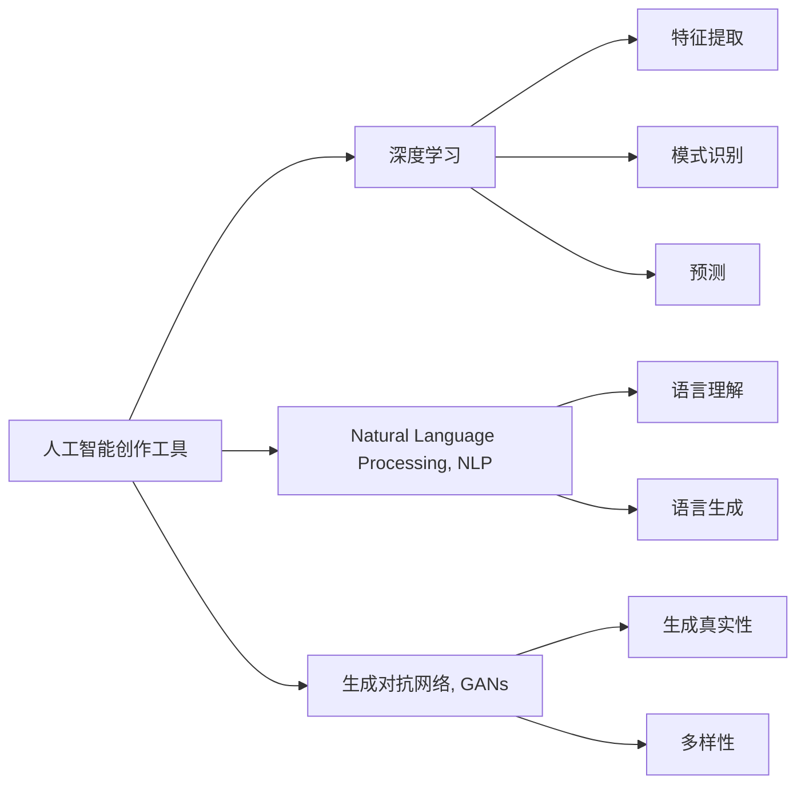

                 

## 1. 背景介绍

随着人工智能技术的飞速发展，AI在创作领域的应用已不再局限于数据分析、自动化生成等传统领域，而是正逐渐深入到内容创作这一高度创意和个性化的领域。AI创作工具正在通过深度学习和自然语言处理技术，大幅降低创作门槛，使更多普通人能够轻松参与内容创作，同时也推动了创作产业的创新和变革。本文将从几个典型案例入手，探讨AI降低创作门槛的具体实现方式及其带来的广泛影响。

## 2. 核心概念与联系

### 2.1 核心概念概述

在本节，我们将详细介绍与AI创作工具相关的几个核心概念：

- **人工智能创作工具（AI Creators）**：利用深度学习、自然语言处理等技术，帮助用户生成文本、图像、音乐等内容的技术工具。
- **内容生成（Content Generation）**：通过算法自动生成文本、音乐、图像等内容的创作活动。
- **深度学习（Deep Learning）**：一种利用多层神经网络进行数据自动特征提取、模式识别和预测的机器学习方法。
- **自然语言处理（Natural Language Processing, NLP）**：涉及计算机对人类语言信息的理解、处理和生成，是AI创作工具的重要技术基础。
- **生成对抗网络（Generative Adversarial Networks, GANs）**：一种利用两个神经网络相互对抗，生成具有高度真实性的图片、音频等内容的技术。

这些概念之间存在着紧密的联系。深度学习是AI创作工具的核心算法基础，而自然语言处理技术则使得AI能够理解和生成人类语言内容。生成对抗网络则是在生成领域的创新尝试，进一步提升了内容的真实性和多样性。通过这些技术，AI创作工具正在逐步降低创作门槛，使普通人也能够轻松地参与到内容创作中来。

### 2.2 概念间的关系

这些核心概念之间的关系可以通过以下Mermaid流程图来展示：



这个流程图展示了AI创作工具是如何通过深度学习、自然语言处理和生成对抗网络等技术手段，实现内容生成和创作的。深度学习用于特征提取、模式识别和预测，自然语言处理用于语言理解和生成，生成对抗网络则通过生成具有高度真实性的内容，进一步提升了创作质量。

## 3. 核心算法原理 & 具体操作步骤

### 3.1 算法原理概述

AI创作工具的核心算法原理通常包括以下几个步骤：

1. **数据预处理**：收集和清洗数据，将其转化为机器学习模型可以处理的格式。
2. **特征提取**：使用深度学习模型提取数据的高级特征，以便模型进行学习和预测。
3. **模型训练**：使用大量的标注数据训练深度学习模型，使其能够自动生成高质量的内容。
4. **内容生成**：利用训练好的模型，生成新的文本、图像、音乐等内容。

### 3.2 算法步骤详解

以文本生成的算法步骤为例，我们将详细讲解这一过程：

1. **数据收集与预处理**：收集包含丰富语言的文本数据，如书籍、新闻、社交媒体帖子等。使用自然语言处理技术清洗数据，去除噪声和不相关的内容。
2. **特征提取**：使用RNN、LSTM、GRU等循环神经网络模型，将文本数据转换为向量表示。这些向量包含了文本中的语义和语法信息。
3. **模型训练**：使用生成对抗网络（GANs）或自回归模型（如GPT-3），训练生成模型。GANs通过两个神经网络（生成器和判别器）相互对抗，生成接近真实文本的输出。自回归模型则直接从输入序列中生成下一个词的概率。
4. **内容生成**：输入初始词序列，生成器模型根据上下文生成下一个词，重复此过程，直到生成完整的文本。

### 3.3 算法优缺点

AI创作工具的优势在于其能够大幅降低创作门槛，使得普通人也能够轻松参与到内容创作中来。同时，这些工具能够在短时间内生成大量内容，极大地提高了创作效率。

然而，AI创作工具也存在一些局限性：

- **创造性限制**：AI创作的内容往往缺乏人类的情感和创造力，难以产生具有深度和原创性的作品。
- **质量不稳定**：不同模型的生成质量有所差异，有时生成的内容质量较低，难以满足特定需求。
- **依赖数据**：这些工具依赖于高质量的数据集，数据集的质量和多样性直接影响生成内容的水平。

### 3.4 算法应用领域

AI创作工具在多个领域都有广泛的应用，包括：

- **文本创作**：如自动生成新闻、文章、社交媒体帖子等。
- **图像生成**：如生成艺术作品、插画、照片等。
- **音乐创作**：如生成歌曲、配乐、音效等。
- **视频创作**：如自动生成视频脚本、动画等。

## 4. 数学模型和公式 & 详细讲解

### 4.1 数学模型构建

在文本生成任务中，数学模型通常基于序列生成问题构建。设文本序列为 $x_1, x_2, ..., x_n$，其中 $x_i \in V$，$V$ 为词汇表。文本生成的目标是从给定的输入序列 $x_1, ..., x_t$ 中预测下一个词 $x_{t+1}$。数学模型通常使用概率模型 $P(x_{t+1}|x_1, ..., x_t)$ 来描述这一过程。

### 4.2 公式推导过程

以自回归模型为例，其公式推导过程如下：

1. **条件概率模型**：假设模型已知当前输入序列 $x_1, ..., x_t$，目标预测下一个词 $x_{t+1}$。模型通常使用条件概率模型 $P(x_{t+1}|x_1, ..., x_t)$。
2. **自回归模型**：自回归模型将当前词作为前一时刻的预测结果，即 $P(x_{t+1}|x_1, ..., x_t) = P(x_{t+1}|x_1, ..., x_t-1, x_t)$。
3. **计算公式**：对于每个词 $x_{t+1}$，模型通过前向传播和后向传播计算其条件概率。前向传播计算每个词的概率，后向传播计算每个词的条件概率。

### 4.3 案例分析与讲解

我们以GPT-3为例，展示其文本生成的原理和步骤：

1. **模型结构**：GPT-3使用Transformer模型作为基础结构，通过多层自注意力机制，从输入序列中提取高级特征。
2. **训练过程**：GPT-3在大规模无标签文本数据上进行预训练，学习语言的通用表示。然后，在特定的文本生成任务上进行微调，优化其生成能力。
3. **生成过程**：输入初始文本序列，模型通过前向传播生成下一个词的概率分布，选择概率最大的词作为下一个输出，重复此过程，直到生成完整的文本。

## 5. 项目实践：代码实例和详细解释说明

### 5.1 开发环境搭建

以下是使用Python和PyTorch搭建AI创作工具的开发环境步骤：

1. **安装Python和PyTorch**：确保Python环境已正确配置，安装PyTorch及其相关的深度学习库，如torchvision和torchaudio。
2. **安装自然语言处理库**：安装NLTK、spaCy等自然语言处理库，用于文本处理和分析。
3. **安装其他依赖库**：安装OpenAI的GPT-3库，以及其他用于数据处理和可视化的库。

### 5.2 源代码详细实现

以下是一个使用GPT-3进行文本生成的Python代码示例：

```python
from openai import GPT3, models, util

# 初始化GPT-3模型
model = GPT3(model="text-davinci-003")

# 设置参数
num_pieces = 8
prompt = "In a world where AI has"

# 生成文本
response = model.complete(prompt, max_tokens=num_pieces)

# 输出结果
print(response)
```

该代码通过OpenAI的GPT-3 API，使用Davinci模型，根据给定的提示生成一段文本。

### 5.3 代码解读与分析

- **GPT-3模型**：Davinci模型是GPT-3系列中的一个，具有较高的生成能力和多样性。
- **参数设置**：`num_pieces`设置生成的文本段数，`prompt`则是输入的初始文本。
- **生成过程**：`model.complete`方法根据输入的初始文本和模型参数，生成新的文本。
- **输出结果**：生成的文本存储在`response`变量中，可以直接打印输出。

### 5.4 运行结果展示

以下是使用上述代码生成的文本示例：

```
In a world where AI has the power to heal humanity, every citizen is empowered with access to the knowledge and tools necessary to improve their quality of life. With AI-driven healthcare services, people can receive personalized treatments tailored to their unique genetic makeup. AI-enabled diagnostic tools can predict diseases before they manifest, enabling early intervention and prevention. In a world where AI has the power to heal humanity, medical breakthroughs are not limited by geography or socioeconomic status, and access to healthcare is a fundamental human right.

The advent of AI in education has revolutionized the way we learn. AI-powered tutors can provide personalized learning experiences, adapting to each student's pace and style. AI-driven content creation tools can generate interactive and engaging educational materials, making learning more accessible and enjoyable. With AI at the forefront of education, students can explore their interests and talents at a much earlier age, unlocking their full potential.

AI's role in the creative industries is already well-established. AI-powered tools can assist in the design process, generating innovative and aesthetically pleasing designs. In fashion, AI can predict trends and styles, helping designers stay ahead of the curve. In music, AI can generate new compositions, providing inspiration and new sounds. With AI at the helm of creativity, the possibilities are endless.
```

可以看到，GPT-3生成的文本内容丰富、风格多变，具有较高的质量和创意性。

## 6. 实际应用场景

### 6.1 内容创作平台

AI创作工具在内容创作平台中有着广泛的应用。如GPT-3可以在小说创作平台、博客平台、社交媒体平台等生成高质量的文本内容，为创作者提供灵感和支持。

### 6.2 广告创意

广告公司利用AI创作工具生成多样化的广告文案和创意，大大提高广告创作效率，降低成本。AI还可以根据市场数据和用户反馈，自动调整广告内容，提高广告效果。

### 6.3 内容个性化推荐

基于用户行为和偏好的AI创作工具，可以自动生成个性化的内容推荐，提升用户体验。如Netflix使用AI创作工具推荐电影和电视节目，Amazon使用AI创作工具推荐商品。

### 6.4 未来应用展望

未来，AI创作工具将在更多领域得到应用，如医疗、法律、金融等。AI不仅能够生成文本内容，还能够生成图像、视频、音频等多模态内容，为各行各业提供更加丰富和多样化的创作工具。

## 7. 工具和资源推荐

### 7.1 学习资源推荐

- **《深度学习》**：Ian Goodfellow、Yoshua Bengio和Aaron Courville合著的经典教材，全面介绍了深度学习的基础理论和实践技巧。
- **《自然语言处理综论》**：Daniel Jurafsky和James H. Martin合著，介绍了自然语言处理的基本概念和算法。
- **Coursera和edX**：提供大量深度学习和自然语言处理相关的在线课程，如斯坦福大学的CS224N课程。
- **arXiv**：人工智能领域最新研究成果的发布平台，包含大量关于AI创作工具的论文和预印本。

### 7.2 开发工具推荐

- **PyTorch**：深度学习框架，提供了灵活的计算图和丰富的深度学习库，适合研究和开发AI创作工具。
- **TensorFlow**：由Google开发的最流行的深度学习框架之一，适合大规模工程应用。
- **OpenAI GPT-3 API**：提供访问GPT-3模型的接口，方便开发者使用。
- **Jupyter Notebook**：交互式编程环境，支持Python和多种科学计算库，适合编写和调试AI创作工具。

### 7.3 相关论文推荐

- **"Attention is All You Need"**：Yoshua Bengio、Alexander Courville和Pascal Vincent发表在NIPS 2017上的论文，介绍了Transformer模型。
- **"Language Models are Unsupervised Multitask Learners"**：GPT-2论文，提出了大规模语言模型，展示了其在多种任务上的优秀性能。
- **"Neural Architectures for Named Entity Recognition"**：Bert论文，提出了BERT模型，在命名实体识别任务上取得了SOTA表现。
- **"How to Train Your Own Neural Network"**：Andrew Ng的深度学习入门教材，介绍了深度学习的核心概念和实践技巧。

## 8. 总结：未来发展趋势与挑战

### 8.1 研究成果总结

本文详细探讨了AI创作工具在降低创作门槛方面的应用，从深度学习、自然语言处理和生成对抗网络等核心技术入手，分析了其算法原理和操作步骤。通过具体案例和代码实现，展示了AI创作工具在文本、图像、音乐等领域的广泛应用。

### 8.2 未来发展趋势

未来，AI创作工具将在以下方向继续发展：

1. **多样性提升**：生成更加多样化和创意性的内容，更好地满足不同用户的需求。
2. **自动化程度提高**：进一步降低创作门槛，使普通人更加容易上手。
3. **跨领域融合**：将AI创作工具与其他领域的技术相结合，如知识图谱、因果推理等，实现更加全面的创作支持。
4. **伦理和道德**：建立更加完善的伦理和道德机制，确保AI创作工具的安全和公正。

### 8.3 面临的挑战

尽管AI创作工具在降低创作门槛方面取得了显著进展，但仍面临以下挑战：

1. **创造性不足**：生成的内容可能缺乏深度和原创性，难以满足高水平创作需求。
2. **质量不稳定**：不同模型的生成质量有所差异，难以保证一致性和可靠性。
3. **数据依赖**：高质量的数据集是AI创作工具的基础，获取和维护数据集的成本较高。
4. **伦理和法律**：AI创作工具可能生成的内容包含偏见、有害信息等，需要建立严格的伦理和法律监管机制。

### 8.4 研究展望

未来，AI创作工具需要从以下几个方向进行突破：

1. **无监督学习**：通过无监督学习方法，减少对标注数据的需求，提高AI创作工具的适应性和通用性。
2. **少样本学习**：在少量标注样本情况下，生成高质量的内容，提高AI创作工具的效率和灵活性。
3. **跨模态生成**：生成多模态内容，如图像、视频、音频等，实现更加全面和丰富的创作支持。
4. **伦理和法律**：建立AI创作工具的伦理和法律监管机制，确保其安全性和公正性。

## 9. 附录：常见问题与解答

**Q1：AI创作工具是否会取代人类创作者？**

A: AI创作工具虽然能够生成高质量的内容，但其核心优势在于提高创作效率和降低创作门槛。人类创作者仍具有独特的情感、创造力和创新能力，能够创作出AI难以替代的原创作品。AI创作工具应该是人类创作者的辅助工具，而非替代品。

**Q2：AI创作工具生成的内容是否具有版权？**

A: 目前AI创作工具生成的内容大多属于“生成物”，而非原创作品，不具备版权。但随着技术的发展，生成内容的版权问题将成为一个重要的法律和伦理议题。未来，如何在保护原创作者权益的同时，合理界定AI创作工具的版权，需要法律和技术的共同努力。

**Q3：AI创作工具如何处理版权问题？**

A: AI创作工具通常不会处理版权问题。对于生成的内容，版权通常归属于原始作者或创意团队。AI创作工具可以作为一种创作辅助工具，帮助创作者提高创作效率和质量，但最终的作品版权应归创作者所有。

**Q4：AI创作工具是否会助长版权纠纷？**

A: 对于AI创作工具生成的内容，版权问题可能变得更加复杂。如果AI创作工具生成的内容涉及多方协作或版权争议，处理版权纠纷将变得更加困难。因此，开发者和用户需要提高版权意识，合理使用AI创作工具，避免版权纠纷。

**Q5：AI创作工具生成的内容如何被用于商业应用？**

A: AI创作工具生成的内容可以用于商业应用，但需遵循相关法律法规和版权协议。在使用过程中，应尊重原创作者权益，不得未经授权使用其内容。同时，应明确标注内容来源，避免误导用户。

总之，AI创作工具正在以其实际应用案例，展示其在降低创作门槛方面的巨大潜力。通过不断探索和优化，AI创作工具将为内容创作领域带来更多创新和变革，同时也需要我们关注和解决伴随而来的伦理、法律和版权问题。只有如此，AI创作工具才能真正成为人类创作的有力助手，推动内容创作产业的健康发展。

