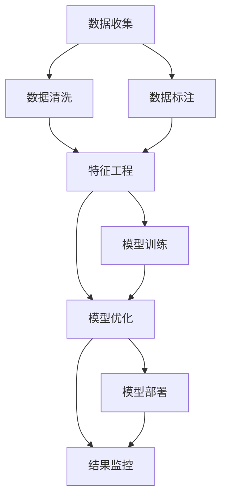
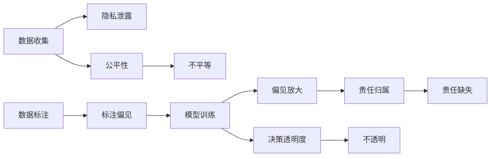
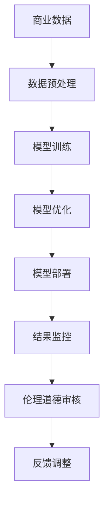

                 

# AI驱动的创新：人类计算在商业中的道德考虑因素展望分析预测

## 1. 背景介绍

### 1.1 问题由来
人工智能（AI）的快速发展正深刻地改变着商业领域，带来前所未有的机会与挑战。AI技术在提高效率、优化决策、增强客户体验等方面展现出巨大的潜力，但也伴随着一系列伦理和道德问题。在AI驱动的创新中，如何确保技术的道德边界，促进商业可持续发展，成为当前讨论的热点话题。

### 1.2 问题核心关键点
AI驱动的商业创新，主要是通过机器学习、深度学习等算法，利用海量数据和计算资源，提取、分析、应用数据中的规律和趋势，以驱动业务决策和运营。然而，这一过程中涉及到的数据收集、算法设计、模型训练、结果应用等多个环节，均可能对个体隐私、社会公平、职业安全等伦理道德问题产生影响。因此，如何在确保AI创新的同时，合理考虑并解决这些伦理道德问题，是当前商业应用AI技术必须面对的核心挑战。

### 1.3 问题研究意义
探讨AI驱动的商业创新中的伦理道德问题，对于保障AI技术的安全、公正、透明使用，促进其健康发展，具有重要意义：
1. **保障个人隐私**：确保用户数据的安全和隐私保护，避免信息滥用。
2. **促进社会公平**：避免AI技术在应用过程中造成的不公平现象，如就业歧视、算法偏见等。
3. **提高系统透明**：增强AI决策过程的透明度，让用户理解并信任AI系统的行为。
4. **增强责任意识**：明确AI开发和应用各方的责任，防止责任推诿和滥用。
5. **推动法规建设**：促进相关法律法规的完善，为AI技术应用提供法律保障。

## 2. 核心概念与联系

### 2.1 核心概念概述

为更好地理解AI驱动的商业创新中的伦理道德问题，本节将介绍几个关键概念：

- **人工智能（AI）**：指通过机器学习、深度学习等算法，使机器具备类似于人类智能的处理和决策能力。
- **机器学习（ML）**：指通过数据训练，使机器能够自动学习和改进，而无需明确编程。
- **深度学习（DL）**：一种特殊的机器学习技术，通过构建多层神经网络，实现对复杂数据的有效学习和处理。
- **伦理道德**：指在人工智能应用过程中，应遵循的一系列道德准则和社会规范。
- **隐私保护**：指对个人信息的保护，防止未经授权的访问和使用。
- **公平性**：指AI系统在处理不同群体数据时的公正性，避免算法偏见。

### 2.2 概念间的关系

这些核心概念之间存在着紧密的联系，形成了AI驱动的商业创新的整体框架。下面通过几个Mermaid流程图来展示这些概念之间的关系。

#### 2.2.1 AI驱动的商业创新框架



这个流程图展示了AI驱动的商业创新的一般流程：首先收集并清洗数据，然后对数据进行标注和特征工程，接着训练和优化模型，最后部署模型并监控结果。在每个环节中，都可能涉及到伦理道德问题的考虑。

#### 2.2.2 伦理道德问题的具体表现



这个流程图展示了伦理道德问题的具体表现形式。例如，数据收集可能涉及隐私泄露，标注数据可能存在偏见，模型训练和优化可能放大偏见，模型部署后可能造成决策不透明和责任归属问题。

### 2.3 核心概念的整体架构

最后，我们用一个综合的流程图来展示这些核心概念在大规模商业应用中的整体架构：



这个综合流程图展示了从数据预处理到模型部署再到结果监控的全过程，并强调了伦理道德审核和反馈调整的重要性。只有在整个过程中持续关注伦理道德问题，才能确保AI驱动的商业创新不会偏离正确的轨道。

## 3. 核心算法原理 & 具体操作步骤
### 3.1 算法原理概述

AI驱动的商业创新，主要涉及以下几个核心算法：

- **数据预处理**：对原始数据进行清洗、归一化、特征工程等操作，确保数据质量。
- **模型训练**：通过机器学习或深度学习算法，训练模型以识别数据中的规律和趋势。
- **模型优化**：通过调整模型结构、优化参数等手段，提升模型性能。
- **模型部署**：将训练好的模型集成到实际商业应用中。
- **结果监控**：实时监控模型输出，确保其符合预期并及时调整。

这些算法的核心目标是通过数据的有效处理和模型的优化，最大化AI技术的商业价值。然而，在每个步骤中，都需考虑相应的伦理道德问题。

### 3.2 算法步骤详解

以下是AI驱动的商业创新中，从数据预处理到结果监控的详细步骤：

#### 3.2.1 数据预处理

1. **数据收集**：确保数据的合法性和隐私保护，避免侵犯用户隐私。
2. **数据清洗**：去除噪声和异常值，确保数据质量。
3. **数据标注**：为数据打上标签，以便后续训练。标注过程中应避免偏见和歧视。
4. **特征工程**：提取、组合、选择特征，以提高模型性能。

#### 3.2.2 模型训练

1. **模型选择**：选择适合的算法和模型结构。
2. **参数设置**：合理设置学习率、批大小等超参数。
3. **训练迭代**：通过前向传播和反向传播，不断更新模型参数。

#### 3.2.3 模型优化

1. **超参数调优**：通过交叉验证等手段，优化模型超参数。
2. **模型融合**：结合多个模型，提升整体性能。
3. **正则化**：避免过拟合，提高模型泛化能力。

#### 3.2.4 模型部署

1. **模型集成**：将训练好的模型集成到实际应用中。
2. **接口设计**：设计易于调用的API或服务接口。
3. **部署部署**：选择合适的部署平台，确保模型可用性。

#### 3.2.5 结果监控

1. **性能评估**：实时监控模型输出，评估其性能。
2. **异常检测**：检测模型输出中的异常情况，及时调整。
3. **反馈调整**：根据监控结果，调整模型和数据。

### 3.3 算法优缺点

AI驱动的商业创新中的算法，具有以下优点：

- **高效性**：通过自动化学习和优化，大幅提高数据处理和模型训练的效率。
- **精度高**：利用大数据和复杂算法，能够精准地识别和预测数据中的规律和趋势。
- **可扩展性**：算法和模型可以轻松扩展到大规模数据和复杂任务。

然而，这些算法也存在以下缺点：

- **数据依赖性高**：依赖高质量的数据，否则可能导致模型表现不佳。
- **黑盒性**：模型的内部工作机制复杂，难以解释和理解。
- **伦理道德风险**：在数据收集、模型训练和应用过程中，可能涉及伦理道德问题，如隐私泄露、偏见放大等。

### 3.4 算法应用领域

AI驱动的商业创新，已经在多个领域得到了广泛应用：

- **金融行业**：利用AI进行风险评估、欺诈检测、客户服务等。
- **医疗健康**：利用AI进行疾病诊断、治疗方案推荐、健康管理等。
- **零售电商**：利用AI进行个性化推荐、库存管理、客户分析等。
- **制造制造**：利用AI进行质量检测、生产优化、供应链管理等。
- **能源环保**：利用AI进行能效优化、环境监测、资源管理等。

## 4. 数学模型和公式 & 详细讲解 & 举例说明

### 4.1 数学模型构建

在AI驱动的商业创新中，数学模型构建是至关重要的。这里我们以一个简单的线性回归模型为例，展示模型的构建过程。

设训练集为 $(x_i,y_i)$，$i=1,2,\ldots,N$，其中 $x$ 为自变量，$y$ 为因变量。线性回归模型的目标是最小化预测误差，即：

$$
\min_{\theta} \sum_{i=1}^N (y_i - \theta_0 - \theta_1 x_i)^2
$$

其中，$\theta_0$ 为截距，$\theta_1$ 为斜率。使用最小二乘法求解，得到：

$$
\hat{\theta} = (\mathbf{X}^T\mathbf{X})^{-1}\mathbf{X}^T\mathbf{y}
$$

其中 $\mathbf{X}$ 为自变量矩阵，$\mathbf{y}$ 为因变量向量。

### 4.2 公式推导过程

线性回归模型的推导过程如下：

1. **误差计算**：定义误差函数 $J(\theta) = \frac{1}{2N}\sum_{i=1}^N (y_i - \hat{y}_i)^2$，其中 $\hat{y}_i = \theta_0 + \theta_1 x_i$。
2. **梯度下降**：对误差函数求导，得到梯度 $\frac{\partial J(\theta)}{\partial \theta} = \frac{1}{N}\mathbf{X}^T(\mathbf{X}\mathbf{\theta} - \mathbf{y})$。
3. **求解最优解**：利用梯度下降算法，求解 $\theta$，使得 $J(\theta)$ 最小化。

### 4.3 案例分析与讲解

以一个简单的预测房价问题为例，展示线性回归模型的应用。

设某地区的历史房价数据如下：

| 房间数 | 售价（万元） |
| ------ | ----------- |
| 1      | 300         |
| 2      | 450         |
| 3      | 600         |
| 4      | 750         |

假设有一个新房子，面积为120平方米，房间数为3。使用线性回归模型预测其售价：

1. **数据准备**：将房间数作为自变量 $x$，售价作为因变量 $y$，构建数据集。
2. **模型训练**：使用最小二乘法求解 $\theta_0$ 和 $\theta_1$，得到模型 $\hat{y} = \theta_0 + \theta_1 x$。
3. **预测房价**：将新房子的房间数 $x=3$ 代入模型，得到预测售价。

## 5. 项目实践：代码实例和详细解释说明

### 5.1 开发环境搭建

在进行AI驱动的商业创新中的伦理道德问题研究前，我们需要准备好开发环境。以下是使用Python进行Scikit-learn开发的环境配置流程：

1. 安装Anaconda：从官网下载并安装Anaconda，用于创建独立的Python环境。

2. 创建并激活虚拟环境：
```bash
conda create -n sklearn-env python=3.8 
conda activate sklearn-env
```

3. 安装Scikit-learn：
```bash
pip install scikit-learn
```

4. 安装各类工具包：
```bash
pip install numpy pandas matplotlib seaborn sklearn tqdm jupyter notebook ipython
```

完成上述步骤后，即可在`sklearn-env`环境中开始伦理道德问题的研究实践。

### 5.2 源代码详细实现

以下是一个简单的Python代码示例，展示如何使用Scikit-learn进行线性回归模型训练，并分析其伦理道德问题。

```python
from sklearn.linear_model import LinearRegression
import numpy as np

# 数据集
X = np.array([[1], [2], [3], [4]])
y = np.array([300, 450, 600, 750])

# 训练模型
model = LinearRegression()
model.fit(X, y)

# 预测新数据
new_X = np.array([3])
new_y = model.predict(new_X)

# 输出预测结果
print(f"预测房价为：{new_y:.2f}万元")
```

### 5.3 代码解读与分析

让我们再详细解读一下关键代码的实现细节：

**数据准备**：
- 使用NumPy库创建自变量和因变量数组，构建数据集。

**模型训练**：
- 使用Scikit-learn库中的LinearRegression模型进行线性回归训练。
- 使用`fit`方法拟合数据，求解模型参数。

**预测房价**：
- 使用`predict`方法对新数据进行预测。

**输出预测结果**：
- 打印预测房价结果，保留两位小数。

## 6. 实际应用场景

### 6.1 金融行业

AI驱动的商业创新在金融行业中的应用广泛，主要体现在风险评估、欺诈检测、客户服务等。然而，这些应用也涉及到了数据隐私、算法偏见等伦理道德问题。

#### 6.1.1 风险评估

金融风险评估是金融行业的重要应用，通过AI模型对客户的信用风险、市场风险等进行预测和评估。然而，在数据收集和处理过程中，可能涉及用户隐私和敏感信息，如身份证号码、信用卡号码等。因此，金融机构需要采取严格的隐私保护措施，确保数据的安全性和合规性。

#### 6.1.2 欺诈检测

AI模型在金融欺诈检测中发挥了重要作用，通过分析交易记录、用户行为等数据，及时发现异常交易和欺诈行为。然而，如果模型存在偏见，可能对某些群体产生歧视，导致不公平的欺诈检测结果。因此，金融机构需要在模型训练和应用过程中，确保数据的公平性和模型的透明性。

#### 6.1.3 客户服务

AI驱动的客户服务，通过自然语言处理技术，实现自动客服和智能推荐。然而，如果模型不能准确理解和处理客户的意图，可能会导致服务质量下降，甚至引发客户不满。因此，金融机构需要持续优化模型，提高其准确性和可靠性。

### 6.2 医疗健康

AI驱动的商业创新在医疗健康领域的应用，主要体现在疾病诊断、治疗方案推荐、健康管理等方面。然而，这些应用也涉及到数据隐私、算法公平性等伦理道德问题。

#### 6.2.1 疾病诊断

AI模型在医疗诊断中发挥了重要作用，通过分析病人的病历、影像等数据，提供初步的诊断建议。然而，在数据收集和处理过程中，可能涉及病人的敏感信息，如病历记录、影像数据等。因此，医疗机构需要采取严格的隐私保护措施，确保数据的安全性和合规性。

#### 6.2.2 治疗方案推荐

AI模型在治疗方案推荐中发挥了重要作用，通过分析病人的病情、病史等数据，提供个性化的治疗方案。然而，如果模型存在偏见，可能对某些病人产生歧视，导致不公平的治疗方案推荐。因此，医疗机构需要在模型训练和应用过程中，确保数据的公平性和模型的透明性。

#### 6.2.3 健康管理

AI驱动的健康管理，通过分析病人的生理数据、生活习惯等，提供个性化的健康建议。然而，如果模型不能准确理解和处理病人的健康数据，可能会导致健康建议的误导。因此，医疗机构需要持续优化模型，提高其准确性和可靠性。

### 6.3 零售电商

AI驱动的商业创新在零售电商领域的应用，主要体现在个性化推荐、库存管理、客户分析等方面。然而，这些应用也涉及到用户隐私、算法公平性等伦理道德问题。

#### 6.3.1 个性化推荐

AI模型在个性化推荐中发挥了重要作用，通过分析用户的购买记录、浏览行为等数据，提供个性化的商品推荐。然而，在数据收集和处理过程中，可能涉及用户的隐私信息。因此，电商公司需要采取严格的隐私保护措施，确保用户数据的安全性和合规性。

#### 6.3.2 库存管理

AI模型在库存管理中发挥了重要作用，通过分析销售数据、市场需求等，优化库存管理和补货策略。然而，如果模型存在偏见，可能对某些商品产生歧视，导致不公平的库存管理结果。因此，电商公司需要在模型训练和应用过程中，确保数据的公平性和模型的透明性。

#### 6.3.3 客户分析

AI模型在客户分析中发挥了重要作用，通过分析客户的购买行为、兴趣爱好等，提供个性化的客户服务。然而，如果模型不能准确理解和处理客户的兴趣和需求，可能会导致客户体验下降，甚至引发客户流失。因此，电商公司需要持续优化模型，提高其准确性和可靠性。

### 6.4 未来应用展望

随着AI技术的不断进步，其在商业应用中的伦理道德问题也将愈发复杂和多样化。未来，AI驱动的商业创新将面临以下挑战：

#### 6.4.1 数据隐私保护

数据隐私保护将成为AI应用中的重要课题。如何在保护用户隐私的前提下，充分利用数据价值，将是未来研究的热点方向。

#### 6.4.2 算法公平性

算法公平性是AI应用中的核心问题。如何在模型训练和应用过程中，确保不同群体的公平性，避免算法偏见和歧视，将是未来研究的重要目标。

#### 6.4.3 模型透明性

模型透明性是AI应用中的关键问题。如何增强AI模型的透明性和可解释性，让用户理解和信任模型的决策过程，将是未来研究的关键方向。

#### 6.4.4 伦理法规建设

伦理法规建设是AI应用中的重要保障。如何在法律框架下，规范AI应用的行为，确保其安全、公正、透明，将是未来研究的重要任务。

## 7. 工具和资源推荐

### 7.1 学习资源推荐

为了帮助开发者系统掌握AI驱动的商业创新中的伦理道德问题，这里推荐一些优质的学习资源：

1. 《机器学习实战》：李航著，深入浅出地介绍了机器学习的基本概念和实现方法，适合初学者入门。
2. 《深度学习》：Ian Goodfellow等著，全面介绍了深度学习的基本原理和应用，是深度学习领域的经典教材。
3. 《人工智能伦理导论》：Richard S. Sutton等著，探讨了人工智能中的伦理问题，如隐私、公平性、透明性等。
4. 《伦理AI》：Juergen Schmidhuber等著，讨论了AI伦理学的基本理论和实践应用。
5. 《AI技术应用伦理》：石忠信等著，详细介绍了AI技术在各行业中的应用伦理问题。

通过对这些资源的学习实践，相信你一定能够快速掌握AI驱动的商业创新中的伦理道德问题的精髓，并用于解决实际的伦理道德问题。

### 7.2 开发工具推荐

高效的开发离不开优秀的工具支持。以下是几款用于AI驱动的商业创新中的伦理道德问题研究的常用工具：

1. Python：作为最流行的编程语言之一，Python拥有丰富的第三方库和框架，非常适合数据科学和机器学习任务。
2. Scikit-learn：一个基于Python的机器学习库，提供了简单易用的API，支持各种机器学习算法。
3. TensorFlow：一个开源的机器学习库，由Google开发，支持深度学习模型的构建和训练。
4. PyTorch：一个开源的深度学习框架，由Facebook开发，支持动态计算图和GPU加速。
5. Jupyter Notebook：一个交互式笔记本，支持Python代码的编写和运行，适合数据科学和机器学习任务。

合理利用这些工具，可以显著提升AI驱动的商业创新中的伦理道德问题研究的开发效率，加快创新迭代的步伐。

### 7.3 相关论文推荐

AI驱动的商业创新中的伦理道德问题，是一个前沿的研究领域，涉及多个学科的交叉。以下是几篇奠基性的相关论文，推荐阅读：

1. "Algorithmic Fairness through Preferential Treatment to the Marginalized"（通过偏爱边缘化群体来提高算法公平性），Michal Kosowicz等著，探讨了如何通过算法设计，确保不同群体的公平性。
2. "Explainable AI: Interpretable Machine Learning for Black Box Models and Complex Systems"（可解释AI：黑盒模型的可解释性机器学习），Jielun Wang等著，讨论了如何增强AI模型的透明性和可解释性。
3. "Bias in Machine Learning"（机器学习中的偏见），Sherman Krishnan等著，分析了机器学习中常见偏见的原因和解决方法。
4. "A Survey on Ethical and Social Implications of Artificial Intelligence"（人工智能伦理与社会影响综述），Sumantra Das等著，讨论了人工智能在各领域中的伦理和社会影响。
5. "Ethics of AI and Autonomous Systems"（人工智能与自主系统的伦理），Walter D. Haas等著，讨论了人工智能和自主系统的伦理问题。

这些论文代表了大规模商业应用中AI驱动的伦理道德问题的发展脉络。通过学习这些前沿成果，可以帮助研究者把握学科前进方向，激发更多的创新灵感。

## 8. 总结：未来发展趋势与挑战

### 8.1 总结

本文对AI驱动的商业创新中的伦理道德问题进行了全面系统的介绍。首先阐述了AI驱动的商业创新的背景和意义，明确了伦理道德问题在其中的重要性。其次，从算法原理到具体实现，详细讲解了AI驱动的商业创新中的伦理道德问题的各个环节，给出了研究实践的完整代码实例。同时，本文还广泛探讨了AI驱动的商业创新在金融、医疗、零售等领域的实际应用，展示了其广阔的前景。最后，本文精选了伦理道德问题的各类学习资源，力求为读者提供全方位的技术指引。

通过本文的系统梳理，可以看到，AI驱动的商业创新在带来巨大商业价值的同时，也伴随着一系列伦理道德问题。如何在确保技术创新的同时，合理解决这些伦理道德问题，是未来研究的重要方向。

### 8.2 未来发展趋势

展望未来，AI驱动的商业创新中的伦理道德问题将呈现以下几个发展趋势：

#### 8.2.1 数据隐私保护

数据隐私保护将成为AI应用中的重要课题。未来，将有更多的法律法规和技术手段，保障用户数据的隐私和安全。

#### 8.2.2 算法公平性

算法公平性是AI应用中的核心问题。未来，将有更多的算法设计和技术手段，确保不同群体的公平性，避免算法偏见和歧视。

#### 8.2.3 模型透明性

模型透明性是AI应用中的关键问题。未来，将有更多的技术手段和工具，增强AI模型的透明性和可解释性。

#### 8.2.4 伦理法规建设

伦理法规建设是AI应用中的重要保障。未来，将有更多的法律法规和技术标准，规范AI应用的行为，确保其安全、公正、透明。

### 8.3 面临的挑战

尽管AI驱动的商业创新在伦理道德问题上已经取得了一定进展，但在迈向更加智能化、普适化应用的过程中，仍然面临诸多挑战：

#### 8.3.1 数据隐私保护

数据隐私保护是AI应用中的重要课题。如何平衡数据利用与隐私保护，将是未来研究的重要方向。

#### 8.3.2 算法公平性

算法公平性是AI应用中的核心问题。如何在模型训练和应用过程中，确保不同群体的公平性，避免算法偏见和歧视，将是未来研究的重要目标。

#### 8.3.3 模型透明性

模型透明性是AI应用中的关键问题。如何增强AI模型的透明性和可解释性，让用户理解和信任模型的决策过程，将是未来研究的关键方向。

#### 8.3.4 伦理法规建设

伦理法规建设是AI应用中的重要保障。如何在法律框架下，规范AI应用的行为，确保其安全、公正、透明，将是未来研究的重要任务。

### 8.4 研究展望

面向未来，AI驱动的商业创新中的伦理道德问题需要在以下几个方面寻求新的突破：

#### 8.4.1 数据隐私保护

探索隐私保护技术和隐私保护方法，如差分隐私、同态加密等，在保障用户隐私的前提下，充分利用数据价值。

#### 8.4.2 算法公平性

开发更加公平的算法，如公平性算法、偏见检测和纠正算法等，确保不同群体的公平性，避免算法偏见和歧视。

#### 8.4.3 模型透明性

结合符号化表示和可解释性技术，如因果推断、可解释AI等，增强AI模型的透明性和可解释性，提高模型的可信度。

#### 8.4.4 伦理法规建设

推动伦理法规的完善，建立AI应用的行为准则和规范，确保其安全、公正、透明，促进AI技术的健康发展。

这些研究方向的探索，必将引领AI驱动的商业创新中的伦理道德问题走向更高的台阶，为构建安全、可靠、可解释、可控的智能系统铺平道路。面向未来，AI驱动的商业创新中的伦理道德问题还需要与其他人工智能技术进行更深入的融合，如知识表示、因果推理、强化学习等，多路径协同发力，共同推动自然语言理解和智能交互系统的进步。只有勇于创新、敢于突破，才能不断拓展AI技术的应用边界，让智能技术更好地造福人类社会。

## 9. 附录：常见问题与解答

**Q1：如何平衡数据利用与隐私保护？**

A: 数据隐私保护是AI应用中的重要课题。为了平衡数据利用与隐私保护，可以采用

