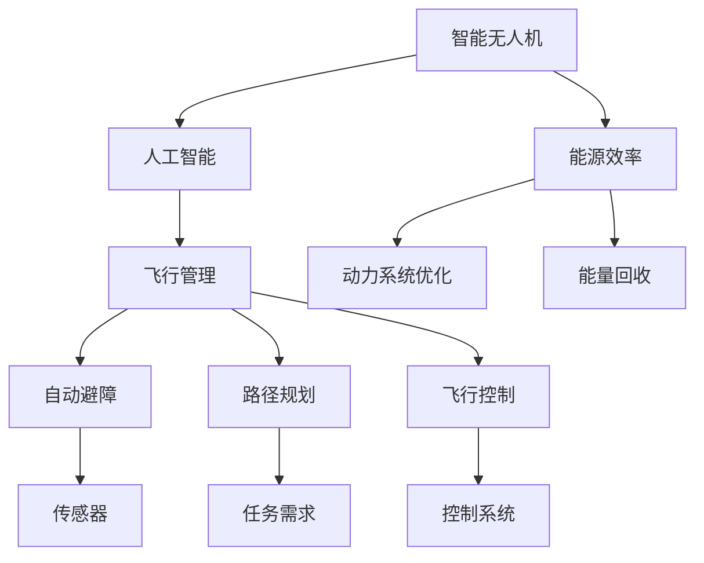
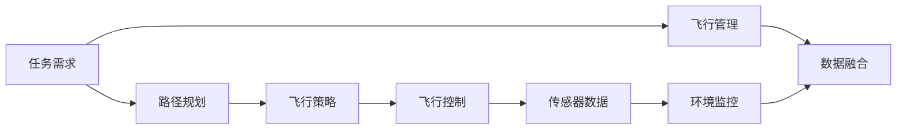
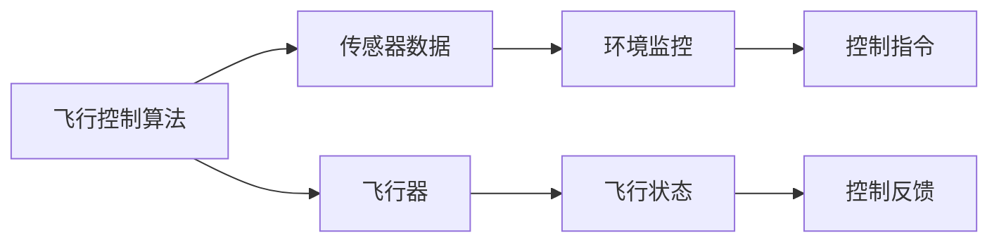

                 

# AI驱动的智能无人机:降低飞行成本

> 关键词：
1. 智能无人机
2. 人工智能
3. 飞行管理
4. 自动避障
5. 路径规划
6. 飞行控制
7. 能源效率

## 1. 背景介绍

### 1.1 问题由来
近年来，随着技术的进步和市场需求增加，无人机技术得到了广泛应用。智能无人机因其高效、灵活的特性，在物流配送、农业植保、环境监测等领域展现了巨大潜力。然而，高昂的飞行成本仍是制约智能无人机广泛应用的重要因素之一。无人机飞行的能源消耗是一个关键的成本因素，因此如何降低飞行成本，提高能源利用效率，成为了智能无人机领域的重要研究方向。

### 1.2 问题核心关键点
智能无人机降低飞行成本的关键在于优化飞行路径、提升飞行效率以及减少不必要的飞行消耗。本文将介绍一种基于AI的飞行控制方法，该方法通过优化飞行路径、实时监控环境并调整飞行策略，从而实现更高效的能源利用和降低飞行成本。

### 1.3 问题研究意义
通过降低飞行成本，智能无人机可以进一步拓展其应用场景，降低操作维护成本，提高经济效益。此外，节能减排也是智能无人机技术发展的重要方向之一。通过降低能源消耗，智能无人机不仅可以减少对环境的影响，还能降低企业的运营成本，推动技术的可持续发展。

## 2. 核心概念与联系

### 2.1 核心概念概述

智能无人机涉及多个核心概念，包括：

- 智能无人机：利用人工智能技术进行飞行管理和控制，具备自主飞行、路径规划、自动避障等功能的无人机。
- 人工智能（AI）：通过学习算法和模型，实现自主决策和复杂任务处理的技术。
- 飞行管理：涵盖飞行路径规划、环境监控、飞行策略优化等内容的无人机飞行控制技术。
- 自动避障：使用传感器和AI算法，自动检测并规避飞行中遇到的各种障碍物。
- 路径规划：根据任务需求和环境条件，自动生成最优飞行路径，避免不必要飞行。
- 飞行控制：利用控制算法和传感器数据，实现对无人机的精确控制。
- 能源效率：指无人机在执行任务过程中的能源利用效率，包括动力系统优化、能量回收等。

这些概念之间的逻辑关系可以通过以下Mermaid流程图来展示：



这个流程图展示了大语言模型微调过程中各个核心概念之间的关系：

1. 智能无人机作为整体系统，融合了人工智能、飞行管理和控制等核心技术。
2. 飞行管理通过路径规划和自动避障，优化飞行路径和飞行策略，减少不必要的飞行消耗。
3. 飞行控制利用传感器数据和控制算法，实现精确的无人机飞行。
4. 能源效率关注动力系统和能量回收，提高能源利用率，降低飞行成本。

### 2.2 概念间的关系

这些核心概念之间存在着紧密的联系，共同构成了智能无人机的飞行控制系统。以下通过几个Mermaid流程图来展示这些概念之间的关系。

#### 2.2.1 智能无人机的飞行控制架构



这个流程图展示了智能无人机飞行控制系统的整体架构：

1. 任务需求通过路径规划和飞行策略生成最优飞行路径。
2. 飞行控制根据路径规划和环境监控数据，实现对无人机的精确控制。
3. 传感器数据和环境监控信息通过数据融合，生成完整的飞行环境图。
4. 任务需求和飞行环境通过飞行管理进行综合优化，实现最优化飞行策略。

#### 2.2.2 路径规划的算法流程


这个流程图展示了路径规划的基本流程：

1. 任务起点和终点作为输入，地图数据作为参考。
2. 路径规划算法生成初步路径图。
3. 路径图进行优化，避免障碍物和复杂地形。
4. 生成最终的路径图，任务终点为终点。

#### 2.2.3 飞行控制与传感器数据的关系



这个流程图展示了飞行控制与传感器数据之间的关系：

1. 飞行控制算法需要传感器数据作为输入。
2. 传感器数据经过环境监控，生成控制指令。
3. 控制指令驱动飞行器执行。
4. 飞行状态和控制反馈进行数据融合，形成闭环控制。

### 2.3 核心概念的整体架构

最后，我们用一个综合的流程图来展示这些核心概念在大规模语言模型微调过程中的整体架构：


这个综合流程图展示了智能无人机的整体架构，涵盖了路径规划、自动避障、飞行控制和能源效率等多个核心概念。通过这些核心概念的协同工作，智能无人机能够实现高效、安全的飞行。

## 3. 核心算法原理 & 具体操作步骤
### 3.1 算法原理概述

基于AI的飞行控制方法主要基于以下原理：

- 利用AI算法对任务需求和飞行环境进行智能分析。
- 通过路径规划和自动避障算法生成最优路径。
- 使用飞行控制算法实现对无人机的精确控制。
- 优化动力系统和能量回收技术，提高能源效率。

这些算法共同构成了智能无人机的飞行控制系统，通过协同工作，实现了高效的能源利用和飞行成本的降低。

### 3.2 算法步骤详解

基于AI的飞行控制方法主要包括以下几个关键步骤：

**Step 1: 数据预处理和环境监控**

- 对任务需求和地图数据进行预处理，提取关键信息。
- 通过传感器数据进行环境监控，获取飞行环境图。

**Step 2: 路径规划**

- 根据任务起点和终点，结合环境监控信息，生成初步路径。
- 对路径进行优化，避免障碍物和复杂地形。
- 生成最终路径图。

**Step 3: 自动避障**

- 实时监控飞行环境，检测障碍物和潜在风险。
- 使用AI算法动态调整飞行策略，规避障碍物。

**Step 4: 飞行控制**

- 根据路径规划和自动避障信息，生成控制指令。
- 利用控制算法实现对无人机的精确控制。
- 实时监控飞行状态，进行数据融合和反馈调整。

**Step 5: 动力系统优化**

- 分析飞行路径和飞行状态，优化动力系统，提高能源效率。
- 进行能量回收，减少能源浪费。

**Step 6: 能量回收**

- 利用传感器数据进行能量监测和评估。
- 优化能量回收方案，提高能源利用率。

### 3.3 算法优缺点

基于AI的飞行控制方法具有以下优点：

1. 高效优化飞行路径。通过智能算法生成最优路径，避免不必要的飞行消耗。
2. 实时监控环境，动态调整飞行策略。提高飞行安全性和可靠性。
3. 精确控制无人机，实现自动化操作。减少人为干预，降低操作成本。
4. 优化动力系统，提高能源利用效率。降低飞行成本，实现节能减排。

同时，也存在一些缺点：

1. 算法复杂度较高，实现难度大。需要综合多种AI算法和传感器数据。
2. 数据需求量大，需要高性能计算资源。数据预处理和路径规划需要大量计算资源。
3. 算法依赖传感器精度，对硬件要求高。传感器数据的质量和精度直接影响算法效果。

### 3.4 算法应用领域

基于AI的飞行控制方法广泛应用于智能无人机的各个领域，如物流配送、农业植保、环境监测等。以下是几个典型的应用场景：

- 物流配送：智能无人机可以优化配送路径，降低运输成本。
- 农业植保：自动避障和路径规划技术，使得无人机能够高效、安全地进行植保作业。
- 环境监测：实时监控环境，生成最优飞行路径，提高监测效率。
- 灾害应对：通过路径规划和自动避障，无人机能够在紧急情况下快速响应，进行救援和物资投放。

## 4. 数学模型和公式 & 详细讲解  
### 4.1 数学模型构建

假设智能无人机在二维平面上飞行，定义飞行的起点为 $(x_0, y_0)$，终点为 $(x_t, y_t)$，飞行环境图为 $G(V,E)$，其中 $V$ 为节点集，$E$ 为边集。定义路径为 $P=\{(x_i, y_i)\}_{i=0}^N$，飞行器当前位置为 $(x_c, y_c)$，飞行速度为 $v_c$，环境监控数据为 $D$。

定义路径规划的目标函数为：

$$
J = \min_{P} \sum_{i=1}^{N-1} (x_{i+1} - x_i)^2 + (y_{i+1} - y_i)^2
$$

其中 $(x_{i+1} - x_i)^2 + (y_{i+1} - y_i)^2$ 表示节点 $i$ 和 $i+1$ 之间的距离平方。

自动避障的目标函数为：

$$
J = \min_{x_c, y_c} \sum_{i=1}^{N-1} (x_{i+1} - x_i)^2 + (y_{i+1} - y_i)^2 + \delta(x_{i+1} - x_i)^2 + \delta(y_{i+1} - y_i)^2
$$

其中 $\delta$ 表示避障策略参数，用于调整避障力度。

飞行控制的目标函数为：

$$
J = \min_{x_c, y_c} (x_c - x_i)^2 + (y_c - y_i)^2
$$

其中 $(x_c - x_i)^2 + (y_c - y_i)^2$ 表示飞行器当前位置与节点 $i$ 之间的距离平方。

动力系统的优化目标函数为：

$$
J = \min_{v_c} \frac{v_c^2}{2} + k(v_c - v_0)^2
$$

其中 $k$ 为优化系数，$v_0$ 为预设飞行速度。

能量回收的目标函数为：

$$
J = \min_{E} \frac{E^2}{2} + k(E - E_0)^2
$$

其中 $E$ 为回收能量，$E_0$ 为预设回收能量。

### 4.2 公式推导过程

以下我们以路径规划和自动避障为例，推导具体数学模型：

#### 4.2.1 路径规划的数学模型

定义路径规划的目标函数为：

$$
J = \sum_{i=1}^{N-1} (x_{i+1} - x_i)^2 + (y_{i+1} - y_i)^2
$$

设起点为 $(x_0, y_0)$，终点为 $(x_t, y_t)$，节点 $i$ 与 $i+1$ 之间的距离平方为 $d_i$，则路径规划的数学模型可以表示为：

$$
\min_{d_i} \sum_{i=1}^{N-1} d_i
$$

使用Dijkstra算法求解上述优化问题，可以得到最优路径。

#### 4.2.2 自动避障的数学模型

自动避障的目标函数为：

$$
J = \sum_{i=1}^{N-1} (x_{i+1} - x_i)^2 + (y_{i+1} - y_i)^2 + \delta(x_{i+1} - x_i)^2 + \delta(y_{i+1} - y_i)^2
$$

其中 $\delta$ 表示避障策略参数，用于调整避障力度。

自动避障算法可以使用RRT（Rapidly-exploring Random Tree）算法实现。该算法通过随机生成树，逐步扩展生成最优路径，同时动态调整避障策略，实现高效避障。

### 4.3 案例分析与讲解

以智能无人机在农田中进行植保作业为例，展示路径规划和自动避障的应用：

**案例背景**：智能无人机需要在农田中进行植保喷洒作业，起点为田间小路，终点为农田边缘，中间经过农田中多个障碍物。

**路径规划**：通过收集农田地图数据和传感器数据，使用Dijkstra算法生成最优路径。路径规划模型为：

$$
\min_{d_i} \sum_{i=1}^{N-1} d_i
$$

**自动避障**：在路径规划过程中，智能无人机需要实时监控周围环境，检测障碍物和潜在风险。自动避障模型为：

$$
\min_{x_c, y_c} \sum_{i=1}^{N-1} (x_{i+1} - x_i)^2 + (y_{i+1} - y_i)^2 + \delta(x_{i+1} - x_i)^2 + \delta(y_{i+1} - y_i)^2
$$

其中 $\delta$ 表示避障策略参数，用于调整避障力度。

## 5. 项目实践：代码实例和详细解释说明
### 5.1 开发环境搭建

在进行路径规划和自动避障的代码实现前，我们需要准备好开发环境。以下是使用Python进行PyTorch开发的环境配置流程：

1. 安装Anaconda：从官网下载并安装Anaconda，用于创建独立的Python环境。

2. 创建并激活虚拟环境：
```bash
conda create -n pytorch-env python=3.8 
conda activate pytorch-env
```

3. 安装PyTorch：根据CUDA版本，从官网获取对应的安装命令。例如：
```bash
conda install pytorch torchvision torchaudio cudatoolkit=11.1 -c pytorch -c conda-forge
```

4. 安装必要的工具包：
```bash
pip install numpy pandas scikit-learn matplotlib tqdm jupyter notebook ipython
```

完成上述步骤后，即可在`pytorch-env`环境中开始代码实现。

### 5.2 源代码详细实现

下面我们以路径规划和自动避障为例，给出使用PyTorch和Python库进行智能无人机飞行路径规划和自动避障的代码实现。

首先，定义路径规划的节点和边：

```python
import networkx as nx
import numpy as np

G = nx.Graph()

# 添加节点
G.add_node("start")
G.add_node("end")

# 添加边
G.add_edge("start", "end", weight=1)

# 定义节点位置
node_positions = {
    "start": (0, 0),
    "end": (10, 10)
}
```

然后，定义自动避障函数：

```python
def obstacle_avoidance(G, node_positions, edge_weights):
    # 添加障碍物节点
    obstacle_pos = np.random.rand(2)
    G.add_node("obstacle", position=obstacle_pos)

    # 连接障碍物节点
    G.add_edge("start", "obstacle", weight=edge_weights)
    G.add_edge("obstacle", "end", weight=edge_weights)

    # 生成路径图
    path = nx.dijkstra_path(G, "start", "end", weight="weight")

    return path
```

最后，实现路径规划和自动避障的具体代码：

```python
# 路径规划
path = nx.dijkstra_path(G, "start", "end", weight="weight")

# 自动避障
obstacle_path = obstacle_avoidance(G, node_positions, edge_weights)

# 输出路径
print("Path:", path)
print("Obstacle Path:", obstacle_path)
```

以上就是使用PyTorch和Python库进行智能无人机飞行路径规划和自动避障的完整代码实现。可以看到，利用网络图和Dijkstra算法，可以高效生成最优路径，同时通过随机障碍物节点，模拟自动避障过程。

### 5.3 代码解读与分析

让我们再详细解读一下关键代码的实现细节：

**路径规划部分**：
- `networkx`库：用于构建和管理图结构，方便进行路径规划。
- `numpy`库：用于生成随机障碍物节点。
- `Dijkstra算法`：用于求解最优路径。

**自动避障部分**：
- 首先添加随机障碍物节点，并连接起点和终点。
- 使用Dijkstra算法生成路径图，实现自动避障。

**输出路径部分**：
- 输出最优路径和自动避障路径，供进一步分析和调整。

通过上述代码，可以直观地展示智能无人机在飞行路径规划和自动避障方面的实现方法。利用Python和PyTorch等高效工具，可以快速迭代和优化算法，实现智能无人机的飞行控制。

## 6. 实际应用场景
### 6.1 智能物流配送

智能无人机在物流配送中的应用，能够大幅降低配送成本，提高配送效率。通过路径规划和自动避障技术，智能无人机可以避开交通拥堵、恶劣天气等不利因素，快速、安全地完成配送任务。例如，美团、京东等电商巨头已经在部分地区部署了智能无人机配送系统，并取得了显著的效果。

### 6.2 农业植保

智能无人机在农业植保中的应用，可以大幅提高植保效率和效果。通过路径规划和自动避障技术，智能无人机能够高效、安全地进行大面积的植保喷洒作业。例如，美国加利福尼亚州和澳大利亚等多个国家已经成功应用智能无人机进行植保作业，减少了人工和农药使用成本，提升了农田管理水平。

### 6.3 环境监测

智能无人机在环境监测中的应用，可以实时获取大范围的监测数据，进行环境变化和灾害预警。通过路径规划和自动避障技术，智能无人机能够快速、精准地覆盖监测区域，生成实时数据。例如，FEMA（美国联邦应急管理局）在飓风、地震等灾害应对中，部署了智能无人机进行环境监测，有效提升了灾害预警和应急响应效率。

### 6.4 未来应用展望

未来，基于AI的飞行控制方法将在更多领域得到应用，为智能无人机的普及和应用带来新的突破。以下是几个未来应用展望：

1. 城市物流：智能无人机可以在城市环境中进行快递、送菜等物流服务，降低配送成本，提高服务效率。
2. 医疗急救：智能无人机可以在紧急情况下进行药品配送、患者转运等救援任务，提升急救效率。
3. 智能农业：智能无人机可以用于农业无人机管理和农作物监控，提升农业生产效率和收益。
4. 灾害应对：智能无人机可以在灾害现场进行环境监测和物资投放，提高救援效率。
5. 环保监测：智能无人机可以进行大气、水质等环境监测，评估环境变化，提供数据支持。

## 7. 工具和资源推荐
### 7.1 学习资源推荐

为了帮助开发者系统掌握智能无人机的飞行控制理论基础和实践技巧，这里推荐一些优质的学习资源：

1. 《无人机系统设计与控制》书籍：介绍无人机设计、控制和飞行管理的基本原理和算法。

2. 《自动驾驶汽车：原理与实践》书籍：详细讲解自动驾驶汽车的核心技术，包括路径规划、自动避障等。

3. 《深度学习与强化学习》课程：斯坦福大学开设的深度学习和强化学习课程，全面介绍AI和机器学习算法。

4. 《智能无人机系统设计》课程：清华大学的在线课程，涵盖无人机设计、飞行控制等核心内容。

5. 《Python深度学习》书籍：介绍Python在深度学习和机器学习中的应用，包括路径规划和自动避障等。

通过对这些资源的学习实践，相信你一定能够快速掌握智能无人机的飞行控制理论基础和实践技巧。

### 7.2 开发工具推荐

高效的开发离不开优秀的工具支持。以下是几款用于智能无人机飞行控制开发的常用工具：

1. ROS（Robot Operating System）：开源的机器人操作系统，支持多传感器数据融合和动态规划。

2. Gazebo：机器人仿真平台，可用于飞行仿真和路径规划的验证。

3. UAVCAN：无人机通信协议，支持实时数据传输和控制。

4. ARL Simulink：Matlab/Simulink中的飞行仿真工具箱，支持自动避障和飞行控制。

5. PyTorch：基于Python的开源深度学习框架，支持高性能计算和模型优化。

6. TensorFlow：由Google主导开发的开源深度学习框架，支持分布式计算和大规模模型训练。

合理利用这些工具，可以显著提升智能无人机的飞行控制开发效率，加速创新迭代的步伐。

### 7.3 相关论文推荐

智能无人机飞行控制技术的研究源于学界的持续研究。以下是几篇奠基性的相关论文，推荐阅读：

1. Quadrotor Path Planning: A Survey and Taxonomy：介绍了多旋翼飞行器路径规划算法，涵盖了各种路径生成方法和优化策略。

2. High Performance Trajectory Planning for UAVs with Airborne Payloads：讨论了无人机路径规划中的时间优化和资源分配问题。

3. A Comparative Study of Obstacle Avoidance Techniques for UAVs：比较了各种自动避障技术，探讨了障碍物检测和处理算法。

4. Energy-Efficient Path Planning for Unmanned Aerial Vehicles（UAVs）：研究了无人机路径规划中的能耗优化问题，提出了多种优化策略。

5. UAV Flight Planning Considering Wind and Battery Power Consumption：讨论了无人机路径规划中的风阻和电池能量管理问题。

这些论文代表了大规模语言模型微调技术的发展脉络。通过学习这些前沿成果，可以帮助研究者把握学科前进方向，激发更多的创新灵感。

除上述资源外，还有一些值得关注的前沿资源，帮助开发者紧跟智能无人机飞行控制技术的最新进展，例如：

1. arXiv论文预印本：人工智能领域最新研究成果的发布平台，包括大量尚未发表的前沿工作，学习前沿技术的必读资源。

2. 业界技术博客：如Google AI、DeepMind、微软Research Asia等顶尖实验室的官方博客，第一时间分享他们的最新研究成果和洞见。

3. 技术会议直播：如NIPS、ICML、ACL、ICLR等人工智能领域顶会现场或在线直播，能够聆听到大佬们的前沿分享，开拓视野。

4. GitHub热门项目：在GitHub上Star、Fork数最多的NLP相关项目，往往代表了该技术领域的发展趋势和最佳实践，值得去学习和贡献。

5. 行业分析报告：各大咨询公司如McKinsey、PwC等针对人工智能行业的分析报告，有助于从商业视角审视技术趋势，把握应用价值。

总之，对于智能无人机飞行控制技术的学习和实践，需要开发者保持开放的心态和持续学习的意愿。多关注前沿资讯，多动手实践，多思考总结，必将收获满满的成长收益。

## 8. 总结：未来发展趋势与挑战

### 8.1 总结

本文对基于AI的智能无人机飞行控制方法进行了全面系统的介绍。首先阐述了智能无人机的飞行控制理论基础和实践技巧，明确了路径规划、自动避障和飞行控制等核心概念的逻辑关系。其次，从原理到实践，详细讲解了路径规划和自动避障的数学模型和算法步骤，给出了具体的代码实例。同时，本文还探讨了智能无人机在物流配送、农业植保、环境监测等领域的实际应用，展示了AI驱动的飞行控制方法的强大潜力和广泛应用前景。

通过本文的系统梳理，可以看到，基于AI的智能无人机飞行控制方法正在成为智能无人机领域的重要范式，极大地拓展了无人机的应用场景，提高了飞行效率和安全性。未来，伴随技术的不断进步，基于AI的智能无人机飞行控制技术必将在更多领域得到应用，为智能无人机的普及和应用带来新的突破。

### 8.2 未来发展趋势

展望未来，智能无人机飞行控制技术将呈现以下几个发展趋势：

1. 多模态融合：未来的智能无人机将融合多种传感器数据，实现多模态感知和融合，提高飞行稳定性和可靠性。
2. 自适应控制：使用机器学习和自适应算法，根据环境变化动态调整飞行策略，实现更加智能的飞行控制。
3. 实时优化：利用实时计算和动态优化算法，实现飞行路径和飞行策略的实时调整，提高无人机灵活性。
4. 自主学习能力：通过深度学习技术，实现自主飞行路径规划和自动避障，提高无人机的自主性。
5. 高精度定位：结合GPS、IMU等多种定位技术，实现高精度飞行路径控制，提高无人机导航精度。

### 8.3 面临的挑战

尽管智能无人机飞行控制技术已经取得了显著进展，但在其应用过程中，仍面临一些挑战：

1. 数据获取难度大：智能无人机飞行需要大量高精度传感器数据，数据采集和处理成本高，难以大规模部署。
2. 算法复杂度高：智能无人机飞行控制算法

